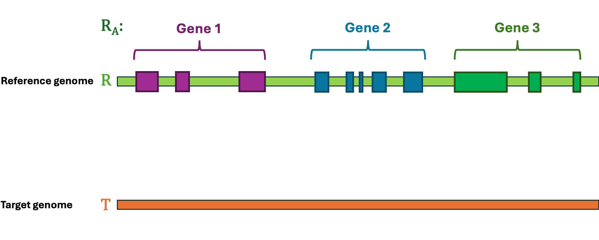

 

<section id="lifton-s-tutorial">
<embed>

 

LiftOn is a homology-based lift-over tool designed to accurately map annotations in GFF or GTF between assemblies. It is built upon the fantastic <a class="reference external" href="https://academic.oup.com/bioinformatics/article/37/12/1639/6035128?login=true">Liftoff</a> (credits to <a class="reference external" href="https://scholar.google.com/citations?user=N3tXk7QAAAAJ&amp;hl=en">Dr. Alaina Shumate</a>) and <a class="reference external" href="https://academic.oup.com/bioinformatics/article/39/1/btad014/6989621">miniprot</a> (credits to <a class="reference external" href="http://liheng.org">Dr. Heng Li</a>), and employs a <a class="reference internal" href="http://ccb.jhu.edu/lifton/content/behind_scenes.html#protein-maximization-algorithm">Protein-maximization algorithm</a> to improve the protein-coding gene lift-over process.

<section id="why-lifton" class="">
<h2>Why LiftOn❓<a class="headerlink" href="#why-lifton" title="Permalink to this heading">#</a></h2>
<ol class="arabic simple">
<li>
<strong>Burgeoning number of genome assemblies</strong>: As of December 2023, among the 15,578 distinct eukaryotic genomes, only 1,111 have been annotated (<a class="reference external" href="https://www.ncbi.nlm.nih.gov/genome/annotation_euk/#graphs">Eukaryotic Genome Annotation at NCBI</a>). More and more high quality assemblies are generated. We need to accurately annotate them.
</li>
<li>
<strong>Improved protein-coding gene mapping</strong>: The popular <a class="reference external" href="https://academic.oup.com/bioinformatics/article/37/12/1639/6035128?login=true">Liftoff</a> map genes only based on the DNA alignment. With the protein-to-genome alignment, LiftOn is able to further improve the lift-over protein-coding gene annotations. LiftOn improves the current released T2T-CHM13 annotation (<a class="reference external" href="https://s3-us-west-2.amazonaws.com/human-pangenomics/T2T/CHM13/assemblies/annotation/chm13v2.0_RefSeq_Liftoff_v5.1.gff3.gz">JHU RefSeqv110 + Liftoff v5.1</a>).
</li>
<li>
<strong>Improved distant species lift-over</strong>: LiftOn extends from lift-over between the same or closely related species to more distantly related species. See mouse_2_rat and drosophila_melanogaster_2_erecta lift-over sections.
</li>
</ol>

LiftOn is free, it's open source, it's easy to install , and it's in Python!

 

</section>
<section id="who-is-it-for" class="">
<h2>Who is it for❓<a class="headerlink" href="#who-is-it-for" title="Permalink to this heading">#</a></h2>
<ol class="arabic simple">
<li>
If you have sequenced and assembled a new genome and need to annotate it, LiftOn is the ideal choice for generating annotations.
</li>
<li>
If you want to do comparative genomics analysis, run liftOn to lift-over and compare annotations!
</li>
<li>
If you wish to utilize the finest CHM13 annotation, you can run LiftOn! We have also pre-generated the <a class="reference external" href="https://khchao.com">T2T_CHM13_LiftOn.gff3</a> file for your convenience.
</li>
</ol>

 

</section>
<section id="what-does-lifton-do" class="">
<h2>What does LiftOn do❓<a class="headerlink" href="#what-does-lifton-do" title="Permalink to this heading">#</a></h2>

Given a reference <strong>Genome</strong> <mjx-container class="MathJax CtxtMenu_Attached_0" jax="CHTML" tabindex="0" ctxtmenu_counter="0" style="font-size: 119%; position: relative;"><mjx-math class="MJX-TEX" aria-hidden="true"><mjx-mi class="mjx-i"><mjx-c class="mjx-c1D445 TEX-I"></mjx-c></mjx-mi></mjx-math><mjx-assistive-mml unselectable="on" display="inline"><math xmlns="http://www.w3.org/1998/Math/MathML"><mi>R</mi></math></mjx-assistive-mml></mjx-container>, an <strong>Annotation</strong> <mjx-container class="MathJax CtxtMenu_Attached_0" jax="CHTML" tabindex="0" ctxtmenu_counter="1" style="font-size: 119%; position: relative;"><mjx-math class="MJX-TEX" aria-hidden="true"><mjx-msub><mjx-mi class="mjx-i"><mjx-c class="mjx-c1D445 TEX-I"></mjx-c></mjx-mi><mjx-script style="vertical-align: -0.153em;"><mjx-mi class="mjx-i" size="s"><mjx-c class="mjx-c1D434 TEX-I"></mjx-c></mjx-mi></mjx-script></mjx-msub></mjx-math><mjx-assistive-mml unselectable="on" display="inline"><math xmlns="http://www.w3.org/1998/Math/MathML"><msub><mi>R</mi><mi>A</mi></msub></math></mjx-assistive-mml></mjx-container>, and a target <strong>Genome</strong> <mjx-container class="MathJax CtxtMenu_Attached_0" jax="CHTML" tabindex="0" ctxtmenu_counter="2" style="font-size: 119%; position: relative;"><mjx-math class="MJX-TEX" aria-hidden="true"><mjx-mi class="mjx-i"><mjx-c class="mjx-c1D447 TEX-I"></mjx-c></mjx-mi></mjx-math><mjx-assistive-mml unselectable="on" display="inline"><math xmlns="http://www.w3.org/1998/Math/MathML"><mi>T</mi></math></mjx-assistive-mml></mjx-container>. The lift-over problem is defined as the process of changing the coordinates of <strong>Annotation</strong> <mjx-container class="MathJax CtxtMenu_Attached_0" jax="CHTML" tabindex="0" ctxtmenu_counter="3" style="font-size: 119%; position: relative;"><mjx-math class="MJX-TEX" aria-hidden="true"><mjx-msub><mjx-mi class="mjx-i"><mjx-c class="mjx-c1D445 TEX-I"></mjx-c></mjx-mi><mjx-script style="vertical-align: -0.153em;"><mjx-mi class="mjx-i" size="s"><mjx-c class="mjx-c1D434 TEX-I"></mjx-c></mjx-mi></mjx-script></mjx-msub></mjx-math><mjx-assistive-mml unselectable="on" display="inline"><math xmlns="http://www.w3.org/1998/Math/MathML"><msub><mi>R</mi><mi>A</mi></msub></math></mjx-assistive-mml></mjx-container> from <strong>Genome</strong> <mjx-container class="MathJax CtxtMenu_Attached_0" jax="CHTML" tabindex="0" ctxtmenu_counter="4" style="font-size: 119%; position: relative;"><mjx-math class="MJX-TEX" aria-hidden="true"><mjx-mi class="mjx-i"><mjx-c class="mjx-c1D445 TEX-I"></mjx-c></mjx-mi></mjx-math><mjx-assistive-mml unselectable="on" display="inline"><math xmlns="http://www.w3.org/1998/Math/MathML"><mi>R</mi></math></mjx-assistive-mml></mjx-container> to <strong>Genome</strong> <mjx-container class="MathJax CtxtMenu_Attached_0" jax="CHTML" tabindex="0" ctxtmenu_counter="5" style="font-size: 119%; position: relative;"><mjx-math class="MJX-TEX" aria-hidden="true"><mjx-mi class="mjx-i"><mjx-c class="mjx-c1D447 TEX-I"></mjx-c></mjx-mi></mjx-math><mjx-assistive-mml unselectable="on" display="inline"><math xmlns="http://www.w3.org/1998/Math/MathML"><mi>T</mi></math></mjx-assistive-mml></mjx-container>, and generate a new annotation file <strong>Annotation</strong> <mjx-container class="MathJax CtxtMenu_Attached_0" jax="CHTML" tabindex="0" ctxtmenu_counter="6" style="font-size: 119%; position: relative;"><mjx-math class="MJX-TEX" aria-hidden="true"><mjx-msub><mjx-mi class="mjx-i"><mjx-c class="mjx-c1D447 TEX-I"></mjx-c></mjx-mi><mjx-script style="vertical-align: -0.153em; margin-left: -0.12em;"><mjx-mi class="mjx-i" size="s"><mjx-c class="mjx-c1D434 TEX-I"></mjx-c></mjx-mi></mjx-script></mjx-msub></mjx-math><mjx-assistive-mml unselectable="on" display="inline"><math xmlns="http://www.w3.org/1998/Math/MathML"><msub><mi>T</mi><mi>A</mi></msub></math></mjx-assistive-mml></mjx-container>. A simple illustration of the lift-over problem is shown in <a class="reference internal" href="#liftover-illustration">Figure 1</a>.

<figure class="align-center" id="id5">

<figcaption>

Figure 1 Illustration of the lift-over problem. The annotation file from the reference genome (top) is lifted over to the target genome (bottom).<a class="headerlink" href="#id5" title="Permalink to this image">#</a>

</figcaption>
</figure>

 

LiftOn is the best tool to help you solve this problem! LiftOn employs a two-step <a class="reference internal" href="http://ccb.jhu.edu/lifton/content/behind_scenes.html#protein-maximization-algorithm">protein maximization algorithm</a> (PM algorithm).

<ol class="arabic simple">
<li>
The first module is the <em>chaining algorithm</em>. It starts by extracting protein sequences annotated by Liftoff and miniprot. LiftOn then aligns these sequences to full-length reference proteins. For each gene locus, LiftOn compares each section of the protein alignments from Liftoff and miniprot, chaining together the best combinations.
</li>
<li>
The second module is the <em>open-reading frame search (ORF search) algorithm</em>. In the case of truncated protein-coding transcripts, this algorithm examines alternative frames to identify the ORF that produces the longest match with the reference protein.
</li>
</ol>
<ul class="simple">
<li><dl class="simple">
<dt><strong>Input</strong>:</dt><dd><ol class="arabic simple">
<li>
target <strong>Genome</strong> <mjx-container class="MathJax CtxtMenu_Attached_0" jax="CHTML" tabindex="0" ctxtmenu_counter="7" style="font-size: 119%; position: relative;"><mjx-math class="MJX-TEX" aria-hidden="true"><mjx-mi class="mjx-i"><mjx-c class="mjx-c1D447 TEX-I"></mjx-c></mjx-mi></mjx-math><mjx-assistive-mml unselectable="on" display="inline"><math xmlns="http://www.w3.org/1998/Math/MathML"><mi>T</mi></math></mjx-assistive-mml></mjx-container> in FASTA.
</li>
<li>
reference <strong>Genome</strong> <mjx-container class="MathJax CtxtMenu_Attached_0" jax="CHTML" tabindex="0" ctxtmenu_counter="8" style="font-size: 119%; position: relative;"><mjx-math class="MJX-TEX" aria-hidden="true"><mjx-mi class="mjx-i"><mjx-c class="mjx-c1D445 TEX-I"></mjx-c></mjx-mi></mjx-math><mjx-assistive-mml unselectable="on" display="inline"><math xmlns="http://www.w3.org/1998/Math/MathML"><mi>R</mi></math></mjx-assistive-mml></mjx-container> in FASTA
</li>
<li>
reference <strong>Annotation</strong> <mjx-container class="MathJax CtxtMenu_Attached_0" jax="CHTML" tabindex="0" ctxtmenu_counter="9" style="font-size: 119%; position: relative;"><mjx-math class="MJX-TEX" aria-hidden="true"><mjx-msub><mjx-mi class="mjx-i"><mjx-c class="mjx-c1D445 TEX-I"></mjx-c></mjx-mi><mjx-script style="vertical-align: -0.153em;"><mjx-mi class="mjx-i" size="s"><mjx-c class="mjx-c1D434 TEX-I"></mjx-c></mjx-mi></mjx-script></mjx-msub></mjx-math><mjx-assistive-mml unselectable="on" display="inline"><math xmlns="http://www.w3.org/1998/Math/MathML"><msub><mi>R</mi><mi>A</mi></msub></math></mjx-assistive-mml></mjx-container> in GFF3
</li>
</ol>
</dd>
</dl>
</li>
<li><dl class="simple">
<dt><strong>Output</strong>:</dt><dd><ol class="arabic simple">
<li>
LiftOn annotation file, <strong>Annotation</strong> <mjx-container class="MathJax CtxtMenu_Attached_0" jax="CHTML" tabindex="0" ctxtmenu_counter="10" style="font-size: 119%; position: relative;"><mjx-math class="MJX-TEX" aria-hidden="true"><mjx-msub><mjx-mi class="mjx-i"><mjx-c class="mjx-c1D447 TEX-I"></mjx-c></mjx-mi><mjx-script style="vertical-align: -0.153em; margin-left: -0.12em;"><mjx-mi class="mjx-i" size="s"><mjx-c class="mjx-c1D434 TEX-I"></mjx-c></mjx-mi></mjx-script></mjx-msub></mjx-math><mjx-assistive-mml unselectable="on" display="inline"><math xmlns="http://www.w3.org/1998/Math/MathML"><msub><mi>T</mi><mi>A</mi></msub></math></mjx-assistive-mml></mjx-container>, in GFF3
</li>
<li>
Protein sequence identities &amp; mutation types
</li>
<li>
Features with extra copies
</li>
<li>
Unmapped features
</li>
</ol>
</dd>
</dl>
</li>
</ul>

 

</section>
<section id="lifton-s-limitation" class="active">
<h2>LiftOn's limitation<a class="headerlink" href="#lifton-s-limitation" title="Permalink to this heading">#</a></h2>

LiftOn's <em>chaining algorithm</em> currently only utilizes miniprot alignment results to fix the Liftoff annotation. However, it can be extended to chain together multiple protein-based annotation files or aasembled RNA-Seq transcripts.

DNA- and protein-based methods still have some limitations. We are developing a module to merge the LiftOn annotation with the released curated annotations to generate better annotations.

The LiftOn <em>chaining algorithm</em> now does not support multi-threading. This functionality stands as our next targeted feature on the development horizon!

 

</section>
<section id="user-support">
<h2>User support<a class="headerlink" href="#user-support" title="Permalink to this heading">#</a></h2>

Please go through the <a class="reference internal" href="#table-of-contents">documentation</a> below first. If you have questions about using the package, a bug report, or a feature request, please use the GitHub issue tracker here:

<a class="reference external" href="https://github.com/Kuanhao-Chao/LiftOn/issues">https://github.com/Kuanhao-Chao/LiftOn/issues</a>

 

</section>
<section id="key-contributors">
<h2>Key contributors<a class="headerlink" href="#key-contributors" title="Permalink to this heading">#</a></h2>

LiftOn was designed and developed by <a class="reference external" href="https://khchao.com/">Kuan-Hao Chao</a>.  This documentation was written by <a class="reference external" href="https://khchao.com/">Kuan-Hao Chao</a>.

 

</section>
<section id="table-of-contents">
<h2>Table of contents<a class="headerlink" href="#table-of-contents" title="Permalink to this heading">#</a></h2>

<ul>
<li class="toctree-l1"><a class="reference internal" href="http://ccb.jhu.edu/lifton/content/installation.html">Installation</a><ul>
<li class="toctree-l2"><a class="reference internal" href="http://ccb.jhu.edu/lifton/content/installation.html#system-requirements">System requirements</a></li>
<li class="toctree-l2"><a class="reference internal" href="http://ccb.jhu.edu/lifton/content/installation.html#install-through-pip">Install through pip</a></li>
<li class="toctree-l2"><a class="reference internal" href="http://ccb.jhu.edu/lifton/content/installation.html#install-through-conda">Install through conda</a></li>
<li class="toctree-l2"><a class="reference internal" href="http://ccb.jhu.edu/lifton/content/installation.html#install-from-source">Install from source</a></li>
<li class="toctree-l2"><a class="reference internal" href="http://ccb.jhu.edu/lifton/content/installation.html#check-lifton-installation">Check LiftOn installation</a></li>
<li class="toctree-l2"><a class="reference internal" href="http://ccb.jhu.edu/lifton/content/installation.html#now-you-are-ready-to-go">Now, you are ready to go !</a></li>
</ul>
</li>
<li class="toctree-l1"><a class="reference internal" href="http://ccb.jhu.edu/lifton/content/quickstart.html">Quick Start Guide</a><ul>
<li class="toctree-l2"><a class="reference internal" href="http://ccb.jhu.edu/lifton/content/quickstart.html#super-quick-start-one-liner">Super-Quick Start (one-liner)</a></li>
<li class="toctree-l2"></li>
</ul>
</li>
</ul>

Examples

<ul>
<li class="toctree-l1"><a class="reference internal" href="http://ccb.jhu.edu/lifton/content/same_species_liftover/index.html">Same species lift-over</a></li>
<li class="toctree-l1"><a class="reference internal" href="http://ccb.jhu.edu/lifton/content/close_species_liftover/index.html">Closely-related species lift-over</a></li>
<li class="toctree-l1"><a class="reference internal" href="http://ccb.jhu.edu/lifton/content/distant_species_liftover/index.html">Distant species lift-over</a></li>
</ul>

Info

<ul>
<li class="toctree-l1"><a class="reference internal" href="http://ccb.jhu.edu/lifton/content/output_explanation.html">Output files</a><ul>
<li class="toctree-l2"><a class="reference internal" href="http://ccb.jhu.edu/lifton/content/output_explanation.html#lifton-gff3">lifton.GFF3</a></li>
<li class="toctree-l2"><a class="reference internal" href="http://ccb.jhu.edu/lifton/content/output_explanation.html#lifton-output">lifton_output/</a></li>
</ul>
</li>
<li class="toctree-l1"><a class="reference internal" href="http://ccb.jhu.edu/lifton/content/behind_scenes.html">Behind the scenes</a><ul>
<li class="toctree-l2"><a class="reference internal" href="http://ccb.jhu.edu/lifton/content/behind_scenes.html#matching-miniprot-liftoff-genome-annotation">Matching miniprot &amp; Liftoff genome annotation</a></li>
<li class="toctree-l2"><a class="reference internal" href="http://ccb.jhu.edu/lifton/content/behind_scenes.html#protein-maximization-algorithm"><em>Protein-maximization algorithm</em></a></li>
<li class="toctree-l2"><a class="reference internal" href="http://ccb.jhu.edu/lifton/content/behind_scenes.html#mutation-report">Mutation report</a></li>
<li class="toctree-l2"><a class="reference internal" href="http://ccb.jhu.edu/lifton/content/behind_scenes.html#open-reading-frame-search">Open-reading-frame search</a></li>
<li class="toctree-l2"><a class="reference internal" href="http://ccb.jhu.edu/lifton/content/behind_scenes.html#dna-protein-transcript-sequence-identity-score-calculation">DNA &amp; protein transcript sequence identity score calculation</a></li>
<li class="toctree-l2"><a class="reference internal" href="http://ccb.jhu.edu/lifton/content/behind_scenes.html#reference">Reference</a></li>
</ul>
</li>
<li class="toctree-l1"><a class="reference internal" href="http://ccb.jhu.edu/lifton/content/how_to_page.html">Q &amp; A ...</a></li>
<li class="toctree-l1"><a class="reference internal" href="http://ccb.jhu.edu/lifton/content/function_manual.html">User Manual</a><ul>
<li class="toctree-l2"><a class="reference internal" href="http://ccb.jhu.edu/lifton/content/function_manual.html#splam">splam</a></li>
</ul>
</li>
<li class="toctree-l1"><a class="reference internal" href="http://ccb.jhu.edu/lifton/content/changelog.html">Changelog</a><ul>
<li class="toctree-l2"><a class="reference internal" href="http://ccb.jhu.edu/lifton/content/changelog.html#v1-0-0">v1.0.0</a></li>
</ul>
</li>
<li class="toctree-l1"><a class="reference internal" href="http://ccb.jhu.edu/lifton/content/license.html">License</a></li>
<li class="toctree-l1"><a class="reference internal" href="http://ccb.jhu.edu/lifton/content/contact.html">Contact</a></li>
</ul>

</section>
</section>

 

## Citation<a class="headerlink" href="#citation" title="Permalink to this heading">#</a>

Kuan-Hao Chao*, Mihaela Pertea, Steven L Salzberg*, "LiftOn: a tool to improve annotations for protein-coding genes during the lift-over process.", <i>bioRxiv</i> <b>2023.07.27.550754</b>, doi: [https://doi.org/10.1101/2023.07.27.550754](https://doi.org/10.1101/2023.07.27.550754), 2023

 
 
 

