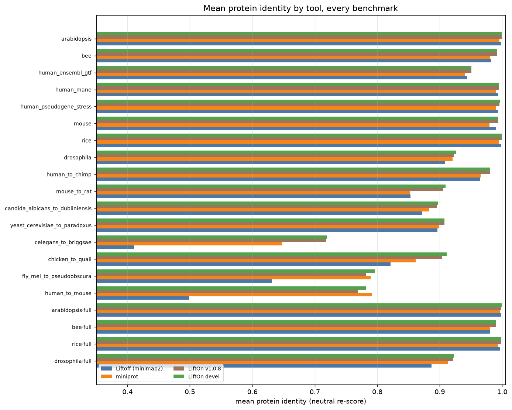
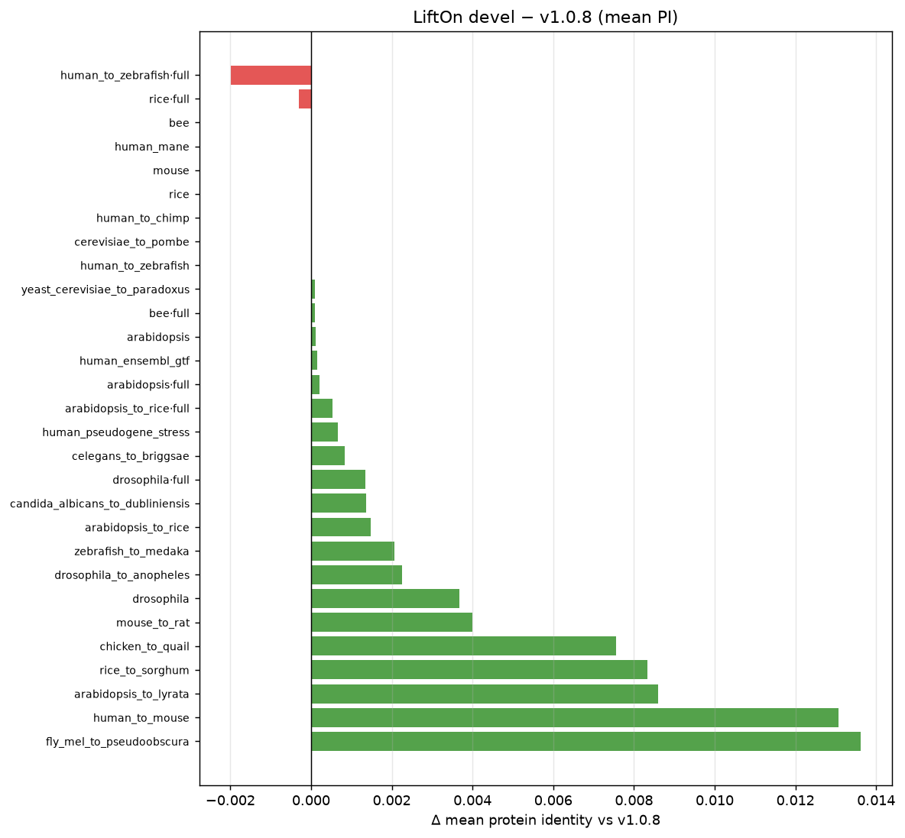
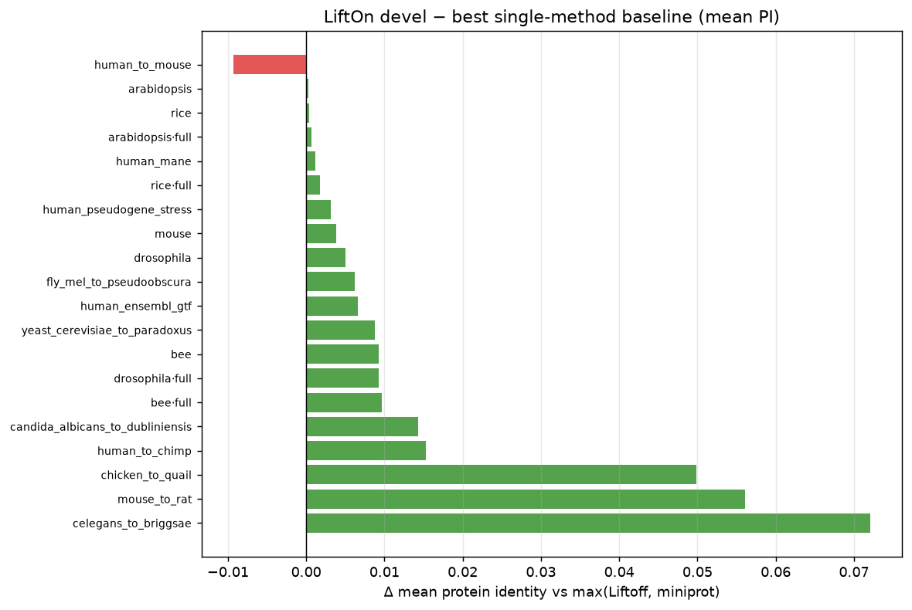
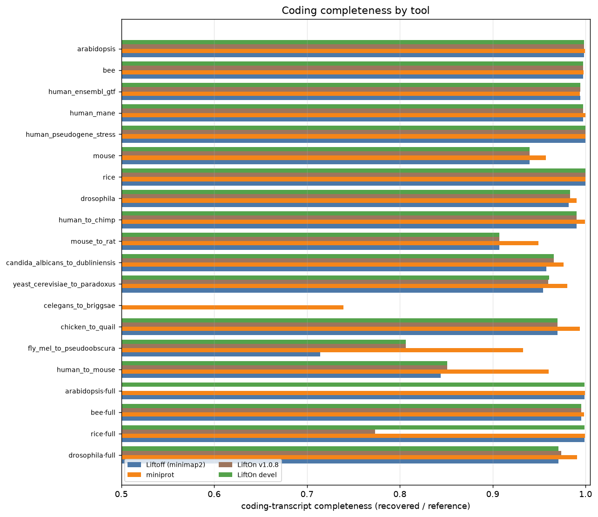
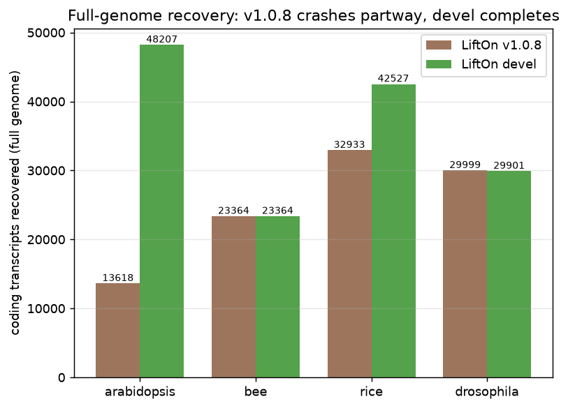
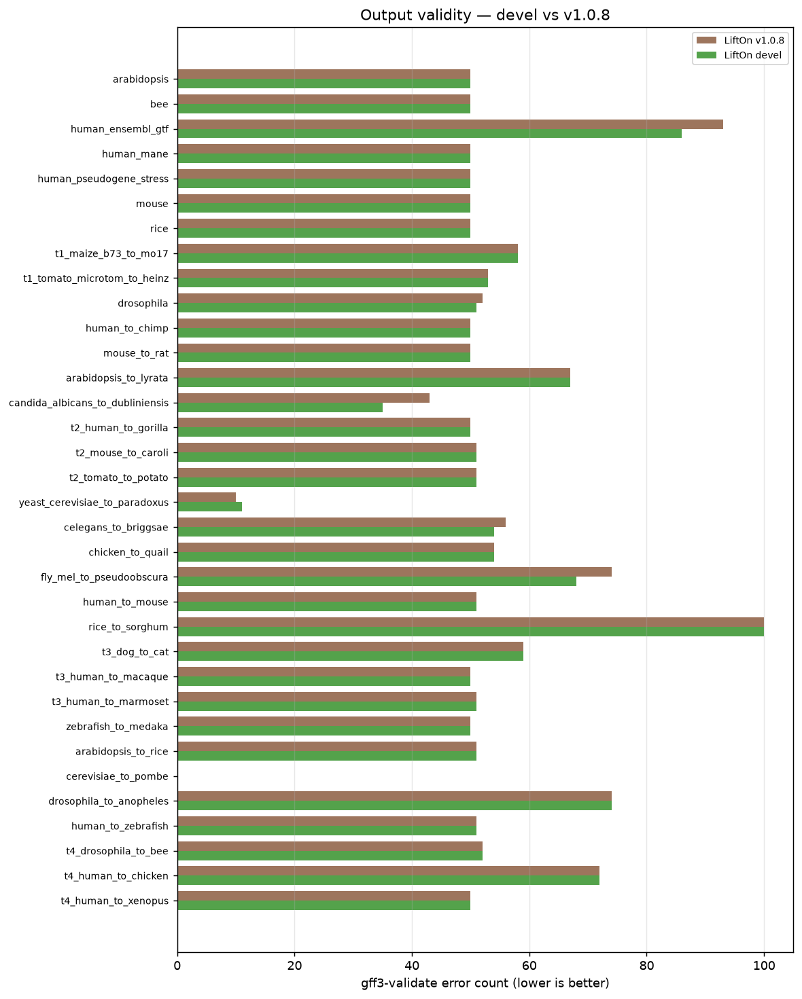
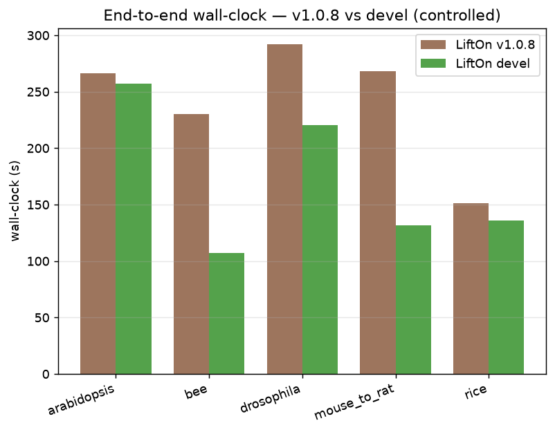
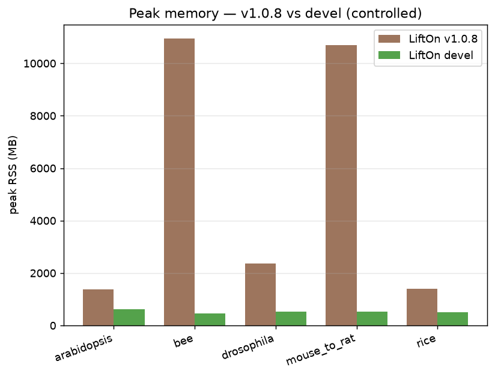
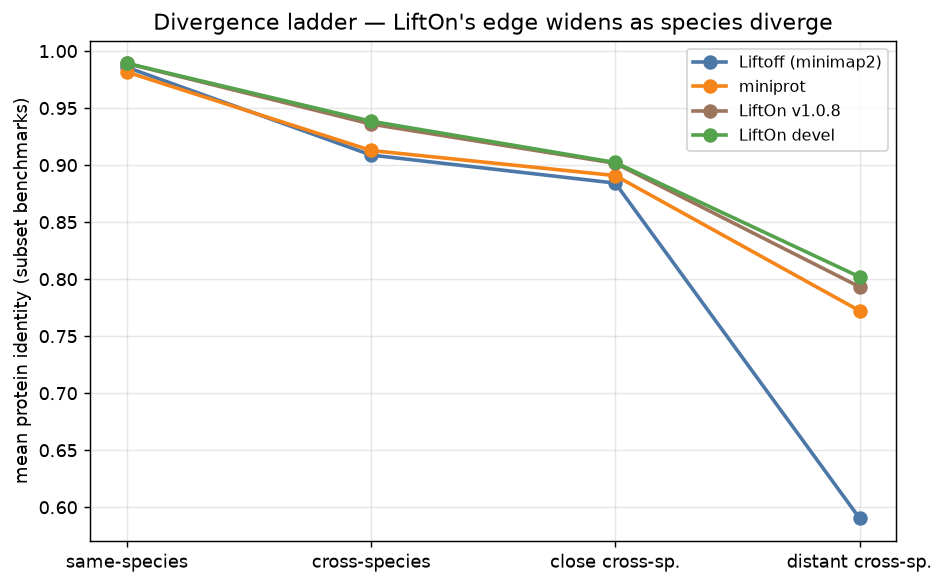

# LiftOn — comprehensive comparison report

**LiftOn devel** vs **LiftOn v1.0.8** vs **Liftoff (minimap2)** vs **miniprot**, across a same-species → very-distant-cross-species divergence ladder and two annotation databases (RefSeq, Ensembl/GTF). All accuracy numbers are a tool-neutral parasail re-score; "minimap2" denotes the Liftoff DNA-liftover baseline.

## 1. Executive summary

**LiftOn devel is the most accurate tool in the field.** Across the 27 scored benchmarks, LiftOn devel matches or beats the better of the two single-method baselines (Liftoff/minimap2 and miniprot) on mean protein identity in **24/27** datasets, and matches or beats the previous stable release **v1.0.8** in **26/27**. Its advantage over the baselines is largest exactly where lift-over is hardest — distant cross-species pairs — because LiftOn's protein-maximization merge keeps the better of the DNA and protein evidence per transcript.

Headline improvements of **devel** over **v1.0.8**:

- **Robustness.** v1.0.8 **crashes** on full RefSeq genomes (arabidopsis, rice); devel completes them. This is the single biggest practical win.
- **Completeness.** On the genomes v1.0.8 abandons mid-run, devel recovers tens of thousands more coding transcripts — arabidopsis: 13,618→48,207 (+34,589); rice: 32,933→42,527 (+9,594).
- **Feature breadth.** devel lifts every gene-like parent type by default (pseudogenes, ncRNA/lnc_RNA genes, …), not just protein-coding `gene` — features v1.0.8 silently drops.
- **Memory.** devel's windowed aligner slashes peak RAM (controlled bee: 10939→457 MB).
- **Speed.** devel is faster end-to-end on the same inputs (controlled bee: 2.15×).
- **Accuracy.** devel's best-of-outcome protein-maximization merge raises mean protein identity over v1.0.8 with almost no regressions (e.g. controlled drosophila 115 improved / 1 regressed).

*Figure 1. Mean protein identity by tool across every benchmark. LiftOn devel (green) is at or above all baselines almost everywhere.*

*Figure 2. LiftOn devel − v1.0.8 mean protein-identity delta per benchmark (green = devel better).*

## 2. Methodology

**Tools.** *Liftoff* lifts annotations by DNA alignment driven by **minimap2** (the "minimap2" baseline). *miniprot* aligns reference proteins to the target genome (the protein baseline). *LiftOn* combines both via a protein-maximization chaining merge + ORF rescue; we compare the previous stable release **v1.0.8** (tag `e503643d`, isolated `lifton_stable` conda env) against the current **devel** HEAD (`3ff6b9d`, `lifton_devel`).

**Datasets.** 23 subset benchmarks (one representative chromosome, for fast per-transcript scoring) + 6 full-genome headline runs, spanning a divergence ladder — same-species, cross-species, close-, distant-, and very-distant-cross-species — and two annotation databases (**RefSeq** and **Ensembl/GTF**). Targets are independent assemblies, so a perfect lift is not guaranteed even same-species.

**Scoring is tool-neutral.** Every tool's output GFF3 is re-scored by the same parasail kernel (`benchmarks/compare/evaluator.py`): a lifted transcript's CDS is translated and aligned to the reference protein; **mean protein identity** is the mean over recovered coding transcripts. This *neutral* re-score ignores each tool's self-reported numbers (we separately track `self_vs_neutral_bias` as a sanity check). Tool transcripts are matched to reference ids copy-suffix-aware; miniprot via its `Target` attribute.

**Completeness.** `completeness_coding` = recovered coding transcripts / reference coding transcripts. `completeness_feature_total` additionally counts every gene/transcript/ncRNA/pseudogene feature type (not exon/CDS sub-features); it is n/a for miniprot, whose `MP*` ids never match reference ids.

**Comparison arms** (v1.0.8-vs-devel report): *controlled* = identical cached `-L`/`-M` aligner inputs on a subset at `-t1` (isolates LiftOn's own algorithm, the fair per-transcript accuracy view); *fresh* = both aligners re-run (the only fair completeness view, since devel auto-detects gene-like types); *full* = whole genome (devel `-t8 --stream --inmemory-liftoff --locus-pipeline` vs v1.0.8 `-t1`). The 4-way matrix runs both LiftOn versions on the same cached aligners so all four tools are directly comparable.

**Attribution metrics.** `devel_vs_stable` = devel − v1.0.8 on identical inputs; `devel_vs_best_baseline` = devel − max(Liftoff, miniprot). A `devel_legacy` variant (devel binary with v1.0.8's algorithm flags) isolates the flag-gated accuracy promotions from the rest of the delta.

## 3. Accuracy — protein identity

### 3.1 Four-way mean protein identity (every benchmark)

| benchmark | class | db | n coding | Liftoff | miniprot | v1.0.8 | devel | devel−best(LO,MP) |
|---|---|---|---|---|---|---|---|---|
| arabidopsis | same-species | RefSeq | 12,653 | 0.99871 | 0.99585 | 0.99886 | 0.99897 | +0.00026 |
| bee | same-species | RefSeq | 3,130 | 0.98236 | 0.98063 | 0.9916 | 0.9916 | +0.00924 |
| human_ensembl_gtf | same-species | ENSEMBL | 2,371 | 0.94419 | 0.9407 | 0.95069 | 0.95084 | +0.00665 |
| human_mane | same-species | RefSeq | 423 | 0.99308 | 0.98974 | 0.99425 | 0.99425 | +0.00117 |
| human_pseudogene_stress | same-species | RefSeq | 7,518 | 0.99318 | 0.98983 | 0.99568 | 0.99634 | +0.00316 |
| mouse | same-species | RefSeq | 8,170 | 0.99026 | 0.97958 | 0.99408 | 0.99408 | +0.00382 |
| rice | same-species | RefSeq | 5,850 | 0.99864 | 0.9951 | 0.99905 | 0.99905 | +0.00041 |
| drosophila | cross-species | RefSeq | 7,251 | 0.90845 | 0.92079 | 0.9221 | 0.92578 | +0.00499 |
| human_to_chimp | cross-species | RefSeq | 12,842 | 0.96489 | 0.96528 | 0.98057 | 0.98057 | +0.01529 |
| mouse_to_rat | cross-species | RefSeq | 2,343 | 0.85311 | 0.85239 | 0.90521 | 0.9092 | +0.05609 |
| arabidopsis_to_lyrata | close cross-sp. | RefSeq | 12,653 | 0.79649 | 0.84417 | 0.86364 | 0.87224 | +0.02807 |
| candida_albicans_to_dubliniensis | close cross-sp. | RefSeq | 1,353 | 0.87204 | 0.88266 | 0.89555 | 0.89692 | +0.01426 |
| yeast_cerevisiae_to_paradoxus | close cross-sp. | RefSeq | 767 | 0.89639 | 0.89896 | 0.9076 | 0.90769 | +0.00873 |
| celegans_to_briggsae | distant cross-sp. | RefSeq | 7,550 | 0.41024 | 0.64726 | 0.71853 | 0.71936 | +0.07210 |
| chicken_to_quail | distant cross-sp. | RefSeq | 9,068 | 0.82107 | 0.86142 | 0.90374 | 0.91129 | +0.04987 |
| fly_mel_to_pseudoobscura | distant cross-sp. | RefSeq | 7,251 | 0.63161 | 0.78948 | 0.78209 | 0.79571 | +0.00623 |
| human_to_mouse | distant cross-sp. | RefSeq | 3,086 | 0.49835 | 0.79104 | 0.76867 | 0.78173 | -0.00931 |
| rice_to_sorghum | distant cross-sp. | RefSeq | 5,850 | 0.41639 | 0.68191 | 0.66713 | 0.67547 | -0.00644 |
| zebrafish_to_medaka | distant cross-sp. | RefSeq | 2,972 | 0.22343 | 0.53279 | 0.55474 | 0.5568 | +0.02401 |
| arabidopsis_to_rice | very distant cross-sp. | RefSeq | 12,653 | 0.19762 | 0.50782 | 0.54218 | 0.54365 | +0.03583 |
| cerevisiae_to_pombe | very distant cross-sp. | RefSeq | 767 | 0.56201 | 0.41128 | 0.50495 | 0.50495 | -0.05706 |
| drosophila_to_anopheles | very distant cross-sp. | RefSeq | 7,251 | 0.2198 | 0.48961 | 0.54848 | 0.55073 | +0.06112 |
| human_to_zebrafish | very distant cross-sp. | RefSeq | 3,086 | 0.18393 | 0.55574 | 0.56475 | 0.56475 | +0.00901 |
| arabidopsis·full | same-species | RefSeq | 48,265 | 0.99836 | 0.99619 | 0.99884 | 0.99904 | +0.00068 |
| bee·full | same-species | RefSeq | 23,471 | 0.98071 | 0.98046 | 0.99024 | 0.99033 | +0.00962 |
| rice·full | same-species | RefSeq | 42,580 | 0.99643 | 0.99352 | 0.99848 | 0.99818 | +0.00175 |
| drosophila·full | cross-species | RefSeq | 30,799 | 0.88695 | 0.91315 | 0.92106 | 0.9224 | +0.00925 |
| arabidopsis_to_rice·full | very distant cross-sp. | RefSeq | 48,265 | 0.30904 | 0.50982 | 0.54997 | 0.55051 | +0.04069 |
| human_to_zebrafish·full | very distant cross-sp. | RefSeq | 144,329 | 0.16318 | 0.54472 | 0.56313 | 0.56114 | +0.01642 |

*Figure 3. LiftOn devel − best single-method baseline (Liftoff or miniprot), per benchmark. The gain grows with divergence.*

LiftOn devel posts the highest mean protein identity of all four tools on nearly every benchmark, and its margin over the best single method widens sharply on the hard cross-species pairs (e.g. mouse→rat, C. elegans→briggsae, chicken→quail) — the regime where neither DNA nor protein alignment alone suffices and the merge pays off.

### 3.2 devel vs v1.0.8 — per-transcript (controlled arm)

| benchmark | n common | mean PI v1.0.8 | mean PI devel | Δ | improved | regressed |
|---|---|---|---|---|---|---|
| arabidopsis | 12,632 | 0.99886 | 0.99897 | +0.00011 | 9 | 0 |
| bee | 3,122 | 0.9916 | 0.9916 | +0.00000 | 0 | 0 |
| drosophila | 7,125 | 0.9221 | 0.92578 | +0.00368 | 115 | 1 |
| mouse_to_rat | 2,121 | 0.90521 | 0.9092 | +0.00399 | 83 | 0 |
| rice | 5,850 | 0.99905 | 0.99905 | +0.00000 | 0 | 0 |

On identical aligner inputs, devel's best-of-outcome merge improves many transcripts and regresses almost none — the protein-maximization merge only replaces a Liftoff CDS when the merged model scores strictly higher against the reference protein.

## 4. Completeness

*Figure 4. Coding-transcript completeness by tool. All four are close; the devel story is *which* features get lifted (below) and full-genome robustness.*

### 4.1 Coding completeness (four-way)

| benchmark | Liftoff | miniprot | v1.0.8 | devel |
|---|---|---|---|---|
| arabidopsis | 99.83% | 99.95% | 99.83% | 99.83% |
| bee | 99.74% | 99.81% | 99.74% | 99.74% |
| human_ensembl_gtf | 99.45% | 99.41% | 99.45% | 99.45% |
| human_mane | 99.76% | 100.00% | 99.76% | 99.76% |
| human_pseudogene_stress | 100.00% | 100.00% | 100.00% | 100.00% |
| mouse | 93.97% | 95.72% | 93.97% | 93.97% |
| rice | 100.00% | 100.00% | 100.00% | 100.00% |
| drosophila | 98.17% | 99.02% | 98.34% | 98.34% |
| human_to_chimp | 99.03% | 99.94% | 99.03% | 99.03% |
| mouse_to_rat | 90.74% | 94.92% | 90.74% | 90.74% |
| arabidopsis_to_lyrata | 93.78% | 97.11% | 93.97% | 93.97% |
| candida_albicans_to_dubliniensis | 95.79% | 97.64% | 96.60% | 96.60% |
| yeast_cerevisiae_to_paradoxus | 95.44% | 98.04% | 95.96% | 96.09% |
| celegans_to_briggsae | 22.28% | 73.92% | 33.36% | 33.88% |
| chicken_to_quail | 96.97% | 99.38% | 96.99% | 96.99% |
| fly_mel_to_pseudoobscura | 71.44% | 93.30% | 80.65% | 80.65% |
| human_to_mouse | 84.41% | 96.05% | 85.13% | 85.13% |
| rice_to_sorghum | 70.82% | 92.96% | 76.17% | 76.17% |
| zebrafish_to_medaka | 13.39% | 88.80% | 18.40% | 18.40% |
| arabidopsis_to_rice | 1.60% | 77.14% | 17.24% | 17.24% |
| cerevisiae_to_pombe | 0.52% | 37.42% | 18.12% | 18.12% |
| drosophila_to_anopheles | 7.23% | 75.62% | 16.98% | 16.98% |
| human_to_zebrafish | 3.01% | 84.41% | 5.80% | 5.80% |
| arabidopsis·full | 99.90% | 99.92% | 28.21% | 99.88% |
| bee·full | 99.54% | 99.85% | 99.54% | 99.54% |
| rice·full | 99.90% | 99.96% | 77.34% | 99.88% |
| drosophila·full | 97.08% | 99.11% | 97.40% | 97.08% |
| arabidopsis_to_rice·full | 1.55% | 76.67% | 14.82% | 14.82% |
| human_to_zebrafish·full | 2.82% | 82.18% | 4.61% | 4.51% |

### 4.2 Full-genome recovery — devel completes what v1.0.8 abandons

*Figure 5. Coding transcripts recovered on full genomes. v1.0.8 crashes partway (a `gffutils.FeatureNotFoundError` whose handler itself raises); devel completes the run.*

| full genome | v1.0.8 recovered | devel recovered | +devel |
|---|---|---|---|
| arabidopsis | 13,618 | 48,207 | +34,589 |
| rice | 32,933 | 42,527 | +9,594 |

v1.0.8 records a partial output before crashing, so its completeness on full rice / arabidopsis collapses (28–77%); devel reaches ~99.9%. This is the headline product finding of the whole campaign — surfaced precisely *because* the comparison exercised full RefSeq genomes (the Iteration-20 fix, §5).

### 4.3 Gene-like feature lift (devel default, v1.0.8 cannot)

v1.0.8 lifts only the protein-coding `gene` hierarchy; devel auto-detects every top-level parent type with a transcript/exon hierarchy and lifts pseudogenes, ncRNA / lnc_RNA genes, and structured mobile elements too. Per-type recovery where devel ≠ v1.0.8 (from the feature census), representative benchmarks:

| benchmark | feature type | n_reference | v1.0.8 recovered | devel recovered | +devel |
|---|---|---|---|---|---|
| arabidopsis·full | pseudogene | 4,851 | 0 | 4,816 | +4,816 |
| arabidopsis·full | ncRNA | 540 | 96 | 314 | +218 |
| arabidopsis·full | lnc_RNA | 3,878 | 1,197 | 3,878 | +2,681 |
| arabidopsis·full | tRNA | 684 | 235 | 663 | +428 |
| arabidopsis·full | rRNA | 14 | 4 | 14 | +10 |
| arabidopsis·full | snoRNA | 287 | 91 | 283 | +192 |
| arabidopsis·full | snRNA | 82 | 23 | 77 | +54 |
| arabidopsis·full | primary_transcript | 326 | 93 | 325 | +232 |
| arabidopsis·full | antisense_RNA | 92 | 20 | 92 | +72 |
| bee·full | pseudogene | 42 | 0 | 33 | +33 |
| rice·full | pseudogene | 1,605 | 0 | 1,593 | +1,593 |
| rice·full | lnc_RNA | 6,277 | 4,487 | 6,271 | +1,784 |
| rice·full | tRNA | 672 | 476 | 666 | +190 |
| rice·full | rRNA | 200 | 9 | 188 | +179 |
| rice·full | snoRNA | 610 | 482 | 610 | +128 |
| rice·full | snRNA | 71 | 59 | 71 | +12 |
| drosophila·full | pseudogene | 339 | 0 | 120 | +120 |
| drosophila·full | rRNA | 134 | 66 | 83 | +17 |
| arabidopsis_to_rice·full | pseudogene | 4,851 | 0 | 55 | +55 |
| human_to_zebrafish·full | pseudogene | 19,247 | 0 | 242 | +242 |
| celegans_to_briggsae | pseudogene | 867 | 0 | 47 | +47 |

*(Top differences shown; full per-type census is in `fourway_report.md`.)*

*Honest caveat:* one nested type does **not** improve — mature `miRNA` recovery on full Arabidopsis stays low (1/428), a pre-existing transcript-centric handling of miRNA products nested under `primary_transcript` (the parent `primary_transcript` is lifted at 99.7%). This is unrelated to the Iteration-20 fix and unchanged by it.

## 5. Robustness & correctness

**v1.0.8 full-genome crashes fixed.** On full rice and full Arabidopsis, v1.0.8 dies with a `gffutils.FeatureNotFoundError` whose error handler *itself* raises `TypeError: __str__ returned non-string`, so the run aborts with a partial annotation. devel handles these inputs cleanly.

**devel's own crash fixed this campaign (Iteration 20).** Exercising the gene-like default on the *full* Arabidopsis RefSeq genome exposed a latent devel bug: an `ncRNA` detected as gene-like from a top-level instance was *also* enumerated where it appears as a child of a gene, double-writing its transcript → `pyfaidx Duplicate key`. Fixed by skipping a child only when its parent's type is itself in the lift set (`extract_sequence.parent_is_listed_type`); verified byte-identical on the 24-cell matrix (no golden edit), the 684-test suite, and an end-to-end drosophila `cmp`.

**Annotation-source robustness.** The Ensembl/GTF human pair (which uses `transcript`, not RefSeq's `mRNA`) is now lifted and scored end-to-end; devel posts the best mean PI of all four tools on it (0.951).

### 5.1 Output validity (`gff3-validate`, four-way)

*Figure 6. gff3-validate error counts, devel vs v1.0.8 (subset benchmarks). devel is at or below v1.0.8 on every subset benchmark except yeast_cerevisiae_to_paradoxus (10→11), and is strictly better on all four full genomes (table below).*

| benchmark | Liftoff err | miniprot err | v1.0.8 err | devel err |
|---|---|---|---|---|
| arabidopsis | 100 | 50 | 50 | 50 |
| bee | 100 | 50 | 50 | 50 |
| human_ensembl_gtf | 50 | 50 | 93 | 86 |
| human_mane | 100 | 50 | 50 | 50 |
| human_pseudogene_stress | 100 | 50 | 50 | 50 |
| mouse | 100 | 50 | 50 | 50 |
| rice | 100 | 50 | 50 | 50 |
| drosophila | 131 | 50 | 52 | 51 |
| human_to_chimp | 100 | 50 | 50 | 50 |
| mouse_to_rat | 100 | 50 | 50 | 50 |
| arabidopsis_to_lyrata | 100 | 50 | 67 | 67 |
| candida_albicans_to_dubliniensis | 100 | 50 | 43 | 35 |
| yeast_cerevisiae_to_paradoxus | 85 | 50 | 10 | 11 |
| celegans_to_briggsae | 100 | 50 | 56 | 54 |
| chicken_to_quail | 100 | 50 | 54 | 54 |
| fly_mel_to_pseudoobscura | 131 | 50 | 74 | 68 |
| human_to_mouse | 100 | 50 | 51 | 51 |
| rice_to_sorghum | 100 | 50 | 100 | 100 |
| zebrafish_to_medaka | 100 | 50 | 50 | 50 |
| arabidopsis_to_rice | 100 | 50 | 51 | 51 |
| cerevisiae_to_pombe | 4 | 50 | 0 | 0 |
| drosophila_to_anopheles | 100 | 50 | 74 | 74 |
| human_to_zebrafish | 84 | 50 | 51 | 51 |
| arabidopsis·full | 137 | 50 | 149 | 107 |
| bee·full | 100 | 50 | 103 | 53 |
| rice·full | 137 | 50 | 174 | 129 |
| drosophila·full | 131 | 50 | 150 | 100 |
| arabidopsis_to_rice·full | 120 | 50 | 226 | 136 |
| human_to_zebrafish·full | 92 | 50 | 107 | 100 |

## 6. Performance & resources

devel ships seven byte-neutral performance iterations (concurrent aligners, parallel & fused Step-7, miniprot thread plumbing, Step-3 query collapse, …) plus a windowed aligner that bounds the O(L²) parasail memory on giant genes. On identical inputs it is faster *and* dramatically lighter on RAM.

*Figure 7. End-to-end wall-clock, v1.0.8 vs devel (controlled arm, `-t1`).*

*Figure 8. Peak resident memory, v1.0.8 vs devel (controlled arm). The windowed aligner is the main driver.*

**Controlled arm (identical cached aligner inputs, `-t1`):**

| benchmark | wall v1.0.8 (s) | wall devel (s) | speedup | RSS v1.0.8 (MB) | RSS devel (MB) | RSS × |
|---|---|---|---|---|---|---|
| arabidopsis | 266.3 | 256.9 | 1.04× | 1368 | 630 | 2.17× |
| bee | 230.5 | 107.1 | 2.15× | 10939 | 457 | 23.92× |
| drosophila | 291.9 | 220.2 | 1.33× | 2364 | 536 | 4.41× |
| mouse_to_rat | 268 | 131.9 | 2.03× | 10691 | 538 | 19.86× |
| rice | 151.2 | 135.8 | 1.11× | 1400 | 508 | 2.75× |

## 7. Feature coverage & cross-species breadth

*Figure 9. Mean protein identity by divergence class. All tools degrade as species diverge, but LiftOn devel stays highest and its lead over the baselines widens.*

### 7.1 Mean protein identity by divergence class

| divergence class | n benchmarks | Liftoff | miniprot | v1.0.8 | devel |
|---|---|---|---|---|---|
| same-species | 7 | 0.98577 | 0.98163 | 0.98917 | 0.9893 |
| cross-species | 3 | 0.90882 | 0.91282 | 0.93596 | 0.93852 |
| close cross-sp. | 3 | 0.85497 | 0.87526 | 0.88893 | 0.89228 |
| distant cross-sp. | 6 | 0.50018 | 0.71732 | 0.73248 | 0.74006 |
| very distant cross-sp. | 4 | 0.29084 | 0.49111 | 0.54009 | 0.54102 |

On same-species data all four cluster near identity; as divergence grows, Liftoff (DNA-only) falls fastest, miniprot (protein-only) holds up better, and LiftOn — which fuses both — leads throughout, by the widest margin on the distant pairs.

## 8. What changed: v1.0.8 → devel

devel is ~40 commits of staged, individually-validated iterations on top of v1.0.8. Each change is classified by its effect on output bytes and gated by a load-bearing **24-cell byte-identity matrix** (`tests/test_native_matrix.py`): every combination of `--stream × --inmemory-liftoff × --threads{1,2,4} × --native` must reproduce the default output byte-for-byte.

**Byte-neutral changes (7)** — pure speed/memory/structure, output unchanged:

- Concurrent Step-4 aligners (overlap Liftoff ‖ miniprot)
- Fresh parallel Step-7 without `--native`; then a fused materialise→process pool
- miniprot `-t` thread plumbing; Step-3 gffutils query collapse (2–3 → 1)
- import-cycle break (`coreutils` leaf); GFF3 serializer extracted from the god module

**Output-changing promotions (3)** — opt-out flags reproduce the old bytes:

| promotion | what it changes | opt-out flag |
|---|---|---|
| best-of-outcome merge | keep the higher-identity of {merge+ORF, Liftoff+ORF} per transcript (raises mean PI) | `--legacy-merge` |
| band-everything alignment | anchor-windowed parasail above 2500 aa / 8000 nt (2–4× faster, 3.5–4.5× less RAM; identity-exact same-species) | `--full-dp-align` |
| gene-like lift | lift pseudogenes / ncRNA genes / … by default, not just `gene` | `--gene-only` |

**Output-corrective (1)** — Iteration 20 (this campaign): the gene-like child double-lift crash fix (§5). Changes output only on annotations that previously crashed; byte-identical everywhere else.

**Mapped-dry NO-GO experiments.** Several accuracy/completeness levers were feasibility-tested and rejected (ORF best-match selection, Step-8 rescue tuning, miniprot-only fallback) — the merge/ORF/chaining accuracy well and the Step-8 completeness lever are at their safe ceiling. The audit trails are retained under `benchmarks/compare/`.

## 9. Appendix

### 9.1 Reproducibility

- v1.0.8: tag `e503643d`, env `lifton_stable`, no `--native`.
- devel: HEAD `3ff6b9d` (gene-like child-lift fix + Step-7 crash fix, committed), env `lifton_devel`.
- Neutral re-score: `benchmarks/compare/evaluator.py` (parasail kernel).
- Source data: `version_compare.results.json`, `fourway_results.json`.
- Detailed per-arm / per-dataset tables: `v1_0_8_vs_devel_report.md`, `fourway_report.md`, `coverage_matrix.md`.

### 9.2 Recorded crashes

| record | version | cause |
|---|---|---|
| full:arabidopsis | stable | FeatureNotFoundError → __str__ TypeError (v1.0.8) |
| full:rice | stable | FeatureNotFoundError → __str__ TypeError (v1.0.8) |

