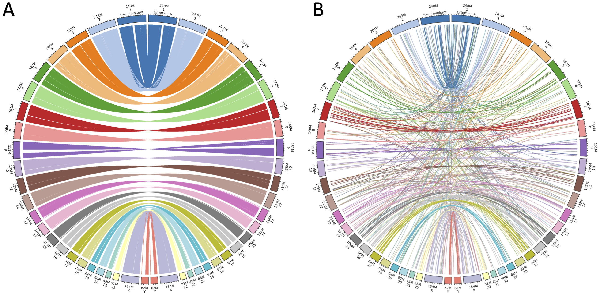

|

.. _behind-the-scenes-splam:

Behind the scenes
=================================================

LiftOn is specifically designed for lifting genes, transcripts, and exons, with the capability to handle any feature or group of hierarchical features in a GFF or GTF file. It utilizes information from , and exons, with the capability to handle any feature or group of hierarchical features in a GFF or GTF file. It takes `Liftoff <https://academic.oup.com/bioinformatics/article/37/12/1639/6035128?login=true>`_  :cite:p:`shumate2021liftoff` and  `miniprot <https://academic.oup.com/bioinformatics/article/39/1/btad014/6989621>`_ :cite:p:`li2023protein` to improve protein-coding gene annotation. This section provides a more detailed explanation of how the algorithms work.

|
|

Deciding chromosomes and features for annotation lift-over
+++++++++++++++++++++++++++++++++++++++++++++++++++++++++++++++++
When transferring genomic annotations to different assemblies, it's important to be selective about which chromosomes to include. Take human as an example, for the mappings of the human annotation from GRCh38 to CHM13, we excluded all alternative scaffolds and patches from the GRCh38 genome and its annotation. Specifically, we excluded scaffolds ending in “_fix” and “_alt”, because they are duplicates or variants of sequences found on the primary chromosomes. 

As for features, we suggest users map both 'gene' and 'pseudogene' features to prevent LiftOn from mistakenly identifying pseudogenes as genes. We also recommend excluding genes that overlap with rRNA genes in rDNA arrays :cite:p:`agrawal2018conservation` :cite:p:`chao2023first`, which occur in hundreds of identical copies and vary widely among humans, creating problems for the alignment programs.

|

.. _data-curation:

Matching miniprot & Liftoff genome annotation
+++++++++++++++++++++++++++++++++++++++++++++++

.. The first step is to match the transcript annotations between Liftoff and miniprot

Liftoff uses the '**gene – transcript – exon/CDS**' or '**transcript – exon/CDS**' hierarchy, while miniprot maps protein sequences to the genome, generating a '**mRNA-CDS/stop_codon**' hierarchy in GFF or GTF format at the transcript level. To run the protein maximization algorithm, LiftOn must first match annotations between Liftoff and miniprot at the transcript level.

LiftOn uses gene loci lifted by Liftoff as anchors to identify corresponding miniprot annotations, guided by two key reasons: 

**(1)** Liftoff incorporates an overlapping resolution algorithm to confirm whether lifted-over gene loci overlap with other annotations. 

**(2)** miniprot lacks the ability to reconcile overlapping gene loci. Additionally, given that certain gene families comprise numerous genes, a significant drawback of miniprot is its tendency to map all proteins in these genes to every gene.

In most cases, miniprot identifies a single transcript per protein, facilitating LiftOn's matching with Liftoff. In other scenarios with multiple miniprot copies overlapping Liftoff, we select the overlapped miniprot locus. If multiple transcripts share the same ID, we eliminate any spanning multiple loci to avoid gene fusion annotations. If multiple transcripts persist, we choose the one with a higher protein sequence identity score. Additionally, if miniprot annotations do not overlap with Liftoff, we prioritize Liftoff annotations.

Using lift-over RefSeq v110 annotations from GRCh38 to T2T-CHM13 V2.0 as an example, the left circos plot (:numref:`liftoff-miniprot-map-circos` A) aligns 129,487 miniprot-identified protein-coding gene loci with Liftoff gene loci. Conversely, the right circos plot (:numref:`liftoff-miniprot-map-circos` B) shows 8,239 miniprot-identified loci, including extra copies, without overlap with Liftoff gene loci. Once a one-to-one mapping is established, LiftOn considers both Liftoff and miniprot CDS chains, initiating the protein-maximization (PM) algorithm.

.. _liftoff-miniprot-map-circos:

    Circos plots compare protein-coding transcript coordinates between miniprot and Liftoff annotations for RefSeq v110 from GRCh38 to T2T-CHM13. (A) aligns proteins to the same gene loci, while (B) aligns proteins to different gene loci. Left circle\: miniprot coordinates on T2T-CHM13; right circle\: Liftoff coordinates on T2T-CHM13.

|
|

.. _protein-maximization_algorithm:

Protein-maximization algorithm
+++++++++++++++++++++++++++++++++++

Step 1: Chaining algorithm
--------------------------

The chaining algorithm (:numref:`lifton-chaining` A-E) starts by pairing up miniprot alignments with transcripts lifted over by Liftoff. After two transcripts are paired up, the protein sequences from the Liftoff and miniprot annotations are then aligned to the full-length reference protein, as illustrated in :numref:`lifton-chaining` B. Subsequently, LiftOn maps the CDS boundaries from both the Liftoff and miniprot annotations onto the protein alignment (:numref:`lifton-chaining` C). 

The CDSs within the Liftoff and miniprot annotations are grouped from the 5’ to 3’ end direction. The CDSs group in Liftoff is represented as :math:`G_{L_i}`, while in miniprot, they are represented as :math:`G_{M_i}`. Here, :math:`i` denotes the i^th group in that annotation. 

The grouping process begins with the first CDS in each annotation and continues until reaching the endpoints of the downstream CDSs in Liftoff and miniprot, where the number of aligned amino acids from the reference protein is equal. This forms the first CDSs group in Liftoff, denoted as :math:`G_{L_1}`, and the first CDSs group in miniprot, denoted as :math:`G_{M_1}`. Subsequent groups start from the previous endpoint in both Liftoff and miniprot, extending until the number of aligned amino acids from the reference protein matches for both annotations again. These subsequent groups are represented as :math:`G_{L_2}` and :math:`G_{M_2}`, respectively. The grouping process concludes upon reaching the last CDSs in both annotations.

Within each group, :math:`G_{L_i}` or :math:`G_{M_i}`, we calculate the partial protein sequence identity and select the group with higher protein sequence identity score (:numref:`lifton-chaining` D). In case of a tie, LiftOn prioritizes the Liftoff annotation, :math:`G_{L_i}`, to include UTRs in its output. The selected CDSs group, represented as :math:`G_{SEL_i}`, comprises the LiftOn CDS(s) within the LiftOn annotation. All :math:`G_{SEL_i}` are then concatenated into the final LiftOn transcript (see :numref:`lifton-chaining` E), which is an ordered sequence of CDSs originating from either Liftoff or miniprot, aiming to maximize protein similarity with the reference protein. This approach is particularly effective in addressing issues such as in-frame indels or mis-splicing that may arise from misalignments as illustrated by the :math:`L3` alignment and the end of exon :math:`M6`, respectively, in :numref:`lifton-chaining`. 

.. _lifton-chaining:
.. figure::  ../_images/figure_LiftOn_chaining_algorithm.png
    :align:   center
    :scale:   12 %

    The ideogram depicts LiftOn's chaining algorithm. (A) Represents the expected lift-over of protein-coding transcript annotations from Liftoff (A.a) and miniprot (A.b). (B) Shows pairwise alignment results with variations. (C) Illustrates mapping CDS boundaries on protein-coding alignments. (D) Groups CDSs based on accumulated amino acids, iterates through each group, and chains those with higher protein sequence identity. In the example, CDSs :math:`L1`, :math:`L2`, :math:`M3`, :math:`M4`, :math:`L4`, :math:`L5`, :math:`L6`, and :math:`L7` are chained, forming the new protein-coding transcript CDS list in the LiftOn annotation.

|

Step 2: Open-reading-frame search
----------------------------------

Frameshift mutations, corrected by aligning annotated coding sequences with the reference protein, alter mRNA reading frames (:numref:`lifton-orf-search-alg` A). Stop codon gain due to point mutations is depicted in :numref:`lifton-orf-search-alg` B and C, where LiftOn searches for the longest open reading frame. :numref:`lifton-orf-search-alg` D highlights stop codon loss, resulting in a longer protein. :numref:`lifton-orf-search-alg` E and F illustrate start codon loss, with LiftOn searching for a new start codon based on sequence identity, selecting the one with the higher score.

.. _lifton-orf-search-alg:
.. figure::  ../_images/figure_LiftOn_ORF_search.png
    :align:   center
    :scale:   9 %

    Schematic diagram illustrating sequence mutations pre-LiftOn ORF search, altering gene annotation in translated and untranslated regions. (A) Frameshift mutation introduces early translation start. (B) Point mutations introduce early stop codons; LiftOn selects the longer part as proteins. (C) Point M: Methionine, the first amino acid; INDEL gap: DNA sequence insertion/deletion; UTR: Untranslated region; CDS: Coding sequence.

| 
|

.. _mutation-reporting:
Mutation report
+++++++++++++++++++++++++++++++++++

LiftOn identifies biological differences between reference and target genomes by aligning DNA and protein sequences. It classifies protein-coding transcripts as "identical" or provides detailed reports for mutations, including "synonymous," "non-synonymous," "in-frame insertion," and "in-frame deletion." For severe mutations, it reports "frameshift," "start codon loss," "stop codon gain," and "stop codon loss," conducting an open reading frame search.

|
|

.. _lifton_sequence_identity:
DNA & protein transcript sequence identity score calculation
+++++++++++++++++++++++++++++++++++++++++++++++++++++++++++++++++

In order to evaluate and compare annotation files generated by LiftOn, Liftoff, and miniprot, we calculated DNA and protein sequence identity scores for each protein-coding transcript within their respective annotation files. To compute DNA sequence identity scores, LiftOn extracted transcript sequences by concatenating exon regions. Subsequently, pairwise alignments were carried out between each compiled transcript sequence and the corresponding sequence extracted from the reference genome LiftOn adopted the BLAST definition of percent identity :cite:p:`altschul1990basic`, defined as the number of matching bases in the two sequences over the number of alignment columns.

In terms of protein sequence identity scores, LiftOn initially generated protein sequences by translating the concatenated CDS regions. Subsequently, pairwise alignments were conducted between each extracted protein sequence and the corresponding full-length protein, with the sequence identity score calculated up to the first encountered stop codon in the proteins. Differing slightly from the BLAST-style metric employed for DNA sequence identity, LiftOn compresses gaps in the reference alignment :cite:p:`hengleeseq_identity`, treating them as a single difference. This adjustment serves two purposes: (1) to accommodate potential repeat regions that might result in a longer protein in the target genome, thereby preventing the introduction of false positive splice junctions caused by insertions in the target sequence or deletions in the reference sequence; and (2) to avoid over-penalization during the annotation of the start codon in the upstream 5' untranslated region (UTR) or the stop codon placement in the downstream 3' UTR.

In the chaining algorithm, the calculation of partial protein sequence identity is employed to determine the optimal matching CDS(s). This process is akin to computing the identity of the full-length protein sequence, with the key distinction being that it focuses on evaluating substrings of the protein.

.. To evaluate and compare annotation files generated by LiftOn, Liftoff, and miniprot, we conducted an analysis of DNA and protein sequence identity scores for each protein-coding transcript within the respective annotation files.

.. For calculating DNA sequence identity scores, LiftOn extracted transcript sequences by concatenating exon regions. Subsequently, pairwise alignments were performed between each compiled transcript sequence and the corresponding sequence extracted from the reference genome. LiftOn adopted the BLAST-style identity, defined as the number of matching bases over the number of alignment columns.

.. Regarding protein sequence identity scores, LiftOn initially extracted protein sequences by translating the concatenation of coding sequence (CDS) regions. Then, pairwise alignments were conducted between each extracted protein sequence and the corresponding full-length protein, with the sequence identity score calculated up to the first encountered stop codon in the proteins. 

.. Differing slightly from the BLAST-style metric employed for DNA sequence identity, LiftOn compresses consecutive leading and trailing gaps in the reference alignment, treating them as one difference. The adjustment is made because LiftOn conducts open reading frame searches for truncated genes (e.g., "frameshift," "stop codon gain," "stop codon missing," and "start codon lost") in order to prevent the over-penalization of annotating the start codon in the upstream 5' untranslated region (UTR) or the stop codon placement in the downstream 3' UTR. :cite:p:`hengleeseq_identity`

.. It is noteworthy that miniprot lacks the capability to resolve overlapping loci and has the potential to map a single protein-coding transcript to multiple loci. To mitigate the potential bias arising from miniprot exhibiting a higher protein sequence identity score but originating from an incorrect gene locus, we predominantly relied on the Liftoff coordinates. We identified the corresponding miniprot annotation that exhibited overlap and shared the same transcript ID for the purpose of comparison. In scenarios where two miniprot annotated transcripts with identical IDs overlapped with the Liftoff protein, the selection criterion favored the transcript with the higher protein sequence identity score, thereby representing that specific protein-coding transcript.

|
|

Reference
+++++++++++++++++++++++++++++++++++

.. .. raw:: html
    
..     
 Shumate, Alaina, and Steven L. Salzberg. <i>"Liftoff: accurate mapping of gene annotations."</i> <b>Bioinformatics</b> 37.12 (2021): 1639-1643.

    

.. bibliography::

|
|
|
|
|

.. image:: ../_images/jhu-logo-dark.png
   :alt: My Logo
   :class: logo, header-image only-light
   :align: center

.. image:: ../_images/jhu-logo-white.png
   :alt: My Logo
   :class: logo, header-image only-dark
   :align: center