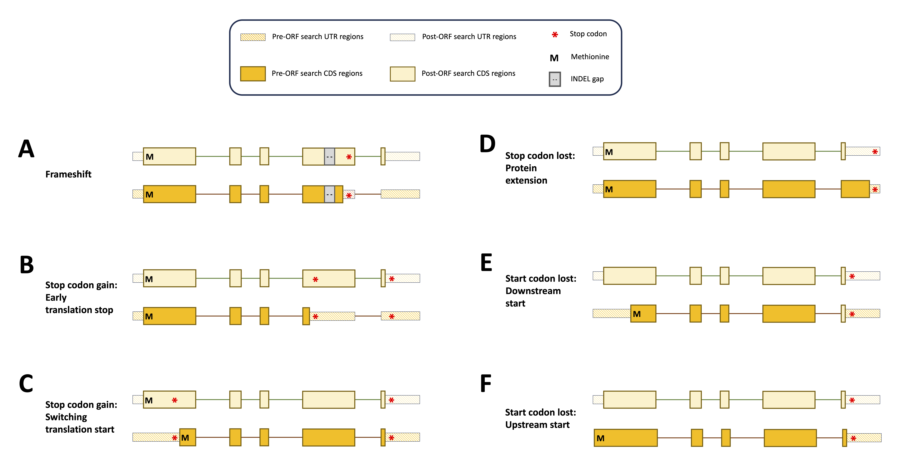

.. _behind-the-scenes-splam:

Behind the scenes
=================================================

LiftOn is specifically designed for lifting genes, transcripts, and exons, with the capability to handle any feature or group of hierarchical features in a GFF or GTF file. It utilizes information from , and exons, with the capability to handle any feature or group of hierarchical features in a GFF or GTF file. It takes `Liftoff <https://academic.oup.com/bioinformatics/article/37/12/1639/6035128?login=true>`_ and  `miniprot <https://academic.oup.com/bioinformatics/article/39/1/btad014/6989621>`_ to enhance protein-coding gene annotation. This section provides a more detailed explanation of how the algorithms work.

|

.. _data-curation:

Matching miniprot & Liftoff genome annotation
+++++++++++++++++++++++++++++++++++++++++++++++

.. The first step is to match the transcript annotations between Liftoff and miniprot

Liftoff uses the '**gene – transcript – exon/CDS**' or '**transcript – exon/CDS**' hierarchy, while miniprot maps protein sequences to the genome, generating a '**mRNA-CDS/stop_codon**' hierarchy in GFF or GTF format at the transcript level. To run the chaining algorithm, LiftOn must first match annotations between Liftoff and miniprot at the transcript level.

LiftOn uses gene loci lifted by Liftoff as anchors to identify corresponding miniprot annotations, guided by two key reasons: 

**(1)** Liftoff incorporates an overlapping resolution algorithm to confirm whether lifted-over gene loci overlap with other annotations. 

**(2)** miniprot lacks the ability to reconcile overlapping gene loci. Additionally, given that certain gene families comprise numerous genes, a significant drawback of miniprot is its tendency to map all proteins in these genes to every gene.

In most cases, miniprot identifies a single transcript per protein, facilitating LiftOn's matching with Liftoff. In other scenarios with multiple miniprot copies overlapping Liftoff, we select the overlapped miniprot locus. If multiple transcripts share the same ID, we eliminate any spanning multiple loci to avoid gene fusion annotations. If multiple transcripts persist, we choose the one with a higher protein sequence identity score. Additionally, if miniprot annotations do not overlap with Liftoff, we prioritize Liftoff annotations.

Using lift-over RefSeq v110 annotations from GRCh38 to T2T-CHM13 V2.0 as an example, the left circos plot (:ref:`Figure <liftoff-miniprot-map-circos>`) aligns 129,487 miniprot-identified protein-coding gene loci with Liftoff gene loci. Conversely, the right circos plot (:ref:`Figure <liftoff-miniprot-map-circos>`) shows 8,239 miniprot-identified loci, including extra copies, without overlap with Liftoff gene loci. Once a one-to-one mapping is established, LiftOn considers both Liftoff and miniprot CDS chains, initiating the chaining algorithm.

.. _liftoff-miniprot-map-circos:
.. figure::  ../_images/figure_liftoff_miniprot_circos_plot.png
    :align:   center
    :scale:   32 %

    Circos plots compare protein-coding transcript coordinates between miniprot and Liftoff annotations for RefSeq v110 from GRCh38 to T2T-CHM13. (A) aligns proteins to the same gene loci, while (B) aligns proteins to different gene loci. Left circle\: miniprot coordinates on T2T-CHM13; right circle\: Liftoff coordinates on T2T-CHM13.

|

.. _model-architecture:

Chaining algorithm
+++++++++++++++++++++++++++++++++++

The chaining algorithm extracts protein sequences from Liftoff and miniprot annotations, aligns them with a reference protein, and maps CDS boundaries by accumulating amino acids in the alignment. CDS groups are formed, and their partial protein sequence identity is compared. The CDS with the highest identity score in each group represents the LiftOn annotation. This approach effectively addresses issues like in-frame indels or mis-splicing. LiftOn then uses an interval tree to find overlapping miniprot-aligned protein-coding transcripts.
(:ref:`Figure <lifton-chaining>`)

.. _lifton-chaining:
.. figure::  ../_images/figure_LiftOn_chaining_algorithm.png
    :align:   center
    :scale:   9 %

    The ideogram depicts LiftOn's chaining algorithm. (A) Represents the expected lift-over of protein-coding transcript annotations from Liftoff (A.a) and miniprot (A.b). (B) Shows pairwise alignment results with variations. (C) Illustrates mapping CDS boundaries on protein-coding alignments. (D) Groups CDSs based on accumulated amino acids, iterates through each group, and chains those with higher protein sequence identity. In the example, CDSs L1, L2, M3, M4, L4, L5, and L6 are chained, forming the new protein-coding transcript CDS list in the LiftOn annotation.

|

Mutation reporting
+++++++++++++++++++++++++++++++++++

LiftOn identifies biological differences between reference and target genomes by aligning DNA and protein sequences. It classifies protein-coding transcripts as "identical" or provides detailed reports for mutations, including "synonymous," "non-synonymous," "in-frame insertion," and "in-frame deletion." For severe mutations, it reports "frameshift," "start codon loss," "stop codon gain," and "stop codon loss," conducting an open reading frame search.

|

Open-reading-frame search
+++++++++++++++++++++++++++++++++++

Frameshift mutations, corrected by aligning annotated coding sequences with the reference protein, alter mRNA reading frames (Figure 9A). Stop codon gain due to point mutations is depicted in Figures 9B and C, where LiftOn searches for the longest open reading frame. Figure 9D highlights stop codon loss, resulting in a longer protein. Figures 9E and F illustrate start codon loss, with LiftOn searching for a new start codon based on sequence identity, selecting the one with the higher score.

.. _lifton-orf-search:

    Schematic diagram illustrating sequence mutations pre-LiftOn ORF search, altering gene annotation in translated and untranslated regions. (A) Frameshift mutation introduces early translation start. (B) Point mutations introduce early stop codons; LiftOn selects the longer part as proteins. (C) Point M: Methionine, the first amino acid; INDEL gap: DNA sequence insertion/deletion; UTR: Untranslated region; CDS: Coding sequence.

| 

DNA & protein transcript sequence identity score calculation
+++++++++++++++++++++++++++++++++++++++++++++++++++++++++++++++++

To evaluate and compare annotation files generated by LiftOn, Liftoff, and miniprot, we conducted an analysis of DNA and protein sequence identity scores for each protein-coding transcript within the respective annotation files.

For calculating DNA sequence identity scores, LiftOn extracted transcript sequences by concatenating exon regions. Subsequently, pairwise alignments were performed between each compiled transcript sequence and the corresponding sequence extracted from the reference genome. LiftOn adopted the BLAST-style identity, defined as the number of matching bases over the number of alignment columns.

Regarding protein sequence identity scores, LiftOn initially extracted protein sequences by translating the concatenation of coding sequence (CDS) regions. Then, pairwise alignments were conducted between each extracted protein sequence and the corresponding full-length protein, with the sequence identity score calculated up to the first encountered stop codon in the proteins. 

Differing slightly from the BLAST-style metric employed for DNA sequence identity, LiftOn compresses consecutive leading and trailing gaps in the reference alignment, treating them as one difference. The adjustment is made because LiftOn conducts open reading frame searches for truncated genes (e.g., "frameshift," "stop codon gain," "stop codon missing," and "start codon lost") in order to prevent the over-penalization of annotating the start codon in the upstream 5' untranslated region (UTR) or the stop codon placement in the downstream 3' UTR.

It is noteworthy that miniprot lacks the capability to resolve overlapping loci and has the potential to map a single protein-coding transcript to multiple loci. To mitigate the potential bias arising from miniprot exhibiting a higher protein sequence identity score but originating from an incorrect gene locus, we predominantly relied on the Liftoff coordinates. We identified the corresponding miniprot annotation that exhibited overlap and shared the same transcript ID for the purpose of comparison. In scenarios where two miniprot annotated transcripts with identical IDs overlapped with the Liftoff protein, the selection criterion favored the transcript with the higher protein sequence identity score, thereby representing that specific protein-coding transcript.

|
|

Reference
+++++++++++++++++++++++++++++++++++

.. bibliography::

|
|
|
|
|

.. image:: ../_images/jhu-logo-dark.png
   :alt: My Logo
   :class: logo, header-image only-light
   :align: center

.. image:: ../_images/jhu-logo-white.png
   :alt: My Logo
   :class: logo, header-image only-dark
   :align: center