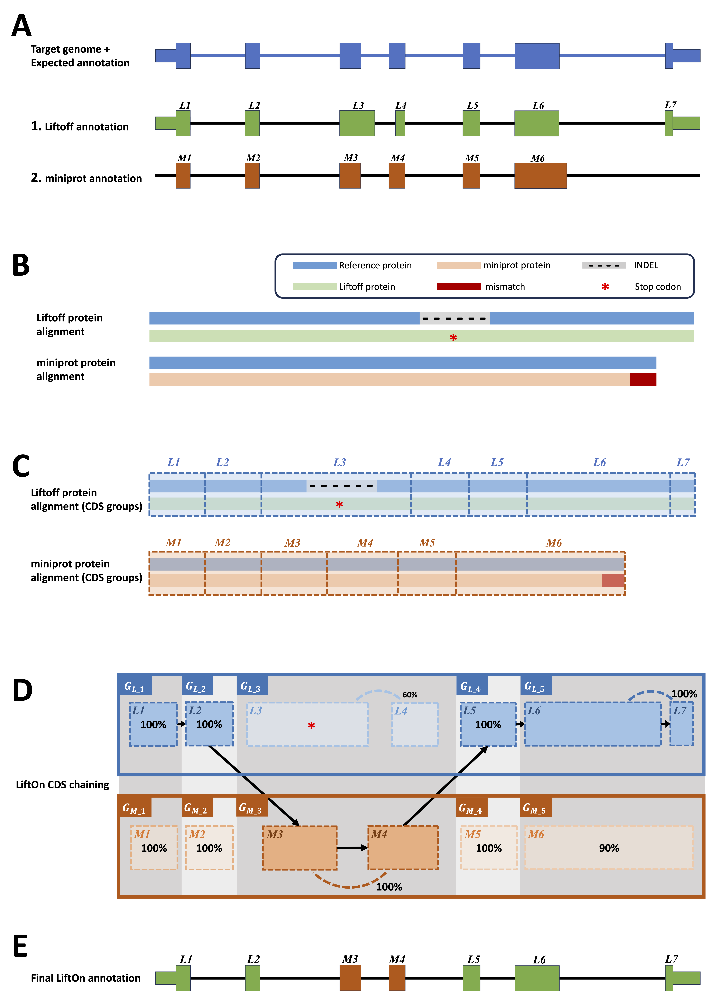

|

.. _behind-the-scenes-splam:

Behind the scenes
=================================================

LiftOn is designed for lifting genes, transcripts and exons, with the capability to handle any feature or group of hierarchical features in a GFF or GTF file. It takes `Liftoff <https://academic.oup.com/bioinformatics/article/37/12/1639/6035128?login=true>`_  :cite:p:`shumate2021liftoff` and  `miniprot <https://academic.oup.com/bioinformatics/article/39/1/btad014/6989621>`_ :cite:p:`li2023protein` to improve protein-coding gene annotation. This section provides a more detailed explanation of how LiftOn algorithm works.

|

Deciding chromosomes and features for annotation lift-over
+++++++++++++++++++++++++++++++++++++++++++++++++++++++++++++++++
When transferring genomic annotations to different assemblies, it's important to be selective about which chromosomes to include. Take human as an example, for the mappings of the human annotation from GRCh38 to CHM13, we excluded all alternative scaffolds and patches from the GRCh38 genome and its annotation. Specifically, we excluded scaffolds ending in “_fix” and “_alt”, because they are duplicates or variants of sequences found on the primary chromosomes. 

As for features, we suggest users map both 'gene' and 'pseudogene' features to prevent LiftOn from mistakenly identifying pseudogenes as genes. We also recommend excluding genes that overlap with rRNA genes in rDNA arrays :cite:p:`agrawal2018conservation` :cite:p:`chao2023first`, which occur in hundreds of identical copies and vary widely among humans, creating problems for the alignment programs.

|

.. _data-curation:

Matching miniprot & Liftoff genome annotation
+++++++++++++++++++++++++++++++++++++++++++++++

.. The first step is to match the transcript annotations between Liftoff and miniprot

Liftoff uses the '**gene – transcript – exon/CDS**' or '**transcript – exon/CDS**' hierarchy, while miniprot maps protein sequences to the genome, generating a '**mRNA-CDS/stop_codon**' hierarchy in GFF or GTF format at the transcript level. To run the protein maximization algorithm, LiftOn must first match annotations between Liftoff and miniprot at the transcript level.

LiftOn uses gene loci lifted by Liftoff as anchors to identify corresponding miniprot annotations, guided by two key reasons: 

**(1)** Liftoff incorporates an overlapping resolution algorithm to confirm whether lifted-over gene loci overlap with other annotations. 

**(2)** miniprot lacks the ability to reconcile overlapping gene loci. Additionally, given that certain gene families comprise numerous genes, a significant drawback of miniprot is its tendency to map all proteins in these genes to every gene.

In most cases, miniprot identifies a single transcript per protein and aligns with Liftoff annotations. However, there are instances where miniprot detects multiple transcript copies for a protein, with more than one copy overlapping Liftoff annotations. To avoid gene fusion annotations, we first eliminate any transcripts spanning multiple loci. If multiple transcripts still persist, we select the one with the highest protein sequence identity score. Furthermore, if miniprot annotations do not overlap with those from Liftoff, we give precedence to Liftoff annotations.

Check out :ref:`'Q & A How do the annotations generated by Liftoff differ from those produced by Miniprot?' <liftoff_miniprot_cmp_qa>` for the analysis of consensus and differences between Liftoff and miniprot annotations. Once a one-to-one mapping is established, LiftOn considers both Liftoff and miniprot CDS chains, initiating the protein maximization (PM) algorithm.

|
|

.. _protein-maximization_algorithm:

Protein-maximization algorithm
+++++++++++++++++++++++++++++++++++

Step 1: Chaining algorithm
--------------------------

The chaining algorithm (:numref:`lifton-chaining` A-E) starts by pairing up miniprot alignments with transcripts lifted over by Liftoff. After two transcripts are paired up, the protein sequences from the Liftoff and miniprot annotations are then aligned to the full-length reference protein, as illustrated in :numref:`lifton-chaining` B. Subsequently, LiftOn maps the CDS boundaries from both the Liftoff and miniprot annotations onto the protein alignment (:numref:`lifton-chaining` C). 

The CDSs within the Liftoff and miniprot annotations are grouped from the 5’ to 3’ end direction. The CDSs group in Liftoff is represented as :math:`G_{L_i}`, while in miniprot, they are represented as :math:`G_{M_i}`. Here, :math:`i` denotes the :math:`i^{th}` group in that annotation. 

The grouping process begins with the first CDS in each annotation and continues until reaching the endpoints of the downstream CDSs in Liftoff and miniprot, where the number of aligned amino acids from the reference protein is equal. This forms the first CDSs group in Liftoff, denoted as :math:`G_{L_1}`, and the first CDSs group in miniprot, denoted as :math:`G_{M_1}`. Subsequent groups start from the previous endpoint in both Liftoff and miniprot, extending until the number of aligned amino acids from the reference protein matches for both annotations again. These subsequent groups are represented as :math:`G_{L_2}` and :math:`G_{M_2}`, respectively. The grouping process concludes upon reaching the last CDSs in both annotations.

Within each group, :math:`G_{L_i}` or :math:`G_{M_i}`, we calculate the partial protein sequence identity and select the group with higher protein sequence identity score (:numref:`lifton-chaining` D). In case of a tie, LiftOn prioritizes the Liftoff annotation, :math:`G_{L_i}`, to include UTRs in its output. The selected CDSs group, represented as :math:`G_{SEL_i}`, comprises the LiftOn CDS(s) within the LiftOn annotation. All :math:`G_{SEL_i}` are then concatenated into the final LiftOn transcript (see :numref:`lifton-chaining` E), which is an ordered sequence of CDSs originating from either Liftoff or miniprot, aiming to maximize protein similarity with the reference protein. This approach is particularly effective in addressing issues such as in-frame indels or mis-splicing that may arise from misalignments as illustrated by the :math:`L3` alignment and the end of exon :math:`M6`, respectively, in :numref:`lifton-chaining`. 

.. _lifton-chaining:

    The ideogram depicts LiftOn's chaining algorithm. (A) Represents the expected lift-over of protein-coding transcript annotations from Liftoff (A.a) and miniprot (A.b). (B) Shows pairwise alignment results with variations. (C) Illustrates mapping CDS boundaries on protein-coding alignments. (D) Groups CDSs based on accumulated amino acids, iterates through each group, and chains those with higher protein sequence identity. In the example, CDSs :math:`L1`, :math:`L2`, :math:`M3`, :math:`M4`, :math:`L4`, :math:`L5`, :math:`L6`, and :math:`L7` are chained, forming the new protein-coding transcript CDS list in the LiftOn annotation.

|

Step 2: Open reading frame search
----------------------------------

Following the chaining algorithm, LiftOn performs an open-reading frame search algorithm on the protein-coding regions of the mapped transcripts that have mutations likely to be more deleterious, such as “frameshift”, “stop codon gain”, “stop codon loss”, and “start codon loss” mutations. The objective is to generate the longest valid protein sequences that align with the full-length reference proteins.

It searches the ORF translations of protein-coding transcripts and adjusts CDS boundaries to avoid early stop codons (:numref:`lifton-orf-search-alg` A-B), choose better translation start sites (:numref:`lifton-orf-search-alg` C, E, F), or extends proteins with stop codon loss (:numref:`lifton-orf-search-alg` D), in order to produce the longest valid protein that match the reference protein. 

.. _lifton-orf-search-alg:
.. figure::  ../_images/figure_LiftOn_ORF_search.png
    :align:   center
    :scale:   9 %

    Schematic diagram illustrating sequence mutations pre-LiftOn ORF search, altering gene annotation in translated and untranslated regions. (A) Frameshift mutation introduces early translation start. (B) Point mutations introduce early stop codons; LiftOn selects the longer part as proteins. (C) Point mutation introduces a premature stop codon. (D) Stop codon loss extends the protein. (E-F) Point mutation introduces a loss of the start site, and the LiftOn ORF search algorithm finds a downstream or upstream start site.
    
    M: Methionine, the first amino acid; INDEL gap: DNA sequence insertion/deletion; UTR: Untranslated region; CDS: Coding sequence.

| 
|

.. _mutation-reporting:
Mutation report
+++++++++++++++++++++++++++++++++++

LiftOn identifies biological differences between reference and target genomes by aligning DNA and protein sequences. It classifies protein-coding transcripts as "identical" or provides detailed reports on mutations, including "synonymous", "non-synonymous", "in-frame insertion", "in-frame deletion", "frameshift", "start codon loss", "stop codon gain", and "stop codon loss".

|
|

Reference
+++++++++++++++++++++++++++++++++++

.. .. raw:: html
    
..     
 Shumate, Alaina, and Steven L. Salzberg. <i>"Liftoff: accurate mapping of gene annotations."</i> <b>Bioinformatics</b> 37.12 (2021): 1639-1643.

    

.. bibliography::

|
|
|
|
|

.. image:: ../_images/jhu-logo-dark.png
   :alt: My Logo
   :class: logo, header-image only-light
   :align: center

.. image:: ../_images/jhu-logo-white.png
   :alt: My Logo
   :class: logo, header-image only-dark
   :align: center