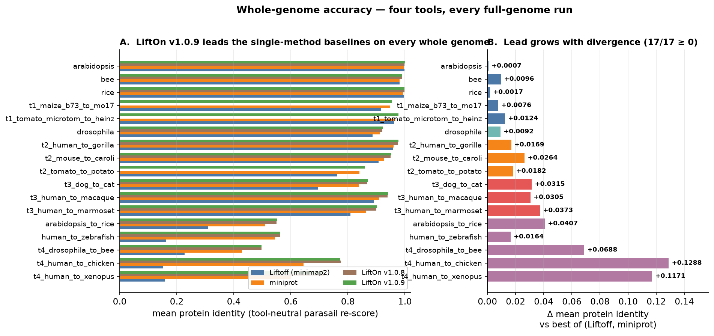
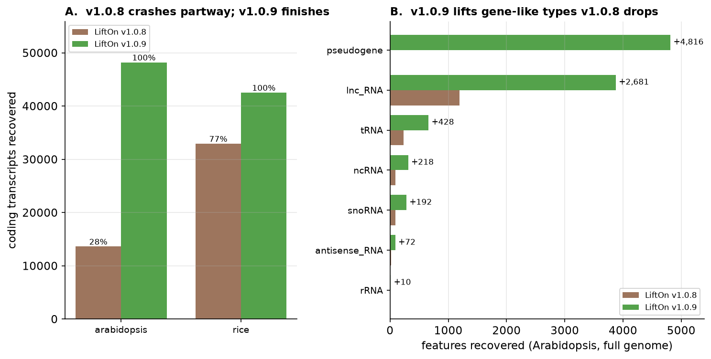
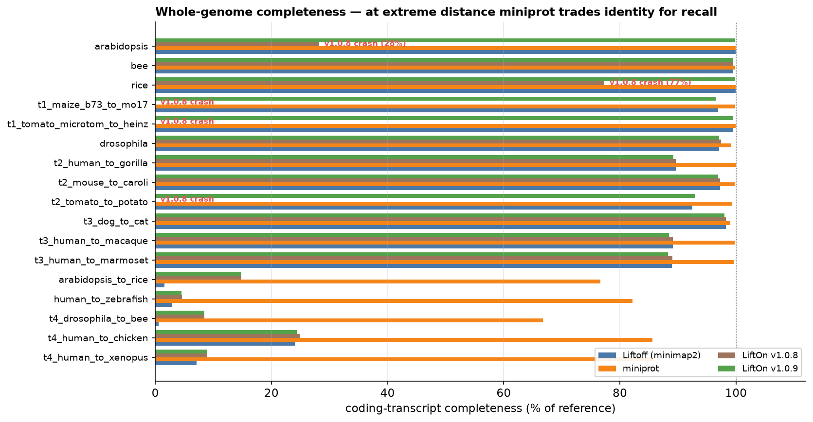
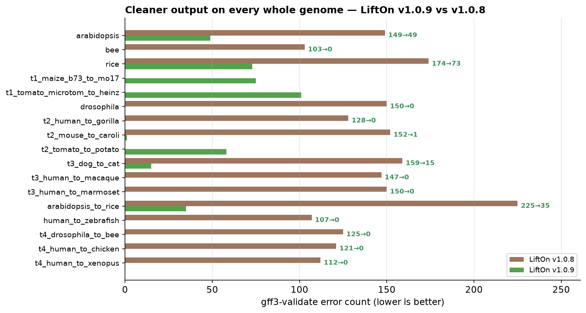
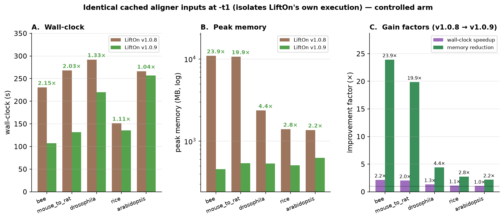

|

.. _benchmarks:

Benchmarks (v1.0.9)
=====================

LiftOn v1.0.9 was evaluated against the two single-method baselines it builds on
— **Liftoff** (DNA / minimap2) and **miniprot** (protein) — and against the
previous release **LiftOn v1.0.8**, in a four-way comparison spanning **17 whole
genomes and 34 curated subsets** across four evolutionary-distance tiers
(same species → closely related → distant → very distant). Every annotation is
re-scored with the **same tool-neutral metric** (Parasail global protein
alignment; see the :ref:`evaluation metrics <evaluation_metrics_sequence_identity>`
page), so the four tools are compared on an even footing.

The full analysis — including the joint recall-vs-identity (apples-to-apples)
breakdown and per-dataset tables — is available in the
`LiftOn v1.0.9 technical report <https://khchao.com/reports/lifton-v1-0-9-technical-report/>`_
and the peer-reviewed `Genome Research paper <https://doi.org/10.1101/gr.279620.124>`_.

|

Accuracy
----------

Across all 17 whole genomes, LiftOn v1.0.9 produces protein annotations whose
identity to the reference is **at least as high as the best single-method
baseline on every genome**, and the lead grows with evolutionary distance (where
the DNA lift and the protein lift each capture complementary signal). On
*Drosophila*, for example, LiftOn v1.0.9 reaches a mean protein identity of
**0.922**, ahead of miniprot (0.913) and Liftoff (0.887), and slightly ahead of
v1.0.8 (0.921).

   Whole-genome mean protein identity (tool-neutral Parasail re-score). **A**:
   LiftOn v1.0.9 (green) vs Liftoff, miniprot, and LiftOn v1.0.8 on every full
   genome. **B**: the gain over the best of the two single-method baselines,
   which widens with divergence.

|

Completeness & robustness
----------------------------

v1.0.9's crash-hardening lets full RefSeq / cross-species genomes that
previously aborted **run to completion**. On the full *Arabidopsis* genome
v1.0.8 crashed partway, recovering only **~28%** of coding transcripts; v1.0.9
completes the run and recovers **~99.9%**. Full rice improves the same way
(**77% → ~99.9%**). All 17 whole-genome runs now finish.

The default **gene-like lift** additionally recovers reference feature types that
the previous ``gene``-only lift dropped — on the full *Arabidopsis* genome that
adds **+4,816** pseudogenes, **+2,681** lnc_RNAs, plus tRNAs, ncRNAs, snoRNAs and
more.

   **A**: v1.0.8 crashes partway on full *Arabidopsis* / rice; v1.0.9 finishes
   (100% of the run). **B**: gene-like feature types recovered by v1.0.9 that
   v1.0.8 dropped (full *Arabidopsis*).

At the largest evolutionary distances, completeness becomes a deliberate
**precision–recall trade-off**: miniprot's protein search recovers more loci
(higher recall) at lower per-transcript identity, while LiftOn keeps Liftoff's
DNA-anchored structure (higher identity) and fills genuinely-missing genes with
the new miniprot-only rescue pass. The figure below shows where each tool sits;
the technical report breaks this down further with a recall-weighted metric.

   Coding-transcript completeness (% of reference) for all four tools. LiftOn
   v1.0.9 (green) completes every genome and tracks Liftoff closely; at the very
   distant tier miniprot (orange) trades identity for recall.

|

GFF3 validity
---------------

v1.0.9 makes the emitted annotation **validate clean**. Default exon/CDS
containment normalization and unique-exon-ID guarantees remove the
LiftOn-introduced containment and duplicate-ID errors that earlier versions
emitted (the reference annotations themselves do not have them). Measured with
the in-tree ``gff3-validate``:

- LiftOn v1.0.9 reports **0 validation errors on 9 of the 17 whole genomes**
  (bee, *Drosophila*, human→zebrafish, human→gorilla, human→macaque,
  human→marmoset, human→chicken, human→xenopus, *Drosophila*\ →bee).
- On **all 17** genomes, v1.0.9's error count is **lower than or equal to every
  other tool**, often dramatically (e.g. dog→cat **159 → 15**, *Drosophila*
  **150 → 0**, the five human cross-species **~107–150 → 0**).
- The residuals on organellar-gene-bearing plant genomes are
  **reference-inherited**, not LiftOn-introduced: the TAIR10 *Arabidopsis*
  reference itself carries **164** such errors — more than LiftOn's lifted
  output (**49**).

   ``gff3-validate`` error count per whole genome, LiftOn v1.0.8 (brown) vs
   v1.0.9 (green); lower is better.

|

Performance
-------------

v1.0.9 ships several **byte-identical performance fast-paths** — memory-bounded
windowed alignment for giant genes, concurrent Liftoff‖miniprot execution, a
fused per-locus thread pool, and a collapsed sequence-extraction query. These
change *how* LiftOn runs, never *what* it emits (pinned by a 24-cell
byte-identity test matrix). On a controlled single-thread arm with cached aligner
inputs (isolating LiftOn's own execution), v1.0.9 runs **up to ~2.2× faster** and
uses **up to ~24× less peak memory** than v1.0.8 — the giant-gene windowing is
what removes the multi-gigabyte memory peaks on mammalian / plant genomes.
Adding ``--threads N --locus-pipeline`` (also byte-identical) reduces wall-clock
further.

   LiftOn v1.0.8 vs v1.0.9 on identical cached aligner inputs at ``-t 1``. **A**:
   wall-clock. **B**: peak memory (log scale). **C**: per-dataset gain factors
   (wall-clock speedup and peak-memory reduction).

|
|

See the :ref:`Changelog` for the full list of v1.0.9 changes and their opt-out
flags, and the :ref:`User Manual` for every command-line option.

|
|
|
|
|

