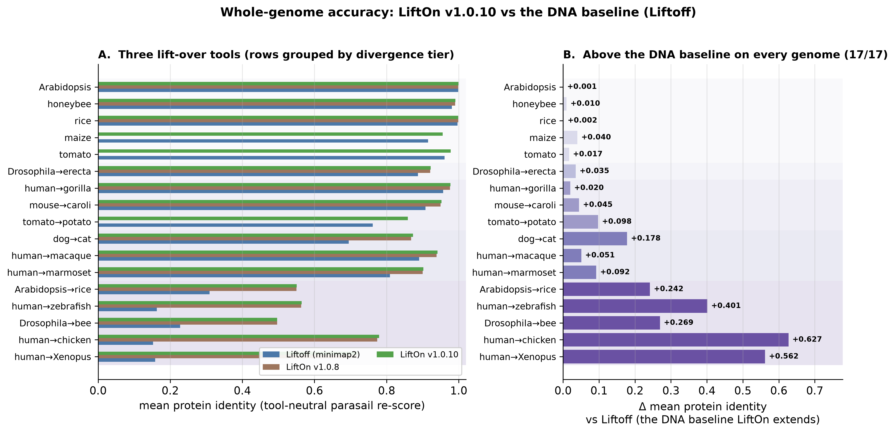
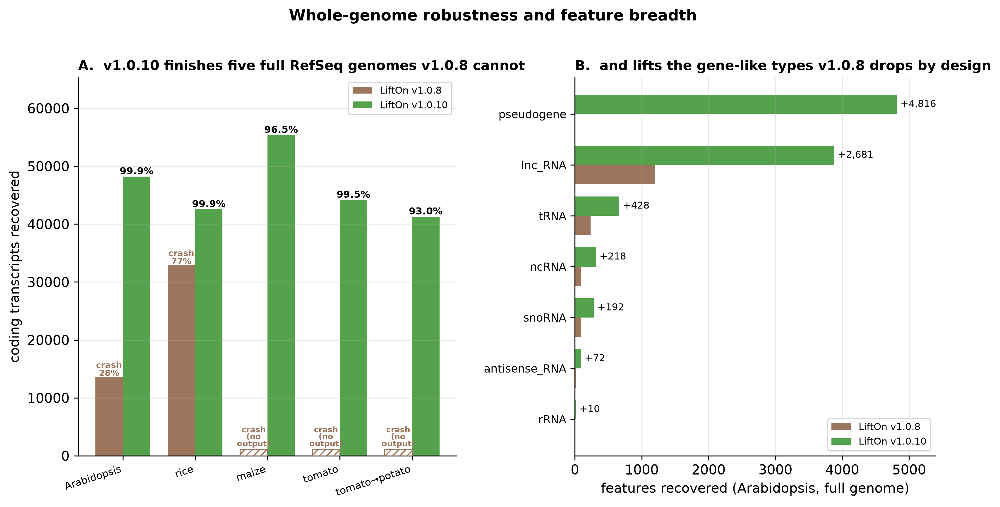
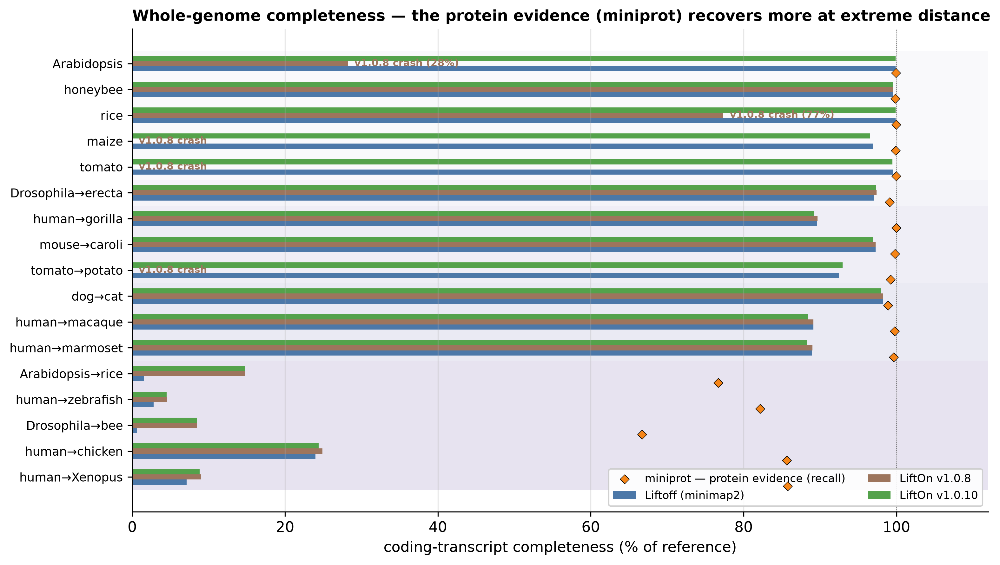
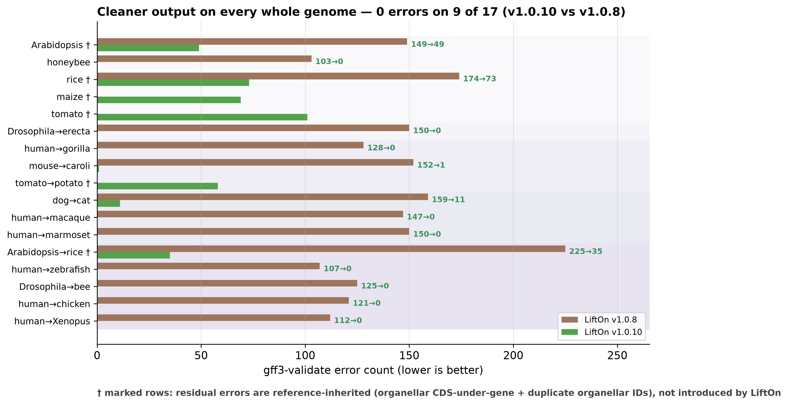
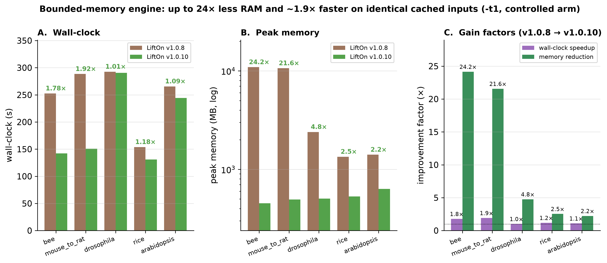

|

.. _benchmarks:

Benchmarks (v1.0.10)
======================

LiftOn v1.0.10 was evaluated against the two single-method signals it fuses —
**Liftoff** (DNA / minimap2) and **miniprot** (protein) — and against the previous
stable release **LiftOn v1.0.8**, in a four-way comparison spanning **17 whole
genomes and 23 curated subsets** across four evolutionary-distance tiers
(same species → close → distant → very distant). Every annotation is re-scored
with the **same tool-neutral metric** (Parasail global protein alignment; see the
:ref:`evaluation metrics <evaluation_metrics_sequence_identity>` page), so all
four are compared on an even footing.

The full analysis — including the joint recall-vs-identity (apples-to-apples)
breakdown and per-genome tables — is in the
`LiftOn v1.0.10 technical report <https://khchao.com/reports/lifton-v1-0-10-technical-report/>`_
and the peer-reviewed `Genome Research paper <https://doi.org/10.1101/gr.279620.124>`_.

|

Accuracy
----------

Across all 17 whole genomes, LiftOn v1.0.10's mean protein identity is **above the
DNA-only Liftoff on every genome**, by +0.0007 on same-species *Arabidopsis* up to
+0.098 on tomato→potato. On *Drosophila* it reaches **0.922**, ahead of miniprot
(0.913) and Liftoff (0.887). Against the previous release it is **at or above
v1.0.8 on every one of the twelve genomes both versions completed** — strictly
higher on eleven, tied on *Drosophila*→bee — with no fractional dip anywhere.

One result is worth stating plainly rather than averaging away. Comparing LiftOn
to miniprot **on the transcripts both recover** — the only confound-free
comparison — LiftOn's per-transcript advantage is real and peaks on the *distant*
tier (+0.024 to +0.035 on dog→cat, human→macaque, human→marmoset), but it
**reverses on four of the five very-distant genomes**. At extreme divergence
LiftOn delivers high-precision refinement of the DNA-anchored core it can reach,
**not higher recall**; the default-ON miniprot-only rescue is what narrows the
recall gap, and it is deliberately frozen off in these tables so the engine
comparison stays apples-to-apples.

   Whole-genome mean protein identity (tool-neutral Parasail re-score). **A**:
   LiftOn v1.0.10 vs Liftoff, miniprot, and LiftOn v1.0.8 on every full genome.
   **B**: the gain over the DNA baseline, which widens with divergence.

|

Completeness & robustness
----------------------------

The single largest practical advance is finishing genomes v1.0.8 could not. On
**five** of the seventeen, v1.0.8 aborts mid-run. On full RefSeq *Arabidopsis* and
rice it leaves a partial annotation; v1.0.10 completes both — *Arabidopsis*
**28.2% → 99.9%** coding completeness (**+34,589** transcripts) and rice
**77.3% → 99.9%** (**+9,594**). On maize and the two tomato pairs v1.0.8 produces
no scorable annotation at all, while v1.0.10 completes each (96.5%, 99.5%, 93.0%).

A separate write-path fix has the same character: on dog→cat, one transcript with
inverted coordinates used to abort the whole run at 11,048 of ~61,000 transcripts.
That one feature is now dropped with a logged warning and the genome completes
(**61,277** transcripts, 98.0% complete).

The default **gene-like lift** additionally recovers reference feature types the
older ``gene``-only lift dropped — on full *Arabidopsis* that adds **+4,816**
pseudogenes, **+2,681** lnc_RNAs, plus tRNAs, ncRNAs, snoRNAs and more.

   **A**: coding transcripts recovered on the five full genomes v1.0.8 fails on;
   v1.0.10 completes all five. **B**: gene-like feature types recovered by
   v1.0.10 that v1.0.8 drops by design (full *Arabidopsis*).

At the largest evolutionary distances, completeness becomes a deliberate
**precision–recall trade-off**: miniprot's protein search is not DNA-anchored and
recovers more loci at lower per-transcript identity, while LiftOn keeps Liftoff's
DNA-anchored structure and fills genuinely-missing genes with the miniprot-only
rescue pass. The technical report breaks this down with a recall-weighted metric.

   Coding-transcript completeness (% of reference) for all four tools. LiftOn
   v1.0.10 completes every genome and tracks Liftoff closely; at the very distant
   tier miniprot trades identity for recall.

|

GFF3 validity
---------------

v1.0.10 makes the emitted annotation **validate clean**. Default exon/CDS
containment normalization and unique-exon-ID guarantees remove the
LiftOn-introduced errors earlier versions emitted — errors the reference
annotations themselves do not have. Measured with the in-tree ``gff3-validate``:

- v1.0.10 reports **0 validation errors on 9 of the 17 whole genomes** (bee,
  *Drosophila*, all six human cross-species lifts, and *Drosophila*\ →bee).
- It emits **fewer errors than the DNA-only Liftoff on all 17**, and is
  **dramatically cleaner than v1.0.8 on every genome both produced** — *Drosophila*
  150 → 0, bee 103 → 0, human→gorilla 128 → 0, dog→cat 159 → 11.
- The residuals on organellar-gene-bearing plant genomes are
  **reference-inherited, not LiftOn-introduced**: they are mitochondrial/plastid
  genes with CDS directly under ``gene``, plus duplicate organellar IDs. The
  TAIR10 *Arabidopsis* reference itself carries **159** such errors — more than
  LiftOn's lifted output (**49**).

   ``gff3-validate`` error count per whole genome, LiftOn v1.0.8 vs v1.0.10;
   lower is better.

|

Performance
-------------

v1.0.10 ships **byte-identical performance fast-paths** — memory-bounded windowed
alignment for giant genes, concurrent Liftoff‖miniprot execution, a fused
per-locus thread pool, a collapsed sequence-extraction query, and block-at-a-time
GFF3 validation. These change *how* LiftOn runs, never *what* it emits (pinned by
a 24-cell byte-identity test matrix).

On a controlled single-thread arm with cached aligner inputs, which isolates
LiftOn's own execution, v1.0.10 uses **up to ~24× less peak memory** than v1.0.8
and runs **up to ~1.9× faster**. The memory win is largest on giant-gene genomes
(honeybee 10.9 GB → 0.45 GB; mouse→rat 10.6 GB → 0.49 GB) and is what removes the
multi-gigabyte peaks entirely: on the mouse subset v1.0.10 peaks at **0.76 GB**
against v1.0.8's **44.6 GB**, and it holds the lowest peak of any tool on 16 of
the 23 subsets — even though it runs both Liftoff and miniprot internally.

The trade on a **fresh whole-genome run** is worth stating plainly: v1.0.10 does
*more computation* per genome than v1.0.8 — it scores an extra merge candidate per
transcript and lifts the full gene-like feature set beyond protein-coding genes —
so peak memory still falls sharply while end-to-end wall time can *rise* on the
genomes both versions complete. The decisive point is that the bounded memory is
what makes whole-genome runs possible on commodity hardware at all: v1.0.8 could
not finish *Arabidopsis* or rice regardless of how long it ran.

Adding ``--threads N --locus-pipeline`` (also byte-identical) reduces wall-clock
further.

   LiftOn v1.0.8 vs v1.0.10 on identical cached aligner inputs at ``-t 1``. **A**:
   wall-clock. **B**: peak memory (log scale). **C**: per-dataset gain factors
   (wall-clock speedup and peak-memory reduction).

|
|

See the :ref:`Changelog` for the full list of v1.0.10 changes and their opt-out
flags, and the :ref:`User Manual` for every command-line option.

|
|
|
|
|

.. image:: ../_images/jhu-logo-dark.png
   :alt: My Logo
   :class: logo, header-image only-light
   :align: center

.. image:: ../_images/jhu-logo-white.png
   :alt: My Logo
   :class: logo, header-image only-dark
   :align: center
