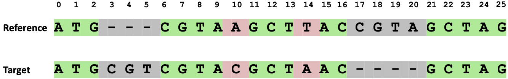
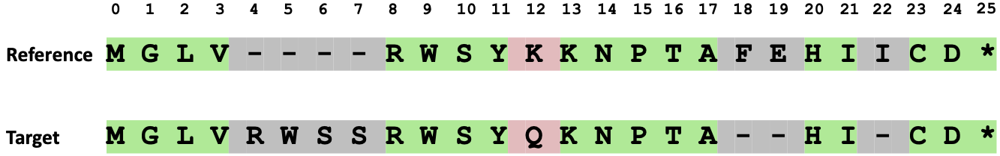

|

.. _evaluation_metrics_sequence_identity:

Evaluation metrics - sequence identity
===============================================

The main evaluation of the protein gene loci is based on the sequence identity between the reference and target proteins. We want the mapped proteins to be as similar as possible to the reference proteins. The sequence identity is calculated at the DNA and protein levels. 

DNA sequence identity score
+++++++++++++++++++++++++++++++++++++++++++++++++++++++++++++++++

We first extract transcript sequences by concatenating all exonic regions in a transcript. Subsequently, we align each transcript sequence, mapped on the target genome by LiftOn, Liftoff, or miniprot, to its respective reference sequence. This alignment is performed using the :code:`nw_trace_scan_sat` function from the `Parasail <https://github.com/jeffdaily/parasail>`_  Python package, configured with a match score of 1, mismatch penalty of -3, gap opening penalty of 2, and gap extension penalty of 2. LiftOn then reports the percent identity between the two aligned sequences, defined as in `BLAST <https://www.ncbi.nlm.nih.gov/books/NBK62051/>`_ as the number of matching bases in the two sequences over the number of alignment columns :cite:p:`altschul1990basic`.

In the example below (:numref:`figure-sequence-identity-DNA`), the reference and target sequences are aligned, and the number of matching nucleotides is 17. The total number of alignment columns is 26, resulting in a DNA sequence identity score of 65.4%. 

.. math::
    \frac{\#Matched\_nucleotide}{\#alignment\_column} = \frac{17}{26} = 65.4\%

|

.. _figure-sequence-identity-DNA:

    Alignment of reference and target DNA sequences, with 17 out of 26 alignment columns containing matched nucleotides. This results in a calculated DNA sequence identity score of 65.4%.

|

Protein sequence identity score
+++++++++++++++++++++++++++++++++++++++++++++++++++++++++++++++++

To compute protein sequence identity scores, we first generate the protein sequence for each mapped transcript by translating the sequence obtained from concatenating all CDS regions in the transcript. Then, we align each protein sequence to the reference using the `Parasail <https://github.com/jeffdaily/parasail>`_ Python package, which employs the BLOSUM 62 matrix :cite:p:`henikoff1992amino` and applies a gap opening penalty of 11 for insertions and deletions (INDELs), along with a gap extension penalty of 2.

The protein sequence identity score is calculated up to the first encountered stop codon in the target protein. Differing slightly from the BLAST-style metric employed for DNA sequence identity, LiftOn compresses the gaps in the reference alignment :cite:p:`hengleeseq_identity`. This adjustment serves two purposes: (1) to accommodate potential repeat regions that might result in a longer or shorter protein in the target genome; and (2) to avoid over-penalization of the start codon in the upstream 5' UTR or the stop codon in the downstream 3' UTR.

In the example below (:numref:`figure-sequence-identity-protein`), the reference and target protein sequences are aligned, and the number of matching amino acids is 18. The total number of alignment columns is 26, and the number of gaps in the reference protein is 4, resulting in a protein sequence identity score of 81.8%.

.. math::
    \frac{\#Matched\_AA}{\#alignment\_column - \#gaps\_in\_reference\_protein} = \frac{18}{26 - 4} = 81.8\%

|

.. _figure-sequence-identity-protein:

    Alignment of reference and target protein sequences, with 18 out of 26 alignment columns containing matched amino acids. There are 4 gaps in the reference. This results in a calculated protein sequence identity score of 81.8%.

|
|
|
|
|

.. image:: ../_images/jhu-logo-dark.png
   :alt: My Logo
   :class: logo, header-image only-light
   :align: center

.. image:: ../_images/jhu-logo-white.png
   :alt: My Logo
   :class: logo, header-image only-dark
   :align: center