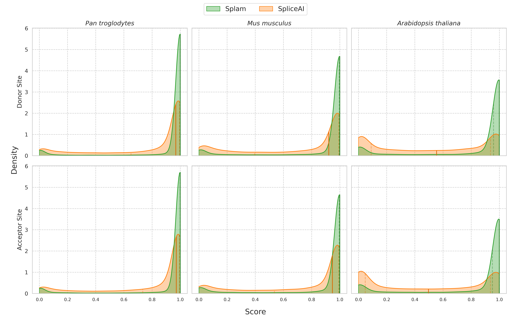
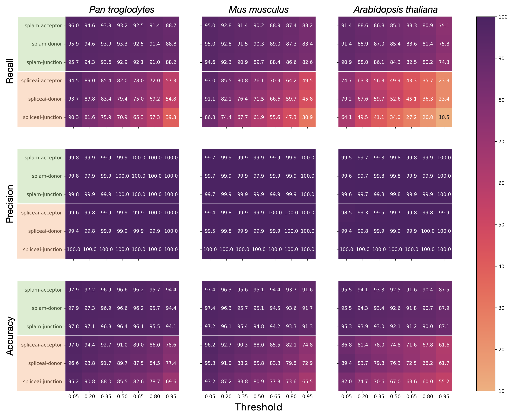

.. _generalization-introduction:

Splam generalizes on non-human species
=========================================================================

If you are considering improving your non-human RNA-Seq alignment files or transcript assemblies and wondering whether Splam is the right tool to use, this page provides the answer!

In short, the answer is **Yes ✅**!

You can perform the same analysis as described in the :ref:`alignment-detailed-section` and :ref:`annotation-detailed-section` pages. All you need is the **(1) genome** and **(2) alignment files or annotation files** of the species you are interested in.

Below is a simple example to show :ref:`Splam works on mouse <example-of-running-splam-on-mouse>` and a detailed explanation on :ref:`how well Splam works on non-human species <splam-generalization-performance>`. 

|

.. _example-of-running-splam-on-mouse:

Example: Running Splam on house mouse (*Mus musculus*) 
++++++++++++++++++++++++++++++++++++++++++++++++++++++++++++++++

In this example, we will be scoring the full GRCm39 assembly of mouse chromosome 19. The steps are basically the same as the :ref:`human example <annotation-detailed-section>`, which you should check out first. For brevity, we only summarize the main code here, and detailed explanations about the outputs and arguments of each step can be found in :ref:``

|

.. _mouse-prepare-input:

Step 1: Preparing your input files
------------------------------------

For non-human species, you need four files for running Splam. It is very similar to the :ref:`human analysis workflow <annotation-prepare-input>`, with the key difference being an additional file which tells Splam the length of each chromosome. This information helps Splam handle introns that are at the ends of the chromosome. Splam comes with this information for humans, but not for other species.

.. admonition:: Input files
   :class: note

   1. An annotation file in :code:`GFF` or :code:`GTF` format [`example file: mouse_chr19.gff <https://github.com/Kuanhao-Chao/splam/blob/main/test/mouse_chr19.gff>`_].  
   2. A reference genome in :code:`FASTA` format [`example file: mouse_chr19.fa <https://github.com/Kuanhao-Chao/splam/blob/main/test/mouse_chr19.fa>`_].
   3. The Splam model, which you can find here: `splam.pt <https://github.com/Kuanhao-Chao/splam/blob/main/model/splam_script.pt>`_
   4. An assembly report in :code:`tsv` format [`example file: GRCm39_assembly_report.txt <https://github.com/Kuanhao-Chao/splam/blob/main/test/GRCm39_assembly_report.txt>`_].

.. admonition:: Assembly report
   :class: important

   For non-human species, remember to include an assembly report with your input files! It is advised to download the assembly report from the `NCBI FTP site <https://ftp.ncbi.nlm.nih.gov/>`, along with your :code:`GFF` or :code:`GTF` annotation file and :code:`FASTA` genome. 

|

.. _mouse-extract-introns:

Step 2: Extracting introns in your annotation file
-----------------------------------------------------

In this step, you take :ref:`an annotation file (1) <mouse-prepare-input>` and run

.. code-block:: bash

   splam extract mouse_chr19_subset.gff -o tmp_out_generalization

This gives you a :code:`BED` file with the extracted introns in :code:`tmp_out_generalization/junction.bed`.

|

.. _mouse-score-introns:

Step 3: Scoring extracted introns
-----------------------------------

In this step, the goal is to score all the extracted splice junctions. To accomplish this, you will need 4 essential files. **(1)** The BED file that was generated in :ref:`Step 2 <mouse-extract-introns>`, **(2)** :ref:`the reference genome (2) <mouse-prepare-input>` which shares coordinates with the junction BED file, **(3)** :ref:`the Splam model (3) <mouse-prepare-input>`, and **(4)** :ref:`a tsv file (4)<mouse-prepare-input>` telling Splam the length of each chromosome. Once you have these files in place, you can run the following command:

.. code-block:: bash

   splam score -A GRCm39_assembly_report.txt -G mouse_chr19.fa -m ../model/splam_script.pt -o tmp_out_generalization tmp_out_generalization/junction.bed

.. admonition:: -A flag
   :class: note

   Note that for non-human species, you need to run this step with the additional :code:`-A` flag to include the assembly report.

This gives you a :code:`BED` file with the scored introns in :code:`tmp_out_generalization/junction_score.bed`.

|

.. _mouse-evaluate-isoforms:

Step 4: Evaluating isoforms by Splam scores
------------------------------------------------

To summarize the quality of each isoform, users can count how many spurious splice junctions are present in each transcript and calculate the ratio of bad splice junctions among all introns within each transcript by running the following Splam command: 

.. code-block:: bash

   splam clean -o tmp_out_generalization -t 0.8

This gives you a cleaned :code:`GFF` file at :code:`tmp_out_generalization/cleaned.gff`.

|
|

.. _splam-generalization-performance:

Explanation: Splam's performance on non-human species
+++++++++++++++++++++++++++++++++++++++++++++++++++++++

Although Splam was trained on human datasets, we have shown that the model is able to generalize to other eukaryotic genomes, including plants. In our investigation, we tested the performance of Splam on the Chimpanzee (*Pan troglodytes*), Mouse (*Mus musculus*), and Thale cress, a flowering plant (*Arabidopsis thaliana*), genomes. We report that Splam outperforms SpliceAI in recall, precision, and accuracy, on every score threshold for every species. 

|

.. _generalization-data-curation:

Data curation 
----------------

For each species, we curated our positive and negative datasets similar to the Positive-MANE and Negative-Random strategies from :ref:`Behind the scenes <data-curation>`. The positive dataset was generated from the complete RefSeq/TAIR annotation files downloaded from NCBI, where we extracted the introns from every transcript, filtered out poor annotations, and saved the remaining ~200k as splice junctions. The negative dataset was generated by randomly selecting variable-length canonical GT-AG pairs from the opposite strand of protein-coding genes. 

For both datasets, we randomly sampled 25,000 splice junctions and ran Splam and SpliceAI on them to compare results.

|

.. _generalization-key-findings:

Key findings
----------------

We find that Splam is able to quickly and accurately classify positive and negative samples, even in species as distant as plants (*Arabidopsis thaliana*). For the positive samples, Splam correctly classified the vast majority with a high score, whereas SpliceAI struggled more, particularly with *Arabidopsis*. Moreover, we find that Splam is decisive, with medians values for all three species at 1.0, while SpliceAI's distribution is more evenly spread (:numref:`generalization-score-dist`). 

.. _generalization-score-dist:

   A comparison of the score distributions between Splam (green) and SpliceAI (orange) for the positive dataset. The top row represents donor site scores and the bottom row represents acceptor site scores. The darkened vertical line through the distribution represents the median value, while the two dotted vertical lines represent the first and third quartiles. Splam demonstrates the ability to correctly score positive samples highly, with a peak near 1.0 for all three species. SpliceAI's distributions are more spread out, especially for *Arabidopsis*, which exhibits an M-shaped distribution.

|

Combining this result with the negative data, we calculate summary statistics that help us gauge the performance of Splam at various thresholds. We observe that the recall/sensitivity, precision, and accuracy of Splam outperform SpliceAI at every score threshold for every species, visualized in :numref:`generalization-heatmap`. Additionally, the figure demonstrates Splam's consistency across a wide range of score thresholds. 

.. _generalization-heatmap:

   A grid of heatmaps portraying the recall (top), precision (middle), and accuracy (bottom) of both models on the chimpanzee (left), mouse (middle), and *Arabidopsis* (right) genomes, across a variety of score thresholds (x-axis). For each heatmap, the top three rows (green) represent Splam, and the bottom three rows (orange) represent SpliceAI, where each is examined at the donor, acceptor, and splice junction levels. The performance metrics are reported as percentages on the heatmap. We observe that Splam exhibits consistently high recall and accuracy whereas SpliceAI's swiftly declines with increasing score thresholds. Precision for both models is consistently high. 

|

The results of this investigation demonstrate Splam's ability to generalize well on non-human species, including both animal and plant genomes. Additionally, we show Splam performing consistently and accurately on a wide range of score thresholds. 

|
|
|
|
|

.. image:: ../_images/jhu-logo-dark.png
   :alt: My Logo
   :class: logo, header-image only-light
   :align: center

.. image:: ../_images/jhu-logo-white.png
   :alt: My Logo
   :class: logo, header-image only-dark
   :align: center