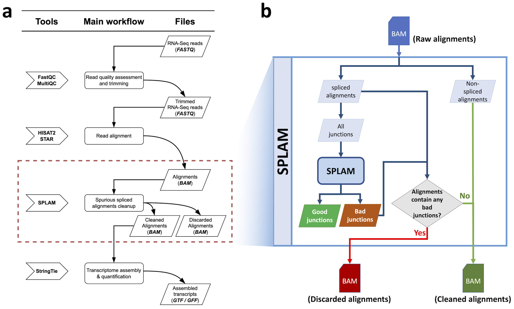
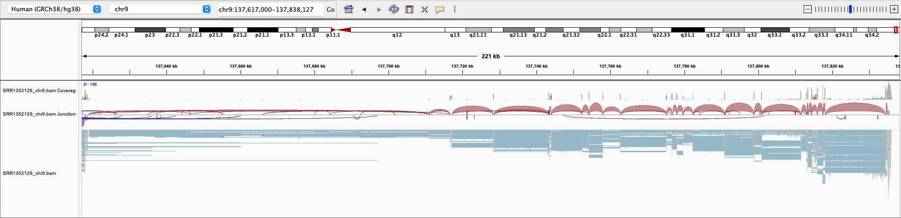
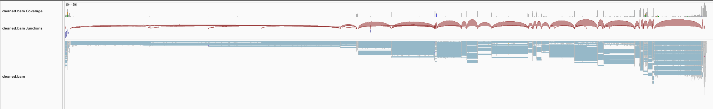
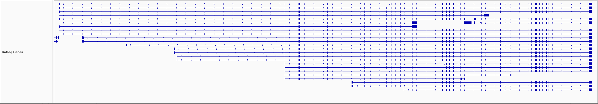
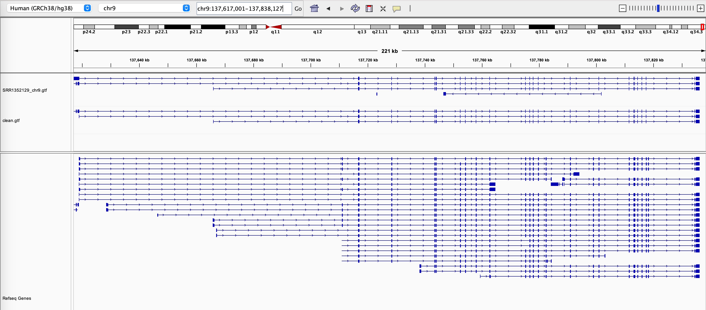

.. _alignment-detailed-section:

Lift-over from *GRCh38* to *T2T-CHM13*
===================================================================

.. _alignment-introduction:

Introduction
+++++++++++++++++++++++++++++++++++

You are analyzing your RNA-Seq reads using a standard RNA-Seq pipeline. After performing quality control, you have utilized popular spliced aligners such as :code:`HISAT2` and :code:`STAR` to align the reads to the genome. While inspecting the alignments in IGV, you have noticed that some reads are spliced and aligned across different gene loci or intergenic regions. 

.. Here is an example of the EHMT1 gene locus on chromosome 9 visulaized in IGV. This protein-coding gene is located on the forward strand; however, we have observed that the splice aligner generates several splice alignments on the reverse strand. 

This raises concerns regarding the accuracy of these splice alignments and the authenticity of the reads originating from these locations. Additionally, you are curious **if there is a systematic approach to validate these splice alignments**. Unfortunately, there are currently no available tools that can assess the results generated by the aligners. Consequently,

.. important::

    **We propose running Splam as a new step in RNA-Seq analysis pipeline to score all splice junctions.**

The power of Splam lies in its ability to filter splice alignments without relying on complex statistical rules. Instead, it utilizes our trained deep learning model to evaluate the DNA sequences surrounding the donor and acceptor sites. Splam learns the splice junction patterns. It identifies and removes splice alignments that exhibit low confidence splice junctions.

Splam offers solutions to several problems by:

1. Distinguishing high-quality spliced alignments from those with low confidence.
2. Providing a systematic approach to assess all splice alignments within an alignment file. Additionally, it eliminates erroneous splice alignments, thereby enhancing downstream transcriptome assembly.
3. Potentially aiding in understanding the biases inherent in splice aligners.
4. There are more potential usages to be explored!

|

Workflow overview
+++++++++++++++++++++++++++++++++++

Before diving into details of each step, here is an overview of the workflow. :numref:`alignment-cleanup-workflow` **(a)** is the workflow of running Splam in the standard RNA-Seq pipeline, and :numref:`alignment-cleanup-workflow` **(b)** is the workflow of spurious splice alignment removal.

Splam **takes a sorted alignment file**, extracts all splice junctions, and scores all of them. Furthermore, Splam cleans up the alignment file by removing spliced alignments with poor quality splice junctions, and **outputs a new sorted alignment file**. 

.. _alignment-cleanup-workflow:

    The Splam workflow for cleaning up spurious spliced alignments in an alignment file.

|

.. _alignment-prepare-input:

Step 1: Preparing your input files
+++++++++++++++++++++++++++++++++++

The first step is to prepare three files for Splam analysis. In this tutorial, we will be using a toy dataset.

.. admonition:: Input files
    :class: note

    1. An alignment file in :code:`BAM` format [`example file: SRR1352129_chr9_sub.bam <https://github.com/Kuanhao-Chao/splam/blob/main/test/SRR1352129_chr9_sub.bam>`_].  
    2. A reference genome in :code:`FASTA` format [`example file: chr9_subset.fa <https://github.com/Kuanhao-Chao/splam/blob/main/test/chr9_subset.fa>`_].
    3. The Splam model, which you can find here: `splam.pt <https://github.com/Kuanhao-Chao/splam/blob/main/model/splam_script.pt>`_

|

.. _alignment-extract-introns:

Step 2: Extracting splice junctions in your alignment file
+++++++++++++++++++++++++++++++++++++++++++++++++++++++++++++++

In this step, you take :ref:`an alignment file (1) <alignment-prepare-input>` and run

.. code-block:: bash

    splam extract -P SRR1352129_chr9_sub.bam -o tmp_out_alignment

The primary outputs for this step is a :code:`BED` file containing the coordinates of each junction and some temporary files. 

Splam iterates through the :code:`BAM` file, extracts all splice junctions in alignments, and writes their coordinates into a :code:`BED` file. By default, the :code:`BED` is written into :code:`tmp_out/junction.bed`. The :code:`BED` file consists of six columns: :code:`CHROM`, :code:`START`, :code:`END`, :code:`JUNC_NAME`, :code:`INTRON_NUM`, and :code:`STRAND`. Here are a few entries from the :code:`BED` file:

**Output:** :code:`junction.bed`

.. code-block:: text
    :linenos:

    chr9    4849549 4860125 JUNC00000007    3       +
    chr9    5923308 5924658 JUNC00000008    6       -
    chr9    5924844 5929044 JUNC00000009    8       -

Note that in this command, we run with the argument :code:`-P / --paired`. This argument should be selected based on the RNA sequencing read type. There are two types of RNA sequencing read types: single-read and paired-end sequencing. For a more detailed explanation, you can refer to this `page <https://www.illumina.com/science/technology/next-generation-sequencing/plan-experiments/paired-end-vs-single-read.html>`_.

By default, Splam processes alignments without pairing and bundling them. If your RNA-Seq sample is single-read, there is no need to set this argument. However, if your RNA-Seq sample is from paired-end sequencing, it is highly recommended to run Splam with the :code:`-P / --paired` argument. Otherwise, if an alignment is removed, the flag of its mate will not be unpaired. It is worth noting that it takes longer to pair alignments in the BAM file, but it produces more accurate flags. 

.. admonition::  Here are some **optional arguments**:
    :class: note

    .. dropdown:: :code:`-P / --paired`
        :animate: fade-in-slide-down
        :title: bg-light font-weight-bolder
        :body: bg-light text-left

        This argument bundles and pairs alignment reads. If your sample is paired-end RNA-Seq, you should run Splam with this argument to ensure more accurate flag updates.

    .. dropdown:: :code:`-n / --write-junctions-only`
        :animate: fade-in-slide-down
        :title: bg-light font-weight-bolder
        :body: bg-light text-left
        
        If you only want to extract splice junctions from the BAM file without running the subsequent cleaning step, you can use the :code:`-n / --write-junctions-only` argument to skip writing out temporary files. This argument makes splice junction extraction faster!

    .. dropdown:: :code:`-M / --max-splice DIST`
        :animate: fade-in-slide-down
        :title: bg-light font-weight-bolder
        :body: bg-light text-left

        The maximum length for splice junctions is 100,000nt by default. This means that any splice junctions in spliced alignments longer than the maximum splice junction length will be removed.

    .. dropdown:: :code:`-g / --bundle-gap GAP`
        :animate: fade-in-slide-down
        :title: bg-light font-weight-bolder
        :body: bg-light text-left

        If you are running with a single-end RNA-Seq sample, then you do not need to worry about the :code:`-g / --bundle-gap GAP` argument. However, if you are working with a paired-end RNA-Seq sample and using the :code:`-P / --paired` argument, then this parameter becomes significant. The algorithm for extracting splice junctions in paired-end RNA-Seq data begins by bundling alignments. As alignments overlap, the bundle extends accordingly. Regions with no alignment coverage are referred to as "gaps." This argument allows you to define the minimum gap size allowed within a bundle. In other words, if a gap's length exceeds the specified minimum, the regions on the left and right-hand side of the gap are treated as two separate bundles. The default value for this argument is set to 1000nt, but you can adjust it based on your specific analysis needs.

    .. dropdown:: :code:`-o / --outdir DIR`
        :animate: fade-in-slide-down
        :title: bg-light font-weight-bolder
        :body: bg-light text-left

        The directory where the output file is written to. The default output directory is :code:`tmp_out`. You can set your own output directory using this argument.

    .. dropdown:: :code:`-f / --file-format FILE_FORMAT`
        :animate: fade-in-slide-down
        :title: bg-light font-weight-bolder
        :body: bg-light text-left

        Splam automatically detects whether your input file is a BAM or GFF file based on its extension. In this section, we are using Splam to clean up a given alignment file, so please ensure that your input file has a :code:`.bam` or :code:`.BAM` extension.

|

.. _alignment-score-extracted-introns:

Step 3: Scoring extracted splice junctions
++++++++++++++++++++++++++++++++++++++++++++++++++++++++

In this step, the goal is to score all the extracted splice junctions. To accomplish this, you will need 3 essential files. (1) The BED file that was generated in :ref:`Step 2 <alignment-extract-introns>`, (2) :ref:`the reference genome (2) <alignment-prepare-input>` which shares coordinates with the junction BED file, and (3) :ref:`the Splam model (3) <alignment-prepare-input>`. Once you have these files in place, you can run the following command:

.. code-block:: bash

    splam score -G chr9_subset.fa -m ../model/splam_script.pt -o tmp_out_alignment tmp_out_alignment/junction.bed

After this step, a new :code:`BED` file is produced, featuring eight columns. Two extra columns, namely :code:`DONOR_SCORE` and :code:`ACCEPTOR_SCORE`, are appended to the file. It is worth noting that any unstranded introns are excluded from the output. (P.S. They might be from unstranded transcripts assembled by StringTie).

**Output:** :code:`junction_score.bed`

.. code-block:: text
    :linenos:

    chr9    4849549 4860125 JUNC00000007    3       +       0.7723698       0.5370769
    chr9    5923308 5924658 JUNC00000008    6       -       0.9999831       0.9999958
    chr9    5924844 5929044 JUNC00000009    8       -       0.9999883       0.9999949

.. admonition::  Here are the **required arguments**:
    :class: important

    .. dropdown:: :code:`-G / --reference-genome REF.fasta`
        :animate: fade-in-slide-down
        :title: bg-light font-weight-bolder
        :body: bg-light text-left

        The path to the reference genome in FASTA format. Please ensure that this file shares the same coordinates as your input alignment file, which is where you align your RNA-Seq reads. Splam will handle the indexing process for you if the reference genome has not been indexed yet.

    .. dropdown:: :code:`-m / --model MODEL.pt`
        :animate: fade-in-slide-down
        :title: bg-light font-weight-bolder
        :body: bg-light text-left

        This argument is the path to the trained Splam model. If you haven't downloaded the Splam model yet, here is the :ref:`link <alignment-prepare-input>`.

.. admonition::  Here are some **optional arguments**:
    :class: note

    .. dropdown:: :code:`-A / --assembly-report REPORT`
        :animate: fade-in-slide-down
        :title: bg-light font-weight-bolder
        :body: bg-light text-left

        The path to an assembly report file in :code:`tsv` format which contains the chromosome identifiers and lengths. This information is built into Splam if running on a human genome (defaults to human GRCh38, patch 14). However, **this argument is required if running on non-human species**. See :ref:`our mouse example <example-of-running-splam-on-mouse>` for reference. 

    .. dropdown:: :code:`-d / --device pytorch_DEV`
        :animate: fade-in-slide-down
        :title: bg-light font-weight-bolder
        :body: bg-light text-left

        By default, Splam automatically detects your environment and runs in :code:`cuda` mode if CUDA is available. However, if your computer is running macOS, Splam will check if :code:`mps` mode is available. If neither :code:`cuda` nor :code:`mps` are available, Splam will run in :code:`cpu` mode. You can explicitly specify the mode using the :code:`-d / --device` argument.

    .. dropdown:: :code:`-b / --batch-size BATCH`
        :animate: fade-in-slide-down
        :title: bg-light font-weight-bolder
        :body: bg-light text-left

        Additionally, you can adjust the batch size using the :code:`-b / --batch-size` argument. This argument defines the number of samples that will be propagated through the Splam network. By default, the batch size is set to 10. We recommend setting a small batch size (for instance 2) when running Splam in :code:`cpu` mode.

    .. dropdown:: :code:`-o / --outdir DIR`
        :animate: fade-in-slide-down
        :title: bg-light font-weight-bolder
        :body: bg-light text-left

        The directory where the output file is written to. The default output directory is :code:`tmp_out`. This argument is same as the one in :ref:`Step 2 <alignment-extract-introns>`. Note that if you set your own output directory, you have to set the same output directory for this step as well. Otherwise, Splam will not be able to find some essential temporary files. We recommend users not to set this argument and use the default value.

|

.. _alignment-cleanup-bam:

Step 4: Cleaning up your alignment file
++++++++++++++++++++++++++++++++++++++++++++++++++++++++

After scoring every splice junction in your alignment file, the final step of this analysis is to remove alignments with low-quality splice junctions and update 'NH' tags and flags for multi-mapped reads. You can pass the directory path to Splam using the clean mode, which will output a new cleaned and sorted BAM file. The implementation of this step utilizes the core functions of :code:`samtools sort` and :code:`samtools merge`. If you want to run this step with multiple threads, you can set the :code:`-@ / --threads` argument accordingly.

.. code-block:: bash

    splam clean -P -o tmp_out_alignment -@ 5    

**Output:** :code:`cleaned.bam`

The output file of this step is a sorted Splam-cleaned BAM file. You can replace the original BAM file with this cleaned BAM file to do the transcript assembly, quantification, and all other downstream analyses! 

.. admonition:: Splam score threshold suggestion
    :class: important

    For cleaning up BAM alignment files, we advise using a more lenient **score threshold of 0.1**. That being said, Splam is a decisive model and performs quite consistently across a wide range of thresholds, so a score threshold between 0.1 to 0.9 would work well.

.. admonition::  Here are some **optional arguments**:
    :class: note

    .. dropdown:: :code:`-P / --paired`
        :animate: fade-in-slide-down
        :title: bg-light font-weight-bolder
        :body: bg-light text-left
        
        This argument bundles and pairs alignment reads. If your sample is paired-end RNA-Seq, you should run Splam with this argument to ensure more accurate flag updates. Note that you should be consistent in setting this argument as described in :ref:`Step 2 <alignment-extract-introns>`.

    .. dropdown:: :code:`-t / --threshold threshold`
        :animate: fade-in-slide-down
        :title: bg-light font-weight-bolder
        :body: bg-light text-left

        This is the score cutoff threshold for Splam to determine whether a given splice junction is spurious (discarded) or not. It is a floating-point value between 0 and 1. If the score of either the donor or acceptor site falls below this value, then any spliced alignments containing this junction will be removed. The default threshold is set to 0.1.

    .. dropdown:: :code:`-@ / --threads threads`
        :animate: fade-in-slide-down
        :title: bg-light font-weight-bolder
        :body: bg-light text-left

        Splam utilizes the sorting, compression, and merging scripts from `samtools <https://github.com/samtools/samtools>`_. You can enable multi-threading for the final stage of BAM file sorting and merging by setting this argument. The more threads, the more efficient the operation, but also the more resource overhead. By default, the operation is performed in single-thread.

    .. dropdown:: :code:`-o / --outdir DIR`
        :animate: fade-in-slide-down
        :title: bg-light font-weight-bolder
        :body: bg-light text-left

        The directory where the output file is written to. The default output directory is :code:`tmp_out`. This argument is same as the one in :ref:`Step 2 <alignment-extract-introns>` and :ref:`Step 3 <alignment-score-extracted-introns>`. Note that if you set your own output directory, you have to set the same output directory for this step as well, or otherwise, Splam will not be able to find some essential temporary files. We recommend users not to set this argument and use the default value.

|

.. _alignment-igv-visualization:

Step 5: IGV visualization
+++++++++++++++++++++++++++++++++++

Here is an example of the EHMT1 gene locus on chromosome 9 visualized in IGV. This protein-coding gene is located on the forward strand; however, we have observed that the splice aligner generates several splice alignments on the reverse strand. 

In :numref:`figure-igv`, the first three tracks display the coverage, splice junction, and alignment information from the original alignment file of the SRR1352129 sample. The fourth, fifth, and sixth tracks show the coverage, splice junction, and alignment data obtained from the cleaned alignment file of the SRR1352129 sample, which was generated using Splam. Many of the spliced alignments on the reverse strand of EHMT1 have splice junctions with low Splam scores and were consequently removed. The Splam removal procedure results in a more refined gene locus and :ref:`enhances the transcriptome assembly <assemble-alignments-into-transcripts>`. The final track represents the RefSeq annotations of the EHMT1 gene.

    
.. _figure-igv:

    An example of a BAM file before and after Splam cleanup.

.. important::

    **Splam exclusively employs the strand information to extract the reverse complement of DNA sequences for splice junctions when necessary.** When it comes to scoring splice junctions, **Splam relies solely on the DNA sequence information**. 
    
    In the above example, Splam can distinguish that the majority of splice junctions aligned on the opposite strand of the EHMT1 gene locus are of poor quality. This final score is drawn by simply examining the DNA sequence!

|

.. _assemble-alignments-into-transcripts:

Step 6: Assembling alignments into transcripts
+++++++++++++++++++++++++++++++++++++++++++++++++++++++

We ran Stringtie to assemble the original alignment BAM file and the Splam-cleaned alignment BAM file. Subsequently, we loaded both sets of assembled transcripts along with the RefSeq annotation into IGV (:numref:`figure-EHMT1-assembly`). Upon observation, we noted that at the EHMT1 gene locus, there was originally one transcript assembled on the opposite strand of this gene, which will no longer be assembled after applying Splam's cleaning process, and the 3' end of the transcripts become more accurate!

.. _figure-EHMT1-assembly:

    The assembly results of the original alignment file and the Splam-cleaned alignment file.

.. seealso::
    
    * `StringTie <https://ccb.jhu.edu/software/stringtie/>`_ to learn more about the transcriptome assembly

|

.. _alignment-whats-next:

What's next?
+++++++++++++++++++++++++++++++++++++++++++++++++++++++

Congratulations! You have finished this tutorial.

.. seealso::
    
    * :ref:`behind-the-scenes-splam` to understand how Splam is designed and trained
    * :ref:`Q&A` to check out some common questions

|
|
|
|

.. image:: ../_images/jhu-logo-dark.png
   :alt: My Logo
   :class: logo, header-image only-light
   :align: center

.. image:: ../_images/jhu-logo-white.png
   :alt: My Logo
   :class: logo, header-image only-dark
   :align: center