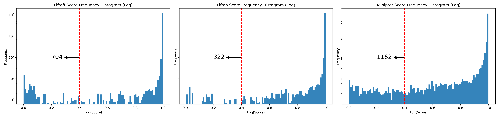
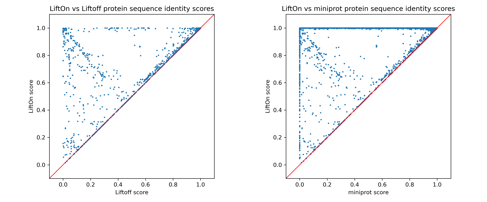

.. _alignment-detailed-section:

Human (*GRCh38* to *T2T-CHM13*)
===================================================================

.. _alignment-introduction:

Introduction
+++++++++++++++++++++++++++++++++++

.. .. important::

..     **We propose running Splam as a new step in RNA-Seq analysis pipeline to score all splice junctions.**

|

.. _figure-EHMT1-assembly:

    The assembly results of the original alignment file and the Splam-cleaned alignment file.

.. _figure-EHMT1-assembly:

|

.. _alignment-whats-next:

What's next?
+++++++++++++++++++++++++++++++++++++++++++++++++++++++

Congratulations! You have finished this tutorial.

.. seealso::
    
    * :ref:`behind-the-scenes-splam` to understand how LiftOn is designed
    * :ref:`Q&A` to check out some common questions

|
|
|
|

.. image:: ../../_images/jhu-logo-dark.png
   :alt: My Logo
   :class: logo, header-image only-light
   :align: center

.. image:: ../../_images/jhu-logo-white.png
   :alt: My Logo
   :class: logo, header-image only-dark
   :align: center