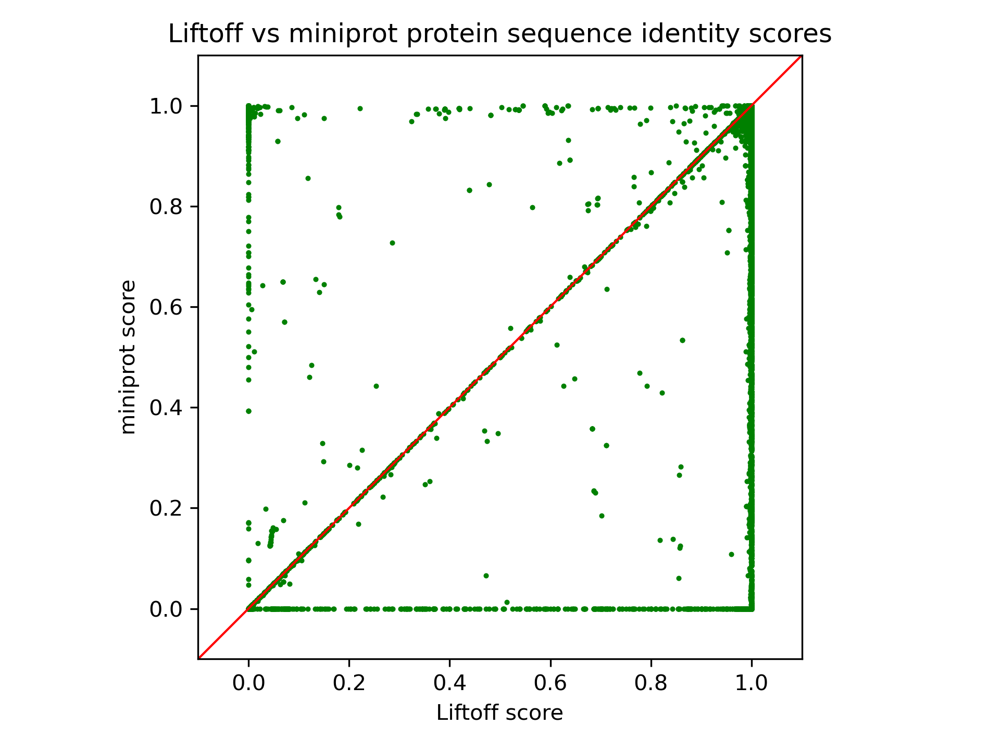
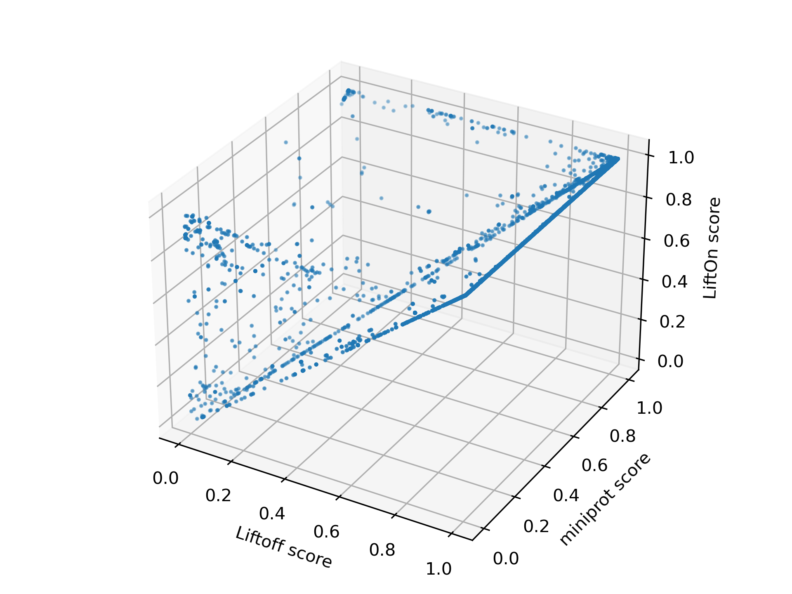
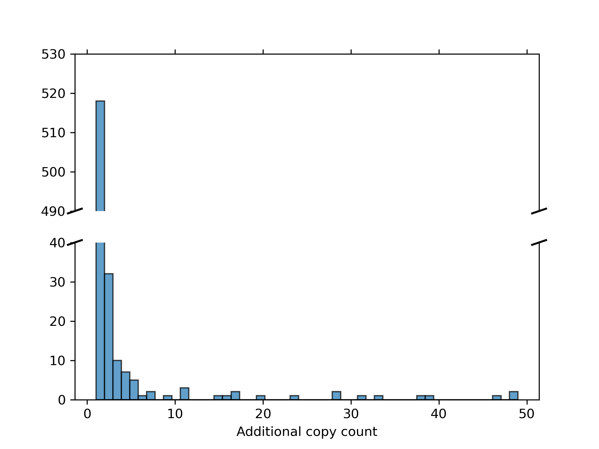

.. raw:: html

    

.. _alignment-detailed-section:

Human (*GRCh38* to *T2T-CHM13*)
===================================================================

.. _alignment-introduction:

Input files
+++++++++++++++++++++++++++++++++++

To run this examples, you need to first download the following three input files

* **Input**
    1. target **Genome** :math:`T` in FASTA : `chm13v2.0.fa <ftp://ftp.ccb.jhu.edu/pub/LiftOn/human/chm13v2.0.fa>`_ 
    2. reference **Genome** :math:`R` in FASTA : `GCF_000001405.40_GRCh38.p14_genomic.fna <ftp://ftp.ccb.jhu.edu/pub/LiftOn/human/GCF_000001405.40_GRCh38.p14_genomic.fna>`_
    3. reference **Annotation** :math:`R_A` in GFF3 : `NCBI_RefSeq_no_rRNA.gff <ftp://ftp.ccb.jhu.edu/pub/LiftOn/human/NCBI_RefSeq_no_rRNA.gff>`_

.. .. important::

..     **We propose running Splam as a new step in RNA-Seq analysis pipeline to score all splice junctions.**

There is only one command you need to run LiftOn:

.. code-block:: bash

    lifton -D -g NCBI_RefSeq_no_rRNA.gff -o lifton.gff3 -copies chm13v2.0.fa GCF_000001405.40_GRCh38.p14_genomic.fna

After successfully running LiftOn, you will get the following file and output directory:

* **Output**: 
    1. LiftOn annotation file in GFF3: ftp://ftp.ccb.jhu.edu/pub/LiftOn/human/lifton.gff3
    2. LiftOn output directory: ftp://ftp.ccb.jhu.edu/pub/LiftOn/human/lifton_output/

       *  `score.txt <ftp://ftp.ccb.jhu.edu/pub/LiftOn/human/lifton_output/score.txt>`_
       *  `extra_copy_features.txt <ftp://ftp.ccb.jhu.edu/pub/LiftOn/human/lifton_output/extra_copy_features.txt>`_
       *  `unmapped_features.txt <ftp://ftp.ccb.jhu.edu/pub/LiftOn/human/lifton_output/unmapped_features.txt>`_

|
|

Results
+++++++++++++++++++++++++++++++++++

Here are some visualization results comparing LiftOn annotation to (1) Liftoff and (2) miniprot annotation. 

First, we calculate the protein sequence identity score for every protein-coding transcript (check :ref:`lifton_sequence_identity` section) for three annotations, LiftOn, Liftoff, and miniprot. 

:numref:`figure-human_miniprot_vs_liftoff` compares the protein-coding gene mapping of Liftoff, based on DNA alignment, with miniprot, utilizing protein-to-DNA alignment. Dots in the lower right signify transcripts where Liftoff outperformed miniprot in protein sequence identity, while the upper left indicates transcripts where miniprot excelled. LiftOn employs the PM algorithm to enhance annotations in both, achieving improved protein-coding gene annotation, as neither approach dominates the other.

.. _figure-human_miniprot_vs_liftoff:

    The scatter plot of protein sequence identity comparing between miniprot (y-axis) and Liftoff (x-axis), 
|

Next, we individually assess LiftOn in comparison to Liftoff and miniprot. In the comparison of LiftOn versus Liftoff (:numref:`figure-human_lifton_vs_liftoff_vs_miniprot`, left), 2,075 transcripts demonstrate higher protein sequence identity, with 460 achieving 100% identity. Similarly, in the LiftOn versus miniprot comparison (:numref:`figure-human_lifton_vs_liftoff_vs_miniprot`, right), 30,276 protein-coding transcripts exhibit superior matches, elevating 22,616 to identical status relative to the reference.

.. _figure-human_lifton_vs_liftoff_vs_miniprot:
.. figure::  ../../_images/human_refseq/combined_scatter_plots.png
    :align:   center
    :scale:   21 %

    The scatter plot of protein sequence identity comparing between LiftOn (y-axis) and Liftoff (x-axis) (left) and comparing between LiftOn (y-axis) and miniprot (x-axis) (right).
|

We visualize the transcripts in a 3-D plot, incorporating LiftOn, Liftoff, and miniprot scores (:numref:`figure-human_3D_scatter`). The majority of dots reside above the :math:x=y plane, suggesting that LiftOn features longer proteins aligning with those in the reference annotation.

.. _figure-human_3D_scatter:

    The 3-D scatter plot of protein sequence identity comparing between LiftOn (y-axis), Liftoff (x-axis), and miniprot (z-axis).

|

We plotted the distribution of protein sequence identities(:numref:`figure-human_frequency_log`). LiftOn (middle) has the smallest left tail.

.. _figure-human_frequency_log:
.. figure::  ../../_images/human_refseq/combined_frequency_log.png
    :align:   center
    :scale:   12 %

    Frequency plots in logarithmic scale of protein sequence identity for Liftoff (left), LiftOn (middle), and miniprot (right) for the results of mouse to rat lift-over.

|

The Circos plot in :numref:`figure-human_circos` shows their relative positions between the two genomes. The plot illustrates that the extra copies were predominantly located on the same chromosomes in both GRCh38 and T2T-CHM13. 

.. _figure-human_circos:
.. figure::  ../../_images/human_refseq/human_refseq_circos_plot.pdf
    :align:   center
    :scale:  20 %

    Circos plot illustrating the locations of extra gene copies found on T2T-CHM13 (left side) compared to GRCh38 (right side). Each line shows the location of an extra copy, and lines are color-coded by the chromosome of the original copy.

|

.. _figure-human_extra_copy_fq:

    Frequency plot for additional gene copy.

|

Finally, we examined the order of protein-coding genes (:numref:`figure-human_gene_order`) between the two genomes and observed that, as expected, nearly all genes occur in the same order and orientation in both human genomes.

.. _figure-human_gene_order:

    Protein-gene order plot, with the x-axis representing the reference genome (GRCh38) and the y-axis representing the target genome (T2T-CHM13). The protein sequence identities are color-coded on a logarithmic scale, ranging from green to red. Green represents a sequence identity score of 1, while red corresponds to a sequence identity score of 0.

|

.. _alignment-whats-next:

What's next?
+++++++++++++++++++++++++++++++++++++++++++++++++++++++

Congratulations! You have finished this tutorial.

.. seealso::
    
    * :ref:`behind-the-scenes-splam` to understand how LiftOn is designed
    * :ref:`Q&A` to check out some common questions

|
|
|
|

.. image:: ../../_images/jhu-logo-dark.png
   :alt: My Logo
   :class: logo, header-image only-light
   :align: center

.. image:: ../../_images/jhu-logo-white.png
   :alt: My Logo
   :class: logo, header-image only-dark
   :align: center