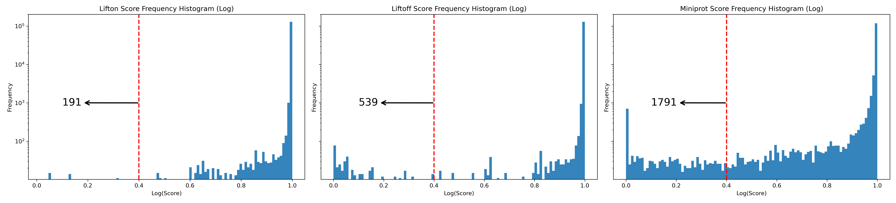

.. _alignment-detailed-section:

Human (*GRCh38* to *T2T-CHM13*)
===================================================================

.. _alignment-introduction:

Input files
+++++++++++++++++++++++++++++++++++

To run this examples, you need to first download the following three input files

* **Input**
    1. target **Genome** :math:`T` in FASTA : ftp://ftp.ccb.jhu.edu/pub/LiftOn/human/chm13v2.0.fa
    2. reference **Genome** :math:`R` in FASTA : ftp://ftp.ccb.jhu.edu/pub/LiftOn/human/GCF_000001405.40_GRCh38.p14_genomic.fna
    3. reference **Annotation** :math:`R_A` in GFF3 : ftp://ftp.ccb.jhu.edu/pub/LiftOn/human/NCBI_RefSeq_no_rRNA.gff

.. .. important::

..     **We propose running Splam as a new step in RNA-Seq analysis pipeline to score all splice junctions.**

This is the LiftOn command to execute:
 
.. code-block:: bash

    lifton -D -g NCBI_RefSeq_no_rRNA.gff -o lifton.gff3 -copies chm13v2.0.fa GCF_000001405.40_GRCh38.p14_genomic.fna

After successfully running LiftOn, you will get

* **Output**: 
    1. LiftOn annotation file in GFF3: ftp://ftp.ccb.jhu.edu/pub/LiftOn/human/lifton.gff3
    2. Protein sequence identities: ftp://ftp.ccb.jhu.edu/pub/LiftOn/human/score.txt

|

Results
+++++++++++++++++++++++++++++++++++

Here are some visualization results comparing LiftOn annotation to (1) Liftoff and (2) miniprot annotation. 

First, we calculate the protein sequence identity score for every protein-coding transcript (:ref:`lifton_sequence_identity`) for three annotations, LiftOn, Liftoff, and miniprot. 

.. _figure-EHMT1-assembly:
.. figure::  ../../_images/human_refseq/Liftoff_miniprot/parasail_identities.png
    :align:   center
    :scale:   23 %

    The assembly results of the original alignment file and the Splam-cleaned alignment file.

.. _figure-EHMT1-assembly:
.. figure::  ../../_images/human_refseq/combined_scatter_plots.png
    :align:   center
    :scale:   23 %

    The assembly results of the original alignment file and the Splam-cleaned alignment file.

.. _figure-EHMT1-assembly:
.. figure::  ../../_images/human_refseq/3d_scatter.png
    :align:   center
    :scale:   30 %

    The assembly results of the original alignment file and the Splam-cleaned alignment file.

.. _figure-EHMT1-assembly:

    The assembly results of the original alignment file and the Splam-cleaned alignment file.

.. _figure-EHMT1-assembly:
.. figure::  ../../_images/human_refseq/human_refseq_circos_plot.pdf
    :align:   center
    :scale:  20 %

    The assembly results of the original alignment file and the Splam-cleaned alignment file.

.. _figure-EHMT1-assembly:
.. figure::  ../../_images/human_refseq/extra_cp/frequency.png
    :align:   center
    :scale:  30 %

    The assembly results of the original alignment file and the Splam-cleaned alignment file.

|

.. _alignment-whats-next:

What's next?
+++++++++++++++++++++++++++++++++++++++++++++++++++++++

Congratulations! You have finished this tutorial.

.. seealso::
    
    * :ref:`behind-the-scenes-splam` to understand how LiftOn is designed
    * :ref:`Q&A` to check out some common questions

|
|
|
|

.. image:: ../../_images/jhu-logo-dark.png
   :alt: My Logo
   :class: logo, header-image only-light
   :align: center

.. image:: ../../_images/jhu-logo-white.png
   :alt: My Logo
   :class: logo, header-image only-dark
   :align: center