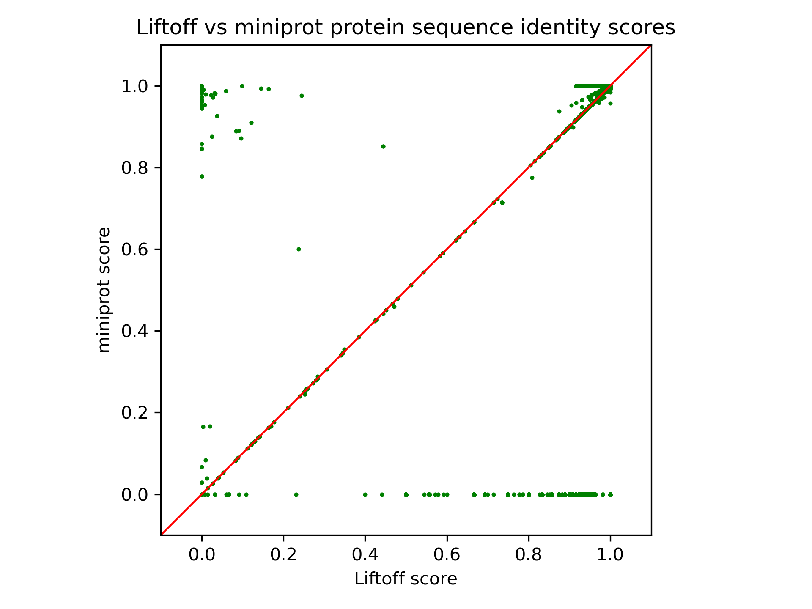
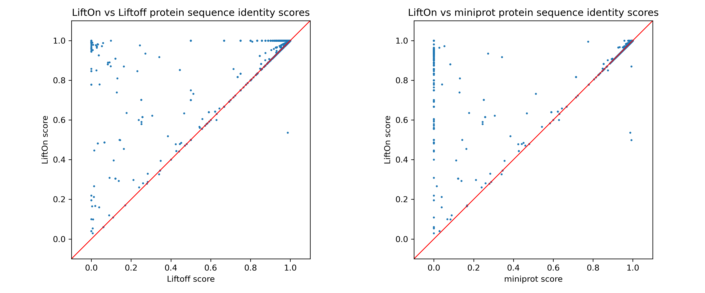

.. raw:: html

    

|

.. _same_species_liftover_bee:

Honey bee
=========================================================================

*Apis mellifera* 

Input files
+++++++++++++++++++++++++++++++++++

To run this example, download the following three input files.

* **Input**
    1. target **Genome** :math:`T` in FASTA : `ASM1932182v1_genomic.fna <ftp://ftp.ccb.jhu.edu/pub/LiftOn/bee/ASM1932182v1_genomic.fna>`_ 
    2. reference **Genome** :math:`R` in FASTA : `HAv3.1_genomic.fna <ftp://ftp.ccb.jhu.edu/pub/LiftOn/bee/HAv3.1_genomic.fna>`_
    3. reference **Annotation** :math:`R_A` in GFF3 : `HAv3.1_genomic.gff <ftp://ftp.ccb.jhu.edu/pub/LiftOn/bee/HAv3.1_genomic.gff>`_

.. .. important::

..     **We propose running Splam as a new step in RNA-Seq analysis pipeline to score all splice junctions.**

There is only one command you need to run LiftOn:

.. code-block:: bash

    lifton -D -g HAv3.1_genomic.gff -o lifton.gff3 -copies ASM1932182v1_genomic.fna HAv3.1_genomic.fna

After successfully running LiftOn, you will get the following file and output directory:

* **Output**: 
    1. LiftOn annotation file in GFF3: ftp://ftp.ccb.jhu.edu/pub/LiftOn/bee/lifton.gff3
    2. LiftOn output directory: ftp://ftp.ccb.jhu.edu/pub/LiftOn/bee/lifton_output/

       *  `score.txt <ftp://ftp.ccb.jhu.edu/pub/LiftOn/bee/lifton_output/score.txt>`_
       *  `extra_copy_features.txt <ftp://ftp.ccb.jhu.edu/pub/LiftOn/bee/lifton_output/extra_copy_features.txt>`_
       *  `unmapped_features.txt <ftp://ftp.ccb.jhu.edu/pub/LiftOn/bee/lifton_output/unmapped_features.txt>`_

|
|

Results
+++++++++++++++++++++++++++++++++++

Genome annotation evaluation
------------------------------

Here are some visualization results comparing LiftOn annotation to (1) Liftoff and (2) miniprot annotation. 

First, we calculate the protein sequence identity score for every protein-coding transcript (check :ref:`lifton_sequence_identity` section) for three annotations, LiftOn, Liftoff, and miniprot. 

:numref:`figure-bee_miniprot_vs_liftoff` compares the protein-coding gene mapping of Liftoff, based on DNA alignment, with miniprot, utilizing protein-to-DNA alignment. Dots in the lower right signify transcripts where Liftoff outperformed miniprot in protein sequence identity, while the upper left indicates transcripts where miniprot excelled. LiftOn employs the PM algorithm to enhance annotations in both, achieving improved protein-coding gene annotation, as neither approach dominates the other.

.. _figure-bee_miniprot_vs_liftoff:

    The scatter plot of protein sequence identity comparing between miniprot (y-axis) and Liftoff (x-axis). Each dot represents a protein-coding transcript.
|

Next, we individually assess LiftOn in comparison to Liftoff and miniprot. In the comparison of LiftOn versus Liftoff (:numref:`figure-bee_lifton_vs_liftoff_vs_miniprot`, left), 849 transcripts demonstrate higher protein sequence identity, with 80 achieving 100% identity. Similarly, in the LiftOn versus miniprot comparison (:numref:`figure-bee_lifton_vs_liftoff_vs_miniprot`, right), 7710 protein-coding transcripts exhibit superior matches, elevating 4830 to identical status relative to the reference.

.. _figure-bee_lifton_vs_liftoff_vs_miniprot:

    The scatter plot of protein sequence identity comparing between LiftOn (y-axis) and Liftoff (x-axis) (left) and comparing between LiftOn (y-axis) and miniprot (x-axis) (right).
|

We visualize the transcripts in a 3-D plot, incorporating LiftOn, Liftoff, and miniprot scores (see Figure :numref:`figure-bee_3D_scatter`) to provide a comprehensive comparison of the three tools. If a dot is above the :math:`x=y` plane, it indicates that the protein-coding transcript annotation of LiftOn generates a longer valid protein sequence aligning to the full-length reference protein. The 3-D plot reveals that the majority of dots are above the :math:`x=y` plane, suggesting that LiftOn annotation is better.

.. _figure-bee_3D_scatter:

    The 3-D scatter plot of protein sequence identity comparing between LiftOn (y-axis), Liftoff (x-axis), and miniprot (z-axis).

|

Next, we check the distribution of protein sequence identities (see :numref:`figure-bee_frequency_log`). Among the three tools, LiftOn (middle) exhibits the smallest left tail, with 70 protein-coding transcripts having a protein sequence identity of :math:`< 0.4`.

.. _figure-bee_frequency_log:

    Frequency plots in logarithmic scale of protein sequence identity for Liftoff (left), LiftOn (middle), and miniprot (right) for the results of bee lift-over.

|

Finding extra copies of lift-over features
-------------------------------------------------

LiftOn also has a module to find extra copies by using `intervaltree <https://github.com/chaimleib/intervaltree>`_, `Liftoff <https://academic.oup.com/bioinformatics/article/37/12/1639/6035128?login=true>`_, and `miniprot <https://academic.oup.com/bioinformatics/article/39/1/btad014/6989621>`_. The Circos plot in :numref:`figure-bee_circos` shows their relative positions between the two genomes. The plot illustrates that the extra copies were predominantly located on the same chromosomes in both HAv3.1 and ASM1932182. The frequency plot of extra copy features are show in :numref:`figure-bee_extra_copy_fq`.

.. _figure-bee_circos:
.. figure::  ../../_images/bee/circos_plot.png
    :align:   center
    :scale:  28 %

    Circos plot illustrating the locations of extra gene copies found on ASM1932182 (left side) compared to HAv3.1 (right side). Each line shows the location of an extra copy, and lines are color-coded by the chromosome of the original copy.

|

.. _figure-bee_extra_copy_fq:

    Frequency plot for additional gene copy.

|

Finally, we examined the order of protein-coding genes (:numref:`figure-bee_gene_order`) between the two genomes and observed that, as expected, nearly all genes occur in the same order and orientation in both human genomes.

.. _figure-bee_gene_order:

    Protein-gene order plot, with the x-axis representing the reference genome (HAv3.1) and the y-axis representing the target genome (ASM1932182). The protein sequence identities are color-coded on a logarithmic scale, ranging from green to red. Green represents a sequence identity score of 1, while red corresponds to a sequence identity score of 0.

|

What's next?
+++++++++++++++++++++++++++++++++++++++++++++++++++++++

Congratulations! You have finished this tutorial.

.. seealso::
    
    * :ref:`behind-the-scenes-splam` to understand how LiftOn is designed
    * :ref:`Q&A` to check out some common questions

|
|
|
|
|

.. image:: ../../_images/jhu-logo-dark.png
   :alt: My Logo
   :class: logo, header-image only-light
   :align: center

.. image:: ../../_images/jhu-logo-white.png
   :alt: My Logo
   :class: logo, header-image only-dark
   :align: center