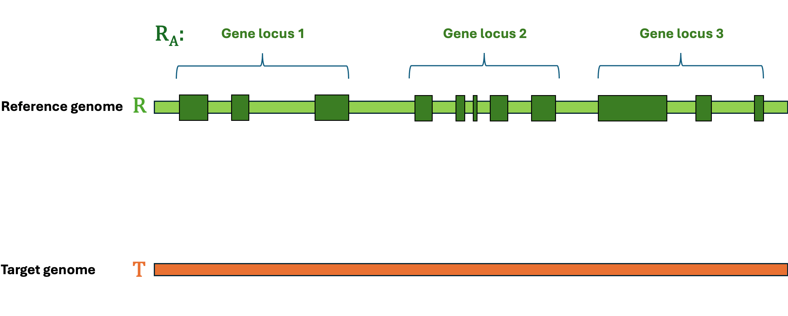

.. raw:: html

    
    <link rel="preload" href="./_images/jhu-logo-dark.png" as="image">

|

.. _main:

LiftOn's tutorial
*************************

.. raw:: html

    <embed>
        

            
            
        

    </embed>

.. image:: https://img.shields.io/badge/License-GPLv3-yellow.svg
    :target: https://img.shields.io/badge/License-GPLv3-yellow.svg

.. image:: https://img.shields.io/badge/version-v.0.0.1-blue
    :target: https://img.shields.io/badge/version-v.0.0.1-blue

.. image:: https://static.pepy.tech/personalized-badge/lifton?period=total&units=abbreviation&left_color=grey&right_color=blue&left_text=PyPi%20downloads
    :target: https://pepy.tech/project/lifton

.. image:: https://img.shields.io/github/downloads/Kuanhao-Chao/lifton/total.svg?style=social&logo=github&label=Download
    :target: https://github.com/Kuanhao-Chao/lifton/releases

.. image:: https://img.shields.io/badge/platform-macOS_/Linux-green.svg
    :target: https://github.com/Kuanhao-Chao/lifton/releases

.. image:: https://colab.research.google.com/assets/colab-badge.svg
    :target: https://colab.research.google.com/github/Kuanhao-Chao/lifton/blob/main/notebook/lifton_example.ipynb

.. .. image:: https://img.shields.io/github/downloads/Kuanhao-Chao/LiftOn/total.svg?style=social&logo=github&label=Download
..     :target: https://img.shields.io/github/downloads/Kuanhao-Chao/LiftOn/total.svg?style=social&logo=github&label=Download

.. .. image:: https://img.shields.io/badge/platform-macOS_/Linux-green.svg
..     :target: https://img.shields.io/badge/platform-macOS_/Linux-green.svg

.. .. image:: https://colab.research.google.com/assets/colab-badge.svg
..     :target: https://colab.research.google.com/github/Kuanhao-Chao/LiftOn/blob/main/notebook/LiftOn_example.ipynb

| 

.. What is LiftOn?
.. ==================

.. raw:: html

    <link rel="stylesheet" href="https://cdnjs.cloudflare.com/ajax/libs/font-awesome/4.7.0/css/font-awesome.min.css">

    LiftOn is a homology-based lift-over tool using both DNA-DNA alignments (from <a href="https://academic.oup.com/bioinformatics/article/37/12/1639/6035128?login=true" target="_blank">Liftoff</a>, credits to <a href="https://scholar.google.com/citations?user=N3tXk7QAAAAJ&hl=en" target="_blank">Dr. Alaina Shumate</a>) and protein-DNA alignments (from <a href="https://academic.oup.com/bioinformatics/article/39/1/btad014/6989621" target="_blank">miniprot</a>, credits to <a href="http://liheng.org" target="_blank">Dr. Heng Li</a>) to accurately map annotations between genome assemblies of the same or different species. LiftOn employs a two-step <a href="https://ccb.jhu.edu/lifton/content/behind_scenes.html#protein-maximization-algorithm">protein maximization algorithm</a> to improve the annotation of protein-coding genes in the T2T-CHM13 <a href="https://s3-us-west-2.amazonaws.com/human-pangenomics/T2T/CHM13/assemblies/annotation/chm13v2.0_RefSeq_Liftoff_v5.1.gff3.gz" target="_blank">JHU RefSeqv110 + Liftoff v5.1</a> annotation. 
    The latest T2T-CHM13 annotation generated by LiftOn is available as <a href="ftp://ftp.ccb.jhu.edu/pub/data/LiftOn/JHU_LiftOn_v1.0_chm13v2.0.gff3" target="_blank">JHU_LiftOn_v1.0_chm13v2.0.gff3 <i class="fa fa-download"></i></a>.

.. 
Why LiftOn❓
==================

1. **Burgeoning number of genome assemblies**: As of December 2023, there are 30,530 eukaryotic genomes, 567,228 prokaryotic genomes, and 66,429 viruses listed on NCBI (`NCBI genome browser <https://www.ncbi.nlm.nih.gov/genome/browse/#!/overview/>`_). However, genome annotation is lagging behind. As more high-quality assemblies are generated, we need an accurate lift-over tool to annotate them.

2. **Improved protein-coding gene mapping**: The popular `Liftoff <https://academic.oup.com/bioinformatics/article/37/12/1639/6035128?login=true>`_ tool maps genes based on DNA alignments alone. `Miniprot <https://github.com/lh3/miniprot>`_ maps genes based on protein alignments but, without gene structure information, may not be as accurate on their own (See :ref:`Q&A Common mistakes of Liftoff and miniprot <why_lifton_qa>`). LiftOn combines both DNA-to-genome and protein-to-genome alignments and produces better gene mapping results! LiftOn improves upon the current released T2T-CHM13 annotation (`JHU RefSeqv110 + Liftoff v5.1 <https://s3-us-west-2.amazonaws.com/human-pangenomics/T2T/CHM13/assemblies/annotation/chm13v2.0_RefSeq_Liftoff_v5.1.gff3.gz>`_).

3. **Improved distantly related species lift-over**: A key limitation of DNA-based lift-over tools is that they do not perform well when the reference and target genomes have significantly diverged. With the help of protein alignments and the protein maximization algorithm, LiftOn improves the lift-over process between distantly related species. See ":ref:`distant_species_liftover_mouse_to_rat`" and ":ref:`distant_species_liftover_drosophila_melanogaster_2_erecta`" result sections.

LiftOn is free, it's open source, it's easy to install , and it's in Python!

|

Who is it for❓
====================================

LiftOn is designed for researchers and bioinformaticians who are interested in genome annotation. It is an easy-to-install and easy-to-run command-line tool. Specifically, it is beneficial in the following scenarios:

1. If you have sequenced and assembled a new genome and require annotation, LiftOn provides an efficient solution for generating annotations for your genome.

2. LiftOn is an excellent tool for those looking to perform comparative genomics analysis. It facilitates the lifting over and comparison of gene contents between different genomes, aiding in understanding evolutionary relationships and functional genomics.

3. For researchers interested in using T2T-CHM13 annotations, try LiftOn! We have pre-generated the `JHU_LiftOn_v1.0_chm13v2.0.gff3 <ftp://ftp.ccb.jhu.edu/pub/LiftOn/human_refseq/lifton.gff3>`_  file for your convenience. 

|

What does LiftOn do❓
====================================

Let's first define the problem:
Given a reference **Genome** :math:`R`, an **Annotation** :math:`R_A`, and a target **Genome** :math:`T`. The lift-over problem is defined as the process of changing the coordinates of **Annotation** :math:`R_A` from **Genome** :math:`R` to **Genome** :math:`T`, and generate a new annotation file **Annotation** :math:`T_A`. A simple illustration of the lift-over problem is shown in :numref:`liftover_illustration`.

.. _liftover_illustration:

    Illustration of the lift-over problem. The annotation file from the reference genome (top) is lifted over to the target genome (bottom).

|

LiftOn is the best tool to help you solve this problem! LiftOn employs a two-step :ref:`protein maximization algorithm <protein-maximization_algorithm>` (PM algorithm). 

1. The first module is the *chaining algorithm*. It starts by extracting protein sequences annotated by Liftoff and miniprot. LiftOn then aligns these sequences to full-length reference proteins. For each gene locus, LiftOn compares each section of the protein alignments from Liftoff and miniprot, chaining together the best combinations.
2. The second module is the *open-reading frame search (ORF search) algorithm*. In the case of truncated protein-coding transcripts, this algorithm examines alternative frames to identify the ORF that produces the longest match with the reference protein.

|

Inputs & outputs
====================================

* **Input**: 
    1. target **Genome** :math:`T` in FASTA format.
    2. reference **Genome** :math:`R` in FASTA format.  
    3. reference **Annotation** :math:`R_A` in GFF3 format.
* **Output**: 
    1. LiftOn annotation file, **Annotation** :math:`T_A`, in GFF3 format.
    2. Protein sequence identities & mutation types
    3. Features with extra copies
    4. Unmapped features

|

Cite us
==================================

.. raw:: html
    
    
Kua-Hao Chao, Jakob M. Heinz, Celine Hoh, Alan Mao, Alaina Shumate, Mihaela Pertea, and Steven L. Salzberg. <i>"Combining DNA and protein alignments to improve genome annotation with LiftOn."</i> <b>bioRxiv</b>.
    <a href="https://doi.org/10.1093/bioinformatics/btaa1016" target="_blank"> <svg xmlns="http://www.w3.org/2000/svg" aria-hidden="true" x="0px" y="0px" viewBox="0 0 100 100" width="15" height="15" class="icon outbound"><path fill="currentColor" d="M18.8,85.1h56l0,0c2.2,0,4-1.8,4-4v-32h-8v28h-48v-48h28v-8h-32l0,0c-2.2,0-4,1.8-4,4v56C14.8,83.3,16.6,85.1,18.8,85.1z"></path> <polygon fill="currentColor" points="45.7,48.7 51.3,54.3 77.2,28.5 77.2,37.2 85.2,37.2 85.2,14.9 62.8,14.9 62.8,22.9 71.5,22.9"></polygon></svg> </a> 

    
Alaina Shumate, and Steven L. Salzberg. <i>"Liftoff: accurate mapping of gene annotations."</i> <b>Bioinformatics</b> 37.12 (2021): 1639-1643.
    
    <a href="https://doi.org/10.1093/bioinformatics/btaa1016" target="_blank"> <svg xmlns="http://www.w3.org/2000/svg" aria-hidden="true" x="0px" y="0px" viewBox="0 0 100 100" width="15" height="15" class="icon outbound"><path fill="currentColor" d="M18.8,85.1h56l0,0c2.2,0,4-1.8,4-4v-32h-8v28h-48v-48h28v-8h-32l0,0c-2.2,0-4,1.8-4,4v56C14.8,83.3,16.6,85.1,18.8,85.1z"></path> <polygon fill="currentColor" points="45.7,48.7 51.3,54.3 77.2,28.5 77.2,37.2 85.2,37.2 85.2,14.9 62.8,14.9 62.8,22.9 71.5,22.9"></polygon></svg>
    </a>
    

|

User support
============
Please go through the :ref:`documentation <table-of-contents>` below first. If you have questions about using the package, a bug report, or a feature request, please use the GitHub issue tracker here:

https://github.com/Kuanhao-Chao/LiftOn/issues

|

Key contributors
================

LiftOn was designed and developed by `Kuan-Hao Chao <https://khchao.com/>`_.  This documentation was written by `Kuan-Hao Chao <https://khchao.com/>`_ and `Alan Man <https://github.com/am12>`_. The LiftOn logo was designed by `Alan Man <https://github.com/am12>`_.

|

.. _table-of-contents:

Table of contents
==================

.. toctree::
    :maxdepth: 2
    
    content/installation
    content/quickstart

.. toctree::
    :caption: Examples
    :maxdepth: 2
    
    content/same_species_liftover/index
    content/close_species_liftover/index
    content/distant_species_liftover/index

.. toctree::
    :caption: Info
    :maxdepth: 2
    
    content/output_explanation
    content/feature_counting
    content/evaluation_metrics
    content/behind_scenes
    content/how_to_page
    content/function_manual
    content/changelog
    content/license
    content/contact

|

LiftOn's limitation
==================================
LiftOn's *chaining algorithm* currently only utilizes miniprot alignment results to fix the Liftoff annotation. However, it can be extended to chain together multiple DNA- and protein-based annotation files or aasembled RNA-Seq transcripts. 

DNA- and protein-based methods still have some limitations. We are developing a module to merge the LiftOn annotation with the released curated annotations to generate better annotations.

The LiftOn *chaining algorithm* now does not support multi-threading. This functionality stands as our next targeted feature on the development horizon!

|
|
|
|
|

.. content/installation
..    content/quickstart
..    content/liftover_GRCh38_2_T2TCHM13
..    content/liftover_bee_insect
..    content/liftover_arabidopsis_plant
..    content/liftover_drosophila_erecta
..    content/liftover_mouse_2_rat
..    content/behind_scenes
..    content/how_to_page
..    content/function_manual
..    content/license
..    content/contact

.. image:: ./_images/jhu-logo-dark.png
   :alt: My Logo
   :class: logo, header-image only-light
   :align: center

.. image:: ./_images/jhu-logo-white.png
   :alt: My Logo
   :class: logo, header-image only-dark
   :align: center