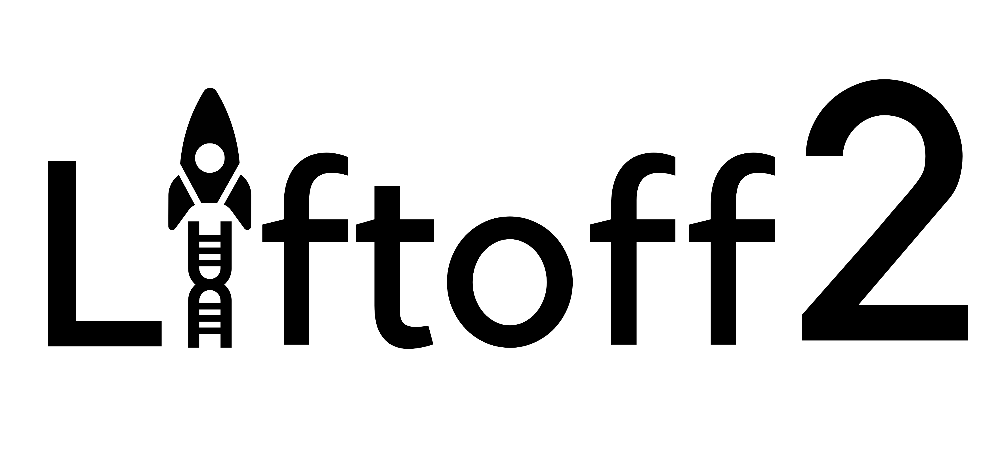

.. raw:: html

    
    <link rel="preload" href="./_images/jhu-logo-dark.png" as="image">

|

.. _main:

LiftOn's tutorial
*************************

.. _LiftOn-logo:

|

.. image:: https://img.shields.io/badge/License-MIT-yellow.svg
    :target: https://img.shields.io/badge/License-MIT-yellow.svg

.. image:: https://img.shields.io/badge/version-v.0.0.1-blue
    :target: https://img.shields.io/badge/version-v.0.0.1-blue

.. .. image:: https://img.shields.io/github/downloads/Kuanhao-Chao/LiftOn/total.svg?style=social&logo=github&label=Download
..     :target: https://img.shields.io/github/downloads/Kuanhao-Chao/LiftOn/total.svg?style=social&logo=github&label=Download

.. .. image:: https://img.shields.io/badge/platform-macOS_/Linux-green.svg
..     :target: https://img.shields.io/badge/platform-macOS_/Linux-green.svg

.. .. image:: https://colab.research.google.com/assets/colab-badge.svg
..     :target: https://colab.research.google.com/github/Kuanhao-Chao/LiftOn/blob/main/notebook/LiftOn_example.ipynb

| 

.. What is LiftOn?
.. ==================

LiftOn is a lift-over annotator that takes `Liftoff <https://academic.oup.com/bioinformatics/article/37/12/1639/6035128?login=true>`_ and `miniprot <https://academic.oup.com/bioinformatics/article/39/1/btad014/6989621>`_ GFF files as input. It accurately generates gene annotations, with a particular focus on protein-coding genes. LiftOn takes consensus from both sources and generates optimal annotations that outperform both `Liftoff <https://academic.oup.com/bioinformatics/article/37/12/1639/6035128?login=true>`_ and `miniprot <https://academic.oup.com/bioinformatics/article/39/1/btad014/6989621>`_!

Why LiftOn❓
==================

1. The current approach to generate the annotation of `T2T-CHM13 <https://www.ncbi.nlm.nih.gov/datasets/genome/GCF_009914755.1/>`_ is to run Liftoff to lift-over annotations from GRCh38 to T2T-CHM13. However, Liftoff is not perfect. T2T-CHM13 annotation is far from perfect. **We need a tool to accurately generates T2T-CHM13 annotations**.
2. More and more high quality assemblies are generated. **We need to annotate them**.
3. The current lift-over tools mainly depend on either DNA aligners (`Liftoff <https://academic.oup.com/bioinformatics/article/37/12/1639/6035128?login=true>`_, `minimap2 <https://academic.oup.com/bioinformatics/article/34/18/3094/4994778>`_) or protein aligner (`miniprot <https://academic.oup.com/bioinformatics/article/39/1/btad014/6989621>`_). They are not perfect, as there are instances where they make mistakes. **We need a tool to generate a more accurate annotation**.

|

Who is it for❓
====================================

1. If you have sequenced and assembled a new human genome and need to annotate it, LiftOn is the ideal choice for generating annotations.
2. If you wish to utilize the finest CHM13 annotation, you can run LiftOn! We have also pre-generated the [T2T_CHM13_LiftOn.gff3](https://khchao.com) file for your convenience.
|

What does LiftOn do❓
====================================

LiftOn takes GFF files from Liftoff and miniprot and reference protein sequences in a FASTA file, and generates a new annotation file in GFF format. LiftOn works on the same and closely-related species. 
<!-- We also tested LiftOn by lifting-over annotations from human to mouse, and it also does pretty good job to find the optimal protein annotations. However, there are false positives or -->

* **Input**:  Liftoff GFF file  /  miniprot GFF file  /  protein FASTA file
* **Output**: LiftOn GFF file

LiftOn utilizes gene loci coordinates obtained from Liftoff, as Liftoff employs an overlapping fixing algorithm to determine the most suitable gene locus for each gene.

First, LiftOn extracts protein sequences annotated by Liftoff and miniprot, and aligns them to the reference proteins.

Next, LiftOn employs an algorithm that compares each section of the protein alignments from Liftoff and miniprot, corrects errors in exon and CDS boundaries, and produces the optimal protein annotations.

LiftOn is free, it's open source, it's fast, and it's in Python!

.. It was trained on donor and acceptor pairs combined and focuses on a narrow window of 400 basepairs surrounding each splice site, inspired by the understanding that the splicing process primarily depends on signals within this specific region.

|

.. Main features
.. =============

.. * **Biologically inspired training process**: LiftOn was trained on combined donor and acceptor pairs, emulating the behavior of the spliceosome, with a specific emphasis on a narrow window of 400 base pairs surrounding each splice site. This approach is inspired by the understanding that the splicing process predominantly relies on signals within this specific region.
.. * **Generalization to non-human species**: LiftOn was trained exclusively using human splice junctions; however, we have demonstrated that it performs well on chimpanzee, mouse, and even the flowering plant *Arabidopsis thaliana*.
.. * **Python & C++ integration**: We have taken care of all the engineering work for you! LiftOn is easy to install and runs efficiently due to its underlying C++ implementation. You can install and run LiftOn with just one simple command.
.. * **Run LiftOn in three steps**: With just three lines of code, you can obtain a new alignment file that is cleaned and sorted.
.. * **Pytorch implementation**: LiftOn is implemented and trained using the popular and reliable PyTorch framework.

.. |

.. What LiftOn doesn't do
.. ==================================

.. LiftOn does not have the feature to scan through the genome and score every potential splice site. Some splice site prediction tools take a DNA sequence and predict the splice sites within it, such as `SpliceAI <https://github.com/Illumina/SpliceAI>`_. However, SpliceAI was only trained on a single canonical transcript for each protein-coding gene while disregarding alternative isoforms. LiftOn takes a different approach, focusing on predicting at the "splice junction level" rather than the "transcript level." LiftOn was trained on a large collection of human splices sites taken from both "canonical" and alternative isoforms.

|

User support
============
Please go through the :ref:`documentation <table-of-contents>` below first. If you have questions about using the package, a bug report, or a feature request, please use the GitHub issue tracker here:

https://github.com/Kuanhao-Chao/LiftOn/issues

|

Key contributors
================

LiftOn was designed and developed by Kuan-Hao Chao. This documentation was written by Kuan-Hao Chao.

|

.. _table-of-contents:

Table of contents
==================

.. toctree::
   :maxdepth: 2

|
|
|
|
|

.. image:: ./_images/jhu-logo-dark.png
   :alt: My Logo
   :class: logo, header-image only-light
   :align: center

.. image:: ./_images/jhu-logo-white.png
   :alt: My Logo
   :class: logo, header-image only-dark
   :align: center