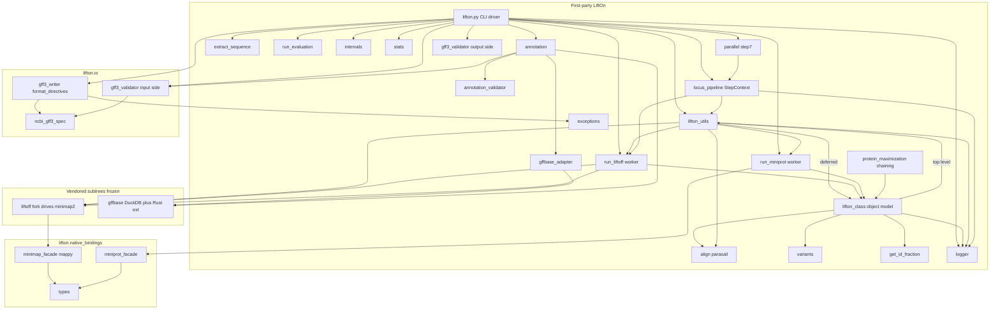
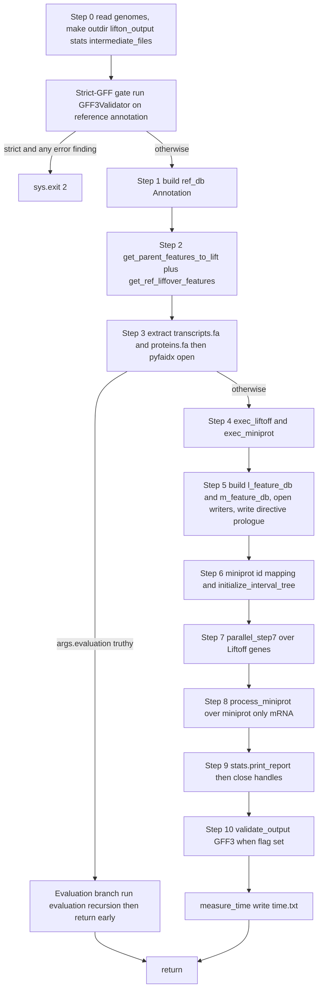
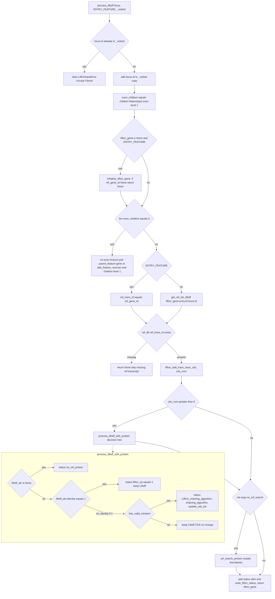
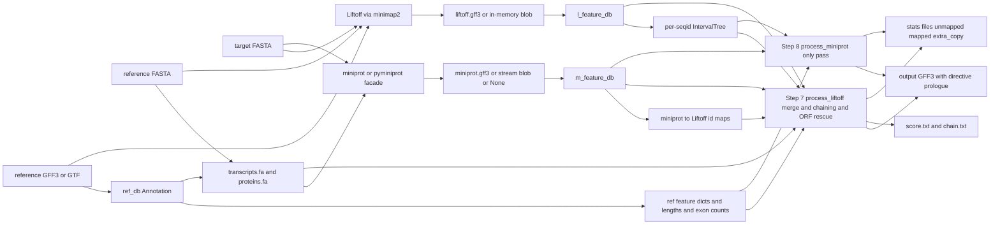
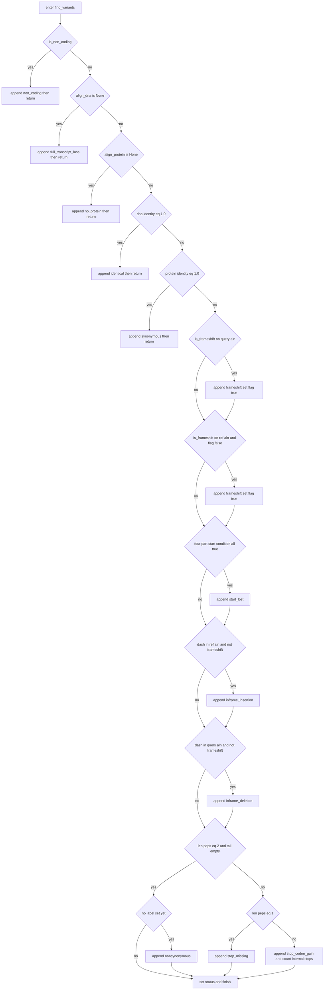
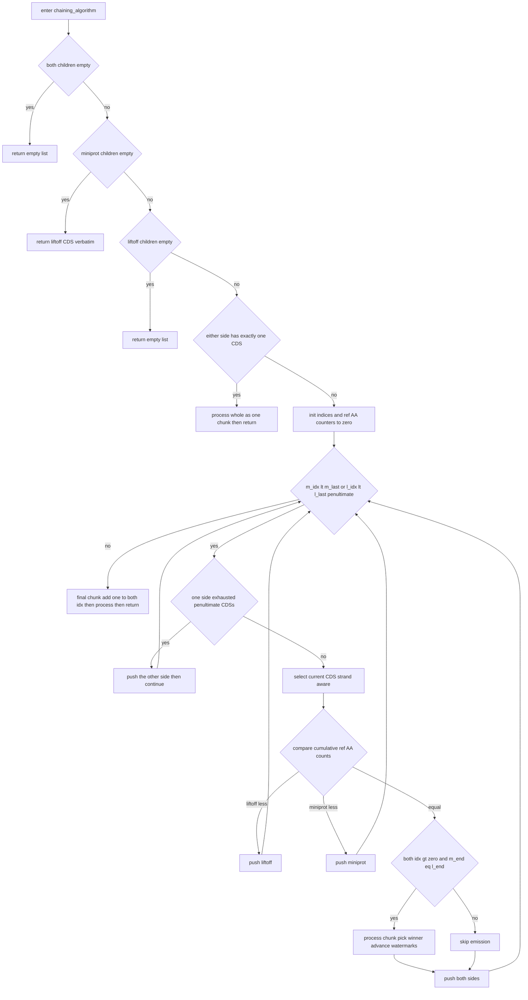
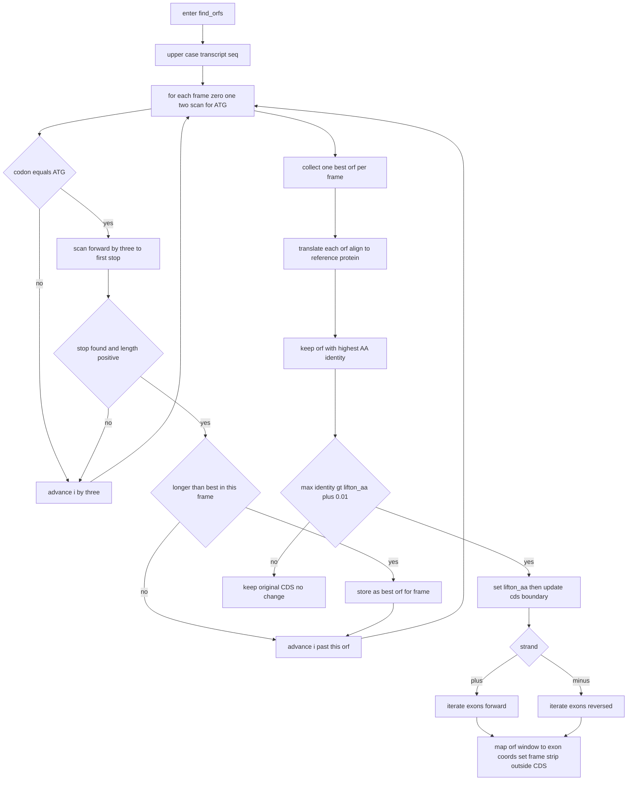
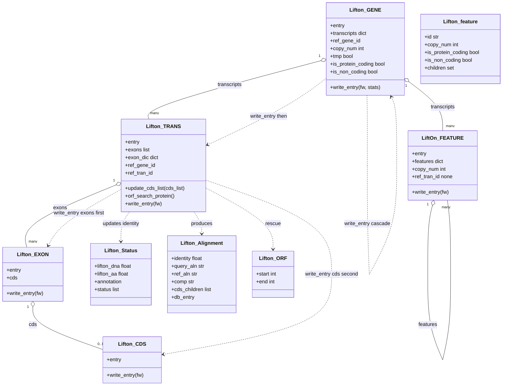
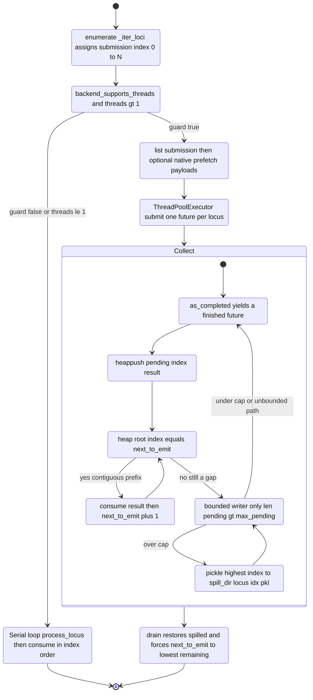

# LiftOn — Reimplementation-Grade Technical Specification

> **Subject:** LiftOn v1.0.8 (homology-based genome-annotation lift-over).
> **Source of truth:** the working tree at branch `devel`, commit `7152cca` (+ uncommitted
> Phase-16/17 changes), package root `lifton/`.
> **Purpose:** a complete, granular specification from which a developer can rebuild LiftOn
> — including its two vendored subtrees — *from scratch, without reading the original source.*

## How to read this document

Every claim is grounded in the real code and cited as `path:line` (relative to the repo root).
Algorithms are given as numbered steps with exact arithmetic, constants, thresholds, and the
verbatim boolean conditions of each branch. Data structures are enumerated field-by-field. The
spec is **language-agnostic in intent** but uses the actual Python signatures and names as the
authoritative reference; a faithful re-implementation in any language must reproduce the same
observable behaviour and, critically, the same output bytes (see *Byte-identity contract* below).

**Scope.** Full depth across all three bodies of code:

| Body | Location | LOC | Treatment |
|---|---|---|---|
| First-party LiftOn | `lifton/*.py`, `lifton/io/`, `lifton/native_bindings/` | ~8.6 K | Full |
| Vendored Liftoff fork | `lifton/liftoff/` (drives `minimap2`/`mappy`) | ~2.9 K | Full (§6.5) |
| Vendored gffbase | `lifton/gffbase/` (DuckDB FeatureDB + Rust `_native` + pure-Python fallback) | ~4.1 K | Full (§5.6) |

External binaries (`minimap2`, `miniprot`) and Python wheels (`parasail`, `pysam`, `pyfaidx`,
`gffutils`, `duckdb`, `pyarrow`, `mappy`, `biopython`) are specified at their **invocation
contract** — exact argv, flags, parameters, and the shape of data exchanged — since a
re-implementation reuses these real tools.

## Document map

- **§1 Architecture** — what LiftOn is, the module/dependency graph, the import cycle, fast-path flags.
- **§2 Execution lifecycle** — `main` → 11 pipeline steps → the per-locus engine → termination.
- **§3 Core algorithms** — sequence assembly, parasail alignment, identity math, variant
  classification, the protein-maximization chaining algorithm, ORF rescue, CDS↔exon reconciliation.
- **§4 Data structures** — the `Lifton_*` object model and all pipeline state objects.
- **§5 Annotation backend** — the `Annotation` class, feature partitioning, and the full gffbase internals.
- **§6 External tools** — Liftoff/miniprot/mappy integration and the full vendored Liftoff internals.
- **§7 I/O formats** — every input, intermediate, and output file format.
- **§8 Validation** — the input-side NCBI validator and the output-side GFF3 validator.
- **§9 Parallelization & performance** — the deterministic threading model and Phase-17 materialisation.
- **§10 Reimplementation guidance** — build order, determinism invariants, test strategy, appendices.

## Conventions

- **Coordinates** are **1-based, fully closed** (GFF3 convention). A feature spanning bases
  `start..end` has length `end - start + 1`. Strand is `+` / `-` (occasionally `.`).
- **Identity** values are fractions in `[0, 1]`, gap-collapsed BLAST-style (see §3.3).
- A `Gotcha:` callout marks behaviour that is subtle, order-dependent, or load-bearing for the
  byte-identity contract — a naive re-implementation will get these wrong.

## Byte-identity contract (the governing invariant)

LiftOn ships five orthogonal "fast-path" flags (`--stream`, `--inmemory-liftoff`,
`--threads N`/`--locus-pipeline`, `--native`) that change *how* work is scheduled and where data
lives, **never what is computed**. The defining regression gate is the **24-cell matrix**: every
combination of `--stream × --inmemory-liftoff × --threads∈{1,2,4} × --native` (= 24 cells) must
emit a **byte-identical** output GFF3. A re-implementation that reorders loci, changes attribute
serialization, or perturbs alignment by even ~0.1 % breaks this contract. The invariants that
preserve it are catalogued in §10.2.

## Quick-reference vocabulary

**Per-transcript `status` (annotation provenance)** — set on `lifton_status.annotation`:
`Liftoff` (DNA-lift kept as-is), `LiftOn_chaining_algorithm` (protein-maximized merge of Liftoff
+ miniprot), `no_ref_protein` (no reference protein to align against). Miniprot-only transcripts
(§2.4) carry their own provenance.

**Mutation vocabulary (9 types)** — recorded on the `mutation` attribute and driving ORF rescue:
`identical`, `synonymous`, `nonsynonymous`, `inframe_insertion`, `inframe_deletion`,
`frameshift`, `start_lost`, `stop_missing`, `stop_codon_gain` (plus the non-coding /
loss sentinels `non_coding`, `full_transcript_loss`, `no_protein`). Exact triggering conditions
are in §3.4; the consolidated table is Appendix C.

---


## 1. System Overview & Architecture

This section specifies *what* LiftOn is, *which* modules implement it, *how* those modules depend on each other, and *which* invariants any reimplementation must preserve. It is grounded in the real Python at `lifton/lifton.py`, `lifton/__init__.py`, `setup.py`, and the module survey of `lifton/`. Subsequent sections (§2 onward) specify each component algorithm in full; this section is the map.

### 1.1 Problem statement

LiftOn is a **homology-based genome-annotation lift-over CLI**. The lift-over problem it solves is:

| Symbol | Role | Concrete artifact |
|---|---|---|
| `R` | Reference genome (DNA) | FASTA, CLI positional `reference` (`lifton.py:212`) |
| `R_A` | Reference annotation | GFF3 or GTF, `-g/--reference-annotation` (required, `lifton.py:221`) |
| `T` | Target genome (DNA) | FASTA, CLI positional `target` (`lifton.py:211`) |
| `T_A` | **Output** annotation for `T` | GFF3, `-o/--output` (default `lifton.gff3`, `lifton.py:48`) |

Given `R`, `R_A`, and `T`, LiftOn produces `T_A`: a GFF3 annotation of the target genome whose feature coordinates, structure, and attributes are transferred from `R_A` and refined against the actual target sequence.

#### The central thesis: fuse DNA-level and protein-level alignment

LiftOn's distinguishing idea is that **neither DNA alignment nor protein alignment alone is sufficient** for accurate protein-coding lift-over, and that *fusing* the two yields a better annotation than either:

1. **DNA-level alignment** is produced by a **vendored fork of Liftoff** (`lifton/liftoff/`), which maps reference gene loci onto the target genome. Liftoff itself aligns sequence with **`minimap2`** — invoked either as an external subprocess (`lifton/liftoff/align_features.py`) or, under `--native`, driven in-process through the **`mappy`** PyO3 binding (`lifton/liftoff/native_align.py`). DNA alignment preserves exon/intron structure and gene boundaries but is blind to reading-frame correctness.
2. **Protein-level alignment** is produced by **`miniprot`** (`lifton/run_miniprot.py`), which aligns the reference *proteins* against the target genome (spliced protein-to-genome alignment). Protein alignment recovers the correct coding frame and start/stop placement but can miss or distort UTR/exon structure.
3. **Fusion** happens in the in-house **protein-maximization chaining algorithm** (`lifton/protein_maximization.py:176`, `chaining_algorithm`) plus an **ORF-rescue pass** (the `__find_orfs` / `__update_cds_boundary` machinery inside `lifton/lifton_class.py`). The chaining algorithm walks the Liftoff transcript and the miniprot transcript in parallel and selects, per CDS segment, the boundary that **maximises the protein** transferred while remaining consistent with the target sequence; the ORF-rescue pass repairs frame, start, and stop where alignment alone left a broken ORF.

The result is `T_A`: each protein-coding transcript carries the best of both signals, while non-coding features fall through the DNA-only Liftoff path.

#### Packaging surface

`setup.py` declares package **`lifton`, version `1.0.8`** (`setup.py:7-8`), author Kuan-Hao Chao. `lifton/__init__.py` separately pins `__version__ = 'v1.0.8'` (note the `v` prefix; this is the string shown by `-V/--version`, wired at `lifton.py:104`). Two **console scripts** are exposed (`setup.py:33-36`):

| Console script | Entry point | Purpose |
|---|---|---|
| `lifton` | `lifton.lifton:main` | The full lift-over pipeline (this whole spec). |
| `gff3-validate` | `lifton.gff3_validator:_main` | Standalone GFF3 validator for an already-written file. |

Runtime dependencies (`setup.py:13-22`): `numpy>=1.22.0`, `biopython>=1.76`, `cigar>=0.1.3`, `parasail>=1.2.4`, `intervaltree>=3.1.0`, `interlap>=0.2.6`, `networkx>=3.3`, `pyfaidx>=0.5.8`, `pysam>=0.19.1`, `gffutils>=0.10.1`, `ujson>=3.2.0`, `pytest>=7.0.0`, plus `duckdb>=1.0` and `pyarrow>=14` (gffbase backend) and `mappy` (unlocks the `--native` in-process minimap2 path; absence degrades `--native` to the subprocess path with a stderr warning, never an error). `python_requires='>=3.6'` (`setup.py:31`) — note this is *looser* than the conda env (Python 3.11, `lifton.yml`) and CI (Python 3.12); this skew is a known cleanup item.

`package_data` (`setup.py:24-30`) ships the vendored gffbase Rust extension (`_native*.so` / `_native*.pyd`), gffbase test fixtures (`data/*.gff3`, `data/*.gtf`), the gffbase `LICENSE`, the pure-Python fallback package (`_pyfallback/*.py`), and the Rust source (`_rust/**`). A missing `_native*.so` causes gffbase to fall back to its pure-Python parser at `lifton/gffbase/_pyfallback/`.

### 1.2 Module map + dependency graph

The codebase is three populations of code:

- **First-party LiftOn** — ~8.6 KLOC across `lifton/*.py` + `lifton/io/*.py` + `lifton/native_bindings/*.py` (measured: 8594 LOC).
- **Vendored Liftoff fork** — ~2.9 KLOC, `lifton/liftoff/` (17 `.py` files, 2824 LOC). Treat as a frozen dependency invoked *as a library*.
- **Vendored gffbase** — ~4.1 KLOC, `lifton/gffbase/` (incl. subdirs `_pyfallback/`, `_rust/`; 4151 LOC) plus a pre-built Rust extension `_native*.so`. First-party DuckDB-backed successor to gffutils; same author; treat as a frozen drop-in dependency.

#### First-party module roles (one line each)

| Module | LOC | Role |
|---|---|---|
| `lifton/lifton.py` | 667 | CLI: arg parsing (`parse_args`), the 11-step pipeline driver `run_all_lifton_steps`, and `main` (entry point). |
| `lifton/lifton_class.py` | 896 | Object model god-module: `Lifton_GENE → Lifton_TRANS → Lifton_EXON → Lifton_CDS`, `Lifton_ORF`, `Lifton_Status`; coordinate reconciliation, alignment dispatch, ORF rescue, GFF serialisation. |
| `lifton/lifton_utils.py` | 601 | Shared helpers: feature selection (`get_parent_features_to_lift`, `get_ref_liffover_features`), Liftoff/miniprot invocation wrappers (`exec_liftoff`, `exec_miniprot`), ID mapping (`miniprot_id_mapping`), geometry helpers (`segments_overlap_length`, `custom_bisect_insert`, `get_ID_base`). |
| `lifton/annotation.py` | 827 | `Annotation` class: builds/opens the reference, Liftoff, and miniprot feature DBs (gffutils SQLite by default, gffbase-DuckDB under `LIFTON_USE_GFFBASE=1`); GTF→GFF3 auto-convert; exposes `.db_connection` and `.directives`. |
| `lifton/annotation_validator.py` | 366 | `validate_annotation_file` + report printers used during DB build to diagnose malformed input. |
| `lifton/extract_sequence.py` | 235 | Reference transcript/protein FASTA extraction: streaming `extract_features_to_fasta` (default path) and legacy in-memory `extract_features`. |
| `lifton/align.py` | 248 | Parasail wrappers: `protein_align`, DNA alignment, CDS-protein boundary mapping; DNA sanitiser for parasail. |
| `lifton/protein_maximization.py` | 280 | The chaining algorithm (`chaining_algorithm`) and entry-construction helpers that fuse Liftoff + miniprot CDS segments. |
| `lifton/run_liftoff.py` | 266 | `run_liftoff` (drives the vendored Liftoff library) + `process_liftoff` / `process_liftoff_with_protein` (per-locus Step 7 worker logic) + `initialize_lifton_gene`. |
| `lifton/run_miniprot.py` | 318 | `run_miniprot` (subprocess/facade driver, bounded stdout drain `_drain_stream_chunks`), `check_miniprot_installed`, `process_miniprot` (Step 8 per-mRNA worker). |
| `lifton/run_evaluation.py` | 115 | `-E/--evaluation` mode: scores an existing target annotation against the reference (separate, non-lift-over code path). |
| `lifton/intervals.py` | 23 | `initialize_interval_tree`: per-seqid `IntervalTree`s seeded from the Liftoff DB to detect locus overlaps. |
| `lifton/variants.py` | 121 | Variant/ORF status detection: `has_stop_codon`, `is_frameshift`, `find_variants`. |
| `lifton/get_id_fraction.py` | 69 | Identity-fraction helpers: `get_partial_id_fraction`, `get_AA_id_fraction`, `get_DNA_id_fraction`. |
| `lifton/stats.py` | 94 | `print_report`: writes mapped/unmapped/extra-copy stats files at end of run. |
| `lifton/logger.py` | 99 | Logging facade (`log`, `log_info`, `log_warning`, `log_error`, `log_success`, `log_section`). |
| `lifton/gffbase_adapter.py` | 122 | Shim translating between LiftOn's `Annotation` shape and gffbase's API (`build_database`, `build_database_from_string`, `open_existing_db`, `looks_like_gff3_blob`). |
| `lifton/parallel.py` | 447 | `parallel_step7`: serial or `ThreadPoolExecutor` dispatch of Step 7 with a deterministic ordered writer. |
| `lifton/locus_pipeline.py` | 824 | `StepContext` (immutable per-run bundle), `LocusResult` (submission-indexed worker output), `process_locus`, `consume` — the parent/worker split that makes parallel output deterministic. |
| `lifton/gff3_validator.py` | 1034 | Output-side GFF3 validator (`validate_gff3_file`, `print_validation_report`) + the `gff3-validate` console entry `_main`. |
| `lifton/exceptions.py` | 26 | Exception hierarchy: `LiftOnError`, `LiftOnInputError`, `LiftOnAlignmentError`. |
| `lifton/io/gff3_writer.py` | — | `format_directives` (single source of truth for the `##` directive prologue) + GFF3 line formatting; depends only on `exceptions` + `io/ncbi_gff3_spec`. |
| `lifton/io/gff3_validator.py` | — | Input-side NCBI GFF3 validator: `GFF3Validator(target_seqids, strict).validate(path)`; used by the `--strict-gff` gate. |
| `lifton/io/ncbi_gff3_spec.py` | — | NCBI GFF3 spec constants (`RESERVED_CHARS`, etc.). |
| `lifton/native_bindings/minimap_facade.py` | — | `MinimapAligner`, `is_mappy_available` — `mappy` PyO3 wrapper for `--native`. |
| `lifton/native_bindings/miniprot_facade.py` | — | `MiniprotIndex`, `is_pyminiprot_native_available` — pyminiprot-shaped facade (subprocess today, swappable later). |
| `lifton/native_bindings/types.py` | — | `GFF3Bundle`, `GFF3Hit`, `MinimapHit` value types shared by the facades. |

#### Vendored subtree entry points

- **`lifton/liftoff/`** — invoked *as a library*, not as a subprocess. `run_liftoff.run_liftoff` (`lifton/run_liftoff.py:25` region) calls `liftoff_main.run_all_liftoff_steps(args, ref_db)` (`lifton/liftoff/liftoff_main.py:10`); the `--inmemory-liftoff` path calls `run_all_liftoff_steps_inmemory` (`liftoff_main.py:26`), which routes through `lifton/liftoff/inmemory_emitter.py` instead of writing `liftoff.gff3`. Liftoff shells out to `minimap2` in `lifton/liftoff/align_features.py`, or routes through `mappy` via `lifton/liftoff/native_align.py` when `args.native` is set (a `_PysamShim` adapts mappy hits to the pysam-shaped consumer).
- **`lifton/gffbase/`** — drop-in gffutils successor. Public surface from `lifton/gffbase/__init__.py`: `FeatureDB` (`interface.py`), `Feature`/`ParsedFeature` (`feature.py`), `create_db` (`create_db.py`), `DataIterator` (`iterators.py`), `GFFWriter` (`gffwriter.py`), `export_sqlite` (`sqlite_export.py`), parser entry points (`parse_gff`, `parse_bytes`, `native_available`). Reached from first-party code only through `lifton/annotation.py` and `lifton/gffbase_adapter.py`.

#### Diagram D1 — module dependency map



### 1.3 The `lifton_utils` ↔ `lifton_class` import cycle

There is a **package-level import cycle** at the heart of the first-party code, and it is load-bearing — a reimplementation must reproduce the *resolution discipline*, not just the topology.

**The cycle.** `lifton/lifton_class.py:1` does an *eager top-level* import:

```python
from lifton import align, lifton_utils, lifton_class, get_id_fraction, variants, logger
```

and `lifton/lifton_utils.py:3` does the mirror eager top-level import:

```python
from lifton import align, lifton_class, run_liftoff, run_miniprot, logger
```

So `lifton_class → lifton_utils → lifton_class`. (Note `lifton_class` even imports *itself* by name on line 1 — harmless, since by the time the line executes the module object already exists in `sys.modules`.)

**Why it does not deadlock.** The cycle works only because neither module *uses* the other's symbols at import time — all cross-module references are **deferred to call time** (function/method bodies), never executed during module initialisation. Concretely:

- `lifton_class` calls `lifton_utils.get_ID_base(...)` (`lifton_class.py:241`), `lifton_utils.custom_bisect_insert(...)` (`lifton_class.py:297`), `lifton_utils.segments_overlap_length(...)` (`lifton_class.py:301, 340`) — all inside methods.
- `lifton_utils` calls `lifton_class.Lifton_TRANS(...)` (`lifton_utils.py:318`), `lifton_class.Lifton_feature(...)` (`lifton_utils.py:353, 358`) — all inside functions.

Whichever module Python imports first completes its top-level `from lifton import ...` against a *partially-initialised* sibling module object; because no top-level code dereferences the missing attributes, both modules finish initialising, and by first *call* both are fully populated. This is described in `CLAUDE.md` as "benign-but-fragile, kept working only by deferred attribute access."

**Gotcha (do not break this):** Any change that promotes a deferred cross-module reference to **module-import time** (e.g. a module-level constant computed from a sibling's symbol, a default argument value, a class-body call) will turn the benign cycle into an `ImportError`/`AttributeError` at import depending on load order. In particular, *do not* add an **eager top-level import from `lifton_class` into a module that `lifton_class` does not already import**, and do not add eager top-level imports of `lifton_class`/`lifton_utils` into the newer cycle-free modules listed below.

**Modules that sit cleanly outside the cycle.** The post-Phase-9 modules deliberately avoid the cycle and **lazy-import** their dependencies inside function bodies:

| Module | How it stays cycle-free | Evidence |
|---|---|---|
| `lifton/parallel.py` | Imports only from `locus_pipeline` (`LocusResult`, `StepContext`, `consume`, `process_locus`) at top level (`parallel.py:35`); no import of `lifton_class`/`lifton_utils`. | `parallel.py:35` |
| `lifton/locus_pipeline.py` | Lazy-imports everything inside functions: `from lifton import run_liftoff` (`locus_pipeline.py:81, 771`), `from lifton import logger` (`:339, 483, 528, 815`), `from lifton import lifton_utils as _lu` (`:442`). No top-level `lifton.*` imports. | `locus_pipeline.py:81,339,442,483,528,771,815` |
| `lifton/io/gff3_writer.py` | Imports only `from lifton.exceptions import LiftOnInputError` (`:26`) and `from lifton.io.ncbi_gff3_spec import RESERVED_CHARS` (`:27`); both are leaf modules. | `gff3_writer.py:26-27` |

The pipeline driver itself reinforces this discipline with **lazy imports inside the step body** so the heavy parallel/writer machinery is not pulled in at `lifton.py` import time:

- `from lifton.io.gff3_validator import GFF3Validator` inside the strict-GFF gate (`lifton.py:327`).
- `from lifton.io import gff3_writer as _gff3_writer` inside Step 5 (`lifton.py:487`).
- `from lifton import parallel as _parallel` and `from lifton.locus_pipeline import StepContext as _StepContext` inside Step 7 (`lifton.py:523-524`).

### 1.4 The byte-identity contract and the fast-path flags

The single most important invariant in the codebase: **six orthogonal fast-path flags change I/O, scheduling, or alignment *mechanism* but never the bytes of `T_A`.** All produce output byte-identical to the default path.

#### The 24-cell matrix

The defining gate is `tests/test_native_matrix.py::TestFullNativeMatrix::test_all_24_combinations_byte_identical`. It runs **every combination** of four toggles and asserts the output GFF3 is identical (the reference fixture is a 391-byte GFF3):

```
--stream ∈ {off, on}            (2)
--inmemory-liftoff ∈ {off, on}  (2)
--threads ∈ {1, 2, 4}           (3)   (with --locus-pipeline)
--native ∈ {off, on}            (2)
-------------------------------------------
2 × 2 × 3 × 2 = 24 cells, all byte-identical
```

Smaller subset gates exist: `tests/test_pipeline_streaming.py` (`--stream`), `tests/test_liftoff_inmemory.py` (4-cell `--inmemory-liftoff`), `tests/test_parallelism_matrix.py` (`--threads`), and the full 24-cell in `tests/test_native_matrix.py`.

**Gotcha:** any change touching the **alignment kernel, the writer, the directive carrier, the ID-formation logic, or the per-locus `LocusResult` shape** must keep this gate green. Output-mutating optimisations (banded alignment, mappy-seeded extension — ~0.1% output drift) were *explicitly deferred* in Phase 14 precisely because they would break this contract; landing them requires a deliberate test edit and a manuscript erratum.

#### The six fast-path flags

| Flag | Default | Branch point | What it changes (mechanism only) |
|---|---|---|---|
| `--stream` | off (`lifton.py:171`) | Step 4/5, inside `exec_miniprot` / `Annotation` build (`lifton.py:446, 466`); `_describe_annotation_source` renders the in-memory bytes blob (`lifton.py:22-24`) | Pipes `miniprot` stdout directly into an in-memory gffbase `FeatureDB` instead of writing `miniprot.gff3` to disk; eliminates the SQLite re-ingest of miniprot output. |
| `--inmemory-liftoff` | off (`lifton.py:179`) | Step 4, inside `exec_liftoff` (`lifton.py:444`), routing to `liftoff_main.run_all_liftoff_steps_inmemory` + `inmemory_emitter.py`; Step 5 builds the Liftoff DB from the bytes blob (`lifton.py:453`) | Serialises Liftoff's `lifted_feature_list` to bytes in-process and feeds gffbase directly; skips the `liftoff.gff3` disk write and SQLite re-ingest. |
| `--threads N` + `--locus-pipeline` | `threads=1` (`lifton.py:107`), `locus_pipeline=off` (`lifton.py:188`) | Step 7: `_use_pool = bool(args.locus_pipeline) and _threads > 1` (`lifton.py:540`); `parallel.parallel_step7(..., threads=_threads if _use_pool else 1)` (`lifton.py:541-544`) | Dispatches Step 7 per-locus work through a `ThreadPoolExecutor` sized by `--threads`; output emitted in **submission order** via a heap-backed ordered writer, so `--threads N` is byte-identical to `--threads 1`. **Both flags required** — `--threads N` alone (without `--locus-pipeline`) stays serial. |
| `--native` | off (`lifton.py:197`) | Step 4: routed through `run_liftoff`→`liftoff/native_align.py` (`mappy`) and `run_miniprot`→`miniprot_facade` when `args.native` is set | Drives `minimap2` via the `mappy` PyO3 binding in-process and routes miniprot through the pyminiprot-shaped facade; eliminates per-query subprocess fork+exec. Falls back gracefully (subprocess + stderr warning) when `mappy` is absent. |
| `--strict-gff` | off (`lifton.py:164`, dest `strict_gff`) | Strict-GFF gate before Step 1 (`lifton.py:325-366`): runs `GFF3Validator` and, on any `severity == "error"`, `sys.exit(2)` (`lifton.py:365-366`) | Runs the NCBI GFF3 input-side validator on the reference annotation and exits non-zero on any spec violation. (In strict mode every finding is dumped to stderr; in default mode findings go to a side-car `stats/gff3_input_validation.txt` with one summary line — `lifton.py:340-364`.) |
| `--validate-output` (+ `--validate-verbose`) | both off (`lifton.py:155, 160`) | Step 10 after writing (`lifton.py:585-603`): `gff3_validator.validate_gff3_file(...)` then `print_validation_report(...)` | After writing `T_A`, re-validates it with the in-tree output validator (hierarchy / CDS phase / containment / LiftOn-attr checks) and prints a structured report; `--validate-verbose` additionally prints warnings. |

**Gotcha (flag interaction with the contract):** `--strict-gff` and `--validate-output` are *gates/diagnostics* — they can abort the run or print reports but, on a valid input, do not alter `T_A`'s bytes; the other four are *mechanism swaps* that the 24-cell matrix pins as byte-equivalent. The directive prologue is written **once on the parent thread, before any worker exists** (`lifton.py:487-490`, via `gff3_writer.format_directives`), so threading introduces no interleaving of the `##` header rows — a precondition for `--threads` byte-identity.


## 2. Execution Lifecycle & Control Flow

This section specifies the complete top-to-bottom control flow of a LiftOn run: how the CLI is parsed and normalised, how the eleven-step `run_all_lifton_steps` pipeline threads state forward, how each Liftoff gene locus is recursively processed into a `Lifton_GENE`, how miniprot-only genes are appended in a second pass, and how evaluation mode (`-E` / `-EL`) diverges. Every constant, threshold, branch condition, and state hand-off below is grounded in `lifton/lifton.py`, `lifton/run_liftoff.py`, `lifton/run_miniprot.py`, `lifton/run_evaluation.py`, `lifton/parallel.py`, and `lifton/locus_pipeline.py`.

The two console entry points are `lifton = lifton.lifton:main` and `gff3-validate = lifton.gff3_validator:_main` (declared in `setup.py`). Only `main` is covered here.

### 2.1 `main()` and `parse_args()`

#### 2.1.1 `main(arglist=None)` — `lifton/lifton.py:649`

`main` is the process entry point. Steps:

1. **Print the ASCII banner** to `sys.stderr` (`lifton.py:650-663`). The banner is the multi-line string below, printed verbatim with a leading newline:

```
====================================================================
An accurate homology lift-over tool between assemblies
====================================================================


    ██╗     ██╗███████╗████████╗ ██████╗ ███╗   ██╗
    ██║     ██║██╔════╝╚══██╔══╝██╔═══██╗████╗  ██║
    ██║     ██║█████╗     ██║   ██║   ██║██╔██╗ ██║
    ██║     ██║██╔══╝     ██║   ██║   ██║██║╚██╗██║
    ███████╗██║██║        ██║   ╚██████╔╝██║ ╚████║
    ╚══════╝╚═╝╚═╝        ╚═╝    ╚═════╝ ╚═╝  ╚═══╝
```

   Banner goes to **stderr** (not stdout), so stdout can be used for `-o stdout` output.
2. **Parse args:** `args = parse_args(arglist)` (`lifton.py:664`). When `arglist` is `None`, argparse reads `sys.argv[1:]`.
3. **miniprot-presence check** (`lifton.py:665-666`): call `run_miniprot.check_miniprot_installed()`. If it returns `False`, terminate via `sys.exit("miniprot is not installed. Please install miniprot before running LiftOn.")` — a string argument to `sys.exit` prints to stderr and exits with status 1. **Gotcha:** This check runs *before* any other work, even before reading genomes, and even in evaluation mode. `check_miniprot_installed` (`run_miniprot.py:54-77`) runs `subprocess.run(["miniprot", "--version"])` and returns `True` if the call did not raise `FileNotFoundError`, `PermissionError`, `NotADirectoryError`, or `subprocess.SubprocessError`. A non-zero exit code from miniprot still counts as "installed" — only an unrunnable binary returns `False`.
4. **Run the pipeline:** `run_all_lifton_steps(args)` (`lifton.py:667`).

#### 2.1.2 `parse_args(arglist)` — `lifton/lifton.py:209`

Builds an `argparse.ArgumentParser` (description `"Lift features from one genome assembly to another"`), populates it through helper functions, parses, then applies post-parse normalisation. Argument groups are assembled by `args_outgrp`, `args_aligngrp`, `args_optional`, `args_gffutils` plus inline groups, and the display order is overridden at `lifton.py:262-264` by reassigning `parser._action_groups`.

##### Post-parse normalisation (`lifton.py:266-279`)

After `parser.parse_args(arglist)`:

1. **`mm2_options` default enforcement** (`lifton.py:266-275`): five string-membership tests inject minimap2 defaults into `args.mm2_options` *if the flag substring is absent*. Each appends to the existing string:

   | Test (substring absent in `args.mm2_options`) | Appended literal |
   |---|---|
   | `'-a'` not present | `' -a'` |
   | `'--eqx'` not present | `' --eqx'` |
   | `'-N'` not present | `' -N 50'` |
   | `'-p'` not present | `' -p 0.5'` |
   | `'--end-bonus'` not present | `' --end-bonus 5'` |

   **Gotcha (substring matching):** The checks are naive substring tests, not token tests. The default value of `-mm2_options` is already `'-a --end-bonus 5 --eqx -N 50 -p 0.5'`, so on the default path **none** of these branches fire (each substring is already present). If a user passes `-mm2_options "-x map-ont"`, the test `'-a' not in args.mm2_options` is `False` because `-a` appears inside `map-ont`'s neighbours? No — `'-a'` is the 2-char string `"-a"`; `"map-ont"` does not contain `"-a"`, so `' -a'` would be appended. By contrast `'-N'` would match the `N` in any token containing the literal `-N`. The matching is purely lexical on the full options string.
2. **`-s` vs `-sc` consistency** (`lifton.py:276-277`): if `float(args.s) > float(args.sc)`, call `parser.error("-sc must be greater than or equal to -s")` (prints usage + message to stderr, exits 2). Defaults `s=0.5`, `sc=1.0` satisfy `0.5 <= 1.0`.
3. **`-unplaced` requires `-chroms`** (`lifton.py:278-279`): if `args.chroms is None and args.unplaced is not None`, call `parser.error("-unplaced must be used with -chroms")`.

Returns the normalised `args` namespace.

##### Complete CLI flag table

Positional arguments (group title overridden to `* Required input (sequences)`):

| Dest | Flag(s) | Type | Default | Meaning |
|---|---|---|---|---|
| `target` | (positional 1) | str | — | Target FASTA genome to lift genes **to** |
| `reference` | (positional 2) | str | — | Reference FASTA genome to lift genes **from** |

Top-level optionals declared directly in `parse_args` (`lifton.py:213-216`):

| Dest | Flag(s) | Action / type | Default | Meaning |
|---|---|---|---|---|
| `evaluation` | `-E`, `--evaluation` | store_true | `False` | Run in evaluation mode (§2.5) |
| `evaluation_liftoff_chm13` | `-EL`, `--evaluation-liftoff-chm13` | store_true | `False` | Evaluation mode with CHM13 Liftoff id-prefix handling (§2.5) |
| `write_chains` | `-c`, `--write_chains` | store_true | `True` | Write chaining files (**default already True**; flag cannot turn it off) |
| `no_orf_search` | `--no-orf-search` | store_true | `False` | Skip ORF search in Step 7 |

Required reference annotation group (`* Required input (Reference annotation)`, `lifton.py:220-226`):

| Dest | Flag(s) | Default | Meaning |
|---|---|---|---|
| `reference_annotation` | `-g`, `--reference-annotation` | **required** | Reference GFF3/GTF (or feature-DB name); GTF auto-detected/converted |

Optional reference-sequence group (`lifton.py:230-238`):

| Dest | Flag(s) | Default | Meaning |
|---|---|---|---|
| `proteins` | `-P`, `--proteins` | `None` | Reference protein FASTA; IDs must match transcript IDs |
| `transcripts` | `-T`, `--transcripts` | `None` | Reference transcript FASTA |

Optional pre-built annotation groups (`lifton.py:239-252`):

| Dest | Flag(s) | Default | Meaning |
|---|---|---|---|
| `liftoff` | `-L`, `--liftoff` | `None` | Pre-built Liftoff GFF3/DB; if set, skips running Liftoff |
| `miniprot` | `-M`, `--miniprot` | `None` | Pre-built miniprot GFF3/DB; if set, skips running miniprot |

Output group (`args_outgrp`, `lifton.py:45-61`):

| Dest | Flag(s) | metavar | Default | Meaning |
|---|---|---|---|---|
| `output` | `-o`, `--output` | FILE | `'lifton.gff3'` | Output GFF3 path; special value `"stdout"` |
| `u` | `-u` | FILE | `'unmapped_features.txt'` | Unmapped-features path |
| `exclude_partial` | `-exclude_partial` | — (store_true) | `False` | Move sub-threshold partial mappings to the unmapped file instead of annotating them in the GFF |

Alignment group (`args_aligngrp`, `lifton.py:64-100`):

| Dest | Flag(s) | metavar | Type | Default | Meaning |
|---|---|---|---|---|---|
| `mm2_options` | `-mm2_options` | =STR | str | `'-a --end-bonus 5 --eqx -N 50 -p 0.5'` | minimap2 params (post-normalised, §2.1.2) |
| `mp_options` | `-mp_options` | =STR | str | `''` | miniprot params |
| `a` | `-a` | A | float | `0.5` | Coverage threshold to call a feature mapped |
| `s` | `-s` | S | float | `0.5` | Sequence-identity threshold for child features |
| `min_miniprot` | `-min_miniprot` | MIN_MINIPROT | float | `0.9` | Min length ratio for miniprot-only transcripts (§2.4) |
| `max_miniprot` | `-max_miniprot` | MAX_MINIPROT | float | `1.5` | Max length ratio for miniprot-only transcripts (§2.4) |
| `d` | `-d` | D | float | `2.0` | Distance scaling factor for chaining graph edges |
| `flank` | `-flank` | F | float | `0` | Flanking-sequence fraction `[0.0-1.0]` |

Miscellaneous / Liftoff-passthrough optionals (`args_optional`, `lifton.py:103-206`):

| Dest | Flag(s) | metavar | Type/action | Default | Meaning |
|---|---|---|---|---|---|
| (version) | `-V`, `--version` | — | `action='version'` | — | Print `__version__`, exit |
| `debug` | `-D`, `--debug` | — | store_true | `False` | Debug mode (verbose logging) |
| `threads` | `-t`, `--threads` | THREADS | int | `1` | Worker count for parallel alignment / Step 7 |
| `m` | `-m` | PATH | str | `None` | minimap2 path |
| `features` | `-f`, `--features` | TYPES | str | `None` | Feature types to lift over |
| `infer_genes` | `-infer-genes` | — | store_true | `False` | Infer genes (auto for GTF) |
| `infer_transcripts` | `-infer_transcripts` | — | store_true | `False` | Infer transcripts (auto for GTF) |
| `chroms` | `-chroms` | TXT | str | `None` | Reference,target chromosome map |
| `unplaced` | `-unplaced` | TXT | str | `None` | Unplaced-sequence names (requires `-chroms`) |
| `copies` | `-copies` | — | store_true | `False` | Search for extra gene copies |
| `sc` | `-sc` | SC | float | `1.0` | Copy identity threshold; must be `>= -s` |
| `overlap` | `-overlap` | O | float | `0.1` | Max overlap fraction between two features |
| `mismatch` | `-mismatch` | M | int | `2` | Mismatch penalty in exons |
| `gap_open` | `-gap_open` | GO | int | `2` | Gap-open penalty |
| `gap_extend` | `-gap_extend` | GE | int | `1` | Gap-extend penalty |
| `subcommand` | `-subcommand` | — | str | `None` | Suppressed (internal) |
| `polish` | `-polish` | — | store_true | `False` | Liftoff polish mode |
| `cds` | `-cds` | — | store_true | **`True`** | Annotate per-CDS status (default already True) |
| `measure_time` | `-time`, `--measure_time` | — | store_true | `False` | Per-step timing → `time.txt` |
| `validate_output` | `--validate-output` | — | store_true | `False` | Re-validate output GFF3 (Step 10) |
| `validate_verbose` | `--validate-verbose` | — | store_true | `False` | Print warnings in the validation report |
| `strict_gff` | `--strict-gff` | — | store_true | `False` | NCBI GFF3 input-side validation gate |
| `stream` | `--stream` | — | store_true | `False` | Phase 7 miniprot streaming fast path |
| `inmemory_liftoff` | `--inmemory-liftoff` | — | store_true | `False` | Phase 8 in-memory Liftoff fast path |
| `locus_pipeline` | `--locus-pipeline` | — | store_true | `False` | Phase 9 ThreadPool fan-out for Step 7 |
| `native` | `--native` | — | store_true | `False` | Phase 10/11 native `mappy` + miniprot facade |

gffutils group (`args_gffutils`, `lifton.py:26-42`):

| Dest | Flag | Choices / type | Default | Meaning |
|---|---|---|---|---|
| `merge_strategy` | `--merge-strategy` | `create_unique`/`merge`/`error`/`warning`/`replace` | `'create_unique'` | DB merge strategy |
| `id_spec` | `--id-spec` | str | `None` | Attribute used as feature ID |
| `force` | `--force` | store_true | `False` | Overwrite existing DB |
| `verbose` | `--verbose` | store_true | `False` | gffutils verbose output |

Trailing optionals (`lifton.py:254-256`):

| Dest | Flag(s) | metavar | Default | Meaning |
|---|---|---|---|---|
| `annotation_database` | `-ad`, `--annotation-database` | SOURCE | `"RefSeq"` | Reference annotation source (RefSeq/GENCODE/other) |
| `no_auto_convert_gtf` | `--no-auto-convert-gtf` | — | `False` | Disable automatic GTF→GFF3 conversion |

**Gotcha (`writer_max_pending`):** The parallel ordered-writer reads `getattr(ctx.args, "writer_max_pending", 0)` (`parallel.py:380`) but **no CLI flag declares it**; it defaults to `0` (unbounded heap path). The bounded spill-to-disk writer is therefore only reachable if `args.writer_max_pending` is set programmatically.

### 2.2 `run_all_lifton_steps(args)` — `lifton/lifton.py:283`

A strictly sequential function. `time.process_time()` is sampled into `t1`…`t13` at step boundaries (`lifton.py:284`, `323`, `374`, …, `605`) and dumped if `args.measure_time` (`lifton.py:607-646`). Step numbering follows the in-source comments. Each step below lists its line range, inputs, calls, the state it threads forward, and files written.

#### Step 0 — Read genomes & set up directories (`lifton.py:285-321`)

- **Inputs:** `args.target`, `args.reference`, `args.output`.
- **Output directory layout** (`lifton.py:290-302`):
  - If `args.output == "stdout"` → `outdir = "."`; else `outdir = os.path.dirname(args.output)` (or `"."` if empty), and `os.makedirs(outdir, exist_ok=True)`.
  - `lifton_outdir = f"{outdir}/lifton_output/"`.
  - `args.directory` is set to `"intermediate_files/"` then **immediately overwritten** to the absolute `intermediate_dir = f"{outdir}/lifton_output/intermediate_files/"` (`lifton.py:297-302`); `os.makedirs(intermediate_dir, exist_ok=True)`.
  - `stats_dir = f"{outdir}/lifton_output/stats/"`; `os.makedirs(stats_dir, exist_ok=True)`.
- **Read FASTAs:** existence is checked (`os.path.exists`); a missing file calls `logger.log_error(...)` + `sys.exit(1)`. Then `tgt_fai = Fasta(tgt_genome)` and `ref_fai = Fasta(ref_genome)`; any `Fasta()` exception is logged and triggers `sys.exit(1)`.
- **State forward:** `tgt_fai`, `ref_fai`, `lifton_outdir`, `intermediate_dir`, `stats_dir`, `outdir`. **Files written:** FASTA `.fai` indices (side effect of `pyfaidx.Fasta`).

#### Strict-GFF gate (`lifton.py:324-366`)

- **Always runs** (regardless of `--strict-gff`). Builds `target_seqids = set(tgt_fai.keys()) | set(ref_fai.keys())` (`lifton.py:328`) — the union of target and reference seqids.
- `findings = GFF3Validator(target_seqids=target_seqids, strict=args.strict_gff).validate(args.reference_annotation)` (`lifton.py:329-332`).
- **Output of findings depends on mode** (`lifton.py:340-364`):
  - `--strict-gff` set → every finding logged to stderr via `logger.log(str(f), debug=True)`.
  - else if `findings` non-empty → written to side-car `stats_dir/gff3_input_validation.txt`; a single summary line counts errors vs warnings. If the side-car cannot be written (`OSError`), falls back to per-finding stderr dump.
- **Exit gate** (`lifton.py:365-366`): if `--strict-gff` **and** any finding has `severity == "error"` → `sys.exit(2)`. **Gotcha:** Without `--strict-gff`, findings never abort the run; even error-severity findings are merely recorded.
- **Files written:** `stats_dir/gff3_input_validation.txt` (non-strict, when findings exist).

#### Step 1 — Build reference annotation DB (`lifton.py:367-372`)

- `auto_convert_gtf = not args.no_auto_convert_gtf`.
- `ref_db = annotation.Annotation(args.reference_annotation, args.infer_genes, args.infer_transcripts, args.merge_strategy, args.id_spec, args.force, args.verbose, auto_convert_gtf)`.
- **State forward:** `ref_db` (the LiftOn `Annotation` wrapper; `ref_db.db_connection` is the underlying gffutils/gffbase `FeatureDB`; `ref_db.directives` carries the GFF3 `##` prologue).

#### Step 2 — Select reference features to lift (`lifton.py:375-379`)

- `features = lifton_utils.get_parent_features_to_lift(args.features)` — the feature-type list (typically `["gene"]`).
- `ref_features_dict, ref_features_len_dict, ref_features_reverse_dict, ref_trans_exon_num_dict = lifton_utils.get_ref_liffover_features(features, ref_db, intermediate_dir, args)`.
- **State forward:** the four dicts. `ref_features_dict` maps gene→transcript structure; `ref_features_len_dict` maps gene→length; `ref_features_reverse_dict` is the reverse lookup; `ref_trans_exon_num_dict` maps transcript→exon count (used by the Step 8 pseudogene filter).

#### Step 3 — Extract transcript/protein sequences (`lifton.py:382-408`)

- **Branch** (`lifton.py:387`): if **any** of `ref_proteins_file`/`ref_trans_file` is `None` or does not exist on disk:
  - Streaming extractor (Phase 15b): `ref_trans_file, ref_proteins_file = extract_sequence.extract_features_to_fasta(ref_db, features, ref_fai, intermediate_dir)` writes `transcripts.fa` + `proteins.fa` into `intermediate_dir`, then `ref_trans = Fasta(ref_trans_file)`, `ref_proteins = Fasta(ref_proteins_file)`.
  - else (user supplied both `-T` and `-P` and both exist): `ref_trans = Fasta(ref_trans_file)`, `ref_proteins = Fasta(ref_proteins_file)`.
- `trunc_ref_proteins = lifton_utils.get_truncated_protein(ref_proteins)` (`lifton.py:407`) — proteins whose translation hits an internal stop.
- **State forward:** `ref_trans`, `ref_proteins` (lazy `pyfaidx.Fasta`), `ref_trans_file`, `ref_proteins_file`, `trunc_ref_proteins`. **Files written:** `intermediate_dir/transcripts.fa`, `intermediate_dir/proteins.fa` (+ `.fai`) on the extractor branch.

#### Optional Evaluation branch (`lifton.py:410-438`)

If `args.evaluation` is truthy, the function diverges into evaluation mode (§2.5) and **returns early** — Steps 4-10 never run. Note `-EL` alone does *not* take this branch (the `if` tests only `args.evaluation`); `-EL` affects id-prefix handling *inside* the evaluation recursion, so to use CHM13 mode the user passes `-E -EL` together (or `-EL` plus separately setting evaluation; see §2.5 gotcha).

#### Step 4 — Run Liftoff & miniprot (`lifton.py:440-446`)

- `liftoff_annotation = lifton_utils.exec_liftoff(lifton_outdir, ref_db, args)` (`lifton.py:444`). `exec_liftoff` short-circuits on `os.path.exists` if `-L` was supplied; otherwise it calls `run_liftoff.run_liftoff`. The return is either a **path** to `liftoff.gff3` or an **in-memory bytes blob** when `--inmemory-liftoff` (`run_liftoff.py:34-92`).
- `miniprot_annotation = lifton_utils.exec_miniprot(lifton_outdir, args, tgt_genome, ref_proteins_file)` (`lifton.py:446`). Returns a **path**, a **bytes blob** (when `--stream`), or `None` on miniprot failure.
- **State forward:** `liftoff_annotation`, `miniprot_annotation`. **Files written:** `lifton_outdir/liftoff/liftoff.gff3` + `unmapped_features.txt`; `lifton_outdir/miniprot/miniprot.gff3` (disk paths, unless the in-memory/stream fast paths are active).
- **Gotcha (recursion limit):** Inside `run_liftoff.run_liftoff`, the recursion limit is raised to `max(orig, 10000)` for the duration of Liftoff's recursive traversal and restored in `finally` (`run_liftoff.py:56-83`). A Liftoff exception logs the full traceback and `sys.exit(1)`.

#### Step 5 — Build Liftoff/miniprot DBs & open writers (`lifton.py:449-496`)

- `l_feature_db = annotation.Annotation(liftoff_annotation, infer_genes=False, infer_transcripts=False, merge_strategy=args.merge_strategy, id_spec=None, force=args.force, verbose=args.verbose, auto_convert_gtf=False).db_connection` (`lifton.py:453-462`).
- If `miniprot_annotation is not None`: build `m_feature_db` the same way (`lifton.py:465-475`). Else print `"[LiftOn] Skipping miniprot annotation database: miniprot produced no output."` to stderr and set `m_feature_db = None` (`lifton.py:476-481`).
- **Open output writers** (`lifton.py:482-496`):
  - `fw = open(args.output, "w")`, then **immediately** write the directive prologue: `fw.write(_gff3_writer.format_directives(getattr(ref_db, "directives", []) or []))` (`lifton.py:487-490`). **Gotcha (byte-identity):** the prologue is emitted *before any feature row*, on the parent thread, so worker threads never interleave with it.
  - `fw_score = open(f"{lifton_outdir}/score.txt", "w")`.
  - `fw_unmapped = open(f"{stats_dir}/unmapped_features.txt", "w")`.
  - `fw_extra_copy = open(f"{stats_dir}/extra_copy_features.txt", "w")`.
  - `fw_mapped_feature = open(f"{stats_dir}/mapped_feature.txt", "w")`.
  - `fw_mapped_trans = open(f"{stats_dir}/mapped_transcript.txt", "w")`.
  - `fw_chain = open(f"{lifton_outdir}/chain.txt", "w") if args.write_chains else None` (`args.write_chains` defaults True → chain file is open by default).
- **State forward:** `l_feature_db`, `m_feature_db`, all open file handles.

#### Step 6 — miniprot↔Liftoff ID map & interval trees (`lifton.py:499-510`)

- If `m_feature_db is not None`: `ref_id_2_m_id_trans_dict, m_id_2_ref_id_trans_dict = lifton_utils.miniprot_id_mapping(m_feature_db)` (`lifton.py:502-503`). Else both dicts are `{}` (`lifton.py:504-505`).
- `tree_dict = intervals.initialize_interval_tree(l_feature_db, features)` — per-seqid `IntervalTree`s seeded from Liftoff gene loci.
- `transcripts_stats_dict = {'coding': {}, 'non-coding': {}, 'other': {}}` initialised; `processed_features = 0`.
- **State forward:** `ref_id_2_m_id_trans_dict`, `m_id_2_ref_id_trans_dict`, `tree_dict`, `transcripts_stats_dict`.

#### Step 7 — Process Liftoff genes (`lifton.py:511-544`)

- Build the immutable `_StepContext` bundle (`lifton.py:525-538`) carrying `ref_db.db_connection`, `l_feature_db`, `m_feature_db`, `ref_id_2_m_id_trans_dict`, `tree_dict`, `tgt_fai`, `ref_proteins`, `ref_trans`, `ref_features_dict`, `fw_score`, `fw_chain`, `args`.
- `_threads = int(getattr(args, "threads", 1) or 1)`; `_use_pool = bool(args.locus_pipeline) and _threads > 1` (`lifton.py:539-540`). **Both flags required** to use the pool.
- `processed_features = _parallel.parallel_step7(features, l_feature_db, _ctx, fw, transcripts_stats_dict, threads=_threads if _use_pool else 1)` (`lifton.py:541-544`). Per-locus engine detailed in §2.3; dispatcher in §2.6.
- **State forward:** `processed_features`; the output file accumulates all Liftoff-derived gene entries (in submission order).

#### Step 8 — Process miniprot-only transcripts (`lifton.py:547-562`)

Only runs if `m_feature_db is not None`. For each `mtrans in m_feature_db.features_of_type('mRNA')`:

1. `lifton_gene = run_miniprot.process_miniprot(mtrans, ref_db, m_feature_db, tree_dict, tgt_fai, ref_proteins, ref_trans, ref_features_dict, fw_score, m_id_2_ref_id_trans_dict, ref_features_len_dict, ref_trans_exon_num_dict, ref_features_reverse_dict, args)` wrapped in `try/except`; an exception logs `logger.log_error(...)` and continues.
2. `if lifton_gene is None or lifton_gene.ref_gene_id is None: continue` — skip non-emittable genes.
3. `lifton_gene.write_entry(fw, transcripts_stats_dict)` appends the miniprot-only gene.
4. Progress: every 20 processed features print `\r>> LiftOn processed: %i features.`; `processed_features += 1`.

Filters detailed in §2.4. **Gotcha:** Step 8 runs **serially** on the parent thread regardless of `--threads`; only Step 7 is parallelised.

#### Step 9 — Print report & close handles (`lifton.py:565-580`)

- `stats.print_report(ref_features_dict, transcripts_stats_dict, fw_unmapped, fw_extra_copy, fw_mapped_feature, fw_mapped_trans, debug=args.debug)` wrapped in `try/except` (logs on failure).
- `finally:` close `fw`, `fw_score`, `fw_unmapped`, `fw_extra_copy`, `fw_mapped_feature`, `fw_mapped_trans`, and `fw_chain` (only if `args.write_chains`). Closure is guaranteed even if `print_report` raises. **Files written:** `unmapped_features.txt`, `extra_copy_features.txt`, `mapped_feature.txt`, `mapped_transcript.txt` (all under `stats_dir`).

#### Step 10 — Validate output GFF3 (`lifton.py:582-603`)

Only runs if `getattr(args, 'validate_output', False)`:

1. Print a banner to stderr.
2. `val_result = gff3_validator.validate_gff3_file(gff3_path=args.output, check_hierarchy=True, check_cds_phase=True, check_containment=True, check_lifton_attrs=True)`.
3. `gff3_validator.print_validation_report(val_result, verbose=args.validate_verbose)`.
4. If `not val_result.is_valid`, print an error-count summary to stderr. **Gotcha:** Validation failure does **not** change the process exit code; the run still ends normally.

#### Timing dump (`lifton.py:605-646`)

If `args.measure_time`: compute eleven per-step deltas plus `overall_time = t13 - t1`, print them, and write `f"{outdir}/time.txt"` (tab-separated `delta\tlabel` lines). **File written:** `time.txt`.

#### Diagram D2 — `run_all_lifton_steps` control flow



### 2.3 The per-locus engine: `process_liftoff` recursive descent

Step 7 dispatches each Liftoff gene locus into `run_liftoff.process_liftoff(...)` (via `locus_pipeline.process_locus`, §2.6), called once per gene with `ENTRY_FEATURE=True` and `lifton_gene=None`. The function recurses through the feature hierarchy until it reaches features that have direct exon children (transcripts).

#### 2.3.1 `process_liftoff(...)` — `run_liftoff.py:186`

Signature: `process_liftoff(lifton_gene, locus, ref_db, l_feature_db, ref_id_2_m_id_trans_dict, m_feature_db, tree_dict, tgt_fai, ref_proteins, ref_trans, ref_features_dict, fw_score, fw_chain, args, ENTRY_FEATURE=False, _visited=None)`. Returns the `Lifton_GENE` (or `None`).

Numbered algorithm:

1. **Cycle guard** (`run_liftoff.py:214-224`): if `_visited is None`, set `_visited = set()`. `locus_id_for_cycle = getattr(locus, "id", None)`. If `locus_id_for_cycle is not None`:
   - if `locus_id_for_cycle in _visited` → raise `LiftOnInputError("Circular Parent reference detected at feature {id!r}: …")`.
   - else `_visited = _visited | {locus_id_for_cycle}` (a **new** set per recursion frame — copy-on-extend, so siblings don't pollute each other's visited set).
2. **Fetch direct exon children** (`run_liftoff.py:226`): `exon_children = list(l_feature_db.children(locus, featuretype='exon', level=1, order_by='start'))`. The `level=1` + `order_by='start'` ordering is load-bearing for byte-identity.
3. **Gene-entry initialization** (`run_liftoff.py:227-230`): if `lifton_gene is None and ENTRY_FEATURE`:
   - `lifton_gene, ref_gene_id, ref_trans_id = initialize_lifton_gene(locus, ref_db, tree_dict, ref_features_dict, args, with_exons=len(exon_children) > 0)`.
   - if `lifton_gene.ref_gene_id is None: return None`. (`initialize_lifton_gene`, `run_liftoff.py:95-113`, looks up `ref_gene_id, ref_trans_id = lifton_utils.get_ref_ids_liftoff(ref_features_dict, locus.id, None)` and constructs `Lifton_GENE(ref_gene_id, deepcopy(locus), deepcopy(ref_db[ref_gene_id].attributes), tree_dict, ref_features_dict, args, tmp=with_exons)`.)
4. **Branch on exon children** (`run_liftoff.py:231`):
   - **No-exon branch** (`len(exon_children) == 0`, `run_liftoff.py:231-239`): this is a gene/middle level with no direct exons. Determine the parent:
     - if `ENTRY_FEATURE` → `parent_feature = lifton_gene` (gene without direct exons).
     - else → `parent_feature = lifton_gene.add_feature(deepcopy(locus))` (a middle feature, e.g. a non-coding intermediate).
     - Then recurse over `features = l_feature_db.children(locus, level=1)`: for each `feature`, call `process_liftoff(parent_feature, feature, …, _visited=_visited)` (note `ENTRY_FEATURE` defaults `False` in the recursion, and `_visited` propagates).
   - **Has-exon branch** (`len(exon_children) > 0`, `run_liftoff.py:240-266`): `locus` is a transcript. Continue at step 5.
5. **Determine ref transcript id** (`run_liftoff.py:241-244`):
   - if `ENTRY_FEATURE` → `ref_trans_id = ref_gene_id` (a single-level gene that *is* its own transcript — the gene has direct exons).
   - else → `ref_gene_id, ref_trans_id = lifton_utils.get_ref_ids_liftoff(ref_features_dict, lifton_gene.entry.id, locus.id)`.
6. **Seed status** (`run_liftoff.py:245-246`): `lifton_status = lifton_class.Lifton_Status()`; `lifton_status.annotation = "Liftoff"`.
7. **Ref-transcript existence check** (`run_liftoff.py:251-254`): `try: ref_db[ref_trans_id]`; `except (KeyError, gffutils.exceptions.FeatureNotFoundError): return None`. **Gotcha:** This narrow except (not bare `except:`) lets `KeyboardInterrupt`/`SystemExit` propagate. A transcript missing from the reference DB is *silently skipped* (returns `None` → the gene is dropped for that locus).
8. **Build transcript/exons/CDSs** (`run_liftoff.py:255`): `lifton_trans, cds_num = lifton_add_trans_exon_cds(lifton_gene, locus, ref_db, l_feature_db, ref_trans_id)` (§2.3.2).
9. **Protein processing** (`run_liftoff.py:256-260`): if `cds_num > 0`, call `process_liftoff_with_protein(...)` (§2.3.3) — coding transcripts only.
10. **ORF search gating** (`run_liftoff.py:261-262`): if `not args.no_orf_search`, call `lifton_trans_aln, lifton_aa_aln = lifton_gene.orf_search_protein(lifton_trans.entry.id, ref_trans_id, tgt_fai, ref_proteins, ref_trans, lifton_status)`. **Gotcha:** ORF search runs for *every* has-exon transcript when `--no-orf-search` is not set, including non-coding ones with `cds_num == 0` (in which case Step 9's `process_liftoff_with_protein` was skipped but ORF search still runs).
11. **Status attributes** (`run_liftoff.py:264-266`): `lifton_gene.add_lifton_gene_status_attrs("Liftoff")`; `lifton_gene.add_lifton_trans_status_attrs(lifton_trans.entry.id, lifton_status)`; `lifton_utils.write_lifton_status(fw_score, lifton_trans.entry.id, locus, lifton_status)`.
12. **Return** `lifton_gene` (`run_liftoff.py:267`).

#### 2.3.2 `lifton_add_trans_exon_cds(...)` — `run_liftoff.py:116`

1. `lifton_trans = lifton_gene.add_transcript(ref_trans_id, deepcopy(locus), deepcopy(ref_db[ref_trans_id].attributes))` (`run_liftoff.py:131`).
2. Add exons: `exons = l_feature_db.children(locus, featuretype='exon', order_by='start')`; for each `exon`: `lifton_gene.add_exon(lifton_trans.entry.id, exon)` (`run_liftoff.py:132-134`). **Note:** here `children` is called **without** `level=1` (full descent), unlike step 2 of §2.3.1.
3. Add CDSs: `cdss = l_feature_db.children(locus, featuretype=('CDS', 'stop_codon'), order_by='start')`; `cdss_list = list(cdss)`; for each `cds`: `lifton_gene.add_cds(lifton_trans.entry.id, cds)` (`run_liftoff.py:135-138`). **Gotcha:** `stop_codon` features are folded into the CDS list, so the returned `cds_num = len(cdss_list)` counts both.
4. Return `(lifton_trans, len(cdss_list))`.

#### 2.3.3 `process_liftoff_with_protein(...)` decision tree — `run_liftoff.py:142`

This runs only when `cds_num > 0`. Steps:

1. **Liftoff alignment** (`run_liftoff.py:168`): `liftoff_aln = lifton_utils.LiftOn_liftoff_alignment(lifton_trans, locus, tgt_fai, ref_proteins, ref_trans_id, lifton_status)`. Internally calls `align.lifton_parasail_align(...)`; if non-`None`, sets `lifton_status.liftoff = liftoff_aln.identity` (`lifton_utils.py:256-260`).
2. **miniprot alignment** (`run_liftoff.py:170`): `miniprot_aln, has_valid_miniprot = lifton_utils.LiftOn_miniprot_alignment(locus.seqid, locus, ref_id_2_m_id_trans_dict, m_feature_db, tree_dict, tgt_fai, ref_proteins, ref_trans_id, lifton_status)`. `has_valid_miniprot` is `True` only when a miniprot transcript for `ref_trans_id` exists, is on the same seqid, and overlaps the locus (`lifton_utils.py:284-294` and below).
3. **Three-way decision** (`run_liftoff.py:171-183`):
   - **(a) `liftoff_aln is None`** → `lifton_status.annotation = "no_ref_protein"`. No CDS replacement. (Occurs when the reference protein is absent / unalignable.)
   - **(b) `liftoff_aln.identity == 1`** → `lifton_status.lifton_aa = 1`. The Liftoff protein is perfect; keep Liftoff CDSs unchanged. **Gotcha:** `annotation` stays `"Liftoff"` (set in §2.3.1 step 6); this branch does *not* relabel it.
   - **(c) `liftoff_aln.identity < 1`** → imperfect Liftoff protein:
     - if `has_valid_miniprot`:
       - `lifton_status.annotation = "LiftOn_chaining_algorithm"`.
       - `cds_list, chains = protein_maximization.chaining_algorithm(liftoff_aln, miniprot_aln, tgt_fai, DEBUG)`.
       - if `write_chains`: `lifton_utils.write_lifton_chains(fw_chain, lifton_trans.entry.id, chains)`.
       - `lifton_gene.update_cds_list(lifton_trans.entry.id, cds_list)` — replace the transcript's CDS list with the chained result.
     - else (`not has_valid_miniprot`): no action — Liftoff CDSs retained, `annotation` stays `"Liftoff"`. **Gotcha:** an imperfect Liftoff protein with no valid miniprot partner is kept as-is, not flagged as a special status here (the subsequent ORF search at §2.3.1 step 10 may still mutate boundaries).

#### Diagram D3 — `process_liftoff` recursive descent



### 2.4 Step 8: miniprot-only pass — `process_miniprot(...)` — `run_miniprot.py:286`

Called once per `mRNA` feature in `m_feature_db`. Returns a `Lifton_GENE` (or `None`). Numbered filter chain:

1. **Null DB guard** (`run_miniprot.py:287-288`): if `m_feature_db is None: return None`.
2. **Overlap filter** (`run_miniprot.py:289-294`):
   - `mtrans_id = mtrans.attributes["ID"][0]`.
   - `mtrans_interval = Interval(mtrans.start, mtrans.end, mtrans_id)`.
   - `is_overlapped = lifton_utils.check_ovps_ratio(mtrans, mtrans_interval, args.overlap, tree_dict)`.
   - **`if not is_overlapped:`** — the rest of the body only runs when the miniprot transcript does **not** overlap an already-placed Liftoff gene. If it overlaps, the function returns `None` (the gene is already covered by a Liftoff annotation). `check_ovps_ratio` (`lifton_utils.py:570-602`) returns `True` (overlapped) if any interval in `tree_dict[seqid]` overlaps such that `ovp_len / min(ref_len, target_len) > args.overlap` (default `0.1`). If `mtrans.seqid not in tree_dict`, returns `False` (treated as non-overlapping → candidate kept).
3. **Resolve reference ids** (`run_miniprot.py:295-298`):
   - `ref_trans_id = m_id_2_ref_id_trans_dict[mtrans_id]` (initial lookup).
   - `ref_gene_id, ref_trans_id = lifton_utils.get_ref_ids_miniprot(ref_features_reverse_dict, mtrans_id, m_id_2_ref_id_trans_dict)`.
   - if `ref_gene_id is None: return None`.
4. **Require ref sequences** (`run_miniprot.py:299-300`): proceed only if `ref_trans_id in ref_proteins.keys() and ref_trans_id in ref_trans.keys()` and `ref_trans_id != None`.
5. **Processed-pseudogene skip** (`run_miniprot.py:304-305`): if `len(list(m_feature_db.children(mtrans, featuretype='CDS'))) == 1 and ref_trans_exon_num_dict[ref_trans_id] > 1` → `return None`. (Single-CDS miniprot model where the reference transcript is multi-exon = likely processed pseudogene.)
6. **Protein-ratio bounds** (`run_miniprot.py:306-311`):
   - `miniprot_trans_ratio = (mtrans.end - mtrans.start + 1) / ref_features_len_dict[ref_gene_id]`.
   - if `miniprot_trans_ratio > args.min_miniprot and miniprot_trans_ratio < args.max_miniprot` (defaults `0.9 < ratio < 1.5`, **strict** on both ends):
     - build the gene: `lifton_gene, lifton_trans, transcript_id, lifton_status = lifton_miniprot_with_ref_protein(mtrans, m_feature_db, ref_db.db_connection, ref_gene_id, ref_trans_id, tgt_fai, ref_proteins, ref_trans, tree_dict, ref_features_dict, args)`.
     - record `lifton_gene.transcripts[transcript_id].entry.attributes["miniprot_annotation_ratio"] = [f"{miniprot_trans_ratio:.3f}"]`.
   - else: `return None` (ratio outside `[min_miniprot, max_miniprot]`).
7. **ORF search + status** (`run_miniprot.py:314-318`): `lifton_gene.orf_search_protein(...)`; `print_lifton_status(...)`; `lifton_gene.add_lifton_gene_status_attrs("miniprot")`; `add_lifton_trans_status_attrs(transcript_id, lifton_status)`; `write_lifton_status(fw_score, transcript_id, mtrans, lifton_status)`.
8. **Return** `lifton_gene` (`run_miniprot.py:319`). **Gotcha:** when the candidate *is* overlapped (`is_overlapped` True), `lifton_gene` stays the initial `None` and is returned; the Step 8 caller then `continue`s.

`lifton_miniprot_with_ref_protein` (`run_miniprot.py:~250-283`) constructs the gene: deep-copies `m_feature` as a `gene` featuretype, builds `Lifton_GENE`, adds a miniprot transcript and its CDS/exon children, aligns via `align.lifton_parasail_align`, sets `lifton_status.annotation = "miniprot"` and `lifton_status.lifton_aa = m_lifton_aln.identity`.

### 2.5 Evaluation mode `-E` / `-EL`

When `args.evaluation` is truthy (`lifton.py:413`), `run_all_lifton_steps` diverges after Step 3 and **never runs Liftoff/miniprot**. Steps:

1. **Print run metadata** to stdout (`lifton.py:416-423`): `lifton_outdir`, reference/target genome, reference/target annotation, `ref_trans_file`, `ref_proteins_file`.
2. **Build the target DB** (`lifton.py:424-427`): `tgt_annotation = args.output` (the annotation under evaluation is treated as the *target*). `tgt_feature_db = annotation.Annotation(tgt_annotation, infer_genes, infer_transcripts, merge_strategy, id_spec, force, verbose, auto_convert_gtf).db_connection`.
3. **Open `fw_score = open(lifton_outdir + "/eval.txt", "w")`**; `tree_dict = {}`; `processed_features = 0` (`lifton.py:428-430`).
4. **Iterate** (`lifton.py:431-436`): for each `feature` type in `features`, for each `locus in tgt_feature_db.features_of_type(feature)`: call `run_evaluation.evaluation(None, locus, ref_db.db_connection, tgt_feature_db, tree_dict, tgt_fai, ref_proteins, ref_trans, ref_features_dict, fw_score, args, ENTRY_FEATURE=True)`. Progress printed every 20 features.
5. Close `fw_score` and **`return`** (`lifton.py:437-438`).

**Gotcha (`-EL` activation):** `args.evaluation_liftoff_chm13` (`-EL`) does **not** by itself enter the evaluation branch — the gate at `lifton.py:413` tests only `args.evaluation`. `-EL` selects the CHM13 id-prefix variant *inside* the recursion. To run CHM13 evaluation you must set `args.evaluation` truthy as well (e.g. pass `-E -EL`).

#### 2.5.1 `evaluation(...)` recursion — `run_evaluation.py:66`

Mirrors `process_liftoff`'s descent but emits evaluation scores instead of building output GFF entries:

1. `exon_children = list(tgt_db.children(locus, featuretype='exon', level=1, order_by='start'))` (`run_evaluation.py:91`).
2. **Gene-entry init** (`run_evaluation.py:92-95`): if `lifton_gene is None and ENTRY_FEATURE`, call `initialize_lifton_gene_eval(...)`. If it returns `None` or `ref_gene_id is None`, `return None`.
3. **No-exon branch** (`run_evaluation.py:96-104`): same parent-selection logic as `process_liftoff` (gene vs `add_feature`), then recurse over `tgt_db.children(locus, level=1)`. **Gotcha:** unlike `process_liftoff`, the evaluation recursion has **no `_visited` cycle guard** — a circular Parent in the *target* annotation can recurse unboundedly (mitigated only by the global recursion-limit bump in `run_liftoff`, which is not active here).
4. **Has-exon branch** (`run_evaluation.py:105-115`): determine `ref_trans_id` (= `ref_gene_id` if `ENTRY_FEATURE`, else via `get_ref_ids_liftoff`), create `Lifton_Status`, call `lifton_add_trans_exon_cds_eval(...)`. If `lifton_trans is None: return lifton_gene`. Then `lifton_trans_aln, lifton_aa_aln = lifton_gene.orf_search_protein(lifton_trans.entry.id, ref_trans_id, tgt_fai, ref_proteins, ref_trans, lifton_status, eval_only=True, eval_liftoff_chm13=args.evaluation_liftoff_chm13)`. Finally `print_lifton_status(...)` and `write_lifton_eval_status(fw_score, ...)`.

#### 2.5.2 CHM13 `rna-` / `gene-` id-prefix handling

The id-prefix divergence appears in three places, all keyed on `args.evaluation_liftoff_chm13`:

| Location | Non-CHM13 path | CHM13 (`-EL`) path |
|---|---|---|
| `initialize_lifton_gene_eval` (`run_evaluation.py:22-25`) | `ref_db[ref_gene_id].attributes` | `ref_db["gene-"+ref_gene_id].attributes` |
| `lifton_add_trans_exon_cds_eval` existence check (`run_evaluation.py:44-55`) | `ref_db["rna-"+ref_trans_id]` existence; then `ref_db[ref_trans_id].attributes` | `ref_db["rna-"+ref_trans_id]` existence (twice); then `ref_db["rna-"+ref_trans_id].attributes` |
| `orf_search_protein` call (`run_evaluation.py:113`) | `eval_liftoff_chm13=False` | `eval_liftoff_chm13=True` |

**Gotcha (`rna-` existence probe):** Even on the **non-CHM13** path, `lifton_add_trans_exon_cds_eval` first probes `ref_db["rna-"+ref_trans_id]` (`run_evaluation.py:45`) and returns `(None, 0)` if that probe raises — i.e. the CHM13-style `rna-`-prefixed id must exist in the reference DB for the transcript to be evaluated. Only the *attribute fetch* differs between modes (un-prefixed vs `rna-`-prefixed). The CHM13 mode additionally re-probes `rna-`+id a second time at `run_evaluation.py:51-53`.

`evaluation` returns `lifton_gene` (or `None`). Scores are accumulated in `eval.txt`.

### 2.6 End-to-end data-flow narrative

A LiftOn invocation transforms `{target FASTA, reference FASTA, reference GFF3/GTF}` into a single output GFF3 plus a tree of intermediate and stats artefacts. The data path:

1. **Inputs ingested (Steps 0-1):** target & reference FASTAs become `pyfaidx.Fasta` handles (`tgt_fai`, `ref_fai`) with on-disk `.fai` indices; the reference annotation becomes the `Annotation` wrapper `ref_db` (SQLite gffutils by default, DuckDB gffbase when `LIFTON_USE_GFFBASE=1`), carrying `directives` for the output prologue.
2. **Reference feature model (Step 2):** `get_ref_liffover_features` distils `ref_db` into four lookup dicts (`ref_features_dict`, `ref_features_len_dict`, `ref_features_reverse_dict`, `ref_trans_exon_num_dict`) that drive id resolution and the Step 8 filters.
3. **Reference sequences (Step 3):** transcript and protein sequences are streamed to `intermediate_files/transcripts.fa` and `proteins.fa`, then re-opened lazily via `pyfaidx`. These are the alignment query/subject sets.
4. **Two independent alignments (Step 4):** Liftoff (DNA-level, in-process; shells to or drives `minimap2`) produces `liftoff.gff3` (or an in-memory blob under `--inmemory-liftoff`); miniprot (protein-level subprocess, or `pyminiprot` facade under `--native`) produces `miniprot.gff3` (or a streamed blob under `--stream`, or `None` on failure).
5. **DB re-ingest + writers (Step 5):** both annotations are re-loaded as `FeatureDB`s (`l_feature_db`, `m_feature_db`); the output file handle `fw` is opened and the `##gff-version 3` + carried directives are written first.
6. **Cross-references (Step 6):** miniprot↔Liftoff transcript-id maps and per-seqid `IntervalTree`s (seeded from Liftoff loci) are built — the trees later let Step 8 detect miniprot/Liftoff overlap.
7. **Per-locus merge (Step 7):** every Liftoff gene is recursively assembled into a `Lifton_GENE`, its coding transcripts aligned (parasail), optionally chained with miniprot via `chaining_algorithm`, and ORF-rescued, then serialised to `fw` in deterministic submission order (`parallel_step7` + `consume`).
8. **miniprot-only append (Step 8):** miniprot mRNAs that do *not* overlap a placed Liftoff gene and pass the pseudogene/ratio filters are appended as additional `Lifton_GENE` entries.
9. **Reporting & validation (Steps 9-10):** `stats.print_report` emits the stats text files; optional `--validate-output` re-parses the GFF3.

#### Diagram D9 — end-to-end data flow



#### 2.6.1 Step 7 dispatch internals (`parallel.py`)

`parallel_step7(features, l_feature_db, ctx, fw, transcripts_stats_dict, *, threads=1, progress_every=20)` (`parallel.py:232`) decides serial vs parallel:

1. **Submission order** (`parallel.py:271`): `submission = enumerate(_iter_loci(features, l_feature_db))`. `_iter_loci` yields `(feature_type, locus)` for each `locus in l_feature_db.features_of_type(feature)` — the canonical visiting order that becomes the deterministic emit order.
2. **Thread-safety guard** (`parallel.py:280-300`): `native_active = bool(args.native)`. `backend_safe = _backend_supports_threads(l_feature_db, ctx.ref_db, ctx.m_feature_db, native=native_active)`. The guard (`parallel.py:184-229`) returns `True` if `LIFTON_PARALLEL_FORCE` is set, else `True` when `native` (workers use materialised proxies, never touch the live DB), else `False`. If `not backend_safe and threads > 1`, print a fallback warning and set `threads = 1`.
3. **Serial path** (`parallel.py:302-315`): for each `(idx, (_feature, locus))`, `result = process_locus(idx, locus, ctx=ctx)`; `consume(result, fw, transcripts_stats_dict)`; progress every 20. Returns `processed = idx + 1`. **This path is byte-identical to the pre-Phase-9 inline loop.**
4. **Parallel path** (`parallel.py:317-447`): materialise the locus list in the parent thread first; under `--native`, pre-materialise per-locus payloads (with a 2-4 thread prefetcher pool, `parallel.py:340-374`). Submit `process_locus`/`process_locus_native` to a `ThreadPoolExecutor(max_workers=threads)`; collect results via `as_completed`, push into a min-heap keyed by submission index, and drain contiguous prefixes in order (`parallel.py:427-445`). Returns `processed = len(materialised)`.

`process_locus` (`locus_pipeline.py:68`) calls `run_liftoff.process_liftoff(None, locus, …, ENTRY_FEATURE=True)`, catches `Exception` (not `BaseException` — `KeyboardInterrupt`/`SystemExit` propagate), and packages a `LocusResult(index, locus_id, lifton_gene|None, error|None)`.

`consume` (`locus_pipeline.py:798`): if `result.error is not None` → log to stderr, return `False`; elif `not result.emittable` (no gene, or `gene.ref_gene_id is None`) → `False`; else `result.lifton_gene.write_entry(fw, transcripts_stats_dict)` and return `True`.

`StepContext` and `LocusResult` field tables:

| `StepContext` field | Type | Meaning |
|---|---|---|
| `ref_db` | `FeatureDB` | Reference DB connection (gffutils/gffbase) |
| `l_feature_db` | `FeatureDB` | Liftoff DB |
| `m_feature_db` | `FeatureDB` or `None` | miniprot DB |
| `ref_id_2_m_id_trans_dict` | dict | ref transcript id → list of miniprot ids |
| `tree_dict` | dict | seqid → `IntervalTree` of placed loci |
| `tgt_fai` | `pyfaidx.Fasta` | Target genome index |
| `ref_proteins` / `ref_trans` | `pyfaidx.Fasta` | Reference protein / transcript sequences |
| `ref_features_dict` | dict | Reference feature hierarchy lookup |
| `fw_score` / `fw_chain` | file handle / `None` | Score / chain writers |
| `args` | `Namespace` | Parsed CLI args |

| `LocusResult` field | Type | Meaning |
|---|---|---|
| `index` | int | 0-based submission index (drives emit order) |
| `locus_id` | str | Liftoff feature id (for logging) |
| `lifton_gene` | `Lifton_GENE` or `None` | Assembled gene or `None` |
| `error` | `BaseException` or `None` | Captured exception, if any |
| `emittable` (property) | bool | `lifton_gene is not None and lifton_gene.ref_gene_id is not None and error is None` |


## 3. Core Algorithms & Logic

This section specifies the lowest layer of LiftOn's per-transcript machinery: how a spliced coding/transcript nucleotide sequence is assembled from per-exon CDS pieces and translated to protein (§3.1), how protein and DNA sequences are aligned with parasail and how the resulting alignment is post-processed into a `Lifton_Alignment` with per-CDS protein boundaries (§3.2), and the exact arithmetic of the three sequence-identity functions that score those alignments (§3.3). Everything here is byte-identity-relevant: the alignment kernel, the matrix parameters, the boundary math, and the identity denominators are all pinned by the 24-cell matrix test, so the constants and formulas below must be reproduced exactly.

### 3.1 Sequence extraction, assembly, and translation

The transcript object `Lifton_TRANS` (`lifton/lifton_class.py:267`) holds an ordered list `self.exons` of `Lifton_EXON` objects, each of which may carry exactly one `Lifton_CDS` child at `exon.cds` (or `None`). Each `Lifton_EXON` and `Lifton_CDS` wraps a gffutils/gffbase feature `.entry` whose `.sequence(fai)` method extracts the genomic substring (already reverse-complemented by the underlying library when `.strand == '-'`). Three methods turn these per-exon pieces into the strings that feed alignment.

#### 3.1.1 `get_coding_seq(self, fai)` — `lifton/lifton_class.py:545`

Builds the **spliced CDS nucleotide sequence** (concatenation of CDS pieces only, exons without a CDS contribute nothing), plus a parallel list of per-CDS lengths and a deep-copied list of CDS feature entries.

Signature: `get_coding_seq(self, fai) -> (coding_seq: str, cds_children: list, cdss_lens: list[int])`

Algorithm (numbered):

1. Initialise `coding_seq = ""`, `cdss_lens = []`, `cds_children = []`.
2. Iterate `exon` over `self.exons` **in stored list order**.
3. If `exon.cds is None`, skip this exon entirely (no contribution to any of the three outputs).
4. Otherwise append `copy.deepcopy(exon.cds.entry)` to `cds_children`. (Deep copy — the returned entries are independent of the live feature objects.)
5. Extract the CDS nucleotide piece `p_seq = exon.cds.entry.sequence(fai)`. This is already strand-correct (reverse-complemented for `-` strand) by the FASTA library.
6. **Strand-dependent assembly** (the key gotcha):
   - If `exon.cds.entry.strand == '-'`: **prepend** — `coding_seq = p_seq + coding_seq`, and **insert the length at the front** — `cdss_lens.insert(0, exon.cds.entry.end - exon.cds.entry.start + 1)`.
   - If `exon.cds.entry.strand == '+'`: **append** — `coding_seq = coding_seq + p_seq`, and append the length — `cdss_lens.append(exon.cds.entry.end - exon.cds.entry.start + 1)`.
   - Any other strand value (`.`, `?`, empty) matches **neither** branch: the piece is silently dropped from `coding_seq` and `cdss_lens`, even though its entry was already appended to `cds_children` in step 4. (Subtle asymmetry — `cds_children` and `cdss_lens` can differ in length for malformed strand values.)
7. Return `(coding_seq, cds_children, cdss_lens)`.

**CDS length formula:** `end - start + 1` (1-based inclusive genomic coordinates → nucleotide count). For a `-`-strand transcript the `.insert(0, …)` reverses iteration order so `cdss_lens` ends up in **5'→3' transcript order** matching the assembled `coding_seq`. For `+`-strand the natural append order is already 5'→3'.

Gotcha: `self.exons` is assumed to be in genomic 5'→3' order for `+` and the *reverse* genomic order is corrected by the prepend/insert(0) trick for `-`; the stored list iteration order is therefore load-bearing. `cdss_lens` produced here is the exact input to `get_cdss_protein_boundary` (§3.2.4), so any reordering changes the per-CDS protein boundary map.

#### 3.1.2 `get_coding_trans_seq(self, fai)` — `lifton/lifton_class.py:562`

Builds **both** the full spliced transcript sequence (all exons, including UTR) and the spliced CDS sequence, and as a side effect **rewrites the CDS `frame` attribute** of each CDS entry.

Signature: `get_coding_trans_seq(self, fai) -> (coding_seq: str, trans_seq: str)` (note: returns `(coding_seq, trans_seq)`, in that order).

Algorithm:

1. Initialise `trans_seq = ""`, `coding_seq = ""`, `accum_cds_length = 0`.
2. Set `lcl_exons = self.exons`. **Reverse for negative strand:** if `len(self.exons) > 0 and self.exons[0].entry.strand == '-'`, set `lcl_exons = self.exons[::-1]` (a reversed *copy*, leaving `self.exons` untouched). This makes iteration proceed 5'→3' along the transcript for `-`-strand genes.
3. For each `exon` in `lcl_exons`, in order:
   1. `p_trans_seq = exon.entry.sequence(fai)` — the exon nucleotide piece (strand-correct).
   2. `p_trans_seq = Seq(p_trans_seq).upper()` — wrap in a BioPython `Seq` and uppercase.
   3. `trans_seq = trans_seq + p_trans_seq` — concatenate (BioPython `Seq` concatenation; converted to `str` at the end).
   4. If `exon.cds is not None`:
      - **Set frame:** `exon.cds.entry.frame = str(self.__get_cds_frame(accum_cds_length))` (mutates the live CDS entry — see §3.1.4).
      - **Accumulate CDS length:** `accum_cds_length += (exon.cds.entry.end - exon.cds.entry.start + 1)` (same `end-start+1` formula).
      - `p_seq = exon.cds.entry.sequence(fai)`; `coding_seq = coding_seq + p_seq`.
4. After the loop: if `trans_seq != None`, set `trans_seq = str(trans_seq).upper()`; if `coding_seq != None`, set `coding_seq = str(coding_seq).upper()`. (Both guards are always true here since both start as `""`; the upper() + str() coercion turns the `Seq` object back into a plain uppercase string.)
5. Return `(coding_seq, trans_seq)`.

Gotcha (frame mutation side effect): this method **writes** `exon.cds.entry.frame` for every CDS, in 5'→3' transcript order, computed from the running `accum_cds_length`. The CDS pieces here are assembled by plain forward append (no prepend trick) because `lcl_exons` was already reversed for `-` strand in step 2. The frames written here are what later get serialised into the output GFF3 phase column.

Gotcha (order divergence from `get_coding_seq`): `get_coding_seq` (§3.1.1) handles `-` strand by *prepending strings and insert(0)-ing lengths while iterating the stored order*, whereas `get_coding_trans_seq` handles `-` strand by *reversing the exon list then appending*. Both produce the same 5'→3' `coding_seq` for a well-formed transcript, but they reach it by different routes; only `get_coding_trans_seq` reverses and only it touches `frame`.

#### 3.1.3 `translate_coding_seq(self, coding_seq)` — `lifton/lifton_class.py:588`

Signature: `translate_coding_seq(self, coding_seq) -> str | None`.

1. Initialise `protein_seq = None`.
2. If `coding_seq != ""`: `protein_seq = str(Seq(coding_seq).translate())`. This uses BioPython `Seq.translate()` with the **standard genetic table (table 1), default behaviour**: translates codon-by-codon, internal and terminal stop codons become `*`, partial trailing codons (length not a multiple of 3) raise/are handled by BioPython's default (the input is expected to be a clean multiple of 3 from CDS assembly). No `to_stop`, no `cds=True` flag is passed — so internal stop codons are **retained as `*`** rather than truncating, and the trailing stop codon (if present) is rendered as `*`.
3. Return `protein_seq` (which is `None` only when `coding_seq == ""`).

The returned protein string is later split on `*` by callers (`align_coding_seq`, §3.2.5) to recover individual peptides (`peps`).

#### 3.1.4 `__get_cds_frame(self, accum_cds_length)` — `lifton/lifton_class.py:791`

Computes the GFF3 **phase** (called `frame` in the code) for a CDS given the number of coding nucleotides that precede it in the transcript.

Exact formula: `return (3 - accum_cds_length % 3) % 3`

This yields the standard GFF3 phase: the number of bases to skip at the start of this CDS to reach the next codon boundary. Worked values: `accum=0 → 0`; `accum=1 → 2`; `accum=2 → 1`; `accum=3 → 0`; `accum=4 → 2`; etc. The double-modulo ensures `accum % 3 == 0` maps to `0` (not `3`).

### 3.2 The alignment kernel

All pairwise alignment is global (Needleman–Wunsch) via parasail's `nw_trace_scan_sat` vectorised kernel, which returns a traceback containing three equal-length strings (`query`, `comp`, `ref`) plus an encoded CIGAR. There are two flavours — protein (BLOSUM62) and DNA (custom match/mismatch matrix) — plus a CDS→protein boundary remapping step used only on the protein path.

#### 3.2.1 Constants (must be reproduced exactly)

| Path | Function | Matrix | gap_open | gap_extend | Kernel |
|---|---|---|---|---|---|
| Protein | `parasail_align_protein_base` (`align.py:84`) | `parasail.Matrix("blosum62")` | 11 | 1 | `parasail.nw_trace_scan_sat` |
| DNA | `parasail_align_DNA_base` (`align.py:134`) | `parasail.matrix_create("ACGTN*", 1, -3)` | 5 | 2 | `parasail.nw_trace_scan_sat` |

The DNA matrix is built fresh on each call with **match score `+1`, mismatch score `-3`** over the 6-character alphabet `ACGTN*` (the `*` column models the terminal-stop / sentinel character). Argument order to both kernels is `nw_trace_scan_sat(query, target, gap_open, gap_extend, matrix)` and the code comments label the return as `(Query, Target)` where **query = the LiftOn/annotated sequence** and **target = the reference sequence** (i.e. `protein_seq` is query, `ref_protein_seq` is target).

#### 3.2.2 DNA input sanitisation — `_sanitise_for_parasail_dna(seq)` (`align.py:16`)

Module constant `_PARASAIL_DNA_ALPHABET = frozenset("ACGTN*")` (`align.py:13`). Both DNA inputs are passed through this normaliser before the kernel (`align.py:151-152`), because `parasail.matrix_create("ACGTN*", …)` has no score column for IUPAC ambiguity codes (`R Y S W K M B D H V`), gaps, spaces, or lowercase, and feeding such a byte can crash parasail's C kernel.

Algorithm:
1. If `seq` is empty/falsy, return it unchanged.
2. `upper = seq.upper()`.
3. **Fast path:** if every character of `upper` is in `_PARASAIL_DNA_ALPHABET`, return `upper` directly.
4. **Slow path:** return `"".join(ch if ch in _PARASAIL_DNA_ALPHABET else "N" for ch in upper)` — every out-of-alphabet character is coerced to `N`.

Gotcha: this is **DNA-only**. The protein path does no sanitisation — BLOSUM62 is a full 24×24 matrix that already covers `B Z X *`, so protein inputs are passed raw to the kernel. Empty protein/DNA inputs are *not* sanitised into something valid; the protein base function instead raises (next subsection).

#### 3.2.3 Base alignment functions

`parasail_align_protein_base(protein_seq, ref_protein_seq)` (`align.py:84`):
1. Build `matrix = parasail.Matrix("blosum62")`, `gap_open = 11`, `gap_extend = 1`.
2. **Empty-input refusal:** if `protein_seq == "" or ref_protein_seq == ""`, raise `LiftOnAlignmentError("parasail_align_protein_base: refusing to align empty protein sequence — caller must provide non-empty query and reference.")`. (V2.11 fix: an empty CDS-derived protein is an upstream bug, not something to silently coerce to `"*"`.)
3. Return `parasail.nw_trace_scan_sat(protein_seq, ref_protein_seq, 11, 1, matrix)`.

`parasail_align_DNA_base(trans_seq, ref_trans_seq)` (`align.py:134`):
1. Build `matrix = parasail.matrix_create("ACGTN*", 1, -3)`, `gap_open = 5`, `gap_extend = 2`.
2. `trans_seq = _sanitise_for_parasail_dna(trans_seq)`; `ref_trans_seq = _sanitise_for_parasail_dna(ref_trans_seq)`.
3. Return `parasail.nw_trace_scan_sat(trans_seq, ref_trans_seq, 5, 2, matrix)`. (No empty-input refusal on the DNA path — empties propagate to parasail.)

#### 3.2.4 `get_cdss_protein_boundary(cdss_lens)` (`align.py:64`)

Maps each CDS's nucleotide span onto **protein-coordinate (amino-acid) boundaries** using the cumulative nucleotide sum divided by 3. Input `cdss_lens` is the 5'→3'-ordered list from `get_coding_seq` (§3.1.1).

Algorithm:
1. `cdss_cumulative = [sum(cdss_lens[:i+1]) for i in range(len(cdss_lens))]` — prefix sums (running total of nucleotides through CDS `i`). E.g. `[90, 60, 30] → [90, 150, 180]`.
2. `cdss_cumulative_div = [x / 3 for x in cdss_cumulative]` — true (float) division by 3 to convert nucleotide count → amino-acid count. E.g. `[30.0, 50.0, 60.0]`.
3. Build dict `cdss_protein_boundary`: for each `idx` in `range(len(cdss_cumulative_div))`, set `cdss_protein_boundary[idx] = (start, end)` where `start = cdss_cumulative_div[idx-1] if idx > 0 else 0` and `end = cdss_cumulative_div[idx]`.
4. Return the dict. The result is half-open-ish in AA space: CDS 0 spans `[0, len0/3)`, CDS 1 spans `[len0/3, (len0+len1)/3)`, etc. Values are floats (a CDS whose nucleotide length is not divisible by 3 yields a fractional boundary, which is intentional — frame is shared across the splice junction).

#### 3.2.5 `adjust_cdss_protein_boundary(cdss_protein_aln_boundary, cigar_accum_len, length)` (`align.py:34`)

Shifts CDS protein boundaries rightward to account for a deletion (`D`) block in the protein alignment CIGAR (gaps in the *query* relative to *reference*, which add columns to the alignment coordinate). Called once per `D` block during CIGAR replay (§3.2.6).

Parameters: `cdss_protein_aln_boundary` is the dict being mutated (`{idx: (start, end)}`); `cigar_accum_len` is the alignment-column offset where the current `D` block begins; `length` is the `D` block's length.

Algorithm (V2.10 snapshot fix is the load-bearing detail):
1. **Snapshot the input dict first:** `snapshot = {i: cdss_protein_aln_boundary[i] for i in range(len(cdss_protein_aln_boundary))}`. All reads in the loop use this *pre-call* state; only the live dict is written. This prevents a single boundary's shift from compounding when the same boundary straddles multiple `D` blocks across successive calls.
2. `cds_boundary_shift = 0`.
3. For each `i` in `range(len(snapshot))`:
   - `cdss_start = snapshot[i][0] + cds_boundary_shift`
   - `cdss_end = snapshot[i][1] + cds_boundary_shift`
   - **Straddle test:** if `(cdss_start <= cigar_accum_len) and (cdss_end >= cigar_accum_len)` — i.e. the `D` block falls inside this CDS's protein span — then `cds_boundary_shift += length` and `cdss_end += length` (the CDS's end is pushed out by the deletion length; subsequent CDSs inherit the accumulated shift via `cds_boundary_shift`).
   - Write `cdss_protein_aln_boundary[i] = (cdss_start, cdss_end)`.
4. Return `cdss_protein_aln_boundary`.

Gotcha: the cumulative `cds_boundary_shift` is applied to **every** CDS (each gets `+= cds_boundary_shift` on both start and end), but the `+= length` extension of `cdss_end` and the bump of `cds_boundary_shift` only fire for the CDS that contains `cigar_accum_len`. Because the snapshot is read-only, processing CDSs in index order is safe; mutating-while-reading (the pre-V2.10 bug) would double-count overlapping shifts.

#### 3.2.6 `lifton_parasail_align(...)` — the protein-path orchestrator (`align.py:202`)

Signature: `lifton_parasail_align(lifton_trans, db_entry, fai, ref_proteins, ref_trans_id) -> Lifton_Alignment | None`.

Algorithm:
1. `aln = None`. If `ref_trans_id not in ref_proteins.keys()`, return `None` (no reference protein to align against).
2. **Translate the annotation** via `LiftOn_translate(lifton_trans, fai, ref_proteins, ref_trans_id)` (`align.py:182`), which:
   - calls `lifton_trans.get_coding_seq(fai)` → `(coding_seq, cds_children, cdss_lens)`,
   - then *re-calls* `lifton_trans.get_coding_trans_seq(fai)` → `(coding_seq, _)` (overwriting `coding_seq` with the trans-method's coding sequence; this second call is what sets the CDS `frame` side effect — §3.1.2),
   - then `protein_seq = lifton_trans.translate_coding_seq(coding_seq)`,
   - returns `(str(ref_proteins[ref_trans_id]), protein_seq, cdss_lens, cds_children)`. (Note `cdss_lens`/`cds_children` come from the *first* `get_coding_seq` call; the coding sequence used for translation comes from the *second* `get_coding_trans_seq` call.)
3. `cdss_protein_boundary = get_cdss_protein_boundary(cdss_lens)` (§3.2.4).
4. If `protein_seq == None`, return `None` (empty coding sequence — nothing to align).
5. `extracted_parasail_res = parasail_align_protein_base(protein_seq, ref_protein_seq)` (§3.2.3; raises if either is empty).
6. Pull traceback strings: `alignment_query = res.traceback.query`, `alignment_comp = res.traceback.comp`, `alignment_ref = res.traceback.ref`.
7. **CIGAR replay to remap boundaries:** decode `cigar = res.cigar`, `decoded_cigar = cigar.decode.decode()`, `cigar_ls = list(Cigar(decoded_cigar).items())` (a list of `(length, symbol)` tuples via the `cigar.Cigar` library). Then:
   - `cigar_accum_len = 0`; `cdss_protein_aln_boundary = cdss_protein_boundary.copy()` (shallow copy of the dict; tuple values are immutable so this is safe).
   - For each `(length, symbol)` in `cigar_ls`: if `symbol == "D"`, call `cdss_protein_aln_boundary = adjust_cdss_protein_boundary(cdss_protein_aln_boundary, cigar_accum_len, length)` (§3.2.5). Then **always** `cigar_accum_len += length` (the accumulator advances over every block, `=`, `X`, `I`, `D` alike, before/after the adjust).
   - Gotcha (order): the `D` adjustment is applied **using the accumulator value as it stands at the start of that block** (`cigar_accum_len` is incremented *after* the adjust call), so a `D` block's boundary shift keys off the alignment column where the deletion *begins*.
8. **Identity:** `extracted_matches, extracted_length = get_id_fraction.get_AA_id_fraction(res.traceback.ref, res.traceback.query)` (§3.3.1; reference first, then query/target); `extracted_identity = extracted_matches / extracted_length`.
9. Build and return `Lifton_Alignment(extracted_identity, cds_children, alignment_query, alignment_comp, alignment_ref, cdss_protein_boundary, cdss_protein_aln_boundary, protein_seq, ref_protein_seq, db_entry)`.

#### 3.2.7 `protein_align(protein_seq, ref_protein_seq)` (`align.py:113`)

A lighter protein aligner used when no CDS-boundary remapping is needed (called from `align_coding_seq`, §3.2.9).
1. `extracted_parasail_res = parasail_align_protein_base(protein_seq, ref_protein_seq)`.
2. Pull `alignment_query/comp/ref` from `res.traceback`.
3. `extracted_matches, extracted_length = get_id_fraction.get_AA_id_fraction(res.traceback.ref, res.traceback.query)`; `extracted_identity = extracted_matches/extracted_length`.
4. Return `Lifton_Alignment(extracted_identity, None, alignment_query, alignment_comp, alignment_ref, None, None, protein_seq, ref_protein_seq, None)` — note `cds_children`, both boundary dicts, and `db_entry` are `None`.

#### 3.2.8 `trans_align(trans_seq, ref_trans_seq)` (`align.py:158`)

The DNA analogue.
1. `extracted_parasail_res = parasail_align_DNA_base(trans_seq, ref_trans_seq)` (sanitises both inputs; §3.2.3).
2. Pull `alignment_query/comp/ref` from `res.traceback`.
3. `extracted_matches, extracted_length = get_id_fraction.get_DNA_id_fraction(res.traceback.ref, res.traceback.query)` (§3.3.2; equal-length requirement); `extracted_identity = extracted_matches/extracted_length`.
4. Return `Lifton_Alignment(extracted_identity, None, alignment_query, alignment_comp, alignment_ref, None, None, trans_seq, ref_trans_seq, None)`.

#### 3.2.9 Transcript-level dispatch wrappers in `Lifton_TRANS`

`align_coding_seq(self, protein_seq, ref_protein_seq, lifton_status)` (`lifton_class.py:594`):
1. If `ref_protein_seq == "" or ref_protein_seq == None`: return `(None, None)` (`lifton_aa_aln`, `peps` both `None`).
2. Elif `protein_seq == "" or protein_seq == None`: return `(None, None)`.
3. Else: `peps = protein_seq.split("*")` (split translated protein into peptides at stop codons); `lifton_aa_aln = align.protein_align(protein_seq, ref_protein_seq)`; update running best identity `lifton_status.lifton_aa = max(lifton_status.lifton_aa, lifton_aa_aln.identity)`; return `(lifton_aa_aln, peps)`.

Gotcha: `lifton_aa` accumulates the **maximum** identity seen across multiple alignment attempts on the same transcript (e.g. across ORF-rescue iterations), whereas the DNA identity below is **overwritten** each call.

`align_trans_seq(self, trans_seq, ref_trans_seq, lifton_status)` (`lifton_class.py:608`):
1. If `ref_trans_seq == "" or ref_trans_seq == None`: return `None`.
2. Elif `trans_seq == "" or trans_seq == None`: return `None`.
3. Else: `lifton_tran_aln = align.trans_align(trans_seq, ref_trans_seq)`; set `lifton_status.lifton_dna = lifton_tran_aln.identity` (direct assignment, **not** `max`); return `lifton_tran_aln`.

#### 3.2.10 `Lifton_Alignment` data structure (`lifton_class.py:24`)

Constructed by all four aligners above. Positional constructor order is fixed; fields:

| Field (attr) | Constructor arg | Type | Meaning |
|---|---|---|---|
| `identity` | `extracted_identity` | float in [0,1] | matches / length from the identity function |
| `cds_children` | `cds_children` | list of feature entries or `None` | deep-copied CDS entries (only set by `lifton_parasail_align`) |
| `query_aln` | `alignment_query` | str | aligned query (annotated) string from traceback |
| `comp` | `alignment_comp` | str | parasail comparison/midline string |
| `ref_aln` | `alignment_ref` | str | aligned reference string from traceback |
| `cdss_protein_boundaries` | `cdss_protein_boundary` | dict `{idx:(start,end)}` or `None` | pre-CIGAR AA boundaries (protein path only) |
| `cdss_protein_aln_boundaries` | `cdss_protein_aln_boundary` | dict `{idx:(start,end)}` or `None` | post-CIGAR-D-shift AA boundaries |
| `query_seq` | `extracted_seq` | str | raw (un-gapped) query sequence aligned |
| `ref_seq` | `reference_seq` | str | raw (un-gapped) reference sequence aligned |
| `db_entry` | `db_entry` | feature or `None` | originating DB feature (protein path only) |

Method `write_alignment(self, outdir, tool_name, mutation, trans_id)` (`lifton_class.py:37`) dumps `ref_aln` and `query_aln` as a 2-record FASTA at `outdir/tool_name/mutation/trans_id.fa` (reference labelled `> Reference`, query labelled `> Target`).

### 3.3 Sequence-identity math (`lifton/get_id_fraction.py`)

Three functions each return a `(matches, denominator)` pair; the caller computes `identity = matches / denominator`. All three uppercase both inputs first. Each returns a **non-zero denominator** in degenerate cases so the caller's division never raises `ZeroDivisionError`. **Argument convention throughout: `reference` first, `target` second** — and callers pass `traceback.ref` then `traceback.query`, so within these functions `target` is the **query/annotated** aligned string.

#### 3.3.1 `get_AA_id_fraction(reference, target)` (`get_id_fraction.py:23`) — gap-collapsed BLAST protein identity

1. Uppercase both. `matches = 0`, `gaps_in_ref = 0`.
2. For `i, letter in enumerate(reference)`:
   - If `letter == '-'`: `gaps_in_ref += 1`.
   - If `letter == target[i]`: `matches += 1`. (A `-`-vs-`-` column counts as a match, since both equal `'-'`; this is the gap-collapse behaviour.)
   - **Early stop:** if `target[i] == "*"`: `break` (stop counting at the first stop codon in the target/annotated protein — downstream sequence after a premature stop is ignored).
3. **Zero guard:** if `max(len(reference), len(target)) == 0`, return `(matches, 1)`.
4. `total_length = max(len(reference), len(target)) - gaps_in_ref` (denominator is the longer of the two aligned strings **minus** the number of reference gaps — collapsing reference-side gaps out of the length).
5. **Second zero guard (V2.4):** if `total_length <= 0` (reference all gaps, or a stop-truncation left nothing), return `(matches, 1)`.
6. Return `(matches, total_length)`.

Formula: `identity = matches / (max(len(ref), len(target)) - gaps_in_ref)`, where `matches` counts equal aligned columns up to the first target `*`, and the denominator floors at 1.

#### 3.3.2 `get_DNA_id_fraction(reference, target)` (`get_id_fraction.py:49`) — equal-length BLAST DNA identity

1. Uppercase both.
2. **Length guard (V2.3, raises before the loop):** if `len(reference) != len(target)`, raise `ValueError("get_DNA_id_fraction: reference length (...) does not match target length (...). The two sequences must be aligned to equal length before identity is computed.")`. (parasail tracebacks are always equal length, so this should never fire in practice; it guards against a future refactor producing unequal strings.)
3. `matches = 0`; for `i, letter in enumerate(reference)`: if `letter == target[i]`: `matches += 1`. (No gap collapse, no `*` early-stop — straight column-by-column match count.)
4. If `max(len(reference), len(target)) == 0`, return `(matches, 1)`.
5. Return `(matches, max(len(reference), len(target)))`.

Formula: `identity = matches / len(aligned_string)` (both strings equal length, so the denominator is simply the alignment length, floored at 1).

#### 3.3.3 `get_partial_id_fraction(reference, target, start, end)` (`get_id_fraction.py:1`) — windowed protein identity

Scores a `[start, end)` slice of the aligned strings (used for per-CDS / per-region identity, keyed off the boundary dicts from §3.2). Note `start`/`end` are alignment-column indices.

1. Uppercase both. `matches = 0`, `gaps_in_ref = 0`.
2. For `i, letter in enumerate(reference[start:end])` (so the absolute index into `target` is `i + start`):
   - If `letter == '-'`: `gaps_in_ref += 1`.
   - If `letter == target[i+start]`: `matches += 1`.
   - **Early stop:** if `target[i+start] == "*"`: `break`.
3. `total_length = (end - start) - gaps_in_ref` (window width minus reference gaps in the window).
4. **Zero guard:** if `total_length == 0`, return `(matches, 1)`.
5. Return `(matches, total_length)`.

Formula: `identity = matches / ((end - start) - gaps_in_ref)`, matches counted over the window up to the first target `*`, denominator floored at 1.

Gotcha (`*` early-stop asymmetry): `get_AA_id_fraction` and `get_partial_id_fraction` both `break` at the first `target == "*"` (so a premature stop in the annotated protein truncates both the match count *and* — because the loop ends early — leaves `gaps_in_ref` reflecting only the prefix), but they do **not** break on `reference == "*"`. `get_DNA_id_fraction` never breaks on `*`. The three denominators are also structurally different: AA = `max(len) - gaps_in_ref`, partial = `(end-start) - gaps_in_ref`, DNA = `len` (no gap subtraction). These differences are byte-identity-relevant for the identity values that gate ORF rescue and miniprot chaining.


### 3.4 Variant classification (mutation decision tree)

This subsection specifies `lifton/variants.py` in full. The module classifies a lifted transcript into one or more of **nine mutation types** by comparing its DNA-level and protein-level pairwise alignments against the reference, and writes the resulting list into `lifton_status.status`. The classification is consumed downstream both to populate the GFF3 `mutation` attribute and to decide whether ORF rescue runs (§3.6).

#### 3.4.1 Inputs and the nine mutation types

`find_variants(align_dna, align_protein, lifton_status, peps, is_non_coding)` (`variants.py:45`).

| Parameter | Type | Meaning |
|---|---|---|
| `align_dna` | `Lifton_Alignment` or `None` | DNA (transcript-level) pairwise alignment object. Fields used: `.identity` (float in `[0,1]`), `.query_aln` (str, target gapped sequence), `.ref_aln` (str, reference gapped sequence). `None` ⟺ no DNA alignment could be produced. |
| `align_protein` | `Lifton_Alignment` or `None` | Protein pairwise alignment. Fields used: `.identity` (float), `.query_aln`/`.ref_aln` (str, gapped AA), `.query_seq` (str, ungapped target AA). `None` ⟺ no protein alignment. |
| `lifton_status` | `Lifton_Status` | Mutable result holder; `find_variants` sets `lifton_status.status` (a `list[str]`). |
| `peps` | `list[str]` or `None` | The target protein string split on `"*"` (stop codon). Produced by `align_coding_seq` as `protein_seq.split("*")` (`lifton_class.py:602`). |
| `is_non_coding` | `bool` | True if the source gene was classified non-coding. |

The nine types (documented at `variants.py:58-67`), in the order they may be emitted:

| # | Type | Trigger (summary) |
|---|---|---|
| 1 | `identical` | DNA identity exactly 1.0. |
| 2 | `synonymous` | Protein identity exactly 1.0 (but DNA not 1.0). |
| 3 | `frameshift` | A run of `-` not divisible by 3 in the DNA query or ref alignment. |
| 4 | `start_lost` | First-codon/first-AA conditions all fail (4-part boolean). |
| 5 | `inframe_insertion` | `-` present in `align_dna.ref_aln` and not frameshift. |
| 6 | `inframe_deletion` | `-` present in `align_dna.query_aln` and not frameshift. |
| 7 | `nonsynonymous` | Valid protein ending in stop, imperfect, no other label set. |
| 8 | `stop_missing` | Target protein has no terminal stop (`len(peps)==1`). |
| 9 | `stop_codon_gain` | Premature internal stop (`len(peps)>2`, or `==2` with non-empty tail). |

Note: `non_coding`, `full_transcript_loss`, and `no_protein` are additional early-return labels written into the status list, but are not counted among the nine "mutation" types (they are loss/skip sentinels, not coding mutations).

#### 3.4.2 Helper: `has_stop_codon(ref_align, target_align)` (`variants.py:1`)

Returns True iff some aligned column `i` has `target_align[i] == '*'` while `ref_align[i] != '*'` (a stop in the target that is not matched by a stop in the reference). Iterates all columns; returns False if none found. **This helper is defined but not called inside `find_variants`** — it is exported for callers elsewhere; document it as a public predicate.

#### 3.4.3 Helper: `is_frameshift(s)` (`variants.py:18`)

Detects whether string `s` contains a maximal run of `'-'` whose length is **not** divisible by 3. Algorithm:

1. `consecutive_count = 0`.
2. For each `char` in `s`:
   a. If `char == '-'`: `consecutive_count += 1`.
   b. Else (non-gap): if `consecutive_count % 3 != 0` return **True**; then reset `consecutive_count = 0`.
3. After the loop (handles a trailing gap run): if `consecutive_count % 3 != 0` return **True**.
4. Otherwise return **False**.

Gotcha: only the run *immediately before each non-gap character* (and the final trailing run) is tested. A gap run divisible by 3 is treated as inframe; a remainder of 1 or 2 trips the frameshift flag.

#### 3.4.4 `find_variants` ordered decision procedure

`mutation_type = []` is built up; `lifton_status.status` is assigned at one of several return points. Steps in exact source order:

1. **Non-coding short-circuit** (`variants.py:69-72`): `if is_non_coding:` → append `'non_coding'`, set status, **return**.
2. **DNA-alignment-missing** (`73-76`): `if align_dna == None:` → append `'full_transcript_loss'`, set status, **return**.
3. **Protein-alignment-missing** (`77-80`): `if align_protein == None:` → append `'no_protein'`, set status, **return**.
4. **Identical** (`82-85`): `if align_dna.identity == 1.0:` → append `'identical'`, set status, **return**.
5. **Initialise** `frameshift = False` (`87`).
6. **Synonymous** (`88-91`): `if align_protein.identity == 1.0:` → append `'synonymous'`, set status, **return**. (Reached only when DNA identity ≠ 1.0 but protein identity = 1.0, i.e. silent nucleotide changes.)
7. **Frameshift on query** (`93-95`): `if is_frameshift(align_dna.query_aln):` → append `'frameshift'`, set `frameshift = True`.
8. **Frameshift on ref** (`96-98`): `if is_frameshift(align_dna.ref_aln) and frameshift == False:` → append `'frameshift'`, set `frameshift = True`. Gotcha: the `frameshift == False` guard prevents appending `'frameshift'` twice when both query and ref carry indel runs.
9. **Start lost** (`99-103`): append `'start_lost'` iff the **4-part conjunction** is all-true:
   ```python
   align_dna.query_aln[0:3] != align_dna.ref_aln[0:3] and
   align_dna.query_aln[0:3] != 'ATG' and
   align_protein.query_aln[0] != align_protein.ref_aln[0] and
   align_protein.query_aln[0] != "M"
   ```
   Meaning: the target's first DNA codon differs from the reference's first codon AND is not literally `ATG`, AND the target's first aligned AA differs from the reference's first aligned AA AND is not `M`. All four must hold.
10. **Inframe insertion** (`104-105`): `if "-" in align_dna.ref_aln and not frameshift:` → append `'inframe_insertion'`. (Gap in the *reference* alignment ⇒ extra bases inserted in the target; only counts as inframe when no frameshift was flagged.)
11. **Inframe deletion** (`106-107`): `if "-" in align_dna.query_aln and not frameshift:` → append `'inframe_deletion'`. (Gap in the *target* alignment ⇒ deletion.)
12. **Stop-codon trichotomy** (`108-121`) on `peps`:
    - **Case A — valid protein with terminal stop** (`108-112`): `if len(peps) == 2 and str(peps[1]) == "":` (split produced exactly `[body, ""]`, i.e. the protein ends in exactly one `*` and has nothing after it). Then **only if** `len(mutation_type) == 0` (no other label was already appended in steps 7-11), append `'nonsynonymous'`. Gotcha: `nonsynonymous` is suppressed if any frameshift/inframe/start_lost label was already set — those take precedence and `nonsynonymous` is the residual catch-all for "imperfect but otherwise unremarkable".
    - **Case B — no stop at all** (`113-115`): `elif len(peps) == 1:` → append `'stop_missing'` (the translation never hit a `*`).
    - **Case C — premature/extra stop** (`116-121`): `else:` (i.e. `len(peps) >= 2` but not the clean `["body",""]` shape — a premature internal stop, possibly with residual AAs after it) → append `'stop_codon_gain'`, then count internal stops: iterate `align_protein.query_seq`, incrementing `stop_codon_count` for each `'*'` not at the final index. (The count is computed but not stored on `lifton_status`; it is local and discarded — document as dead-but-present.)
13. **Assign** `lifton_status.status = mutation_type` (`122`).

Gotcha (byte-identity / order): steps 7-12 are *not* mutually exclusive; a single transcript can be labelled e.g. `['frameshift','start_lost','stop_codon_gain']`. The list order is fixed by the source ordering above and feeds the GFF3 `mutation` attribute and ORF-search gating verbatim.

#### Diagram D5 — `find_variants` ordered decision tree



---

### 3.5 Protein-maximization chaining (`chaining_algorithm`)

This subsection specifies `lifton/protein_maximization.py` in full. Given two competing CDS-block decompositions of one transcript — one from **Liftoff** (DNA-driven, splice-aware) and one from **miniprot** (protein-driven) — the chaining algorithm walks both block lists in lock-step by *cumulative reference amino-acid count*, finds genomic sync points where the two decompositions agree on a target end coordinate, and for each chunk between sync points keeps whichever aligner has higher partial protein identity. The result is a merged `list[Lifton_CDS]`.

It is invoked at `run_liftoff.py:180` only when Liftoff's protein identity is `< 1` and a valid miniprot alignment exists (`run_liftoff.py:176-180`); the returned `cds_list` is fed to `Lifton_GENE.update_cds_list` (§3.7).

#### 3.5.1 Key data on the alignment objects

Both `l_lifton_aln` and `m_lifton_aln` are `Lifton_Alignment` instances (`lifton_class.py:24`). Fields read by chaining:

| Field | Type | Meaning |
|---|---|---|
| `.cds_children` | `list` of gffutils-shaped CDS entries | The aligner's CDS blocks, in coordinate order (small→large genomic coordinate). |
| `.cdss_protein_aln_boundaries` | `list[(float, float)]` | Per-CDS `(aa_start, aa_end)` positions in the **protein alignment** coordinate space; index `c` corresponds to `cds_children[c]`. |
| `.ref_seq` | str | The gapped/ungapped reference protein used to count ref AAs. |
| `.ref_aln`, `.query_aln` | str | Gapped reference/target protein alignment strings (equal length). |
| `.db_entry.strand` | `'+'` or `'-'` | Transcript strand. |

#### 3.5.2 Helpers

- `get_protein_boundary(cdss_aln_boundary, c_idx_last, c_idx, DEBUG)` (`protein_maximization.py:25`): returns `(aa_start, aa_end)` for the half-open chunk of CDS indices `[c_idx_last, c_idx)` as `aa_start = cdss_aln_boundary[c_idx_last][0]`, `aa_end = cdss_aln_boundary[c_idx - 1][1]`.
- `get_protein_reference_length_single(lifton_aln, c_idx, DEBUG)` (`protein_maximization.py:32`): counts non-gap reference AAs from alignment position 0 up to `math.ceil(cdss_protein_aln_boundaries[c_idx][1])`. Returns `0` when `c_idx >= len(boundaries)` (out-of-range guard). Steps: `aa_end = ceil(boundaries[c_idx][1])`; `ref_count = sum(1 for letter in ref_seq[0:aa_end] if letter != '-')`.
- `push_cds_idx(c_idx, lifton_aln, ref_aa_count, DEBUG)` (`protein_maximization.py:51`): the cumulative-count advance. Sets `ref_aa_count = get_protein_reference_length_single(lifton_aln, c_idx, DEBUG)` **for the current `c_idx`**, then increments `c_idx += 1`, and returns `(c_idx, ref_aa_count)`. Gotcha: the ref-AA count is computed for the index *before* the increment, so `ref_aa_count` always reflects "AAs consumed through the CDS we just stepped off of".

#### 3.5.3 Per-chunk winner selection: `process_m_l_children(...)` (`protein_maximization.py:62`)

For the chunk spanning miniprot indices `[m_c_idx_last, m_c_idx)` and Liftoff indices `[l_c_idx_last, l_c_idx)`:

1. **Empty-chunk guard** (`79-80`): `if m_c_idx_last >= m_c_idx or l_c_idx_last >= l_c_idx: return []`.
2. Compute miniprot AA window `(m_aa_start, m_aa_end)` and Liftoff window `(l_aa_start, l_aa_end)` via `get_protein_boundary`.
3. Compute partial identities (`87-92`) with `get_id_fraction.get_partial_id_fraction(ref_aln, query_aln, floor(aa_start), ceil(aa_end))` for each side. This yields `(matches, length)` pairs.
4. `m_identity = m_matches / m_length if m_length > 0 else 0.0`; same for Liftoff (`95-96`).
5. **Both-zero rule** (`104-108`): `if m_identity == 0.0 and l_identity == 0.0:` append the chain log string `f"empty[{l_aa_start:.2f}-{l_aa_end:.2f}]"` and **return `[]`**. Rationale (V2.5 fix): neither tool contributed reliable CDS bytes; labelling it `liftoff[...]` would falsely attribute provenance.
6. **Winner** (`110-122`):
   - If `m_identity > l_identity`: emit miniprot CDS via `create_lifton_entries(..., miniprot_is_better=True)`; append `f"miniprot[{m_aa_start:.2f}-{m_aa_end:.2f}]"`.
   - **Else (including tie)**: emit Liftoff via `create_lifton_entries(..., False)`; append `f"liftoff[{l_aa_start:.2f}-{l_aa_end:.2f}]"`. Gotcha: ties go to **Liftoff** ("`>=`" semantics) because Liftoff preserves the splicing structure; this is byte-affecting and must not be inverted.
7. Return the emitted CDS list.

`get_partial_id_fraction(reference, target, start, end)` (`get_id_fraction.py:1`): upper-cases both; iterates `reference[start:end]` with index `i`, counting `gaps_in_ref` for `'-'` and `matches` when `letter == target[i+start]`; **breaks early** when `target[i+start] == '*'` (stop). `total_length = (end-start) - gaps_in_ref`; returns `(matches, 1)` if `total_length == 0`, else `(matches, total_length)`. Gotcha: identity uses a *gap-compressed reference* denominator (gaps in the reference are excluded), and the stop-codon `break` means columns after the first target stop do not contribute.

#### 3.5.4 CDS emission: `create_lifton_entries(...)` (`protein_maximization.py:127`)

1. Choose `source_aln` and `idx_range`: if `miniprot_is_better` use `m_lifton_aln` and `range(m_c_idx_last, m_c_idx)`; else `l_lifton_aln` and `range(l_c_idx_last, l_c_idx)`.
2. If `idx_range` is empty → `return []` (`150-151`).
3. `n = len(source_aln.cds_children)`. `parent_attrs = l_lifton_aln.cds_children[0].attributes if l_lifton_aln.cds_children else {}`. Gotcha: **Parent attributes are always inherited from Liftoff's first CDS** (`cds_children[0]`), regardless of which aligner won the chunk — this keeps the GFF3 `Parent=` linkage stable.
4. For each `c_idx` in `idx_range`:
   - **Strand index fix** (`157-160`): `c_idx_fix = c_idx` on `'+'`; on `'-'`, `c_idx_fix = n - c_idx - 1` (reverse, since miniprot/Liftoff index in 5'→3' order while `cds_children` is in coordinate order).
   - Bounds-check `if c_idx_fix < 0 or c_idx_fix >= n: continue` (`162-163`).
   - `lifton_cds = source_aln.cds_children[c_idx_fix]`; set `lifton_cds.attributes = parent_attrs`; append `lifton_class.Lifton_CDS(lifton_cds)`.
5. Return `cds_list`.

#### 3.5.5 Main loop: `chaining_algorithm(l_lifton_aln, m_lifton_aln, fai, DEBUG)` (`protein_maximization.py:176`)

`l_children = l_lifton_aln.cds_children`; `m_children = m_lifton_aln.cds_children`; `chains = []`.

**Guards** (`200-217`):
1. `if not l_children and not m_children:` → `return [], chains`.
2. `if not m_children:` → `return [Lifton_CDS(c) for c in l_children], chains` (miniprot empty ⇒ use Liftoff verbatim).
3. `if not l_children:` → `return [], chains`.
4. **Single-CDS** (`211-217`): `if len(l_children) == 1 or len(m_children) == 1:` treat the whole alignment as one chunk: `cds_list = process_m_l_children(len(m_children), 0, m_lifton_aln, len(l_children), 0, l_lifton_aln, fai, chains, DEBUG)`; `return cds_list, chains`.

**General case** (`219-281`): initialise `m_c_idx = l_c_idx = m_c_idx_last = l_c_idx_last = 0`, `cds_list = []`, `ref_aa_liftoff_count = ref_aa_miniprot_count = 0`.

Walk while `m_c_idx < len(m_children) - 1 OR l_c_idx < len(l_children) - 1` (`229`). Each iteration:

1. **One side exhausted** (`231-238`):
   - If miniprot at/past its penultimate and Liftoff not: `push_cds_idx` Liftoff; `continue`.
   - If Liftoff at/past its penultimate and miniprot not: `push_cds_idx` miniprot; `continue`.
2. **Strand-aware current CDS selection** (`241-246`): on `'+'`, `m_c = m_children[m_c_idx]`, `l_c = l_children[l_c_idx]`. On `'-'`, walk from the 3'-most CDS: `m_c = m_children[len(m_children) - m_c_idx - 1]`, `l_c = l_children[len(l_children) - l_c_idx - 1]`.
3. **Synchronise by cumulative ref-AA count** (`248-268`):
   - If `ref_aa_liftoff_count < ref_aa_miniprot_count`: `push_cds_idx` Liftoff (advance the side that has consumed fewer ref AAs).
   - Elif `ref_aa_liftoff_count > ref_aa_miniprot_count`: `push_cds_idx` miniprot.
   - Else (**equal cumulative ref AAs**):
     - **Sync-point test** (`257`): `if m_c_idx > 0 and l_c_idx > 0 and m_c.end == l_c.end:` — both indices past the first block AND the two current CDSs share the same target end coordinate. If true: `cdss = process_m_l_children(m_c_idx, m_c_idx_last, m_lifton_aln, l_c_idx, l_c_idx_last, l_lifton_aln, fai, chains, DEBUG)`; `cds_list += cdss`; advance both watermarks `m_c_idx_last = m_c_idx`, `l_c_idx_last = l_c_idx`.
     - Then **always** `push_cds_idx` Liftoff and `push_cds_idx` miniprot (advance both).

After the loop, **final-chunk handling** (`270-279`): `l_c_idx += 1`; `m_c_idx += 1` (to include the last CDS of each side in the final chunk); then `cdss = process_m_l_children(m_c_idx, m_c_idx_last, ..., l_c_idx, l_c_idx_last, ...)`; `cds_list += cdss`. Return `(cds_list, chains)`.

Gotchas:
- The `+1` after the loop is the deliberate fix for an off-by-one that previously double-processed the last CDS pair (`protein_maximization.py:10-11`). Do not remove it.
- `push_cds_idx` recomputes the cumulative count *before* incrementing, so monotone progress of the two counters drives the synchronisation; equal counts plus equal `.end` is the only place a chunk is emitted mid-walk.
- Sync points require `m_c_idx > 0 and l_c_idx > 0`: the very first block boundary is never a sync point (it would emit a zero-length chunk).

#### Diagram D4 — `chaining_algorithm` control flow



---

### 3.6 ORF rescue

ORF rescue attempts to recover a coding frame when the chained/lifted CDS produced a damaged protein. It lives entirely in `Lifton_TRANS`: `orf_search_protein` (gate), `__find_orfs` (search), `__update_cds_boundary` / `__iterate_exons_update_cds` (apply), `__get_cds_frame` (frame).

#### 3.6.1 Gate: `orf_search_protein(self, fai, ref_protein_seq, ref_trans_seq, lifton_status, is_non_coding, eval_only=False)` (`lifton_class.py:618`)

1. `coding_seq, trans_seq = self.get_coding_trans_seq(fai)` — re-chains exon/CDS sequences (during which CDS frames are recomputed; §3.8) and returns the spliced coding sequence and full spliced transcript sequence.
2. `protein_seq = self.translate_coding_seq(coding_seq)` — Biopython `Seq(...).translate()`; `None`/`""` when coding empty.
3. `lifton_aa_aln, peps = self.align_coding_seq(protein_seq, ref_protein_seq, lifton_status)` — parasail protein alignment; updates `lifton_status.lifton_aa = max(lifton_status.lifton_aa, lifton_aa_aln.identity)` (`lifton_class.py:605`); `peps = protein_seq.split("*")`.
4. `lifton_tran_aln = self.align_trans_seq(trans_seq, ref_trans_seq, lifton_status)` — DNA alignment; sets `lifton_status.lifton_dna`.
5. `variants.find_variants(lifton_tran_aln, lifton_aa_aln, lifton_status, peps, is_non_coding)` (§3.4).
6. **Build mutation attributes & gate** (`625-640`): `ORF_search = False`; for each `mutation` in `lifton_status.status`:
   - If `mutation != "identical"`: append it into `self.entry.attributes["mutation"]` (creating the list on first occurrence).
   - If `mutation in {"stop_missing", "stop_codon_gain", "frameshift", "start_lost"}`: set `ORF_search = True`.
7. **Run search** (`641-642`): `if ORF_search and eval_only == False: self.__find_orfs(trans_seq, ref_protein_seq, lifton_aa_aln, lifton_status)`.
8. Return `(lifton_tran_aln, lifton_aa_aln)`.

Gotcha: ORF rescue fires **only** for the four mutation types `stop_missing`, `stop_codon_gain`, `frameshift`, `start_lost`. `inframe_insertion`, `inframe_deletion`, `nonsynonymous`, `synonymous`, `identical` never trigger a search. `eval_only=True` (evaluation runs) suppresses the boundary edit but still classifies.

#### 3.6.2 Search: `__find_orfs(self, trans_seq, ref_protein_seq, lifton_aln, lifton_status)` (`lifton_class.py:645`)

Constants: `start_codon = "ATG"`; `stop_codons = {"TAA","TAG","TGA"}`; `threshold_orf = 0.01`.

1. `trans_seq = trans_seq.upper()`. Initialise `best_orf_per_frame = [None, None, None]` and `max_orf_len = [0, 0, 0]` (index = frame ∈ {0,1,2}).
2. **Three-frame scan** (`667-693`): for `frame in range(3)`, set `i = frame`; while `i < len(trans_seq)`:
   a. `codon = trans_seq[i:i+3]`.
   b. If `codon == "ATG"`: scan forward in steps of 3 from `j = i` to the first stop codon: accumulate `orf_seq`; when `cod in stop_codons`, set `orf_idx_e = j + 3`, `found_stop = True`, break.
   c. If `found_stop and orf_idx_s < orf_idx_e`: `curr_orf_len = orf_idx_e - orf_idx_s`; if `curr_orf_len > max_orf_len[frame]`, record this ORF as `best_orf_per_frame[frame] = Lifton_ORF(orf_idx_s, orf_idx_e)` and update `max_orf_len[frame]`. Then **advance** `i = orf_idx_e` and `continue` (skip past the found ORF, avoiding nested duplicates).
   d. Otherwise `i += 3`.
3. `orf_list = [orf for orf in best_orf_per_frame if orf is not None]` — at most **one ORF per frame** (the longest).
4. **Pick best by protein identity vs reference** (`697-710`): `max_identity = 0.0`, `final_orf = None`. For each `orf`:
   - `orf_DNA_seq = trans_seq[orf.start:orf.end]`; `orf_protein_seq = str(Seq(orf_DNA_seq).translate())`.
   - `orf_parasail_res = align.parasail_align_protein_base(orf_protein_seq, ref_protein_seq)`.
   - `orf_matches, orf_length = get_id_fraction.get_AA_id_fraction(orf_parasail_res.traceback.ref, orf_parasail_res.traceback.query)`.
   - `orf_identity = orf_matches / orf_length if orf_length > 0 else 0.0`.
   - If `orf_identity > max_identity`: update `max_identity` and `final_orf`.
5. **Apply iff improvement exceeds threshold** (`712-716`): `if final_orf is not None and max_identity > (lifton_status.lifton_aa + threshold_orf):` set `lifton_status.lifton_aa = max_identity` and call `self.__update_cds_boundary(final_orf)`. Gotcha: the new ORF must beat the existing protein identity by **strictly more than 0.01** (1 %); otherwise the original CDS is kept and no boundary edit happens. `get_AA_id_fraction` (`get_id_fraction.py:23`) uses a gap-compressed-reference denominator `max(len(ref),len(query)) - gaps_in_ref`, clamped to `(matches,1)` when ≤ 0, and breaks at the first target `'*'`.

`Lifton_ORF` (`lifton_class.py:6`) holds `start` and `end` as **0-based offsets into the spliced transcript string** (`trans_seq`), half-open (`end` is the index past the last stop nucleotide). These are *not* genomic coordinates.

#### 3.6.3 Apply: `__update_cds_boundary(self, final_orf)` (`lifton_class.py:718`)

Dispatches by strand:
- `'+'`: `self.__iterate_exons_update_cds(final_orf, self.exons, "+")`.
- `'-'`: `self.__iterate_exons_update_cds(final_orf, self.exons[::-1], "-")` — exons reversed so iteration is 5'→3'.

#### 3.6.4 `__iterate_exons_update_cds(self, final_orf, exons, strand)` (`lifton_class.py:724`)

Maps the transcript-space ORF window `[final_orf.start, final_orf.end)` back onto exon genomic coordinates, exon by exon, recomputing CDS frames. Maintains `accum_exon_length` (transcript offset at the start of the current exon) and `accum_cds_length` (cumulative coding length so far). For each `exon` with `curr_exon_len = exon.entry.end - exon.entry.start + 1`:

**Branch A — ORF starts in or before this exon's span** (`729`): `if accum_exon_length <= final_orf.start:`
- **A1 — ORF starts inside this exon** (`730`): `if final_orf.start < accum_exon_length + curr_exon_len:`
  - `is_single_exon_orf = (final_orf.end <= accum_exon_length + curr_exon_len)` — true iff the ORF also ends within this exon.
  - Compute CDS genomic bounds (`735-756`):
    - **Existing CDS, `'+'`:** `cds.start = exon.start + (final_orf.start - accum_exon_length)`; `cds.end = (exon.start + (final_orf.end - accum_exon_length) - 1)` if single-exon else `exon.end`.
    - **Existing CDS, `'-'`:** `cds.end = exon.end - (final_orf.start - accum_exon_length)`; `cds.start = (exon.end - (final_orf.end - accum_exon_length) + 1)` if single-exon else `exon.start`.
    - **No existing CDS:** mirror arithmetic, then `exon.add_novel_lifton_cds(exon.entry, st, en)` (creates a new `Lifton_CDS` copy of the exon with `featuretype='CDS'`, inheriting only `Parent`; `lifton_class.py:844`).
  - Set frame `exon.cds.entry.frame = str(self.__get_cds_frame(accum_cds_length))`; advance `accum_cds_length += cds.end - cds.start + 1`.
- **A2 — ORF has not started yet** (`760-762`): `else:` set `exon.cds = None` (strip any CDS from this 5' UTR exon).

**Branch B — ORF spans across into this exon** (`763`): `elif final_orf.start < accum_exon_length and accum_exon_length < final_orf.end:`
- **B1 — ORF ends in this exon** (`764`): `if final_orf.end <= accum_exon_length + curr_exon_len:`
  - `'+'`: `cds.start = exon.start`; `cds.end = exon.start + (final_orf.end - accum_exon_length) - 1`.
  - `'-'`: `cds.end = exon.end`; `cds.start = exon.end - (final_orf.end - accum_exon_length) + 1`.
  - (no existing CDS ⇒ `add_novel_lifton_cds` with the same bounds.)
- **B2 — ORF continues past this exon** (`778-783`): `else:` keep/extend a full-exon CDS: if `exon.cds is None`, `add_novel_lifton_cds(exon.entry, exon.start, exon.end)`; else `exon.cds.update_CDS_info(exon.start, exon.end)`.
- Set frame and advance `accum_cds_length` (`784-785`) exactly as in A1.

**Branch C — ORF already ended** (`786-788`): `elif final_orf.end <= accum_exon_length:` set `exon.cds = None` (strip CDS from 3' UTR exons).

After every branch: `accum_exon_length += curr_exon_len` (`789`).

Gotchas:
- All coordinate arithmetic is **1-based inclusive** on the genomic side (hence the `-1`/`+1` corrections converting the 0-based half-open transcript ORF offsets). For `'+'`, distances grow from `exon.start`; for `'-'`, distances grow downward from `exon.end`.
- Exons outside the ORF have `exon.cds` explicitly set to `None`; the writer then emits no CDS line for them (`lifton_class.py:812-814`).
- Frame is recomputed per emitted CDS from `accum_cds_length` *before* it is advanced.

#### Diagram D6 — ORF rescue (`__find_orfs` then `__update_cds_boundary`)



---

### 3.7 The 5-case `update_cds_list` CDS↔exon reconciliation

`Lifton_TRANS.update_cds_list(self, cds_list)` (`lifton_class.py:315`) rebuilds `self.exons` so that each exon carries the correct (possibly new) CDS block from the chained `cds_list`, synthesising exon boundaries where the merged CDS extends beyond existing exons. It is reached via `Lifton_GENE.update_cds_list(trans_id, cds_list)` (`lifton_class.py:175`), which then calls `update_boundaries()`.

**Entry**: `idx_exon_itr = 0`; `new_exons = []`. **Strand reverse** (`318-320`): `if self.entry.strand == "-": cds_list.reverse()` — so CDSs are processed in small→large genomic order, matching `self.exons`. Gotcha: this mutates the caller's `cds_list` in place.

**Mechanics used throughout**: `copy.deepcopy(exon)` clones an exon before mutation; `update_exon_info(start, end)` (`lifton_class.py:834`) sets `cds = None`, source `"LiftOn"`, and new coordinates; `add_lifton_cds(Lifton_cds)` (`lifton_class.py:855`) attaches a CDS and overwrites its attributes to `{'Parent': exon.attributes['Parent']}`; `segments_overlap_length((s1,e1),(s2,e2))` (`lifton_utils.py:539`) returns `(ovp_len, ovp)` where `ovp_len = max(0, min(e1,e2)-max(s1,s2)+1)` and `ovp = ovp_len > 0`.

**Empty-CDS guard** (`322-328`): `if not cds_list:` set every `exon.cds = None` (keep exon structure, drop coding) and return.

#### Case 1 — single CDS (`332-382`): `if len(cds_list) == 1:`

`only_cds = cds_list[0]`; `processed_ovp_exons = False`; `ovp_exons = []`; `last_exon = None`. Iterate exons (`while idx_exon_itr < len(self.exons)`):
1. Track `last_exon = exon`; compute overlap of `(exon.start, exon.end)` vs `(only_cds.start, only_cds.end)`.
2. **Exon entirely left of CDS** (`345-346`): `if exon.entry.end < only_cds.entry.start:` append `exon` unchanged (a 5' UTR exon).
3. **Overlap** (`347-349`): `elif ovp:` deep-copy the exon into `ovp_exons` (accumulate the run of CDS-overlapping exons).
4. **Exon entirely right of CDS** (`351-364`): `elif exon.entry.start > only_cds.entry.end:` set `processed_ovp_exons = True`; build a `merged_exon` (deep copy of this exon) whose span is: if `ovp_exons` empty, the CDS span itself (`only_cds.start..only_cds.end`); else the union `ovp_exons[0].start .. ovp_exons[-1].end`. Attach `only_cds` via `add_lifton_cds`; append `merged_exon` then the current `exon`. Gotcha: only the **first** trailing exon triggers the merge (subsequent ones do nothing because `processed_ovp_exons` is set but the loop keeps going and trailing exons fall through with no matching branch — they are silently dropped unless caught here).
5. `idx_exon_itr += 1`.

**Tail handling** (`366-382`): `if not processed_ovp_exons:` (CDS extends to/past the last exon): if `last_exon is None` (no exons) do nothing; else build `merged_exon` from `last_exon` with span = CDS span (when no overlaps) or `ovp_exons[0].start .. ovp_exons[-1].end`, attach `only_cds`, append.

#### Case 2 — single exon, many CDS (`386-403`): `elif len(self.exons) == 1:`

`first_exon = self.exons[0]`. For each `cds_idx`, deep-copy `first_exon` into a new `exon` and set its span around `cds = cds_list[cds_idx]`:
- `cds_idx == 0` (first): `if exon.start >= cds.start: exon.start = cds.start`; `exon.end = cds.end`.
- `cds_idx == len-1` (last): `if exon.end <= cds.end: exon.end = cds.end`; `exon.start = cds.start`.
- middle: `exon.start = cds.start`; `exon.end = cds.end`.
Then `exon.add_lifton_cds(cds)`; append. (Splits the single exon into one exon per CDS, widening the outer exons to retain UTR overhang on the first/last.)

#### Case 3 — many CDS, many exons (`407-540`): `elif len(cds_list) > 1 and len(self.exons) > 1:`

Init `cds_idx = 0`, `exon_idx = 0`, `cds = cds_list[0]`, `exon = self.exons[0]`.

**Step 1 — head-order detection + emit leading features** (`412-482`): `init_head_order = (exon.entry.start < cds.entry.start)` (`420-421`): True ⇒ "exons lead" (5' UTR exons precede the first CDS); False ⇒ "CDSs lead/start together".
- **Exons lead** (`424-456`): walk while both indices in range: if `exon_end < cds_start`, emit the exon as a UTR exon (`update_exon_info(exon_start, exon_end)`) and `exon_idx += 1`; **elif overlap**, emit a combined exon spanning `min(exon_start, cds_start)..cds_end` with `cds_list[0]` attached, advance both indices, **break**; **elif `exon_start > cds_end`**, emit `cds_list[0]` as a synthetic exon spanning the CDS, `cds_idx += 1`, **break**.
- **CDSs lead** (`457-482`): walk while `cds_idx < len(cds_list)-1`: if overlap with `exon`, emit synthetic exon over the CDS, `cds_idx += 1`, **break**; elif `cds_end < exon_start`, emit synthetic exon over the CDS and `cds_idx += 1` (continue); else **break**.

**Step 2 — inner CDS blocks** (`486-492`): while `cds_idx < len(cds_list) - 1`: emit one synthetic exon per CDS (`update_exon_info(cds.start, cds.end)` + `add_lifton_cds(cds)`), `cds_idx += 1`. (Each interior CDS becomes its own exon with span = CDS span.)

**Step 3 — last CDS, merged with overlapping exon** (`496-523`): `last_cds_processed = False`; `cds = cds_list[cds_idx]`. Walk `exon_idx` forward: skip exons with `exon_end < cds_start` (`exon_idx += 1; continue`); **on overlap**, set `last_cds_processed = True`, emit exon spanning `cds_start .. max(cds_end, exon_end)` with the CDS attached, `exon_idx += 1`, break; **elif `exon_start > cds_end`**, set processed, emit synthetic exon over the CDS, break.

**Step 4 — trailing 3' UTR exons** (`527-532`): while `exon_idx < len(self.exons)`: emit each remaining exon as-is (`update_exon_info` to its own bounds, no CDS), `exon_idx += 1`.

**Step 5 — synthetic-exon fallback** (`536-540`): `if not last_cds_processed:` the last CDS overlapped nothing — emit a synthetic exon (deep copy of `self.exons[-1]`) spanning the CDS with the CDS attached.

**Finalise** (`541-543`): `self.exons = new_exons`; `if self.exons: self.update_boundaries()` (resets transcript `start`/`end` to first/last exon bounds, `lifton_class.py:816`).

Gotchas: `update_exon_info` always nulls the CDS first, so a CDS must be re-attached via `add_lifton_cds`/`add_novel_lifton_cds` afterward. The `min`/`max` span widening at overlaps (Step 1 overlap, Step 3 overlap) is what produces correct UTR overhang and is byte-affecting. Cases 1/2/3 are mutually exclusive by the `len()` guards; an empty `cds_list` is caught earlier.

---

### 3.8 CDS frame computation

`Lifton_TRANS.__get_cds_frame(self, accum_cds_length)` (`lifton_class.py:791`):

```python
return (3 - accum_cds_length % 3) % 3
```

This is the GFF3 `phase` (number of bases to skip into the CDS to reach the first complete codon), computed from `accum_cds_length` = the total coding length of all CDS blocks emitted *before* the current one (5'→3'). The mapping: `accum_cds_length % 3 == 0 → 0`, `== 1 → 2`, `== 2 → 1`.

`accum_cds_length` is advanced in exactly two places, both immediately *after* the frame is assigned to the current CDS:
1. `get_coding_trans_seq` (`lifton_class.py:577-578`): on the normal sequence-assembly path, for each exon with a CDS, set `exon.cds.entry.frame = str(self.__get_cds_frame(accum_cds_length))` then `accum_cds_length += (cds.end - cds.start + 1)`. Note this path iterates exons **5'→3'** — for `'-'` strand it walks `self.exons[::-1]` (`lifton_class.py:568-569`).
2. `__iterate_exons_update_cds` (`lifton_class.py:758-759, 784-785`): during ORF-rescue CDS rewriting, same pattern per emitted CDS.

Gotcha: because the frame depends on accumulated coding length, it is order-dependent; the 5'→3' iteration order (reversed exon list on `'-'`) is load-bearing. Lengths use **1-based inclusive** arithmetic `end - start + 1`.

---

### 3.9 Coordinate-lifting mechanics & edge cases

#### 3.9.1 Coordinate conventions

All genomic coordinates in LiftOn are **1-based, fully closed (inclusive)** intervals, matching GFF3. Feature length is uniformly `end - start + 1` (e.g. `lifton_class.py:556, 559, 578, 728`). Conversions to the 0-based half-open spliced-transcript space happen only inside ORF rescue: `Lifton_ORF.start`/`.end` are 0-based offsets into `trans_seq`, with `.end` one-past-the-last-stop-nucleotide; the `±1` corrections in `__iterate_exons_update_cds` (§3.6.4) translate between the two systems.

#### 3.9.2 Interval-tree construction edge case — `intervals._make_interval`

`_make_interval(start, end, locus_id)` (`intervals.py:4`): builds an `Interval(start, end, locus_id)` for the `intervaltree` library. Because that library forbids zero-length intervals but NCBI GFF3 permits single-base features (`start == end`), the function widens the half-open end:

```python
if end <= start:
    end = start + 1
return Interval(start, end, locus_id)
```

`initialize_interval_tree` (`intervals.py:14`) groups intervals by `seqid` into one `IntervalTree` per chromosome, keyed in `tree_dict`. Gotcha: the widening is only in the tree's half-open space and does not alter the feature's stored 1-based-inclusive coordinates; it exists purely so the tree builds without crashing on `start == end`.

#### 3.9.3 Overlap / off-by-one boundary merges

`segments_overlap_length` (`lifton_utils.py:539`) computes `ovp_len = min(e1,e2) - max(s1,s2) + 1` (the `+1` makes it inclusive), clamps negatives to 0, and returns `(ovp_len, ovp_len > 0)`. Two features that merely abut (e.g. exon ends at 200, CDS starts at 201) have `ovp_len = 200 - 201 + 1 = 0` ⇒ **no overlap**; one whose ends touch (both 200) has `ovp_len = 1` ⇒ overlap. This exact boundary semantics governs every branch in `update_cds_list` Case 1 and Case 3 and the `exon_end < cds_start` / `exon_start > cds_end` disjoint tests. Gotcha: the function is symmetric by construction (computed from sorted endpoints), a deliberate Phase-5 fix so input order cannot leak into the result.

#### 3.9.4 Partial / missing-feature handling

| Situation | Handling |
|---|---|
| miniprot produced no usable CDS (`m_children` empty) | `chaining_algorithm` returns Liftoff's CDS verbatim (`protein_maximization.py:202-204`). |
| Liftoff produced no CDS | returns `[]` (`205`). |
| Either side has exactly one CDS | single-chunk comparison, no sync loop (`211-217`). |
| A chunk where both aligners score 0 identity | labelled `empty[...]`, contributes no CDS (`104-108`). |
| Zero-length protein window (`length == 0`) | identity forced to `0.0`; Liftoff wins by tie rule (`95-96`, `116-122`). |
| Reference transcript absent from `ref_db` | `process_liftoff` returns `None` for that locus (`run_liftoff.py:251-254`). |
| Reference protein/trans absent from dicts | `align_coding_seq`/`align_trans_seq` set the alignment to `None` ⇒ `find_variants` emits `full_transcript_loss` / `no_protein` (`lifton_class.py:594-616`, `variants.py:73-80`). |
| Empty exon list after `update_cds_list` | `update_boundaries()` skipped via `if self.exons:` guard (`lifton_class.py:542`). |

#### 3.9.5 Frameshift vs translocation / inframe distinction

A **frameshift** is a length-changing indel whose run length is not a multiple of 3 (`is_frameshift`, §3.4.3); it suppresses the `inframe_insertion`/`inframe_deletion` labels (their `not frameshift` guards). An **inframe** indel is a multiple-of-3 gap run. There is no explicit "translocation" mutation label; gross relocations surface either as `full_transcript_loss` (no DNA alignment at all) or as a Liftoff-side mapping that simply produces a different `Annotation` provenance. The mutation vocabulary is strictly the nine types of §3.4 plus the three loss/skip sentinels.

#### 3.9.6 Successful-vs-failed lift decision table

`lifton_status.annotation` (set in `run_liftoff.py` / `run_miniprot.py`) records *which engine* produced the final annotation; `lifton_status.status` (the mutation list) records *how damaged* it is. The two together define lift outcome:

| Condition (in `process_liftoff_with_protein`, `run_liftoff.py:171-183`) | `annotation` value | Outcome |
|---|---|---|
| `liftoff_aln is None` (no reference protein available) | `"no_ref_protein"` | Lift falls back to Liftoff DNA-only mapping; no protein maximization. |
| `liftoff_aln.identity == 1` | `"Liftoff"` (default set at `run_liftoff.py:246`) | Perfect protein lift; `lifton_aa = 1`; chaining skipped. |
| `liftoff_aln.identity < 1` and `has_valid_miniprot` | `"LiftOn_chaining_algorithm"` | Run `chaining_algorithm` (§3.5), write chains, rebuild CDS via `update_cds_list`. |
| `liftoff_aln.identity < 1` and **not** `has_valid_miniprot` | stays `"Liftoff"` | Keep Liftoff CDS as-is; ORF rescue (§3.6) may still patch boundaries. |
| miniprot-only transcript (Step 8 of pipeline) | `"miniprot"` (`run_miniprot.py:281`) | Annotation sourced solely from miniprot. |

Cross-referenced with the mutation vocabulary: a lift is considered **successful** when `status` ⊆ `{identical, synonymous}` (no coding damage); **rescuable** when `status` contains `stop_missing`/`stop_codon_gain`/`frameshift`/`start_lost` (ORF search fires and may restore identity above `lifton_aa + 0.01`); and **degraded but emitted** for `inframe_insertion`/`inframe_deletion`/`nonsynonymous`. `full_transcript_loss`/`no_protein`/`non_coding` are the **failed/skip** sentinels. Every emitted transcript still writes a GFF3 record; "failure" here means the coding annotation is flagged via the `mutation` attribute rather than the row being dropped.


## 4. Data Structures & State Management

This section is the reimplementation-grade reference for every in-memory object LiftOn constructs and mutates. It is split into four parts: §4.1 the **object model** (the `Lifton_*` / `LiftOn_FEATURE` class hierarchy that represents a single gene locus and serialises it to GFF3), §4.2 the **pipeline state objects** (the dataclasses that carry per-locus work between the parent thread and worker threads in Step 7), §4.3 the **reference dictionaries** (the shared, read-only lookup tables built once and consulted on the worker hot path), and §4.4 the **state lifecycle** across the eleven pipeline steps (which object is born in which step, and the exact point at which each becomes read-only for parallel workers).

Throughout, `entry` always denotes a `gffutils.Feature`-shaped object (or the `gffbase` equivalent). All such objects expose the mutable attributes `seqid`, `source`, `featuretype`, `start` (int, 1-based inclusive), `end` (int, 1-based inclusive), `score`, `strand` (`"+"`, `"-"`, or `"."`), `frame` (a.k.a. phase: `"0"`/`"1"`/`"2"`/`"."`), `id` (str), and `attributes` (a dict `str -> list[str]`). All coordinates are 1-based, fully closed intervals, matching GFF3 columns 4 and 5.

Source files for this section:
- `lifton/lifton_class.py` — the object model (lines 1-897).
- `lifton/locus_pipeline.py` — pipeline state objects (`StepContext`, `LocusResult`, `MaterialisedLocus`, `_FeaturePreFetch`, `_MiniprotPreFetch`).
- `lifton/parallel.py` — `_OrderedWriter` buffer state.
- `lifton/io/gff3_writer.py:131` `format_feature` — the serialiser every `write_entry` delegates to.
- `lifton/lifton_utils.py:334` `get_ref_liffover_features` and `:431` `miniprot_id_mapping` — the builders of the reference dictionaries.

---

### 4.1 Object model

The locus object model is a four-level containment tree rooted at `Lifton_GENE`, plus a parallel "feature" path (`LiftOn_FEATURE`) for non-`exon`/`CDS` children, plus several flat record classes (`Lifton_Status`, `Lifton_Alignment`, `Lifton_ORF`, `Lifton_feature`). The containment relationship is:

```
Lifton_GENE  (lifton_class.py:57)
  ├─ .transcripts : dict[str, Lifton_TRANS | LiftOn_FEATURE]
  │     Lifton_TRANS  (lifton_class.py:267)
  │        └─ .exons : list[Lifton_EXON]   (sorted by start)
  │              Lifton_EXON  (lifton_class.py:826)
  │                 └─ .cds : Lifton_CDS | None   (≤ 1 CDS per exon)
  │                       Lifton_CDS  (lifton_class.py:876)
  │     LiftOn_FEATURE  (lifton_class.py:220)   (non-coding / generic children)
  │        └─ .features : dict[str, LiftOn_FEATURE]   (recursive)
```

Containment is enforced structurally: a `Lifton_EXON` holds **at most one** `Lifton_CDS` (the `cds` field is either a single object or `None`; `add_cds`/`add_lifton_cds`/`add_novel_lifton_cds` overwrite it, they never append). A transcript's exons live in a sorted list (`exons`) plus a parallel dict (`exon_dic`, currently allocated but not populated on the default path).

#### 4.1.1 `Lifton_ORF` (lifton_class.py:6-9)

A two-field record describing a candidate open reading frame as **0-based offsets into the spliced transcript sequence** (not genomic coordinates). Produced by `Lifton_TRANS.__find_orfs` (lifton_class.py:688), consumed by `__update_cds_boundary` / `__iterate_exons_update_cds`.

| Field | Type | Meaning |
|---|---|---|
| `start` | int | 0-based index into the spliced `trans_seq` where the ORF's `ATG` begins. |
| `end` | int | 0-based index **one past** the last base of the stop codon (i.e. `orf_idx_e = j + 3`). The ORF spans `trans_seq[start:end]`; its length is `end - start`. |

#### 4.1.2 `Lifton_Status` (lifton_class.py:12-21)

A mutable accumulator threaded through alignment + variant detection for **one transcript**. Holds identity scores and the list of detected mutations. Constructed fresh per transcript (no constructor args).

| Field | Type | Initial | Meaning |
|---|---|---|---|
| `liftoff` | float | `0` | Liftoff (DNA-only) identity, if computed by the comparison path. |
| `miniprot` | float | `0` | miniprot (protein) identity, if computed. |
| `lifton_dna` | float | `0` | Final LiftOn DNA (transcript) identity. Set in `align_trans_seq` (line 615) to the parasail alignment identity. |
| `lifton_aa` | float | `0` | Final LiftOn protein (amino-acid) identity. Updated to `max(self.lifton_aa, aln.identity)` in `align_coding_seq` (line 605) and again raised by ORF rescue (line 715) if a better ORF is found. |
| `eval_dna` | float | `0` | DNA identity recorded in evaluation-only mode. |
| `eval_aa` | float | `0` | Protein identity recorded in evaluation-only mode. |
| `annotation` | str / None | `None` | The chosen status label written to the output GFF3 `status` attribute (e.g. `"identical"`, `"inframe_insertion"`, …). Set by the variant/annotation logic, not by this class. |
| `status` | list[str] | `[]` | Every detected mutation type for this transcript (appended by `variants.find_variants`). Membership drives ORF rescue: rescue is triggered if any element is `"stop_missing"`, `"stop_codon_gain"`, `"frameshift"`, or `"start_lost"` (line 639). Non-`"identical"` elements are also copied into the transcript's `mutation` attribute (lines 631-635). |

Gotcha: `lifton_dna` is **assigned** (`=`, line 615) not maxed, whereas `lifton_aa` is **maxed** (line 605) and may be overwritten by ORF rescue. The two follow different update disciplines.

#### 4.1.3 `Lifton_Alignment` (lifton_class.py:24-45)

The full result of one protein/DNA alignment. The constructor takes **exactly 10 positional arguments** (line 25) and stores them under **renamed** attribute names — the constructor parameter name and the stored field name differ, which is a frequent source of confusion. The mapping (constructor arg → stored field):

| # | Constructor parameter | Stored field | Type | Meaning |
|---|---|---|---|---|
| 1 | `extracted_identity` | `identity` | float | Fraction of matched residues over alignment length (0.0–1.0). |
| 2 | `cds_children` | `cds_children` | list | The CDS `Feature` children that participated (deep-copied entries). |
| 3 | `alignment_query` | `query_aln` | str | Aligned target ("query") sequence string, with gap `-` characters. |
| 4 | `alignment_comp` | `comp` | str | The parasail comparison/midline string (match/mismatch markers). |
| 5 | `alignment_ref` | `ref_aln` | str | Aligned reference sequence string, with gaps. |
| 6 | `cdss_protein_boundary` | `cdss_protein_boundaries` | list/dict | Per-CDS boundaries in **protein** (residue) coordinates. |
| 7 | `cdss_protein_aln_boundary` | `cdss_protein_aln_boundaries` | list/dict | Per-CDS boundaries in **alignment** (gapped) coordinates. |
| 8 | `extracted_seq` | `query_seq` | str | Ungapped target sequence that was aligned. |
| 9 | `reference_seq` | `ref_seq` | str | Ungapped reference sequence that was aligned. |
| 10 | `db_entry` | `db_entry` | Feature | The originating DB feature (mRNA/transcript). |

Method `write_alignment(outdir, tool_name, mutation, trans_id)` (line 37) creates directory `outdir/tool_name/mutation/`, then writes a two-record FASTA `trans_id.fa` with `> Reference\n{ref_aln}\n> Target\n{query_aln}\n`. This is a debug/inspection artifact, off the byte-identity output path.

#### 4.1.4 `Lifton_feature` (lifton_class.py:48-54)

A lightweight **reference-side** record (note the lowercase `feature` — distinct from `LiftOn_FEATURE`). One per reference gene id, stored as the values of `ref_features_dict` (§4.3). It tracks per-gene copy-number state and biotype classification.

| Field | Type | Initial | Meaning |
|---|---|---|---|
| `id` | str | ctor arg | Reference gene id. |
| `copy_num` | int | `0` | Running count of how many target copies of this reference gene have been emitted so far. Incremented by `Lifton_GENE.__update_gene_copy` (line 130) each time a `Lifton_GENE` is built for this ref id. **This makes `ref_features_dict` mutable across Step 7** — see Gotcha in §4.3. |
| `is_protein_coding` | bool | `False` | True iff the reference gene's biotype key resolves to `protein_coding` **and** it has ≥1 CDS child (lifton_utils.py:385). |
| `is_non_coding` | bool | `False` | True iff biotype resolves to `lncRNA` or `ncRNA` (lifton_utils.py:388). |
| `children` | set | `set()` | Set of child (transcript) ids belonging to this reference gene. Populated during `get_ref_liffover_features`. |

#### 4.1.5 `Lifton_GENE` (lifton_class.py:57-217)

The root of one **target** gene locus. Constructor signature:

```python
def __init__(self, ref_gene_id, gffutil_entry_gene, ref_gene_attrs,
             tree_dict, ref_features_dict, args, tmp=False)
```

Construction algorithm (lines 62-117), in order:

1. `self.entry = gffutil_entry_gene`; force `self.entry.source = "LiftOn"` (line 63).
2. Initialise `self.is_protein_coding = False`, `self.is_non_coding = False`, `self.transcripts = {}`, `self.ref_gene_id = ref_gene_id`.
3. `self.copy_num = self.__get_gene_copy(ref_features_dict)` (line 68). `__get_gene_copy` (line 119): if the entry already carries `extra_copy_number`, return `int(attributes['extra_copy_number'][0])`; else if `ref_gene_id` is in `ref_features_dict`, return that record's current `copy_num`; else `0`.
4. `self.tmp = tmp`. Replace `self.entry.attributes` wholesale with `ref_gene_attrs` (line 70).
5. **ID formation** (lines 74-76): `gene_id = f"{ref_gene_id}_{copy_num}" if copy_num > 0 else ref_gene_id`. Assign `self.entry.attributes["ID"] = [gene_id]` — a **list of one string** (Phase-5 bug fix; previously a bare string, which `[0]` later truncated to one character).
6. If `copy_num > 0`, also set `attributes["extra_copy_number"] = [str(copy_num)]` (line 78).
7. `self.__update_gene_copy(ref_features_dict)` (line 79): if `ref_gene_id` is in `ref_features_dict`, increment that record's `copy_num += 1`. **This is the per-locus mutation of the shared reference dict.**
8. `self.entry.id = gene_id` (line 80).
9. Build a genomic interval via `lifton.intervals._make_interval(entry.start, entry.end, entry.id)` (line 83; routes single-base genes safely), create the seqid's `IntervalTree` in `tree_dict` if absent (lines 86-87), and add the interval (line 88). **This is the second per-locus mutation of shared state** (`tree_dict`).
10. **Biotype classification** (lines 91-117) — the `gene_type_key` precedence ladder, keyed on `args.annotation_database.upper()`:

| `annotation_database` (uppercased) | Key precedence (first present wins) |
|---|---|
| `REFSEQ` | `gene_biotype`, then `biotype` |
| `GENCODE` / `ENSEMBL` / `CHESS` | `gene_type`, then `biotype` |
| anything else (default) | `gene_biotype`, then `gene_type`, then `biotype` |

  After resolving `gene_type_key` (may stay `None` if no key present): if `attributes[gene_type_key][0] == "protein_coding"` → `is_protein_coding = True`; elif value is `"lncRNA"` or `"ncRNA"` → `is_non_coding = True` (lines 113-117). Gotcha: unlike the reference-side classifier in `get_ref_liffover_features` (lifton_utils.py:385), the **gene-side** `Lifton_GENE` classifier does **not** additionally require CDS children for `protein_coding`.

Field table:

| Field | Type | Meaning |
|---|---|---|
| `entry` | Feature | The gene's GFF3 row; `source` forced to `"LiftOn"`, `id`/`ID`/`extra_copy_number` rewritten as above. |
| `is_protein_coding` | bool | Biotype classification (above). |
| `is_non_coding` | bool | Biotype classification (above). |
| `transcripts` | dict[str, `Lifton_TRANS` \| `LiftOn_FEATURE`] | Children keyed by **target** transcript id (`entry.id` after copy-number suffixing). |
| `ref_gene_id` | str | Reference gene id this locus derives from. |
| `copy_num` | int | This locus's copy index (0 = first/only copy). |
| `tmp` | bool | If `True`, `write_entry` **skips** writing the gene's own row (but still writes children). Used for synthetic/placeholder genes. |

Key methods:
- `add_transcript(ref_trans_id, gffutil_entry_trans, ref_trans_attrs)` (line 147) and `add_miniprot_transcript(...)` (line 137): build a `Lifton_TRANS` passing `(ref_trans_id, self.ref_gene_id, self.entry.id, self.copy_num, entry, attrs)`, register it under the new transcript's `entry.id`, return it. The two methods are byte-identical in body.
- `add_feature(gffutil_entry_trans)` (line 152): build a `LiftOn_FEATURE(self.entry.id, entry, self.copy_num)` for a non-exon/CDS child; register under its id.
- `add_exon(trans_id, entry)` / `add_cds(trans_id, entry)` (lines 157-161): delegate to the named transcript's `add_exon`/`add_cds`.
- `update_cds_list(trans_id, cds_list)` (line 175): delegate to the transcript, **then** call `self.update_boundaries()`.
- `update_boundaries()` (line 209): shrink/grow `entry.start`/`entry.end` to the min start / max end across all transcripts.
- `orf_search_protein(...)` (line 163): resolve reference protein + transcript sequences (with the `eval_liftoff_chm13` `"rna-"`-prefix variant, lines 170-171) and delegate to the transcript's `orf_search_protein`.
- `add_lifton_gene_status_attrs(source)` (line 179): set `attributes["source"] = [source]`.
- `write_entry(fw, transcripts_stats_dict)` — see §4.1.10.

#### 4.1.6 `LiftOn_FEATURE` (lifton_class.py:220-264)

A **recursive generic** wrapper for any feature that is neither a transcript with exons nor an exon/CDS (e.g. nested non-coding sub-features). Constructor `__init__(parent_id, gffutil_entry_feature, copy_num)`:

| Field | Type | Meaning |
|---|---|---|
| `entry` | Feature | The feature row; `source = "LiftOn"`, `attributes["Parent"] = [parent_id]`. |
| `copy_num` | int | Copy index inherited from the parent. |
| `features` | dict[str, `LiftOn_FEATURE`] | Recursive children. |
| `ref_tran_id` | None | Always `None` here (line 227); used so the stats path skips it. |

Copy-number ID rewrite (lines 229-244): if `int(copy_num) > 0`, strip any prior `_<prev_copy>` suffix from `entry.id` — using the entry's existing `extra_copy_number` to know the suffix to strip (lines 233-238), or falling back to `lifton_utils.get_ID_base` (line 241) — then set `entry.id = f"{feature_id_base}_{copy_num}"` and `attributes["ID"] = [entry.id]`.

`write_entry(fw)` (line 251): write its own row via `gff3_writer.format_feature`, then recurse into each child's `write_entry`.

#### 4.1.7 `Lifton_TRANS` (lifton_class.py:267-823)

The central "god" object: one target transcript. Constructor `__init__(ref_trans_id, ref_gene_id, gene_id, copy_num, gffutil_entry_trans, ref_trans_attrs)` (line 268):

1. **ID formation** (lines 270-273): `trans_id = f"{ref_trans_id}_{copy_num}" if int(copy_num) > 0 else ref_trans_id`.
2. `self.entry = gffutil_entry_trans`; replace `entry.attributes = ref_trans_attrs` (line 275); set `entry.id = trans_id`, `attributes["ID"] = [trans_id]`, `entry.source = "LiftOn"`.
3. `self.exons = []`, `self.exon_dic = {}`.
4. `self.ref_gene_id = ref_gene_id`, `self.ref_tran_id = ref_trans_id` (the **un-suffixed** reference ids — used as stats keys and for reference-sequence lookups).
5. **Parent inheritance** (lines 284-287): if `attributes` contains `Parent`, overwrite it with `[gene_id]` (the corrected target gene id, including copy suffix — Phase-5 fix); if it contains `transcript_id`, set it to `[self.entry.id]` (the suffixed transcript id).

| Field | Type | Meaning |
|---|---|---|
| `entry` | Feature | Transcript row; `ID`/`Parent`/`transcript_id`/`source` rewritten as above. |
| `exons` | list[`Lifton_EXON`] | Exons in ascending genomic `start` order (maintained by `custom_bisect_insert`). |
| `exon_dic` | dict | Allocated but unused on the default path. |
| `ref_gene_id` | str | Reference gene id (un-suffixed). |
| `ref_tran_id` | str | Reference transcript id (un-suffixed); stats key. |

Key construction/mutation methods:
- `add_exon(entry)` (line 294): set `entry.attributes['Parent'] = [self.entry.id]`, wrap in `Lifton_EXON`, insert into `exons` via `lifton_utils.custom_bisect_insert` (sorted by start).
- `add_cds(entry)` (line 299): for each existing exon, if `segments_overlap_length((exon.start, exon.end), (cds.start, cds.end))` reports overlap, set the CDS's `Parent` to the transcript id and attach it to that exon via `exon.add_cds`. Gotcha: a CDS attaches to **every** overlapping exon it finds (no break), but each `add_cds` overwrites `exon.cds`, so the net effect is one CDS per exon.
- `update_cds_list(cds_list)` (line 315): the **5-case CDS↔exon reconciliation** — see §4.1.7.1.
- `update_gffutil_entry_trans(entry)` (line 306): merge another entry's attributes into `self.entry.attributes`.
- `update_boundaries()` (line 816): set `entry.start = exons[0].entry.start`, `entry.end = exons[-1].entry.end` (assumes `exons` non-empty and sorted).
- `add_lifton_trans_status_attrs(lifton_status)` (line 289): set `protein_identity = [f"{lifton_aa:.3f}"]`, `dna_identity = [f"{lifton_dna:.3f}"]`, `status = [annotation]`. Gotcha: the 3-decimal formatting is byte-identity-relevant — any change to the format spec changes output bytes.

Sequence/alignment methods (§7 covers semantics; summarised here for completeness):
- `get_coding_seq(fai)` (line 545): concatenate per-CDS sequence in transcription order (prepend on `-` strand, append on `+`), returning `(coding_seq, cds_children, cdss_lens)`.
- `get_coding_trans_seq(fai)` (line 562): walk exons in transcription order (reverse the list if strand `-`), build full spliced `trans_seq` and `coding_seq`, and **set each CDS's `frame`** via `__get_cds_frame(accum_cds_length)` along the way.
- `translate_coding_seq(coding_seq)` (line 588): BioPython `Seq.translate`.
- `align_coding_seq` / `align_trans_seq` (lines 594, 608): parasail protein/DNA alignment; update `lifton_status.lifton_aa` (max) / `lifton_status.lifton_dna` (assign).
- `orf_search_protein(...)` (line 618): orchestrates the above, calls `variants.find_variants`, appends non-`identical` mutations to the `mutation` attribute, and triggers `__find_orfs` when ORF-search mutations are present and `eval_only` is False.
- `__find_orfs` (line 645) / `__update_cds_boundary` (line 718) / `__iterate_exons_update_cds` (line 724) / `__get_cds_frame` (line 791): ORF rescue and CDS-boundary patching (§7).

##### 4.1.7.1 `update_cds_list` — the 5-case CDS↔exon reconciliation (lifton_class.py:315-543)

Given the transcript's existing `exons` and a `cds_list` (the chosen CDS set, in some order), rebuild `self.exons` so each output exon carries its overlapping CDS. Numbered algorithm:

1. `idx_exon_itr = 0`; `new_exons = []`.
2. If `entry.strand == "-"`, **reverse** `cds_list` so CDSs are in ascending genomic order (line 320). Gotcha: this mutates the caller's list in place.
3. **Guard (empty CDS list)** (line 324): if `cds_list` is empty, set `exon.cds = None` for every existing exon (keep exon structure) and return.
4. **Case 1 — exactly one CDS** (`len(cds_list) == 1`, line 332): walk exons; (a) exon entirely left of CDS (`exon.end < cds.start`) → append unchanged; (b) overlapping → deep-copy into `ovp_exons` buffer; (c) exon entirely right of CDS (`exon.start > cds.end`) → emit a merged exon spanning the accumulated overlap (or the CDS span if no overlaps), attach the CDS, then append the current exon. If no right-exon was ever hit (`processed_ovp_exons` stays False), emit the trailing merged exon from `last_exon` (lines 366-382). The `last_exon is None` sub-branch (no exons at all) is a no-op `pass` (lines 368-372).
5. **Case 2 — one exon, multiple CDSs** (`len(self.exons) == 1`, line 386): for each CDS, deep-copy the single exon; first CDS sets the exon's start to the CDS start only if the exon currently starts at/after it, and sets end to the CDS end; last CDS does the symmetric thing on the end; interior CDSs set both bounds to the CDS bounds. Attach CDS, append (lines 388-403).
6. **Case 3 — multiple CDSs and multiple exons** (`len(cds_list) > 1 and len(self.exons) > 1`, line 407): five sub-steps:
   - **Step 1 (head alignment, lines 412-482):** set `init_head_order = True` iff the first exon starts strictly before the first CDS (line 420). If exons lead, scan emitting pure-UTR exons until the first overlap, emit the first combined exon, advance both indices, `break`. If CDSs lead (or tie), emit synthetic exons for CDSs preceding the first exon until the first overlap, advance, `break`.
   - **Step 2 (inner CDSs, lines 486-492):** for every CDS except the last, emit a synthetic exon exactly spanning the CDS with the CDS attached.
   - **Step 3 (last CDS, lines 496-523):** advance exons skipping those entirely left of the last CDS; on overlap emit `update_exon_info(cds_start, max(cds_end, exon_end))` with the CDS attached and `break`; on an exon entirely right of the CDS emit `update_exon_info(cds_start, cds_end)` and `break`. Sets `last_cds_processed`.
   - **Step 4 (trailing UTR exons, lines 527-532):** deep-copy + append any remaining exons.
   - **Step 5 (orphan last CDS, lines 536-540):** if `last_cds_processed` is still False, emit a synthetic exon from the last exon spanning the last CDS.
7. `self.exons = new_exons` (line 541); if non-empty, call `update_boundaries()` (line 543).

Gotcha: Case selection is on `(len(cds_list), len(self.exons))`; the four explicit branches do **not** cover `len(cds_list) > 1 and len(self.exons) == 1` redundantly — that's Case 2's `elif len(self.exons) == 1`, which fires before Case 3's `elif`. Branch order is load-bearing.

##### 4.1.7.2 `__get_cds_frame` (lifton_class.py:791-792)

Frame (GFF3 phase) from the running CDS length already consumed: `return (3 - accum_cds_length % 3) % 3`. So the first CDS (accum 0) gets frame `0`; a CDS preceded by 1 coding base gets `2`; by 2 bases gets `1`. This is the standard GFF3 phase convention and is byte-identity-relevant.

#### 4.1.8 `Lifton_EXON` (lifton_class.py:826-873)

Thin wrapper over one exon row, holding at most one CDS.

| Field | Type | Meaning |
|---|---|---|
| `entry` | Feature | Exon row; constructor forces `source="LiftOn"`, `featuretype="exon"`, and **pops** any `extra_copy_number` attribute (line 831). |
| `cds` | `Lifton_CDS` \| None | The single CDS contained in this exon, or `None`. |

Methods:
- `update_exon_info(start, end)` (line 834): **resets `cds = None`**, sets `source="LiftOn"`, `start`, `end`. Gotcha: this drops any previously-attached CDS — callers that want to keep a CDS must call `add_lifton_cds` **after** `update_exon_info`.
- `add_cds(entry)` (line 840): wrap in `Lifton_CDS`, assign to `self.cds`.
- `add_novel_lifton_cds(template_exon_entry, start, end)` (line 844): deep-copy the exon entry, set `featuretype="CDS"` and the new bounds, wrap in `Lifton_CDS`, and **reset its attributes to just `{'Parent': exon's Parent}`**. Used by ORF rescue to synthesise a CDS where none existed.
- `add_lifton_cds(Lifton_cds)` (line 855): attach an existing `Lifton_CDS`; if non-`None`, reset its attributes to `{'Parent': exon's Parent}`.

#### 4.1.9 `Lifton_CDS` (lifton_class.py:876-895)

Thinnest wrapper: one CDS row.

| Field | Type | Meaning |
|---|---|---|
| `entry` | Feature | CDS row; constructor forces `source="LiftOn"`, `featuretype="CDS"`, and pops any `extra_copy_number` (line 881). |

`update_CDS_info(start, end)` (line 883) sets `source`, `start`, `end`. The CDS's `frame` is set externally by the transcript (`__get_cds_frame`).

#### 4.1.10 The four-level `write_entry` chain

GFF3 serialisation is a depth-first walk that mirrors the containment tree. **The parent thread is the only caller** of `write_entry` on the hot path (workers return `LocusResult`s; the dispatcher's `consume` calls `write_entry`). Each level writes its own row, then its children, all delegating the actual line formatting to `lifton.io.gff3_writer.format_feature` (gff3_writer.py:131).

| Level | Method (`file:line`) | Order of emission |
|---|---|---|
| Gene | `Lifton_GENE.write_entry(fw, transcripts_stats_dict)` (line 185) | (1) if not `tmp`, write the gene row; (2) for each transcript in `self.transcripts`, call `trans.write_entry(fw)`, then bump the stats dict bucket. |
| Transcript | `Lifton_TRANS.write_entry(fw)` (line 794) | (1) write the transcript row; if it raises, **return early** (no orphan children); (2) write **all exons** first; (3) write **all CDSs** second (iterating exons again, emitting `exon.cds` where non-`None`). |
| Exon | `Lifton_EXON.write_entry(fw)` (line 862) | write the exon row. |
| CDS | `Lifton_CDS.write_entry(fw)` (line 888) | write the CDS row. |
| Generic | `LiftOn_FEATURE.write_entry(fw)` (line 251) | write own row, then recurse into `self.features`. |

Gotcha (ordering): `Lifton_TRANS.write_entry` emits **all exon rows, then all CDS rows** — exons and CDSs are *not* interleaved. This grouped ordering is part of the byte-identity contract. Gotcha (error containment): only the **transcript** level returns early on a write failure (lines 802-806); the gene/exon/CDS levels log and continue. This is deliberate: a failed transcript row would otherwise leave its exon/CDS children with a dangling `Parent`.

Each level wraps the write in `try/except`; on failure it calls `logger.log_error(...)` with the feature id and the exception. `Lifton_TRANS.write_entry` narrows its except to `(OSError, ValueError, TypeError, AttributeError)`; the others catch bare `Exception`.

**`format_feature(feature)` (gff3_writer.py:131-179)** produces one tab-joined GFF3 line (no trailing newline; the callers append `"\n"`). Algorithm:
1. Read `seqid`, `source`, `featuretype`, `score`, `strand`, `frame` via `getattr` with default `"."` and an `or "."` fallback (so falsy values become `"."`).
2. Read `start`, `end`; raise `LiftOnInputError` if either is `None` (line 146).
3. Coerce `start`/`end` to int; raise on non-integer (line 154).
4. Raise if `start < 1` (line 159) or `start > end` (line 165) — the NCBI column-4/5 invariant.
5. Format the attributes column via `format_attributes` → canonical order **ID first, Parent second, then alphabetical** (`_canonical_attr_order`, gff3_writer.py:70), each value percent-encoded for reserved chars (`_encode_reserved`, line 33; literal `%`→`%25`, then any reserved char → `%XX`), multi-values joined by `,`.
6. Return `"\t".join([seqid, source, featuretype, start, end, score, strand, frame, attrs])`.

Gotcha: attribute ordering (ID, Parent, alphabetical) and percent-encoding are entirely owned by `format_feature` — the object model does **not** order attributes itself, so two builds with attributes inserted in different dict orders still serialise byte-identically. This is what lets the `--stream`/`--native`/`--threads` paths stay byte-equal.

#### Diagram D7 — object model & write chain



---

### 4.2 Pipeline state objects

These dataclasses (all in `lifton/locus_pipeline.py`, except `_OrderedWriter` in `lifton/parallel.py`) carry per-locus Step 7 work between the parent thread and worker threads and guarantee deterministic, byte-identical output regardless of thread count.

#### 4.2.1 `StepContext` (locus_pipeline.py:24-43)

The immutable-by-convention bundle of every input `run_liftoff.process_liftoff` needs. Built **once** in the parent thread, shared **by reference** to all workers (only private alignment helpers mutate the objects they receive). All 12 fields:

| Field | Type | Meaning |
|---|---|---|
| `ref_db` | `gffutils.FeatureDB` \| `gffbase.FeatureDB` | Reference annotation DB; read for `[id].attributes`. |
| `l_feature_db` | FeatureDB | Liftoff output DB; iterated for genes, queried for children. |
| `m_feature_db` | FeatureDB \| None | miniprot output DB, or `None` when miniprot was skipped. |
| `ref_id_2_m_id_trans_dict` | dict | Reference-trans-id → list of miniprot mRNA ids (§4.3). |
| `tree_dict` | dict | seqid → `IntervalTree` of placed gene intervals (§4.3). |
| `tgt_fai` | `pyfaidx.Fasta` | Target genome, mmap-backed; thread-safe reads. |
| `ref_proteins` | dict / `pyfaidx.Fasta` | Reference protein sequences by transcript id. |
| `ref_trans` | dict / `pyfaidx.Fasta` | Reference transcript (DNA) sequences by id. |
| `ref_features_dict` | dict[str, `Lifton_feature`] | Reference gene records (§4.3); **mutated** per-locus (copy_num). |
| `fw_score` | file handle | Text handle for per-transcript score lines (short, GIL-protected writes). |
| `fw_chain` | file handle \| None | Text handle for chaining diagnostics, or `None`. |
| `args` | `argparse.Namespace` | Parsed CLI args; read-only. |

#### 4.2.2 `LocusResult` (locus_pipeline.py:46-65)

The submission-indexed return of one per-locus task. Carries either a built `Lifton_GENE` or the exception that aborted it.

| Field | Type | Default | Meaning |
|---|---|---|---|
| `index` | int | — | 0-based **submission index**; the ordered writer emits in this order (deterministic across thread counts). |
| `locus_id` | str | — | The Liftoff feature id, for logging. |
| `lifton_gene` | `Lifton_GENE` \| None | `None` | The assembled gene, or `None` on error / skip. |
| `error` | `BaseException` \| None | `None` | The exception (narrowed to `Exception`) if `process_liftoff` raised; else `None`. |

Predicate `emittable` (property, line 57): returns `True` **iff** all three hold:
1. `self.lifton_gene is not None`, **and**
2. `getattr(self.lifton_gene, "ref_gene_id", None) is not None`, **and**
3. `self.error is None`.

`consume(result, fw, stats)` (locus_pipeline.py:798) writes the result: if `error` is set, log and return `False`; elif not `emittable`, return `False`; else call `result.lifton_gene.write_entry(fw, stats)` and return `True`.

#### 4.2.3 `_FeaturePreFetch` (locus_pipeline.py:121-140)

Pre-fetched `l_feature_db` children for one feature, populated on the parent thread by `_walk_and_cache_features` (line 320) and read on workers by `_LFeatureDbProxy`. It captures **exactly the four `children(...)` call signatures** the per-locus body issues:

| Field | Type | Source query |
|---|---|---|
| `feature` | Feature | The feature itself (returned by the proxy's `[id]` lookup). |
| `children_l1` | list | `children(feature, level=1)` (any type). |
| `exon_children_l1` | list | `children(feature, featuretype='exon', level=1, order_by='start')`. |
| `exon_children_full` | list | `children(feature, featuretype='exon', order_by='start')` (no level). Deduped to equal `exon_children_l1` when the latter is non-empty (Phase 17c Win 1, lines 384-396). |
| `cds_stop_children` | list | `children(feature, featuretype=('CDS','stop_codon'), order_by='start')`. |

Gotcha: `_LFeatureDbProxy.children` (line 209) dispatches strictly on `(featuretype, level)` and **raises `NotImplementedError`** for any signature not in this set (line 231) — a deliberate trip-wire so a future per-locus query of a new shape fails loudly rather than silently returning stale data.

#### 4.2.4 `_MiniprotPreFetch` (locus_pipeline.py:143-154)

Pre-fetched `m_feature_db` data for one miniprot mRNA id.

| Field | Type | Source query |
|---|---|---|
| `feature` | Feature | The mRNA Feature (`m_feature_db[m_id]`). |
| `cds_stop_children` | list | `children(m_entry, featuretype=('CDS','stop_codon'), order_by='start')`. |

`_MFeatureDbProxy.children` (line 255) serves only the `('CDS','stop_codon')` signature and raises `NotImplementedError` otherwise (line 263).

#### 4.2.5 `MaterialisedLocus` (locus_pipeline.py:270-317)

The frozen-by-convention snapshot of **everything** `process_liftoff` reads for one Liftoff gene, populated entirely on the parent (or thread-local prefetcher) **before** any worker starts. Workers consume it read-only through the proxy DBs in `process_locus_native`. Fields fall into three groups: identity, **legacy flat fields**, and **proxy-backed caches** (Phase 17b).

| Field | Type | Default | Group | Meaning |
|---|---|---|---|---|
| `submission_index` | int | — | identity | Deterministic emit index. |
| `locus` | Feature | — | identity | The Liftoff gene feature snapshot. |
| `locus_id` | str | — | identity | `locus.id`. |
| `children_l1` | list | `[]` | legacy flat | Mirror of the locus's `_FeaturePreFetch.children_l1`. |
| `exon_children` | list | `[]` | legacy flat | Mirror of the locus's `exon_children_l1`. |
| `cds_children` | list | `[]` | legacy flat | `children(locus, featuretype='CDS', order_by='start')` (CDS-only, no stop_codon) — a separate legacy query the test suite asserts on (lines 553-564). |
| `cds_stop_children` | list | `[]` | legacy flat | Mirror of the locus's `cds_stop_children`. |
| `ref_gene_id` | str \| None | `None` | ref snapshot | Looked up via `get_ref_ids_liftoff(ref_features_dict, locus_id, None)`. |
| `ref_trans_id` | str \| None | `None` | ref snapshot | Companion ref transcript id from the same lookup. |
| `ref_gene_attrs` | dict | `{}` | ref snapshot | Mirror of `ref_attrs_cache[ref_gene_id]`. |
| `ref_trans_attrs` | dict | `{}` | ref snapshot | Mirror of `ref_attrs_cache[ref_trans_id]`. |
| `feature_cache` | dict[str, `_FeaturePreFetch`] | `{}` | proxy cache | The **entire transitive descent** of `locus` through `l_feature_db` (so `process_liftoff`'s recursion is satisfied locally). Backs `_LFeatureDbProxy`. |
| `ref_attrs_cache` | dict[str, dict] | `{}` | proxy cache | Deep-copied `ref_db[id].attributes` for every ref id the descent touches. Backs `_RefDbProxy`. |
| `miniprot_cache` | dict[str, `_MiniprotPreFetch`] | `{}` | proxy cache | Every `m_feature_db[m_id]` (+ its CDS/stop children) the chaining algorithm might consult. Backs `_MFeatureDbProxy`. |

Population order in `materialise_locus` (line 514): (1) `_walk_and_cache_features(locus, …)` fills `feature_cache` (depth-first, `max_depth=8` cycle guard, lines 320-414); (2) mirror the locus entry into the legacy flat fields and run the extra `cds_children` query; (3) `_populate_ref_attrs_for_descent` fills `ref_attrs_cache` + `ref_gene_id`/`ref_trans_id`; (4) mirror ref attrs into flat fields; (5) `_populate_miniprot_cache` fills `miniprot_cache`. Gotcha: the proxy caches are the **canonical** worker access path; the flat fields are a thin back-compat surface for the test suite. Both are built with `order_by='start'`, which is what makes the proxy path byte-equal to a real DB query.

#### 4.2.6 `_OrderedWriter` (parallel.py:42-167)

The heap-backed deterministic emitter with bounded RAM and optional on-disk spill (Phase 15d). It guarantees `offer(...)` calls in any order, followed by `drain()`, reproduce **submission order**. Constructor `__init__(*, spill_dir, max_pending, consume_fn, fw, stats, progress_every=0)`. State fields:

| Field | Type | Initial | Meaning |
|---|---|---|---|
| `spill_dir` | str | ctor | Directory for spilled pickle side-cars. |
| `max_pending` | int | `max(1, int(max_pending))` | Cap on in-RAM heap size; excess spills to disk. |
| `consume_fn` | callable | ctor | The emit function (`consume`); called per result in order. |
| `fw` | file handle | ctor | Output GFF3 handle. |
| `stats` | dict | ctor | Stats dict passed to `consume_fn`. |
| `progress_every` | int | ctor | Progress-line cadence (0 = silent). |
| `pending` | list (min-heap) | `[]` | Min-heap of `(idx, LocusResult)` tuples, ordered by `idx`. |
| `spilled` | dict[int, str] | `{}` | `idx → pickle file path` for results evicted from RAM. |
| `next_to_emit` | int | `0` | The next submission index expected by the output stream. |
| `spill_count` | int | `0` | Running count of spills (diagnostic). |
| `_spill_dir_made` | bool | `False` | Whether `spill_dir` has been `os.makedirs`'d yet (lazy). |

Operational invariants:
- `offer(result)` (line 120): `heapq.heappush(pending, (result.index, result))`; then `_drain_ready()`; then while `len(pending) > max_pending`, `_spill_one()`.
- `_drain_ready()` (line 128): repeatedly emit while either `pending[0][0] == next_to_emit` (pop the heap) **or** `next_to_emit in spilled` (restore from disk); each emit calls `_emit_one`, which calls `consume_fn` and increments `next_to_emit`.
- `_spill_one()` (line 73): evicts the **highest-index** pending entry (least likely needed soon) — found by an O(n) scan since the heap min only guarantees the smallest at `[0]` — pickles it to `spill_dir/locus_<idx>.pkl`, records the path in `spilled`, and removes it from the heap via swap-with-last + `heapify`.
- `_restore(idx)` (line 97): pop the path from `spilled`, unpickle, and `os.unlink` the side-car.
- `drain()` (line 143): emit everything left, pulling the lowest index from either the heap or the spill set (whichever is smaller) and advancing `next_to_emit` to it, re-checking for newly contiguous work after each.

Gotcha: when `writer_max_pending` is unset/zero (the default), the dispatcher uses the **legacy unbounded heap path** (parallel.py:411-447) instead of `_OrderedWriter`; both produce byte-identical output. `_OrderedWriter` is opt-in and exists purely to bound memory on very large genomes; its emission sequence is provably equal to the unbounded heap's.

---

### 4.3 Reference dictionaries

These are the shared lookup tables built once (Steps 1, 3, 5, 6) and consulted on the Step 7 worker hot path. They are read-only on the hot path **except** `ref_features_dict` (copy-number mutation) and `tree_dict` (interval insertion), both of which are mutated by `Lifton_GENE.__init__` and are therefore *not* safe to share across true worker threads unless workers go through the materialised-payload proxy path.

| Dictionary | Shape | Built by (step) | Read by |
|---|---|---|---|
| `ref_features_dict` | `str (ref gene id) → Lifton_feature` | `lifton_utils.get_ref_liffover_features` (Step 2/3, lifton_utils.py:334-423) | `Lifton_GENE.__init__` (copy_num read + **write**), `get_ref_ids_liftoff`, materialise. |
| `ref_proteins` | `str (ref trans id) → seq` via `pyfaidx.Fasta` (or dict) | `extract_features_to_fasta` → `pyfaidx.Fasta(proteins.fa)` (Step 3) | `Lifton_GENE.orf_search_protein` (reference protein lookup). |
| `ref_trans` | `str (ref trans id) → seq` via `pyfaidx.Fasta` (or dict) | `extract_features_to_fasta` → `pyfaidx.Fasta(transcripts.fa)` (Step 3) | `Lifton_GENE.orf_search_protein` (reference transcript lookup). |
| `ref_id_2_m_id_trans_dict` | `str (ref trans id) → list[str] (miniprot mRNA ids)` | `lifton_utils.miniprot_id_mapping` (Step 6, lifton_utils.py:431-455) | chaining algorithm / `LiftOn_miniprot_alignment` (which miniprot mRNAs to chain). |
| `tree_dict` | `str (seqid) → IntervalTree` of `Interval(start, end, locus_id)` | seeded empty in Step 6; **populated incrementally** by `Lifton_GENE.__init__` during Step 7 | overlap queries for placed genes; `Lifton_GENE.__init__` (insert). |

Details:

- **`ref_features_dict`** values are `Lifton_feature` (§4.1.4). `get_ref_liffover_features` (lifton_utils.py:349) seeds it with a synthetic `"LiftOn-gene"` entry (line 354), then for each reference gene `locus`: counts `CDS` children, classifies biotype via the same precedence ladder as `Lifton_GENE` (lifton_utils.py:363-394) but additionally requires `len(CDS_children) > 0` for `protein_coding` (line 385), records `children`, and keys the entry by `locus.id` (or `locus.id[5:]` under `evaluation_liftoff_chm13`, line 415). Gotcha: each value's `copy_num` is **incremented in place** every time a target `Lifton_GENE` for that ref id is constructed (lifton_class.py:130). This makes `ref_features_dict` a *mutable shared resource during Step 7* — the reason the legacy parallel guard rejects threading unless `--native` routes workers through `MaterialisedLocus` proxies (whose `ref_attrs_cache` is a per-locus deep copy, decoupling the mutation).

- **`ref_id_2_m_id_trans_dict`** is built by `miniprot_id_mapping` (lifton_utils.py:431): for each miniprot mRNA, append its id to the list under its reference-transcript key (`ref_id_2_m_id_trans_dict[aa_trans_id].append(miniprot_id)`, lines 450-453); a companion `m_id_2_ref_id_trans_dict` is the reverse map. Empty (both maps empty) when `m_feature_db` is `None`.

- **`tree_dict`** holds, per seqid, an `intervaltree.IntervalTree` whose intervals are `(start, end, locus_id)`. It is created/seeded in Step 6 and grown lazily: `Lifton_GENE.__init__` (lifton_class.py:86-88) creates the seqid's tree on first use and inserts the gene's interval via `_make_interval`. Gotcha: because insertion happens **inside** the per-locus constructor, `tree_dict` is *not* immutable during Step 7 — only after Step 7 completes is it stable.

#### 4.3.1 Reference-id resolution helpers

`get_ref_ids_liftoff(ref_features_dict, liftoff_gene_id, liftoff_trans_id)` (lifton_utils.py:458) maps a Liftoff-assigned gene/transcript id back to its reference id by either a direct hit in `ref_features_dict` or by stripping a copy-number suffix via `get_ID_base` and re-checking membership (`__extract_ref_ids`, lines 493-499). This is how `materialise_locus` discovers `ref_gene_id`/`ref_trans_id` for the proxy caches.

---

### 4.4 State lifecycle across the 11 steps

This subsection maps each major object to the pipeline step that **creates** it and the point at which it becomes **read-only on the worker hot path**. Step numbers follow `run_all_lifton_steps` (`lifton/lifton.py:283-599`). "Read-only point" = the moment after which a true worker thread may safely read the object without synchronisation.

| Object | Created (step) | Mutated during | Read-only for workers after |
|---|---|---|---|
| Target/reference `pyfaidx.Fasta` (`tgt_fai`, `ref_proteins`, `ref_trans`) | Step 0 / Step 3 | never (mmap reads) | immediately (always thread-safe) |
| `ref_features_dict` (`Lifton_feature` values) | Step 2/3 | Step 7 (`copy_num++` per locus) | only via per-locus `ref_attrs_cache` deep copies; the live dict is *never* read-only during Step 7 |
| `ref_db` / `l_feature_db` / `m_feature_db` FeatureDBs | Steps 1, 5 | never (read-only queries) | safe for reads, but SQLite hard-binds the connection to its creating thread → workers use proxies, not the live DB |
| `ref_id_2_m_id_trans_dict` | Step 6 | never | end of Step 6 |
| `tree_dict` | seeded Step 6, populated Step 7 | Step 7 (interval insert per locus) | end of Step 7 (mutated inside `Lifton_GENE.__init__`) |
| `StepContext` | Step 7 (just before dispatch) | never (immutable bundle) | at construction |
| `MaterialisedLocus` payloads | Step 7, parent/prefetcher threads, **before** any worker starts | never after `materialise_locus` returns | when `materialise_locus`/`materialise_locus_with_factory` returns |
| `Lifton_GENE` (+ `Lifton_TRANS`/`EXON`/`CDS`) | Step 7, **inside the worker** (via `process_liftoff`) | only by the owning worker during assembly | once returned in a `LocusResult` (single-owner; never shared) |
| `LocusResult` | Step 7, returned by worker | never | at return |
| `_OrderedWriter` / unbounded heap | Step 7, parent thread | parent-thread only (`offer`/`drain`) | N/A (parent-owned; workers never touch it) |
| Output file handle `fw`, `transcripts_stats_dict` | Step 5 | parent-thread only (via `consume`) | N/A (only the parent writes; emission is serialised through the ordered writer) |

Lifecycle narrative for the Step 7 hot path:

1. **Before dispatch (parent thread):** `StepContext` is assembled from the already-built reference dicts, FeatureDBs, and FASTAs. When `--native` is active, the parent (or a 2–4-thread prefetcher pool, `_ThreadLocalCtxFactory`) calls `materialise_locus` for **every** locus, fully snapshotting each into a `MaterialisedLocus`. After this point, no worker reads the live FeatureDBs or the live `ref_features_dict`.
2. **Worker (assembly):** each worker calls `process_locus` (live ctx, serial/forced path) or `process_locus_native` (proxy ctx, `--native` path), which runs `run_liftoff.process_liftoff` to build a `Lifton_GENE` tree. The worker mutates **only** the objects it itself created plus, on the live path, the shared `ref_features_dict`/`tree_dict` (which is why the live path is serial unless forced). It returns a `LocusResult` tagged with the submission index.
3. **Parent (emission):** `as_completed` feeds each `LocusResult` to the ordered writer (`_OrderedWriter.offer` or the inline heap). The writer pops in contiguous submission-index order and calls `consume`, which invokes `Lifton_GENE.write_entry` → the four-level write chain → `format_feature`. Because emission order is the submission order (independent of completion order) and `format_feature` canonicalises attributes, the output GFF3 is byte-identical across `--threads ∈ {1, 2, 4}`.

The single load-bearing invariant: **`Lifton_GENE` objects are single-owner** — built by exactly one worker, never shared, written by exactly the parent thread — and **the submission index fully determines emit order**. Together with the deep-copied `ref_attrs_cache` (decoupling the only shared mutable state), this is what makes the parallel and serial paths byte-equal.


## 5. Annotation Backend & Feature Database

This section specifies how LiftOn ingests a reference (or intermediate) GFF3/GTF annotation into a queryable feature database, how it partitions features into protein-coding vs non-coding work lists, and the small but load-bearing library of ID-parsing, ID-mapping, overlap, and per-locus-alignment helpers that the rest of the pipeline relies on. Three source files are covered: `lifton/annotation.py` (the `Annotation` class and its DB-build machinery), `lifton/gffbase_adapter.py` (the DuckDB shim), and `lifton/lifton_utils.py` (the helper library).

The reader must be able to reimplement all of §5.1–§5.5 from this text alone. The internals of the gffbase Rust/DuckDB backend itself are deferred to §5.6.

---

### 5.1 The `Annotation` class

`Annotation` (`lifton/annotation.py:33`) wraps one feature database built from one annotation file (or one in-memory GFF3 blob). It is the only object LiftOn uses to query the reference annotation, the lifted-Liftoff GFF, and the miniprot GFF. The exact same class serves all three, distinguished only by what was passed in.

#### 5.1.1 Constructor signature and the polymorphic `source` argument

```python
def __init__(self, source, infer_genes, infer_transcripts,
             merge_strategy="create_unique", id_spec=None,
             force=False, verbose=False, auto_convert_gtf=True,
             *, backend=None):
```
(`lifton/annotation.py:44-56`)

| Parameter | Type | Default | Meaning |
|---|---|---|---|
| `source` | `str` \| `os.PathLike` \| `bytes` \| `bytearray` | — | Either a filesystem path to a GFF3/GTF/SQLite-DB file, **or** an in-memory GFF3 blob (bytes, or a str that "looks like" GFF3). |
| `infer_genes` | `bool` | — | Passed to the DB builder as `disable_infer_genes = not infer_genes`. GTF input forces this to `True` (see §5.2). |
| `infer_transcripts` | `bool` | — | Passed as `disable_infer_transcripts = not infer_transcripts`. GTF input forces `True`. |
| `merge_strategy` | `str` | `"create_unique"` | gffutils/gffbase merge strategy for duplicate IDs. |
| `id_spec` | any | `None` | gffutils `id_spec` (which attribute to use as the feature ID). |
| `force` | `bool` | `False` | Overwrite an existing DB file when building. Note: the fallback strategies (§5.1.5) always pass `force=True` regardless of this. |
| `verbose` | `bool` | `False` | Emit success/warning log lines. |
| `auto_convert_gtf` | `bool` | `True` | Attempt GTF→GFF3 conversion via gffread/agat (see §5.2). |
| `backend` (kw-only) | `Optional[str]` | `None` | Force `"gffutils"` or `"gffbase"`; `None` ⇒ env/default resolution. |

**Blob detection (`annotation.py:63-68`).** Immediately after entry:
1. Import `gffbase_adapter` as `_adapter`.
2. `self._is_blob = isinstance(source, (bytes, bytearray)) or _adapter.looks_like_gff3_blob(source)`.
   - `looks_like_gff3_blob` (`gffbase_adapter.py:114-122`) returns `True` only for `bytes`/`bytearray` whose first 4096 bytes contain a tab (`b"\t"`) **or** start with `b"#"`. For any non-bytes input (e.g. a `str` path) it returns `False`. **Gotcha:** a `str` GFF3 blob is therefore *not* detected by `looks_like_gff3_blob`; the only way a `str` reaches the blob branch is if `isinstance(source, (bytes, bytearray))` — which it isn't — so a `str` source is always treated as a path. The comment at `annotation.py:66-68` ("str-shaped GFF3 blob — coerce to bytes") is defensive but currently unreachable for plain `str`; in practice the streaming caller passes `bytes`.
3. If `self._is_blob` and `source` is not already bytes, `source = source.encode("utf-8")`.

**Backend resolution (`annotation.py:70-75`).** `self.backend = self._resolve_backend(backend, is_blob=self._is_blob)`. If the input is a blob but the resolved backend is not `"gffbase"`, raise `ValueError("In-memory GFF3 blob input requires backend='gffbase'; the legacy gffutils backend can only accept a file path.")`.

#### 5.1.2 Backend selection — `_resolve_backend`

`@staticmethod _resolve_backend(explicit, *, is_blob)` (`annotation.py:149-181`). Priority order, first match wins:

1. If `explicit in ("gffutils", "gffbase")` → return `explicit`.
2. If `is_blob` → return `"gffbase"` (gffutils has no string-ingest path).
3. If the environment variable `LIFTON_USE_GFFBASE` is set to any truthy value (`os.environ.get("LIFTON_USE_GFFBASE")` is non-empty/non-`None`) → return `"gffbase"`.
4. Otherwise → return `"gffutils"` (the default).

**Gotcha (performance, not byte-output):** The default deliberately stays `gffutils`. A prior attempt (Phase 17a-1) to flip the global default to gffbase caused a ~30–50× slowdown of the Step-3 sequence extractor on real RefSeq-scale inputs because gffbase's per-feature `children(...)` query path is far slower than gffutils' SQLite B-tree for that access pattern. gffbase is opt-in (env var or kwarg) to unlock real threading; the benchmark wrapper `benchmarks/phase16_rerun_bee.sh` sets `LIFTON_USE_GFFBASE=1` so the parallel path is exercised.

#### 5.1.3 Directive capture

`self.directives: list[str] = []` is initialised before any DB work. For the path (non-blob) branch only, `self._capture_directives(self.file_name)` is called (`annotation.py:90-92`).

`_capture_directives(path)` (`annotation.py:716-738`) — Phase 15a, preserves GFF3 header directives in input order so the output writer can re-emit them:
1. Open `path` with `encoding="utf-8", errors="replace"`. On `OSError`, return silently (no directives).
2. Iterate lines; strip trailing `\r\n` to `line`.
3. Skip empty lines (`continue`).
4. If `line.startswith("##")` or `line.startswith("#!")`: append the full line to `self.directives`, continue.
5. If `line.startswith("#")` (a bare comment, single `#`): `continue` (keep scanning, do **not** store).
6. The first non-`#` line is a data line — `return` immediately (header is over).

**Gotcha:** Directives appearing *after* the first feature row are not captured (the scan stops at the first data line). For the blob branch `self.directives` stays empty.

#### 5.1.4 Constructor control flow after setup

Recorded fields (path branch, `annotation.py:79-87`): `self.file_name` (= `source` for paths, or the literal string `"<in-memory blob>"` for blobs), `self.merge_strategy`, `self.id_spec`, `self.force`, `self.verbose`, `self.auto_convert_gtf`.

**Blob branch (`annotation.py:95-107`).** If `self._is_blob`:
1. Set `self.infer_genes`, `self.infer_transcripts`.
2. `self._db_connection = _adapter.build_database_from_string(gff_text=source, infer_genes=..., infer_transcripts=..., merge_strategy=..., id_spec=..., force=True, verbose=...)`.
3. `return` — no preflight validation, no format detection, no directive capture.

**Path branch (`annotation.py:109-142`).** Otherwise, in order:

0. **Existing-DB short-circuit (`annotation.py:110-118`).** If `os.path.exists(self.file_name)` and `os.path.getsize(self.file_name) > 0`: `try: self._db_connection = gffutils.FeatureDB(self.file_name); return`. If `gffutils.FeatureDB(...)` raises (the file isn't a valid SQLite gffutils DB), swallow the exception and fall through. **Gotcha:** this short-circuit always uses `gffutils.FeatureDB` even when `self.backend == "gffbase"`; a path that *is* already a SQLite gffutils DB is opened as gffutils regardless of backend.
1. **Format detection (`annotation.py:121`).** `file_format = self._detect_file_format()` (see §5.2). Branches:
   - `"GTF format"` → `self._handle_gtf_input(...)` (may convert, may raise; see §5.2).
   - `"Unknown format"` → warn if verbose ("Assuming GFF3"), set `infer_genes`/`infer_transcripts` from the constructor args.
   - anything else (GFF3) → set `infer_genes`/`infer_transcripts` from args.
2. **Pre-flight validation (`annotation.py:139`).** `self._run_preflight_validation()` (see §5.1.6).
3. **DB build (`annotation.py:142`).** `self._get_db_connection()` (see §5.1.5).

#### 5.1.5 Database building — `_get_db_connection` and the 3-strategy fallback

`_get_db_connection` (`annotation.py:302-334`) dispatches on backend:

- **gffbase branch (`annotation.py:311-325`):** `db = _adapter.open_existing_db(self.file_name)`; if `None`, `db = _adapter.build_database(file_name=..., infer_genes=..., infer_transcripts=..., merge_strategy=..., id_spec=..., force=True, verbose=...)`. Set `self._db_connection = db`; return. There is **no** 3-strategy fallback for gffbase (its ingest deduplicates internally, per the adapter doc).
- **gffutils branch (`annotation.py:327-334`):** `db_path = self.file_name + "_db"`. `try: self._db_connection = gffutils.FeatureDB(db_path)` (re-use a previously built DB cache); on any exception, `self._db_connection = self._build_database()`.

`_build_database()` (`annotation.py:336-442`) builds a gffutils SQLite DB with up to three progressively more permissive strategies. Precondition: `disable_genes = not self.infer_genes`, `disable_transcripts = not self.infer_transcripts`. Before strategy 1, it calls `self._warn_on_duplicate_ids(self.file_name)` (§5.1.7).

All three strategies call `gffutils.create_db(self.file_name, self.file_name + "_db", ...)` and differ only in `merge_strategy`/`force`/`transform`:

| Strategy | Line | `merge_strategy` | `force` | `transform` | On success |
|---|---|---|---|---|---|
| 1 | 366-378 | `self.merge_strategy` (default `"create_unique"`) | `self.force` | `self._get_transform_func()` | return `db`, print success |
| 2 | 396-413 | `"create_unique"` | `True` | `self._get_unique_id_transform()` | return `db`, warn "renamed _dup1…" |
| 3 | 423-439 | `"merge"` | `True` | `self._get_unique_id_transform()` | return `db`, warn "merged" |

Control flow between strategies:
1. Try strategy 1. On exception `exc1`: call `print_db_build_error(...)`, then check `_is_duplicate_id_error(str(exc1))`. If **not** a duplicate-ID error → `self._fatal_db_error(exc1, "Strategy 1 ...")` (prints a boxed error block and `sys.exit(1)`). Only a recognised duplicate-ID error falls through.
2. Try strategy 2. On exception `exc2`: `print_db_build_error(...)`, fall through (no early exit).
3. Try strategy 3. On exception `exc3`: `print_db_build_error(...)`, then `self._fatal_db_error(exc3, "all 3 strategies")` → `sys.exit(1)`.

`_is_duplicate_id_error(exc_str)` (`annotation.py:780-790`): returns `True` iff the lowercased exception string contains any of `"unique constraint failed"`, `"uniqueconstraintviolation"`, or `"duplicate"`.

`_fatal_db_error(exc, strategy_desc)` (`annotation.py:444-467`): logs a structured error section (file, strategy, error, possible causes, suggested fixes including a `gffread -E` command and a `grep` duplicate-ID hunt), then `sys.exit(1)`.

**Transform functions.**
- `_get_transform_func()` (`annotation.py:474-477`): returns `None` if `not self.infer_genes`; otherwise returns the module-level `_transform_func_gtf`.
- `_transform_func_gtf(x)` (`annotation.py:793-797`): if `"transcript_id" in x.attributes`, append `"_transcript"` to `x.attributes["transcript_id"][0]` (avoids GTF transcript_id/gene_id ID collisions); return `x`. Module alias `transform_func(x)` (`annotation.py:805-807`) just forwards to it.
- `_get_unique_id_transform()` (`annotation.py:479-516`): returns a closure `unique_id_transform(feature)` with a private `seen_ids: dict` counter:
  1. If `self.infer_genes`, first apply `_transform_func_gtf(feature)`.
  2. Determine `original_id`: `feature.id` if truthy, else `feature.attributes["ID"][0]` if `"ID"` present and truthy, else `None`.
  3. If `original_id` is falsy → return `feature` unchanged.
  4. If `original_id` already in `seen_ids`: increment its count, set `new_id = f"{original_id}_dup{seen_ids[original_id]}"`, write it back into `feature.attributes["ID"] = [new_id]` (if `"ID"` present) and `feature.id = new_id` (if `feature` has `.id`).
  5. Else: `seen_ids[original_id] = 0` (first sighting gets count 0; the first *duplicate* becomes `_dup1`).

#### 5.1.6 Pre-flight validation — `_run_preflight_validation`

(`annotation.py:262-294`) Runs `validate_annotation_file(self.file_name, max_duplicate_examples=20, check_orphan_parents=True)` (from `lifton.annotation_validator`, out of scope here). Then:
1. If `result.errors` or `result.warnings` is non-empty → `print_validation_report(result)`.
2. Compute `truly_fatal`: `True` iff any error string (lowercased) contains any of the keywords `"not found"`, `"not readable"`, `"empty"`, `"no valid 9-column"`, `"not a regular file"`.
3. If `truly_fatal` → `logger.log_error(...)` then `sys.exit(1)`.
4. Otherwise (duplicate IDs / orphan parents) → continue; these are handled by the DB-build fallback.

#### 5.1.7 Duplicate-ID pre-scan — `_warn_on_duplicate_ids`

(`annotation.py:740-773`) Called once before strategy 1. Single O(n) pass over the file:
1. Open `path` (`errors="replace"`). On `OSError`, return.
2. For each line: skip if empty or starts with `#`. Split on `\t`; skip if not exactly 9 columns. Take column 9 (`attrs`), split on `;`, find the first pair starting with `"ID="`, extract `ident = pair[3:]`, increment `seen[ident]`, then `break` (one ID per row).
3. `dups = sorted(k for k, v in seen.items() if v > 1)`. If non-empty, log a warning naming the first 5 IDs (with `(+N more)`), stating that gffutils will auto-rename collisions and that downstream lookups against the original IDs may miss the renamed rows.

#### 5.1.8 Public property and query methods

`db_connection` is exposed both as a `@property` returning `self._db_connection` (`annotation.py:187-189`) and, for safety during early `__init__`, via `__getattr__` (`annotation.py:709-714`) which raises `AttributeError(name)` if `_db_connection` is not yet set, and raises a generic `AttributeError` for any other unknown attribute.

The following query methods all delegate to `self._db_connection` (a gffutils `FeatureDB` or a gffbase `FeatureDB`):

| Method | Line | Behaviour |
|---|---|---|
| `get_protein_coding_features(feature_types)` | 599-610 | For each type, for each top-level feature (`is_highest_parent`), collect its `CDS` children; if ≥1 CDS, append `feature.id`. Returns list of IDs. |
| `get_noncoding_features(feature_types)` | 612-623 | Same, but appends `feature.id` only when the CDS child count is `== 0`. |
| `get_novel_protein_coding_features(ref_genes, feature_types)` | 625-631 | `get_protein_coding_features` minus IDs present in `ref_genes`. |
| `get_novel_noncoding_features(ref_genes, feature_types)` | 633-639 | `get_noncoding_features` minus IDs in `ref_genes`. |
| `get_all_parent_feature_ids(feature_types)` | 641-649 | IDs of all top-level features of the given types. |
| `make_parent_to_child_dict(protein_coding, gene)` | 651-664 | Build `defaultdict(list)` mapping each level-1 parent id → its qualifying children. A child qualifies when `protein_coding and child.featuretype == "CDS"`, OR `protein_coding is False and self.is_lowest_child(child)`. If the gene has **no** children at all, set `child_dict[gene] = [self._db_connection[gene]]`. |
| `get_features_of_type(feature_types)` | 666-670 | Flat list of features for all given types. |
| `get_feature_dict(feature_types)` | 672-677 | `{feature.id: feature}` for all features of the given types. |
| `get_source_name(feature_name)` | 679-684 | If the feature has `extra_copy_number` and its value equals the last `_`-split component of `feature.id`, return the id with that last component stripped; else return `feature.id`. |
| `is_lowest_child(feature_name)` | 686-687 | `len(list(children(feature_name))) == 0`. |
| `is_highest_parent(feature_name)` | 689-690 | `len(list(parents(feature_name))) == 0`. |
| `get_paralog_name(feature_name)` | 692-697 | If `extra_copy_number` in attributes, return `"_".join(attributes["ID"][0].split("_")[:-1])`; else `""`. |
| `get_num_levels(feature_name)` | 699-705 | Count hierarchy depth by repeatedly querying `children(..., level=level)` until empty; returns the deepest level reached. |

Module-level standalone helpers in `annotation.py` (kept for back-compat imports):
- `get_perc_id(feature)` (810-813): `float(feature.attributes["sequence_ID"][0])` if present, else `0.0`.
- `merge_children_intervals(children)` (816-828): collect `[start, end]` per child, sort by start, then linearly merge overlapping/abutting intervals (merge when `current[0] <= previous[1]`, updating `previous[1] = max(previous[1], current[1])`). Returns the merged interval list.

---

### 5.2 Format detection and GTF→GFF3 auto-conversion

#### 5.2.1 Format detection

`_detect_file_format()` (`annotation.py:196-203`) calls `extract_sequence.determine_file_format(self.file_name)`. On any exception it logs (if verbose) and returns the safe default `"GFF format"`. Return strings are `"GTF format"`, `"GFF format"`, or `"Unknown format"`.

`_detect_file_format_for(path)` (`annotation.py:251-255`) is the same but for an arbitrary path; on exception returns `"GFF format"`.

#### 5.2.2 GTF handling — `_handle_gtf_input`

(`annotation.py:205-249`) Triggered when `_detect_file_format()` returns `"GTF format"`:
1. Print an informational note to `stderr` ("Detected GTF format … GTF support is experimental …") suggesting manual `gffread -E` or `agat_sp_gtf2gff.pl` conversion.
2. **Force inference:** `self.infer_genes = True` and `self.infer_transcripts = True` (GTF lacks explicit gene/transcript rows). This overrides the constructor args.
3. If `self.auto_convert_gtf` (default `True`):
   - `converted = self._convert_gtf_to_gff3()`.
   - If `converted` is a non-empty existing file **and** `self._detect_file_format_for(converted) == "GFF format"` → log success, set `self.file_name = converted` (subsequent DB build uses the converted file).
   - If converted but not recognised as GFF → warn, keep the original GTF.
   - **If conversion failed entirely** (`converted` is `None`/empty/missing) → raise `LiftOnInputError(...)` with an actionable message (V1.9 fix: fail loudly rather than feeding unparseable GTF into gffutils minutes later).
4. If `self.auto_convert_gtf` is `False` (i.e. `--no-auto-convert-gtf`): restore `self.infer_genes`/`self.infer_transcripts` from the **constructor** arguments (`infer_genes`, `infer_transcripts`) and use the GTF directly.

#### 5.2.3 Conversion — `_convert_gtf_to_gff3`

(`annotation.py:523-579`) Returns the output path or `None`:
1. `base = os.path.splitext(self.file_name)[0]`; `output_file = base + "_converted.gff3"`.
2. `gffread_ok = self._tool_available("gffread")`; `agat_cmd = self._find_agat_command()`.
3. If neither tool available → warn (if verbose) with install hints, return `None`.
4. **gffread first** (preferred): run `["gffread", "-E", self.file_name, "-o", output_file]` with `capture_output=True, text=True, check=True`. If `output_file` exists and is non-empty → return it. On `CalledProcessError`/`FileNotFoundError` → warn and fall through. Empty output → warn.
5. **agat fallback:** build the command depending on the resolved agat command name: if `"gtf2gff" in agat_cmd` use `[agat_cmd, "--gtf", self.file_name, "-o", output_file]`, else `[agat_cmd, "--gff", self.file_name, "-o", output_file]`. Run with `check=True`. Return `output_file` if non-empty; on error warn and continue.
6. If both fail → return `None`.

Helpers: `_tool_available(name)` (`annotation.py:581-586`) runs `["which", name]` with `check=True` and returns whether it succeeds. `_find_agat_command()` (`annotation.py:588-592`) probes, in order, `agat_sp_gtf2gff.pl`, `agat_convert_sp_gff2gtf.pl`, `agat`, returning the first available or `None`.

---

### 5.3 Feature partitioning

Two functions in `lifton_utils.py` decide which reference features become lift-over work and how they are classified coding vs non-coding.

#### 5.3.1 `get_parent_features_to_lift(feature_types_file)`

(`lifton_utils.py:230-246`) Reads the list of top-level feature types LiftOn walks:
1. Default `feature_types = ["gene"]`.
2. If `feature_types_file` (the `-f` / `--features` argument) is not `None`: reset to `[]` and append each `line.rstrip()` read from that file.

Returns `feature_types` (e.g. `["gene"]`, or `["gene", "pseudogene", ...]`).

#### 5.3.2 `get_ref_liffover_features(features, ref_db, intermediate_dir, args)`

(`lifton_utils.py:334-423`) Walks the reference DB and produces the master dictionaries the rest of the pipeline keys against. It also writes two side files: `{intermediate_dir}/ref_feature.txt` (gene-level coding classification) and `{intermediate_dir}/ref_transcript.txt` (transcript-level classification).

**Outputs (returned as a 4-tuple, in order):**

| Return | Type | Keyed by | Value |
|---|---|---|---|
| `ref_features_dict` | `dict` | gene/locus id | a `Lifton_feature` object (see field table below) |
| `ref_features_len_dict` | `dict` | gene/locus id | CDS-span length: `last_CDS.end - first_CDS.start + 1`, or `0` if no CDS |
| `ref_features_reverse_dict` | `dict` | transcript id | parent gene/locus id |
| `ref_trans_exon_num_dict` | `dict` | transcript id | number of CDS children of that transcript (`0` if none) |

A sentinel entry is seeded first (`lifton_utils.py:353-354`): `ref_features_dict["LiftOn-gene"] = Lifton_feature("Lifton-gene")` (a placeholder root for miniprot-only/novel genes). **Gotcha:** the constructor is called with the string `"Lifton-gene"` but the dict key is `"LiftOn-gene"` (capital O) — these are intentionally different spellings; downstream code keys against `"LiftOn-gene"`.

**Algorithm, per top-level feature type `f_itr` in `features`, per `locus` in `ref_db.db_connection.features_of_type(f_itr)`:**
1. `CDS_children = list(children(locus, featuretype='CDS'))` (all descendants, any level).
2. `feature = Lifton_feature(locus.id)`.
3. **Biotype-key precedence** to find `gene_type_key` (`lifton_utils.py:362-382`), driven by `args.annotation_database.upper()`:

   | `annotation_database` (uppercased) | Key precedence (first present wins) |
   |---|---|
   | `"REFSEQ"` | `gene_biotype` → `biotype` |
   | `"GENCODE"`, `"ENSEMBL"`, `"CHESS"` | `gene_type` → `biotype` |
   | anything else | `gene_biotype` → `gene_type` → `biotype` |

   If none of the candidate keys is present in `locus.attributes`, `gene_type_key` stays `None`.
4. **Coding classification (`lifton_utils.py:384-394`):**
   - If `gene_type_key is not None`:
     - If `locus.attributes[gene_type_key][0] == "protein_coding"` **and** `len(CDS_children) > 0` → `feature.is_protein_coding = True`; write `"{locus.id}\tcoding\n"` to `ref_feature.txt`.
     - elif the value is `"lncRNA"` or `"ncRNA"` → `feature.is_non_coding = True`; write `"…\tnon-coding\n"`.
     - else → write `"…\tother\n"`.
   - else (`gene_type_key is None`) → write `"…\tother\n"`.

   **Gotcha:** coding requires *both* the `protein_coding` biotype tag and ≥1 CDS child. A feature tagged `protein_coding` with zero CDS children is classified `other`, not coding.
5. **Children walk (`lifton_utils.py:395-414`):**
   - `exon_children = list(children(locus, featuretype='exon', level=1, order_by='start'))`.
   - If `len(exon_children) > 0` (the locus *directly* owns exons — i.e. a gene row that itself carries exons, no transcript layer): call `__process_ref_liffover_features(locus, ref_db, None)`. With `feature=None`, this helper (`lifton_utils.py:426-428`) is a no-op, so **no** reverse-dict / exon-count entries are written for this branch. This is the single-level (transcript-less) case.
   - Else (the normal gene→transcript→exon hierarchy): for each `transcript` in `children(locus, level=1)`:
     a. `__process_ref_liffover_features(transcript, ref_db, feature)` → adds `transcript.id` into `feature.children` (a set).
     b. Populate `ref_features_reverse_dict[<trans-key>] = locus.id`.
     c. `all_CDS_in_trans = list(children(transcript, featuretype='CDS', order_by='start'))`; set `ref_trans_exon_num_dict[<trans-key>] = len(all_CDS_in_trans)` (≥0).
     d. Transcript-level classification written to `ref_transcript.txt`:
        - if `feature.is_protein_coding and transcript.featuretype == "mRNA"` → `"…\tcoding\n"`;
        - elif `feature.is_non_coding and transcript.featuretype in {"ncRNA","nc_RNA","lncRNA","lnc_RNA"}` → `"…\tnon-coding\n"`;
        - else → `"…\tother\n"`.
6. **Gene-level dict population (`lifton_utils.py:415-420`):**
   - `ref_features_dict[<gene-key>] = feature`.
   - `all_CDS_children = list(children(locus, featuretype='CDS', order_by='start'))`; if non-empty, `ref_features_len_dict[<gene-key>] = all_CDS_children[-1].end - all_CDS_children[0].start + 1`, else `0`.

**The `evaluation_liftoff_chm13` key-rewrite (Gotcha).** Throughout, the dictionary *keys* depend on the boolean `args.evaluation_liftoff_chm13`:
- transcript keys: `transcript.id` normally, else `locus.id[4:]` (strip first 4 chars of the gene id).
- gene keys: `locus.id` normally, else `locus.id[5:]` (strip first 5 chars).

This special evaluation mode rewrites the keys to match a CHM13 naming convention; the default path (`False`) uses the raw IDs. The slice lengths (4 for transcripts, 5 for genes) are asymmetric and load-bearing for that mode.

**`Lifton_feature` fields** (constructed via `lifton_class.Lifton_feature(id)`; relevant fields touched here):

| Field | Type | Set where | Meaning |
|---|---|---|---|
| `id` | `str` | constructor arg | gene/locus id |
| `is_protein_coding` | `bool` | `lifton_utils.py:386` | classified protein-coding |
| `is_non_coding` | `bool` | `lifton_utils.py:389` | classified lncRNA/ncRNA |
| `children` | `set` | `__process_ref_liffover_features` (`:428`) | set of child transcript ids |

---

### 5.4 ID parsing/formation, ID mapping, and overlap/ratio + per-locus alignment helpers

#### 5.4.1 `get_ID_base(id, ref_features_dict=None)` — copy-number suffix stripping

(`lifton_utils.py:163-210`) LiftOn appends a numeric copy-number suffix (`_1`, `_2`, …) to lifted features that have extra copies. This function recovers the original ("base") ID **only when it is safe to do so**.

Algorithm:
1. `splits = id.split("_")`. If `len(splits) < 2` → return `id` unchanged (guards single-component numeric ids like `"0"` from collapsing to `""` — Phase 5 bug #5).
2. `last_part = splits[-1]`. Attempt `copy_num = int(last_part)`. On `ValueError`/`IndexError` (last part not an integer) → return `id` (no copy-number suffix).
3. `id_base = "_".join(splits[:-1])`.
4. If `ref_features_dict is not None`:
   - If `id_base in ref_features_dict.keys()` → return `id_base` (confirmed: the base exists, so the suffix was LiftOn-added).
   - Else → return `id` (the trailing number is part of the original ID, e.g. `FMUND_1`).
5. If `ref_features_dict is None` → return `id` (conservative: cannot verify, so never strip).

**Gotcha:** Without a reference dict you can *never* strip the suffix. The only safe strip is when the stripped base is itself a known reference id. This prevents corrupting natural IDs that legitimately end in `_<number>`.

`get_ID(feature)` (`lifton_utils.py:213-227`) returns `(feature.id, get_ID_base(feature.id))` — note it calls `get_ID_base` with `ref_features_dict=None`, so it returns the id and (effectively) the unmodified id unless the id is single-component.

#### 5.4.2 Liftoff-ID → reference-ID resolution

`__extract_ref_ids(ref_features_dict, liftoff_id)` (`lifton_utils.py:493-502`):
1. If `liftoff_id` is directly a key of `ref_features_dict` → return it.
2. Else `ref_id = get_ID_base(liftoff_id, ref_features_dict)`; if `ref_id in ref_features_dict` → return `ref_id`, else `None`.

`get_ref_ids_liftoff(ref_features_dict, liftoff_gene_id, liftoff_trans_id)` (`lifton_utils.py:458-490`) handles three call shapes:
- `(gene_id, None)` → `(None, __extract_ref_ids(..., gene_id))` returned as `(None, ref_trans_id)` — note the asymmetry: the result of resolving `liftoff_trans_id` is placed in the second slot only when the gene id is None; here gene is provided so this path is `(gene_id, None)` mapped via the gene id. (See exact branches below.)
- Branch 1 (`liftoff_gene_id is None`): `ref_trans_id = __extract_ref_ids(ref_features_dict, liftoff_trans_id)`; return `(None, ref_trans_id)`.
- Branch 2 (`liftoff_trans_id is None`): `ref_gene_id = __extract_ref_ids(ref_features_dict, liftoff_gene_id)`; return `(ref_gene_id, None)`.
- Branch 3 (both present): `ref_gene_id = __extract_ref_ids(ref_features_dict, liftoff_gene_id)`. If `None` → return `(None, None)`. Else `ref_trans_id = get_ID_base(liftoff_trans_id, None)` (note: `None` dict — conservative, only strips single-digit suffix-free single-component change, effectively unchanged) and return `(ref_gene_id, ref_trans_id)`.

**Gotcha:** in branch 3 the transcript id is resolved with `ref_features_dict=None` because `ref_features_dict` contains *gene* ids, not transcript ids — so passing it would never find a match and would never strip. The conservative `None` call is deliberate.

#### 5.4.3 `miniprot_id_mapping(m_feature_db)` — ref_id ↔ miniprot ids

(`lifton_utils.py:431-455`) Builds the bidirectional map between reference transcript ids and miniprot-assigned mRNA ids.
1. If `m_feature_db is None` → return two empty dicts.
2. For each `feature` in `m_feature_db.features_of_type("mRNA")`:
   - `miniprot_id = feature["ID"][0]`.
   - `aa_trans_id = str(feature.attributes["Target"][0]).split(" ")[0]` — the reference protein/transcript id is the first whitespace-delimited token of miniprot's `Target` attribute.
   - Append `miniprot_id` to `ref_id_2_m_id_trans_dict[aa_trans_id]` (a list; created on first sighting).
   - `m_id_2_ref_id_trans_dict[miniprot_id] = aa_trans_id`.
3. Return `(ref_id_2_m_id_trans_dict, m_id_2_ref_id_trans_dict)`.

So one reference id can map to **several** miniprot ids (multiple alignments), but each miniprot id maps to exactly one reference id.

`get_ref_ids_miniprot(ref_features_reverse_dict, miniprot_trans_id, m_id_2_ref_id_trans_dict)` (`lifton_utils.py:505-511`):
1. If `miniprot_trans_id` not in `m_id_2_ref_id_trans_dict` → `(None, None)`.
2. `ref_trans_id = m_id_2_ref_id_trans_dict[miniprot_trans_id]`.
3. If `ref_trans_id` not in `ref_features_reverse_dict` → `(None, ref_trans_id)`.
4. Else → `(ref_features_reverse_dict[ref_trans_id], ref_trans_id)` (gene id, transcript id).

#### 5.4.4 Overlap helpers — `segments_overlap_length` and `check_ovps_ratio`

`segments_overlap_length(segment1, segment2)` (`lifton_utils.py:539-567`):
1. Each segment must be a 2-tuple `(start, end)`; else `raise ValueError("Segments must have exactly 2 endpoints")`.
2. `s1, e1 = segment1`; `s2, e2 = segment2`.
3. `ovp_len = min(e1, e2) - max(s1, s2) + 1` (inclusive-coordinate overlap length).
4. If `ovp_len < 0` → clamp to `0` (V2.9 fix: disjoint segments must not yield negative bp).
5. `ovp = ovp_len > 0`. Return `(ovp_len, ovp)`.

**Gotcha (symmetry):** the overlap length is computed directly from sorted endpoints (`min`/`max`), making the function fully symmetric and order-independent (Phase 5 bug #4). The invariant guaranteed is `ovp_len >= 0` and `ovp_len > 0 ⟺ ovp`.

`check_ovps_ratio(mtrans, mtrans_interval, overlap_ratio, tree_dict)` (`lifton_utils.py:570-602`): tests whether a miniprot transcript overlaps an existing reference feature by more than a fractional threshold.
1. If `mtrans.seqid` not in `tree_dict` → return `False`.
2. Extract `(begin, end)` from `mtrans_interval`: if it has a `.begin` attribute (an `intervaltree.Interval`), use `.begin`/`.end`; else treat as a `(begin, end)` tuple (Phase 5 bug #3 — accept either shape).
3. `ovps = tree_dict[mtrans.seqid].overlap(begin, end)`.
4. For each overlapping interval `ovp`:
   - `ovp_len, _ = segments_overlap_length((mtrans_interval[0], mtrans_interval[1]), (ovp[0], ovp[1]))`.
   - `ref_len = ovp[1] - ovp[0] + 1`; `target_len = mtrans_interval[1] - mtrans_interval[0] + 1`.
   - **Threshold test:** if `(ovp_len / min(ref_len, target_len)) > overlap_ratio` → set `is_overlapped = True` and `break`.
5. Return `is_overlapped`.

The ratio is normalised by the **smaller** of the two interval lengths, so even a small feature fully contained in a large one (or vice versa) counts as a high-ratio overlap. `overlap_ratio` is supplied by the caller (the pipeline default lives in the argument parser, not here).

#### 5.4.5 Per-locus alignment drivers (used by §2.3)

`LiftOn_eval_alignment(eval_trans, locus, tgt_fai, ref_proteins, ref_trans_id, lifton_status)` (`lifton_utils.py:249-253`): runs `align.lifton_parasail_align(...)`; if a non-`None` alignment is returned, set `lifton_status.lifton_aa = eval_aln.identity`; return the alignment.

`LiftOn_liftoff_alignment(lifton_trans, locus, tgt_fai, ref_proteins, ref_trans_id, lifton_status)` (`lifton_utils.py:256-260`): runs `align.lifton_parasail_align(...)`; if non-`None`, set `lifton_status.liftoff = liftoff_aln.identity`; return it. This produces the protein-level identity of the *Liftoff-derived* transcript.

`LiftOn_miniprot_alignment(chromosome, transcript, m_id_dict, m_feature_db, tree_dict, fai, ref_proteins, ref_trans_id, lifton_status)` (`lifton_utils.py:263-331`): finds and aligns the best miniprot transcript for a reference transcript. Returns `(m_lifton_aln, has_valid_miniprot)`.

Initial state: `m_lifton_aln = None`, `has_valid_miniprot = False`.

**Entry guard (`lifton_utils.py:284`):** proceed only if `ref_trans_id in m_id_dict.keys()` **and** `ref_trans_id in ref_proteins.keys()`. Otherwise return `(None, False)`.

For each candidate `m_id` in `m_id_dict[ref_trans_id]` (the list of miniprot ids for this reference id), with `m_entry = m_feature_db[m_id]`:

1. **Check 1 — locus overlap (`:290-294`):** `_, overlap = segments_overlap_length((m_entry.start, m_entry.end), (transcript.start, transcript.end))`. If `not overlap` **or** `m_entry.seqid != transcript.seqid` → `continue` (skip this candidate). The miniprot hit must overlap the current Liftoff transcript's span on the same chromosome.
2. **Check 2 — cross-gene guard (`:303-315`):**
   - `ovps_liftoff = tree_dict[chromosome].overlap(transcript.start, transcript.end)`.
   - `ovps_miniprot = tree_dict[chromosome].overlap(m_entry.start, m_entry.end)`.
   - Build `liftoff_set = {ovp[2] for ovp in ovps_liftoff}` (the gene ids the Liftoff transcript overlaps; `ovp[2]` is the interval's stored data).
   - Set `miniprot_cross_gene_loci = True` and break if any `ovp_miniprot[2]` (gene id) is **not** in `liftoff_set` — i.e. the miniprot hit reaches into a gene the Liftoff transcript does not.
   - If `miniprot_cross_gene_loci` → `continue`. **Gotcha:** this rejects miniprot hits that span more genes than the corresponding Liftoff transcript, preventing miniprot from gluing adjacent genes together.
3. **Valid candidate exists (`:317`):** set `has_valid_miniprot = True`.
4. **Build a `Lifton_TRANS` for the candidate (`:318-326`):**
   - `miniprot_trans = lifton_class.Lifton_TRANS(m_id, "", "", 0, m_entry, {})`.
   - Add exons: iterate `m_feature_db.children(m_entry, featuretype=('CDS','stop_codon'), order_by='start')`, calling `miniprot_trans.add_exon(exon)` for each.
   - Add CDS: iterate the same query again (a fresh generator), calling `miniprot_trans.add_cds(cds)` for each (`cds_num` is counted but unused downstream here). **Gotcha:** both exon and CDS lists are built from the **same** `('CDS','stop_codon')` query — miniprot output carries CDS+stop_codon features, and LiftOn treats them as both the exon structure and the CDS structure.
5. **Align and keep the best (`:327-330`):**
   - `tmp_m_lifton_aln = align.lifton_parasail_align(miniprot_trans, m_entry, fai, ref_proteins, ref_trans_id)`.
   - If `m_lifton_aln is None` **or** `tmp_m_lifton_aln.identity > lifton_status.miniprot`: set `m_lifton_aln = tmp_m_lifton_aln` and `lifton_status.miniprot = m_lifton_aln.identity`. So the best miniprot alignment (highest protein identity) wins, and `lifton_status.miniprot` records that best identity.

Return `(m_lifton_aln, has_valid_miniprot)`. `has_valid_miniprot` is `True` if *any* candidate passed Checks 1 and 2 (even if its alignment was poor); the caller uses it to decide whether miniprot evidence is available for the protein-maximization chaining step.

---

### 5.5 The gffbase adapter shim (`gffbase_adapter.py`)

`gffbase_adapter.py` is a pure translation layer: it maps the handful of gffutils-shaped calls `Annotation` makes onto the gffbase (`lifton.gffbase`, imported as `_gffbase`) API. No LiftOn algorithmic logic lives here. It exposes five functions.

| Function | Line | Purpose |
|---|---|---|
| `db_path_for(file_name)` | 22-27 | Returns the DuckDB cache path: `file_name + ".duckdb"`. **Distinct suffix** from gffutils' `<file>_db` SQLite cache so the two backends never clobber each other on disk. |
| `open_existing_db(file_name)` | 30-43 | If `db_path_for(file_name)` exists, return `_gffbase.FeatureDB(path)`; on any exception or missing file return `None`. Mirrors the legacy `try: gffutils.FeatureDB(<file>_db)` short-circuit. |
| `build_database(*, file_name, infer_genes, infer_transcripts, merge_strategy="create_unique", id_spec=None, force=True, verbose=False, transform=None)` | 46-73 | Build a DuckDB FeatureDB from a file path via `_gffbase.create_db(file_name, dbfn=db_path_for(file_name), force, verbose, merge_strategy, id_spec, transform, disable_infer_genes=not infer_genes, disable_infer_transcripts=not infer_transcripts)`. The 3-strategy retry collapses to **one** call because gffbase deduplicates IDs internally. |
| `build_database_from_string(*, gff_text, dbfn=":memory:", infer_genes=False, infer_transcripts=False, merge_strategy="create_unique", id_spec=None, force=True, verbose=False, transform=None)` | 76-111 | Ingest an in-memory GFF3 blob. If `gff_text` is bytes, `.decode("utf-8")` first. Call `_gffbase.create_db(gff_text, dbfn, from_string=True, force, verbose, merge_strategy, id_spec, transform, disable_infer_genes=not infer_genes, disable_infer_transcripts=not infer_transcripts)`. `from_string=True` makes gffbase materialise a tempfile internally so the caller never touches disk. Default `dbfn=":memory:"` ⇒ purely in-memory DB. This is the `--stream` miniprot fast path. |
| `looks_like_gff3_blob(value)` | 114-122 | Cheap blob/path discriminator (see §5.1.1): `True` only for `bytes`/`bytearray` whose first 4096 bytes contain a tab or start with `b"#"`; `False` for anything else (including `str`). |

**Translation contract.** The shim normalises three gffutils idioms onto gffbase:
1. **Cache discovery:** gffutils opens `<file>_db`; gffbase opens `<file>.duckdb`. `open_existing_db` performs this discovery so `_get_db_connection` (gffbase branch) can short-circuit identically to the gffutils branch.
2. **Inference flags inverted:** LiftOn carries `infer_genes`/`infer_transcripts` as positive booleans; gffbase (like gffutils) takes the negated `disable_infer_*`. The shim does the negation at the boundary (`not infer_genes`, `not infer_transcripts`).
3. **Build collapse:** the gffutils backend's three-strategy duplicate-ID fallback is unnecessary because gffbase's ingest deduplicates internally — hence `build_database` is a single `create_db` call with `force=True`.

**Gotcha (no transform plumbing from `Annotation`):** `Annotation._get_db_connection`'s gffbase branch (`annotation.py:315-323`) does **not** pass a `transform=` argument to `_adapter.build_database`, so the `transform` parameter of `build_database`/`build_database_from_string` defaults to `None` on the LiftOn path. The GTF `_transform_func_gtf`/`_get_unique_id_transform` machinery is therefore gffutils-only; gffbase relies on its internal dedup instead. Any reimplementation must ensure gffbase ingest produces the same effective IDs without those Python-side transforms.


### 5.6 Vendored gffbase internals — Part A: public API & query interface

`gffbase` is LiftOn's first-party, DuckDB-backed successor to `gffutils`. It is imported under the `lifton.gffbase` namespace and is a **drop-in replacement** for the subset of the `gffutils` API that LiftOn consumes (`FeatureDB`, `Feature`, `DataIterator`, `GFFWriter`, `create_db`, plus the exception classes). This Part A documents the **read/query API surface a reimplementer must replicate**: the package's public exports, the `FeatureDB` class and every method LiftOn (and its proxies) call against it, the DuckDB connection-management contract, the exact SQL each query variant emits, the directive/header storage model, the UCSC bin computation, and the exception hierarchy. Ingestion (`create_db`/`ingest`) and the on-disk schema are documented in Part B; this section assumes the schema tables exist and describes only how they are queried.

The single most important reimplementation contract: **the row ordering, return types, and exhaustion semantics of every generator must match exactly**, because the proxy DBs in `lifton/locus_pipeline.py` rebuild this API from in-memory Python dicts and must be byte-for-byte interchangeable with the real `FeatureDB` (the 24-cell byte-identity matrix pins this). Where ordering is load-bearing, it is flagged "Gotcha:".

#### 5.6.1 Package surface (`lifton/gffbase/__init__.py`)

The package re-exports a flat legacy-compatible surface. `__all__` (`__init__.py:38-61`) is:

| Export | Source module | Role |
|---|---|---|
| `create_db` | `.create_db` | Build a `FeatureDB` from a GFF3/GTF file or string (Part B). |
| `FeatureDB` | `.interface` | The query class documented here. |
| `Feature` | `.feature` | Public 1-based-inclusive feature object (§5.6.10). |
| `DataIterator` | `.iterators` | Streaming line→`Feature` iterator (Part B). |
| `GFFWriter` | `.gffwriter` | Serialise `Feature`s back to GFF3 (Part B). |
| `example_filename` | `.helpers` | Locate a packaged test fixture (§5.6.11). |
| `FeatureNotFoundError`, `DuplicateIDError`, `AttributeStringError`, `EmptyInputError`, `GFFFormatError` | `.exceptions` (or `._native`) | Exception hierarchy (§5.6.12). |
| `merge_criteria` | `.merge_criteria` | Predicate functions for `FeatureDB.merge`. |
| `ParsedFeature` | `.feature` | Slotted parser-output dataclass. |
| `parse_gff`, `parse_bytes`, `detect_dialect`, `native_available` | `.parser` | Low-level parse entry points (Part B). |
| `ingest`, `export_sqlite` | `.ingest`, `.sqlite_export` | Ingestion engine + legacy SQLite dump. |
| `__version__` | literal | `"0.1.0"` (`__init__.py:63`). |

**`GFFFormatError` rebinding (`__init__.py:23-26`).** The package tries `from ._native import GFFFormatError` first; if the Rust extension is loaded, that PyO3 `create_exception!` type is the canonical class (it is what Rust actually raises). On `ImportError`, it falls back to the pure-Python `GFFFormatError` from `.exceptions`. Both inherit `ValueError`, so `except ValueError` and `except GFFFormatError` keep working regardless of which path raised. A reimplementer must ensure whichever class is publicly bound is the one raised by the parser, or `isinstance`/`except` checks break.

#### 5.6.2 `FeatureDB` — construction & connection management

```python
def __init__(self, dbfn, default_encoding="utf-8", keep_order=False,
             pragmas=None, sort_attribute_values=False, text_factory=str)
```
(`interface.py:46-138`). The `dbfn` argument is polymorphic; resolution (`interface.py:62-77`):

| `dbfn` type | Branch | Effect |
|---|---|---|
| `duckdb.DuckDBPyConnection` | `interface.py:62-64` | Adopt the connection directly; `self.dbfn = ":existing-connection:"`. |
| `(con, IngestStats)` 2-tuple where `con` is a connection | `interface.py:65-70` | Internal path used by `create_db`; adopt `dbfn[0]`; `self.dbfn = ":existing-connection:"`. |
| `str` (path) | `interface.py:71-73` | `self.conn = duckdb.connect(dbfn, read_only=False)`; `self.dbfn` is the path string. |
| anything else | `interface.py:74-77` | `raise TypeError`. |

**Gotcha:** `self.dbfn` is the load-bearing field that `_ThreadLocalCtxFactory._extract_dbfn` (`locus_pipeline.py:625-639`) reads to decide whether a DB can be reopened per-thread. A path string ⇒ reopen-able; `":existing-connection:"` / `":memory:"` ⇒ not reopen-able (falls back to the parent connection).

After resolving the connection, construction does the following, **in order**:

1. **Apply pragmas** (`interface.py:79-80`): if `pragmas` was passed, call `self.set_pragmas(pragmas)` (§5.6.9).
2. **Read provenance from `meta`** (`interface.py:83-87`): `meta = self._read_meta()` → `dict`. Then:
   - `self.dialect = self._parse_dialect(meta.get("dialect"))` — JSON-decode the stored dialect string; on missing/invalid value return `{"fmt": "gff3"}` (`interface.py:140-147`).
   - `self.fmt = meta.get("fmt", "gff3")`.
   - `self._rtree_built = meta.get("rtree_built", "false").lower() == "true"`.
   - `self._max_depth = int(meta.get("max_depth", "8"))` — the materialised-closure depth bound; default **8**.
3. **Confirm R-tree existence** (`interface.py:88-90`): if `_rtree_built`, re-check via `_has_rtree_index()` (queries `duckdb_indexes()` for an index named `features_rtree` on table `features`; `interface.py:156-164`). A stale meta flag is overridden by the actual index presence.
4. **Load the spatial extension** (`interface.py:96-104`): if `_rtree_built`, attempt `LOAD spatial`. The R-tree's functions (`ST_Intersects`, `ST_MakeEnvelope`) are **not** auto-loaded just because the index exists. On `duckdb.Error`, retry `INSTALL spatial; LOAD spatial`; if that also fails (offline HPC node), set `_rtree_built = False` and fall back to the B-tree path. **Gotcha:** the R-tree-vs-B-tree choice is purely a planner detail — both paths return identical rows (`interface.py:10-13` docstring), so output is unaffected by the fallback.
5. **Read closure max-depth** (`interface.py:109-117`): `self._closure_max_depth = int(meta["closure_max_depth"])` if present, else `SELECT MAX(depth) FROM closure` (0 when the table is empty or absent). This is the corpus's *actual* hierarchy depth, distinct from `_max_depth` (the cache's *capacity*).
6. **Load the seqid→y-band map** (`interface.py:122-131`): `self._seqid_y_map = {}`; if `_rtree_built`, populate from `SELECT seqid, seqid_y FROM seqid_map` as `{seqid: int(seqid_y)}`. On error (older DB), set `_rtree_built = False`.
7. **Load directives** (`interface.py:133-138`): `self.directives = [row[0] for row in conn.execute("SELECT directive FROM directives ORDER BY seq")]` — the ordered list of `##` header lines preserved from the input (see §5.6.8).

Instance fields set by the constructor:

| Field | Type | Meaning |
|---|---|---|
| `conn` | `duckdb.DuckDBPyConnection` | The live connection; all queries route through it. |
| `dbfn` | `str` | Path, or `":existing-connection:"`. |
| `default_encoding` | `str` | `"utf-8"`; carried, not used in query path. |
| `keep_order`, `sort_attribute_values`, `text_factory` | mixed | gffutils-compat passthroughs. |
| `_analyzed_flag` | `bool` | Set by `analyze()` (§5.6.9). |
| `dialect` | `dict` | Used by `feature_from_row` to format col-9 on `Feature.__str__`. |
| `fmt` | `str` | `"gff3"` / `"gtf"`. |
| `_rtree_built` | `bool` | Whether `region()` may use the spatial path. |
| `_max_depth` | `int` | Closure-cache capacity (default 8). |
| `_closure_max_depth` | `int` | Actual corpus depth. |
| `_seqid_y_map` | `dict[str,int]` | seqid → R-tree y-band. |
| `directives` | `list[str]` | Ordered `##` header lines. |

#### 5.6.3 `__getitem__` / `__contains__` — point lookup by ID

```python
def __getitem__(self, key) -> Feature        # interface.py:187-194
def __contains__(self, key) -> bool           # interface.py:196-201
```
- `target_id = key.id if isinstance(key, Feature) else key` — both accept a `Feature` or a raw ID string.
- `__getitem__` runs `SELECT {_SELECT_FEATURE} FROM features WHERE id = ?` with `[target_id]`, `fetchone()`. If `None`, **raise `FeatureNotFoundError(target_id)`** (`interface.py:193`). Otherwise return `feature_from_row(row, dialect=self.dialect)`.
- `__contains__` runs `SELECT 1 FROM features WHERE id = ? LIMIT 1`; returns `row is not None`.

`_SELECT_FEATURE` (`interface.py:33-36`) is the exact 12-column projection, in this order, that `feature_from_row` expects:
```
id, seqid, source, featuretype, start, "end", score, strand, frame,
attributes_blob, extra_blob, file_order
```
**Gotcha:** the `end` column is a DuckDB reserved word and **must** be quoted as `"end"` everywhere. Every SQL string in the module that references it quotes it.

**Gotcha (proxy contract):** `_RefDbProxy.__getitem__` and `_LFeatureDbProxy.__getitem__`/`_MFeatureDbProxy.__getitem__` (`locus_pipeline.py:173-176, 204-207, 250-253`) **raise `KeyError`** on a miss, *not* `FeatureNotFoundError`. The legacy consumer at `run_liftoff.py:252-253` catches `(KeyError, FeatureNotFoundError)`, so both are acceptable; a reimplementer of either side must keep the union catchable.

#### 5.6.4 Scans — `all_features` / `features_of_type`

```python
def all_features(self, limit=None, strand=None, featuretype=None,
                 order_by=None, reverse=False, completely_within=False)
                 -> Iterator[Feature]                    # interface.py:230-245
def features_of_type(self, featuretype, limit=None, strand=None,
                     order_by=None, reverse=False, completely_within=False)
                     -> Iterator[Feature]                # interface.py:247-260
```
`features_of_type` is a thin wrapper that delegates to `all_features` with `featuretype` forwarded (`interface.py:256-259`). Both build SQL via `_build_scan_sql` (`interface.py:262-296`) then stream through `_yield_features`.

**`_build_scan_sql` WHERE-clause construction**, in order:
1. **`limit` as a region triple** (`interface.py:268-279`): if `limit is not None`, parse it through `_normalize_region_args(limit, None, None, None)` → `(rseqid, rstart, rend)`. (Legacy `limit` is a *region restrictor*, not a row cap.) If `rseqid` present: `seqid = ?`. If both `rstart` and `rend` present:
   - `completely_within=True` → `start >= ? AND "end" <= ?` with params `[rstart, rend]`.
   - else (overlap) → `start <= ? AND "end" >= ?` with params `[rend, rstart]`. **Note the param swap** — overlap binds region-end to `start <= ?` and region-start to `"end" >= ?`.
2. **`strand`** (`interface.py:280-282`): `strand = ?`.
3. **`featuretype`** (`interface.py:283-290`): if a `list`/`tuple`/`set` → `featuretype IN (?,?,…)`; else `featuretype = ?`.
4. SQL: `SELECT {_SELECT_FEATURE} FROM features` + `WHERE ` + clauses joined by `" AND "` (only if any) + `ORDER BY ` + `_order_clause(order_by, reverse)`.

**`_order_clause(order_by, reverse)`** (`interface.py:298-313`):

| `order_by` | ORDER column |
|---|---|
| `None` | `file_order` (default — preserves input order) |
| `"length"` | `("end" - start)` |
| one of `seqid, source, featuretype, start, end, score, strand, frame, file_order` | that column (with `end` → `"end"`) |
| anything else | passed through verbatim (power-user literal SQL) |

Direction is `DESC` if `reverse` else `ASC`. **Gotcha:** the *default* ORDER BY is `file_order ASC` — this is what makes scans replay the input file order, which downstream byte-identity depends on.

#### 5.6.5 `region` — spatial overlap query with R-tree/B-tree dispatch

```python
def region(self, region=None, seqid=None, start=None, end=None,
           strand=None, featuretype=None, completely_within=False)
           -> Iterator[Feature]                          # interface.py:319-345
```
Steps:
1. `rseqid, rstart, rend = self._normalize_region_args(region, seqid, start, end)`.
2. `use_rtree = self._rtree_built and rseqid is not None and rstart is not None and rend is not None` (`interface.py:331-336`). The R-tree path is used **only** when all three bounds are known *and* the R-tree is live.
3. Build SQL via `_region_sql_rtree` or `_region_sql_btree`; stream via `_yield_features`.

**`_normalize_region_args(region, seqid, start, end)`** (static, `interface.py:414-443`) — returns `(seqid, start, end)` from four input shapes:

| Input shape | Result |
|---|---|
| `region` and any of `seqid/start/end` both given | `raise ValueError("pass either region or seqid/start/end, not both")` |
| `region is None` | `(seqid, start, end)` straight through |
| `str` `"chr"` | `(chr, None, None)` |
| `str` `"chr:start-end"` or `"chr:start-end:strand"` | split on first `:`, then split rest on first `-`; strip optional `:strand` suffix from end; `(chr, int(start), int(end))` |
| `tuple` length 3 | `(t[0], int(t[1]), int(t[2]))` |
| `tuple` length 2 | `(t[0], None, None)` |
| `tuple` other length | `raise ValueError` |
| `Feature` | `(f.seqid, f.start, f.end)` |
| other | `raise TypeError` |

**`_region_sql_btree`** (`interface.py:377-412`) — the universal path:
1. `seqid = ?` if `seqid` given.
2. If both `start` and `end` given: `completely_within` → `start >= ? AND "end" <= ?` (`[start, end]`); else overlap → `start <= ? AND "end" >= ?` (`[end, start]`).
3. Else if only `start` given → `start >= ?`; else if only `end` → `"end" <= ?`.
4. `strand = ?`, `featuretype = ?`/`IN (…)` as in scans.
5. `SELECT {_SELECT_FEATURE} FROM features` + optional `WHERE` + **`ORDER BY start`**.

**`_region_sql_rtree`** (`interface.py:347-375`) — spatial path:
1. `seqid_y = self._seqid_y_map.get(seqid)`. If `None` (seqid not in this DB), **delegate to `_region_sql_btree`** (returns a valid empty-row query; `interface.py:351-354`).
2. WHERE: `seqid = ?` **and** `ST_Intersects(bbox, ST_MakeEnvelope(?, ?, ?, ?))`, with params `[seqid, start, seqid_y, end, seqid_y + 1]`. **Gotcha:** each seqid occupies its own 1-unit-tall y-band `[seqid_y, seqid_y+1]`, so the spatial envelope is tight on both axes and never returns cross-chromosome candidates.
3. `completely_within` adds `start >= ? AND "end" <= ?` (`[start, end]`).
4. `strand`/`featuretype` filters as above.
5. `ORDER BY start`.

**Gotcha:** both `region()` paths order by `start ASC` (not `file_order`), unlike `all_features`. A reimplementer must not unify the two — `region()`'s ordering is positional.

There is also a vectorised `region_batched(regions, featuretype=None, completely_within=False, format="arrow")` (`interface.py:449-560`) that performs a single spatial JOIN between a registered staging Arrow table `__staging_regions` and `features`, returning a column-oriented PyArrow/pandas/polars result keyed by `query_idx`. It is **not used by the LiftOn pipeline** (LiftOn uses the row-by-row generators), but its result schema is the 14-column shape in `_empty_region_batched` (`interface.py:562-592`). Documented here for completeness; reimplementers targeting only LiftOn may omit it.

#### 5.6.6 `children` / `parents` — closure-cache vs dynamic-CTE traversal

```python
def children(self, id, level=None, featuretype=None, order_by=None,
             reverse=False, limit=None, completely_within=False)
             -> Iterator[Feature]                        # interface.py:598-612
def parents(self, id, level=None, featuretype=None, order_by=None,
            reverse=False, completely_within=False, limit=None)
            -> Iterator[Feature]                         # interface.py:614-628
```
**Gotcha:** the parameter order differs — `children` has `(…, reverse, limit, completely_within)` while `parents` has `(…, reverse, completely_within, limit)`. This matches gffutils. Both accept a `Feature` or raw ID (`target_id = id.id if isinstance(id, Feature) else id`), then call `_relation_query(...)` with `direction="children"` or `"parents"`.

**`_relation_query`** (`interface.py:837-860`):
1. `use_dynamic = self._dispatch_relation(level, target_id, direction)`.
2. Build SQL via `_relation_sql_dynamic` or `_relation_sql_cached`.
3. Stream via `_yield_features`.

**`_dispatch_relation(level, target_id, direction)`** (`interface.py:862-895`) — returns `True` ⇒ use the dynamic recursive CTE; `False` ⇒ use the materialised closure table. Decision matrix (verbatim, `interface.py:867-877`):

| `level` | `closure_max_depth` | `_has_overflow?` | Path |
|---|---|---|---|
| `None` | `== 0` (no edges materialised) | — | dynamic CTE |
| `None` | `>= 1` | no | closure cache |
| `None` | `>= 1` | yes | dynamic CTE |
| `int` | `<= _max_depth` | — | closure cache |
| `int` | `> _max_depth` | — | dynamic CTE |

Concretely (`interface.py:889-895`):
- If `level is not None`: return `level > self._max_depth`.
- Else if `self._closure_max_depth == 0`: return `True`.
- Else: return `self._has_overflow(target_id, direction)`.

**`_has_overflow(target_id, direction)`** (`interface.py:897-916`): checks whether the requested anchor has descendants/ancestors *past* `_max_depth`, i.e. the closure cache is truncated for this anchor. For `children`:
```sql
SELECT EXISTS (SELECT 1 FROM edges e JOIN closure c ON c.descendant = e.parent
               WHERE c.ancestor = ? AND c.depth = ?)
```
For `parents`, the symmetric query joins `c.ancestor = e.child WHERE c.descendant = ?`. Params `[target_id, self._max_depth]`. **Gotcha:** the cache is *preferred whenever it can serve the request* — Phase 7's measurement (GENCODE v45) found the cache 3.85× faster than forced-dynamic; dynamic is only the correctness fallback for traversals past `_max_depth`.

**`_relation_sql_cached`** (`interface.py:918-944`) — set-based JOIN on `closure`:
- For `children`: `join_col = c.descendant`, `anchor_col = c.ancestor`. For `parents`: reversed.
- WHERE: `{anchor_col} = ?` (param `target_id`); if `level is not None`: `c.depth = ?`; then featuretype filter; then limit filter.
- SQL: `SELECT {_select_feature_aliased('f')} FROM closure c JOIN features f ON f.id = {join_col} WHERE … ORDER BY {_order_clause_qualified(order_by, reverse, 'f')}`.

**`_relation_sql_dynamic`** (`interface.py:946-992`) — recursive CTE over `edges`:
- For `children`: seed `SELECT child, 1 FROM edges WHERE parent = ?`, recurse `JOIN edges e ON e.parent = w.id`. For `parents`: seed on `child = ?`, recurse on `e.child = w.id`, select `parent`.
- Walk bound `max_walk = level if level is not None else max(64, self._max_depth * 4)` (`interface.py:961`). The recursion stops at `WHERE w.depth < ?` bound by `max_walk`.
- CTE shape:
```sql
WITH RECURSIVE walk(id, depth) AS (
    SELECT <child|parent>, 1 FROM edges WHERE <parent|child> = ?
    UNION ALL
    SELECT e.<child|parent>, w.depth + 1
    FROM walk w JOIN edges e ON e.<parent|child> = w.id
    WHERE w.depth < ?)
SELECT {f-aliased cols} FROM walk w JOIN features f ON f.id = w.id
WHERE 1=1 [AND w.depth = ?] [featuretype] [limit] ORDER BY {order}
```
Params: `[target_id, max_walk]`, then `level` (if `level is not None`, appended as `w.depth = ?`), then featuretype params, then limit params.

**Shared filter helpers** (used by both cached and dynamic paths and by `region_batched`):
- `_featuretype_filter(featuretype, qualifier="f")` (`interface.py:1002-1009`): `None` → `([],[])`; list/tuple/set → `[f"{q}.featuretype IN (?,?,…)"]` + list of values; scalar → `[f"{q}.featuretype = ?"]` + `[value]`.
- `_limit_filter(limit, completely_within, qualifier="f")` (`interface.py:1011-1027`): parse `limit` through `_normalize_region_args`; emit `{q}.seqid = ?`, and the same overlap/within `start`/`"end"` predicates as the scan path (param swap on overlap).
- `_select_feature_aliased(alias)` (`interface.py:994-1000`): the 12-column projection, each column prefixed with `alias.` (with `alias."end"`).
- `_order_clause_qualified(order_by, reverse, qualifier)` (`interface.py:1029-1043`): identical table to `_order_clause` but every column is prefixed with `{qualifier}.` (default `{qualifier}.file_order`). **Gotcha:** `children`/`parents` default to `f.file_order ASC` — descendant rows come back in the *file order they were ingested*, not positionally. The proxy in `locus_pipeline.py` reproduces this because the materialiser builds its caches with explicit `order_by='start'` at every call site (see §5.6.7), and the legacy code always passes `order_by='start'` where order matters.

`children_batched` / `parents_batched` (`interface.py:642-685`) are the vectorised analogues that return PyArrow/pandas/polars tables via `_batched_relation` (`interface.py:687-765`); they use the identical cache-vs-dynamic decision (one-time, not per-row) and the recursive CTE seeded by *every* anchor in the batch. Not on LiftOn's hot path; documented for API completeness.

#### 5.6.7 The exact `children()` signatures LiftOn uses, and the proxy contract

The per-locus body (`run_liftoff.process_liftoff` and helpers) issues **only these four `children()` shapes** against the Liftoff DB, plus one against the miniprot DB. The proxy classes in `locus_pipeline.py` hard-code dispatch on exactly these, raising `NotImplementedError` for any other shape so a future new call site is caught immediately. A reimplementer of `FeatureDB.children` must return, for each, the row set described:

| # | Call (against `l_feature_db`) | Cache field (`_FeaturePreFetch`) | Proxy dispatch (`locus_pipeline.py`) |
|---|---|---|---|
| 1 | `children(feature, featuretype="exon", level=1, order_by="start")` | `exon_children_l1` | `featuretype=="exon" and level==1` → `:219-220` |
| 2 | `children(feature, level=1)` (any type) | `children_l1` | `featuretype is None and level==1` → `:225-226` |
| 3 | `children(feature, featuretype="exon", order_by="start")` (no level) | `exon_children_full` | `featuretype=="exon" and level is None` → `:221-222` |
| 4 | `children(feature, featuretype=("CDS","stop_codon"), order_by="start")` | `cds_stop_children` | `featuretype==("CDS","stop_codon")` → `:223-224` |
| 5 (miniprot) | `children(m_entry, featuretype=("CDS","stop_codon"), order_by="start")` | `_MiniprotPreFetch.cds_stop_children` | `_MFeatureDbProxy.children`, `:261-262` |

**Gotcha (ordering byte-identity):** every shape that LiftOn cares about passes `order_by="start"`. The real `FeatureDB` then orders by `f.start ASC`. The proxy returns `iter(cached_list)`, where the cached list was built by the parent thread calling the real DB with the same `order_by="start"` (`_walk_and_cache_features`, `locus_pipeline.py:353-407`). Therefore the proxy's iteration order is byte-identical to the real DB's. If a reimplementer changes `children()`'s tie-breaking for equal `start`, both the real and proxied paths shift together only if the cache is rebuilt — but the *default* ORDER BY (`file_order`) is never used at these call sites, so the relevant ordering is always `start ASC`.

**Gotcha (de-dup optimisation, `locus_pipeline.py:384-396`):** Phase 17c short-circuits shape #3 — when `exon_children_l1` is non-empty, `exon_children_full` is set to a *copy* of it without re-querying, on the proven invariant that for transcript-shaped features all exons are at level 1 (leaf-exon convention), so shape #3 ⊇ shape #1 with equality. The real DB query for #3 is only issued when there are no level-1 exon children. A `FeatureDB` reimplementer must ensure that, for the GFF3 hierarchies LiftOn produces (gene → mRNA → exon leaves), `children(feature, featuretype="exon")` and `children(feature, featuretype="exon", level=1)` return the same rows in the same order; otherwise the proxy path diverges from a real-DB path.

The proxies also reproduce `__getitem__` (returning the cached `Feature` / `_RefFeatureStub`) and raise `NotImplementedError` for un-cached `children()` signatures (`locus_pipeline.py:231-235, 263-267`). `_RefDbProxy` returns a `_RefFeatureStub` exposing only `.id` and `.attributes` — the only members `run_liftoff` reads from `ref_db[id]` (`locus_pipeline.py:179-187`).

#### 5.6.8 `iter_by_parent_childs` — grouped parent+children iteration

```python
def iter_by_parent_childs(self, featuretype="gene", level=None,
                          order_by=None, reverse=False,
                          completely_within=False) -> Iterator[List[Feature]]
```
(`interface.py:1360-1368`). For each `parent` in `features_of_type(featuretype, order_by=order_by, reverse=reverse)`, materialise `kids = list(children(parent, level=level, order_by=order_by, reverse=reverse, completely_within=completely_within))` and **yield `[parent, *kids]`** — a list whose first element is the parent and the rest are its descendants. Default `featuretype="gene"`. The grouping order follows the parent scan order (`file_order ASC` by default).

#### 5.6.9 Counts, distinct iterators, escape hatch, maintenance

| Method | Signature / line | Semantics |
|---|---|---|
| `count_features_of_type` | `(featuretype=None)`, `interface.py:207-212` | `None` → `SELECT COUNT(*) FROM features`; else `… WHERE featuretype = ?`. Returns the scalar `int`. |
| `featuretypes` | `interface.py:214-218` | yields each `SELECT DISTINCT featuretype FROM features ORDER BY featuretype`. |
| `seqids` | `interface.py:220-224` | yields each `SELECT DISTINCT seqid FROM features ORDER BY seqid`. |
| `execute` | `(query)`, `interface.py:1374-1378` | `self.conn.execute(query.rstrip(";"))` — returns DuckDB's relation cursor. The arbitrary-SQL escape hatch. **Gotcha:** strips a single trailing `;` only. |
| `analyze` | `interface.py:1380-1382` | `ANALYZE`; sets `_analyzed_flag = True`. |
| `set_pragmas` | `(pragmas)`, `interface.py:1384-1391` | iterate `pragmas.items()`, run `PRAGMA {k} = {v}`; **silently skip** any that raise `duckdb.Error` (legacy callers pass SQLite-only pragmas like `journal_mode`). |
| `schema` (property) | `interface.py:170-177` | concatenated DDL of all tables + views in the current database. |
| `_analyzed` (property) | `interface.py:179-181` | returns `_analyzed_flag`. |

`_yield_features(sql, params)` (`interface.py:1397-1404`) is the shared streaming primitive: execute, then loop `cur.fetchmany(10_000)` and `yield feature_from_row(row, dialect=self.dialect)` per row until exhausted. **Gotcha:** the batch size is 10000; this bounds peak memory on large scans but does not affect ordering.

`_read_meta` (`interface.py:149-154`): `SELECT key, value FROM meta` → `{k: v}`; returns `{}` on `duckdb.Error` (tolerates a DB without a `meta` table). `_has_rtree_index` (`interface.py:156-164`) and `_parse_dialect` (`interface.py:140-147`) as described in §5.6.2.

#### 5.6.10 Mutation & synthesis (not on the LiftOn read path)

The class also exposes write/synthesis methods that LiftOn does not exercise on the lift-over hot path, but which a faithful reimplementation should provide for drop-in parity. These all mutate `conn`:

| Method | Line | Behaviour summary |
|---|---|---|
| `delete(features, …)` | `1049-1064` | Coerce IDs via `_coerce_ids`; `DELETE FROM features/attributes/edges/closure` for those IDs. Returns `self`. |
| `update(data, …)` | `1066-1122` | Append `Feature`/`ParsedFeature`s via `_ArrowBatchBuilder` seeded with `_seqid_y_map`; refresh closure (`DELETE FROM closure` then re-run `CLOSURE_RECURSIVE_CTE` with `[_max_depth]`). New IDs default to `f"{featuretype}_{order}"`. |
| `add_relation(parent, child, level=1, …)` | `1124-1159` | `INSERT INTO edges`; optional `parent_func`/`child_func` callbacks; rebuild closure from edges via `CLOSURE_RECURSIVE_CTE`. |
| `interfeatures(features, …)` | `1181-1214` | yield gap `Feature`s between consecutive features (`new_start = prev.end+1`, `new_end = cur.start-1`, skip if `new_end < new_start`); optionally merge+dedupe attributes. |
| `merge(features, merge_criteria=None, multiline=False)` | `1216-1240` | sort by `(seqid, start, end)`; accumulate while all `merge_criteria` predicates hold (default `seqid, overlap_end_inclusive, strand, feature_type`); extend `accum.end = max(accum.end, f.end)`. |
| `merge_all`, `create_introns`, `create_splice_sites`, `children_bp`, `bed12` | `1251-1358` | gffutils-compat synthesis helpers (intron/splice-site generation, exonic-bp count, BED12 emission). |

**`CLOSURE_RECURSIVE_CTE`** (`schema.py:261-272`) is the canonical closure-materialisation statement these methods reuse: a recursive walk seeded from `edges` (`SELECT parent, child, 1`), recursing `JOIN edges e ON e.parent = w.descendant WHERE w.depth < ?`, inserting `(ancestor, descendant, depth)` rows; the `?` bound is `_max_depth`.

#### 5.6.11 `Feature` reconstruction & UCSC bin computation

**`feature_from_row(row, dialect=None)`** (`feature.py:477-497`) converts a 12-tuple (the `_DB_ROW_FIELDS` order, `feature.py:471-474`) into a `Feature`:
- `score`/`strand`/`frame` default to `"."` when the DB value is `None`.
- `attributes` is passed the **raw `attributes_blob` bytes** (or `None`) — parsing is *deferred* (`_LazyAttributes`, `feature.py:110-216`); a row that is never inspected never decodes col-9.
- `extra` is the `extra_blob` (or `None`); `dialect` defaults to `{"fmt": "gff3"}`.

`Feature` (`feature.py:218-456`) is 1-based-inclusive; key fields: `seqid, source, featuretype, start, end, score, strand, frame, attributes (_LazyAttributes), extra, id, dialect, file_order`. `__len__ = end - start + 1` (0 if either bound is `None`). `__str__`/`_format_line` (`feature.py:397-406`) reconstruct the 9 GFF3 columns + `extra`, with col-9 emitted **byte-faithfully from the original blob** when the attributes mapping was never materialised or mutated (`feature.py:357-366`). `__eq__`/`__hash__` are defined on `_format_line()` output (`feature.py:330-342`).

**UCSC binning (`_bins.py`).** Used *only* by the legacy SQLite export path (`Feature.astuple`/`calc_bin`); the runtime DuckDB query layer never reads a `bin` column (`_bins.py:4-7`). Constants:
```python
_BINOFFSETS  = (512+64+8+1, 64+8+1, 8+1, 1, 0)   # = (585, 73, 9, 1, 0)
_BINFIRSTSHIFT = 17
_BINNEXTSHIFT  = 3
```
`bin_from_coords(start, end)` (`_bins.py:16-30`) — algorithm (1-based inclusive input):
1. `start0 = start - 1`; `end0 = end` (convert to 0-based half-open).
2. `start_bin = start0 >> 17`; `end_bin = (end0 - 1) >> 17`.
3. For each `offset` in `_BINOFFSETS`: if `start_bin == end_bin`, **return `offset + start_bin`**; else `start_bin >>= 3`, `end_bin >>= 3`.
4. Fallthrough: return `0`.
This returns the smallest UCSC bin fully containing `[start, end]`.

#### 5.6.12 Exception hierarchy (`exceptions.py`)

| Class | Base | Constructor / attributes | Raised by |
|---|---|---|---|
| `GFFFormatError` | `ValueError` | `(message="", *, line_no=0, kind="")`; stores `.message`, `.line_no`, `.kind` | parser on a spec-violating line (Rust `._native` variant when extension loaded) |
| `FeatureNotFoundError` | `Exception` | `(feature_id)`; message `"feature not found: {id}"`; stores `.feature_id` | `FeatureDB.__getitem__` on missing ID (`interface.py:193`) |
| `DuplicateIDError` | `Exception` | — | ingestion with `merge_strategy='error'` |
| `AttributeStringError` | `Exception` | — | malformed col-9 attributes |
| `EmptyInputError` | `Exception` | — | input file/iterable yields no features |

**Gotcha:** `GFFFormatError` deliberately subclasses `ValueError` so legacy `pytest.raises(ValueError)` and `except ValueError` callers keep working; a reimplementation that makes it a bare `Exception` would break those. `FeatureNotFoundError` is *not* a `ValueError` and is *not* a `KeyError` — but consumers that mix the real DB and the proxy must catch `(KeyError, FeatureNotFoundError)` because the proxies raise `KeyError` while the real DB raises `FeatureNotFoundError` (§5.6.3).

#### 5.6.13 Dialect template (`dialect.py`)

`default_dialect()` (`dialect.py:13-25`) returns the canonical GFF3 dialect dict consumed by `Feature._format_attributes` (`feature.py:357-395`):

| Key | Default | Meaning |
|---|---|---|
| `"fmt"` | `"gff3"` | format flavour |
| `"field separator"` | `";"` | between key=value pairs in col-9 |
| `"keyval separator"` | `"="` | between key and value (GTF uses a space) |
| `"multival separator"` | `","` | between repeated values of one key |
| `"leading semicolon"` / `"trailing semicolon"` | `False` | edge punctuation |
| `"quoted GFF2 values"`, `"repeated keys"`, `"semicolon in quotes"` | `False` | GTF/edge-case flags |
| `"order"` | `[]` | first-appearance key order |

`merge_dialects(samples)` (`dialect.py:28-62`) reconciles per-line observations: format is `"gtf"` iff GTF lines strictly outnumber GFF3 lines; `keyval separator` follows the chosen format; `field separator` is the plurality vote (`max(set(seps), key=seps.count)`); the five boolean flags are OR'd across samples; `order` is first-appearance union of each sample's `order`. Empty input ⇒ `default_dialect()`.

#### 5.6.14 Summary of byte-identity-critical invariants for reimplementers

1. **Column projection order** must be exactly `_SELECT_FEATURE` (§5.6.3); `feature_from_row` unpacks positionally.
2. **Default ORDER BY is `file_order ASC`** for scans and relation queries; **`region()` orders by `start ASC`**. Do not unify.
3. **`children()`/`parents()` return generators of `Feature`** (lazy attributes), streamed in 10000-row batches; the proxy returns `iter(list)` — same iteration order, same `Feature` shape.
4. **The four (+1 miniprot) `children()` shapes in §5.6.7** are the entire contract LiftOn depends on; `order_by="start"` at every site is what makes the proxy and the real DB interchangeable.
5. **`FeatureNotFoundError` vs `KeyError`** must both be catchable by the consumer; do not narrow.
6. **`"end"` must be SQL-quoted** everywhere; it is a reserved word in DuckDB.


### 5.6.B gffbase data model, ingestion & schema

This section specifies the vendored **gffbase** library's data model, on-disk DuckDB schema, the GFF3/GTF parser (native-Rust-or-Python-fallback), the ingestion pipeline that fills the schema, the public `Feature` object, the iterator/writer surface, merge predicates, and the legacy-SQLite export path. gffbase is a first-party DuckDB-backed successor to `gffutils`. A reimplementer should be able to reproduce the byte-level behaviour of every object and SQL pass from this text alone.

All file/line citations are to `lifton/gffbase/`. Coordinates throughout are **1-based, inclusive** (GFF convention).

---

#### 5.6.B.1 The `ParsedFeature` slotted dataclass (`feature.py:22-86`)

`ParsedFeature` is the lightweight record the parser emits, one per data row. It is a `@dataclass(slots=True)`. It carries the raw col-9 bytes for byte-faithful round-trip plus a pre-decoded list of attribute triples.

| Field | Type | Meaning |
|---|---|---|
| `seqid` | `str` | Column 1 (sequence/chromosome name). |
| `source` | `str` | Column 2. |
| `featuretype` | `str` | Column 3. |
| `start` | `Optional[int]` | Column 4, 1-based; `None` if `.`/empty. |
| `end` | `Optional[int]` | Column 5, inclusive; `None` if `.`/empty. |
| `score` | `str` | Column 6, kept as string (`.` or float text). |
| `strand` | `str` | Column 7. |
| `frame` | `str` | Column 8 (phase): one of `.`,`0`,`1`,`2`. |
| `attributes_blob` | `bytes` | Raw column-9 bytes, UTF-8. Preserved verbatim. |
| `attributes_pairs` | `List[Tuple[str,str,int]]` | Long-form `(key, value, multivalue_index)` triples; `idx` preserves multi-value order, e.g. `Parent=a,b,c` → `(Parent,a,0),(Parent,b,1),(Parent,c,2)`. Default empty list. |
| `extra` | `List[str]` | Tab-separated columns past column 9, if any. Default empty list. |

Properties / methods:
- `chrom` (property, `:41`) → alias for `seqid`.
- `stop` (property, `:45`) → alias for `end`.
- `attributes_dict()` (`:49`) → materializes `{key: [values…]}`, preserving first-seen key order and multi-value order. Iterates `attributes_pairs` and `out.setdefault(k, []).append(v)`.
- `from_tuple(tup)` (classmethod, `:58`) → builds from the **11-tuple** the Rust extension yields, in this exact order: `(seqid, source, featuretype, start, end, score, strand, frame, blob, pairs, extra)`. `blob` is coerced to `bytes` if not already; each pair is coerced to `(k, v, int(i))`; `extra` is `list(extra)`.

---

#### 5.6.B.2 The public `Feature` class (`feature.py:218-457`)

`Feature` is the backward-compatible public object mirroring legacy `gffutils.Feature`. It uses `__slots__` (`:226-234`): `seqid, source, featuretype, start, end, score, strand, frame, attributes, extra, bin, id, dialect, file_order, keep_order, sort_attribute_values, _attributes_blob, children`.

##### 5.6.B.2.1 Constructor (`__init__`, `feature.py:236-291`)

Signature defaults: `seqid="."`, `source="."`, `featuretype="."`, `start="."`, `end="."`, `score="."`, `strand="."`, `frame="."`, `attributes=None`, `extra=None`, `bin=None`, `id=None`, `dialect=None`, `file_order=None`, `keep_order=False`, `sort_attribute_values=False`.

Construction algorithm:
1. Assign `seqid, source, featuretype` directly.
2. `start = _coord_to_int(start)`, `end = _coord_to_int(end)`. `_coord_to_int(v)` (`:101`): returns `None` if `v` is `None`/`""`/`"."`; returns `v` if already `int`; else `int(v)`.
3. `score`/`strand`/`frame`: if `None` substitute `"."`, else keep as given.
4. `bin = bin`, `id = id`, `dialect = dialect or {}`, `file_order`, `keep_order`, `sort_attribute_values` assigned. `_attributes_blob = None`, `children = None`.
5. `fmt = dialect.get("fmt","gff3")`.
6. Resolve `attributes` (the field is always a `_LazyAttributes`, see §5.6.B.2.2):
   - if already `_LazyAttributes` → store as-is;
   - elif `bytes`/`bytearray` → set `_attributes_blob = bytes(attributes)` and wrap as `_LazyAttributes(blob=…, dialect_fmt=fmt)` (parsing deferred);
   - elif `None` → `_LazyAttributes(initial={}, dialect_fmt=fmt)`;
   - else → `_LazyAttributes(initial=attributes, dialect_fmt=fmt)`.
7. Resolve `extra`:
   - `None` → `[]`;
   - `bytes`/`bytearray` → decode UTF-8 (errors="replace"), `text.split("\t")` if non-empty else `[]`;
   - `str` → `text.split("\t")` if non-empty else `[]`;
   - else → `list(extra)`.

##### 5.6.B.2.2 `_LazyAttributes` (`feature.py:110-215`)

A `MutableMapping` whose values are **always lists**. `__slots__ = ("_d","_blob","_dialect_fmt","_parsed")`.

- `__init__(initial=None, blob=None, dialect_fmt="gff3")`: sets `_d={}`, `_blob`, `_dialect_fmt`, `_parsed=False`. If `initial` is given, `_ingest(initial)`, then `_parsed=True`, `_blob=None`.
- `_ingest(initial)` (`:137`): another `_LazyAttributes` → materialize it, copy each `k → list(v)`; `Mapping` → store `v if list else [v]`; `list` of triples/pairs → `setdefault(k,[]).append(v)`; otherwise `TypeError`.
- `_materialize()` (`:157`): no-op if `_parsed`. If `_blob` is `None`/`b""` → set `_parsed=True`. Otherwise decode blob UTF-8 (errors="replace"), call `_pyfallback.attributes.parse_attributes(text)`, append each parsed pair to `_d`, set `_parsed=True`, `_blob=None`. **Gotcha:** materialization is the trigger that abandons byte-faithful round-trip (see §5.6.B.2.4).
- All `MutableMapping` dunders (`__getitem__`, `__setitem__`, `__delitem__`, `__iter__`, `__len__`, `__contains__`, `items`, `keys`, `values`) call `_materialize()` first. `__setitem__` wraps non-list values as `[value]`.

##### 5.6.B.2.3 Aliases & dunders

| Member | Line | Behaviour |
|---|---|---|
| `chrom` get/set | `295`/`299` | get/set `seqid`. |
| `stop` get/set | `303`/`307` | get returns `end`; set runs `_coord_to_int`. |
| `__len__` | `313` | `0` if start or end is `None`, else `end - start + 1` (inclusive length). |
| `__repr__` | `318` | `<Feature {type} ({seqid}:{start}-{end}[{strand}]) at {hex(id)}>`. |
| `__str__` / `__unicode__` | `324`/`327` | `_format_line()` (the GFF3 serialization). |
| `__hash__` | `330` | `hash(self._format_line())`. |
| `__eq__` | `333` | `True` iff both are `Feature` and `_format_line()` strings are equal; else `NotImplemented`. |
| `__ne__` | `338` | negation of `__eq__`. |
| `__getitem__` | `344` | `int` key indexes `_FIELD_ORDER`; else indexes `attributes`. |
| `__setitem__` | `349` | `int` key sets field via `_FIELD_ORDER`; else sets attribute. |

`_FIELD_ORDER` (`feature.py:95-98`) = `("seqid","source","featuretype","start","end","score","strand","frame","attributes")`. So `feat[0]` is seqid, `feat[8]` is the attributes mapping.

**Gotcha:** equality and hashing are defined purely on the serialized GFF3 line, **not** on object identity or `id`. Two features with identical column text are equal.

##### 5.6.B.2.4 GFF3/GTF serialization (`_format_attributes` `:357`, `_format_line` `:397`)

`_format_line()`:
1. `start_s = "." if start is None else str(start)`; same for `end_s`.
2. Build columns list: `[seqid, source, featuretype, start_s, end_s, score, strand, frame, _format_attributes()]` then `extend(self.extra)`.
3. Return `"\t".join(cols)`.

`_format_attributes()`:
1. **Byte-faithful fast path:** if `_attributes_blob is not None` AND `attributes` is a `_LazyAttributes` AND `not attributes._parsed` → return `_attributes_blob.decode("utf-8", errors="replace")` verbatim. **Gotcha:** any read/mutation of `attributes` flips `_parsed=True` and abandons this path, so the re-emitted col-9 may differ in key order/encoding from the original.
2. Otherwise reconstruct from the mapping. Resolve from dialect: `fmt = dialect.get("fmt","gff3")`; `sep = "; " if dialect["field separator"]=="; " else ";"`; `kv_sep = dialect.get("keyval separator") or ("=" if fmt=="gff3" else " ")`; `multival = dialect.get("multival separator", ",")`.
3. `items = list(attributes.items())`. If `sort_attribute_values`, replace each value list with `sorted(v)`.
4. For each `(k, vs)`: ensure `vs_list` is a list.
   - GFF3: `joined = multival.join(str(v) for v in vs_list)`; append `f"{k}{kv_sep}{joined}"`.
   - GTF: `quoted = dialect.get("quoted GFF2 values", True)`; for each value append `f'{k}{kv_sep}"{v}"'` if quoted else `f"{k}{kv_sep}{v}"` (one part **per value**, not joined).
5. `s = sep.join(parts)`. If `dialect["trailing semicolon"]` and `s` doesn't end with `;`, append `;`. If `dialect["leading semicolon"]`, prepend `;`.

##### 5.6.B.2.5 Legacy methods

- `astuple(encoding=None)` (`:410`): returns the legacy **12-tuple** for SQLite export: `(id, seqid, source, featuretype, start, end, score, strand, frame, attributes_json, extra_json, bin)`. `attributes_json = json.dumps({k:list(v) …}, separators=(",",":"))`; `extra_json = json.dumps(extra, …)` or `"[]"`. `bin` is `self.bin` if set, else `self.calc_bin()`.
- `calc_bin(_bin=None)` (`:431`): if `_bin` given, set and return it; if start/end `None` return `None`; else `bin = bin_from_coords(start, end)` from `._bins` (UCSC binning, §5.6.B.9), store and return.
- `sequence(fasta, use_strand=True)` (`:441`): if `fasta` is a `str` path, import `pyfaidx` (raise `ImportError` with guidance if missing) and open `pyfaidx.Fasta(fasta)`; else treat `fasta` as a pyfaidx-style mapping. Extract `str(fa[self.seqid][self.start-1 : self.end])` (**0-based slice from 1-based start**). If `use_strand` and `strand=="-"`, apply `_revcomp`. Returns the string.
  - `_revcomp` (`:462`) uses `_COMPLEMENT = str.maketrans("ACGTNacgtn","TGCANtgcan")`: `seq.translate(_COMPLEMENT)[::-1]`.

##### 5.6.B.2.6 `feature_from_row` (`feature.py:477-497`)

Builds a `Feature` from a DuckDB result row. Row column order `_DB_ROW_FIELDS` (`:471`) = `(id, seqid, source, featuretype, start, end, score, strand, frame, attributes_blob, extra_blob, file_order)` — note **12 columns**, this is the shape `FeatureDB._yield_features` returns. Construction: `score`/`strand`/`frame` default to `"."` if `None`; `attributes=blob` (so the lazy blob path is taken, deferring parse); `extra=extra_blob if extra_blob else None`; `id=fid`; `dialect=dialect or {"fmt":"gff3"}`; `file_order` passed through. **Gotcha:** features loaded from the DB but never inspected pay zero attribute-decode cost (lazy blob).

---

#### 5.6.B.3 The DuckDB schema (`schema.py`)

`SCHEMA_VERSION = "1"` (`schema.py:14`). The DDL (`schema.py:16-83`, executed via one `con.execute(DDL)`) creates these tables (all `CREATE TABLE IF NOT EXISTS`):

**`features`** — one row per feature (authored + synthetic):

| Column | Type | Notes |
|---|---|---|
| `id` | `VARCHAR PRIMARY KEY` | derived per §5.6.B.5.2; unique. |
| `seqid` | `VARCHAR NOT NULL` | |
| `source` | `VARCHAR` | |
| `featuretype` | `VARCHAR NOT NULL` | |
| `start` | `BIGINT NOT NULL` | 1-based. `0` substituted when parser start was `None` (ingest `:141`). |
| `"end"` | `BIGINT NOT NULL` | quoted because `end` is reserved. `0` substituted for `None`. |
| `score` | `VARCHAR` | |
| `strand` | `VARCHAR` | |
| `frame` | `VARCHAR` | |
| `attributes_blob` | `BLOB` | raw col-9 bytes. |
| `extra_blob` | `BLOB` | tab-joined extra columns, UTF-8 bytes, or `b""`. |
| `file_order` | `BIGINT` | 1-based encounter order; `NULL` for synthesized rows. |
| `is_synthetic` | `BOOLEAN DEFAULT FALSE` | `TRUE` for GTF-synthesized gene/transcript rows. |
| `seqid_y` | `BIGINT` | R-tree y-band (see §5.6.B.5.4). |

The spatial path additionally adds `bbox GEOMETRY` via `ALTER TABLE features ADD COLUMN IF NOT EXISTS bbox GEOMETRY` (ingest `:287`).

**`seqid_map`** (`:39`): `seqid VARCHAR PRIMARY KEY`, `seqid_y BIGINT NOT NULL`. One row per distinct seqid → its R-tree y-band; consulted at query time to translate region bounds into band space.

**`attributes`** (`:44`): `feature_id VARCHAR NOT NULL`, `key VARCHAR NOT NULL`, `value VARCHAR NOT NULL`, `idx SMALLINT NOT NULL DEFAULT 0`. Long-form attribute storage; `idx` preserves multi-value order.

**`edges`** (`:51`): `parent VARCHAR NOT NULL`, `child VARCHAR NOT NULL`. Direct parent→child relations.

**`closure`** (`:56`): `ancestor VARCHAR NOT NULL`, `descendant VARCHAR NOT NULL`, `depth SMALLINT NOT NULL`. Transitive closure of `edges`; `depth=1` is a direct edge.

**`meta`** (`:62`): `key VARCHAR PRIMARY KEY`, `value VARCHAR`. Key/value config (see §5.6.B.5.6).

**`directives`** (`:69`): `seq BIGINT PRIMARY KEY DEFAULT nextval('directive_seq')`, `directive VARCHAR NOT NULL`. Backed by `CREATE SEQUENCE directive_seq START 1` (`:67`). Preserves `##`-directive lines in encounter order.

**`autoincrements`** (`:74`): `base VARCHAR PRIMARY KEY`, `n BIGINT`. Legacy compat table (typically empty).

**`duplicates`** (`:79`): `original_id VARCHAR NOT NULL`, `new_id VARCHAR PRIMARY KEY`. Records duplicate-id remappings (§5.6.B.5.2).

##### Post-load indexes (`POST_LOAD_INDEXES`, `schema.py:90-99`)

Built **only after** bulk insert + closure materialization. All `CREATE INDEX IF NOT EXISTS`:

| Index | Table(columns) |
|---|---|
| `features_type` | `features(featuretype)` |
| `features_seqstart` | `features(seqid, start, "end")` — the universal region-query B-tree fallback. |
| `attributes_kv` | `attributes(key, value)` |
| `attributes_fid` | `attributes(feature_id)` |
| `edges_parent` | `edges(parent)` |
| `edges_child` | `edges(child)` |
| `closure_ancestor` | `closure(ancestor, depth)` |
| `closure_descend` | `closure(descendant, depth)` |

The R-tree index `features_rtree ON features USING RTREE (bbox)` is created separately by `_finalize_rtree` (§5.6.B.5.4) when the spatial extension loaded. **Gotcha (Phase 19):** the redundant `features_seqid` index was dropped — any `(seqid)`-only predicate is served by the leading prefix of `features_seqstart`.

##### SQLite-compat views (`COMPAT_VIEWS_SQL`, `schema.py:242-254`)

Run after closure is populated. Let `FeatureDB.execute()` accept legacy-schema SQL:
- `features_compat`: projects features with `CAST(attributes_blob AS VARCHAR) AS attributes`, `CAST(extra_blob AS VARCHAR) AS extra`, and a literal `0 AS bin`. **Documented break:** `attributes` here is the raw col-9 string, **not** legacy JSON.
- `relations_compat`: `SELECT ancestor AS parent, descendant AS child, depth AS level FROM closure`.

---

#### 5.6.B.4 The parser (`parser.py` + `_pyfallback/parser.py` + `dialect.py` + `_pyfallback/attributes.py`)

##### 5.6.B.4.1 Engine dispatch (`parser.py`)

At import time (`:16-22`) it tries `from . import _native as _rust`; on `ImportError`, `_rust=None`, `_NATIVE=False`. `native_available()` (`:25`) reports `_NATIVE`.

`_resolve_engine(engine)` (`:74`):
1. `None`/`"auto"` → `"rust"` if `_NATIVE` else `"python"`.
2. `"rust"` but not native → `RuntimeError("Rust extension not built…")`.
3. value not in `{"rust","python"}` → `ValueError`.

Public functions:
- `parse_gff(path, *, checklines=10, force_dialect_check=False, force_gff=False, strict=True, engine="auto")` (`:86`) → resolves engine, calls `_rust.parse_file(...)` or `_pyparser.parse_file(...)`, wraps in `_Iterator(it, native=…)`. Handles `.gz` (pyfallback `_open` uses `gzip` if path ends `.gz`).
- `parse_bytes(data, …)` (`:127`) → same but from a `bytes` buffer; pyfallback decodes UTF-8 (errors="replace") into a `StringIO`.
- `detect_dialect(path, *, checklines=10, engine="auto")` (`:156`) → returns the dialect dict only.

`_Iterator` (`:30`) is the adapter that always yields `ParsedFeature`: `__next__` calls `next(self._inner)`; if native, runs `ParsedFeature.from_tuple(item)`; else passes through. It exposes `dialect()`, `directives()` (as a list), and a `warnings` property (`:62`) returning the inner iterator's structured-error dicts (`line_no`,`kind`,`message`) collected when `strict=False`, else `[]`.

`strict` semantics: `strict=True` (default) raises `GFFFormatError` on the first malformed line; `strict=False` skips malformed lines silently and records them in `.warnings`.

##### 5.6.B.4.2 Line streaming & two-pass dialect peek (`_pyfallback/parser.py`)

The pure-Python fallback is the behavioural oracle; the Rust crate must match it. `_FallbackIterator` (`:307`) wraps the `_stream_features` generator (`:222`).

`_iter_lines(stream)` (`:76`) strips a single trailing `\n` then a single trailing `\r` per line (handles CRLF).

`_stream_features(stream, checklines, force_dialect_check, force_gff, strict, warnings, directives)`:
1. **Peek phase** — iterate lines, `line_no += 1` each:
   - empty line → skip.
   - line starts `##`: if `##FASTA` set `fasta_reached=True` and `break`; else append to `directives`, continue.
   - line starts `#` (single, not `##`) → skip (comment).
   - else parse via `_parse_line_into_feature(line, line_no)`. On `GFFFormatError`: if `_maybe_handle(e)` returns `True` (non-strict) append a warning dict and `continue`; else re-raise.
   - compute the line's dialect observation `obs = parse_attributes(blob)[1]`, append to `samples`; append the feature to `buffered`.
   - if `not force_dialect_check and len(buffered) >= checklines`, `break` (default `checklines=10`).
2. `dialect = merge_dialects(samples)`. If `force_gff`: force `dialect["fmt"]="gff3"`, `dialect["keyval separator"]="="`.
3. Yield each buffered feature as `(feat, directives, dialect)`.
4. If `fasta_reached`, `return`.
5. **Stream phase** — continue iterating remaining lines with the same directive/comment/error handling, yielding `(feat, directives, dialect)`. A `##FASTA` line ends iteration.

`_maybe_handle(err)` (`:240`): if `strict`, returns `False` (caller raises); else appends `{line_no, kind, message}` to `warnings` and returns `True` (caller skips).

`_FallbackIterator.dialect()`/`directives()` lazily `_drain_for_metadata()` (`:335`) — forces the generator to its first yield (or exhaustion) so directives + dialect are populated even on directives-only/empty inputs, stashing the first record back via `_chain` so `__next__` still sees it. `detect_dialect` (`:395`) drives the iterator up to `checklines` records non-strictly, then returns `it.dialect()`.

##### 5.6.B.4.3 Per-line field parsing & validation (`_pyfallback/parser.py:184-219`)

`_parse_line_into_feature(line, line_no)`:
1. `fields = line.split("\t")`. If `len < 9` → `GFFFormatError("expected at least 9 tab-separated fields…", kind="TooFewFields")`.
2. Unpack `seqid, source, featuretype, start_s, end_s, score, strand, frame = fields[:8]`; `blob = fields[8]`; `extra = fields[9:]`.
3. `pairs, _obs = parse_attributes(blob)`.
4. `start = _coord_or_error(start_s, line_no, "start")`, same for `end` (`:171`: `.`/`""`→`None`; non-int → `GFFFormatError kind="InvalidCoordinate"`).
5. `_validate(...)` — return value (an error) raises if non-`None`.
6. Construct `ParsedFeature` with `attributes_blob=blob.encode("utf-8")`.

`_validate` (`:91-168`) returns an error (or `None`) checking, **in order**:

| Check | Condition that errors | `kind` |
|---|---|---|
| empty seqid | `not seqid` | `EmptySeqid` |
| empty featuretype | `not featuretype` | `EmptyFeaturetype` |
| whitespace in type | `any(ch.isspace() for ch in featuretype)` | `InvalidFeaturetype` |
| start ≥ 1 | `start is not None and start < 1` | `InvalidCoordinate` |
| end ≥ start | `start is not None and end is not None and end < start` | `InvalidCoordinate` |
| strand | `strand not in ("+","-","?",".")` | `InvalidStrand` |
| phase domain | `frame not in (".","0","1","2")` | `InvalidPhase` |
| CDS phase required | `featuretype=="CDS" and frame=="."` | `InvalidPhase` |
| score | `score not in ("",".")` and `float(score)` raises | `InvalidScore` |
| attribute structure | for `trimmed = blob.strip()` non-empty and `!= "."`: error if `(not has_eq and not has_quote) or n_pairs==0` where `has_eq = "=" in trimmed`, `has_quote = '"' in trimmed` | `InvalidAttribute` |

**Gotcha:** the CDS-requires-phase rule and the attribute-structure rule are stricter than vanilla GFF3; a CDS row with `.` phase is rejected in strict mode.

##### 5.6.B.4.4 Column-9 attribute parsing (`_pyfallback/attributes.py`)

`parse_attributes(blob)` (`:17`) returns `(pairs, dialect_observation)` where `pairs = [(key, value, multivalue_idx)…]`:
1. Empty blob → `([], default_dialect())`.
2. Observe `leading semicolon` (lstripped startswith `;`), `trailing semicolon` (rstripped endswith `;`), and `field separator` = `"; "` if present, elif `" ; "`, else `";"`.
3. `_split_top_level_semicolons` (`:76`) splits on `;` **outside** double quotes (toggling `in_quotes` on each `"`); a `;` inside quotes sets `obs["semicolon in quotes"]=True`.
4. For each non-empty stripped segment:
   - `_split_keyval` (`:93`): if `"="` present, split on **first** `=` → `(key, val, "=")`; else split on first whitespace → `(key, val, " ")`; else `(seg, "", "=")`.
   - `local_fmt = "gff3" if kv_sep=="=" else "gtf"`. First seen sets `detected_fmt`.
   - `_strip_quotes` (`:104`): strip one pair of surrounding `"`; sets `obs["quoted GFF2 values"]=True` if quoted.
   - GFF3: `multi_values = _split_unquoted_commas(clean_val)` (split on `,` outside quotes); GTF: `[clean_val]` (no comma splitting).
   - track first-appearance `order`; if a key recurs set `obs["repeated keys"]=True`.
   - for each value: GFF3 applies `urllib.parse.unquote` (percent-decode); GTF leaves verbatim. Append `(key, decoded, counter)` with running `counter`.
5. `obs["fmt"] = detected_fmt or "gff3"`; `obs["keyval separator"] = " " if fmt=="gtf" else "="`; `obs["order"] = order`.

**Gotcha:** GFF3 values are percent-decoded on parse, but the byte-faithful round-trip path (§5.6.B.2.4) re-emits the original blob unchanged — decoding only affects the materialized mapping.

##### 5.6.B.4.5 Dialect reconciliation (`dialect.py`)

`default_dialect()` (`:13`):

| Key | Default |
|---|---|
| `fmt` | `"gff3"` |
| `field separator` | `";"` |
| `keyval separator` | `"="` |
| `multival separator` | `","` |
| `leading semicolon` | `False` |
| `trailing semicolon` | `False` |
| `quoted GFF2 values` | `False` |
| `repeated keys` | `False` |
| `semicolon in quotes` | `False` |
| `order` | `[]` |

`merge_dialects(samples)` (`:28`): empty → default. `fmt = "gtf"` iff `n_gtf > (len - n_gtf)` (strict majority of GTF observations; ties → gff3). `keyval = " "` for gtf else `"="`. `field separator` = plurality vote (`max(set, key=count)`). The five boolean keys are OR-ed across all samples. `order` = union of per-sample `order` lists in first-appearance order.

---

#### 5.6.B.5 The ingestion pipeline (`ingest.py`)

`from_file(path, dbfn=":memory:", *, force=False, batch_size=50_000, max_depth=8, disable_infer_genes=False, disable_infer_transcripts=False, gtf_subfeature="exon", engine="auto", build_rtree=True)` (`ingest.py:246`) returns `(con, IngestStats)`. Defaults: `DEFAULT_BATCH_SIZE=50_000` (`:39`), `DEFAULT_MAX_DEPTH=8` (`:40`), `SEQID_Y_BAND=1_000_000` (`:496`).

##### 5.6.B.5.1 Setup
1. If `dbfn != ":memory:"`: if it exists and not `force` → `ValueError`; if exists and `force` → `os.unlink`.
2. `con = duckdb.connect(dbfn)`; `_apply_pragmas(con)`; `con.execute(DDL)`.
3. `_apply_pragmas` (`:441`): if env `GFFUTILS2_THREADS` set → `PRAGMA threads = N`; then `PRAGMA disable_progress_bar` (swallow `duckdb.Error`).
4. **Spatial up-front (Phase 19):** `has_spatial = build_rtree and not _rtree_disabled_by_env() and _try_load_spatial(con)`. `_rtree_disabled_by_env` (`:499`) returns True if env `GFFBASE_TEST_DISABLE_RTREE` ∈ `{"1","true","yes"}`. `_try_load_spatial` (`:508`) runs `INSTALL spatial` + `LOAD spatial`, returns True iff both succeed (else `duckdb.Error` → False). If `has_spatial`, `ALTER TABLE features ADD COLUMN IF NOT EXISTS bbox GEOMETRY`.

##### 5.6.B.5.2 Bulk parse → Arrow → DuckDB
1. `it = _parser.parse_gff(path, engine=engine)`. `seqid_to_y = {}`. `builder = _ArrowBatchBuilder(seqid_to_y, has_spatial)`. `autoinc={}`, `id_counts={}`, `duplicate_pairs=[]`, `file_order=0`, `n_raw=0`, `_fmt_cache=None`.
2. For each parsed `feat`:
   - `file_order += 1`, `n_raw += 1`.
   - On the first feature, `_fmt_cache = _dialect_fmt_safe(it)` (`:428`: `it.dialect().get("fmt","gff3")`, default `"gff3"` on exception). Resolved once to avoid per-record Rust↔Python cost.
   - `fid = _derive_id(feat, _fmt_cache, autoinc)` (see ID inference below).
   - **Duplicate-id handling (mimics gffutils `create_unique`):** `seen = id_counts.get(fid,0)`. If `seen` truthy: `new_fid = f"{fid}__{seen+1}"`, append `(fid,new_fid)` to `duplicate_pairs`, `id_counts[fid]=seen+1`, `fid=new_fid`. Else `id_counts[fid]=1`. **Gotcha:** the **first** occurrence keeps the bare id; duplicates get `__2`, `__3`, … suffixes (double underscore). This is essential for NCBI RefSeq where one `ID=cds-…` spans multiple exon-segment rows.
   - `builder.append(fid, feat, file_order)`; flush when `len(builder) >= batch_size`.
3. Final `builder.flush_into(con)`.
4. If `duplicate_pairs`: register an Arrow table `{original_id, new_id}` and `INSERT INTO duplicates`.

**ID inference — `_derive_id(feat, dialect_fmt, autoincrement)` (`:228`):**
- GFF3 (`dialect_fmt=="gff3"`): scan `attributes_pairs` for `key=="ID"`, return its value.
- Otherwise (GTF, or GFF3 with no `ID`): `n = autoincrement.get(featuretype,0)+1`; `autoincrement[featuretype]=n`; return `f"{featuretype}_{n}"`. **Gotcha:** GTF leaf rows (exon/CDS) get synthetic ids like `exon_1`; gene/transcript ids are filled by the synthesis passes.

##### 5.6.B.5.3 `_ArrowBatchBuilder` (`ingest.py:64-220`)

Column-oriented accumulator. Two explicit Arrow schemas (no inference):
- `FEATURES_SCHEMA` (`:75`): `id`(string), `seqid`(string), `source`(string), `featuretype`(string), `start`(int64), `end`(int64), `score`(string), `strand`(string), `frame`(string), `attributes_blob`(binary), `extra_blob`(binary), `file_order`(int64), `is_synthetic`(bool), `seqid_y`(int64).
- `ATTRIBUTES_SCHEMA` (`:92`): `feature_id`(string), `key`(string), `value`(string), `idx`(int16).

`append(feat_id, feat, file_order)` (`:128`):
1. **Lazy y-band:** `y = seqid_to_y.get(seqid)`; if `None`, `y = len(seqid_to_y) * SEQID_Y_BAND` and store. So the first distinct seqid gets `seqid_y=0`, second `1_000_000`, etc. (encounter order). The dict is shared across batches so bands are stable for the whole file.
2. Append all feature columns. `start`/`end` substitute `0` when the parser value is `None`. `extra_blob = ("\t".join(extra)).encode("utf-8")` if extra else `b""`. `is_synthetic = False`.
3. For each `(k,v,idx)` in `feat.attributes_pairs`, append to the attribute columns.

`flush_into(con)` (`:186`): no-op if empty. Build the two Arrow tables, `con.register("__staging_features", …)` and `__staging_attributes`. Then:
- If `has_spatial`: `INSERT INTO features (… , bbox) SELECT …, ST_MakeEnvelope(start, seqid_y, "end", seqid_y+1) FROM __staging_features` — the bbox envelope is `[start..end] × [seqid_y .. seqid_y+1]` so each seqid occupies a 1-unit-tall band.
- Else: `INSERT INTO features (… columns without bbox …) SELECT * FROM __staging_features`.
- `INSERT INTO attributes SELECT * FROM __staging_attributes`. Unregister both staging tables and `_reset()`.

##### 5.6.B.5.4 Normalization passes (set-based SQL)

After bulk load, `dialect = it.dialect()`, `directives = list(it.directives())`, `fmt = dialect.get("fmt","gff3")`. Directives are inserted in one shot via an Arrow `{directive}` table → `INSERT INTO directives`.

**Branch on `fmt`:**

If `fmt == "gtf"`:
1. If not `disable_infer_transcripts`: `_synthesize_transcripts(con, gtf_subfeature)`.
2. If not `disable_infer_genes`: `_synthesize_genes(con, gtf_subfeature)`.
3. `con.execute(EDGES_FROM_GTF)`.
4. Patch `seqid_y`/`bbox` for synthesized rows (they were inserted with `NULL` seqid_y) via a single targeted `UPDATE … FROM seqid_map m WHERE features.seqid = m.seqid AND features.seqid_y IS NULL` (with or without the `ST_MakeEnvelope` bbox term depending on `has_spatial`).

Else (GFF3): `con.execute(EDGES_FROM_PARENT)`.

**`EDGES_FROM_PARENT`** (`schema.py:109`): `INSERT INTO edges SELECT a.value AS parent, a.feature_id AS child FROM attributes a WHERE a.key='Parent'`. **Gotcha:** a feature with `Parent=p1,p2` produces **two** edge rows (one per multi-value).

**`EDGES_FROM_GTF`** (`schema.py:120`): a `UNION ALL` of two inserts:
- transcript→child: rows where `key='transcript_id'`, `f.featuretype <> 'transcript'`, `a.value <> f.id` (no self-loop), and the parent id exists.
- gene→transcript: rows where `key='gene_id'`, `f.featuretype = 'transcript'`, `a.value <> f.id`, and the parent exists.

**`_synthesize_transcripts(con, subfeature)`** (`:455`): counts existing `transcript` rows, runs `GTF_SYNTHESIZE_TRANSCRIPTS` with param `subfeature` (default `"exon"`), counts after, `n = after-before`, then `GTF_SYNTHESIZE_TRANSCRIPT_ATTRS` and `GTF_PROPAGATE_GENE_ID`. Returns `n`.
- `GTF_SYNTHESIZE_TRANSCRIPTS` (`schema.py:143`): `INSERT INTO features … SELECT a.value AS id, ANY_VALUE(f.seqid), source='gffbase_derived', featuretype='transcript', MIN(f.start), MAX(f."end"), score='.', ANY_VALUE(f.strand), frame='.', NULL attrs/extra/file_order, is_synthetic=TRUE FROM features f JOIN attributes a ON a.feature_id=f.id AND a.key='transcript_id' WHERE f.featuretype = ? AND a.value NOT IN (SELECT id FROM features) GROUP BY a.value`. So one synthetic transcript per distinct `transcript_id` over the subfeature rows, spanning min-start..max-end.
- `GTF_SYNTHESIZE_TRANSCRIPT_ATTRS` (`:170`): inserts a self-referential `transcript_id=<id>` attribute (idx 0) for each synthesized transcript.
- `GTF_PROPAGATE_GENE_ID` (`:183`): for each synthesized transcript, picks the most common `gene_id` among its subfeatures' `(transcript_id, gene_id)` pairs (CTE `pairs` counts, `ranked` uses `ROW_NUMBER() OVER (PARTITION BY transcript_id ORDER BY cnt DESC, gene_id)`, takes `rn=1`) and inserts that `gene_id` attribute (idx 0). **Gotcha:** ties broken by lexicographic `gene_id`. This deliberately avoids the `edges` table so edge population can be a single later pass (no duplicate edges).

**`_synthesize_genes(con, subfeature)`** (`:474`): counts existing `gene` rows, runs `GTF_SYNTHESIZE_GENES` with param `subfeature`, computes `n`, then mirrors `gene_id` into attributes: `INSERT INTO attributes SELECT f.id, 'gene_id', f.id, 0 FROM features f WHERE featuretype='gene' AND is_synthetic=TRUE`. Returns `n`.
- `GTF_SYNTHESIZE_GENES` (`schema.py:211`): same shape as transcript synthesis but `featuretype='gene'`, grouping rows where `f.featuretype IN ('transcript', ?)` (transcript + subfeature) carrying a `gene_id`, `a.value NOT IN (SELECT id FROM features)`, `GROUP BY a.value`.

##### 5.6.B.5.5 Closure, indexes, R-tree, compat views
1. **Closure:** `con.execute(CLOSURE_RECURSIVE_CTE, [max_depth])`. `CLOSURE_RECURSIVE_CTE` (`schema.py:261`): `INSERT INTO closure WITH RECURSIVE walk(ancestor, descendant, depth) AS (SELECT parent, child, 1 FROM edges UNION ALL SELECT w.ancestor, e.child, w.depth+1 FROM walk w JOIN edges e ON e.parent=w.descendant WHERE w.depth < ?) SELECT * FROM walk`. So depth-1 rows are direct edges; recursion bounded by `max_depth` (default 8). **Gotcha:** depth is capped — relations deeper than `max_depth` are not materialized.
2. **Indexes:** `con.execute(POST_LOAD_INDEXES)` (§5.6.B.3).
3. **R-tree finalize:** if `has_spatial`, `rtree_built = _finalize_rtree(con, seqid_to_y)` (`:519`): `DELETE FROM seqid_map`, `executemany INSERT INTO seqid_map` from `list(seqid_to_y.items())` (stable encounter order, first seqid → y=0), then `CREATE INDEX IF NOT EXISTS features_rtree ON features USING RTREE (bbox)`. Returns True, or False on `duckdb.Error`. Since bbox was populated inline during INSERT, this involves **no UPDATE passes**.
4. **Compat views:** `con.execute(COMPAT_VIEWS_SQL)` (must run after closure exists).

##### 5.6.B.5.6 Stats & meta
- `n_attributes`, `n_edges`, `n_closure` from `COUNT(*)` queries.
- `_write_meta(con, dialect, fmt, *, rtree_built, max_depth)` (`:546`): computes `closure_max_depth = MAX(depth) FROM closure` (0 if empty); `INSERT OR REPLACE INTO meta` the rows: `schema_version=SCHEMA_VERSION`, `dialect=json.dumps(dialect or {})`, `fmt`, `rtree_built="true"/"false"`, `max_depth`, `closure_max_depth`. The relational dispatcher reads `closure_max_depth` to choose cached-closure vs. dynamic CTE without a per-call query.
- Returns `IngestStats(...)`.

**`IngestStats`** (`ingest.py:43-55`) fields: `n_features_raw`, `n_features_synthetic_transcripts`, `n_features_synthetic_genes`, `n_attributes`, `n_edges`, `n_closure_rows`, `rtree_built` (bool), `fmt` (str), `dialect` (dict), `directives` (list).

---

#### 5.6.B.6 `create_db` legacy facade (`create_db.py`)

`create_db(data, dbfn, *, …)` (`create_db.py:22`) is the drop-in successor to `gffutils.create_db`. It accepts the full legacy kwarg list; **actively honored** kwargs (Phase 5): `data`, `dbfn`, `force`, `checklines`, `from_string`, `disable_infer_genes`, `disable_infer_transcripts`, `gtf_subfeature`. All other kwargs (`id_spec`, `merge_strategy="error"`, `transform`, `gtf_transcript_key`, `gtf_gene_key`, `infer_gene_extent`, `keep_order`, `text_factory=str`, `pragmas`, `sort_attribute_values`, `dialect`, `force_gff`, `force_dialect_check`, `verbose`, `force_merge_fields`) are accepted-but-no-op for signature compatibility.

Algorithm:
1. If `from_string`: write `data` to a `NamedTemporaryFile(suffix=".gff3", delete=False)` and set `path` to its name, `cleanup_path = path`. Else `path = data`.
2. `con, stats = _ingest.from_file(path, dbfn=dbfn, force=force, disable_infer_genes=…, disable_infer_transcripts=…, gtf_subfeature=…)`.
3. `finally`: if a temp file was created and not `_keep_tempfiles`, `os.unlink` (swallow `OSError`).
4. Return `FeatureDB((con, stats), keep_order=…, sort_attribute_values=…, text_factory=…, pragmas=…)`.

---

#### 5.6.B.7 `DataIterator` (`iterators.py`)

`DataIterator(data, checklines=10, transform=None, force_dialect_check=False, from_string=False, **kwargs)` (`iterators.py:79`) is a factory returning `_DataIterator` (`:18`). Unlike the raw parser, it yields full **`Feature`** objects.

- Construction: if `from_string`, `parser.parse_bytes(data-as-bytes, …)`; else `parser.parse_gff(data, …)`. Stores `_transform`.
- `__next__` (`:47`): `pf = next(self._inner)`; build `Feature(seqid=pf.seqid, …, attributes=pf.attributes_blob, extra="\t".join(pf.extra) or None, dialect=self._inner.dialect() or {"fmt":"gff3"})`. If `_transform` set: `out = transform(feat)`; if `out is False` skip this record (recurse to next); if `out is not None` replace `feat`; return `feat`. **Gotcha:** `attributes` is passed as the raw blob → lazy, byte-faithful.
- Properties `dialect` (`:70`) and `directives` (`:74`) proxy the inner parser.

---

#### 5.6.B.8 `GFFWriter` (`gffwriter.py`)

`GFFWriter(out, with_header=True, in_place=False)` (`gffwriter.py:16`) writes `Feature` records back to GFF/GTF.

Constructor (`:19`):
- If `out` has a `.write` attribute → use it directly as `_fh`.
- Elif `in_place` → atomic write: open a `NamedTemporaryFile` in the **target's directory** with suffix `.gffbase.tmp`, then reopen as a UTF-8 text file; `_target_path` is the final path, `_opened_path` the temp.
- Else → open `out` directly for write.
- If `with_header`, immediately write `##gff-version 3\n`.

Methods:
- `write_rec(rec)` (`:50`): if `rec` is `str`, `rec.rstrip("\n")`; else `str(rec)` (uses `Feature.__str__`). Write line + `\n`.
- `write_recs(recs)` (`:57`): loop `write_rec`.
- `write_gene_recs(db, gene_id)` (`:61`): resolve gene (`db[gene_id]` if str), write it, then write `db.children(gene, level=None, order_by="start")` (all descendants).
- `write_mRNA_children(db, mrna_id)` (`:67`): write mrna then `db.children(mrna, level=1, order_by="start")` (direct children only).
- `write_exon_children(db, exon_id)` (`:73`): write exon then its `level=1` children.
- `close()` (`:79`): flush + close; if `in_place`, `shutil.move(_opened_path, _target_path)` (atomic swap).
- Context-manager protocol (`__enter__`/`__exit__`) closes on exit.

---

#### 5.6.B.9 UCSC binning (`_bins.py`)

`bin_from_coords(start, end)` (`_bins.py:16`) — used only by the SQLite export's `bin` column; the runtime query layer uses the R-tree / seqstart B-tree and never reads `bin`. Constants: `_BINOFFSETS=(512+64+8+1, 64+8+1, 8+1, 1, 0)`, `_BINFIRSTSHIFT=17`, `_BINNEXTSHIFT=3`. Algorithm: convert to 0-based half-open (`start0=start-1`, `end0=end`); `start_bin = start0 >> 17`, `end_bin = (end0-1) >> 17`; for each offset, if `start_bin==end_bin` return `offset+start_bin`, else shift both `>> 3`; fallback return `0`.

---

#### 5.6.B.10 Merge predicates (`merge_criteria.py`) and `FeatureDB.merge`

`merge_criteria.py` is a set of pure predicates with signature `(acc: Feature, cur: Feature, components: list[Feature]) -> bool`. `acc` is the running accumulator; `cur` the candidate; `components` the already-folded features. Each returns True if `cur` should be merged into `acc`.

| Predicate | Line | Returns True when |
|---|---|---|
| `seqid(acc,cur,comp)` | `17` | `acc.seqid == cur.seqid` |
| `strand(acc,cur,comp)` | `21` | `acc.strand == cur.strand` |
| `feature_type(acc,cur,comp)` | `25` | `acc.featuretype == cur.featuretype` |
| `exact_coordinates_only` | `29` | `acc.start==cur.start and acc.end==cur.end` |
| `overlap_end_inclusive` | `33` | `acc.start <= cur.start <= acc.end + 1` (overlap or immediately abutting) |
| `overlap_start_inclusive` | `38` | `acc.start <= cur.end + 1 <= acc.end + 1` |
| `overlap_any_inclusive` | `42` | `overlap_end_inclusive(...) or overlap_start_inclusive(...)` |
| `overlap_end_threshold(t)` | `48` | factory → predicate `abs(acc.end - cur.start) <= t` |
| `overlap_start_threshold(t)` | `54` | factory → predicate `abs(acc.start - cur.end) <= t` |
| `overlap_any_threshold(t)` | `60` | factory → `end_thr OR start_thr` |

**Gotcha:** the `+1` in the inclusive overlap predicates means features that are exactly adjacent (gap of 0 bases between them) merge — this is the "immediately after" allowance.

`FeatureDB.merge(features, merge_criteria=None, multiline=False)` (`interface.py:1216`):
1. Default criteria (`:1219`) = `(seqid, overlap_end_inclusive, strand, feature_type)`.
2. `feats = sorted(features, key=lambda f: (f.seqid, f.start, f.end))`. Empty → return.
3. Iterate; `accum=None`, `components=[]`. For each `f`: if `accum is None`, `accum = _clone_for_merge(f)`, `components=[f]`. Else if **all** predicates pass, `accum.end = max(accum.end, f.end)` and append to `components`. Else: set `accum.children = list(components)`, `yield accum`, then start a new accumulator from `f`.
4. After the loop, yield the final accumulator (with its `children`).
- `_clone_for_merge(f)` (`:1242`) makes a fresh `Feature` copying seqid/source/type/start/end/score/strand/frame, a deep-copied attributes mapping, and the dialect.

**Gotcha:** merging extends only the **end** (`max(accum.end, f.end)`); since input is sorted by `(seqid,start,end)`, `accum.start` is the minimum start of the run and never changes.

---

#### 5.6.B.11 Legacy SQLite export (`sqlite_export.py`)

`export_sqlite(con, path, force=False)` (`sqlite_export.py:72`) writes a legacy-`gffutils`-format SQLite `.db` from a gffbase DuckDB connection. Returns `os.path.abspath(path)`.

The target SQLite schema `_LEGACY_SCHEMA` (`:25-69`) creates tables `features(id,seqid,source,featuretype,start,end,score,strand,frame,attributes,extra,bin, PK id)`, `relations(parent,child,level, PK(parent,child,level))`, `meta(dialect,version)`, `directives(directive)`, `autoincrements(base,n, PK base)`, `duplicates(idspecid,newid, PK newid)`, plus indexes `featuretype`, `seqidstartend` on `(seqid,start,end)`, `relationsparent`, `relationschild`, `binindex` on `(bin)`.

Algorithm:
1. If `path` exists: not `force` → `ValueError`; else `os.unlink`.
2. `sqlite_con = sqlite3.connect(path)`; `executescript(_LEGACY_SCHEMA)`.
3. **Features:** query `SELECT id, seqid, source, featuretype, start, "end", score, strand, frame, CAST(attributes_blob AS VARCHAR) AS attributes, CAST(extra_blob AS VARCHAR) AS extra FROM features ORDER BY file_order NULLS LAST, id`. **Gotcha:** synthesized rows (NULL file_order) sort last, then by id. For each row compute `ucsc_bin = bin_from_coords(start,end) if start and end else None`, substitute `""` for null attributes/extra, and `executemany INSERT INTO features` (12 columns including bin).
4. **Relations:** `SELECT ancestor, descendant, depth FROM closure` → `INSERT INTO relations` (`level=depth`).
5. **Meta:** read all `meta` key/values; insert `(meta.get("dialect", '{"fmt":"gff3"}'), "gffbase-export")`.
6. **Directives:** `SELECT directive FROM directives ORDER BY seq` → insert.
7. **Autoincrements:** best-effort `SELECT base,n FROM autoincrements`; insert if any (swallow `duckdb.Error`).
8. `commit()` in `try`, `sqlite_con.close()` in `finally`.

**Documented break:** the exported `attributes` column is the raw col-9 UTF-8 string, **not** legacy JSON. Code reading attributes via `Feature.attributes` continues to work; raw-SQL consumers expecting JSON-decoded attributes must migrate.


### 5.6.C gffbase native Rust extension & pure-Python fallback

This subsection specifies the **column-9 / record-line parsing layer** of gffbase: the compiled Rust extension `gffbase._native` (sources under `lifton/gffbase/_rust/src/`), the pure-Python oracle/fallback `gffbase._pyfallback` (`parser.py`, `attributes.py`), and the selection shim in `gffbase/parser.py`. The two implementations are required by the test suite to be **bit-for-bit equivalent** in everything they yield (record tuples, dialect dicts, directive lists, warning dicts, raised errors). A reimplementer must be able to build **either** path from this text alone and have them agree on every input.

**Build status in this checkout:** No compiled `_native*.so` exists in `lifton/gffbase/`. The `from . import _native` import in `gffbase/parser.py:17` and `gffbase/__init__.py:24` therefore raises `ImportError`, `_NATIVE == False`, and **the pure-Python fallback is the live path**. The Rust sources are nonetheless the *normative reference* for behaviour; the fallback is documented as "mirror of `<rust file>`" throughout. The Cargo package is `gffbase-core` version `0.1.0` (`_rust/Cargo.toml`); `_native.__version__` is `env!("CARGO_PKG_VERSION")` = `"0.1.0"` (`lib.rs:252`).

#### 5.6.C.1 Engine selection: native vs fallback

Three call sites decide which engine runs.

**(a) Module-load probe** — `gffbase/parser.py:16-22`:

```python
try:
    from . import _native as _rust   # the compiled .so
    _NATIVE = True
except ImportError:
    _rust = None
    _NATIVE = False
```

`native_available()` (`parser.py:25-27`) returns `_NATIVE`. The probe runs once at import; there is no re-probe.

**(b) Per-call engine resolution** — `_resolve_engine(engine)` (`parser.py:74-83`):

| `engine` argument | Result | Condition |
|---|---|---|
| `None` or `"auto"` (default) | `"rust"` if `_NATIVE` else `"python"` | always |
| `"rust"` | `"rust"` | raises `RuntimeError("Rust extension not built. Run `maturin develop --release` or pass engine='python'.")` if `_NATIVE` is False |
| `"python"` | `"python"` | always |
| anything else | — | raises `ValueError(f"unknown engine '{engine}'")` |

The three public functions `parse_gff` (`parser.py:86`), `parse_bytes` (`parser.py:127`), `detect_dialect` (`parser.py:156`) each call `_resolve_engine` then branch: on `"rust"` they call `_rust.parse_file` / `_rust.parse_bytes` / `_rust.detect_dialect` and wrap the result in `_Iterator(it, native=True)`; on `"python"` they call `_pyparser.parse_file` / `parse_bytes` / `detect_dialect` and wrap in `_Iterator(it, native=False)`. `detect_dialect` returns a plain dict from either engine, not an iterator.

**(c) Exception-class rebinding** — `gffbase/__init__.py:23-26`:

```python
try:
    from ._native import GFFFormatError       # Rust PyO3 exception type
except ImportError:
    GFFFormatError = _PyGFFFormatError         # pure-Python class
```

So `gffbase.GFFFormatError` is *whichever class the live engine will actually raise*. Both inherit from `ValueError` (Rust via `create_exception!(_native, GFFFormatError, PyValueError)` at `lib.rs:34`; Python via `class GFFFormatError(ValueError)` at `exceptions.py:13`), so `except ValueError` catches both. **Gotcha:** `_pyfallback/parser.py` must *not* import `GFFFormatError` at module top, because at the time that submodule loads the `__init__` rebinding has not happened. It resolves the class lazily through `_gff_format_error_class()` (`_pyfallback/parser.py:23-38`), which tries `from .._native import GFFFormatError` first and falls back to `from ..exceptions import GFFFormatError`. This guarantees a caller's `except` clause catches the *same* class regardless of which path raised.

#### 5.6.C.2 The `_Iterator` adapter

`gffbase/parser.py:30-71` wraps either underlying iterator and normalises the surface. `__slots__ = ("_inner", "_native")`.

| Method / property | Behaviour |
|---|---|
| `__iter__()` | returns `self` |
| `__next__()` | `item = next(self._inner)`. If `self._native`: return `ParsedFeature.from_tuple(item)` (Rust yields 11-tuples). Else: return `item` directly (fallback already yields `ParsedFeature`). |
| `dialect()` | delegates to `self._inner.dialect()` → dict |
| `directives()` | `list(self._inner.directives())` |
| `warnings` (property) | if `self._inner` has a `warnings` attribute, return `list(w() if callable(w) else w)` — handles the Rust method form and the Python property form uniformly; else `[]` |

So the *only* externally visible difference between engines is the tuple-vs-object yield, which `from_tuple` erases. Downstream code (`ingest.from_file`, `Annotation`) sees identical `ParsedFeature` streams.

#### 5.6.C.3 The native extension's responsibilities and Python-facing contract

`gffbase._native` (PyO3 module, `lib.rs:247-256`) exposes exactly three free functions, one iterator class, and one exception type.

**Module-level exports** (`lib.rs:248-255`):

| Name | Kind | Signature (Python view) |
|---|---|---|
| `parse_file` | function | `parse_file(path, checklines=10, force_dialect_check=False, force_gff=False, strict=True) -> PyRecordIterator` |
| `parse_bytes` | function | `parse_bytes(data, checklines=10, force_dialect_check=False, force_gff=False, strict=True) -> PyRecordIterator` |
| `detect_dialect` | function | `detect_dialect(path, checklines=10) -> dict` |
| `__version__` | str | `"0.1.0"` |
| `GFFFormatError` | type | subclass of `ValueError`, with `.line_no`, `.kind`, `.message` |

**`PyRecordIterator`** (`lib.rs:124-188`) is the object returned by `parse_file` / `parse_bytes`. Its Python-facing methods:

| Method | Returns | Notes |
|---|---|---|
| `__iter__()` | self | |
| `__next__()` | the **11-tuple** (or raises `GFFFormatError`, or `StopIteration` at exhaustion) | `lib.rs:135-149` |
| `warnings()` | `list[dict]` each `{line_no, kind, message}` | non-empty only when `strict=False`; `lib.rs:155-167` |
| `dialect()` | dict | the inferred dialect; `lib.rs:171-176` |
| `directives()` | `list[str]` | the `##…` lines seen so far; `lib.rs:179-187` |

**Gotcha (`lib.rs:146-147`):** `__next__` does **not** null out the internal iterator on `None`. Callers are expected to read `.dialect()` and `.directives()` *after* exhaustion. The fallback replicates this (its generator's `directives` list is mutated in place; see §5.6.C.6).

**The canonical 11-tuple** yielded per feature (`lib.rs:190-226`, built by `record_to_pytuple`), in order:

| # | Field | Python type | Meaning |
|---|---|---|---|
| 0 | `seqid` | str | column 1 |
| 1 | `source` | str | column 2 |
| 2 | `featuretype` | str | column 3 |
| 3 | `start` | int or `None` | column 4; `.`/empty → `None` |
| 4 | `end` | int or `None` | column 5; `.`/empty → `None` |
| 5 | `score` | str | column 6 (kept as string, incl. `"."`) |
| 6 | `strand` | str | column 7 |
| 7 | `frame` | str | column 8 (a.k.a. phase) |
| 8 | `attributes_blob` | bytes | raw column-9 bytes, UTF-8, **verbatim** for byte-faithful round-trip |
| 9 | `attributes_pairs` | list[tuple(str,str,int)] | `(key, value, multivalue_index)` triples |
| 10 | `extra` | list[str] | tab-separated columns past column 9 (rare) |

`ParsedFeature.from_tuple` (`feature.py:58-86`) unpacks this exact order, coercing `attributes_blob` to `bytes`, `attributes_pairs` to `[(k, v, int(i))]`, and `extra` to `list`. The dataclass field order (`feature.py:23-39`) **is** the tuple order. A reimplementer's native module MUST emit the tuple in precisely this order.

The Rust `Record` struct (`parser.rs:22-35`) mirrors these fields; note `attributes_pairs: Vec<(String, String, u16)>` — the multivalue index is a `u16` (capped at 65535 multi-values per key); the Python side casts via `(*idx as i64)` at `lib.rs:202`.

**Error conversion** — `gff_error_to_py` (`lib.rs:39-53`): a structured Rust `GffError {line_no, kind, message}` becomes a `GFFFormatError` whose message is `format!("line {}: {}", e.line_no, e.message)` and which has `.line_no` (int), `.kind` (str, from `ErrorKind::as_str()`), `.message` (the bare message without the "line N:" prefix) attached as instance attributes. **Gotcha:** the displayed message string includes the `line N:` prefix, but the `.message` attribute does **not** — it holds the bare message only.

The `detect_dialect` function (`lib.rs:106-122`) builds a `RecordIter` with `force_dialect_check=False`, `force_gff=False`, **`strict=False`** (malformed lines in the peek window are skipped, never poison detection) and returns `dialect_to_pydict(iter.dialect())`. It reads only the peek window; it does not iterate records.

`dialect_to_pydict` (`lib.rs:228-245`) emits a dict with keys in this exact spelling (note the spaces): `"fmt"`, `"field separator"`, `"keyval separator"`, `"multival separator"`, `"leading semicolon"`, `"trailing semicolon"`, `"quoted GFF2 values"`, `"repeated keys"`, `"semicolon in quotes"`, `"order"`. `keyval_separator` and `multival_separator` are single chars stringified.

#### 5.6.C.4 Native parsing algorithm (`parser.rs`)

The Rust parser is the normative reference. The fallback must reproduce it line-for-line.

**Input sourcing** — `FileSource` (`parser.rs:51-76`):
- `FileSource::open(path)`: if the path extension is `gz`, wrap in `MultiGzDecoder` (multi-member gzip) over a `BufReader`; otherwise read the **entire file into memory** as a `Vec<u8>` (no mmap; comment at `parser.rs:65-66` notes this is deliberate).
- `FileSource::from_bytes(b)`: owns the byte vector directly.
- `RecordIter::new` (`parser.rs:90-111`) fully materialises any stream into `buf: Vec<u8>` so the whole input is in memory before iteration. It then immediately calls `peek_dialect(&opts)`.

**`RecordIter` state** (`parser.rs:78-87`): `buf` (whole input), `pos` (cursor), `dialect`, `directives: Vec<String>`, `fasta_reached: bool`, `line_no`, `strict`, `warnings: Vec<GffError>`.

**Line reading** — `read_line` (`parser.rs:273-286`): from `pos`, find the next `\n` via `memchr`; the line slice excludes the LF; advance `pos` past the LF (or to EOF if none); increment `line_no`. Returns `None` at EOF.

**`next_raw_record`** (`parser.rs:168-268`) — the per-line tokenizer, looping until a feature line or EOF:
1. If `fasta_reached` or `pos >= buf.len()` → return `None`.
2. Read one line (owned copy via `.to_vec()` to drop the `buf` borrow). Snapshot `cur_line_no = self.line_no`.
3. If the line is empty → `continue` (skip blank lines).
4. If line starts with `b"##"`: decode to UTF-8 string. If it starts with `"##FASTA"` → set `fasta_reached = true`, return `None` (stops all further feature emission). Otherwise push the directive string onto `directives` and `continue`.
5. If line starts with a single `b"#"` (a plain comment, not `##`) → `continue` (not recorded).
6. Trim a single trailing `\r` (`trim_cr`, `parser.rs:377-383`) for Windows CRLF files.
7. Split on **tab only** (`split_tabs`, `parser.rs:362-375`) — empty fields are preserved; the final field captures the remainder.
8. If `fields.len() < 9` → return `Err(GffError{kind: TooFewFields, msg: "expected at least 9 tab-separated fields, found {n}"})` (line `cur_line_no`).
9. Columns 0,1,2 (`seqid`, `source`, `featuretype`) → `String::from_utf8_lossy` (`bytes_to_string`, `parser.rs:385-387`).
10. Columns 3,4 (`start`, `end`) → `parse_coord_strict` (`parser.rs:401-407`): `.` or empty → `Ok(None)`; a valid i64 → `Ok(Some(n))`; anything else → `Err(())` which the caller turns into `GffError{kind: InvalidCoordinate, msg: "start/end coordinate is not an integer: {…}"}`.
11. Columns 5,6,7 (`score`, `strand`, `frame`) → `bytes_to_string`.
12. Column 8 → raw bytes `Vec<u8>` (the `blob`).
13. Columns ≥9 → `extra: Vec<String>` (each lossy-decoded).
14. Return the 10-element raw tuple `(seqid, source, featuretype, start, end, score, strand, frame, blob, extra)`.

**`Iterator::next`** (`parser.rs:289-360`) — full record assembly + validation, looping (so non-strict skips advance to the next line):
1. Call `next_raw_record`. On `Some(Err(e))`: if `strict` → return `Some(Err(e))`; else push `e` onto `warnings` and `continue`. On `None` → return `None`.
2. `is_gtf = matches!(dialect.fmt, Format::Gtf)`.
3. `validate_fields(line_no, …, is_gtf)` (see §5.6.C.7). On error: strict → return; else push warning + `continue`.
4. `parse_attributes(blob_str)` where `blob_str = from_utf8(&blob).unwrap_or("")` — this is the *second* call to `parse_attributes` on this line (the peek phase already called it once; this is the authoritative parse).
5. `validate_attributes_pairs(line_no, pairs.len(), &blob, is_gtf)`. On error: strict → return; else warning + `continue`.
6. Build and return `Record` with `attributes_blob = blob` (the raw bytes, **not** re-serialised) and `attributes_pairs = pairs`.

**`peek_dialect`** (`parser.rs:129-161`) — the two-pass dialect inference:
1. Snapshot `pos`, `line_no`, `directives` (cloned), `fasta_reached`.
2. `limit = usize::MAX` if `force_dialect_check` else `checklines` (default 10).
3. While `samples.len() < limit`: call `next_raw_record`; on `Some(Ok(raw))` run `parse_attributes(blob_str)` and push the per-line `obs` dialect onto `samples`; on `Some(Err(_))` → **break**; on `None` → break.
4. `dialect = dialect::choose(&samples)`.
5. **Restore** the snapshot of `pos`/`line_no`/`directives`/`fasta_reached` — the peek does not consume records; iteration starts over from the top.
6. If `force_gff`: override `dialect.fmt = Format::Gff3` and `dialect.keyval_separator = '='`.

**Gotcha (peek/iterate double-parse):** every feature line in the first `checklines` is parsed *twice* — once during `peek_dialect` (to sample dialect) and once during `next` (the authoritative parse). The two parses must be deterministic (they are — `parse_attributes` is pure). Validation runs **only** in `next`, never in `peek`, so a malformed line within the peek window does not raise during peek (it just breaks the sampling loop); it raises (or warns) when iteration reaches it.

**Gotcha (`##FASTA` terminates everything):** once `fasta_reached` is set, `next_raw_record` returns `None` forever. Any feature rows physically after a `##FASTA` directive are unreachable. The fallback replicates this exactly.

#### 5.6.C.5 Native attribute parser (`attributes.rs`)

`parse_attributes(blob: &str) -> (Vec<(String,String,u16)>, Dialect)` (`attributes.rs:18-107`). The fallback's `parse_attributes` (`_pyfallback/attributes.py:17-73`) must match byte-for-byte. Algorithm:

1. If `blob` is empty → return `([], Dialect::default())`.
2. **Leading/trailing semicolon flags:** `obs.leading_semicolon = blob.trim_start().starts_with(';')`; `obs.trailing_semicolon = blob.trim_end().ends_with(';')`.
3. **Field-separator inference** (first match wins): if `blob.contains("; ")` → `"; "`; else if `blob.contains(" ; ")` → `" ; "`; else → `";"`. **Gotcha:** the Python fallback checks `"; "` first too (`attributes.py:24-29`); the order matters because `"; "` is a substring test that would also be true when `" ; "` is present, so `"; "` always wins when both could match. Keep this exact order.
4. **Top-level semicolon split** — `split_top_level_semicolons` (`attributes.rs:110-129`, fallback `attributes.py:76-90`): walk chars; a `"` toggles `in_quotes`; a `;` at top level (`!in_quotes`) ends a segment; a `;` while `in_quotes` sets `obs.semicolon_in_quotes = true` (it is *not* a split point). After the loop, push the trailing segment `blob[start..]`. **Gotcha:** the Rust guard `if start <= blob.len()` (`attributes.rs:125`) is always true, so the trailing segment is always pushed — matching the fallback's unconditional `out.append(blob[start:])` (`attributes.py:89`).
5. For each segment (`for seg in segments`):
   a. `seg = seg.trim()`; if empty → `continue`.
   b. `split_keyval(seg)` (`attributes.rs:133-144`, fallback `attributes.py:93-101`): if `=` is present, split at the **first** `=`; key = `seg[:eq].trim()`, value = `seg[eq+1:].trim()`, separator `'='`. Else if a whitespace char is present (`is_whitespace()` in Rust; `' '` or `'\t'` in the fallback at `attributes.py:99`), split at the first whitespace; key/value trimmed; separator `' '`. Else key = `seg.trim()`, value = `""`, separator `'='`.
   c. If `key` is empty → `continue`.
   d. `local_fmt = Gff3` if separator is `'='` else `Gtf`. The **first** non-empty segment's `local_fmt` sets `detected_fmt` (subsequent differing segments do not change it — `attributes.rs:61-67`; fallback only sets it once at `attributes.py:46-47`).
   e. `strip_quotes(raw_val)` (`attributes.rs:146-152`, fallback `attributes.py:104-108`): trim, then if `len ≥ 2 and starts_with('"') and ends_with('"')` → strip both quotes, `was_quoted = true`. If `was_quoted` → `obs.quoted_gff2_values = true`.
   f. **Multi-value split:** if `local_fmt == Gff3` → `split_unquoted_commas(clean_val)` (split on `,` not inside quotes; `attributes.rs:155-172`, fallback `attributes.py:111-122`); else (GTF) → a single-element list `[clean_val]`.
   g. If `key` not already in `order` → append it.
   h. `counter = keys_seen.get(key, 0)`; if `counter > 0` → `obs.repeated_keys = true`.
   i. For each value `v` in the multi-value list: `decoded = unescape(v)` if GFF3 else `v` verbatim (GTF values are **not** percent-decoded); push `(key, decoded, counter)`; `counter += 1`. After the loop, `keys_seen[key] = counter`.
6. `obs.fmt = detected_fmt.unwrap_or(Gff3)`. `obs.keyval_separator = ' '` if fmt is GTF else `'='`. `obs.order = order`.
7. Return `(out, obs)`.

**Percent-decoding** — Rust `unescape` (`escape.rs:10-32`); the **fallback uses `urllib.parse.unquote`** (`attributes.py:65`). These must agree on real GFF3 inputs. The Rust rules (`escape.rs:17-31`):
- Fast path: if no `%` byte, return the input borrowed unchanged.
- Otherwise scan: at `%` where `i+2 < len` and both following bytes are hex (`hex_val`, `escape.rs:35-42`: `0-9`,`a-f`,`A-F`), emit `(h<<4)|l` and skip 3 bytes; else emit the literal byte and advance 1.
- After building the byte vector, attempt `String::from_utf8`; **on UTF-8 failure, return the *original* input unchanged** (`escape.rs:28-31`).

**Gotcha (`%` decoding edge):** the Rust condition is `i + 2 < bytes.len()` (strict less-than), meaning a `%` in the **last two byte positions** is left literal (e.g. `"100%"` → `"100%"`, `"%ZZ"` → `"%ZZ"`, both per the `escape.rs` tests). `urllib.parse.unquote` has the same "pass through malformed escapes" behaviour, which is why the fallback can use it. A reimplementer choosing a different decoder MUST verify: malformed escapes pass through literally, and a `%` needing 2 trailing hex chars at the very end of the string is left as a literal `%`.

**Gotcha (GTF values not decoded):** percent-unescaping is applied **only** when `local_fmt == Gff3`. GTF values are inserted verbatim. Both implementations agree (`attributes.rs:93-97`, `attributes.py:64-66`).

#### 5.6.C.6 Pure-Python fallback parser (`_pyfallback/parser.py`)

This module is the byte-compatible oracle and the live path when the `.so` is absent. Public surface re-exported via `_pyfallback/__init__.py:8`: `parse_file`, `parse_bytes`, `detect_dialect`.

**Line normalisation** (`_iter_lines`, `parser.py:76-82`): strips a single trailing `\n` then a single trailing `\r` per line. **Gotcha:** files are opened with `newline=""` (`_open`, `parser.py:70-73`) so Python does not do universal-newline translation; the strip logic handles CRLF explicitly to match the Rust `trim_cr`. `.gz` paths open via `gzip.open(..., "rt", encoding="utf-8", newline="")`.

**`_parse_line_into_feature(line, line_no)`** (`parser.py:184-219`) mirrors `next_raw_record` + the validation in `next`:
1. `fields = line.split("\t")`; if `< 9` → raise `TooFewFields` error.
2. Unpack `fields[:8]` and `blob = fields[8]`, `extra = fields[9:]`.
3. `pairs, _obs = parse_attributes(blob)`.
4. `start = _coord_or_error(start_s, …, "start")`, same for `end` (`parser.py:171-181`): `.`/empty → `None`; non-int → raise `InvalidCoordinate`.
5. `_validate(...)` (`parser.py:91-168`) — the unified field+attribute check (mirror of `validate_fields` + `validate_attributes_pairs`, see §5.6.C.7). If it returns a non-None error → raise it.
6. Return a `ParsedFeature` with `attributes_blob = blob.encode("utf-8")`, `attributes_pairs = pairs`, `extra = extra`.

**Streaming generator `_stream_features`** (`parser.py:222-304`) — replicates the peek/iterate split:
1. **Phase A (peek + buffer):** iterate lines counting `line_no` from 1. Skip blanks. On `##`: if `##FASTA` set `fasta_reached=True` and **break**; else append to `directives` and continue. On single `#`: continue. Otherwise parse the line into a feature via `_parse_line_into_feature`, catching the format-error class; on error call `_maybe_handle` (strict → re-raise; non-strict → append `{line_no,kind,message}` to `warnings` and `continue`). On success: re-call `parse_attributes` on the decoded blob to get `obs`, append `obs` to `samples` and the feature to `buffered`. If `not force_dialect_check and len(buffered) >= checklines` → **break** (stop peeking).
2. `dialect = merge_dialects(samples)` (the dialect-choose). If `force_gff`: set `dialect["fmt"]="gff3"` and `dialect["keyval separator"]="="`.
3. **Yield the buffered features** (each as `(feat, directives, dialect)`).
4. If `fasta_reached` → return (no more features).
5. **Phase B (stream the rest):** continue reading lines from where Phase A left off (the underlying stream is a single iterator, so position is preserved), applying the same directive/comment/FASTA/parse/validate rules, yielding each feature.

**Gotcha (peek double-parse, fallback edition):** in Phase A the fallback parses each buffered line via `_parse_line_into_feature` (which calls `parse_attributes` once and validates) **and then calls `parse_attributes` again** on the decoded blob to collect `obs` (`parser.py:270`). This is the same double-work as Rust but in a different order — the fallback validates *during* the first parse, whereas Rust validates only in `next`. Net effect is identical for valid inputs. For malformed inputs in the peek window: the fallback's first parse (inside `_parse_line_into_feature`) will raise/warn (because it validates), whereas Rust's peek just `break`s and re-encounters the line in `next`. Both ultimately raise/warn on the same line — only the dialect sample set may differ by the offending line in non-strict mode. **A reimplementer should preserve "validation happens once per feature, errors surface on the offending line, dialect samples exclude lines that error" as the contract, not the exact internal ordering.**

**`_FallbackIterator`** (`parser.py:307-370`) wraps the generator with the Rust-iterator surface:
- `__next__` pulls `(feat, directives, dialect)` from the generator, caches `self._dialect`, returns `feat`.
- `dialect()` — if `_dialect is None`, call `_drain_for_metadata()` first; return `self._dialect or {}`.
- `directives()` — if `_directives` empty, `_drain_for_metadata()`; return a *copy* of `_directives`.
- `warnings` property — copy of `_warnings`.
- `_drain_for_metadata()` (`parser.py:335-349`) — forces the generator to its first yield (running the whole peek phase, populating `directives`+`dialect`), then **stashes** that first record by re-chaining `[first]` ahead of the remaining generator (`_chain`, `parser.py:351-356`) so `__next__` still sees it. Idempotent via `_exhausted`. This is what makes `dialect()`/`directives()` work on directives-only or empty inputs *without* consuming the first feature. **Gotcha:** `directives` is passed into the generator and mutated *in place* (`parser.py:233-234`), so callers can read directives even when the file has zero feature rows.

**`detect_dialect(path, checklines=10)`** (`parser.py:395-404`): non-strict by design. Builds the iterator with `strict=False`, drains up to `checklines` records (swallowing `StopIteration`), then returns `it.dialect()`. Mirrors the Rust `detect_dialect`'s non-strict peek.

Default parameter values are identical across both engines and both wrappers: `checklines=10`, `force_dialect_check=False`, `force_gff=False`, `strict=True`.

#### 5.6.C.7 Validation rules (must match across engines)

The Rust validator lives in `validate.rs`; the fallback packs the same rules into `_validate` (`_pyfallback/parser.py:91-168`). Both produce a `GFFFormatError`-family error carrying `line_no`, `kind` (one of the `ErrorKind` strings), and `message`. **All checks fire in this exact order** (first failure wins); the message strings must match.

`ErrorKind` values (`validate.rs:19-46`): `TooFewFields`, `EmptySeqid`, `EmptyFeaturetype`, `InvalidFeaturetype`, `InvalidCoordinate`, `InvalidStrand`, `InvalidPhase`, `InvalidScore`, `InvalidAttribute`.

Field validation order (`validate_fields`, `validate.rs:82-177`; fallback `_validate`, `parser.py:91-168`):

| Order | Condition (error if true) | kind | message |
|---|---|---|---|
| 1 | `seqid` is empty | `EmptySeqid` | `seqid (col 1) is empty` |
| 2 | `featuretype` is empty | `EmptyFeaturetype` | `featuretype (col 3) is empty` |
| 3 | `featuretype` contains any whitespace char | `InvalidFeaturetype` | `featuretype contains whitespace: <repr>` |
| 4 | `start is not None and start < 1` | `InvalidCoordinate` | `start coordinate must be >= 1 (got N)` |
| 5 | `start` and `end` both present and `end < start` | `InvalidCoordinate` | `end < start (E < S)` |
| 6 | `strand not in {"+","-","?","."}` | `InvalidStrand` | `strand must be one of '+', '-', '?', '.'; got <repr>` |
| 7 | `frame not in {".","0","1","2"}` | `InvalidPhase` | `phase must be 0, 1, 2, or '.'; got <repr>` |
| 8 | `featuretype == "CDS" and frame == "."` | `InvalidPhase` | `CDS row missing required phase (must be 0, 1, or 2)` |
| 9 | `score not in {"","."}` and `float(score)` fails | `InvalidScore` | `score must be a float or '.'; got <repr>` |

**Gotcha (TooFewFields and coordinate-not-integer fire earlier):** the `<9 fields` check and the non-integer coordinate checks happen in `next_raw_record` / `_parse_line_into_feature` *before* `validate_fields`/`_validate` runs, so their `line_no` is the line being read. In the fallback, `_coord_or_error` raises `InvalidCoordinate` with message `start/end coordinate is not an integer: <repr>` before `_validate` is reached.

**Attribute-structure validation** (`validate_attributes_pairs`, `validate.rs:188-220`; folded into `_validate` at `parser.py:152-167`):
1. `trimmed = blob.strip()`. If `trimmed` is empty or `== "."` → OK (no error). Real-world files emit bare `.` column-9.
2. Else compute `has_eq = "=" in trimmed`, `has_quote = '"' in trimmed`, `has_pair = n_pairs > 0`.
3. `malformed = (not has_pair) or (not has_eq and not has_quote)`. If `malformed` → `InvalidAttribute` with message `attribute string did not parse into any key=value pair: <trimmed[:60] repr>`.

**Gotcha (the `is_gtf` flag is informational only):** `validate_attributes_pairs` ignores `is_gtf` (`validate.rs:207` `let _ = is_gtf;`). A `force_gff=True` override that mislabels GTF-attribute data as GFF3 must **not** trigger a spurious failure — accepting EITHER a `=` (GFF3) OR a `"` (GTF) covers both. The fallback condition at `parser.py:162` is `(not has_eq and not has_quote) or n_pairs == 0`, logically identical to the Rust `!has_pair || (!has_eq && !has_quote)`. **Gotcha:** raw garbage like `"justsomegarbage"` parses into a stub `(token, "")` pair (so `n_pairs==1`) but contains neither `=` nor `"` — hence it is correctly rejected as `InvalidAttribute`. This is the precise reason both `has_pair` *and* the `=`/`"` structural check are required.

**Strict vs non-strict semantics** (identical both engines):
- `strict=True` (default): the iterator yields/raises the first `GFFFormatError` and stops at that line; `warnings` stays empty.
- `strict=False`: malformed lines are *silently dropped*, each recorded as a dict `{line_no, kind, message}` appended to the iterator's `warnings`. Iteration continues to the next line.

#### 5.6.C.8 Dialect inference & the dialect dict

Per-line observations are reconciled by `dialect::choose` (Rust, `dialect.rs:55-97`) / `merge_dialects` (Python, `dialect.py:28-62`). Rules (must match):
1. If `samples` empty → `default_dialect()` (Rust `Dialect::default()`, `dialect.rs:27-42`).
2. **Format vote:** `n_gtf = count(fmt==gtf)`; `fmt = "gtf"` iff `n_gtf > n_gff3` (i.e. strict majority GTF; **ties go to GFF3**). `keyval separator = " "` for GTF else `"="`.
3. **Boolean flags** (`leading semicolon`, `trailing semicolon`, `quoted GFF2 values`, `repeated keys`, `semicolon in quotes`): logical **OR** across all samples (any-true → true).
4. **Field separator:** plurality vote (most common value among samples; Rust uses `max_by_key` on counts, Python uses `max(set(...), key=list.count)`). **Gotcha:** tie-break behaviour for the plurality vote is unspecified/hash-order-dependent in Rust's `HashMap` and `set`-based in Python; for byte-identity this is only safe when one separator strictly dominates the peek window, which holds for all real homogeneous annotation files. A reimplementer must not rely on a deterministic tie-break here.
5. **Order:** union of per-sample `order` lists by **first appearance** across samples (a `seen` set guards duplicates).

The `default_dialect()` template (Python `dialect.py:13-25`, Rust `Dialect::default()`):

| Key | Default |
|---|---|
| `fmt` | `"gff3"` |
| `field separator` | `";"` |
| `keyval separator` | `"="` |
| `multival separator` | `","` |
| `leading semicolon` | `False` |
| `trailing semicolon` | `False` |
| `quoted GFF2 values` | `False` |
| `repeated keys` | `False` |
| `semicolon in quotes` | `False` |
| `order` | `[]` |

This shape **deliberately mirrors `gffutils.constants.dialect`** (comments at `dialect.rs:5`, `dialect.py:4`) so downstream legacy consumers and the `Feature._format_attributes` round-trip (`feature.py:357-395`) can consume it untranslated.

#### 5.6.C.9 Equivalence checklist for a reimplementer

To keep the two paths byte-identical (the property the test suite pins), a reimplementer of either engine must guarantee:

1. **Identical 11-tuple shape and order** (§5.6.C.3) — `start`/`end` are `int | None` with `.`/empty → `None`; `attributes_blob` is the *raw verbatim* column-9 bytes (never re-serialised); `attributes_pairs` are `(key, value, idx)` with `idx` being the 0-based multi-value index per key.
2. **Same attribute split + decode rules** (§5.6.C.5) — first-`=` keyval split, first-whitespace GTF split, quote stripping only when both ends are `"`, comma split only outside quotes and only for GFF3, percent-decode only for GFF3 values, malformed-escape pass-through, GTF values verbatim.
3. **Same validation order, kinds, and message strings** (§5.6.C.7), and the same strict/non-strict demotion to `warnings`.
4. **Same dialect inference** (§5.6.C.8) — majority-GTF-else-GFF3 format vote, OR of boolean flags, plurality field-separator, first-appearance order, with the `force_gff` override forcing `fmt="gff3"` + `keyval="="`.
5. **`##FASTA` stops all feature emission; single-`#` comments are dropped and not recorded; `##` directives are collected; blank lines skipped.**
6. **Peek window of `checklines` (default 10) lines; `force_dialect_check` peeks the whole file; the peek does not consume records (records are re-read in iteration).**
7. **`directives()`/`dialect()` remain readable after exhaustion and on directives-only/empty inputs.**
8. **The raised exception class is `ValueError`-derived with `.line_no` / `.kind` / `.message` attributes, and the live class is whichever engine is loaded (rebound in `gffbase/__init__.py`).**


## 6. External Tool Integration

LiftOn drives two external aligners and one in-process protein aligner:

1. **Liftoff** (a complete vendored fork, `lifton/liftoff/`) — DNA-level lift-over, invoked **as a Python library** (not a subprocess). Liftoff itself shells out to **minimap2** (or drives `mappy` in-process under `--native`).
2. **miniprot** — protein-to-genome aligner, invoked as a **subprocess** (`miniprot --gff-only ...`), or through a `pyminiprot`-shaped facade under `--native`.
3. **parasail** — Smith/Waterman-Gotoh-style alignment library, used **in-process** (PyO3-style C extension) for both protein-vs-protein and DNA-vs-DNA pairwise alignment inside the per-locus loop.

This part of the spec covers the LiftOn-side wrappers that build these invocations (§6.1 Liftoff wrapper, §6.2 miniprot subprocess + parsing, §6.3 native-binding facades, §6.4 consolidated command/parameter table). The internals of the vendored Liftoff fork are covered separately in §6.5.

Two key entry points sit *above* the wrappers and decide whether to run the tool at all:

- `lifton_utils.exec_liftoff(outdir, ref_db, args)` (`lifton/lifton_utils.py:97`) — short-circuits when the user supplied a pre-built Liftoff GFF3 via `-L`/`--liftoff`.
- `lifton_utils.exec_miniprot(outdir, args, tgt_genome, ref_proteins_file)` (`lifton/lifton_utils.py:117`) — short-circuits when the user supplied a pre-built miniprot GFF3 via `-M`/`--miniprot`.

Both follow the same idiom:

```python
annotation = args.liftoff            # or args.miniprot
if annotation is None or not os.path.exists(annotation):
    annotation = run_liftoff.run_liftoff(...)   # or run_miniprot.run_miniprot(...)
return annotation
```

**Gotcha (short-circuit semantics):** the guard is `args.X is None OR not os.path.exists(args.X)`. A user-supplied path that does **not** exist on disk is silently ignored and the tool is run anyway — there is no error for "you pointed me at a missing `-L` file". The path string the user passed is also the path the runner writes to only by coincidence; `run_liftoff`/`run_miniprot` compute their *own* output paths under `<outdir>/liftoff/` and `<outdir>/miniprot/` and ignore `args.liftoff`/`args.miniprot` entirely. The short-circuit is the *only* place the user path is consulted.

`exec_miniprot` additionally calls `check_miniprot_installed()` (`lifton/lifton_utils.py:130`) unconditionally — even on the short-circuit path — but discards its return value (a leftover; it does not gate anything).

---

### 6.1 `run_liftoff.run_liftoff` — the Liftoff library wrapper

`run_liftoff.run_liftoff(output_dir, ref_db, args)` (`lifton/run_liftoff.py:10`) runs the vendored Liftoff and returns **either** a filesystem path (legacy/default) **or** an in-memory GFF3 `bytes` blob (Phase 8, `--inmemory-liftoff`). The return type is therefore `str | bytes`; downstream Step 5 ingest (`lifton/lifton.py:453`) accepts both shapes transparently because `annotation.Annotation` can build a FeatureDB from a path or from a string blob.

#### 6.1.1 Inputs

| Param | Type | Meaning |
|---|---|---|
| `output_dir` | `str` | Base intermediate-files dir; Liftoff artefacts go under `<output_dir>liftoff/`. Caller passes a trailing-slash-terminated dir, so string concatenation (`output_dir + "liftoff/"`) yields a valid path. |
| `ref_db` | `annotation.Annotation` (wraps `gffutils.FeatureDB` or gffbase) | Reference annotation Liftoff lifts from. Passed straight into the vendored Liftoff entry points. |
| `args` | `argparse.Namespace` | Must carry `polish` (bool); may carry `inmemory_liftoff` (bool, default `False` via `getattr`). The whole namespace is **deep-copied** before mutation (see below). |

#### 6.1.2 Algorithm (numbered)

1. **Deep-copy args** (`run_liftoff.py:38`): `liftoff_args = copy.deepcopy(args)`. All Liftoff-specific path mutations happen on the copy so the caller's `args` is never corrupted (Liftoff reads many fields like `args.output`, `args.u`, `args.directory`).
2. **Compute output dir & make it** (`:39-40`): `liftoff_outdir = output_dir + "liftoff/"`; `os.makedirs(liftoff_outdir, exist_ok=True)`.
3. **Set Liftoff output paths on the copy** (`:41-43`):
   - `liftoff_annotation = liftoff_outdir + "liftoff.gff3"`
   - `liftoff_args.output = liftoff_annotation`
   - `liftoff_args.u = liftoff_outdir + "unmapped_features.txt"` (unmapped-features report; **always written to disk** in both modes).
4. **Decide mode** (`:45`): `inmemory = bool(getattr(args, "inmemory_liftoff", False))`. Note this reads the *original* `args`, not `liftoff_args` — equivalent here since the field is not mutated.
5. **Save & raise recursion limit** (`:56-57`):
   - `_orig_recursion_limit = sys.getrecursionlimit()`
   - `sys.setrecursionlimit(max(_orig_recursion_limit, 10000))`
   - Rationale (Phase 16 Tier 3): real reference annotations (NCBI RefSeq, GENCODE) drive Liftoff's recursive feature-hierarchy traversal past Python's default 1000-frame limit. The `max(orig, 10000)` form **never lowers** an already-higher limit. 10000 frames stays well inside an 8 MB Linux thread stack (~13K frames).
6. **`try:` — run Liftoff** (`:58-67`):
   - **In-memory branch** (`inmemory == True`, `:59-65`):
     1. `from lifton.liftoff import inmemory_emitter` (lazy import).
     2. `lifted_feature_list, feature_db, _ref_parent_order, _unmapped = liftoff_main.run_all_liftoff_steps_inmemory(liftoff_args, ref_db)` — runs all Liftoff steps but **returns the lifted-feature list in RAM** rather than serialising it to `liftoff.gff3`.
     3. `gff_bytes = inmemory_emitter.lifted_features_to_gff3_bytes(lifted_feature_list, liftoff_args, feature_db)` — serialises to a `bytes` blob using **the same serialisation helpers** as the on-disk `write_new_gff`, guaranteeing byte-identical output to the legacy file.
   - **On-disk branch** (`inmemory == False`, `:66-67`): `liftoff_main.run_all_liftoff_steps(liftoff_args, ref_db)` — runs all Liftoff steps and writes `liftoff.gff3` to disk. No return value is captured; the path is reconstructed later.
7. **`except Exception as e:` — fatal-error handling** (`:68-81`):
   1. `import traceback` (lazy).
   2. `logger.log_error(f"Liftoff encountered a fatal error during native execution: {e}")` — the short message.
   3. `logger.log_error("Full Python traceback ...\n" + traceback.format_exc().rstrip("\n"))` (Phase 16 Tier 2) — the **complete formatted traceback**, so the deepest LiftOn / vendored-Liftoff frame is visible (critical for diagnosing `RecursionError`, whose `str()` is only "maximum recursion depth exceeded …").
   4. `logger.log_error("LiftOn cannot proceed without a valid Liftoff baseline annotation.")`.
   5. `sys.exit(1)` — Liftoff failure is **fatal** for the whole run (unlike miniprot, which degrades gracefully).
8. **`finally:` — restore recursion limit** (`:82-83`): `sys.setrecursionlimit(_orig_recursion_limit)`. This restores the original even on the `sys.exit(1)` path (the `SystemExit` raised by `sys.exit` propagates *through* the `finally`), so the process-global recursion limit is never left perturbed.
9. **Polish suffix** (`:85-86`): `if args.polish: liftoff_annotation += "_polished"`. When Liftoff polishing is enabled it writes to `liftoff.gff3_polished`; the returned path is adjusted to match. **Gotcha:** this suffix logic runs *after* the run block and *only* mutates the path string — it has no effect in the in-memory branch (which returns `gff_bytes`, computed before any polish step).
10. **Return** (`:90-92`):
    - `if inmemory: return gff_bytes` (a `bytes` blob).
    - else `return liftoff_annotation` (a `str` path, possibly `..._polished`).

**Gotcha (byte-identity contract):** the in-memory branch is required to be byte-for-byte identical to the on-disk file. This is enforced by the `--inmemory-liftoff` 4-cell matrix (`tests/test_liftoff_inmemory.py`) and the 24-cell native matrix. The identity holds because `inmemory_emitter.lifted_features_to_gff3_bytes` *shares* the GFF3 line-formatting code with `lifton.liftoff.write_new_gff`. Any change to Liftoff's serialisation must touch both paths or break the gate.

**Gotcha (recursion-limit save/restore must wrap the whole call):** the `try/finally` is the *only* thing guaranteeing the global limit is restored. If a future refactor moves the `run_all_liftoff_steps` call outside the `try`, an exception would leave the process at 10000 frames permanently, perturbing every later component (including parasail callbacks and the writer).

#### 6.1.3 Liftoff-side consumers (context, not part of the wrapper)

After `run_liftoff` returns, Step 5 (`lifton/lifton.py:453`) re-ingests the result into a FeatureDB `l_feature_db` via `annotation.Annotation(liftoff_annotation, infer_genes=False, infer_transcripts=False, merge_strategy=args.merge_strategy, id_spec=None, force=args.force, verbose=args.verbose, auto_convert_gtf=False)`. The same module (`run_liftoff.py`) also hosts the per-locus Liftoff→protein processing helpers (`initialize_lifton_gene` `:95`, `lifton_add_trans_exon_cds` `:116`, `process_liftoff_with_protein` `:142`, `process_liftoff` `:186`); those belong to the Step-7 pipeline, not the external-tool boundary, and are specified elsewhere. The only external-boundary facts worth pinning here:

- `lifton_add_trans_exon_cds` (`:135`) reads CDS children with `featuretype=('CDS', 'stop_codon')` — Liftoff emits both, and LiftOn treats `stop_codon` rows as part of the CDS chain.
- `process_liftoff` carries a `_visited` cycle-detection set (`:214-224`) that raises `LiftOnInputError` on a circular `Parent=` chain *before* it can trip a `RecursionError` — a defence layered under the §6.1.2-step-5 recursion-limit bump.

---

### 6.2 `run_miniprot.run_miniprot` — the miniprot subprocess wrapper

`run_miniprot.run_miniprot(outdir, args, tgt_genome, ref_proteins_file)` (`lifton/run_miniprot.py:80`) runs miniprot and returns `str | bytes | None`:

- **path** (`str`) — default file-write branch, the legacy Phase 5 contract.
- **bytes** — `--stream` branch, stdout piped to RAM, no disk write.
- **`None`** — any failure mode; the pipeline then continues **Liftoff-only** (miniprot is *not* fatal, unlike Liftoff).

#### 6.2.1 Inputs

| Param | Type | Meaning |
|---|---|---|
| `outdir` | `str` | Base intermediate dir (trailing slash); miniprot artefacts under `<outdir>miniprot/`. |
| `args` | `argparse.Namespace` | Must carry `mp_options` (str); may carry `stream` (bool, default `False`) and `native` (bool, default `False`), both read via `getattr`. |
| `tgt_genome` | `str` | Path to target-genome FASTA (the database miniprot maps proteins **into**). |
| `ref_proteins_file` | `str` | Path to reference-proteins FASTA (the queries miniprot maps **from**). |

#### 6.2.2 Command construction

```python
miniprot_path = "miniprot"            # bare name; resolved via PATH
command = (
    [miniprot_path, "--gff-only", tgt_genome, ref_proteins_file]
    + [opt for opt in args.mp_options.split(" ") if opt]
)
```
(`run_miniprot.py:120-125`)

| Token | Source | Meaning |
|---|---|---|
| `miniprot` | hard-coded `:120` | binary name; **no configurable path** — must be on `$PATH`. |
| `--gff-only` | hard-coded `:123` | emit **GFF3 only** to stdout (no PAF/alignment block, no `##` headers except what miniprot itself emits). |
| `tgt_genome` | arg `:123` | positional 1: the genome being indexed/mapped into. |
| `ref_proteins_file` | arg `:123` | positional 2: the protein FASTA queries. |
| `*args.mp_options.split(" ")` (non-empty tokens) | `:124` | user extra flags. **Default `mp_options` is the empty string** (`lifton/lifton.py:70`), so by default **no extra flags** are appended. The `if opt` filter drops empty tokens so a leading/trailing/double space cannot inject `''` argv entries. |

**Gotcha (argv splitting is naive `.split(" ")`):** `mp_options` is split on single spaces only. A value containing tabs, or a quoted multi-word argument, will be mis-tokenised. This is the same naive splitting Liftoff uses for `mm2_options`. Threading is **not** added here — miniprot runs single-threaded unless the user passes `-t N` inside `mp_options`.

Both `args.mp_options` and the full command are `print()`-ed to stdout for visibility (`:121`, `:126`).

#### 6.2.3 Three execution branches

The branch is selected by `(stream_mode, native_mode) = (bool(getattr(args,"stream",False)), bool(getattr(args,"native",False)))` (`run_miniprot.py:128-129`):

**Branch A — `stream_mode AND native_mode`** (`:131-158`): route through the native facade.
1. `from lifton.native_bindings import MiniprotIndex`.
2. Construct `idx = MiniprotIndex(tgt_genome, mp_options=args.mp_options, miniprot_path="miniprot", ref_proteins_path=ref_proteins_file)`.
3. `bundle = idx.align_all()` (runs miniprot **once**, caches result).
4. Set `stdout_bytes = bundle.raw_bytes`, `stderr_text = ""`, `return_code = 0`, `output_size = len(stdout_bytes)`.
5. On `RuntimeError` from the facade (its way of re-raising miniprot's non-zero exit / `ERROR`): print `"[LiftOn] miniprot (native facade) failed: {exc}"` to stderr and `return None`.
   - **Gotcha:** today the facade *still* shells out to the subprocess underneath, so this path is **byte-identical** to Branch B (asserted by `tests/test_native_bindings.py::TestMiniprotFacadeStreamingParity`). It exists so a future real `pyminiprot` PyO3 binding can be swapped in with no caller change.

**Branch B — `stream_mode` only** (`:159-174`): stdout→RAM with bounded chunked drain.
1. `proc = subprocess.Popen(command, stdout=PIPE, stderr=PIPE, bufsize=1 << 20)` (1 MiB pipe buffer).
2. `stdout_bytes, stderr_bytes, return_code = _drain_stream_chunks(proc, chunk_size=1 << 16)` (64 KiB chunks).
3. `stderr_text = stderr_bytes.decode("utf-8", errors="replace") if stderr_bytes else ""`.
4. `output_size = len(stdout_bytes) if stdout_bytes else 0`.

**Branch C — default file-write** (`:175-187`, legacy Phase 5 baseline):
1. `with open(miniprot_output, "w") as fw:` where `miniprot_output = outdir + "miniprot/" + "miniprot.gff3"` (`:117-119`).
2. `proc = subprocess.run(command, stdout=fw, stderr=subprocess.PIPE, text=True)` — stdout streamed straight to the file handle; stderr captured for scanning.
3. `stderr_text = proc.stderr or ""`; `return_code = proc.returncode`.
4. `output_size = os.path.getsize(miniprot_output) if os.path.exists(miniprot_output) else 0`.

#### 6.2.4 `_drain_stream_chunks` (bounded, double-allocation-avoiding drain)

`_drain_stream_chunks(proc, *, chunk_size=65536)` (`run_miniprot.py:6`) replaces `proc.communicate()` (Phase 15c / V3.10). `communicate()` materialises `bytes(stdout) + bytes(stderr)` and holds both simultaneously — an 8-figure peak-RSS pathology for multi-GB miniprot runs.

Algorithm:
1. `import threading` (lazy).
2. `stdout_chunks: list[bytes] = []`, `stderr_chunks: list[bytes] = []`.
3. Define inner `_drain(stream, sink)`:
   - if `stream is None`: return.
   - loop: `buf = stream.read(chunk_size)`; `if not buf: return`; else `sink.append(buf)`.
   - `finally:` `stream.close()` (best-effort, swallows exceptions).
4. Start two **daemon** threads, one per stream: `t_out` on `(proc.stdout, stdout_chunks)`, `t_err` on `(proc.stderr, stderr_chunks)`.
5. `rc = proc.wait()`; then `t_out.join()`; `t_err.join()`.
6. `return b"".join(stdout_chunks), b"".join(stderr_chunks), rc`.

**Gotcha (peak-RAM contract):** during collection, peak buffer is bounded by `chunk_size` per stream (64 KiB each as called from Branch B). The **final** `b"".join(...)` is unavoidable — `gffbase.create_db(from_string=True)` needs the full blob — but the doubled-allocation interim of `communicate()` is eliminated. Two threads are needed to avoid pipe-buffer deadlock (if you read stdout to EOF first while stderr's 64 KiB pipe fills, miniprot blocks writing stderr).

**Gotcha (chunk_size mismatch):** Branch B passes `chunk_size=1 << 16` (65536) explicitly; this equals the function default but is stated independently — do not assume they track each other.

#### 6.2.5 Post-run: stderr echo and the three failure modes

After whichever branch ran (`:189-222`):

1. **Echo stderr** (`:190-191`): `if stderr_text: print(stderr_text, end="", file=sys.stderr)` — surface miniprot's own log lines verbatim.
2. **Failure mode 1 — non-zero exit** (`:194-201`): `if return_code != 0:` print a "miniprot exited with code N … continue Liftoff-only" message and `return None`.
3. **Failure mode 2 — `ERROR` on stderr with exit 0** (`:204-212`): `if stderr_text and "ERROR" in stderr_text.upper():` print a message and `return None`. This guards a **known miniprot quirk**: exit code 0 *and* an error logged. The check is **case-insensitive** (`.upper()`), so it matches `Error`, `error`, `ERROR`.
4. **Failure mode 3 — empty/absent output** (`:215-222`): `if output_size == 0:` print a message and `return None`.

All three failure messages share the contract "Miniprot output will be skipped — LiftOn will continue using Liftoff results only."

5. **Outer `except Exception as exc:`** (`:224-231`): any unanticipated exception (e.g. `FileNotFoundError` from a missing `miniprot` binary in Branch C's `subprocess.run`) prints `"[LiftOn] miniprot failed unexpectedly: {exc}"` and returns `None`. So miniprot being uninstalled degrades to Liftoff-only rather than crashing.

6. **Return** (`:233-236`): `if stream_mode: return stdout_bytes` (covers Branches A & B). Else `return miniprot_output` (the path; Branch C).

**Gotcha (`ERROR` substring is greedy):** failure mode 2 fires on *any* occurrence of the substring `ERROR` (uppercased) anywhere in stderr — including inside a sequence name, a warning, or a benign log line. A reference protein record literally named `…ERROR…` whose name leaks into stderr would abort the entire miniprot stage. This is intentional conservatism (favour Liftoff-only over a possibly-corrupt miniprot GFF) but is byte-identity-relevant: whether miniprot output is used at all hinges on this string scan.

#### 6.2.6 `check_miniprot_installed`

`check_miniprot_installed()` (`run_miniprot.py:54`) returns `True`/`False`:
1. `command = ["miniprot", "--version"]`.
2. `try: subprocess.run(command); installed = True`.
3. `except (FileNotFoundError, PermissionError, NotADirectoryError, subprocess.SubprocessError): pass` (leaves `installed = False`).

**Gotcha (narrowed except, V1.1b):** the except is deliberately narrow — `MemoryError`, `OSError` (other than the listed subtypes), `KeyboardInterrupt`, `SystemExit` propagate instead of being mis-reported as "not installed". Also note `subprocess.run` here does **not** check the return code, so a `miniprot` that exists but errors on `--version` still reports installed. The function's return value is currently **unused** by `exec_miniprot` (it is called for its side effects only).

#### 6.2.7 Re-ingest and the miniprot ID-mapping (downstream consumers)

After `run_miniprot` returns, Step 5 (`lifton/lifton.py:466`) builds `m_feature_db` from the path **or** bytes blob (same `annotation.Annotation(...)` call shape as Liftoff, `infer_genes=False`, `infer_transcripts=False`). If miniprot returned `None`, `m_feature_db = None` and the whole miniprot contribution is skipped with a stderr note (`:476-481`).

The miniprot GFF3 record model that LiftOn consumes (built by miniprot's `--gff-only`):

| Featuretype | How LiftOn reads it | Where |
|---|---|---|
| `mRNA` | top-level per-alignment record; carries `ID=<miniprot id>` and `Target=<ref_protein_id> <qstart> <qend>` | `miniprot_id_mapping` `lifton_utils.py:447`; Step 8 loop `lifton.py:551` |
| `CDS` | children of an `mRNA`; the protein-coding blocks | `lifton_miniprot_with_ref_protein` `run_miniprot.py:272`; `LiftOn_miniprot_alignment` `lifton_utils.py:322` |
| `stop_codon` | counted **with** CDS via `featuretype=('CDS','stop_codon')` when assembling the miniprot transcript's CDS chain | `LiftOn_miniprot_alignment` `lifton_utils.py:319,322` |

**ID-mapping — `miniprot_id_mapping(m_feature_db)`** (`lifton_utils.py:431`): builds two dicts by walking `m_feature_db.features_of_type("mRNA")`:
1. `miniprot_id = feature["ID"][0]` — the miniprot-assigned mRNA id.
2. `aa_trans_id = str(feature.attributes["Target"][0]).split(" ")[0]` — the **reference protein id is the first whitespace-delimited token of the `Target=` attribute** (miniprot writes `Target=<id> <start> <end> [<strand>]`).
3. `ref_id_2_m_id_trans_dict[aa_trans_id]` → **list** of miniprot ids (a reference protein can map to many target loci — appended if the key already exists, `:450-453`).
4. `m_id_2_ref_id_trans_dict[miniprot_id]` → the single `aa_trans_id` (`:454`).

When `m_feature_db is None`, both dicts are empty (`:444-445`).

**Gotcha (Target token parsing):** if a reference protein id contains a space, `.split(" ")[0]` truncates it. Reference protein FASTA headers must therefore have whitespace-free record ids for the round-trip `aa_trans_id` to match the reference annotation's transcript ids. This is the load-bearing join key between miniprot output and the reference annotation.

**Miniprot-only emission (Step 8) — `process_miniprot`** (`run_miniprot.py:286`) walks every miniprot `mRNA` not already covered by Liftoff and applies these filters before emitting it as an additional gene copy:
- **Overlap filter** (`:291`): `check_ovps_ratio(mtrans, Interval(mtrans.start, mtrans.end, mtrans_id), args.overlap, tree_dict)`. If the miniprot mRNA overlaps an existing Liftoff locus by a fraction `> args.overlap` (**default 0.1**, `lifton.py:136`), it is skipped (`is_overlapped == True` → no emission).
- **Reference resolution** (`:295-298`): `get_ref_ids_miniprot(...)`; skip if `ref_gene_id is None`.
- **Processed-pseudogene filter** (`:304-305`): `if len(CDS children)==1 and ref_trans_exon_num_dict[ref_trans_id] > 1: return None` — a single-CDS miniprot hit against a multi-CDS reference is treated as a retro-copied processed pseudogene and dropped.
- **Length-ratio filter** (`:306-307`): `miniprot_trans_ratio = (mtrans.end - mtrans.start + 1) / ref_features_len_dict[ref_gene_id]`; keep only if `args.min_miniprot < ratio < args.max_miniprot` (**defaults 0.9 and 1.5**, `lifton.py:82,86`). The kept ratio is recorded as the `miniprot_annotation_ratio` attribute formatted to 3 decimals (`:309`).

**Gotcha (strict-inequality length filter):** the comparison is `ratio > min_miniprot AND ratio < max_miniprot` — both bounds are **exclusive**. A ratio of exactly 0.9 or exactly 1.5 is rejected.

**Per-gene miniprot alignment inside Step 7 — `LiftOn_miniprot_alignment`** (`lifton_utils.py:263`) is invoked when a Liftoff transcript's protein identity is `< 1` and chooses the best miniprot candidate to chain with. Its two acceptance checks per candidate miniprot id:
1. **Overlap check** (`:291-294`): the miniprot mRNA interval must overlap the Liftoff transcript interval (`segments_overlap_length`) **and** share the same `seqid`; else `continue`.
2. **Cross-gene check** (`:303-315`): using the per-chromosome `IntervalTree`, if the miniprot interval overlaps any gene locus that the Liftoff transcript does **not** overlap (`miniprot_cross_gene_loci`), the candidate is rejected. This prevents a miniprot hit that bridges two genes from polluting one of them.
For each surviving candidate it builds a temporary `Lifton_TRANS`, aligns with `align.lifton_parasail_align`, and keeps the highest-identity one (`:328-330`), setting `has_valid_miniprot = True`.

---

### 6.3 Native bindings facade (`lifton/native_bindings/`)

Phase 10 introduced a `native_bindings` package presenting one uniform shape over two backends:

- **minimap2 → `mappy`** — a real PyO3 binding, already on PyPI; wrapped by `MinimapAligner`.
- **miniprot → `pyminiprot`** — a real native binding **does not yet exist**; `MiniprotIndex` presents the API a real binding *would* and falls back to the subprocess underneath.

Public surface (`native_bindings/__init__.py:13-31`): `MinimapAligner`, `MiniprotIndex`, `GFF3Bundle`, `GFF3Hit`, `MinimapHit`, `is_mappy_available`, `is_pyminiprot_native_available`.

#### 6.3.1 `types.py` — common data structures

**`MinimapHit`** (`types.py:11`, `@dataclass(frozen=True)`) — one minimap2 hit, projected from `mappy.Alignment` to only the fields LiftOn (or a SAM round-trip) consumes:

| Field | Type | Meaning |
|---|---|---|
| `query_name` | `str` | the query/feature name LiftOn supplied |
| `ctg` | `str` | target contig name |
| `r_st` | `int` | **0-based** reference start (mappy convention) |
| `r_en` | `int` | **exclusive** reference end |
| `q_st` | `int` | 0-based query start |
| `q_en` | `int` | exclusive query end |
| `strand` | `int` | `+1` or `-1` |
| `mapq` | `int` | mapping quality |
| `NM` | `int` | edit distance |
| `cigar_str` | `str` | CIGAR string |
| `is_primary` | `bool` | primary-alignment flag |

**`GFF3Hit`** (`types.py:33`, `@dataclass(frozen=True)`) — one miniprot GFF3 row decoded into the 9 GFF3 columns:

| Field | Type | Source column |
|---|---|---|
| `seqid` | `str` | col 0 |
| `source` | `str` | col 1 |
| `featuretype` | `str` | col 2 |
| `start` | `int` | col 3 (parsed via `int`) |
| `end` | `int` | col 4 (parsed via `int`) |
| `score` | `str` | col 5 (kept as string — may be `.`) |
| `strand` | `str` | col 6 |
| `phase` | `str` | col 7 (kept as string — may be `.`) |
| `attributes` | `str` | col 8 (**raw** attribute string, e.g. `"ID=MP1;Target=tx1 1 66"`) |

`GFF3Hit.from_gff_line(cls, line)` (`types.py:51`) — parse one tab-separated row:
1. Return `None` if `not line` **or** `line.startswith("#")` (blank/comment/directive).
2. `cols = line.rstrip("\n").split("\t")`; return `None` if `len(cols) != 9`.
3. `try: start = int(cols[3]); end = int(cols[4]) except ValueError: return None`.
4. Construct and return the `GFF3Hit` with columns mapped as in the table.

**Gotcha (silent drops):** any line that isn't exactly 9 tab-separated columns, or whose start/end aren't integers, is silently skipped (`None`). This mirrors how the subprocess path's GFF3 was line-parsed, so the facade is parse-equivalent. The `attributes` column is **not** parsed into a dict — it is kept verbatim, so downstream consumers re-parse it (preserving exact byte layout).

**`GFF3Bundle`** (`types.py:78`, mutable `@dataclass`):

| Field | Type | Default | Meaning |
|---|---|---|---|
| `hits` | `List[GFF3Hit]` | `[]` (`default_factory`) | parsed records |
| `raw_bytes` | `bytes` | `b""` | the **full** GFF3 stdout blob, carried so the gffbase ingest path can use it without reconstructing lines |

Implements `__iter__` (over `hits`) and `__len__` (`len(hits)`).

**Gotcha (raw_bytes is the byte-identity anchor):** `raw_bytes` is the exact stdout from miniprot. The streaming-native path (§6.2.3 Branch A) returns `bundle.raw_bytes`, so the *bytes* fed into gffbase are byte-identical to the subprocess streaming branch — the parsed `hits` list is essentially a convenience view that the current LiftOn path does not actually consume (it ingests `raw_bytes`).

#### 6.3.2 `minimap_facade.py` — `MinimapAligner`

`is_mappy_available()` (`minimap_facade.py:22`): `try: import mappy; return True except ImportError: return False`. Used so hermetic CI (no `mappy` installed) falls back to the subprocess path. The facade itself **never spawns a subprocess** — subprocess minimap2 is the legacy `align_features.py`.

`MinimapAligner.__init__(self, target_fa, *, preset=None, threads=1, mm2_options="", best_n=50)` (`:38`):
1. If `not is_mappy_available()`: raise `RuntimeError("mappy is not installed; install it via pip install mappy or conda install -c bioconda mappy.")`.
2. `import mappy`.
3. `self._aligner = mappy.Aligner(fn_idx_in=target_fa, preset=preset, n_threads=threads, best_n=best_n)`.
4. If `not self._aligner`: raise `RuntimeError(f"mappy.Aligner failed to open target FASTA: {target_fa}")`.
5. `self._lock = threading.Lock()` — only used in tests/debug; `mappy.Aligner.map` is itself thread-safe.

| Construction param | Default | CLI equivalence |
|---|---|---|
| `preset` | `None` | matches `minimap2 -x <preset>` (e.g. `splice`) |
| `threads` | `1` | `minimap2 -t N` (passed as `n_threads`) |
| `mm2_options` | `""` | the same string LiftOn's `args.mm2_options` held (documented as parameter-equivalent; **note** the current implementation accepts it but does not parse it into individual `mappy` knobs — it is a forward-compat surface) |
| `best_n` | `50` | matches `-N 50` from the default `mm2_options` |

`map(self, query_name, query_seq)` (`:74`) — generator yielding one `MinimapHit` per `mappy` `Alignment`. For each `hit` from `self._aligner.map(query_seq)` it projects the fields, coercing with `int(...)`/`str(...)`/`bool(...)` and defaulting `NM` to `0` and `is_primary` to `True` via `getattr` (so a future `mappy` lacking those attributes degrades gracefully). The docstring notes `mappy.Aligner.map` **releases the GIL** during the C kernel, enabling `ThreadPoolExecutor` scaling — this is *why* `--native` unlocks real threading on gffbase backends.

`map_one_best(self, query_name, query_seq)` (`:97`) — iterate `map(...)`, skip non-primary hits, return the highest-`mapq` primary hit, or `None`.

Read-only helpers: `n_seq` (property → `self._aligner.n_seq`), `seq_names()` → `list(self._aligner.seq_names)`.

#### 6.3.3 `miniprot_facade.py` — `MiniprotIndex`

`is_pyminiprot_native_available()` (`miniprot_facade.py:39`): `try: import pyminiprot; return hasattr(pyminiprot, "Index") except ImportError: return False`. Today always `False` (no such package).

`MiniprotIndex.__init__(self, target_fa, *, mp_options="", miniprot_path="miniprot", ref_proteins_path=None)` (`:74`):
1. Store `target_fa`, `mp_options`, `miniprot_path`, `_ref_proteins_path`, `_cached_bundle=None`.
2. `self._native = None`; if `is_pyminiprot_native_available()`: try `import pyminiprot; self._native = pyminiprot.Index(target_fa, mp_options=mp_options)`, swallowing any exception back to `None`. (Forward-compat; never taken today.)

`align_all(self, ref_proteins_path=None) -> GFF3Bundle` (`:101`) — run miniprot **once** over the whole protein FASTA, cache, return:
1. If `self._cached_bundle is not None: return self._cached_bundle` (O(1) on repeat).
2. `proteins = ref_proteins_path or self._ref_proteins_path`; if both `None` raise `ValueError`.
3. **Native branch** (`self._native is not None`, never taken today): iterate `self._native.align_file(proteins)`, build `raw` from `native_hit.to_gff_line()+"\n"`, parse each via `GFF3Hit.from_gff_line`, cache and return.
4. **Subprocess fallback** (`:134-166`):
   - `cmd = [miniprot_path, "--gff-only", target_fa, proteins] + [opt for opt in mp_options.split(" ") if opt]` — **same argv shape as `run_miniprot`** (§6.2.2).
   - `proc = subprocess.Popen(cmd, stdout=PIPE, stderr=PIPE, bufsize=1<<20)`; `stdout_bytes, stderr_bytes = proc.communicate()`.
   - If `proc.returncode != 0`: raise `RuntimeError(f"miniprot exited with code {rc}: {err}")`.
   - If `stderr_bytes and b"ERROR" in stderr_bytes.upper()`: raise `RuntimeError("miniprot reported an ERROR …")`.
   - Parse: for each `line` in `stdout_bytes.decode("utf-8","replace").splitlines()`, `GFF3Hit.from_gff_line(line)`, collect non-`None`.
   - `self._cached_bundle = GFF3Bundle(hits=hits, raw_bytes=stdout_bytes)`; return it.

**Gotcha (facade uses `communicate()`, not the chunked drain):** `align_all`'s subprocess fallback uses `proc.communicate()` — it does **not** use `_drain_stream_chunks`. So the native+streaming path (§6.2.3 Branch A) re-acquires the very double-allocation that Branch B's chunked drain was built to avoid. This is acceptable because Branch A is opt-in and the facade is forward-compat scaffolding; the bytes are still identical, only peak RSS differs.

**Gotcha (facade re-raises rather than returns `None`):** unlike `run_miniprot`, the facade *raises* `RuntimeError` on miniprot failure; `run_miniprot` Branch A catches it and converts to `return None` (`run_miniprot.py:152-158`), preserving the "skip miniprot, continue Liftoff-only" contract.

`align(self, protein_seq) -> Iterator[GFF3Hit]` (`:168`) — per-protein query shape. Today it requires `align_all()` to have run first (else raises `RuntimeError`), and simply returns `iter(self._cached_bundle.hits)` — i.e. **all** hits, unfiltered, because the subprocess GFF carries the protein record id (not its sequence) in `Target=`. Downstream filtering by `Target=` is the caller's job. This matches the legacy contract where `miniprot.gff3` held all hits regardless of which protein triggered them.

Properties: `is_native` (`:196`) → `self._native is not None`; `raw_bytes` (`:201`) → `self._cached_bundle.raw_bytes` (raises if `align_all()` not yet called).

#### 6.3.4 The drop-in contract for a future real PyO3 binding

The facade is engineered so a real `pyminiprot` binding swaps in with **no call-site change**:
- `is_pyminiprot_native_available()` flips to `True` when `import pyminiprot` succeeds and exposes an `Index`.
- `MiniprotIndex.__init__` then sets `self._native` to a real `pyminiprot.Index`.
- `align_all` / `align` route through the native iterator, building `GFF3Hit` from `native_hit.to_gff_line()` — the **same `GFF3Hit.from_gff_line` parser**, so the structured shape callers see is invariant across subprocess and native backends.
- `MinimapAligner` already wraps the real `mappy` binding directly; the only fallback is "mappy not installed → use subprocess minimap2 via `align_features.py`".

The unifying invariant: every backend ultimately yields **`raw_bytes` byte-identical to the subprocess stdout** (miniprot) or **`MinimapHit` field-identical to the SAM round-trip** (minimap2), which is exactly what keeps the 24-cell `--native` matrix green.

---

### 6.4 Tool command contracts & default-parameter table

Consolidated invocation contracts for every external tool, with exact argv/flags and defaults.

#### 6.4.1 minimap2 (via vendored Liftoff)

Built in `lifton/liftoff/align_features.py`. Liftoff resolves the binary via `get_minimap_path(args)` (`:106`): `"minimap2"` unless `args.m` is set (the `-m PATH` CLI flag). Two argv shapes depending on genome size (threshold `max_single_index_size = 4_000_000_000`, `:64`):

**Standard (genome ≤ 4 Gbp)** (`:76-78`):
```
minimap2 -o <output.sam> <target.mmi> <features.fa> <*mm2_options> -t <threads>
```
preceded by index build (`build_minimap2_index`, `:122`) **only if** `<target>.mmi` does not already exist:
```
minimap2 -d <target>.mmi <target> <*mm2_options> -t <threads>
```

**Split-index (genome > 4 Gbp)** (`:71-74`):
```
minimap2 -o <output.sam> <target> <features.fa> <*mm2_options> --split-prefix <prefix> -t <threads>
```

| Token | Value / default | Notes |
|---|---|---|
| binary | `minimap2` (or `-m PATH`) | resolved via PATH if bare |
| `-o` | `<features>_to_<target>.sam` under `args.directory` | SAM output |
| `<target.mmi>` / `<target>` | prebuilt index, else raw FASTA | index reused if present |
| `<features.fa>` | `<features_name>_genes.fa` | extracted reference features |
| `args.mm2_options` | **`-a --end-bonus 5 --eqx -N 50 -p 0.5`** (`lifton/lifton.py:66-68`) | split on single spaces (`.split(" ")`) |
| `-t` | `str(threads)` from `args.threads` (**default 1**, `lifton.py:107`) | appended last |
| `--split-prefix` | only on the >4 Gbp path | enables minimap2 split-index mode |

Decoding the default `mm2_options`: `-a` = SAM output; `--end-bonus 5` = bonus for reaching read ends (favours full-length feature alignment); `--eqx` = use `=`/`X` CIGAR ops (match/mismatch distinction); `-N 50` = retain up to 50 secondary alignments; `-p 0.5` = report secondaries scoring ≥ 0.5× the best.

**Gotcha (preset-equivalence under `--native`):** `MinimapAligner` exposes `preset`, `threads`, `best_n=50` (matching `-N 50`) and `mm2_options` — but the in-process `mappy` path does **not** re-parse `mm2_options` into individual knobs. The byte-identity matrix passes because the native path is validated against the subprocess SAM round-trip on the synthetic fixtures, not because the option strings are mechanically equivalent.

#### 6.4.2 miniprot (subprocess)

Built in `run_miniprot.run_miniprot` (`:122-125`) and identically in `MiniprotIndex.align_all` (`:135-140`):
```
miniprot --gff-only <target_genome.fa> <ref_proteins.fa> <*mp_options>
```

| Token | Value / default | Notes |
|---|---|---|
| binary | `miniprot` | **no path override**; must be on PATH |
| `--gff-only` | always | GFF3-only to stdout |
| `<target_genome.fa>` | positional 1 | genome to map into |
| `<ref_proteins.fa>` | positional 2 | reference protein queries |
| `args.mp_options` | **`""`** (empty; `lifton.py:70`) | split on single spaces, empty tokens dropped |
| threads | not added | single-threaded unless `-t N` placed inside `mp_options` |

Output destinations: file `<outdir>miniprot/miniprot.gff3` (default), or stdout→RAM (`--stream`). Failure → `None` → Liftoff-only.

#### 6.4.3 mappy (in-process, `--native`)

`mappy.Aligner(fn_idx_in=target_fa, preset=preset, n_threads=threads, best_n=best_n)` (`minimap_facade.py:55`).

| Param | Default | Equivalent |
|---|---|---|
| `fn_idx_in` | target FASTA path | — |
| `preset` | `None` | `-x <preset>` |
| `n_threads` | `1` | `-t` |
| `best_n` | `50` | `-N 50` |

`Aligner.map(seq)` releases the GIL during the C kernel (enables `ThreadPoolExecutor`).

#### 6.4.4 parasail (in-process, `lifton/align.py`)

Two distinct matrices/penalty sets, both run with the global Needleman-Wunsch traceback kernel `parasail.nw_trace_scan_sat(query, target, gap_open, gap_extend, matrix)` (i.e. **global** alignment with full traceback, "scan" vectorisation, saturation-checked).

**Protein alignment** — `parasail_align_protein_base(protein_seq, ref_protein_seq)` (`align.py:84`):

| Param | Value | Source |
|---|---|---|
| matrix | `parasail.Matrix("blosum62")` | `align.py:95` |
| `gap_open` | **11** | `align.py:96` |
| `gap_extend` | **1** | `align.py:97` |
| empty-input guard | raises `LiftOnAlignmentError` if either seq is `""` | `align.py:102-107` |

**DNA / transcript alignment** — `parasail_align_DNA_base(trans_seq, ref_trans_seq)` (`align.py:134`):

| Param | Value | Source |
|---|---|---|
| matrix | `parasail.matrix_create("ACGTN*", 1, -3)` (match +1, mismatch −3) | `align.py:148` |
| `gap_open` | **5** | `align.py:149` |
| `gap_extend` | **2** | `align.py:150` |
| input sanitisation | both seqs passed through `_sanitise_for_parasail_dna` | `align.py:151-152` |

`_sanitise_for_parasail_dna(seq)` (`align.py:16`): uppercases; if every char is in `{A,C,G,T,N,*}` (`_PARASAIL_DNA_ALPHABET = frozenset("ACGTN*")`, `:13`) returns as-is; otherwise replaces every out-of-alphabet char (IUPAC ambiguity codes R/Y/S/W/K/M/B/D/H/V, gaps, lowercase residue) with `N`. This prevents crashing parasail's C kernel on an unknown byte (V4.2 fix).

**Gotcha (matrix alphabet vs sanitiser must agree):** the DNA matrix is created over exactly `"ACGTN*"`. The sanitiser coerces to exactly that alphabet. If one is widened without the other, parasail either scores garbage (unknown char in matrix) or crashes (char outside matrix). The `*` is included to score the stop-codon translation token / terminal sentinel.

**Identity computation:** both protein and DNA paths compute `identity = matches / length` from the traceback via `get_id_fraction.get_AA_id_fraction` / `get_DNA_id_fraction` (`align.py:128-129`, `:176-177`). This identity drives the Step-7 branch logic: a Liftoff transcript with protein `identity == 1` is accepted as-is; `identity < 1` triggers the miniprot-chaining / ORF-rescue path (`run_liftoff.py:171-183`).

#### 6.4.5 Threshold/parameter cross-reference (all defaults)

| Parameter | Default | CLI flag | Used by | Source |
|---|---|---|---|---|
| `mm2_options` | `-a --end-bonus 5 --eqx -N 50 -p 0.5` | `-mm2_options` | minimap2 (Liftoff) | `lifton.py:66` |
| `mp_options` | `""` | `-mp_options` | miniprot | `lifton.py:70` |
| `threads` | `1` | `-t/--threads` | minimap2, Step-7 pool | `lifton.py:107` |
| `overlap` | `0.1` | `-overlap` | `check_ovps_ratio` (miniprot overlap reject) | `lifton.py:136` |
| `min_miniprot` | `0.9` | `-min_miniprot` | `process_miniprot` length-ratio (exclusive lower) | `lifton.py:82` |
| `max_miniprot` | `1.5` | `-max_miniprot` | `process_miniprot` length-ratio (exclusive upper) | `lifton.py:86` |
| `a` (coverage) | `0.5` | `-a` | Liftoff mapping coverage threshold | `lifton.py:73` |
| `s` (sequence id) | `0.5` | `-s` | Liftoff sequence-identity threshold | `lifton.py:77` |
| `sc` | `1.0` | `-sc` | Liftoff copy-number score | `lifton.py:132` |
| `merge_strategy` | `create_unique` | `--merge-strategy` | FeatureDB ingest of Liftoff/miniprot GFFs | `lifton.py:29` |
| recursion-limit floor | `10000` | (internal) | `run_liftoff` Liftoff traversal | `run_liftoff.py:57` |
| stream drain chunk | `65536` (1<<16) | (internal) | `_drain_stream_chunks` | `run_miniprot.py:6,171` |
| Popen pipe bufsize | `1048576` (1<<20) | (internal) | streaming/native miniprot | `run_miniprot.py:168` |
| parasail protein gap open/extend | `11` / `1` | (internal) | protein alignment | `align.py:96-97` |
| parasail DNA gap open/extend | `5` / `2` | (internal) | DNA alignment | `align.py:149-150` |
| parasail DNA match/mismatch | `+1` / `−3` | (internal) | DNA matrix | `align.py:148` |
| mappy `best_n` | `50` | (internal, matches `-N 50`) | `MinimapAligner` | `minimap_facade.py:45` |

**Gotcha (the `=STR` metavar oddity):** `mm2_options` and `mp_options` use single-dash long flags (`-mm2_options`, `-mp_options`) with metavar `=STR`. Users must pass them as `-mm2_options="-a --eqx ..."`; the quoting matters because the value is later naively `.split(" ")`-tokenised.


### 6.5 Vendored Liftoff internals — Part A: lift pipeline & mapping

This section specifies the vendored Liftoff subtree's DNA-level lift-over pipeline at reimplementation depth, covering four files: the top-level driver `liftoff_main.py`, the reference-feature extractor `extract_features.py`, the minimap2-driving aligner `align_features.py`, and the placement-scoring DP `find_best_mapping.py`. Liftoff is invoked **as a library** (not a subprocess) by LiftOn via `lifton/run_liftoff.py`, which calls `liftoff_main.run_all_liftoff_steps(args, ref_db)`. Liftoff itself shells out to `minimap2` (or, on the `--native` path, drives `mappy` in-process — see §6.5 Part B for `native_align.py`).

All line citations are against the four primary files plus the four supporting data-structure/utility modules: `aligned_seg.py`, `new_feature.py`, `feature_hierarchy.py`, `liftoff_utils.py`, and the calling module `liftover_types.py`.

#### 6.5.1 Supporting data structures

These small classes are the universal currency of the lift pipeline; every downstream algorithm consumes or emits them.

##### `aligned_seg` (`aligned_seg.py:1-12`)

A single contiguous aligned block (one ungapped run inside one minimap2 alignment record). Constructor signature:

```python
aligned_seg(aln_id, query_name, reference_name, query_block_start, query_block_end,
            reference_block_start, reference_block_end, is_reverse, mismatches)
```

| Field | Type | Meaning |
|---|---|---|
| `aln_id` | int (or str sentinel `"start"`/`"end"`) | Identifier shared by all blocks belonging to one minimap2 alignment record; distinct records get distinct ids. |
| `query_name` | str | Reference-feature id with copy-tag suffix, e.g. `gene1_0` (or `"start"`/`"end"` for sentinels). |
| `reference_name` | str | Target-genome seqid the block maps onto (a.k.a. the alignment "reference"; confusingly this is the *target* genome in LiftOn terms). |
| `query_block_start` | int | 0-based start of the block in the **gene-relative query** coordinate system (position within the extracted reference-gene sequence). |
| `query_block_end` | int | 0-based inclusive end of the block in query coordinates. |
| `reference_block_start` | int | 0-based start of the block in the target-genome coordinate (minimap2 `reference_start`). |
| `reference_block_end` | int | 0-based inclusive end of the block in target-genome coordinates. |
| `is_reverse` | bool / int | True if the alignment record is reverse-strand. Sentinels use `-1` (start) and `0` (end). |
| `mismatches` | `numpy.ndarray[int]` (or `[]`) | Query-coordinate positions of every mismatched base inside the block. |

Gotcha: the `reference_*` fields name the **target** genome, while `query_*` fields name positions inside the extracted reference gene. This inversion of "reference" vs "query" relative to LiftOn's own vocabulary persists throughout these four files.

##### `new_feature` (`new_feature.py:1-11`)

A lightweight, mutable replacement for a `gffutils.Feature`. Constructor: `new_feature(id, featuretype, seqid, source, strand, start, end, frame, attributes)`.

| Field | Type | Meaning |
|---|---|---|
| `id` | str | Feature ID. |
| `featuretype` | str | e.g. `gene`, `mRNA`, `exon`, `CDS`. |
| `seqid` | str | Sequence/chromosome name. |
| `source` | str | GFF column 2 (e.g. `Liftoff`). |
| `strand` | str | `+`, `-`, or `.`. |
| `start` | int | 1-based start (GFF convention). |
| `end` | int | 1-based inclusive end. |
| `frame` | str/int | CDS phase (GFF column 8). |
| `attributes` | dict | GFF column-9 attribute dict (values are lists). |

##### `feature_hierarchy` (`feature_hierarchy.py:1-5`)

Holds the three-level reference annotation decomposition. `feature_hierarchy(parents, intermediates, children)`:

| Field | Type | Meaning |
|---|---|---|
| `parents` | `{parent_id: new_feature}` | Top-level (highest) parents whose `featuretype` is in the lift list (default `["gene"]`). |
| `intermediates` | `{feature_id: new_feature}` | Features that are both a parent and a child (e.g. `mRNA` under `gene`). |
| `children` | `{parent_id: [new_feature,...]}` | Lowest-level children (e.g. exon/CDS) keyed by their *top-level* parent id. |

#### 6.5.2 `run_all_liftoff_steps` / `run_all_liftoff_steps_inmemory` — pipeline driver

Both entrypoints delegate to a single shared body `_run_liftoff_pipeline(args, ref_db, *, polish_intermediate_write)` (`liftoff_main.py:60-108`). The only difference is whether the final on-disk `write_new_gff` fires.

- `run_all_liftoff_steps(args, ref_db)` (`liftoff_main.py:10-23`): calls `_run_liftoff_pipeline(..., polish_intermediate_write=True)`, then **always** writes the final GFF3 to `args.output` via `write_new_gff.write_new_gff(lifted_feature_list, args, feature_db)`. This is LiftOn's Phase-5 baseline / `-L` disk path.
- `run_all_liftoff_steps_inmemory(args, ref_db)` (`liftoff_main.py:26-57`): calls `_run_liftoff_pipeline(..., polish_intermediate_write=False)` and returns the 4-tuple `(lifted_feature_list, feature_db, ref_parent_order, unmapped_features)` **without** writing to `args.output`. Used by LiftOn's `--inmemory-liftoff` path; the caller serialises `lifted_feature_list` to GFF3 bytes itself.

Return artefacts (both paths produce these four objects):

| Artefact | Type | Meaning |
|---|---|---|
| `lifted_feature_list` | `{copy_id: [list of lifted child new_feature]}` | The mapped output, keyed by per-copy gene id (e.g. `gene1_0`). Each list begins with the top-level parent. |
| `feature_db` | `gffutils.FeatureDB` | Reference DB; carries the `dialect` the GFF emitter uses to pick gff3 vs gtf output. |
| `ref_parent_order` | `numpy.ndarray` of `[id, feature]` rows | Parents sorted by `(seqid, start)` (`liftoff_utils.find_parent_order`, `:49-51`). |
| `unmapped_features` | `list[new_feature]` | Features that failed to map (already written to `args.u` inside the pipeline). |

##### `_run_liftoff_pipeline` — the exact step sequence (`liftoff_main.py:60-108`)

1. **Resolve chromosome lists** (`:66-70`). If `args.chroms is not None`, call `parse_chrm_files(args.chroms)` (`:244-253`) → `(ref_chroms, target_chroms)` parsed from a comma-separated 2-column file (column 0 = ref chrom, column 1 = target chrom if present). Else `ref_chroms = [args.reference]` and `target_chroms = [args.target]` (i.e. the whole-genome FASTA paths act as sentinel chrom names).
2. **Determine parent feature types** (`:71`): `parent_features_to_lift = get_parent_features_to_lift(args.features)` (`:256-262`). Always seeds `["gene"]`; appends one type per non-empty line of the `-f` file if given.
3. **Initialise outputs** (`:72-73`): `lifted_feature_list = {}`, `unmapped_features = []`.
4. **Lift the original annotation** (`:74-79`): call `liftover_types.lift_original_annotation(ref_chroms, target_chroms, lifted_feature_list, args, unmapped_features, parent_features_to_lift, ref_db)`. This is the main pass — it extracts ref features, aligns, lifts (via `find_best_mapping` → `lift_features`), and fixes overlaps. Returns `(feature_db, feature_hierarchy, ref_parent_order)`. Details in §6.5.6.
5. **Recover unmapped features against whole genome** (`:81-84`): `map_unmapped_features(...)` (`:265-274`). Only fires when `len(unmapped_features) > 0 and target_chroms[0] != args.target` (i.e. we were doing per-chromosome restriction and some features fell off). Re-runs the lift with `ref_chroms=[args.reference]`, `target_chroms=[args.target]`, liftover_type `"unmapped"`.
6. **Map from unplaced sequences** (`:85-88`): `map_features_from_unplaced_seq(...)` (`:277-284`). Fires only when `args.unplaced is not None and args.chroms is not None`; liftover_type `"unplaced"`.
7. **Write unmapped-features file** (`:89`): `write_unmapped_features_file(args.u, unmapped_features)` (`:287-291`) — one `gene.id` per line. (Under LiftOn defaults `args.u = "unmapped_features.txt"`.)
8. **Map extra copies** (`:90`): `map_extra_copies(...)` (`:294-300`). Fires only when `args.copies` is set; liftover_type `"copies"`, with `min_cov=0`, `min_seqid=args.sc` (default `1.0`).
9. **CDS status annotation** (`:92-93`): if `args.cds and args.polish is False` → `check_cds(lifted_feature_list, feature_hierarchy, args)` (`:339-345`). Annotates each CDS's status (partial / missing start / missing stop / inframe stop). `args.cds` defaults **True** (`:219`).
10. **Polish branch** (`:94-107`): if `args.polish` (default False, `:218`):
    a. print `"polishing annotations"`; run `check_cds(...)`.
    b. if `polish_intermediate_write` (legacy disk path only): write the pre-polish GFF3 to disk so polish can consume it.
    c. `find_and_polish_broken_cds(...)` (`:303-336`) — re-aligns each lifted feature with `args.d` forced to `100000000` (effectively disables the distance-scaling cutoff so any chain is allowed), re-lifts into `polish_lifted_features`, re-runs `check_cds`, then **replaces** the original lift with the polished one when the polished version has strictly more `valid_ORFs`, or equal `valid_ORFs` with strictly higher `sequence_ID`, or (else) strictly higher `coverage` (`:327-336`).
    d. if `args.output != 'stdout'`: append `"_polished"` to `args.output`.
11. **Return** `(lifted_feature_list, feature_db, ref_parent_order, unmapped_features)`.

Gotcha (LiftOn integration): LiftOn always invokes Liftoff with `args.polish=False` and `args.copies=False` in the default golden path, so steps 5–8 and 10 are typically no-ops; the load-bearing work is steps 1–4 + 9.

##### `parse_args` and minimap2-option normalisation (`liftoff_main.py:112-241`)

Liftoff defines its own argparse parser. The fields that govern this section's algorithms:

| Arg | Default | Meaning / use |
|---|---|---|
| `-mm2_options` | `'-a --end-bonus 5 --eqx -N 50 -p 0.5'` | Space-delimited minimap2 flags (see §6.5.4). |
| `-a` (coverage) | `0.5` | Min alignment coverage to call a feature mapped. |
| `-s` (seq-id) | `0.5` | Min child sequence identity to call a feature mapped. |
| `-d` (distance) | `2.0` | Distance scaling factor; chain edges rejected when actual target distance exceeds `D × expected` (§6.5.7). |
| `-flank` | `0` | Fraction of gene length to add as flanking sequence on extraction. |
| `-p`/`--threads` | `1` | Parallel alignment processes. |
| `-copies` | False | Look for extra gene copies. |
| `-sc` | `1.0` | Min identity to call a copy (must be ≥ `-s`). |
| `-overlap` | `0.1` | Max fraction of overlap allowed between two lifted features. |
| `-mismatch` | `2` | Per-mismatch node-weight penalty in the chaining DP. |
| `-gap_open` | `2` | Gap-open penalty in the chaining DP. |
| `-gap_extend` | `1` | Gap-extend penalty in the chaining DP. |
| `-cds` | True | Annotate CDS status. |
| `-polish` | False | Run the polish pass. |

After parse, the parser **idempotently re-injects defaults into `-mm2_options`** if the user removed them (`:227-236`): appends ` -a` if `-a` absent, ` --eqx` if absent, ` -N 50` if `-N` absent, ` -p 0.5` if `-p` absent, and `--end-bonus 5` if `--end-bonus` absent. Gotcha: the `--end-bonus` append at `:236` concatenates without a leading space (`+= "--end-bonus 5"`), so if it triggers immediately after another append it can fuse onto the prior token — this matters only when a user passes a custom `mm2_options` lacking `--end-bonus`; the default already contains it so the branch is normally skipped. Validation: `-sc` must be ≥ `-s` (`:237-238`); `-unplaced` requires `-chroms` (`:239-240`).

#### 6.5.3 `extract_features.py` — feature hierarchy & reference sequence extraction

Entry: `extract_features_to_lift(ref_chroms, liftover_type, parents_to_lift, ref_db, args)` (`:19-27`):

1. print `"extracting features"`.
2. create `args.directory` (default `intermediate_files`) if absent (`:21-22`).
3. `feature_db = ref_db.db_connection` (`:24`) — reuse the gffutils DB connection already opened by LiftOn (the local `build_database` machinery, `:59-241`, is the standalone-Liftoff fallback; in LiftOn the DB comes from `ref_db`).
4. `feature_hierarchy, parent_order = seperate_parents_and_children(feature_db, parents_to_lift)` (`:25`).
5. `get_gene_sequences(feature_hierarchy.parents, ref_chroms, args, liftover_type)` (`:26`) — writes the per-gene FASTA(s).
6. return `(feature_hierarchy, feature_db, parent_order)`.

##### `seperate_parents_and_children` (`:260-278`) — the hierarchy decomposition

This is a pure SQL-driven graph partition over gffutils' `features` and `relations` tables.

1. Query all parent→child relations where parent≠child (`:262-264`):
   `SELECT * FROM relations join features as a on a.id=relations.parent join features as b on b.id=relations.child` filtered to rows where `feature[0] != feature[1]` (drop self-relations).
2. `all_ids` = every feature id (`SELECT * FROM features`, `:265`).
3. `all_children_ids` = the child column of each relation; `all_parent_ids` = the parent column (`:266-267`).
4. **Classify each id by set difference** (`numpy.setdiff1d`):
   - `lowest_children = setdiff1d(all_ids, all_parent_ids)` — ids that are never a parent (`:268`).
   - `highest_parents = setdiff1d(all_ids, all_children_ids)` — ids that are never a child (`:269`).
   - `intermediates = set(all_children_ids) ∩ set(all_parent_ids)` — ids that are both (`:270`).
5. Populate dicts via `add_parents`, `add_children`, `add_intermediates` (`:272-274`).
6. `parent_order = liftoff_utils.find_parent_order([non-None parents])` (`:275-276`) → array of `[id, feature]` sorted by `(seqid, start)`.
7. return `feature_hierarchy(parent_dict, intermediate_dict, child_dict)` and `parent_order`.

`add_parents` (`:281-291`): for each highest-parent id, build a `new_feature` from the SQL row tuple — column mapping `(id=tup[0], featuretype=tup[3], seqid=tup[1], source=tup[2], strand=tup[7], start=tup[4], end=tup[5], frame=tup[8], attributes=json.loads(tup[9]))`. Only retain it if `parent.featuretype in parent_types_to_lift`; then `parent_dict[id]=parent` and seed `child_dict[id]=[]`.

`add_children` (`:294-317`): join relations to features for the lowest children; for each, the parent is `tup[0]` and the child is built from the joined feature columns (offset by the relation columns: `id=tup[3], featuretype=tup[6], seqid=tup[4], source=tup[5], strand=tup[10], start=tup[7], end=tup[8], frame=tup[11], attributes=json.loads(tup[12])`). Skip `intron` features (`:308`). If the child lacks a `Parent` attribute, call `add_parent_tag` (`:309-310`, `:321-330`) to backfill it from gffutils' `parents()`. Append to `child_dict[parent]`. Finally, any lowest-child that was never added but **is itself a parent** (a single-level feature with no children) becomes its own child: `child_dict[feature] = [parent_dict[feature]]` (`:313-316`).

`add_intermediates` (`:334-345`): build a `new_feature` for each intermediate id; backfill `Parent` via `add_parent_tag` if missing.

##### `get_gene_sequences` & FASTA writing (`:348-398`)

`get_gene_sequences(parent_dict, ref_chroms, args, liftover_type)`:
1. open the reference FASTA with `pyfaidx.Fasta(args.reference)`.
2. if `liftover_type == "unplaced"`, truncate `args.directory + "/unplaced_genes.fa"` first (it is later appended to).
3. for each `chrom` in `ref_chroms`: open the output FASTA via `get_fasta_out` (naming rules below), sort parents by `seqid`, `sys.exit` if there are zero parents (message: "GFF does not contain any gene features…"), then `write_gene_sequences_to_file`.

`get_fasta_out` (`:363-376`) FASTA naming: when chrom == the reference-FASTA sentinel name and liftover_type ∈ {`chrm_by_chrm`, `copies`} → `reference_all`; `unmapped`→`unmapped_to_expected_chrom`; `unplaced`→`unplaced` (opened in **append** mode); else the chrom name. File path is `{directory}/{name}_genes.fa`. These names must exactly match the consumer side in `align_features.get_features_file` (§6.5.4).

`write_gene_sequences_to_file` (`:379-398`) — the per-gene sequence extraction with flanking:
1. Determine `current_chrom`: if `chrom_name == reference_fasta_name` use `parents[0].seqid`, else `chrom_name`; load `chrom_seq = reference_fasta_idx[current_chrom][:].seq`.
2. For each `parent` (in seqid-sorted order):
   - skip if `parent.seqid not in reference_fasta_idx.keys()` (`:387-388`).
   - if the parent's seqid differs from `current_chrom` and we're in whole-genome mode, reload `chrom_seq` for the new chrom (`:390-392`).
   - proceed only if `parent.seqid == chrom_name` or whole-genome mode (`:393`).
   - **Flank expansion** (`:394-396`): `gene_length = parent.end - parent.start + 1`; mutate `parent.start = round(max(1, parent.start - args.flank * gene_length))` and `parent.end = round(min(parent.end + args.flank * gene_length, len(chrom_seq)))`. With default `flank=0` the coordinates are unchanged.
   - extract `parent_seq = chrom_seq[parent.start - 1 : parent.end]` (1-based→0-based slice) and write `>{parent.id}\n{parent_seq}\n`.

Gotcha: `parent.start`/`parent.end` are **mutated in place** by the flank expansion. All downstream gene-relative coordinate math (`get_relative_child_coord`) uses these possibly-expanded parent bounds, so the query coordinate system is "position within the (possibly flank-expanded) extracted gene sequence." With `flank=0` (LiftOn default) this is a no-op and the query system is exactly the gene span.

#### 6.5.4 `align_features.py` — minimap2 invocation, SAM parsing, block model

Entry: `align_features_to_target(ref_chroms, target_chroms, args, feature_hierarchy, liftover_type, unmapped_features)` (`:12-43`):

1. **Native dispatch** (`:19-27`): if `getattr(args,"native",False)` is True **and** `getattr(args,"subcommand",None) != "polish"`, delegate to `native_align.align_features_to_target_native(...)` (the `mappy` in-process path — §6.5 Part B) and return. The legacy subprocess path below is the default and the fallback.
2. **Polish special case** (`:28-29`): if `args.subcommand == "polish"`, the SAM is the single pre-existing `args.directory + "/polish.sam"`.
3. **Normal path** (`:30-42`):
   a. `split_target_sequence(target_chroms, args.target, args.directory)` (`:46-53`) — build a `.fai` via `Faidx`, open `Fasta(... key_function=lambda x: x.split()[0])`, and for each target chrom that isn't the whole-FASTA sentinel write `{directory}/{chrm}.fa`. Returns the `Fasta` dict.
   b. `genome_size = get_genome_size(target_fasta_dict)` (`:56-60`) — sum of all sequence lengths.
   c. `threads_per_alignment = max(1, floor(int(args.threads) / len(ref_chroms)))` (`:33`).
   d. **Parallel alignment** (`:35-42`): `Pool(int(args.threads))`, `pool.imap_unordered(func, arange(0, len(target_chroms)))` where `func = partial(align_single_chroms, ref_chroms, target_chroms, threads_per_alignment, args, genome_size, liftover_type)`. Each result is a SAM path; collect into `sam_files`.
4. `return parse_all_sam_files(feature_hierarchy, unmapped_features, liftover_type, sam_files)`.

##### `align_single_chroms` — the exact minimap2 argv (`:63-80`)

1. `max_single_index_size = 4_000_000_000` (`:64`).
2. `features_file, features_name = get_features_file(...)` (`:83-92`) — the reference-gene FASTA written by §6.5.3; naming mirror of `get_fasta_out`: ref-FASTA+`chrm_by_chrm`/`copies`→`reference_all`; `unmapped`→`unmapped_to_expected_chrom`; `unplaced`→`unplaced`; else chrom name; path `{directory}/{name}_genes.fa`.
3. `target_file, output_file = get_target_file_and_output_file(...)` (`:95-103`): if liftover_type≠`chrm_by_chrm` or whole-genome, `target_file=args.target` and out-target name `target_all`; else per-chrom `{directory}/{chrom}.fa`. `output_file = {directory}/{features_name}_to_{out_file_target}.sam`.
4. `minimap2_path = get_minimap_path(args)` (`:106-111`) — `args.m` if set, else literal `"minimap2"` (resolved from `PATH`).
5. **Branch on genome size** (`:70-79`):
   - **Large genome** (`genome_size > 4e9`): use minimap2's split-index mode. argv:
     `[minimap2_path, '-o', output_file, target_file, features_file] + args.mm2_options.split(" ") + ['--split-prefix', split_prefix, '-t', threads_arg]` where `split_prefix = {directory}/{features_name}_to_{target_prefix}_split`.
   - **Normal genome**: first build/reuse a minimap2 index via `build_minimap2_index` (`:122-127`) — runs `[minimap2_path, '-d', target_file+'.mmi', target_file] + mm2_options + ['-t', threads]` only if the `.mmi` doesn't already exist; returns `target_file + ".mmi"`. Then align:
     `[minimap2_path, '-o', output_file, minimap2_index, features_file] + args.mm2_options.split(" ") + ['-t', threads_arg]`.
6. `subprocess.run(command)`; return `output_file`.

The **effective default minimap2 flag set** (from `-mm2_options` after normalisation) is: `-a --end-bonus 5 --eqx -N 50 -p 0.5 -t {threads}`. Meaning: `-a` = SAM output (required so pysam can read it); `--eqx` = emit `=`/`X` CIGAR ops (required — the parser distinguishes match op 7 from mismatch op 8); `--end-bonus 5` = soft bonus for aligning to ends; `-N 50` = report up to 50 secondary alignments per query (so multiple placements feed `find_best_mapping`); `-p 0.5` = report secondaries scoring ≥ 0.5 of the primary.

Gotcha (byte-identity): `--eqx` is structurally required. Without it, minimap2 emits `M` ops (a single op covering both matches and mismatches), but `get_cigar_operations` only recognises match=7/mismatch=8, so block-splitting and mismatch counting would silently break. The normaliser at `liftoff_main.py:229-230` re-adds `--eqx` defensively.

##### SAM parsing pipeline (`:130-302`)

`parse_all_sam_files` (`:130-135`): for each SAM file, call `parse_alignment` and merge the resulting `{query_name: [aligned_seg,...]}` dicts.

`parse_alignment(file, feature_hierarchy, unmapped_features, search_type)` (`:138-152`):
1. open with `pysam.AlignmentFile(file, 'r', check_sq=False, check_header=False)`; iterate `.fetch()`.
2. For each record `ref_seq`: if `ref_seq.is_unmapped is False`, call `add_alignment(...)`; else append `feature_hierarchy.parents[ref_seq.query_name]` to `unmapped_features`.
3. `remove_alignments_without_children(...)` (`:294-302`) — any query whose block list ended up empty is moved to `unmapped_features` and deleted from the dict.
4. return `all_aligned_blocks` (`{query_name: [aligned_seg,...]}`).

`add_alignment` (`:155-169`):
1. **Rename query** via `edit_name(search_type, ref_seq, name_dict)` (`:172-179`): for non-`copies` searches the query name becomes `{original}_0` (copy-tag `_0`); for `copies` it becomes `{original}_{N}` with a per-name incrementing counter starting at 1. This copy-tag suffix is later stripped by `liftoff_utils.convert_id_to_original`.
2. increment a global `aln_id` (one per SAM record, `:158`).
3. track per-query alignment count in `align_count_dict`.
4. `aligned_blocks = get_aligned_blocks(ref_seq, aln_id, feature_hierarchy, search_type)`.
5. extend/insert `all_aligned_blocks[query_name]`.

##### `get_aligned_blocks` — CIGAR walk into ungapped blocks (`:182-209`)

CIGAR op codes (`get_cigar_operations`, `:212-213`): `insertion=1, deletion=2, hard_clip=5, match=7, mismatch=8`.

1. `parent = feature_hierarchy.parents[convert_id_to_original(query_name)]` (`:185`).
2. `query_start, query_end = get_query_start_and_end(...)` (`:216-222`): start from pysam `query_alignment_start`/`query_alignment_end`; **if the first CIGAR op is a hard clip, add its length to both** (so coordinates are in full-query space).
3. `children = feature_hierarchy.children[convert_id_to_original(query_name)]`.
4. `end_to_end = is_end_to_end_alignment(parent, query_start, query_end)` = `parent.end - parent.start + 1 == query_end - query_start` (`:225-226`). For `search_type == "copies"`, if **not** end-to-end, return `[]` (copies must align the whole gene).
5. `merged_children_coords = liftoff_utils.merge_children_intervals(children)` (`:194`; `liftoff_utils.py:17-29`) — sort child `[start,end]` intervals and merge overlapping/abutting (`current[0] <= previous[1]`) ones.
6. **Walk the CIGAR** building blocks. Maintain `query_block_pos`/`reference_block_pos` (running positions, init at the alignment starts) and `query_block_start`/`reference_block_start` (current block origin) and a `mismatches` list:
   - For an **aligned op** (match or mismatch, `base_is_aligned`, `:229-230`): `add_aligned_base` (`:233-239`) — if mismatch, append every position `query_block_pos .. query_block_pos+length-1` to `mismatches`; then advance positions via `adjust_position` (`:242-249`): query advances on match/mismatch/insertion; reference advances on match/mismatch/deletion. If `query_block_pos == query_end`, emit the final block via `add_block` and `break`.
   - For a **gap op** (insertion or deletion, `is_alignment_gap`, `:281-282`): emit the current block via `add_block`, then `end_block_at_gap` (`:285-291`) resets `mismatches=[]`, advances over the gap, and sets the new block start. Gaps thus split blocks.
7. return `new_blocks`.

`add_block` (`:252-264`): set `query_block_end = query_block_pos - 1`, `reference_block_end = reference_block_pos - 1`; construct an `aligned_seg(aln_id, query_name, reference_name, query_block_start, query_block_end, reference_block_start, reference_block_end, is_reverse, np.array(mismatches).astype(int))`. **Only append the block if it overlaps at least one child** (`find_overlapping_children` returns non-empty, `:260-263`). `find_overlapping_children` (`:268-278`) converts each merged child interval to query-relative coordinates via `get_relative_child_coord` (reverse-aware: `parent.end - coord` if reverse, else `coord - parent.start`; `liftoff_utils.py:9-14`) and tests `count_overlap > 0` against the block's query span.

Gotcha: blocks that fall entirely in intronic/intergenic flank (no child overlap) are silently dropped, which is why `remove_alignments_without_children` can leave a query with zero blocks → unmapped.

#### 6.5.5 `find_best_mapping.py` — best-placement selection (chaining DP)

This module turns the set of `aligned_seg` blocks for one query into a single best placement by building a DAG of blocks, weighting nodes/edges by mismatch and gap penalties, and finding the minimum-weight source→sink path (a shortest-path DP, **not** greedy). It then converts the chosen chain back into lifted child coordinates and computes coverage + sequence identity.

Entry: `find_best_mapping(alignments, query_length, parent, feature_heirarchy, previous_feature_start, previous_feature_ref_start, previous_gene_seq, inter, lifted_features_list, args)` (`:6-25`):

1. `children = feature_heirarchy.children[parent.id]`; `children_coords = merge_children_intervals(children)`.
2. `node_dict, aln_graph = intialize_graph()` (`:28-33`): a `networkx.DiGraph`; node `0` is a sentinel `aligned_seg("start","start","start",-1,-1,-1,-1,-1,[])`.
3. `head_nodes = add_single_alignments(...)` — add one graph node per block, chained intra-alignment (§below).
4. `chain_alignments(head_nodes, ...)` — add inter-alignment edges (§below).
5. `add_target_node(...)` — append the sink node and connect all terminal nodes to it.
6. `shortest_path_nodes = find_shortest_path(node_dict, aln_graph)`. If empty, return `({}, 0, 0)`.
7. `mapped_children, alignment_coverage, seq_id = convert_all_children_coords(shortest_path_nodes, children, parent)`.
8. return `(mapped_children, alignment_coverage, seq_id)`.

##### `add_single_alignments` — node creation + intra-alignment edges (`:36-62`)

1. If `inter is not None`, drop whole alignments that overlap already-placed features: `remove_alignments_with_overlap(...)` (`:81-95`) groups blocks by `aln_id`, computes the alignment's `[min_ref_start, max_ref_end]` span and strand (`get_strand`, `:109-117`, flips when `is_reverse`), and keeps the group only if `liftoff_utils.find_overlaps(...)` returns empty (no disallowed overlap with prior lifts).
2. Sort blocks by `query_block_start`, then re-sort with `sort_alignments` (`:65-78`): primary key prefers same-chromosome placements and minimal `distance_difference`; `distance_difference` (`:102-106`) = `|expected_distance - actual_distance|` where `expected = feature_ref_start - previous_feature_ref_start` and `actual = feature_target_start - query_start - previous_feature_target_start`. This biases placement toward the location consistent with the previously-lifted neighbour. A stable secondary sort orders blocks within each alignment by `query_block_start`.
3. Walk the sorted blocks, building nodes (`:50-61`):
   - When `aln.aln_id` changes, reset `previous_node = 0` (start fresh chain at the source) and update `previous_node_id`.
   - `is_valid_alignment(previous_node, aln, ...)` (`:120-127`): reject if `aln.reference_block_start == -1`; if `previous_node != 0`, reject if `spans_overlap_region(...)` (the gap between the previous block and this one overlaps a disallowed prior lift).
   - If valid: if `previous_node == 0` this block starts a new chain → record `node_num` in `head_nodes`. `add_to_graph(...)` adds the node with its weight and an edge from `previous_node` with the edge cost. Advance `previous_node = node_num`, `node_num += 1`.
4. return `head_nodes` (the per-alignment chain heads).

##### Node and edge weights (the scoring model)

`get_node_weight(aln, children_coords, parent, args)` (`:161-168`): sum over child intervals of `(# mismatches inside the child's query span) × args.mismatch`. Only mismatches that fall inside a child (exon/CDS) region count; intronic mismatches are free. Default `mismatch=2`.

`get_edge_weight(from_node, to_node, children_coords, parent, args)` (`:171-193`): penalises the **unaligned exon bases** in the query gap between two chained blocks.
1. `node_overlap = get_node_overlap(from_node, to_node)` (`:144-148`) = `max(0, from_node.query_block_end - to_node.query_block_start + 1)` (0 if either node is a sentinel) — the query overlap to be trimmed.
2. `unaligned_range = [from_node.query_block_end + 1, to_node.query_block_start + node_overlap - 1]`.
3. For each child interval, convert to query-relative coords (reverse-aware; uses `to_node.is_reverse` when `from_node` is the start sentinel, else `from_node.is_reverse`) and `overlap = count_overlap(child_span, unaligned_range)`.
4. **Deletion special case** (`:185-188`): if `overlap == 1` **and** `unaligned_range[0] == unaligned_range[1] + 1` (a zero-width gap) **and** same chromosome, the penalty is the *reference-side* gap (a genomic deletion) scaled by `gap_extend`: `((to.reference_block_start + node_overlap) - from.reference_block_end - 1) * args.gap_extend`.
5. Else `unaligned_exon_bases += max(0, overlap) * args.gap_extend` (`:190`).
6. If any unaligned exon bases accrued, add the gap-open premium once: `+= (args.gap_open - args.gap_extend)` (`:191-192`). Defaults `gap_open=2`, `gap_extend=1`.

##### `chain_alignments` — inter-alignment edges (`:196-235`)

For every head node, `add_edges` tries to draw an edge from every other node to it, gated by `is_valid_edge(from, to, ...)` (`:214-235`):

| # | Condition (reject the edge if…) | Line |
|---|---|---|
| 1 | `from_node.aln_id == to_node.aln_id` (same alignment — already chained) | `:217-218` |
| 2 | `from_node.query_block_end >= to_node.query_block_end` (no forward progress in query) | `:219-220` |
| 3 | `from_node.is_reverse != to_node.is_reverse` (strand mismatch) | `:221-222` |
| 4 | `from_node.reference_name != to_node.reference_name` (different target chrom) | `:223-224` |
| 5 | `to_node.reference_block_start < from_node.reference_block_end` (target order violated / would imply overlap) | `:228-229` |
| 6 | `actual_distance > args.d * expected_distance` where `expected = to.query_block_end - from.query_block_start`, `actual = to.reference_block_end - from.reference_block_start` (target span too dilated vs query span) | `:226-231` |
| 7 | `spans_overlap_region(from, to, ...)` (the inter-block gap hits a disallowed prior lift) | `:232-234` |

Otherwise the edge is added with `cost = get_edge_weight(...)`. Constant `args.d` defaults `2.0`; in polish mode it is forced to `100000000` so condition 6 never fires.

##### `add_target_node` & shortest path (`:238-272`)

`add_target_node` (`:238-247`): create sink node `max(node_dict)+1` as `aligned_seg("end","end","end", query_length, query_length, query_length, query_length, 0, [])`; for every **terminal** node (no successors, `is_terminal_node`, `:250-254`) other than the sink, add an edge to the sink with `get_edge_weight` cost.

`find_shortest_path` (`:257-265`): `nx.shortest_path(aln_graph, source=0, target=len(node_dict)-1, weight=<lambda>)`. The combined weight function `get_weight(u, v, d, G)` (`:268-272`) is **half of each endpoint node's weight plus the edge cost**: `node_u_wt/2 + node_v_wt/2 + edge_wt` (edge default cost 1 if missing). Because every interior node is entered once and exited once, the half-weights sum to one full node weight per traversed interior node — so the total path cost = Σ(interior node weights) + Σ(edge costs). Then strip the source/sink (keep indices `1 .. len-2`) into `shortest_path_nodes` and `trim_path_boundaries` (`:275-281`): for consecutive nodes, advance the later node's `query_block_start` and `reference_block_start` by `node_overlap` to remove the double-counted overlap region.

Gotcha (order/determinism): `nx.shortest_path` is a Dijkstra-style search; ties between equal-cost paths are broken by node insertion order, which is governed by the deterministic `sort_alignments` ordering. Any change to block ordering, weight arithmetic, or the half-weight convention can alter which equal-cost chain wins and break LiftOn's byte-identity matrix. The sink/source are at fixed ids `0` and `len(node_dict)-1`.

##### `convert_all_children_coords` — lift coords + coverage + identity (`:284-311`)

For each child (exon/CDS), map its reference-gene coordinates onto the target genome through the chosen chain, then aggregate alignment statistics.

1. `shortest_path_nodes.sort(key=query_block_start)`.
2. `total_bases, mismatches, insertions, deletions, matches = 0,0,0,0,0`.
3. For each child:
   - `total_bases += child.end - child.start + 1`.
   - `nearest_start_coord, nearest_end_coord, relative_start, relative_end = find_nearest_aligned_start_and_end(...)` (`:314-320`) — convert child start/end to gene-relative coords (reverse-aware) then snap to the nearest aligned position inside the chain (`find_nearest_aligned_start` `:323-333`, `find_nearest_aligned_end` `:336-349`). Unaligned overhang at the child's ends becomes deletions.
   - If both nearest coords found (`!= -1`):
     - `lifted_start, start_node = convert_coord(nearest_start_coord, ...)`; `lifted_end, end_node = convert_coord(nearest_end_coord, ...)` (`:352-361`): linear lift inside the containing node: `lifted = node.reference_block_start + (relative_coord - node.query_block_start)`.
     - `deletions += find_deletions(start_node, end_node, ...)` (`:364-370`, query gaps between consecutive nodes) `+ (nearest_start_coord - relative_start) + (relative_end - nearest_end_coord)` (unaligned child-end overhang).
     - `mismatches += find_mismatched_bases(child.start, child.end, ...)` (`:382-392`, count node mismatches inside the child's relative span).
     - `insertions += find_insertions(start_node, end_node, ...)` (`:373-379`, reference gaps between consecutive nodes).
     - `strand = get_strand(shortest_path_nodes[0], parent)`.
     - Build a lifted `new_feature(child.id, child.featuretype, reference_name, 'Liftoff', strand, min(lifted_start,lifted_end)+1, max(lifted_start,lifted_end)+1, child.frame, dict(child.attributes))` (the `+1` converts 0-based lifted coords to 1-based GFF). Insert into `mapped_children[new_child.id]`.
   - Else (child entirely unaligned): `deletions += child.end - child.start + 1`.
4. `alignment_length = total_bases + insertions`.
5. **Return** `mapped_children`, **coverage** `= (total_bases - deletions) / total_bases`, **sequence identity** `= (alignment_length - insertions - mismatches - deletions) / alignment_length` (`:309-311`).

These two ratios are exactly the `-a` (coverage) and `-s` (sequence identity) quantities thresholded by the caller in `lift_features` to accept/reject a mapping; `convert_id_to_original`/`get_copy_tag` (`liftoff_utils.py:54-64`) strip/parse the `_0`/`_N` copy-tag and `_frag` suffixes that key the lifted output.

#### 6.5.6 How `lift_original_annotation` drives the above (`liftover_types.py:4-36`)

LiftOn's main lift pass calls `lift_original_annotation(ref_chroms, target_chroms, lifted_features_list, args, unmapped_features, parents_to_lift, ref_db)`:
1. `liftover_type = "chrm_by_chrm"`.
2. **Threshold selection** (`:6-9`): if `target_chroms[0] == args.target and args.exclude_partial == False` → `min_cov, min_seqid = 0.05, 0.05` (permissive — partial mappings retained and later flagged). Else `min_cov, min_seqid = args.a, args.s` (the strict `0.5`/`0.5` defaults).
3. `extract_features_to_lift(...)` (§6.5.3) → hierarchy, db, parent_order.
4. `align_and_lift_features(...)` (`:21-36`): `align_features_to_target` (§6.5.4) → `aligned_segments`; then `lift_features.lift_all_features(aligned_segments, min_cov, feature_db, feature_hierarchy, unmapped_features, lifted_features_list, min_seqid, None, args, ref_parent_order)` (which internally calls `find_best_mapping` per gene and thresholds on `min_cov`/`min_seqid`); then `fix_overlapping_features.fix_incorrectly_overlapping_features(...)` resolves remaining overlaps using `args.overlap` (default `0.1`).
5. return `(feature_db, feature_hierarchy, ref_parent_order)`.

Gotcha (threshold inversion): in the common LiftOn case (whole-genome target, `exclude_partial` unset) the **effective** alignment thresholds during the first pass are `0.05/0.05`, not the nominal `0.5/0.5`. Partial/low-identity mappings are kept and annotated downstream rather than dropped at this stage. The strict `-a`/`-s` values only apply when `exclude_partial` is set or when a per-chromosome `-chroms` restriction is in effect.


### 6.5.B Vendored Liftoff internals — Part B: feature resolution, polish, output & native path

This part continues §6.5. It documents the second half of the vendored Liftoff fork (`lifton/liftoff/`): how a chosen alignment is expanded into lifted child features, how parents are reconstructed, how cross-feature overlaps are resolved, how copy-number / unmapped / unplaced recovery passes are orchestrated, the GFF3/GTF serializer (file and in-memory variants), the optional `--polish` protein-aware refinement, the shared helpers, the core data structures, and the `--native` in-process mappy alignment path. All line citations are real, taken from the files as they exist on the `devel` branch.

Throughout this part, "Feature" means a `new_feature.new_feature` instance (§6.5.B.7) unless qualified. Coordinates inside `aligned_seg` records (§6.5.B.7) are **0-based, query-relative**; coordinates inside `new_feature` objects are **1-based, inclusive** GFF3 coordinates. The bridge between the two conventions happens in `convert_all_children_coords` (`find_best_mapping.py:284`), which adds `+1` when materializing lifted starts/ends.

#### 6.5.B.0 Where this fits in the call graph

The vendored Liftoff entrypoint is `_run_liftoff_pipeline` (`liftoff_main.py:60`). It runs these stages in order, all sharing one `lifted_feature_list` dict, one `feature_hierarchy`, one `feature_db`, and one accumulating `unmapped_features` list:

1. `liftover_types.lift_original_annotation` (`liftover_types.py:4`) — the primary chromosome-by-chromosome pass.
2. `map_unmapped_features` → `liftover_types.map_unmapped_genes_agaisnt_all` (`liftover_types.py:39`) — retry unmapped genes against the whole genome.
3. `map_features_from_unplaced_seq` → `liftover_types.map_unplaced_genes` (`liftover_types.py:62`).
4. `write_unmapped_features_file` (`liftoff_main.py:287`) — dump unmapped IDs to `args.u`.
5. `map_extra_copies` → `liftover_types.map_extra_copies` (`liftover_types.py:85`) — extra-copy detection, only when `args.copies`.
6. Optional `check_cds` / `--polish` refinement.

The final output is written by `write_new_gff.write_new_gff` (`write_new_gff.py:13`) for the legacy/disk path, or produced as a byte string by `inmemory_emitter.lifted_features_to_gff3_bytes` (`inmemory_emitter.py:30`) for the `--inmemory-liftoff` path. Both produce **byte-identical** output (the in-memory emitter reuses the same `finalize_parent_features` / `build_parent_dict` / `write_feature` functions).

---

#### 6.5.B.1 `lift_features.py` — placing children within the chosen mapping

`lift_all_features(alns, threshold, feature_db, feature_hierarchy, unmapped_features, lifted_feature_list, seq_id_threshold, feature_locations, args, ref_parent_order)` (`lift_features.py:4`) is the driver that turns the `{query_name: [aligned_seg, ...]}` dict produced by alignment into entries in `lifted_feature_list`.

##### Driver: `lift_all_features` (`lift_features.py:4`)

Numbered algorithm:

1. `features_to_lift = feature_hierarchy.parents` (a `{ref_parent_id: Feature}` dict).
2. `feature_order = get_feature_order(feature_db)` (see below). This is a `{featuretype: int}` rank used later for output ordering.
3. `alignments = sort_alignments(features_to_lift, alns)` — produces a list of per-parent alignment groups sorted by genomic position of the reference parent (see below).
4. For each `alignment` (one parent's full alignment group, a `list[aligned_seg]`):
   1. `previous_feature_start, previous_feature_seq, previous_feature_ref_start = find_neighbor_location(...)` — locate the already-lifted upstream neighbor of this parent (used to bias mapping selection toward synteny).
   2. `lifted_features, parent_name = lift_single_feature(...)`.
   3. If `lifted_features != []`: `lifted_feature_list[parent_name] = lifted_features`. **Gotcha:** `parent_name` is `aligned_feature[0].query_name`, i.e. the **copy-tagged** name like `geneA_0` (suffix added by `edit_name`, §6.5.B.10), not the bare ref id. The `lifted_feature_list` is therefore keyed by copy id.

##### `get_feature_order(gene_db)` (`lift_features.py:28`)

Builds a deterministic featuretype→rank map. Steps:
1. `feature_types = list(gene_db.featuretypes())`, `index = 0`, `feature_order = {}`.
2. If `'exon'` in `feature_types`: `feature_order['exon'] = 0`, `index = 1`.
3. If `'CDS'` in `feature_types`: `feature_order['CDS'] = index`, `index += 1`.
4. For every remaining `feature_type` not yet present: assign the next `index`.

**Gotcha:** `exon` and `CDS` are *forced* to ranks 0 and 1 (in that order) regardless of their order in the DB. This rank is consumed by `process_final_features_list` to sort children below their parent. It is byte-identity-affecting: children are emitted exon-first, then CDS, then everything else.

##### `sort_alignments(parent_dict, alignments)` (`lift_features.py:45`)

Sorts the alignment groups so parents are lifted in genome order (important: `find_neighbor_location` requires upstream neighbors to already be lifted).
1. Build `parent_list` = `[parent_dict[convert_id_to_original(group[0].query_name)] for each group]`.
2. Sort `parent_list` by `(parent.seqid, parent.start)`.
3. Assign each parent an incrementing `order` into `order_dict[parent.id]`.
4. Sort the alignment-group values by `order_dict[convert_id_to_original(group[0].query_name)]`.

**Gotcha:** `convert_id_to_original` (§6.5.B.6) strips both the `_<copy>` and `_frag…` suffix to recover the bare reference parent id used to key `parent_dict`.

##### `find_neighbor_location(ref_parents, alignment, lifted_feature_list, ref_parent_order)` (`lift_features.py:60`)

Returns `(previous_feature_start, previous_feature_seq, previous_feature_ref_start)` for the **upstream non-overlapping reference neighbor** of the parent currently being lifted. Steps:
1. `ref_feature = ref_parents[convert_id_to_original(alignment[0].query_name)]`.
2. `ref_neighbor_name = liftoff_utils.find_nonoverlapping_upstream_neighbor(ref_parent_order, ref_feature.id)`.
3. If `ref_neighbor_name is not None`:
   1. `ref_neighbor_key = ref_neighbor_name + "_0"` (the copy-0 key in `lifted_feature_list`).
   2. If that key is present: return `(lifted_feature_list[key][0].start, lifted_feature_list[key][0].seqid, ref_parents[ref_neighbor_name].start)`.
4. Otherwise return `(0, "", 0)`.

These three values feed `find_best_mapping`'s `sort_alignments` (in `find_best_mapping.py`, §6.5.B.5) to prefer placements that preserve the reference distance between this gene and its left neighbor.

##### `lift_single_feature(...)` (`lift_features.py:73`)

The per-parent worker. Signature parameters in order: `(threshold, feature_order, features_to_lift, feature_hierarchy, previous_feature_start, previous_feature_ref_start, previous_gene_seq, unmapped_features, aligned_feature, seq_id_threshold, feature_locations, lifted_features_list, args)`.

Steps:
1. `new_parent_name = aligned_feature[0].query_name` (copy-tagged).
2. `original_parent_name = convert_id_to_original(new_parent_name)`.
3. `parent = features_to_lift[original_parent_name]`.
4. If `len(aligned_feature) > 0`:
   1. `lifted_children, alignment_coverage, seq_id = find_best_mapping.find_best_mapping(aligned_feature, parent.end - parent.start + 1, parent, feature_hierarchy, previous_feature_start, previous_feature_ref_start, previous_gene_seq, feature_locations, lifted_features_list, args)`. The second argument `parent.end - parent.start + 1` is the **query length** (the parent's reference span in bp). `alignment_coverage` ∈ [0,1] is fraction of child bases retained; `seq_id` ∈ [0,1] is sequence identity over the aligned length.
   2. `lifted_features = merge_lifted_features.merge_lifted_features(lifted_children, parent, unmapped_features, threshold, new_parent_name, feature_order, feature_hierarchy, alignment_coverage, seq_id, seq_id_threshold)`.
5. Else: `unmapped_features.append(parent)` (note: `lifted_features` is then unbound — but step 4's `len(aligned_feature) > 0` is effectively always true because `lift_single_feature` is only called with non-empty groups).
6. Return `(lifted_features, aligned_feature[0].query_name)`.

The coordinate transform itself — converting query-relative aligned-block coordinates into 1-based target genome coordinates per child — lives in `find_best_mapping.convert_all_children_coords` (§6.5.B.5), not in `lift_features.py`. `lift_features.py` is purely the orchestration layer.

---

#### 6.5.B.5 `find_best_mapping.py` — chaining and the coordinate transform

`find_best_mapping(alignments, query_length, parent, feature_heirarchy, previous_feature_start, previous_feature_ref_start, previous_gene_seq, inter, lifted_features_list, args)` (`find_best_mapping.py:6`) selects the best chain of alignment blocks via a shortest-path search over a DAG and emits lifted child Features.

##### Top-level algorithm

1. `children = feature_heirarchy.children[parent.id]`; `children_coords = liftoff_utils.merge_children_intervals(children)` (merged, sorted `[start,end]` intervals in 1-based ref coords).
2. `node_dict, aln_graph = intialize_graph()` — node 0 is a sentinel "start" `aligned_seg` with all coords `-1` (`find_best_mapping.py:31`).
3. `head_nodes = add_single_alignments(...)` — add one node per aligned block, connecting consecutive blocks of the same `aln_id` into linear sub-chains; record the first node of each sub-chain in `head_nodes`.
4. `chain_alignments(head_nodes, ...)` — add cross-alignment edges between compatible nodes (different `aln_id`, same strand, same contig, monotone query/ref order, distance within `args.d` factor, no overlap with already-lifted homologues).
5. `add_target_node(...)` — append a sentinel "end" node at `query_length` and connect every terminal node to it.
6. `shortest_path_nodes = find_shortest_path(node_dict, aln_graph)`; if empty, return `({}, 0, 0)`.
7. `mapped_children, alignment_coverage, seq_id = convert_all_children_coords(shortest_path_nodes, children, parent)`; return them.

##### Node/edge weights (`find_best_mapping.py:161-193`)

- **Node weight** `get_node_weight` (`:161`): for each child interval, count this block's `mismatches` falling inside the child's relative span and multiply by `args.mismatch` (default **2**). Sum over children.
- **Edge weight** `get_edge_weight` (`:171`): penalizes unaligned exonic bases in the gap between two chained blocks at `args.gap_extend` (default **1**) per base; if any gap exists, add `(args.gap_open - args.gap_extend)` once (default `2 - 1 = 1`) as the gap-open surcharge.
- **Path weight** `get_weight` (`:268`): `node_u_wt/2 + node_v_wt/2 + edge_wt`. `nx.shortest_path` minimizes the sum of these.

##### Edge validity `is_valid_edge` (`find_best_mapping.py:214`)

A directed edge from→to is **invalid** (returns False) if any holds:
- `from_node.aln_id == to_node.aln_id` (same alignment),
- `from_node.query_block_end >= to_node.query_block_end` (not strictly progressing in query),
- `from_node.is_reverse != to_node.is_reverse`,
- `from_node.reference_name != to_node.reference_name`,
- `to_node.reference_block_start < from_node.reference_block_end` (reference overlap / backwards),
- `actual_distance > args.d * expected_distance` where `expected_distance = to.query_block_end - from.query_block_start`, `actual_distance = to.reference_block_end - from.reference_block_start` (`args.d` default **2.0**),
- `spans_overlap_region(...)` is true (the gap between the two blocks would overlap an already-lifted higher-priority homologue).

##### The coordinate transform `convert_all_children_coords` (`find_best_mapping.py:284`)

This is where query-relative block coordinates become 1-based target genome Features. For each `child` in `children`:
1. `total_bases += child.end - child.start + 1`.
2. Find nearest aligned start/end relative coords inside the path (`find_nearest_aligned_start_and_end`, `:314`).
3. If both found:
   1. `lifted_start, start_node = convert_coord(nearest_start_coord, path)`; `lifted_end, end_node = convert_coord(nearest_end_coord, path)`. `convert_coord` (`:352`) maps a query-relative coord to a 0-based reference coord by `block.reference_block_start + (relative_coord - block.query_block_start)`.
   2. Accumulate `deletions`, `mismatches`, `insertions` across blocks spanned (`:294-297`).
   3. `strand = get_strand(path[0], parent)` — combines the alignment's `is_reverse` flag with the parent's strand (§6.5.B.6 `get_strand`).
   4. If `"ID"` not in `child.attributes`: set `child.attributes["ID"] = [child.id]`.
   5. Build `new_child = new_feature.new_feature(child.id, child.featuretype, path[0].reference_name, 'Liftoff', strand, min(lifted_start, lifted_end) + 1, max(lifted_start, lifted_end) + 1, child.frame, dict(child.attributes))`. **The `+1` converts the 0-based ref coord to 1-based GFF3.** Source is hardcoded `'Liftoff'`.
   6. `mapped_children[new_child.id] = new_child`.
4. Else (child not covered by the path): `deletions += child.end - child.start + 1`.
5. After the loop: `alignment_length = total_bases + insertions`. Return:
   - `mapped_children`,
   - `alignment_coverage = (total_bases - deletions) / total_bases`,
   - `seq_id = (alignment_length - insertions - mismatches - deletions) / alignment_length`.

**Gotcha:** coverage and identity are computed over **child (exon/CDS) bases only**, not the whole gene span. A gene whose introns map badly but whose exons map cleanly still scores high.

---

#### 6.5.B.2 `merge_lifted_features.py` — reconstructing the parent and intermediates

`merge_lifted_features(mapped_children, parent, unmapped_features, aln_cov_threshold, copy_id, feature_order, feature_hierarchy, aln_cov, seq_id, seq_id_threshold)` (`merge_lifted_features.py:4`) takes the flat `{child_id: Feature}` dict from `find_best_mapping` and rebuilds the full parent→intermediate→child hierarchy, then applies the coverage/identity acceptance test.

Numbered algorithm:
1. Init `feature_list = {}`, `final_features = []`, `non_parents = []`, `top_target_feature = None`.
2. If `len(mapped_children) == 0`: `unmapped_features.append(parent)`; return `[]`.
3. For each `child_feature` in `mapped_children.values()`:
   1. `feature_list[child_feature.id] = child_feature`.
   2. If `is_top_parent(child_feature, parent)` is False (i.e. `child.id != parent.id`): append `(child_feature, child_feature.attributes["Parent"][0])` to `non_parents`.
   3. Else: `top_target_feature = child_feature` (the top-level gene was itself a "child" in the lift; this happens when the gene has no sub-features).
4. While `non_parents` is non-empty: `non_parents, top_target_feature = create_parents(non_parents, parent, feature_hierarchy, feature_list)` — iteratively manufacture each missing intermediate/parent Feature whose bounds enclose its children.
5. `final_features = process_final_features_list(feature_list, top_target_feature, seq_id, seq_id_threshold, aln_cov, aln_cov_threshold, unmapped_features, parent, feature_order, copy_id)`.
6. Return `final_features`.

##### `create_parents` (`merge_lifted_features.py:31`) and `make_new_parent` (`:45`)

For each `(child, parent_id)` pair whose `parent_id` hasn't been created yet this round:
1. `target_parent_feature = make_new_parent(feature_list, parent_id, feature_hierarchy)`:
   1. `children = [f for f in feature_list.values() if "Parent" in f.attributes and f.attributes["Parent"][0] == parent_id]`.
   2. `ref_parent = get_ref_parent(parent_id, feature_hierarchy)` — looks first in `feature_hierarchy.parents`, then `feature_hierarchy.intermediates` (`:57`).
   3. New Feature: `new_feature(ref_parent.id, ref_parent.featuretype, children[0].seqid, 'Liftoff', children[0].strand, min(child starts), max(child ends), ref_parent.frame, dict(ref_parent.attributes))`. **The manufactured parent's span is the min/max of its already-lifted children**; its strand/seqid come from the children, but its featuretype, frame, and attributes come from the reference.
   4. Insert into `feature_list`.
2. If the manufactured parent is the top parent, set `top_target_feature`; else re-queue it as a non-parent (its own parent may still need creating).

This produces, on the second loop iteration, the grandparent above an intermediate (e.g. `gene` above `mRNA` above `exon`/`CDS`), handling arbitrarily deep hierarchies.

##### `process_final_features_list` (`merge_lifted_features.py:65`) — ordering + acceptance test

1. `final_features = [f for f in feature_list.values() if f != top_target_feature]`.
2. Sort by `(seqid, start)`.
3. Then sort by `feature_order[featuretype]` (stable; exon=0, CDS=1, others after — see §6.5.B.1).
4. Insert `top_target_feature` at index 0.
5. **Acceptance test:** if `aln_cov < aln_cov_threshold` OR `seq_id < seq_id_threshold`:
   - `final_features = []`; `unmapped_features.append(parent)`. The gene is rejected entirely.
6. Else (accepted):
   - `top_target_feature.score = 1 - seq_id`,
   - `top_target_feature.attributes["copy_num_ID"] = [copy_id]` (e.g. `["geneA_0"]`),
   - `top_target_feature.attributes["coverage"] = [str(aln_cov)[0:5]]` (truncated to 5 chars, e.g. `"0.987"`),
   - `top_target_feature.attributes["sequence_ID"] = [str(seq_id)[0:5]]`.
7. Return `final_features` (parent first, then children in exon→CDS→other / position order).

**Gotcha:** the truncation `str(x)[0:5]` keeps 5 characters of the raw `repr` of the float — e.g. `1.0` → `"1.0"`, `0.99999…` → `"0.999"`. These string forms become the `coverage`/`sequence_ID` GFF3 attributes downstream and are re-parsed with `float(...)` in `write_new_gff.add_attributes`. This truncation is byte-identity-affecting.

---

#### 6.5.B.3 `liftover_types.py` — orchestration, copy-number & unmapped tracking

Five public functions, all converging on `align_and_lift_features` with different `(min_cov, min_seqid, liftover_type)` settings.

##### `lift_original_annotation(ref_chroms, target_chroms, lifted_features_list, args, unmapped_features, parents_to_lift, ref_db)` (`liftover_types.py:4`)

The primary pass. Steps:
1. `liftover_type = "chrm_by_chrm"`.
2. Thresholds: if `target_chroms[0] == args.target` AND `args.exclude_partial == False`: `(min_cov, min_seqid) = (0.05, 0.05)` (permissive — accept partial maps, defer rejection to later); else `(args.a, args.s)` (defaults **0.5, 0.5**).
3. `feature_hierarchy, feature_db, ref_parent_order = extract_features.extract_features_to_lift(...)`.
4. `align_and_lift_features(...)` with `max_overlap = args.overlap` (default **0.1**).
5. Return `(feature_db, feature_hierarchy, ref_parent_order)`.

##### `align_and_lift_features(...)` (`liftover_types.py:21`)

The shared core every pass calls:
1. `aligned_segments = align_features.align_features_to_target(ref_chroms, target_chroms, args, feature_hierarchy, liftover_type, unmapped_features)` — dispatches to subprocess minimap2 or the native mappy path (§6.5.B.11).
2. `feature_locations = None`.
3. `lift_features.lift_all_features(aligned_segments, min_cov, feature_db, feature_hierarchy, unmapped_features, lifted_features_list, min_seqid, feature_locations, args, ref_parent_order)`.
4. `fix_overlapping_features.fix_incorrectly_overlapping_features(lifted_features_list, lifted_features_list, aligned_segments, unmapped_features, min_cov, feature_hierarchy, feature_db, ref_parent_order, min_seqid, args, max_overlap)` (§6.5.B.4).

##### `map_unmapped_genes_agaisnt_all(...)` (`liftover_types.py:39`)

Whole-genome retry for genes that failed chromosome-by-chromosome lifting.
1. `liftoff_utils.clear_scores(lifted_features_list, feature_hierarchy.parents)` — resets each already-lifted top feature's `score` to `-1` (§6.5.B.6).
2. `unmapped_dict = get_unmapped_genes(unmapped_features)` — `{feature.id: feature}`.
3. Thresholds: if `args.exclude_partial`: `(args.a, args.s)`; else `(0.05, 0.05)`. **Note the inversion vs the primary pass.**
4. `liftover_type = "unmapped"`.
5. `extract_features.get_gene_sequences(unmapped_dict, ...)` re-extracts just those genes.
6. Reset `unmapped_features = []` (local), call `align_and_lift_features`, return the fresh `unmapped_features`.

##### `map_unplaced_genes(...)` (`liftover_types.py:62`)

For genes on reference scaffolds listed in `args.unplaced`. `liftover_type = "unplaced"`. `unplaced_dict` = every parent in `feature_hierarchy` whose `seqid in ref_chroms` (`get_features_from_unplaced_seq`, `:76`). Same threshold logic as the unmapped pass.

##### `map_extra_copies(...)` (`liftover_types.py:85`)

Detects additional paralogous copies. `liftover_type = "copies"`. Re-extracts **all** parent sequences (`feature_hierarchy.parents`). Thresholds: `min_cov = 0`, `min_seqid = args.sc` (the copy-specific sequence-identity threshold, default **1.0** — i.e. only near-perfect extra copies). With `min_cov = 0` the coverage gate is effectively disabled; only `args.sc` matters. Only invoked when `args.copies` is set (`liftoff_main.py:295`); `liftoff_main.py:237` guards `args.s > args.sc`.

**Copy-number bookkeeping summary:** The `_<n>` suffix (copy index) is assigned by `align_features.edit_name` (§6.5.B.10) at SAM-parse time: copy 0 (`_0`) for the primary search types, incrementing copy ids for the `"copies"` search type. The suffix is what `lifted_feature_list` is keyed by. The final `extra_copy_number` attribute and `copy_num_ID` rewrite happen in `write_new_gff.finalize_parent_features` (§6.5.B.8), which counts how many times each bare parent id appears and assigns `extra_copy_number` = 0, 1, 2, … in `id`-sorted order.

---

#### 6.5.B.4 `fix_overlapping_features.py` — overlap resolution

After lifting, two lifted homologues may incorrectly occupy overlapping target coordinates (e.g. a gene placed where a paralog already sits). This module detects such collisions and re-lifts the loser elsewhere, removing it if no valid alternative exists.

##### Entry: `fix_incorrectly_overlapping_features(...)` (`fix_overlapping_features.py:6`)

1. `features_to_remap, feature_locations = check_homologues(all_lifted_features, features_to_check, feature_hierarchy.parents, ref_parent_order, max_overlap)`.
2. `resolve_overlapping_homologues(...)`.

##### `check_homologues(...)` (`fix_overlapping_features.py:18`)

1. `all_feature_list = liftoff_utils.get_parent_list(all_lifted_features)` (top feature of each lifted entry).
2. `target_parent_order = liftoff_utils.find_parent_order(all_feature_list)` — an Nx2 numpy array of `[id, Feature]` sorted by `(seqid, start)`.
3. `feature_locations = build_interval_list(all_feature_list)` — an `interlap.InterLap` of `[start-1, end-1, [copy_id, Feature]]` (0-based half-open for InterLap).
4. For each `feature` in `features_to_check_list`:
   1. `overlaps = liftoff_utils.find_overlaps(feature.start-1, feature.end-1, feature.seqid, feature.strand, feature.attributes["copy_num_ID"][0], feature_locations, parent_dict, all_lifted_features, max_overlap)` (§6.5.B.6).
   2. For each `overlap` with a *different* `copy_num_ID`: `compare_overlapping_feature(...)` decides which of the two to remap and adds its `copy_num_ID` to the `remap_features` set.
5. Return `(remap_features, feature_locations)`.

##### Which feature loses — `find_feature_to_remap(...)` (`fix_overlapping_features.py:52`)

Decision cascade (first matching rule wins, top to bottom):

| # | Condition | Loser (returned to remap) |
|---|---|---|
| 1 | `feature` is a copy (id not ending `_0`) and overlap is not | `feature` |
| 2 | overlap is a copy and `feature` is not | `overlap` |
| 3 | `feature` already queued in `remap_features` | `feature` |
| 4 | overlap already queued | `overlap` |
| 5 | `feature.score < overlap.score` (`has_greater_seq_id(feature, overlap)`) | `overlap` |
| 6 | `overlap.score < feature.score` | `feature` |
| 7 | out-of-order neighbor heuristic returns a feature (`find_out_of_order_feature`) | that feature |
| 8 | `feature` is shorter (`feature.end-feature.start < overlap…`) | `feature` |
| 9 | overlap is shorter | `overlap` |
| 10 | fallback | `overlap` |

**Gotcha:** `score` is `1 - seq_id` (set in `process_final_features_list`). So "greater seq id" means **lower** `score`; `has_greater_seq_id(f1, f2)` returns True when `f1.score < f2.score` (`:87`). Rule 5/6: the feature with the *worse* identity is remapped. `is_copy` (`:79`) checks `copy_num_ID[0][-2:] != '_0'`.

##### Out-of-order heuristic — `find_out_of_order_feature` (`:93`) / `check_order` (`:111`)

For each non-copy participant, compute the index distance, in `target_parent_order`, between the feature and its reference upstream neighbor (`find_distance_between_features`, `:120`). If the *other* overlapping feature's id lies between them in the target order, subtract 1 from the distance. The feature whose neighbor distance is *larger* (more displaced from its expected position) is the loser. Returns None if neither has a determinable neighbor.

##### `resolve_overlapping_homologues(...)` (`fix_overlapping_features.py:138`)

Iterative remap loop:
1. `iter = 0`, `max_iter = 10 * len(features_to_remap)`.
2. While `features_to_remap` non-empty:
   1. `iter += 1`; if `iter > max_iter`: **break** (safety valve against oscillation).
   2. `aligned_segs_for_remap = remove_features_and_get_alignments(...)` — `del lifted_feature_list[loser]` for each, and collect their original alignment groups.
   3. `lift_features.lift_all_features(aligned_segs_for_remap, ...)` — re-lift them (now with the overlap-occupied loci masked via `feature_locations`).
   4. `features_to_check = get_successfully_remapped_features(...)` — those that re-appeared in `lifted_feature_list`.
   5. `features_to_remap, feature_locations = check_homologues(...)` again on the re-lifted subset.
3. `remove_unresolved_features(...)`: any id still in `features_to_remap` is appended (its bare ref parent) to `unmapped_features` and `del`-eted from `lifted_feature_list`.

`build_interval_list` (`:36`) and `is_shorter` (`:134`) are the helpers; `find_distance_between_features` uses `np.where` on the `target_parent_order[:,0]` id column.

---

#### 6.5.B.8 `write_new_gff.py` — output GFF3/GTF serialization (disk path)

`write_new_gff(lifted_features, args, feature_db)` (`write_new_gff.py:13`) writes the final annotation.

##### Top-level flow

1. Open `args.output` for writing (or `sys.stdout` when `args.output == 'stdout'`).
2. `out_type = feature_db.dialect['fmt']` — `'gff3'` or `'gtf'`.
3. `write_header(f, out_type)` (`:6`): if gff3, emit `##gff-version 3\n`; always emit `# LiftOn v<__version__>\n` (`__version__ = 'v1.0.8'`, so line is `# LiftOn vv1.0.8`) and `# <space-joined sys.argv>\n`.
4. `parents = liftoff_utils.get_parent_list(lifted_features)` (top feature of each entry).
5. `parents.sort(key=lambda x: x.id)` — **first** sorted by bare id (stable basis for copy numbering).
6. `final_parent_list = finalize_parent_features(parents, args)` (assigns copy numbers and attributes; see below).
7. `final_parent_list.sort(key=lambda x: (x.seqid, x.start))` — **then** re-sorted by genome position for output.
8. For each `final_parent`:
   1. `child_features = lifted_features[final_parent.attributes["copy_id"][0]]`.
   2. `parent_child_dict = build_parent_dict(child_features, final_parent)` (`:66`) — `{parent_id: [child Feature, …]}`, and stamps each child with `extra_copy_number` copied from the parent.
   3. `write_feature([final_parent], f, child_features, parent_child_dict, out_type)` — recursive depth-first writer.

##### `finalize_parent_features` / `add_attributes` (`write_new_gff.py:30`, `:48`) — copy numbering

For each parent (in id-sorted order):
1. `add_to_copy_num_dict` (`:41`): first time a given `parent.id` is seen → `copy_num = 0`; each subsequent occurrence increments. This is the `extra_copy_number`.
2. `add_attributes(parent, copy_num, args)`:
   1. `parent.score = "."`.
   2. If `"copy_id"` not yet in attributes: `parent.attributes["copy_id"] = parent.attributes["copy_num_ID"]` (preserves the original copy-tagged key for the `lifted_features[...]` lookup in step 8.1 above).
   3. Delete keys `copy_num_ID`, `partial_mapping`, `low_identity`, `extra_copy_number` (so they re-add in a deterministic position at the end).
   4. `parent.attributes["extra_copy_number"] = [str(copy_num)]`.
   5. `parent.attributes["copy_num_ID"] = [parent.id + "_" + str(copy_num)]`.
   6. If `float(parent.attributes["coverage"][0]) < args.a`: set `partial_mapping = ["True"]`.
   7. If `float(parent.attributes["sequence_ID"][0]) < args.s`: set `low_identity = ["True"]`.

**Gotcha:** the acceptance during lifting used the *permissive* `0.05` thresholds (in the common `chrm_by_chrm` case); the **final** partial/low-identity flags here use the *strict* `args.a`/`args.s` (defaults 0.5). So a feature can be emitted but flagged. The `coverage`/`sequence_ID` values being compared are the 5-char-truncated strings written in §6.5.B.2.

##### `build_parent_dict` (`:66`)

For each child with a `Parent`: copy `final_parent.attributes["extra_copy_number"]` into the child, and bucket the child under `child.attributes["Parent"][0]`.

##### Recursive writer `write_feature` (`:78`)

DFS: for each `child` in the current level, `write_line(child, ...)`, then if `child.id` is itself a parent key in `parent_dict`, recurse into its children. Starting from the single top parent, this emits parent → intermediates → leaves in hierarchy order.

##### `write_line` / `make_gff_line` / `edit_copy_ids` (`:87`, `:100`, `:118`)

1. If `feature.attributes["extra_copy_number"][0] != '0'`: `attr_dict = edit_copy_ids(feature)`; else `attr_dict = feature.attributes`.
   - `edit_copy_ids` (`:118`): for every attribute key ending in `_id`, plus `ID` and `Parent`, append `"_" + copy_num` to the value (e.g. extra copy 1 of `geneA` exon becomes `ID=exonX_1`, `Parent=geneA_1`). Wrapped in `try/except (KeyError, IndexError)` printing an error and `continue`-ing on failure.
2. `make_gff_line(attr_dict, feature)` (`:100`):
   - Start `attributes_str`. If `"ID"` present and non-empty: prepend `ID=<value[0]>;`.
   - For each attr (skipping `copy_id`): build a comma-joined value string; if the attr isn't `ID`, append `attr=values;`. (ID is emitted first only, never again.)
   - Line = `seqid \t source \t featuretype \t start \t end \t "." \t strand \t frame \t attributes_str[:-1]` (the trailing `;` is stripped). **Score column is hardcoded `"."`.**
3. `make_gtf_line` (`:147`) is the GTF analogue: `key "value";` syntax, score `"."`, phase/frame column `"."`.
4. `write_line` writes `line` then `"\n"`.

**Gotcha:** the ID-first ordering in `make_gff_line` (`:104`) is deliberate and byte-identity-affecting — `ID` is always the first attribute, then the remaining attributes in dict-insertion order, with `copy_id` always suppressed.

---

#### 6.5.B.9 `inmemory_emitter.py` — `lifted_features_to_gff3_bytes`

`lifted_features_to_gff3_bytes(lifted_features, args, feature_db, *, sys_argv=None) -> bytes` (`inmemory_emitter.py:30`) is the byte-identical RAM counterpart of `write_new_gff.write_new_gff`, used by `--inmemory-liftoff`.

Algorithm (mirrors §6.5.B.8 exactly, writing to an `io.StringIO` instead of a file):
1. `buf = io.StringIO()`; `out_type = feature_db.dialect["fmt"]`.
2. `_write_header_to(buf, out_type, sys_argv=sys_argv)` (`:20`) — same three header lines as `write_header`; if `sys_argv is None` it defaults to `sys.argv`.
3. `parents = liftoff_utils.get_parent_list(lifted_features)`; `parents.sort(key=lambda x: x.id)`.
4. `final_parent_list = write_new_gff.finalize_parent_features(parents, args)` — **reuses the disk path's function**, so copy numbering and attribute side-effects are identical.
5. `final_parent_list.sort(key=lambda x: (x.seqid, x.start))`.
6. For each parent: `child_features = lifted_features[final_parent.attributes["copy_id"][0]]`; `parent_child_dict = write_new_gff.build_parent_dict(...)`; `write_new_gff.write_feature([final_parent], buf, ...)`.
7. Return `buf.getvalue().encode("utf-8")`.

**Why it is byte-identical:** every transformation that touches feature content (`finalize_parent_features`, `build_parent_dict`, `write_feature`, `make_gff_line`) is the *same function object* imported from `write_new_gff`. Only the sink differs (StringIO vs file handle) and the final `.encode("utf-8")`. The header is reproduced line-for-line by `_write_header_to`. The one degree of freedom is `sys_argv`: the caller passes the real `sys.argv` to make the `# <command line>` provenance line match.

**Gotcha:** `finalize_parent_features` **mutates** the Feature objects in place (deletes/re-adds attributes, sets `score = "."`). If both the disk write and the in-memory emit ran over the same `lifted_features` dict, the second run would see already-mutated attributes (e.g. `copy_num_ID` already rewritten to `id_0`). The pipeline avoids this by choosing exactly one of the two paths.

---

#### 6.5.B.10 `liftoff_utils.py` — shared helpers

| Function (`liftoff_utils.py:`) | Signature | Behaviour |
|---|---|---|
| `count_overlap` (`:4`) | `(start1,end1,start2,end2)` | `min(end1,end2) - max(start1,start2) + 1`. Inclusive overlap length; negative when disjoint. |
| `get_relative_child_coord` (`:9`) | `(parent, coord, is_reverse)` | If `is_reverse`: `parent.end - coord`; else `coord - parent.start`. Converts a genomic coord to a 0-based query-relative offset honoring strand. |
| `merge_children_intervals` (`:17`) | `(children)` | Sort `[start,end]` by start; merge intervals where `current[0] <= previous[1]` (inclusive, 1-based-friendly merge). Returns `[]` for empty. |
| `get_parent_list` (`:32`) | `(feature_list)` | For each entry, take `feature_set[0]` (the top feature) when the list is non-empty. |
| `clear_scores` (`:41`) | `(feature_list, parent_dict)` | Set `feature.score = -1` for every feature whose `id` is a key in `parent_dict`. Resets scores between passes. |
| `find_parent_order` (`:49`) | `(parents)` | Sort by `(seqid,start)`; return `np.array([[id, Feature], …])`. |
| `convert_id_to_original` (`:54`) | `(id)` | Strip `_frag…` suffix, then strip the `_<copytag>` suffix: `frag_split[:-copy_tag_len-1]`. Recovers the bare reference parent id. |
| `get_copy_tag` (`:61`) | `(id)` | Return the `_<n>` suffix (e.g. `_0`). |
| `get_strand` (`:67`) | `(aln, parent)` | If `aln.is_reverse`: flip parent strand; else parent strand. |
| `find_overlaps` (`:78`) | `(start,end,chrm,strand,feature_name,intervals,parent_dict,lifted_features_list,max_overlap_non_copies)` | Query the InterLap for overlapping intervals on the same `(chrm, strand)`; keep an overlap only if it is an **incorrect** one. |
| `overlaps_in_ref_annotation` (`:100`) | `(ref1,ref2)` | True iff same seqid, same strand, different id, and `count_overlap > 0`. Used to *exclude* legitimately-overlapping reference features from the collision set. |
| `find_nonoverlapping_upstream_neighbor` (`:113`) | `(parent_order, feature_name)` | Return the id of the immediately-preceding feature in `parent_order` if on the same seqid; else None. |

##### `find_overlaps` acceptance test in detail (`:78`)

For each candidate overlap (already filtered to same chrm & strand):
1. `shortest_feature_length = min(end-start, overlap[1]-overlap[0]) + 1`.
2. `overlap_amount = count_overlap(start, end, overlap[0], overlap[1])`.
3. `ref_feature = parent_dict[convert_id_to_original(feature_name)]`; `ref_overlap_feature = parent_dict[convert_id_to_original(overlap[2][0])]`.
4. `max_overlap = 0` if either feature is a copy (copy tag != `_0`), else `max_overlap_non_copies`.
5. Keep the overlap (mark incorrect) iff **all**:
   - `overlaps_in_ref_annotation(ref_feature, ref_overlap_feature) is False` (the two are *not* expected to overlap in the reference),
   - `overlap[2][0] in lifted_features_list` (the other feature is currently placed),
   - `overlap_amount / shortest_feature_length > max_overlap`.

**Gotcha:** copies get `max_overlap = 0`, meaning *any* overlap of a copy is incorrect; non-copies tolerate up to `args.overlap` (default 0.1) fractional overlap.

---

#### 6.5.B.7 Core data structures: `new_feature`, `aligned_seg`, `feature_hierarchy`

##### `new_feature.new_feature` (`new_feature.py:1`)

A plain mutable record used everywhere a lifted feature is represented (it intentionally mirrors the read fields of a gffutils Feature so the rest of the code is backend-agnostic).

| Field | Type | Meaning |
|---|---|---|
| `id` | str | Feature ID (bare, no copy tag at construction). |
| `featuretype` | str | `gene` / `mRNA` / `exon` / `CDS` / … |
| `seqid` | str | Target (or reference) sequence name. |
| `source` | str | GFF source column; lifted features use `'Liftoff'`. |
| `strand` | str | `'+'` / `'-'`. |
| `start` | int | 1-based inclusive start (GFF3 convention). |
| `end` | int | 1-based inclusive end. |
| `frame` | str | CDS phase column. |
| `attributes` | dict[str, list[str]] | GFF3 attributes; each value is a list (gffutils convention). |

`score` is **not** a constructor argument; it is set as an attribute later (`process_final_features_list` sets `score = 1 - seq_id`; `add_attributes` sets `score = "."`). Accessing `.score` before it is set raises `AttributeError` — but every code path sets it before reading.

##### `aligned_seg.aligned_seg` (`aligned_seg.py:1`)

One contiguous gap-free alignment block (between indels).

| Field | Type | Meaning |
|---|---|---|
| `aln_id` | int/str | Groups blocks belonging to the same SAM record/alignment. Sentinels use `"start"`/`"end"`. |
| `query_name` | str | Copy-tagged query (reference feature) name. |
| `reference_name` | str | Target contig the block maps to. |
| `query_block_start` | int | 0-based query offset, block start. |
| `query_block_end` | int | 0-based query offset, block end (inclusive). |
| `reference_block_start` | int | 0-based target coord, block start. |
| `reference_block_end` | int | 0-based target coord, block end (inclusive). |
| `is_reverse` | bool | Whether the alignment is reverse-strand. |
| `mismatches` | np.ndarray[int] | Query-relative offsets of mismatched bases inside this block. |

##### `feature_hierarchy.feature_hierarchy` (`feature_hierarchy.py:1`)

A three-field container produced by `extract_features.extract_features_to_lift`:

| Field | Type | Meaning |
|---|---|---|
| `parents` | dict[str, Feature] | Top-level features to lift (genes), keyed by bare id. |
| `intermediates` | dict[str, Feature] | Mid-level features (e.g. mRNA) that are neither top parents nor leaf children, keyed by id. |
| `children` | dict[str, list[Feature]] | Leaf children (exon/CDS) keyed by the **bare parent gene id**. |

`make_new_parent`/`get_ref_parent` consult `parents` then `intermediates` to recover reference attributes when reconstructing the hierarchy.

---

#### 6.5.B.6 `polish.py` — optional `--polish` protein-aware refinement

Activated by `--polish`. The pipeline first runs `check_cds` (`liftoff_main.py:339`), which for every lifted feature calls `polish.find_and_check_cds` to annotate ORF validity, then `find_and_polish_broken_cds` (`liftoff_main.py:303`) re-aligns and re-lifts genes whose ORF is broken, keeping the better of the original vs polished version.

##### `find_and_check_cds(...)` (`polish.py:33`) and `count_good_cds` (`:53`)

For each lifted feature's CDS set:
1. `grouped_cds = group_cds_by_tran(cds_features)` — group CDS by `Parent` transcript id.
2. For each CDS group:
   1. `cds_seq = get_seq(cds_group, target_faidx)` — concatenate `chrom[start-1:end]` for each CDS (sorted by start), reverse-complement if strand `-`, uppercase (`get_seq`, `:126`).
   2. `protein = cds_seq.translate()` (Biopython, warnings suppressed).
   3. `transcript.attributes["matches_ref_protein"]` = `'True'`/`'False'` from `matches_ref(...)` (`:152`) which translates the corresponding **reference** CDS group and compares proteins exactly.
   4. `longest_ORF, longest_ORF_coords = get_longest_ORF(cds_seq)` (`:88`).
   5. Re-translate `longest_ORF`; classify the transcript:

| Condition (checked in order) | Attribute set | `valid_ORF` |
|---|---|---|
| `len(protein) < 3` | `partial_ORF = ['True']` | `'False'` |
| `missing_start(protein)` i.e. `protein[0] != 'M'` | `missing_start_codon = ['True']` | `'False'` |
| `missing_stop(protein)` i.e. `protein[-1] != '*'` | `missing_stop_codon = ['True']` | `'False'` |
| `inframe_stop(protein)` i.e. `'*' in protein[:-1]` | `inframe_stop_codon = ['True']` | `'False'` |
| else | — | `'True'`, `good_cds_count += 1` |

   6. If `longest_ORF != cds_seq`: `adjust_cds_coords(cds_group, longest_ORF_coords, feature_list)` — trims/removes CDS features so they span only the longest ORF (`:103`).
3. `target_sub_features[0].attributes["valid_ORFs"] = [str(num_good_cds)]`.

##### `get_longest_ORF(cds_seq)` (`polish.py:88`)

1. Regex `ATG(?:(?!TAA|TAG|TGA)...)*(?:TAA|TAG|TGA)` finds all in-frame, stop-terminated ORFs as `[start,end]`.
2. Sort by length; take the longest `possible_ORF = ORFs[-1]`.
3. Use it **only if** its length differs from the full `cds_seq` length **and** is `>= 180` bp. Otherwise keep the full CDS.

##### `adjust_cds_coords(...)` (`polish.py:103`)

1. `coords = np.hstack(...)` — flattened array of every genomic position covered by the CDS group.
2. For each CDS, find its `relative_start`/`relative_end` indices within `coords`. Then:
   - If `relative_end < longest_ORF_coords[0]`: remove this CDS entirely (it's upstream of the ORF).
   - If `relative_start > longest_ORF_coords[1]`: remove it (downstream).
   - If the ORF start falls inside this CDS: `cds.start += (longest_ORF_coords[0] - relative_start)`.
   - If the ORF end falls inside: `cds.end -= (relative_end - longest_ORF_coords[1] + 1)`.

##### `polish_annotations(...)` (`polish.py:11`) and the SAM realignment

When at least one transcript has `matches_ref_protein` but not `valid_ORF == True`:
1. Open `args.directory + "/polish.sam"`, write a SAM `@SQ` header for every target sequence (`write_sam_header`, `:44`).
2. `polish_annotation(ref_gene, target_gene, ref_children, target_children, ref_fa, target_fa, output_sam)` (`:164`):
   1. Collect ref/target exons (falling back to CDS if no exons). Merge ref exon and CDS intervals.
   2. `add_splice_sites(ref_exons, ref_gene)` (`:192`): extend each exon 2 bp on each side (within the gene bounds) and record those flanking 2-bp regions as splice sites — these get uppercased in the reference sequence to bias alignment toward exact splice boundaries.
   3. Build a custom parasail scoring matrix (`make_scoring_matrix(3)`, `:223`): non-coding match reward **2**, mismatch penalty **−4**, coding (uppercase) match reward **3**, over alphabet `"ACGTacgt*"`.
   4. For each merged ref interval: determine the corresponding target interval (`get_target_interval`, `:238`), compute a `flank` = `max(0, ref_len - target_len) + 10`, fetch sequences, uppercase CDS+splice-site segments (`cds_and_splice_sites_to_upper`, `:270`), reverse-complement if strands differ, align with `parasail.sg_dx_trace_scan_sat(ref, target, 10, 1, matrix)` (gap-open 10, gap-extend 1), and write a SAM record (`write_sam_file`, `:283`).
   5. `remove_splice_sites(ref_exons, ref_gene)` (`:203`): undo the 2-bp extension.

##### CIGAR construction in polish (`make_cigar`, `:305`; `condense_cigar_string`, `:324`)

From the parasail traceback, build an expanded per-position CIGAR: `=` (match), `X` (mismatch), `I` (target gap), `D` (ref gap, i.e. `reference_traceback[i] == '-'`). The leading run starts at the first non-gap reference position. `condense_cigar_string` run-length-encodes via `itertools.groupby`, drops a leading `D` run, and prepends `<hard_clip_start>H` when there is a hard-clip prefix. `write_sam_file` sets bit flag 16 for reverse alignments and computes the SAM `POS` from the flanked target start plus the alignment offset.

##### Keep-the-better decision (`liftoff_main.py:323-336`)

After re-lifting, for each polished feature: replace the original iff
- the original has no `valid_ORFs`, OR polished `valid_ORFs > original valid_ORFs`; OR
- equal `valid_ORFs` and polished `sequence_ID > original` (string comparison); OR
- equal `valid_ORFs` and polished `coverage > original` (string comparison).

**Gotcha:** the tie-breaks compare `sequence_ID`/`coverage` as **strings**, not floats (`'0.987' > '0.98'` lexicographically). This is the legacy Liftoff behaviour preserved verbatim. Output suffix becomes `args.output += "_polished"`.

---

#### 6.5.B.11 `native_align.py` — the `--native` in-process mappy path

`align_features.align_features_to_target` (`align_features.py:12`) dispatches to the native path when `getattr(args, "native", False)` is truthy **and** `getattr(args, "subcommand", None) != "polish"` (`align_features.py:19-27`). The polish subcommand always needs a real SAM file, so it stays on the subprocess path.

##### `is_mappy_available()` (`minimap_facade.py:22`)

`try: import mappy; return True / except ImportError: return False`. The single switch the native path consults.

##### `align_features_to_target_native(...)` (`native_align.py:155`)

1. If `not is_mappy_available()`: write a warning to `stderr` ("`--native` requested but `mappy` is not installed; falling back to the subprocess minimap2 path…") and return `_af.align_features_to_target(...)` (the legacy path). **Gotcha:** the warning is emitted **once per call** to `align_features_to_target_native` — and that function is called once per liftover pass (primary, unmapped, unplaced, copies), so a missing binding can print the warning several times in one run.
2. Build one `MinimapAligner(target_fasta, mm2_options=getattr(args,"mm2_options",""), threads=int(getattr(args,"threads",1) or 1))` for the whole target genome (`minimap_facade.py:30`).
3. `hits_by_query = {}`. For each `chrom_idx`:
   1. `features_file, _ = _af.get_features_file(ref_chroms, args, liftover_type, chrom_idx)` — reuses the *same* per-chromosome reference-feature FASTA the subprocess path consumes.
   2. For each `(query_name, query_seq)` from `_iter_query_fasta(features_file)` (`:127`, mappy `fastx_read` with a pure-Python FASTA fallback): for each `hit` in `aligner.map(query_name, query_seq)`: append to `hits_by_query[query_name]`.
4. `return parse_alignment_from_hits(hits_by_query, feature_hierarchy, unmapped_features, liftover_type)`.

##### `MinimapAligner.map` (`minimap_facade.py:74`)

Wraps `mappy.Aligner.map(query_seq)` (constructed with `best_n=50` by default) and projects each `mappy.Alignment` into a frozen `MinimapHit` dataclass (`types.py:11`) carrying `query_name, ctg, r_st, r_en, q_st, q_en, strand (+1/-1), mapq, NM, cigar_str, is_primary`. `mappy.Aligner.map` releases the GIL during the C kernel, which is what makes the native path safe under a `ThreadPoolExecutor`.

##### `_PysamShim` (`native_align.py:57`) — adapting mappy hits to the pysam consumer

The legacy SAM parser `align_features.add_alignment` / `get_aligned_blocks` reads pysam-style attributes. `_PysamShim` (a `__slots__` class) exposes exactly those from a `MinimapHit`:

| pysam attr | source | note |
|---|---|---|
| `query_name` | `hit.query_name` | reference feature name |
| `reference_name` | `hit.ctg` | target contig |
| `reference_start` | `int(hit.r_st)` | **both mappy and pysam are 0-based — no shift** |
| `query_alignment_start` | `int(hit.q_st)` | |
| `query_alignment_end` | `int(hit.q_en)` | |
| `cigar` | `cigar_str_to_pysam_tuples(hit.cigar_str)` | list of `(op_int, length)` |
| `is_reverse` | `int(hit.strand) == -1` | mappy strand −1 ⇒ reverse |
| `is_unmapped` | `False` | hits are by definition mapped |

`cigar_str_to_pysam_tuples` (`:46`) tokenizes a CIGAR string with regex `(\d+)([MIDNSHP=X])` and maps op chars to pysam op codes via `_CIGAR_OP_TO_PYSAM` (`:38`): `M=0, I=1, D=2, N=3, S=4, H=5, P=6, ==7, X=8`. **Gotcha:** `get_aligned_blocks` (`align_features.py:182`) only treats op 7 (`=`) and op 8 (`X`) as aligned bases and op 5 (`H`) for the hard-clip query-start offset. minimap2 must therefore be run with `--eqx` (in `args.mm2_options`) for the `=`/`X` operators to appear — a plain `M` (op 0) CIGAR would yield no aligned blocks. This matches the subprocess path's requirement.

##### `parse_alignment_from_hits(...)` (`native_align.py:82`)

In-memory mirror of `align_features.parse_alignment`:
1. `all_aligned_blocks = {}`, `aln_id = 0`, `name_dict = {}`, `align_count_dict = {}`.
2. For each `query_name` in **`sorted(hits_by_query)`** (deterministic order so `aln_id` values are reproducible): for each `hit`: wrap in `_PysamShim`, call `_af.add_alignment(ref_seq, align_count_dict, search_type, name_dict, aln_id, feature_hierarchy, all_aligned_blocks)` (returns the next `aln_id`).
3. For each `(query_name, parent)` in `feature_hierarchy.parents.items()`: if the query produced no hits, append `parent` to `unmapped_features` (mirrors the SAM iterator's `is_unmapped` branch).
4. `_af.remove_alignments_without_children(all_aligned_blocks, unmapped_features, feature_hierarchy)`.
5. Return `all_aligned_blocks`.

Because steps 2–4 call the **same** `add_alignment` / `get_aligned_blocks` / `remove_alignments_without_children` functions as the subprocess parser, the resulting `aligned_seg` records are byte-equivalent — which is what keeps the `--native` cells of the 24-cell matrix green. The sole ordering precaution is the explicit `sorted(...)` at step 2, replacing the SAM-file iteration order.

**Gotcha — `aln_id` determinism:** in the subprocess path, `aln_id` increments in SAM-record order; in the native path it increments in `sorted(query_name)` order then hit order. For byte-identical block construction the `aln_id` values must coincide with what the SAM parser would have produced for the same input. This holds because (a) `aln_id` is an opaque grouping key (not emitted in output), and (b) the downstream `find_best_mapping` chaining treats blocks of the same `aln_id` identically regardless of the integer value — only equality/inequality of `aln_id` matters, never its magnitude.


## 7. I/O Formats

This section is the byte-level contract for everything LiftOn reads and writes: the inputs it consumes, the intermediate scratch files it deposits under `lifton_output/`, the side-car reports, and — most importantly — the canonical GFF3 serialiser whose exact output is pinned by the 24-cell byte-identity matrix test. A reimplementation that matches this section will produce byte-identical output GFF3 and identical intermediate FASTA.

All directory wiring is established in Step 0 of `run_all_lifton_steps` (`lifton/lifton.py:283-302`). Given the user's `-o`/`--output` value (default literal `"stdout"`):

| Variable | Value | Source line |
|---|---|---|
| `outdir` | `"."` if output is `"stdout"`, else `os.path.dirname(args.output)` (or `"."` if empty) | `lifton.py:290-295` |
| `lifton_outdir` | `f"{outdir}/lifton_output/"` | `lifton.py:296` |
| `intermediate_dir` | `f"{outdir}/lifton_output/intermediate_files/"` | `lifton.py:297-299, 302` |
| `stats_dir` | `f"{outdir}/lifton_output/stats/"` | `lifton.py:300-301` |

`intermediate_dir` and `stats_dir` are created with `os.makedirs(..., exist_ok=True)` immediately; `outdir` is created only when output is not stdout (`lifton.py:295`).

---

### 7.1 Input formats

LiftOn's CLI takes three mandatory positional inputs and several optional reuse files. The argument names below match the parser in `lifton.py`.

#### 7.1.1 Mandatory positionals

| Input | CLI | Type | Expectation |
|---|---|---|---|
| Reference annotation `R_A` | `-g`/`--reference-annotation` (`args.reference_annotation`) | GFF3 or GTF | Feature annotation for the reference genome. Format auto-detected (see 7.1.4). Indexed into a feature DB in Step 1 (`lifton.py:372`). Must use **1-based inclusive** coordinates (a `start < 1` row is rejected during sequence extraction — see 7.4). |
| Reference genome `R` | positional `reference` (`args.reference`) | FASTA | DNA FASTA. Opened via `pyfaidx.Fasta(ref_genome)` at `lifton.py:318`; a `.fai` index is built lazily if absent. Failure to read/index → `log_error` + `sys.exit(1)` (`lifton.py:319-321`). |
| Target genome `T` | positional `target` (`args.target`) | FASTA | DNA FASTA for the genome to annotate. Opened via `pyfaidx.Fasta(tgt_genome)` at `lifton.py:308`. Missing file → exit 1 (`lifton.py:304-306`); read/index failure → exit 1 (`lifton.py:309-311`). |

The union of the FASTA seqid sets `set(tgt_fai.keys()) | set(ref_fai.keys())` (`lifton.py:328`) is passed to the input-side GFF3 validator as the set of known sequence IDs.

#### 7.1.2 Optional reuse files (skip external runners)

These four flags let a caller bypass an expensive stage by supplying its output. The reuse semantics are uniform: **if the path is provided and exists on disk, the corresponding generation step is short-circuited.**

| Flag | `args` field | What it short-circuits | Skip condition |
|---|---|---|---|
| `-L`/`--liftoff` | `args.liftoff` | Running vendored Liftoff (which shells to `minimap2`) | In `exec_liftoff`: skipped when `args.liftoff is not None and os.path.exists(args.liftoff)` (`lifton_utils.py:108-113`). Otherwise `run_liftoff.run_liftoff` is invoked. |
| `-M`/`--miniprot` | `args.miniprot` | Running `miniprot` subprocess | In `exec_miniprot`: skipped when `args.miniprot is not None and os.path.exists(args.miniprot)` (`lifton_utils.py:131-136`). |
| `-T`/`--transcripts` | `args.transcripts` | Extracting `transcripts.fa` from the reference | See 7.1.3 below — the combined gate at `lifton.py:387`. |
| `-P`/`--proteins` | `args.proteins` | Extracting `proteins.fa` from the reference | Same gate. |

A reuse GFF3 supplied via `-L`/`-M` is re-ingested into a feature DB in Step 5 with `infer_genes=False, infer_transcripts=False, auto_convert_gtf=False` (`lifton.py:453-475`). It must therefore already be a well-formed GFF3 with explicit gene→mRNA→exon/CDS hierarchy; LiftOn does not re-infer parents for these files.

#### 7.1.3 The `-T`/`-P` combined gate

The reference transcript/protein FASTAs are only reused if **both** are present and exist; otherwise both are regenerated. The exact boolean (`lifton.py:387`):

```python
if (ref_proteins_file is None) or (not os.path.exists(ref_proteins_file)) \
   or (ref_trans_file is None) or (not os.path.exists(ref_trans_file)):
    # regenerate BOTH via extract_features_to_fasta (7.4)
else:
    # reuse BOTH: Fasta(ref_trans_file), Fasta(ref_proteins_file)
```

**Gotcha:** the gate is all-or-nothing. Supplying only `-T` (with `-P` absent) regenerates *both* files, overwriting the supplied transcripts path's role — the user-supplied `-T` value is discarded because the regeneration branch reassigns `ref_trans_file, ref_proteins_file` from `extract_features_to_fasta` (`lifton.py:394-397`). Whichever branch runs, both files are finally opened with `pyfaidx.Fasta(...)` (`lifton.py:398-399` or `403-404`) so downstream access is uniform.

#### 7.1.4 GFF3 vs GTF auto-detection

`determine_file_format(file_path)` (`extract_sequence.py:5-70`) heuristically classifies the reference annotation. Algorithm:

1. Define `gff_keys = {"ID", "Parent", "Name"}`, `gtf_keys = {"gene_id", "transcript_id"}`. Counters `gtf_count = gff_count = lines_checked = 0`; `max_lines_to_check = 100`.
2. Read the file line by line. Skip any line starting with `#` (`extract_sequence.py:29-30`).
3. Split on tab; skip lines whose column count `!= 9` (`extract_sequence.py:32-35`).
4. Take column 9 (`attributes_column`). 
   - GTF vote: increment `gtf_count` if for some key in `gtf_keys`, `(key + " ")` or `(key + '"')` is a substring **and** `(key + "=")` is *not* a substring (`extract_sequence.py:43-45`).
   - GFF vote: increment `gff_count` if for some key in `gff_keys`, `(key + "=")` is a substring (`extract_sequence.py:50-51`).
5. Increment `lines_checked`; break after 100 examined lines (`extract_sequence.py:53-55`).
6. Decision (`extract_sequence.py:60-66`): return `"GTF format"` iff `gtf_count > 0 and gtf_count > gff_count`; else `"GFF format"` if `gff_count > 0`; else default `"GFF format"`. Any read exception → `"GFF format"` (`extract_sequence.py:68-70`).

**Gotcha:** GFF3 is the default whenever evidence is ambiguous or the file is unreadable. The actual conversion is driven later by the `Annotation` constructor with `auto_convert_gtf = not args.no_auto_convert_gtf` (`lifton.py:371-372`); `--no-auto-convert-gtf` disables conversion entirely.

---

### 7.2 Intermediate files

All scratch output lands under `lifton_output/`. The tree (assuming `-o out/lifton.gff3`):

```
out/
  lifton.gff3                         # final output (7.3)
  lifton_output/
    score.txt                         # per-transcript scores (7.2.1)
    chain.txt                         # chaining records (7.2.2), only if write_chains
    intermediate_files/
      transcripts.fa                  # reference transcript DNA FASTA (7.4)
      proteins.fa                     # reference protein FASTA (7.4)
    liftoff/
      liftoff.gff3                    # vendored Liftoff output
      unmapped_features.txt           # Liftoff's own unmapped list
    miniprot/
      miniprot.gff3                   # miniprot output
    stats/
      gff3_input_validation.txt       # input validator findings (default path only)
      unmapped_features.txt           # LiftOn's missed-feature report (7.2.3)
      extra_copy_features.txt         # features lifted >1 copy
      mapped_feature.txt              # all lifted features + copy number
      mapped_transcript.txt           # all lifted transcripts + copy number
```

Exact path construction:
- `transcripts.fa` / `proteins.fa`: `os.path.join(out_dir, "transcripts.fa")` etc. in `extract_features_to_fasta` (`extract_sequence.py:110-111`), where `out_dir == intermediate_dir`.
- `liftoff.gff3`: `liftoff_outdir + "liftoff.gff3"` with `liftoff_outdir = output_dir + "liftoff/"` (`run_liftoff.py:39-41`); Liftoff's own unmapped list is `liftoff_outdir + "unmapped_features.txt"` (`run_liftoff.py:43`).
- `miniprot.gff3`: `miniprot_outdir + "miniprot.gff3"` with `miniprot_outdir = outdir + "miniprot/"` (`run_miniprot.py:117-119`).

When `--inmemory-liftoff` or `--stream` is active, the corresponding `.gff3` may be produced as an in-memory bytes blob instead of a disk file (run_liftoff/run_miniprot return the blob), but the byte content is identical to the on-disk version.

#### 7.2.1 `score.txt` line format

Opened at `lifton.py:491` (`open(f"{lifton_outdir}/score.txt", "w")`). Two writer functions emit rows; both are tab-separated, newline-terminated, with no header.

`write_lifton_status` (`lifton_utils.py:524-526`) — used for the main Liftoff-derived and miniprot-only transcripts (called from `run_liftoff.py:266` and `run_miniprot.py:318`). Columns:

| # | Field | Source expr |
|---|---|---|
| 1 | transcript_id | `transcript_id` |
| 2 | liftoff aa identity | `lifton_status.liftoff` |
| 3 | miniprot aa identity | `lifton_status.miniprot` |
| 4 | lifton DNA identity | `lifton_status.lifton_dna` |
| 5 | lifton aa identity | `lifton_status.lifton_aa` |
| 6 | annotation | `lifton_status.annotation` |
| 7 | final status | `";".join(lifton_status.status)` |
| 8 | locus | `f"{transcript.seqid}:{transcript.start}-{transcript.end}"` |

Exact format string: `f"{transcript_id}\t{lifton_status.liftoff}\t{lifton_status.miniprot}\t{lifton_status.lifton_dna}\t{lifton_status.lifton_aa}\t{lifton_status.annotation}\t{final_status}\t{transcript.seqid}:{transcript.start}-{transcript.end}\n"`.

The `Lifton_Status` source fields (`lifton_class.py:12-21`): `liftoff`, `miniprot`, `lifton_dna`, `lifton_aa` are floats initialised to `0`; `annotation` is a string (initially `None`); `status` is a `list[str]` of mutation tags. **Gotcha:** identity fields are written with default float `str()` formatting (full precision, e.g. `0.9876543209876543`), *not* the 3-decimal rounding used for the GFF3 attributes (7.3.4).

Evaluation mode writes to `eval.txt` instead (`lifton.py:428`) via `write_lifton_eval_status` (a 6-column variant: id, eval_dna, eval_aa, annotation, status, locus — `lifton_utils.py:514-516`). **Gotcha:** there are *two* functions named `write_lifton_eval_status` in `lifton_utils.py` (lines 514 and 529); the second definition (`lifton_utils.py:529-531`, columns id/lifton_dna/lifton_aa/status/locus) shadows the first at import time, so the actually-callable `write_lifton_eval_status` is the 5-column form.

#### 7.2.2 `chain.txt` line format

Opened at `lifton.py:496` only when `args.write_chains` is truthy (default `True`, `lifton.py:215`): `fw_chain = open(f"{lifton_outdir}/chain.txt", "w") if args.write_chains else None`. Written by `write_lifton_chains` (`lifton_utils.py:534-536`):

```python
chain_ls = ";".join(chains)
fw_chain.write(f"{transcript_id}\t{chain_ls}\n")
```

Two tab-separated columns per line: the transcript ID, then a `;`-joined list of chain tokens (the per-CDS provenance tokens produced by the protein-maximization chaining algorithm). Called from `run_liftoff.py:181-182` only when `write_chains` is set. The handle is closed in the `finally` block (`lifton.py:580`) guarded by `if args.write_chains`.

#### 7.2.3 stats side-cars

Opened at `lifton.py:492-495`, written by `stats.print_report` (`stats.py:4-74`) during Step 9. All tab-separated, newline-terminated, no header:

| File | Writer line | Columns |
|---|---|---|
| `stats/mapped_feature.txt` | `stats.py:58` | `feature_id`, `copy_num`, `TYPE` |
| `stats/extra_copy_features.txt` | `stats.py:60` (only when `copy_num > 1`) | `feature_id`, `copy_num`, `TYPE` |
| `stats/unmapped_features.txt` | `stats.py:69` (only when `copy_num == 0`) | `feature_id`, `TYPE` |
| `stats/mapped_transcript.txt` | `stats.py:74` | `trans_id`, `trans_copy_num`, `TYPE` |

`TYPE ∈ {"coding","non-coding","other"}`, chosen from `ref_features_dict[feature].is_protein_coding` / `.is_non_coding` (`stats.py:37-68`).

#### 7.2.4 `stats/gff3_input_validation.txt`

The NCBI input-side validator (`GFF3Validator`, `lifton.py:327-332`) runs on the reference annotation against `target_seqids` regardless of `--strict-gff`. The findings routing (`lifton.py:340-366`):

1. If `--strict-gff` (`args.strict_gff`): each finding is dumped to stderr via `logger.log(str(f), debug=True)` (`lifton.py:341-343`); then if any finding has `severity == "error"`, `sys.exit(2)` (`lifton.py:365-366`).
2. Else if `findings` is non-empty (default path): write every finding (`str(f) + "\n"`) to `stats/gff3_input_validation.txt` (`lifton.py:345-349`), then log a one-line summary `">> GFF3 input validator: N finding(s) (E error, W warning) written to ..."` (`lifton.py:350-357`). On `OSError` writing the file, fall back to a stderr dump (`lifton.py:358-364`).

**Gotcha:** this side-car file diverts the high-volume validator output (RefSeq `Dbxref` values alone trigger hundreds of thousands of `unencoded_reserved_char` findings) away from stderr; without `--strict-gff` it never causes a non-zero exit.

---

### 7.3 Output GFF3 (`lifton/io/gff3_writer.py`)

The final annotation is written to `args.output` (opened at `lifton.py:482`). `lifton/io/gff3_writer.py` is the **single source of truth** for serialising any `gffutils.Feature`-shaped object into a GFF3 line; every `write_entry` method across `Lifton_GENE/TRANS/EXON/CDS/LiftOn_FEATURE` routes through it. The module deliberately returns lines **without** a trailing newline so the caller controls EOL bytes — every caller appends `"\n"` (e.g. `lifton_class.py:189, 801, 866, 892`).

Note: `lifton/io/__init__.py` is a 1-line (empty/marker) package init; it contributes no logic.

#### 7.3.1 Directive prologue — `format_directives(directives)` (`gff3_writer.py:84-111`)

Emitted **before any feature row** by the parent thread (`lifton.py:487-490`), so there is no interleaving risk with workers and no I/O lock is needed:

```python
fw.write(_gff3_writer.format_directives(getattr(ref_db, "directives", []) or []))
```

Algorithm (`gff3_writer.py:94-111`):
1. Initialise `out = ["##gff-version 3"]` and `seen = {"##gff-version 3"}`. The version directive is **always first**.
2. For each raw entry in `directives or ()`:
   - Skip if `None` (`gff3_writer.py:98-99`).
   - `line = str(raw).rstrip("\r\n")`; skip if empty (`gff3_writer.py:100-102`).
   - Skip unless `line.startswith("##") or line.startswith("#!")` — non-directive convenience input is silently dropped (`gff3_writer.py:103-106`).
   - Skip if `line in seen` (de-duplication, including a second `##gff-version 3`) (`gff3_writer.py:107-108`).
   - Append to `out` and `seen` (`gff3_writer.py:109-110`).
3. Return `"\n".join(out) + "\n"` — one trailing newline so the caller can write it directly before the first feature.

The carried directives come from `ref_db.directives` (the `##` / `#!` lines parsed from the input annotation). **Gotcha (byte-identity):** preserving input order and de-duplicating is load-bearing — Phase 15a pins this; any change to ordering or dedup mutates the 391-byte golden output.

#### 7.3.2 Attribute serialisation — `format_attributes` (`gff3_writer.py:114-128`)

Renders the column-9 string. Algorithm:
1. Empty/`None` attributes dict → return `""` (`gff3_writer.py:117-118`).
2. Iterate keys in **canonical order** (7.3.3). For each key:
   - Skip if value is `None` (`gff3_writer.py:123-124`).
   - Skip if value is an empty list/tuple (`gff3_writer.py:125-126`).
   - Else append `f"{key}={_attr_value_str(val)}"` (`gff3_writer.py:127`).
3. Join parts with `";"` (`gff3_writer.py:128`).

`_attr_value_str(values)` (`gff3_writer.py:57-67`): a list/tuple is mapped through `_encode_reserved` per element and `","`-joined (NCBI multi-value rule); a scalar is `_encode_reserved(str(values))`.

#### 7.3.3 Canonical attribute order — `_canonical_attr_order(keys)` (`gff3_writer.py:70-81`)

1. Materialise `keys` as a list.
2. If `"ID"` present: move it to position 0 (`head=["ID"]`, remove from `keys`).
3. If `"Parent"` present: append it next (`head=["ID","Parent"]`).
4. Return `head + sorted(keys)` — all remaining keys in plain Python `sorted()` (ASCII/lexicographic) order.

So the column-9 layout is always: `ID` first, `Parent` second, then every other attribute alphabetically. **Gotcha (byte-identity):** `sorted()` is case-sensitive ASCII; uppercase keys sort before lowercase (`Note` < `note`, `Dbxref` < `dna_identity`). The LiftOn status attributes (`dna_identity`, `extra_copy_number`, `mutation`, `protein_identity`, `status` — all lowercase) therefore sort *after* any capitalised official attributes like `Name`/`Note`.

#### 7.3.4 Reserved-character percent-encoding — `_encode_reserved(value)` (`gff3_writer.py:33-54`)

The reserved set is `RESERVED_CHARS = frozenset({";", "=", "&", ",", "\t", "\n", "\r"})` (`ncbi_gff3_spec.py:12`). Algorithm, per character of `str(value)`:
1. `None` → `""`; empty string → unchanged (`gff3_writer.py:41-45`).
2. For each char `ch`:
   - If `ch == "%"`: emit literal `"%25"` (`gff3_writer.py:48-49`).
   - Elif `ch in RESERVED_CHARS`: emit `"%{:02X}".format(ord(ch))` — uppercase two-hex (`gff3_writer.py:50-51`). Concretely: `;`→`%3B`, `=`→`%3D`, `&`→`%26`, `,`→`%2C`, tab→`%09`, `\n`→`%0A`, `\r`→`%0D`.
   - Else: emit `ch` verbatim (`gff3_writer.py:52-53`).
3. Join into a string.

**Gotcha:** *every* literal `%` becomes `%25` unconditionally. A user value already containing the text `"%00"` round-trips to the literal `"%00"` (via `urllib.parse.unquote`), **not** to a NUL byte — the encoder does not detect pre-existing `%XX` escapes (the `_PCT_ESCAPE_RE` regex at `gff3_writer.py:30` is defined but not used by the encoder; it exists for the validator). This is deliberate and unambiguous round-tripping.

#### 7.3.5 Feature serialisation & coordinate validation — `format_feature(feature)` (`gff3_writer.py:131-179`)

Reads nine fields off the feature object with `getattr` defaults, validates coordinates, and emits a tab-joined 9-column row. Field extraction (`gff3_writer.py:136-143`), each falling back to `"."` when missing or falsy:

| Col | GFF3 meaning | Source attr | Fallback |
|---|---|---|---|
| 1 | seqid | `feature.seqid` | `"."` |
| 2 | source | `feature.source` | `"."` |
| 3 | type | `feature.featuretype` | `"."` |
| 4 | start | `feature.start` (validated, int-cast) | — (raises if missing) |
| 5 | end | `feature.end` (validated, int-cast) | — |
| 6 | score | `feature.score` | `"."` |
| 7 | strand | `feature.strand` | `"."` |
| 8 | phase/frame | `feature.frame` | `"."` |
| 9 | attributes | `format_attributes(feature.attributes or {})` | `""` |

Coordinate invariant checks (raise `LiftOnInputError`, message identifies the feature via `getattr(feature,'id','<unknown>')`):
1. `start is None or end is None` → raise "missing start/end" (`gff3_writer.py:146-150`).
2. Non-integer `int(start)`/`int(end)` (`TypeError`/`ValueError`) → raise "non-integer coordinates" (`gff3_writer.py:151-158`).
3. `s_int < 1` → raise "GFF3 coordinates must be >= 1" (`gff3_writer.py:159-164`).
4. `s_int > e_int` → raise "start (...) > end (...) — violates NCBI § Column 4-5" (`gff3_writer.py:165-170`).

Final line (`gff3_writer.py:174-179`): `"\t".join([seqid, source, ftype, str(s_int), str(e_int), score, strand, frame, attrs_col])`. Note start/end are written from the **int-cast** values (`str(s_int)`/`str(e_int)`), so leading zeros / floats in the input are normalised.

The write chain wraps `format_feature` in try/except so a single bad feature is logged (`logger.log_error`) without aborting the run; the transcript writer additionally **skips its child exon/CDS writes** if the parent line fails, to avoid emitting orphan-`Parent` rows (`lifton_class.py:800-806`). Write traversal order per gene (`lifton_class.py:185-207, 794-814`): gene line → for each transcript: transcript line → **all exons first**, then **all CDS rows** (each exon's `.cds` in exon order). `Lifton_EXON.__init__` and `Lifton_CDS.__init__` force `source="LiftOn"`, set `featuretype` to `exon`/`CDS`, and pop any stray `extra_copy_number` attribute (`lifton_class.py:828-831, 878-881`).

#### 7.3.6 LiftOn status attributes written into the output

The chaining/ORF pipeline attaches LiftOn-specific attributes onto the mRNA feature before serialisation. They appear in column 9 of the **mRNA/transcript** row (sorted per 7.3.3, i.e. after any capitalised attributes).

| Attribute | Set in | Value format |
|---|---|---|
| `protein_identity` | `Lifton_TRANS.add_lifton_trans_status_attrs` (`lifton_class.py:290`) | `[f"{lifton_status.lifton_aa:.3f}"]` — 3-decimal float, e.g. `0.987` |
| `dna_identity` | same (`lifton_class.py:291`) | `[f"{lifton_status.lifton_dna:.3f}"]` |
| `status` | same (`lifton_class.py:292`) | `[lifton_status.annotation]` (a single string label) |
| `mutation` | `Lifton_TRANS.orf_search_protein` loop (`lifton_class.py:631-635`) | list of mutation tags; built by appending each `mutation` in `lifton_status.status` that is **not** `"identical"` |
| `extra_copy_number` | `Lifton_GENE.__init__` (`lifton_class.py:77-78`) | `[str(self.copy_num)]`, written on the **gene** row only when `copy_num > 0` |

The `mutation` tags come from the fixed vocabulary (`lifton_class.py:627-629`): `inframe_insertion`, `inframe_deletion`, `nonsynonymous`, `frameshift`, `start_lost`, `stop_missing`, `stop_codon_gain` (plus `identical`/`synonymous`, of which `identical` is excluded from the attribute). `extra_copy_number` is the 1-based copy index for genes lifted more than once.

#### 7.3.7 Concrete example output lines

For a gene lifted as a single copy with a perfectly recovered ORF, the output block looks like (tabs shown as `→`):

```
##gff-version 3
chr1	→LiftOn	→gene	→101	→399	→.	→+	→.	→ID=gene-FOO;Name=FOO
chr1	→LiftOn	→mRNA	→101	→399	→.	→+	→.	→ID=rna-FOO1;Parent=gene-FOO;dna_identity=1.000;protein_identity=1.000;status=identical
chr1	→LiftOn	→exon	→101	→399	→.	→+	→.	→ID=exon-FOO1-1;Parent=rna-FOO1
chr1	→LiftOn	→CDS	→101	→399	→.	→+	→0	→ID=cds-FOO1;Parent=rna-FOO1
```

Note in the mRNA row: `ID` and `Parent` lead, then `dna_identity`, `protein_identity`, `status` in ASCII-sorted order (`dna_` < `protein_` < `status`). A multi-copy gene's gene line would instead read `...;ID=gene-FOO_1;Name=FOO;extra_copy_number=1`, and a frameshifted mRNA would gain `;mutation=frameshift;status=frameshift`.

#### 7.3.8 Optional output re-validation (Step 10)

When `--validate-output` is set (`lifton.py:585`), after the file handles are closed the just-written GFF3 is re-validated by `gff3_validator.validate_gff3_file(gff3_path=args.output, check_hierarchy=True, check_cds_phase=True, check_containment=True, check_lifton_attrs=True)` (`lifton.py:589-595`) and a structured report is printed (verbose iff `--validate-verbose`). Errors are reported but do not by themselves change the exit handling shown here.

---

### 7.4 Sequence extraction (`lifton/extract_sequence.py`)

Step 3 extracts per-transcript DNA and per-CDS protein sequences from the reference. There are two implementations with **byte-identical FASTA output**; the streaming one is the default path.

#### 7.4.1 Streaming default — `extract_features_to_fasta(ref_db, features, ref_fai, out_dir)` (`extract_sequence.py:96-119`)

Writes FASTA records as it walks, never materialising a `{id: seq}` dict (RAM ceiling ≈ one feature). Algorithm:
1. `os.makedirs(out_dir, exist_ok=True)`; compute `trans_path = out_dir/transcripts.fa`, `prot_path = out_dir/proteins.fa` (`extract_sequence.py:109-111`).
2. Open both files for writing. For each `feature` name in `features` (the parent feature-type list, typically `["gene"]`), for each `locus` in `ref_db.db_connection.features_of_type(feature)`, call `_stream_inner` (`extract_sequence.py:113-117`).
3. Print `"Extracted features (streaming) for N features"`; return `(trans_path, prot_path)` (`extract_sequence.py:118-119`).

The caller re-opens both paths via `pyfaidx.Fasta(...)` (`lifton.py:398-399`) for lazy mmap-style access — this is what makes the streaming and reuse branches converge on the same interface.

`_stream_inner(ref_db, feature, ref_fai, ft, fp)` (`extract_sequence.py:122-152`):
1. `children_exons = list(children(feature, featuretype='exon', level=1))`; `children_CDSs = list(children(feature, featuretype=('start_codon','CDS','stop_codon'), level=1))` (`extract_sequence.py:123-126`).
2. If either child list is non-empty (i.e. this *is* a transcript-level feature):
   - If `len(children_exons) > 0`: compute `trans_seq = get_dna_sequence(...)`; if truthy, uppercase it and write `f">{feature.id}\n{trans_seq}\n"` to `ft`. Exceptions are caught and logged as a warning (`extract_sequence.py:128-137`).
   - If `len(children_CDSs) > 0`: compute `protein_seq = get_protein_sequence(...)`; if truthy, uppercase and write `f">{feature.id}\n{protein_seq}\n"` to `fp` (`extract_sequence.py:138-148`).
3. Else (no exon/CDS children — e.g. a gene): recurse into `children(feature, level=1, order_by='start')` (`extract_sequence.py:149-152`). The `order_by='start'` is what makes traversal (and thus FASTA record order) deterministic.

**Gotcha:** the FASTA record **id is the feature's own `feature.id`** (transcript ID), and a transcript is only emitted if it has direct exon (for `transcripts.fa`) or CDS-class (for `proteins.fa`) children at `level=1`. The two files therefore generally have different membership.

#### 7.4.2 Legacy in-memory — `extract_features(ref_db, features, ref_fai)` (`extract_sequence.py:73-83`)

Same traversal via `__inner_extract_feature` (`extract_sequence.py:155-189`) but accumulates into `ref_trans` / `ref_proteins` dicts keyed by `feature.id`, returning `(ref_trans, ref_proteins)`. Kept for reference; not on the default path. Its per-record byte content (header + uppercased sequence + N-padding, in-order traversal) is identical to the streaming path so identity scores never drift.

#### 7.4.3 DNA assembly — `get_dna_sequence(parent_feature, fasta, features)` (`extract_sequence.py:207-227`)

1. `chrom = parent_feature.seqid`, `strand = parent_feature.strand`.
2. `merged_features = merge_children_intervals(features)` (7.4.5) — overlapping child intervals coalesced.
3. If `chrom not in fasta.keys()`: return `""` (silent miss).
4. For each `[start, end]` merged interval (in ascending start order):
   - **Reject `start < 1`** with `LiftOnInputError` (`extract_sequence.py:218-222`) — guards against `pyfaidx`'s `start-1` underflowing to a negative index that would silently wrap to the chromosome tail.
   - Append `str(fasta[chrom][start-1:end])` — converting 1-based inclusive GFF3 to 0-based half-open pyfaidx slicing (`extract_sequence.py:223`).
5. If `strand == "-"`: replace `sequence` with `str(Seq(sequence).reverse_complement())` (`extract_sequence.py:224-225`). **Note:** reverse-complement is applied to the *concatenated* exon sequence, after intervals were merged in ascending genomic order.
6. Append `'N' * get_padding_length(len(sequence))` (7.4.4) so length is a multiple of 3 (`extract_sequence.py:226`).
7. Return the sequence.

The caller uppercases the result (`extract_sequence.py:132, 143, 168, 180`).

#### 7.4.4 Codon padding — `get_padding_length(sequence_length)` (`extract_sequence.py:230-231`)

Returns `(3 - sequence_length % 3) % 3` — the number of `N`s needed to round length up to the next multiple of 3 (0, 1, or 2). The outer `% 3` makes an already-multiple-of-3 length yield 0.

#### 7.4.5 Interval merging — `merge_children_intervals(children)` (`extract_sequence.py:192-204`)

1. Empty input → `[]`.
2. Build `intervals = [[child.start, child.end] for child in children]`; sort by start (`extract_sequence.py:195-196`).
3. Greedy merge: seed `merged = [intervals[0]]`; for each subsequent interval, if `current[0] <= previous[1]` extend `previous[1] = max(previous[1], current[1])`, else append a new run (`extract_sequence.py:197-203`).
4. Return `merged`.

**Gotcha:** the overlap test is `<=` (touching/adjacent intervals merge). This is used both for exon→transcript DNA and for CDS-class→protein assembly.

#### 7.4.6 Protein translation — `get_protein_sequence(parent_feature, fasta, features)` (`extract_sequence.py:234-236`)

`dna = get_dna_sequence(...)` then `str(Seq(dna).translate())` (Biopython standard table). Because the input is N-padded to a multiple of 3 (7.4.4), translation never raises on a partial final codon; trailing `N`s translate to `X` or are consumed by the padding. The `*` stop symbol (if any internal stop) is retained verbatim in the FASTA.


## 8. Validation Subsystems

LiftOn ships **three independent validation modules**, each owning a distinct point in the lifecycle:

| § | Module | File | When it runs | Entry trigger |
|---|---|---|---|---|
| 8.1 | Input-side NCBI GFF3 validator | `lifton/io/gff3_validator.py` + `lifton/io/ncbi_gff3_spec.py` | Pipeline Step 0→1 boundary, **always** (gate behaviour differs by `--strict-gff`) | `lifton.py:327-366` |
| 8.2 | Output-side GFF3 validator | `lifton/gff3_validator.py` | (a) standalone `gff3-validate` console tool; (b) pipeline Step 10 when `--validate-output` set | `setup.py:35`; `lifton.py:585-603` |
| 8.3 | Pre-flight annotation validator | `lifton/annotation_validator.py` | Inside `Annotation.__init__` before any gffutils DB build, **always**; also inside vendored Liftoff's `extract_features` | `annotation.py:139,267`; `liftoff/extract_features.py:83` |

These three modules are **completely separate implementations** that do not share code. Each defines its own `ValidationResult`/`ValidationFinding` dataclass, its own severity vocabulary, and its own report formatter. A reimplementer must build all three independently. The two `print_validation_report` functions (in §8.2 and §8.3) and the two `_wrap` helpers are distinct functions with the same name in different modules.

---

### 8.1 Input-side NCBI GFF3 validator (`--strict-gff`)

A **streaming, single-pass** validator that reads the reference annotation line-by-line and emits structured findings for violations of the NCBI GFF3 specification. It never mutates the file.

#### 8.1.1 Spec constants (`lifton/io/ncbi_gff3_spec.py`)

This file is **constants only — no logic**. A reimplementer must hard-code these exact values:

| Constant | Type | Value |
|---|---|---|
| `RESERVED_CHARS` (`ncbi_gff3_spec.py:12`) | `frozenset[str]` | `{ ";", "=", "&", ",", "\t", "\n", "\r" }` — characters that MUST be percent-encoded inside an attribute value |
| `OFFICIAL_ATTRS` (`ncbi_gff3_spec.py:16`) | `frozenset[str]` | `{ "ID", "Parent", "Name", "Alias", "Target", "Gap", "Derives_from", "Note", "Dbxref", "Ontology_term", "Is_circular" }` |
| `MULTI_VALUE_ATTRS` (`ncbi_gff3_spec.py:22`) | `frozenset[str]` | `{ "Parent", "Alias", "Note", "Dbxref", "Ontology_term" }` (defined but **not referenced** by the validator logic; imported but unused) |
| `VALID_STRANDS` (`ncbi_gff3_spec.py:27`) | `frozenset[str]` | `{ "+", "-", ".", "?" }` — note `"?"` is allowed here (differs from §8.2 which forbids it) |
| `VALID_PHASES` (`ncbi_gff3_spec.py:32`) | `frozenset[str]` | `{ "0", "1", "2", "." }` — string values, `"."` permitted (NCBI tolerates it for pseudogenes / frameshifts) |
| `DIRECTIVE_PREFIX` (`ncbi_gff3_spec.py:35`) | `str` | `"##"` |
| `NCBI_DIRECTIVE_PREFIX` (`ncbi_gff3_spec.py:36`) | `str` | `"#!"` |
| `GFF_VERSION_DIRECTIVE` (`ncbi_gff3_spec.py:39`) | `str` | `"##gff-version 3"` |

#### 8.1.2 Finding data model (`ValidationFinding`, `io/gff3_validator.py:36-45`)

A `@dataclass(frozen=True)`:

| Field | Type | Meaning |
|---|---|---|
| `severity` | `str` | `"error"` or `"warning"` (lowercase) |
| `line_no` | `int` | 1-based line number; `0` means "file-level" |
| `rule` | `str` | short stable identifier (table in §8.1.4) |
| `message` | `str` | human-readable explanation |

`__str__` (`io/gff3_validator.py:43-45`) formats as: `[GFF3:{severity}] {loc}: {rule} — {message}` where `loc` is `f"line {line_no}"` when `line_no` is truthy, else the literal `"file"`. The em-dash `—` is U+2014.

#### 8.1.3 `GFF3Validator` class (`io/gff3_validator.py:63-252`)

Constructor `__init__(self, *, target_seqids: set[str] | None = None, strict: bool = False)` (`io/gff3_validator.py:77`). Keyword-only args. Instance state:

| Field | Type | Purpose |
|---|---|---|
| `self.target_seqids` | `set[str] \| None` | seqids known present in target+reference FASTA; `None` disables the seqid-membership check |
| `self.strict` | `bool` | stored but **not used by the validator itself** — the caller reads it (the class always returns the full finding list regardless) |
| `self._findings` | `list[ValidationFinding]` | accumulator |
| `self._declared_ids` | `set[str]` | every `ID=` value seen |
| `self._referenced_parents` | `list[tuple[int, str]]` | `(line_no, parent_id)` for every Parent reference, for the deferred dangling-parent check |

Public methods:
- `validate(path) -> list[ValidationFinding]` (`:87`) — resets all three accumulators, opens the file with `encoding="utf-8", newline=""`, calls `_validate_line(line_no, raw)` for each 1-based line, then runs the deferred parent-resolution pass, then returns `list(self._findings)`.
- `validate_line(line_no, raw) -> list[ValidationFinding]` (`:104`) — public per-line entry that does **not** reset `_declared_ids`; returns only findings appended by this call (slices `self._findings[before:]`). Intended for post-write sanity checks.
- `has_errors() -> bool` (`:112`) — `any(f.severity == "error" for f in self._findings)`.
- `findings` property (`:115`) — copy of `_findings`.

Module-level convenience: `validate_path(path, *, target_seqids=None, strict=False)` (`:255`) constructs a `GFF3Validator` and calls `.validate(path)`.

Helpers:
- `_PCT_RE = re.compile(r"%[0-9A-Fa-f]{2}")` (`:49`) — matches a valid percent-encoded byte.
- `_has_unencoded_reserved(value) -> bool` (`:52`): substitute every `_PCT_RE` match out of `value`, then return `True` iff any remaining character is in `RESERVED_CHARS`. **Gotcha:** because `=` is in `RESERVED_CHARS`, but the attribute parser splits on the *first* `=` via `partition("=")`, a second `=` inside the value triggers this rule. This is the source of the high-volume `unencoded_reserved_char` findings on RefSeq `Dbxref` values (the `,` separator inside `Dbxref=GeneID:1,Genbank:NM_…` is reserved, and individual `DBTAG:ID` tokens can carry reserved chars).

#### 8.1.4 `_validate_line` algorithm (`io/gff3_validator.py:127-252`), numbered

1. **BOM strip (line 1 only):** if `line_no == 1` and `raw` starts with the UTF-8 BOM `""` (written literally as `""` in source), emit `warning / utf8_bom`, then `raw = raw.lstrip("")`.
2. `line = raw.rstrip("\r\n")`. If `line` is empty (falsy), **return immediately** (blank lines are skipped, contribute nothing).
3. **Directive lines:** if `line.startswith("##")` OR `line.startswith("#!")`:
   - if `line_no == 1` and `line` does **not** start with `"##gff-version 3"`, emit `error / missing_gff_version` ("First line must be '##gff-version 3' (NCBI § Directives).").
   - **return** (directives are otherwise unvalidated).
4. **Comment lines:** if `line.startswith("#")` (single hash, not a directive), **return** (tolerated).
5. **First-line-is-a-feature guard:** if `line_no == 1` (and we reached here, i.e. it is a feature row), emit `error / missing_gff_version` ("First line must be '##gff-version 3' before any feature rows…"). Execution continues (does not return).
6. **Column count:** `cols = line.split("\t")`. If `len(cols) != 9`, emit `error / bad_column_count` and **return**. Otherwise unpack `seqid, _src, _type, start_s, end_s, _score, strand, phase, attrs = cols`.
7. **Col 1 (seqid):**
   - if `not seqid` (empty) → `error / empty_seqid`.
   - elif `self.target_seqids is not None and seqid not in self.target_seqids` → `warning / unknown_seqid` (message includes `seqid!r`). **Gotcha:** when `target_seqids is None`, this check is fully disabled (no warning ever).
8. **Cols 4-5 (start/end):** `try: start=int(start_s); end=int(end_s)`. On `ValueError` → `error / bad_coordinate` and **return**. Then:
   - `start < 1` → `error / negative_start` (rule name is `negative_start` despite checking `< 1`).
   - `end < 1` → `error / negative_end`.
   - `start > end` → `error / start_gt_end`.
   - These three are independent (all can fire on one row).
9. **Col 7 (strand):** if `strand not in VALID_STRANDS` (i.e. not one of `+ - . ?`) → `error / bad_strand` (message lists `sorted(VALID_STRANDS)`).
10. **Col 8 (phase):**
    - if `phase not in VALID_PHASES` (not one of `"0" "1" "2" "."`) → `error / bad_phase`.
    - **elif** `_type == "CDS" and phase == "."` → `warning / cds_missing_phase`. **Gotcha:** the `elif` means a CDS with valid numeric phase `"0"/"1"/"2"` is fine; only `"."` triggers the warning, and a totally invalid phase (e.g. `"3"`) takes the `if` branch and never reaches this elif.
11. **Col 9 (attributes):** build `attr_dict: dict[str,str]`. Split `attrs` on `";"`; for each `piece`:
    - `piece = piece.strip()`; skip if empty.
    - if `"=" not in piece` → `error / bad_attribute` ("Attribute … is not 'key=value'.") and `continue`.
    - `key, _, value = piece.partition("=")` (splits on **first** `=` only). Store `attr_dict[key] = value`. **Gotcha:** `key` is not stripped, so a leading space (already removed by the `piece.strip()`) cannot occur, but trailing whitespace before `=` is preserved into `key`.
    - **Miscapitalisation check:** if `key not in OFFICIAL_ATTRS` AND `key[:1].isupper()` AND `key.lower() in {a.lower() for a in OFFICIAL_ATTRS}` → `warning / miscapitalised_attribute`. I.e. an attribute that starts uppercase and case-folds onto an official name but is not exactly official (e.g. `Parent` mis-typed `PArent`). Note `parent` (lowercase initial) fails the `key[:1].isupper()` guard and is **not** flagged.
    - **Reserved-char check:** if `_has_unencoded_reserved(value)` → `error / unencoded_reserved_char`.
12. **ID / Parent tracking (for deferred check):**
    - if `"ID" in attr_dict` → `self._declared_ids.add(attr_dict["ID"])`.
    - if `"Parent" in attr_dict` → split the value on `","`, strip each, and for every non-empty `parent_id` append `(line_no, parent_id)` to `_referenced_parents`.

#### 8.1.5 Deferred parent-resolution pass (`io/gff3_validator.py:96-101`)

After the whole file is consumed, iterate `self._referenced_parents`; for each `(line_no, parent_id)` where `parent_id not in self._declared_ids`, emit `error / dangling_parent` ("Parent={parent_id!r} references an ID that never appears in the file (NCBI § Parent)."). **Gotcha:** this is order-independent (declared IDs from anywhere in the file count), but a Parent that points forward to an ID declared later still resolves correctly because the check runs only after the full pass.

#### 8.1.6 Complete rule catalogue (8.1)

| Rule id | Severity | Trigger |
|---|---|---|
| `utf8_bom` | warning | line 1 starts with UTF-8 BOM |
| `missing_gff_version` | error | line 1 is a `##`/`#!` directive other than `##gff-version 3`, OR line 1 is a feature row |
| `bad_column_count` | error | feature row split on tab ≠ 9 columns |
| `empty_seqid` | error | column 1 empty |
| `unknown_seqid` | warning | `target_seqids` provided and seqid not in it |
| `bad_coordinate` | error | start or end not an integer |
| `negative_start` | error | `start < 1` |
| `negative_end` | error | `end < 1` |
| `start_gt_end` | error | `start > end` |
| `bad_strand` | error | strand ∉ `{+ - . ?}` |
| `bad_phase` | error | phase ∉ `{0 1 2 .}` |
| `cds_missing_phase` | warning | type == `CDS` and phase == `.` |
| `bad_attribute` | error | attribute piece has no `=` |
| `miscapitalised_attribute` | warning | uppercase-initial key case-folds onto an official attr but is not exactly official |
| `unencoded_reserved_char` | error | attribute value (after stripping `%XX`) contains any of `; = & , \t \n \r` |
| `dangling_parent` | error | a `Parent=` value never appears as any `ID=` |

#### 8.1.7 Strict-mode vs non-strict gate (`lifton.py:323-366`)

The pipeline always runs the validator (`lifton.py:329-332`) with `target_seqids = set(tgt_fai.keys()) | set(ref_fai.keys())` (union of target and reference FASTA seqids) and `strict=getattr(args, "strict_gff", False)`, against `args.reference_annotation`. Then `_strict_gff = getattr(args, "strict_gff", False)` selects:

1. **Strict mode (`--strict-gff` set):** every finding is logged per-row to stderr via `logger.log(str(f), debug=True)` (`lifton.py:342-343`).
2. **Non-strict (default) with findings present:** write **all** findings to a side-car file `gff3_input_validation.txt` under the stats directory (`os.path.join(stats_dir, "gff3_input_validation.txt")`, `lifton.py:345`), one `str(finding)` per line. Then count `n_err = #error`, `n_warn = len(findings) - n_err` and emit one summary line via `logger.log_info`: `">> GFF3 input validator: {N} finding(s) ({n_err} error, {n_warn} warning) written to {path}; pass --strict-gff to also dump per-row to stderr."`. **Fallback:** if the side-car write raises `OSError`, emit a `log_warning` and fall back to the per-row stderr dump.
3. **Non-strict with no findings:** nothing printed.
4. **Exit gate:** `if _strict_gff and any(f.severity == "error" for f in findings): sys.exit(2)` (`lifton.py:365-366`). **Gotcha:** exit code is **2** (distinct from the output validator's exit 1). In non-strict mode the pipeline **never aborts** on input findings, no matter how many errors — they are advisory only. Warnings alone never cause exit even in strict mode.

The rationale comment (`lifton.py:333-339`) documents that real RefSeq inputs trigger hundreds of thousands of `unencoded_reserved_char` findings on `Dbxref` values, which is why the default path was changed to a side-car file rather than a 100+ MB stderr dump.

---

### 8.2 Output-side GFF3 validator (`gff3-validate` / `--validate-output`)

A **full in-memory** validator (parses the entire file into records, then runs cross-record checks). It validates a LiftOn-produced GFF3 against the NCBI spec **and** LiftOn conventions. Used two ways:
- standalone console tool `gff3-validate = lifton.gff3_validator:_main` (`setup.py:35`); also `python -m lifton.gff3_validator output.gff3`.
- pipeline Step 10 when `--validate-output` is set (`lifton.py:585-603`).

#### 8.2.1 Module constants (`gff3_validator.py:37-76`)

| Constant | Value |
|---|---|
| `GENE_TYPES` (`:37`) | `{ "gene", "pseudogene", "transposable_element", "LiftOn-gene" }` |
| `TRANSCRIPT_TYPES` (`:41`) | `{ "mRNA", "ncRNA", "transcript", "lncRNA", "lnc_RNA", "nc_RNA", "rRNA", "tRNA", "miRNA", "snoRNA", "snRNA", "scRNA", "primary_transcript", "processed_pseudogene", "three_prime_overlapping_ncrna", "antisense_RNA", "antisense", "guide_RNA", "RNase_MRP_RNA", "RNase_P_RNA", "SRP_RNA", "vault_RNA", "Y_RNA", "telomerase_RNA", "C_gene_segment", "V_gene_segment", "D_gene_segment", "J_gene_segment" }` |
| `EXON_TYPES` (`:51`) | `{ "exon" }` |
| `CDS_TYPES` (`:52`) | `{ "CDS" }` |
| `REGION_TYPES` (`:53`) | `{ "region" }` (defined, not used in checks) |
| `VALID_STRANDS` (`:55`) | `{ "+", "-", "." }` — note **no `"?"`** (differs from §8.1) |
| `VALID_PHASES` (`:56`) | `{ 0, 1, 2 }` — **integers** (differs from §8.1's strings) |
| `OFFICIAL_ATTRS` (`:59`) | same 11 names as §8.1 (defined, not referenced by checks) |
| `LIFTON_TRANS_ATTRS` (`:64`) | `{ "protein_identity", "dna_identity", "extra_copy_number", "annotation_source" }` (defined, not directly referenced) |
| Column index constants (`:68-76`) | `COL_SEQID=0, COL_SOURCE=1, COL_TYPE=2, COL_START=3, COL_END=4, COL_SCORE=5, COL_STRAND=6, COL_PHASE=7, COL_ATTRS=8` |

`class Severity` (`:83`) defines string constants `ERROR="ERROR"`, `WARNING="WARNING"`, `INFO="INFO"` (uppercase, differs from §8.1's lowercase).

#### 8.2.2 Data model

`GFF3Issue` (`@dataclass`, `:93-104`):

| Field | Type | Meaning |
|---|---|---|
| `severity` | `str` | one of `ERROR`/`WARNING`/`INFO` |
| `lineno` | `int` | 1-based; `0` → "global" |
| `feature_id` | `str` | feature ID (may be `""`) |
| `check` | `str` | check name (grouping key in the report) |
| `message` | `str` | detail |

`__str__` (`:101`) → `[{severity}] {loc}{fid} — {message}` where `loc = "line N"` if `lineno>0` else `"global"`, `fid = " [feature_id]"` if non-empty.

`GFF3Record` (`@dataclass`, `:107-128`) — one parsed data line:

| Field | Type | Meaning |
|---|---|---|
| `lineno` | `int` | source line |
| `seqid, source, ftype` | `str` | cols 1-3 |
| `start, end` | `int` | 1-based coords (cols 4-5) |
| `score, strand, phase` | `str` | cols 6-8 (kept as strings) |
| `attrs` | `Dict[str, List[str]]` | parsed col 9, comma-split values |
| `raw` | `str` | the original line |
| `feat_id` (property) | `str` | `attrs.get("ID", [""])[0]` |
| `parent_id` (property) | `str` | `attrs.get("Parent", [""])[0]` (**first** Parent only) |

`ValidationResult` (`@dataclass`, `:131-150`):

| Field | Type | Meaning |
|---|---|---|
| `file_path` | `str` | input path |
| `total_lines`, `data_lines`, `comment_lines` | `int` | counts |
| `issues` | `List[GFF3Issue]` | all issues |
| `stats` | `Dict[str,int]` | feature-type histogram |
| `errors` (property) | list | issues with severity `ERROR` |
| `warnings` (property) | list | issues with severity `WARNING` |
| `is_valid` (property) | `bool` | `len(errors) == 0` (warnings/INFO do **not** invalidate) |

#### 8.2.3 Public API `validate_gff3_file` (`gff3_validator.py:157-277`)

Signature:
```python
def validate_gff3_file(gff3_path, check_hierarchy=True, check_cds_phase=True,
                       check_containment=True, check_lifton_attrs=True,
                       max_issues_per_check=50) -> ValidationResult
```

Algorithm:
1. **File pre-checks:** if `not os.path.exists(path)` → append `ERROR / file_exists` and return early. If `os.path.getsize(path) == 0` → append `ERROR / file_not_empty` and return early.
2. **Parse pass:** call `_parse_gff3(path, max_issues_per_check)` inside `try/except`; any exception → append `ERROR / parse_error` and return. Store `total/data/comment_lines` from `meta`, extend `issues` with parse issues.
3. **Build feature index:** iterate `records` once:
   - track `seen_ids: dict[id→first_lineno]`. If a record's `feat_id` already seen → increment `duplicate_id` counter and (if ≤ `max_issues_per_check`) append `ERROR / duplicate_id` ("Duplicate ID '…' (first seen on line N)"). Else register `seen_ids[fid]=lineno` and `id_to_record[fid]=rec`. **Gotcha:** a duplicate is *not* added to `id_to_record`, so only the first occurrence is the canonical parent for later containment/hierarchy lookups.
   - `parent_to_children[pid].append(rec)` for every record with a parent.
4. Run, gated by flags: `_check_hierarchy`, `_check_containment`, `_check_cds_phase`, `_check_lifton_attrs` (each extends `issues`).
5. `result.stats = _compute_stats(...)` (feature-type histogram).
6. Return `result`.

Every check applies a **per-check-type cap**: each module keeps a local `issue_counts` defaultdict; a finding is appended only while `issue_counts[key] <= max_issues_per_check` (default **50**). The counter increments unconditionally, so the cap suppresses display but not counting.

#### 8.2.4 `_parse_gff3` column-level checks (`:351-531`)

Reads with `open(path, "r", errors="replace")`, enumerating from line 1. Per line:
1. `line = raw.rstrip("\n\r")`.
2. **Comment/blank** (`line.startswith("#")` or `line.strip()==""`): increment `comment_lines`; **special case** — if `lineno==1` and line does not start with `"##gff-version"` → `WARNING / gff3_header` ("First line should be '##gff-version 3' directive"). `continue`.
3. `cols = line.split("\t")`. If `len(cols) != 9` → `ERROR / column_count` and `continue`.
4. increment `data_lines`. Strip cols into `seqid, source, ftype, score, strand, phase, attrs_str`.
5. **seqid:** if empty or `"."` → `ERROR / seqid_empty`.
6. **start/end:** `int(cols[3])`, `int(cols[4])`; on `ValueError` → `ERROR / coord_not_int` and `continue`. Then:
   - `start < 1` → `ERROR / coord_1based`.
   - `end < start` → `ERROR / coord_order`.
7. **score:** if `score != "."` and `float(score)` raises → `WARNING / score_format`.
8. **strand:** if `strand not in {+ - .}` → `ERROR / strand_valid`.
9. **phase:** if `ftype in CDS_TYPES`:
   - `phase == "."` → `ERROR / cds_phase_required`.
   - else `int(phase)`; if not in `{0,1,2}` (or non-int) → `ERROR / cds_phase_value`.
   - else (non-CDS) if `phase != "."` → `WARNING / non_cds_phase`.
10. **attributes:** `_parse_attributes(...)` (below).
11. **required ID:** if `ftype in GENE_TYPES or ftype in TRANSCRIPT_TYPES` and `"ID" not in attrs` → `ERROR / missing_id`.
12. Build `GFF3Record` and append.

`_parse_attributes` (`:534-574`): if `attrs_str` empty or `"."` → empty dict. Split on `";"`; per part: strip; skip empty; if no `"="` → `ERROR / attr_format`; `key, _, value = part.partition("=")`, strip both; if empty key → `WARNING / attr_empty_key` and skip; else `attrs[key] = [v.strip() for v in value.split(",") if v.strip()]` (comma-split, empties dropped). **Note** `_ATTR_RE = re.compile(r'^[a-zA-Z_][a-zA-Z0-9_]*=')` is defined at `:369` but is **unused dead code**.

#### 8.2.5 `_check_hierarchy` (`:581-731`)

Per-record (`:604-685`):
- **Rule 1 — orphan_parent (ERROR):** `pid` non-empty and `pid not in all_ids` → `orphan_parent`.
- **Rule 2 — gene_has_parent (ERROR):** `ftype in GENE_TYPES` and `pid` truthy.
- **Rule 3 — transcript parent (ERROR):** `ftype in TRANSCRIPT_TYPES`: if no `pid` → `transcript_no_parent`; elif `pid in id_to_record` and the parent's `ftype not in GENE_TYPES` → `transcript_parent_type`.
- **Rule 4 — exon parent (ERROR):** `ftype in EXON_TYPES`: no parent → `exon_no_parent`; else if parent type ∉ TRANSCRIPT_TYPES → `exon_parent_type`.
- **Rule 5 — CDS parent (ERROR):** `ftype in CDS_TYPES`: no parent → `cds_no_parent`; else if parent type ∉ TRANSCRIPT_TYPES → `cds_parent_type`.

Post-loop over `id_to_record` (`:688-729`):
- **Rules 6/7 (WARNING):** for each transcript-type record: gather `exon_children`/`cds_children` from `parent_to_children[trans_id]`. If neither exons nor CDS → `transcript_has_exons` warning. If `ftype == "mRNA"` (exact string) and no CDS children → `mrna_has_cds` warning.
- **Rule 8 (WARNING):** for each gene-type record: if it has **no children at all** (`not trans_children and not other_children`, where `other_children` is the full child list) → `gene_has_transcripts` warning. **Gotcha:** the condition is logically `not other_children` alone (since `other_children` is a superset of `trans_children`), so a gene with any child of any type passes.

#### 8.2.6 `_check_containment` (`:738-790`)

Per record with a resolvable parent (`pid in id_to_record`):
- **seqid_consistency (ERROR):** `rec.seqid != parent.seqid`.
- **strand_consistency (ERROR):** both strands ∉ `{".", ""}` and `rec.strand != parent.strand`.
- **coord_containment (ERROR):** `rec.start < parent.start or rec.end > parent.end`.

**Gotcha:** containment is checked only against the **first Parent** (`parent_id` property) and only if that parent's ID was registered (non-duplicate). Records whose parent is missing/duplicate are silently skipped.

#### 8.2.7 `_check_cds_phase` (`:797-851`)

For each `(trans_id, children)` in `parent_to_children`:
1. `cds_list = [c for c in children if c.ftype in CDS_TYPES]`. If `len(cds_list) < 2` → skip (single-CDS transcripts are not validated).
2. Look up `trans_rec = id_to_record.get(trans_id)`; skip if absent. `strand = trans_rec.strand`.
3. **Sort 5'→3':** if `strand == "-"` → `sorted(cds_list, key=lambda r: r.end, reverse=True)`; else `sorted(key=lambda r: r.start)`.
4. `accum_len = 0`. For each `i, cds` in the sorted list:
   - `expected_phase = (3 - accum_len % 3) % 3`.
   - `actual_phase = int(cds.phase)`; on `ValueError`, add `cds.end - cds.start + 1` to `accum_len` and `continue`.
   - **if `i > 0` and `actual_phase != expected_phase`** → `WARNING / cds_phase_consistency` ("CDS #{i+1} of transcript … expected phase {expected_phase} (accum_len=…), got {actual_phase}"). **Gotcha:** the very first CDS (`i==0`) is never phase-checked — its phase is assumed correct and only seeds `accum_len`. The formula is `(3 - (cumulative_length_of_preceding_CDS % 3)) % 3`.
   - `accum_len += cds.end - cds.start + 1`.

#### 8.2.8 `_check_lifton_attrs` (`:858-938`)

Per record:
- **lifton_source (INFO):** if `ftype in GENE_TYPES | TRANSCRIPT_TYPES | EXON_TYPES | CDS_TYPES` and `source not in {"LiftOn","miniprot","Liftoff","."}` → INFO finding.
- **lifton_protein_identity (ERROR):** if `"protein_identity"` present, take `attrs["protein_identity"][0]`; `float(val)`; must satisfy `0.0 <= val <= 1.0` else (or `ValueError`/`IndexError`) → ERROR.
- **lifton_dna_identity (ERROR):** identical logic for `dna_identity`.
- **Transcript identity presence (WARNING):** for transcript-type records, `has_cds_children = any(child.ftype in CDS_TYPES ...)`:
  - if `has_cds_children` and no `protein_identity` → `lifton_attrs_present` warning ("Coding transcript is missing 'protein_identity' attribute").
  - if no `dna_identity` → `lifton_attrs_present` warning ("Transcript is missing 'dna_identity' attribute"). **Gotcha:** the `dna_identity` warning fires for **every** transcript lacking it, coding or not.

#### 8.2.9 Complete check catalogue (8.2)

| Check name | Severity | Source | Trigger |
|---|---|---|---|
| `file_exists` | ERROR | validate_gff3_file | path missing |
| `file_not_empty` | ERROR | validate_gff3_file | zero-byte file |
| `parse_error` | ERROR | validate_gff3_file | parse raised |
| `gff3_header` | WARNING | parse | line 1 not `##gff-version` |
| `column_count` | ERROR | parse | not 9 columns |
| `seqid_empty` | ERROR | parse | seqid empty or `.` |
| `coord_not_int` | ERROR | parse | start/end not int |
| `coord_1based` | ERROR | parse | `start < 1` |
| `coord_order` | ERROR | parse | `end < start` |
| `score_format` | WARNING | parse | score not `.`/float |
| `strand_valid` | ERROR | parse | strand ∉ `{+ - .}` |
| `cds_phase_required` | ERROR | parse | CDS phase == `.` |
| `cds_phase_value` | ERROR | parse | CDS phase ∉ `{0,1,2}` |
| `non_cds_phase` | WARNING | parse | non-CDS phase ≠ `.` |
| `attr_format` | ERROR | parse | attribute has no `=` |
| `attr_empty_key` | WARNING | parse | empty attribute key |
| `missing_id` | ERROR | parse | gene/transcript lacks ID |
| `duplicate_id` | ERROR | validate_gff3_file | ID seen twice |
| `orphan_parent` | ERROR | hierarchy | Parent not a known ID |
| `gene_has_parent` | ERROR | hierarchy | gene has a Parent |
| `transcript_no_parent` | ERROR | hierarchy | transcript lacks Parent |
| `transcript_parent_type` | ERROR | hierarchy | transcript parent not a gene |
| `exon_no_parent` | ERROR | hierarchy | exon lacks Parent |
| `exon_parent_type` | ERROR | hierarchy | exon parent not transcript |
| `cds_no_parent` | ERROR | hierarchy | CDS lacks Parent |
| `cds_parent_type` | ERROR | hierarchy | CDS parent not transcript |
| `transcript_has_exons` | WARNING | hierarchy | transcript has no exon/CDS children |
| `mrna_has_cds` | WARNING | hierarchy | mRNA has no CDS children |
| `gene_has_transcripts` | WARNING | hierarchy | gene has no children |
| `seqid_consistency` | ERROR | containment | child seqid ≠ parent seqid |
| `strand_consistency` | ERROR | containment | child strand ≠ parent strand (both definite) |
| `coord_containment` | ERROR | containment | child extends outside parent |
| `cds_phase_consistency` | WARNING | cds_phase | computed phase mismatch (non-first CDS) |
| `lifton_source` | INFO | lifton_attrs | unexpected source column |
| `lifton_protein_identity` | ERROR | lifton_attrs | protein_identity not float in [0,1] |
| `lifton_dna_identity` | ERROR | lifton_attrs | dna_identity not float in [0,1] |
| `lifton_attrs_present` | WARNING | lifton_attrs | coding transcript missing protein_identity / any transcript missing dna_identity |

#### 8.2.10 Report formatting (`print_validation_report`, `:280-332`)

Prints a box-drawing report to **stderr**, width `w=72`. Header line shows `GFF3 VALIDATION REPORT — ✅  VALID` if `result.is_valid` else `❌  INVALID`. Then: file path, line counts, a `FEATURE COUNTS:` block (`sorted(result.stats.items())`), then `Errors : N` / `Warnings : N`. The `ISSUES:` block shows `result.errors + (result.warnings if verbose else [])`, grouped by `check` name (a blank line + `[severity] Check: <name>` header whenever `issue.check` changes), each issue wrapped to `w-6` via `_wrap` (`:335`, a hard character chop, not word-aware). If not verbose and warnings exist, a trailing hint line is printed. `_wrap` splits text into fixed-width chunks.

#### 8.2.11 Exit codes & pipeline integration

- **Standalone `_main` (`:959-1030`):** argparse flags `gff3_file` (positional), `-v/--verbose`, `--no-hierarchy`, `--no-phase`, `--no-containment`, `--no-lifton-attrs`, `--max-issues N` (default 50), `--json`. The four `--no-*` flags map to `check_*=not args.no_*`. If `--json`, dumps `{file, is_valid, stats, issues:[…]}` to **stdout** with `indent=2`; else prints the box report. **Exit code: `sys.exit(0 if result.is_valid else 1)`** — i.e. **1** on any ERROR (output-side uses 1; input-side strict uses 2).
- **Pipeline Step 10 (`lifton.py:585-603`):** runs only when `--validate-output` set, against `args.output` with all four checks enabled. Prints a banner, the box report (`verbose=args.validate_verbose`), and if `not is_valid` an extra `[LiftOn] Output GFF3 has N error(s).` line. **Gotcha:** in the pipeline path the result is reported but **does not change LiftOn's exit code** — `sys.exit` is not called here, so an invalid output GFF3 is advisory only when run via `--validate-output`.

---

### 8.3 Pre-flight annotation validator (`annotation_validator.py`)

A **GFF3/GTF input sanity checker** that runs **before any gffutils database build**, giving an actionable error instead of a cryptic SQLite `UNIQUE` failure. It is a third, separate implementation.

#### 8.3.1 When it runs

1. **`Annotation.__init__` path:** `Annotation.__init__` calls `self._run_preflight_validation()` (`annotation.py:139`) before `self._get_db_connection()` (`:142`). `_run_preflight_validation` (`annotation.py:262-295`) calls `validate_annotation_file(self.file_name, max_duplicate_examples=20, check_orphan_parents=True)`.
2. **Vendored Liftoff path:** `liftoff/extract_features.py:83` calls `validate_annotation_file(annotation_file, max_duplicate_examples=20)` (default `check_orphan_parents=True`) before its own gffutils build.

Both run unconditionally (no flag toggles them).

#### 8.3.2 `ValidationResult` (`annotation_validator.py:20-33`)

| Field | Type | Default | Meaning |
|---|---|---|---|
| `file_path` | `str` | — | input |
| `is_valid` | `bool` | `True` | `False` → not 100% clean; **not** always fatal |
| `file_format` | `str` | `"unknown"` | `"GFF3"` / `"GTF"` / `"unknown"` |
| `total_lines`, `data_lines`, `comment_lines` | `int` | `0` | counts |
| `duplicate_ids` | `Dict[str, List[int]]` | `{}` | id → line numbers (only ids seen >1×) |
| `orphan_parents` | `List[str]` | `[]` | up to 50 unresolved Parent ids |
| `warnings`, `errors`, `fix_suggestions` | `List[str]` | `[]` | human-readable strings (not structured findings) |

#### 8.3.3 `validate_annotation_file` algorithm (`:40-245`), numbered

1. **File checks (each sets `is_valid=False` and returns early):** not `os.path.exists` → error "File not found"; not `os.path.isfile` → "Path is not a regular file"; `os.path.getsize==0` → "File is empty"; not `os.access(..., os.R_OK)` → "File is not readable".
2. **Single streaming pass** (`open(..., errors="replace")`), per non-comment/non-blank line:
   - skip lines starting `#` or blank (counted as comment).
   - `cols = line.split("\t")`; if `!= 9` → record lineno (first 5 only) in `bad_column_count_lines` and skip (not counted as data).
   - else `data_lines += 1`; `attrs = cols[8]`.
   - **Format vote:** if `any(k in attrs for k in {"ID=","Parent=","Name="})` and `"=" in attrs` → `gff_count += 1`; elif regex `(gene_id|transcript_id)\s+"` matches → `gtf_count += 1`.
   - **ID extraction:** regex `(?:^|;)ID=([^;]+)` → append lineno to `id_linenos[feat_id]`, add to `all_ids`.
   - **Parent extraction:** regex `(?:^|;)Parent=([^;]+)`; split on `","`, strip, add each to `all_parent_refs`.
3. **Format determination:** if `gff_count>0 and gff_count>=gtf_count` → `"GFF3"`. Elif `gtf_count>0` → `"GTF"` (+ warning about GTF auto-conversion + a `gffread`/`agat` fix suggestion). Else `"unknown"` (+ warning, will try as GFF3).
4. **Structural sanity:** if `data_lines == 0` → `is_valid=False`, error "File contains no valid 9-column data lines", fix suggestion, return. If `bad_column_count_lines` non-empty → warning listing the first 5.
5. **Duplicate IDs:** `duplicates = {id: linenos for ... if len(linenos)>1}`. If any: warning with up to `max_duplicate_examples=20` examples (each showing first 3 line numbers, `…` if more), a fix suggestion mentioning RefSeq duplicate CDS IDs + the auto-retry unique-ID transform + `grep` commands for the first 5, and **set `is_valid=False`**. **Gotcha:** duplicate IDs are a WARNING that nevertheless flips `is_valid` to `False` — this signals the caller to use the fallback DB-build strategy, **not** to abort.
6. **Orphan parents** (only if `check_orphan_parents` and `file_format=="GFF3"`): `orphans = [p for p in all_parent_refs if p and p not in all_ids]`, capped at 50 into `orphan_parents`. If any → warning (first 5) + fix suggestion with `grep` for first 3. **Gotcha:** orphan parents do **not** set `is_valid=False`.

#### 8.3.4 Fatal vs recoverable in the caller

`_run_preflight_validation` (`annotation.py:262-295`): prints the report if any errors/warnings; then defines `fatal_keywords = ["not found", "not readable", "empty", "no valid 9-column", "not a regular file"]` and sets `truly_fatal = any(kw in err.lower() for err in result.errors for kw in fatal_keywords)`. If `truly_fatal` → `logger.log_error(...)` + `sys.exit(1)`. **Gotcha:** the decision keys on **error-string substrings**, not on `is_valid`. So `is_valid=False` caused solely by duplicate IDs is **not** fatal (the duplicate-ID message contains none of the keywords); only the four file-level errors abort. The Liftoff path (`extract_features.py:88-99`) uses the identical keyword list and `sys.exit(1)`.

#### 8.3.5 Reporting helpers (`annotation_validator.py:252-367`)

- `print_validation_report(result, always_show=False)` (`:252`): returns early if `is_valid and not always_show and not warnings`. Prints a box-drawing report to stderr (width 70) with a red `❌  ANNOTATION FILE ERROR` header if `result.errors` else a yellow `⚠️  ANNOTATION FILE WARNING` header, then File/Format/Lines, then `ERRORS:`, `WARNINGS:`, `SUGGESTED FIXES:` blocks, each line wrapped by the module-local **word-aware** `_wrap` (`:323`, splits on spaces, preserves embedded `\n`). Output lines are truncated to `width+4`.
- `print_db_build_error(file_path, strategy, exception)` (`:344`): boxed `❌  gffutils DB BUILD FAILED (strategy=…)` with the exception text wrapped.
- `print_db_build_success(file_path, strategy)` (`:359`): a single `✓ gffutils database built successfully [file=…, strategy=…]` line to stderr.

These three helpers are invoked around each of the 3 progressive gffutils build strategies in `annotation._build_database` (`annotation.py:377,381,407,415,434,441`) and the 2-strategy build in `liftoff/extract_features.py:116,120,142,150`, narrating each attempt.


## 9. Parallelization & Performance

This section specifies how LiftOn parallelizes **Step 7** (the per-Liftoff-gene processing loop, the wall-clock hot-spot) while preserving **byte-for-byte identical output** across worker counts, and the supporting utilities (interval tree, statistics report, logging, exception hierarchy). All file/line citations are real and point at the source as read.

The defining contract: `parallel_step7(..., threads=N)` produces the same output bytes as `parallel_step7(..., threads=1)`. The only externally observable change under parallelism is wall-clock time (`lifton/parallel.py:6-12`).

### 9.1 Threading model

LiftOn uses `concurrent.futures.ThreadPoolExecutor` for worker dispatch, **never** `ProcessPoolExecutor`. The choice is forced by two facts, both documented at `lifton/parallel.py:14-22`:

| Fact | Consequence |
|---|---|
| Both FeatureDB backends — `gffutils.FeatureDB` over SQLite, and `lifton.gffbase.FeatureDB` over DuckDB — hold open database **connection objects** that are **not picklable** across process boundaries. | A `ProcessPoolExecutor` would require either re-opening DBs in each child (expensive, fragile) or serializing connection state (impossible). Threads share the parent's connections by reference at zero IPC cost. |
| `parasail` (the alignment hot loop, `nw_trace_scan_sat`) **explicitly releases the GIL** while computing the Needleman-Wunsch trace. | Threads achieve **real parallel speedup** on the CPU-bound alignment work despite Python's GIL, because the GIL is not held during the dominant compute. |

**Why processes were rejected** (explicit in source comment, `lifton/parallel.py:14-22`): the IPC + DB-reopen complexity of processes is unjustified when parasail already gives GIL-free parallelism through threads. The only cost threads cannot avoid is shared-connection thread-safety, which Step 7 historically dodged by running serially when the backend could not serve concurrent worker reads (§9.4), and which Phase 17 eliminated entirely under `--native` via materialised payloads + read-only proxy DBs (§9.3).

**The mutation discipline that makes threads safe:**

- `StepContext` (`lifton/locus_pipeline.py:24-43`) is an *immutable-ish* bundle built once in the parent and shared by reference to every worker. The only mutations are inside alignment helpers, on private members already covered by the test suite (`lifton/locus_pipeline.py:28-30`).
- Workers **never** call `write_entry`. They return a `LocusResult`; the **parent thread is the sole caller** of `consume(...)` → `write_entry(...)`. This single-writer discipline is what makes output deterministic (`lifton/locus_pipeline.py:11-14`, `lifton/parallel.py:253-256`).
- The output GFF3 file handle `fw` and the stats dict `transcripts_stats_dict` are owned by the parent and mutated **only** from the parent thread (`lifton/parallel.py:253-256`).

### 9.2 Deterministic ordering

#### 9.2.1 The submission index

The deterministic emit order is established by `_iter_loci` (`lifton/parallel.py:170-181`):

```python
def _iter_loci(features, l_feature_db):
    for feature in features:
        for locus in l_feature_db.features_of_type(feature):
            yield feature, locus
```

`parallel_step7` wraps this in `enumerate(...)` (`lifton/parallel.py:271`): `submission = enumerate(_iter_loci(features, l_feature_db))`. The integer index assigned by `enumerate` is the **submission index**. It defines the canonical visit order — the same order the legacy serial loop walked — and becomes the emission key in the parallel path. The serial baseline is byte-equal to the parallel path *by construction* because both use this same index sequence (`lifton/parallel.py:172-178`).

**Gotcha:** Iteration order of `features_of_type` must be stable for a given DB. The submission index is meaningless if `features_of_type` returns rows in nondeterministic order; LiftOn relies on the backend returning a deterministic order for identical inputs. Any change to `_iter_loci` ordering silently breaks the byte-identity gate.

#### 9.2.2 `parallel_step7` dispatch — signature and control flow

```python
def parallel_step7(features, l_feature_db, ctx, fw, transcripts_stats_dict,
                   *, threads=1, progress_every=20) -> int      # parallel.py:232-241
```

| Parameter | Type | Meaning |
|---|---|---|
| `features` | `Iterable[str]` | Feature types to iterate (typically `["gene"]`). |
| `l_feature_db` | FeatureDB | Liftoff DB exposing `features_of_type(...)`. |
| `ctx` | `StepContext` | Immutable context bundle for `process_locus`. |
| `fw` | file handle | Output GFF3 writer; parent-owned. |
| `transcripts_stats_dict` | `dict` | Running gene→counter stats; parent-owned. |
| `threads` | `int` (default `1`) | Worker count. `<= 1` ⇒ serial for-loop. |
| `progress_every` | `int` (default `20`) | Frequency of the `>> LiftOn processed: N features.` progress line. |

Returns: `int` — the number of features processed (emittable or not), mirroring the legacy `processed_features` counter (`lifton/parallel.py:264-269`).

**Control flow** (`lifton/parallel.py:271-447`):

1. Build `submission = enumerate(_iter_loci(features, l_feature_db))` (`:271`).
2. Compute `native_active = bool(getattr(ctx.args, "native", False))` (`:280`).
3. Compute `backend_safe = _backend_supports_threads(l_feature_db, ctx.ref_db, ctx.m_feature_db, native=native_active)` (`:281-284`). See §9.4.
4. **Serial-fallback guard** (`:285-300`): if `not backend_safe and threads is not None and threads > 1`, write the warning to stderr and **force `threads = 1`**.
5. **Serial path** (`:302-315`): if `threads is None or threads <= 1`, loop over `submission`; for each `(idx, (_feature, locus))` call `process_locus(idx, locus, ctx=ctx)` then `consume(result, fw, transcripts_stats_dict)`; set `processed = idx + 1`; emit the progress line when `processed % progress_every == 0`. Return `processed`.
6. **Parallel path** (`:317-447`): materialise the locus list first, then dispatch through a `ThreadPoolExecutor` with one of two ordered-writer implementations (§9.2.3 / §9.2.4).

**Gotcha — `materialised = list(submission)` at `:322`:** the parallel path *fully exhausts* the `enumerate` iterator into a list **before any worker starts**. This is mandatory: gffutils SQLite cursors and gffbase DuckDB result sets are not safe to keep open while worker threads issue concurrent reads on the same connection (`lifton/parallel.py:317-321`). `processed = len(materialised)` (`:323`).

#### 9.2.3 The legacy unbounded-heap ordered writer (default path)

When `ctx.args.writer_max_pending` is unset/zero (the default), the parallel path uses an inline unbounded min-heap (`lifton/parallel.py:411-447`). This is byte-identical to Phase 9 behaviour.

State:
- `next_to_emit = 0` — the submission index expected next.
- `pending = []` — a min-heap of `(submission_index, result)` tuples, keyed by index (`heapq` orders by the first tuple element).

Algorithm:
1. Open a `ThreadPoolExecutor(max_workers=int(threads))` (`:415`).
2. Submit one future per locus. Under `--native` (`payloads is not None`): `ex.submit(process_locus_native, p, ctx)` keyed by `p.submission_index` (`:416-420`). Otherwise: `ex.submit(process_locus, idx, locus, ctx=ctx)` keyed by `idx` (`:421-425`).
3. For each completed future in `as_completed(futures)` (`:427`):
   a. `result = fut.result()` (`:428`).
   b. `heapq.heappush(pending, (result.index, result))` (`:429`).
   c. **Contiguity emission rule** (`:431-438`): `while pending and pending[0][0] == next_to_emit:` pop the heap root, `consume(drained, fw, transcripts_stats_dict)`, increment `next_to_emit`, emit progress line when `next_to_emit % progress_every == 0`.
4. **Defensive final drain** (`:442-446`): after the executor block, `while pending:` pop and consume each remaining entry, incrementing `next_to_emit`. The comment notes this should be empty because `as_completed` enumerates every future (`:440-441`).
5. Return `processed` (`:447`).

**The contiguity rule is the heart of determinism:** a completed result is only emitted when its index *equals* `next_to_emit`. Out-of-order completions wait in the heap; whenever the gap fills (`pending[0][0] == next_to_emit`), a contiguous prefix is flushed in index order. No matter the completion order, emission order is always `0, 1, 2, …` — identical to serial.

#### 9.2.4 `_OrderedWriter` — bounded heap with spill-to-disk (Phase 15d)

When `ctx.args.writer_max_pending > 0` (`lifton/parallel.py:380-381`), the parallel path constructs a temp spill directory via `tempfile.mkdtemp(prefix="lifton_writer_spill_")` (`:382`) and an `_OrderedWriter` (`:383-390`). After the executor block (`:391-403`) it calls `writer.drain()` (`:404`) then attempts `os.rmdir(spill_dir)` (swallowing `OSError`, `:405-408`) and returns `processed` (`:409`).

`_OrderedWriter.__init__` (`lifton/parallel.py:53-66`):

| Field | Type | Meaning |
|---|---|---|
| `spill_dir` | `str` | Directory for spill pickle side-cars. |
| `max_pending` | `int` | In-RAM cap; `max(1, int(max_pending))` so it is always ≥ 1. |
| `consume_fn` | callable | The `consume` function (parent-side emitter). |
| `fw` | file handle | Output writer. |
| `stats` | `dict` | Stats dict. |
| `progress_every` | `int` (default `0`) | Progress-line cadence; `0` disables. |
| `pending` | `list` | Min-heap of `(idx, LocusResult)`. |
| `spilled` | `dict[int, str]` | `idx → pickle path` for entries on disk. |
| `next_to_emit` | `int` | Expected next index. |
| `spill_count` | `int` | Count of spill operations performed. |
| `_spill_dir_made` | `bool` | Lazy directory-creation latch. |

**`offer(result)`** (`:120-126`):
1. `heapq.heappush(self.pending, (result.index, result))`.
2. `self._drain_ready()` — flush any newly-contiguous prefix.
3. `while len(self.pending) > self.max_pending: self._spill_one()` — bound heap depth.

**`_drain_ready()`** (`:128-141`) — loop forever:
1. If `self.pending and self.pending[0][0] == self.next_to_emit`: pop heap root, `self._emit_one(result)`, continue.
2. Else if `self.next_to_emit in self.spilled`: `restored = self._restore(self.next_to_emit)`; if not None, `self._emit_one(restored)`, continue.
3. Else `return`.

**`_emit_one(result)`** (`:111-118`): `self.consume_fn(result, self.fw, self.stats)`; `self.next_to_emit += 1`; if `progress_every` and `next_to_emit % progress_every == 0`, write the progress line.

**`_spill_one()`** (`:73-95`) — spill the **highest-index** pending entry (least likely to be needed soon):
1. If `pending` empty, return.
2. `max_pos = max(range(len(self.pending)), key=lambda i: self.pending[i][0])` — linear scan for max index; O(n) but n ≤ `max_pending` so cheap (`:78-83`).
3. Remove via swap-with-last + heapify: `last = self.pending.pop()`; if `max_pos < len(self.pending)`, `self.pending[max_pos] = last; heapq.heapify(self.pending)` (`:85-89`).
4. `self._ensure_spill_dir()` (lazy `os.makedirs(spill_dir, exist_ok=True)`, `:68-71`).
5. `path = os.path.join(self.spill_dir, f"locus_{idx}.pkl")` (`:91`).
6. `pickle.dump(result, fh, protocol=pickle.HIGHEST_PROTOCOL)` (`:92-93`).
7. `self.spilled[idx] = path; self.spill_count += 1` (`:94-95`).

**`_restore(idx)`** (`:97-109`): `path = self.spilled.pop(idx, None)`; if None return None; load the pickle, then in a `finally` `os.unlink(path)` (swallowing `OSError`). The side-car is deleted on restore.

**`drain()`** (`:143-167`) — emit all remaining buffered/spilled results in submission order:
1. `self._drain_ready()`.
2. `while self.pending or self.spilled:` — handle entries that haven't reached `next_to_emit` because future indices were spilled:
   a. `heap_min = self.pending[0][0] if self.pending else None`.
   b. `spill_min = min(self.spilled) if self.spilled else None`.
   c. `candidates = [c for c in (heap_min, spill_min) if c is not None]`; if empty, return.
   d. `target = min(candidates)`.
   e. If `target == heap_min`, pop heap root; else `result = self._restore(target)` (if None, return).
   f. `self.next_to_emit = target` (forcibly advance), `self._emit_one(result)`.
   g. `self._drain_ready()` to unlock any newly-contiguous work.

**Gotcha — output is identical to the unbounded path** (`lifton/parallel.py:42-51`, `376-379`): `offer(...)` per-result plus a final `drain()` reproduces submission order regardless of how many entries spilled. The spill cap changes *memory*, never *output bytes*. The default (`writer_max_pending == 0`) routes to the inline unbounded heap, which is the byte-identity reference.

**Gotcha — spill side-cars require `LocusResult` to be picklable.** Each spilled result is `pickle.dump`-ed; a `LocusResult` carrying an unpicklable `lifton_gene` would break the bounded path. The default path never pickles, so this only bites when `writer_max_pending > 0` is explicitly requested.

#### 9.2.5 `LocusResult` and `consume`

`LocusResult` (`lifton/locus_pipeline.py:46-65`):

| Field | Type | Default | Meaning |
|---|---|---|---|
| `index` | `int` | — | Submission index (0-based); the ordering key. |
| `locus_id` | `str` | — | gffutils feature id, for logging. |
| `lifton_gene` | `Optional[Any]` | `None` | The assembled `Lifton_GENE`, or None on skip/error. |
| `error` | `Optional[BaseException]` | `None` | Populated when `process_liftoff` raised. |

`LocusResult.emittable` (property, `:57-65`): True iff `lifton_gene is not None` **and** `getattr(lifton_gene, "ref_gene_id", None) is not None` **and** `error is None`.

`consume(result, fw, transcripts_stats_dict) -> bool` (`lifton/locus_pipeline.py:798-824`) — the **single shared emit implementation** for both serial and parallel paths (removes drift):
1. If `result.error is not None`: `logger.log_error("Error during Liftoff gene processing (...): ...")` and `return False`. (Mirrors the inline try/except in `lifton.py` Step 7; log to stderr, swallow, keep going.)
2. If `not result.emittable`: `return False` (absent/invalid genes silently skipped — Phase 5 contract).
3. `result.lifton_gene.write_entry(fw, transcripts_stats_dict); return True`.

`process_locus(submission_index, locus, *, ctx)` (`lifton/locus_pipeline.py:68-114`): thin wrapper that lazily imports `run_liftoff` and calls `run_liftoff.process_liftoff(None, locus, ctx.ref_db, ctx.l_feature_db, ctx.ref_id_2_m_id_trans_dict, ctx.m_feature_db, ctx.tree_dict, ctx.tgt_fai, ctx.ref_proteins, ctx.ref_trans, ctx.ref_features_dict, ctx.fw_score, ctx.fw_chain, ctx.args, ENTRY_FEATURE=True)` inside `try/except Exception`. **Gotcha — `except Exception`, not `except BaseException`** (`:100-103`): `KeyboardInterrupt`, `SystemExit`, `GeneratorExit` are `BaseException` but not `Exception`, so they **propagate** and let Ctrl-C kill the whole pool instead of being silently packaged into a `LocusResult`. On a caught `Exception` it returns `LocusResult(index, locus_id=getattr(locus,"id","<unknown>"), lifton_gene=None, error=exc)`; on success `LocusResult(index, locus_id, lifton_gene=gene)`.

#### 9.2.6 Diagram D8 — dispatch + ordered-writer state machine



### 9.3 Phase-17 materialisation (the `--native` parallel path)

Under `--native`, workers are **fully decoupled** from the shared FeatureDB connections. The parent thread pre-fetches everything `run_liftoff.process_liftoff` will read into a `MaterialisedLocus` payload, and workers consume it through read-only proxy DBs. This is what allows the thread-safety guard (§9.4) to return True for **any** backend under `--native`.

#### 9.3.1 Parallel-path branch (`parallel_step7`, `:325-374`)

After `materialised = list(submission)`, if `native_active`:
1. Lazily import `materialise_locus, process_locus_native, _ThreadLocalCtxFactory, materialise_locus_with_factory` (`:341-344`).
2. `factory = _ThreadLocalCtxFactory(ctx)` (`:345`).
3. If `factory.viable and len(materialised) > 0` (`:346`) — **parallel prefetcher pool**:
   - `prefetch_workers = min(4, int(threads), max(1, len(materialised)))` (`:351-352`). Capped at 4 because marginal gain plateaus (~50-60% reduction at N=4); a larger pool increases SQLite contention without commensurate speedup (`:347-350`).
   - `payloads = [None] * len(materialised)` (`:353`).
   - In a `ThreadPoolExecutor(max_workers=prefetch_workers, thread_name_prefix="lifton-prefetch")` (`:354-356`), submit `materialise_locus_with_factory(idx, locus, factory)` per locus (`:357-363`); for each `as_completed` future, store the result at `payloads[_p.submission_index] = _p` (`:364-366`).
4. Else (in-memory backends or non-extractable `dbfn`) — **serial parent-thread fallback** (`:367-374`): `payloads = [materialise_locus(idx, locus, ctx) for idx, (_feature, locus) in materialised]`.

When `payloads is not None`, the executor submits `process_locus_native(p, ctx)` keyed by `p.submission_index`; otherwise it submits `process_locus(idx, locus, ctx=ctx)` (both ordered-writer paths, `:391-425`).

#### 9.3.2 `MaterialisedLocus` (`lifton/locus_pipeline.py:270-317`)

A frozen-by-convention snapshot of every input `process_liftoff` needs for one Liftoff gene. All fields are populated in the parent thread by `materialise_locus` **before any worker starts**.

| Field | Type | Meaning |
|---|---|---|
| `submission_index` | `int` | Ordering key. |
| `locus` | `Any` | The gffutils.Feature snapshot for the gene. |
| `locus_id` | `str` | The locus id. |
| `children_l1` | `list` | Legacy flat field: `children(level=1)` of the locus. |
| `exon_children` | `list` | Legacy flat field: level-1 exon children of the locus. |
| `cds_children` | `list` | Legacy flat field: `children(featuretype="CDS", order_by="start")`. |
| `cds_stop_children` | `list` | Legacy flat field: `children(featuretype=("CDS","stop_codon"))`. |
| `ref_gene_id` | `Optional[str]` | Reference gene id for the locus. |
| `ref_trans_id` | `Optional[str]` | Reference transcript id for the locus. |
| `ref_gene_attrs` | `dict` | Legacy flat copy of ref gene attributes. |
| `ref_trans_attrs` | `dict` | Legacy flat copy of ref transcript attributes. |
| `feature_cache` | `Dict[str, _FeaturePreFetch]` | Canonical worker l_feature_db cache; covers the entire transitive descent. |
| `ref_attrs_cache` | `Dict[str, dict]` | Canonical worker ref_db cache: `id → attributes`. |
| `miniprot_cache` | `Dict[str, _MiniprotPreFetch]` | Canonical worker m_feature_db cache: `m_id → prefetch`. |

The legacy flat fields are a thin back-compat surface kept so existing tests keep passing; the three caches are the canonical worker access path (`:285-289`).

`_FeaturePreFetch` (`:121-141`) — pre-fetched `l_feature_db` data for one feature:

| Field | Type | Captures the call signature |
|---|---|---|
| `feature` | `Any` | The Feature object itself. |
| `children_l1` | `list` | `children(level=1)` (any type). |
| `exon_children_l1` | `list` | `children(featuretype='exon', level=1, order_by='start')`. |
| `exon_children_full` | `list` | `children(featuretype='exon', order_by='start')` (no level). |
| `cds_stop_children` | `list` | `children(featuretype=('CDS','stop_codon'), order_by='start')`. |

`_MiniprotPreFetch` (`:143-154`):

| Field | Type | Meaning |
|---|---|---|
| `feature` | `Any` | The mRNA Feature (`m_feature_db[m_id]`). |
| `cds_stop_children` | `list` | `children(m_entry, featuretype=('CDS','stop_codon'), order_by='start')`. |

#### 9.3.3 The proxy DBs

Three read-only proxies replace the real DBs in the worker's `StepContext`. They satisfy the **exact** access patterns `run_liftoff.process_liftoff` uses and raise on any uncached signature (fail-loud, so a future refactor that adds a new query is caught immediately).

**`_RefDbProxy`** (`:157-177`, `__slots__ = ("_attrs_cache",)`): backed by `{id → attributes}`.
- `__getitem__(feature_id)`: if `feature_id not in self._attrs_cache`, raise `KeyError(feature_id)`; else return `_RefFeatureStub(feature_id, attrs)`. (Mirrors the only ref_db reads in run_liftoff: `ref_db[id].attributes` and the `ref_db[ref_trans_id]` existence check at `run_liftoff.py:252`, caught with `(KeyError, FeatureNotFoundError)`.)

**`_RefFeatureStub`** (`:179-187`, `__slots__ = ("id", "attributes")`): a minimal Feature-shaped object exposing only `.id` and `.attributes`.

**`_LFeatureDbProxy`** (`:190-235`, `__slots__ = ("_cache",)`): backed by `{feature_id → _FeaturePreFetch}`.
- `__getitem__(feature_id)`: KeyError on miss, else `self._cache[feature_id].feature`.
- `children(feature, featuretype=None, level=None, order_by=None)` — **exact dispatch table** (`:209-235`):
  1. `feature_id = getattr(feature, "id", feature)` (accepts a Feature or a raw id).
  2. `entry = self._cache.get(feature_id)`; if None, return `iter([])`.
  3. If `featuretype == "exon" and level == 1`: return `iter(entry.exon_children_l1)`.
  4. If `featuretype == "exon" and level is None`: return `iter(entry.exon_children_full)`.
  5. If `featuretype == ("CDS", "stop_codon")`: return `iter(entry.cds_stop_children)`.
  6. If `featuretype is None and level == 1`: return `iter(entry.children_l1)`.
  7. Else: raise `NotImplementedError("_LFeatureDbProxy.children: un-cached signature ...")`.

**`_MFeatureDbProxy`** (`:238-267`, `__slots__ = ("_cache",)`): backed by `{m_id → _MiniprotPreFetch}`.
- `__getitem__(m_id)`: KeyError on miss, else `self._cache[m_id].feature`.
- `children(feature, featuretype=None, level=None, order_by=None)` (`:255-267`): `m_id = getattr(feature, "id", feature)`; `entry = self._cache.get(m_id)`; if None return `iter([])`; if `featuretype == ("CDS", "stop_codon")` return `iter(entry.cds_stop_children)`; else raise `NotImplementedError` (the only signature the per-locus body uses is `('CDS','stop_codon')`).

**Gotcha — byte-identity rests on `order_by='start'` consistency.** The proxies return the same Feature objects in the same order the real DBs would, **because the cache was built with the same `order_by='start'`** (`:196-198`, `765-769`). If `_walk_and_cache_features` ever cached with a different ordering than `run_liftoff` queries, the native path would diverge from serial.

#### 9.3.4 `_walk_and_cache_features` — the four children() variants + Variant-3 dedup

`_walk_and_cache_features(feature, ctx, payload, *, depth=0, max_depth=8)` (`lifton/locus_pipeline.py:320-414`) recursively pre-fetches every `l_feature_db` access `process_liftoff` will issue under `feature` (the legacy code at `run_liftoff.py:226-260`).

1. `feature_id = getattr(feature, "id", None)`; if `feature_id is None` or already in `payload.feature_cache`, return (`:340-342`).
2. If `depth > max_depth` (default 8), `logger.log_warning(...)` and return. The `max_depth=8` guard mirrors the V5.2 cycle-detection guard at `run_liftoff.py:212-224`; deeper nesting is pathological (`:343-349`).
3. `entry = _FeaturePreFetch(feature=feature)`.
4. **Variant 1** (`:352-362`): `entry.exon_children_l1 = list(children(feature, featuretype="exon", level=1, order_by="start"))`, wrapped in try/except that logs a warning on failure.
5. **Variant 2** (`:363-371`): `entry.children_l1 = list(children(feature, level=1))`, same warning-on-failure.
6. **Variant 3 with dedup** (`:372-396`): if `entry.exon_children_l1` is non-empty, set `entry.exon_children_full = list(entry.exon_children_l1)` (skip the real query); else run `entry.exon_children_full = list(children(feature, featuretype="exon", order_by="start"))`. **Phase 17c Win 1 rationale** (`:372-383`): in standard GFF3 (gene → mRNA → exon, exons as leaves), Variant 3 is only invoked on transcript-shaped features (those reached via the `len(exon_children) > 0` branch at `run_liftoff.py:240`), and on those *all* exons are level-1 by the leaf-exon convention, so `Variant 3 ⊇ Variant 1` holds *with equality* and the second query is redundant. The fallback (real query when no level-1 exons) is kept for gene-level features that might be asked for Variant 3 defensively.
7. **Variant 4** (`:397-407`): `entry.cds_stop_children = list(children(feature, featuretype=("CDS", "stop_codon"), order_by="start"))`, warning-on-failure.
8. `payload.feature_cache[feature_id] = entry` (`:408`).
9. **Recurse** into every level-1 child so the proxy can satisfy the `process_liftoff` recursion at `run_liftoff.py:239`: `for child in entry.children_l1: _walk_and_cache_features(child, ctx, payload, depth=depth+1, max_depth=max_depth)` (`:410-414`).

**Gotcha — uncached descent surfaces as KeyError on the proxy.** If the hierarchy exceeds `max_depth`, deeper features are not pre-fetched and the proxy will raise `KeyError`/return `iter([])` (`:346-348`). This is intentional: pathological depth is treated as input error, not silently completed.

#### 9.3.5 Ref-attr and miniprot cache population

`_maybe_cache_ref_attrs(payload, ref_db, ref_id)` (`:417-431`): no-op if `ref_id is None` or already cached; else `attrs = copy.deepcopy(ref_db[ref_id].attributes); payload.ref_attrs_cache[ref_id] = attrs`, swallowing any exception (a miss leaves the entry absent → proxy raises KeyError, which `run_liftoff.py:253` catches).

`_populate_ref_attrs_for_descent(payload, ctx)` (`:434-472`):
1. Compute the locus-level `(ref_gene_id, ref_trans_id_for_gene)` via `lifton_utils.get_ref_ids_liftoff(ctx.ref_features_dict, locus_id, None)` (swallow → `(None, None)`), set `payload.ref_gene_id/ref_trans_id`, cache both via `_maybe_cache_ref_attrs` (`:445-454`).
2. For each cached transcript-shaped feature (`entry.exon_children_l1` non-empty) other than the locus itself, compute `(r_gene_id, r_trans_id) = get_ref_ids_liftoff(ctx.ref_features_dict, locus_id, fid)` (skip on exception) and cache both attrs (`:459-472`). This mirrors what the recursive call site at `run_liftoff.py:244` computes.

`_populate_miniprot_cache(payload, ctx)` (`:475-511`): no-op if `ctx.m_feature_db is None`. Otherwise, for every `r_trans_id` in `payload.ref_attrs_cache.keys()` (the only ones the legacy code looks up via `ref_id_2_m_id_trans_dict`), get `m_ids = ctx.ref_id_2_m_id_trans_dict.get(r_trans_id) or []`; for each not-already-cached `m_id`, fetch `m_entry = ctx.m_feature_db[m_id]` (warn+skip on failure) and `cds_stop = list(children(m_entry, featuretype=("CDS","stop_codon"), order_by="start"))` (warn+`[]` on failure); store `payload.miniprot_cache[m_id] = _MiniprotPreFetch(feature=m_entry, cds_stop_children=cds_stop)`.

#### 9.3.6 `materialise_locus` — orchestrator (`:514-582`)

Parent-thread-only. Steps:
1. Build `payload = MaterialisedLocus(submission_index, locus, locus_id)`.
2. `_walk_and_cache_features(locus, ctx, payload)` inside try/except (warn on failure).
3. Populate legacy flat fields from the locus cache entry: `children_l1`, `exon_children` (= `exon_children_l1`), `cds_stop_children`; plus `cds_children = list(children(locus, featuretype="CDS", order_by="start"))` (a separate historical query asserted on by the test suite, fetched explicitly) (`:545-564`).
4. `_populate_ref_attrs_for_descent(payload, ctx)` (`:567`).
5. Mirror ref attrs into flat fields: `ref_gene_attrs`/`ref_trans_attrs` from the cache (`:569-577`).
6. `_populate_miniprot_cache(payload, ctx)` (`:580`).
7. Return `payload`.

#### 9.3.7 `_build_proxied_ctx` and `process_locus_native`

`_build_proxied_ctx(payload, ctx)` (`:718-747`): constructs a worker-local `StepContext` with `ref_db=_RefDbProxy(payload.ref_attrs_cache)`, `l_feature_db=_LFeatureDbProxy(payload.feature_cache)`, `m_feature_db=_MFeatureDbProxy(payload.miniprot_cache) if ctx.m_feature_db is not None else None`. Every other field passes through unchanged — `tree_dict` is a read-only IntervalTree (immutable after Step 6), `ref_proteins`/`ref_trans` are `pyfaidx.Fasta` mmaps (thread-safe), `ref_features_dict`/`ref_id_2_m_id_trans_dict` are read-only dicts, `fw_score`/`fw_chain` are short-write handles (GIL-protected buffered I/O), `args` is immutable.

`process_locus_native(payload, ctx) -> LocusResult` (`:750-795`): the worker-thread-safe entry point. Builds `proxy_ctx = _build_proxied_ctx(payload, ctx)`, then calls `run_liftoff.process_liftoff(None, payload.locus, proxy_ctx.ref_db, proxy_ctx.l_feature_db, ..., ENTRY_FEATURE=True)` inside `try/except Exception` (same Exception-not-BaseException discipline as `process_locus`). Returns a `LocusResult` carrying `payload.submission_index`/`payload.locus_id`. Byte-identity is preserved by construction: the proxies return the same Feature objects (or attribute stubs for ref_db), in the same order, as the real DBs; the legacy algorithmic path is unchanged (`:764-769`).

#### 9.3.8 `_ThreadLocalCtxFactory` (Phase 17c prefetcher backing)

`_ThreadLocalCtxFactory` (`:589-698`, `__slots__ = ("_parent_ctx","_ref_dbfn","_l_dbfn","_m_dbfn","_local")`) builds per-thread `StepContext` instances whose FeatureDB fields point to **fresh** connections opened on the calling thread. The materialise-side bottleneck (Phase 17b: ~33 s bee / ~84 s rice / ~5 min human at 110K transcripts) is SQLite query latency on a single shared connection; per-thread DBs parallelise it.

- `__init__(parent_ctx)`: extracts `_ref_dbfn`, `_l_dbfn`, `_m_dbfn` via `_extract_dbfn`, and creates `self._local = threading.local()` (`:617-623`).
- `_extract_dbfn(db)` (static, `:625-639`): returns `db.dbfn` if it is a non-empty `str`, not `":memory:"`, and `os.path.exists(dbfn)`; else None (in-memory/blob/non-FeatureDB inputs).
- `viable` (property, `:641-647`): `self._l_dbfn is not None` — only the **Liftoff** DB needs a reopen-able path; ref/miniprot may be None/in-memory and the dominant cost (l_feature_db queries) still parallelises.
- `_open_thread_db(parent_db, dbfn)` (static, `:649-671`): if `parent_db is None` return None; if `dbfn is None` return `parent_db` unchanged (in-memory backends — their cross-thread reads are safe, only on-disk SQLite hard-binds connections); else `cls = type(parent_db); return cls(dbfn)` (matches gffutils vs gffbase), falling back to `parent_db` on any exception.
- `get()` (`:673-698`): returns the thread's cached `self._local.ctx` if present; otherwise constructs a `StepContext` with `_open_thread_db`-opened `ref_db`/`l_feature_db`/`m_feature_db` and **by-reference** copies of all non-DB fields, caches it on `self._local.ctx`, and returns it.

`materialise_locus_with_factory(submission_index, locus, factory)` (`:701-711`): worker-side materialise — `ctx = factory.get()` then `return materialise_locus(submission_index, locus, ctx)`. Output is byte-equivalent to the parent-thread variant: the same `locus` queried against the same on-disk SQLite gives the same children + ref attributes.

**Fallback chain** (`parallel.py:346, 367-374`): if `not factory.viable` (no reopen-able Liftoff `dbfn`, e.g. in-memory blob backends) or `len(materialised) == 0`, the prefetcher pool is skipped and materialisation runs in the legacy parent-thread serial loop — correct, just without prefetch speedup.

### 9.4 Thread-safety guard `_backend_supports_threads`

`_backend_supports_threads(*dbs, native=False) -> bool` (`lifton/parallel.py:184-229`) decides whether per-locus tasks can run on worker threads given the supplied FeatureDB inputs.

**Exact decision tree:**
1. `import os as _os`.
2. If `_os.environ.get("LIFTON_PARALLEL_FORCE")` is truthy → **return True** (escape hatch overriding everything; for advanced users/CI who have verified thread-safety on their stack) (`:215-216`).
3. If `not native` → **return False** (Phase 9 legacy path: workers would issue cold `db.children(...)` reads against the shared connection, unsafe on SQLite and not great on DuckDB; dispatcher falls back to serial) (`:217-218`).
4. If `_os.environ.get("LIFTON_PARALLEL_BLOCK_GFFUTILS")` is truthy → for each non-None `db` in `dbs`, compute `module = type(db).__module__ or ""`; if `module.startswith("gffutils")` → **return False** (a rarely-needed opt-out restoring the pre-Phase-17 strict rejection for gffutils; useful only if a future regression re-introduces a worker-side DB read) (`:222-228`).
5. Else → **return True** (under `--native`, workers go through the `MaterialisedLocus` payload + proxy DBs and never touch the real FeatureDB, so any backend is safe) (`:229`).

| Condition | Result |
|---|---|
| `LIFTON_PARALLEL_FORCE` set (any truthy value) | True (unconditional) |
| `native == False` (no `--native`) | False (serial fallback) |
| `native == True`, `LIFTON_PARALLEL_BLOCK_GFFUTILS` set, any `db` is a gffutils type | False |
| `native == True`, no block env, or no gffutils db | True |

**Serial-fallback warning** (`parallel.py:285-300`): when `not backend_safe and threads is not None and threads > 1`, LiftOn writes a multi-line message to **stderr** beginning `[LiftOn] --locus-pipeline requested with threads={} but the active FeatureDB backend cannot serve concurrent worker reads (no --native, no LIFTON_PARALLEL_FORCE). Falling back to serial execution. Use --native to unlock parallelism via the materialised-payload + proxy-DB path (Phase 17b).` and sets `threads = 1`. Post-Phase-17 this warning fires only when (a) `--native` is OFF, or (b) `LIFTON_PARALLEL_BLOCK_GFFUTILS` is set with a gffutils backend.

### 9.5 Memory & compute bottlenecks

| Bottleneck | Location | Scaling / behaviour | Mitigation |
|---|---|---|---|
| Step 7 parasail alignment | per-locus, inside `process_liftoff` (dispatched by `process_locus`) | Needleman-Wunsch is **O(P·R)** in protein length P × reference length R per transcript; this is the wall-clock hot-spot. parasail releases the GIL during `nw_trace_scan_sat` (`parallel.py:18-21`), so CPU cost parallelises across threads. | `--threads N` + `--locus-pipeline` (+ `--native` to unlock the materialised-payload thread-safe path). |
| Parent-thread serial materialise | `materialise_locus` loop | ~33 s bee / ~84 s rice / ~5 min human at 110K transcripts under `--native` if done serially (`locus_pipeline.py:593-599`). | Phase 17c parallel prefetcher pool (`_ThreadLocalCtxFactory`, §9.3.8), capped at `min(4, threads, len)` prefetchers; ~50-60% reduction at N=4. |
| Reference sequence extraction (peak RSS) | streaming RefSeqProvider extractor (Step 3, default path, Phase 15b) | The historical dominant memory hot-spot — a full in-memory dict of every transcript/protein sequence — is replaced by streaming `transcripts.fa`/`proteins.fa` to disk and re-opening via lazy `pyfaidx.Fasta` mmap. Per the project notes, the "dominant memory hot-spot" caveat no longer applies on the default path. | Default path is already streaming; `ref_proteins`/`ref_trans` in `StepContext` are mmap-backed and thread-safe (`locus_pipeline.py:726-727`). |
| miniprot output drain (peak RSS) | bounded miniprot drain (Step 5, Phase 15c) | Bounded so miniprot stdout/round-trip does not accumulate unboundedly in RAM. | Bounded drain on the streaming path. |
| Ordered-writer pending heap (peak RSS) | `parallel.py` parallel path | The default unbounded heap can hold up to N pending `LocusResult`s if completions are heavily out of order. | Setting the `writer_max_pending` args attribute `> 0` (programmatic only — **no CLI flag currently exposes it**; defaults to `0` = unbounded) ⇒ `_OrderedWriter` caps in-RAM pending at that value and spills the rest to `locus_{idx}.pkl` side-cars (§9.2.4); output bytes unchanged. |

**Gotcha — peak-RSS vs the byte-identity contract:** none of the memory mitigations (streaming extractor, bounded miniprot drain, writer spill) change output bytes. The 24-cell matrix pins this. Memory flags are for fitting larger genomes in RAM, never for changing results.

### 9.6 Support utilities

#### 9.6.1 Interval tree (`lifton/intervals.py`)

`_make_interval(start, end, locus_id)` (`:4-11`): returns `Interval(start, end, locus_id)`. **V2.8 fix** — `intervaltree` disallows zero-length intervals (`start == end`), but NCBI GFF3 permits single-base features; so **if `end <= start`, set `end = start + 1`** (widen the half-open end by 1) so the tree builds without crashing.

`initialize_interval_tree(l_feature_db, features)` (`:14-24`):
1. `tree_dict = {}`.
2. For each `feature` type in `features`, for each `locus` in `l_feature_db.features_of_type(feature)`:
   a. `gene_interval = _make_interval(locus.start, locus.end, locus.id)`.
   b. `chromosome = locus.seqid`.
   c. If `chromosome not in tree_dict.keys()`: `tree_dict[chromosome] = IntervalTree()`.
   d. `tree_dict[chromosome].add(gene_interval)`.
3. Return `tree_dict` — a `{seqid → IntervalTree}` mapping over gene intervals, consumed read-only in Step 7 (becomes `StepContext.tree_dict`).

**Gotcha — single-base widening alters interval semantics by 1 bp.** A feature with `start == end == 100` is stored as `[100, 101)`. Containment/overlap queries against it therefore include position 100 only (half-open). This is deliberate and required for the tree to build at all.

#### 9.6.2 Statistics report (`lifton/stats.py`)

`print_report(ref_features_dict, transcripts_stats_dict, fw_unmapped, fw_extra_copy, fw_mapped_feature, fw_mapped_trans, debug=False)` (`:4`).

**Counters initialised to 0** (`:16-26`): `LIFTED_FEATURES`, `MISSED_FEATURES`, `LIFTED_SINGLE_CODING_FEATURES`, `LIFTED_SINGLE_NONCODING_FEATURES`, `LIFTED_SINGLE_OTHER_FEATURES`, `LIFTED_EXTRA_CODING_FEATURES`, `LIFTED_EXTRA_NONCODING_FEATURES`, `LIFTED_EXTRA_OTHER_FEATURES`, `LIFTED_EXTRA_CODING_SUM_FEATURES`, `LIFTED_EXTRA_NONCODING_SUM_FEATURES`, `LIFTED_EXTRA_OTHER_SUM_FEATURES`.

**Gene/feature aggregation loop** (`:29-69`): for each `feature` in `ref_features_dict.keys()`:
1. **Skip** the sentinel `"LiftOn-gene"` key (`:30-31`).
2. `copy_num = ref_features_dict[feature].copy_num`.
3. If `copy_num >= 1` (mapped) (`:34-60`):
   - `LIFTED_FEATURES += 1`.
   - Classify by `is_protein_coding` → `"coding"`, elif `is_non_coding` → `"non-coding"`, else `"other"`.
   - For the matching class: if `copy_num == 1` increment the `SINGLE_*` counter; else increment the `EXTRA_*` counter **and** add `copy_num` to the `EXTRA_*_SUM` counter.
   - Write `f"{feature}\t{copy_num}\t{TYPE}\n"` to `fw_mapped_feature`; if `copy_num > 1` also write the same line to `fw_extra_copy`.
4. Elif `copy_num == 0` (missed) (`:61-69`): `MISSED_FEATURES += 1`; classify TYPE the same way; write `f"{feature}\t{TYPE}\n"` to `fw_unmapped`.

**Gotcha — `copy_num` is never negative in practice but only `>= 1` and `== 0` are handled.** A hypothetical negative copy_num falls through both branches silently.

**Transcript stats loop** (`:72-74`): for each `(TYPE, transs)` in `transcripts_stats_dict.items()`, for each `(trans, trans_copy_num)` in `transs.items()`, write `f"{trans}\t{trans_copy_num}\t{TYPE}\n"` to `fw_mapped_trans`.

**Side-car writers** (parameters): `fw_unmapped` (missed features), `fw_extra_copy` (features with copy_num > 1), `fw_mapped_feature` (all mapped features), `fw_mapped_trans` (all mapped transcripts). Each is a plain text file handle written tab-separated.

**Summary block to stderr** (`:76-94`): prints a banner and the aggregate lines. Total reference features is `len(ref_features_dict.keys()) - 1` (the `-1` excludes the `"LiftOn-gene"` sentinel, `:77`). "Lifted feature" shows the total plus a coding/non-coding/other breakdown. "Total features in target" sums `SINGLE_* + EXTRA_*_SUM` across the three classes (counting every copy of multi-copy features), with per-class single-copy and >1-copy sub-totals. The final `*****` line (`:94`) prints to **stdout** (no `file=sys.stderr`), unlike all the others.

#### 9.6.3 Logger (`lifton/logger.py`)

ANSI colour is enabled only when `sys.stderr.isatty()` (`_USE_COLOUR`, `:4`); on a non-TTY all colour constants are empty strings so log files stay clean. Codes: `_RESET`, `_YELLOW` (33), `_RED` (31), `_GREEN` (32), `_BOLD` (1) (`:5-9`).

| Function | Line | Behaviour |
|---|---|---|
| `log(*argv, debug=False)` | `12-24` | Prints to stderr **only when `debug=True`** (the gated debug logger). |
| `log_info(*argv)` | `27-29` | Always prints to stderr (no debug gate). |
| `log_warning(*argv)` | `32-34` | Prints `[WARNING]` (yellow+bold) prefix + args to stderr. |
| `log_error(*argv)` | `37-39` | Prints `[ERROR]` (red+bold) prefix + args to stderr. |
| `log_success(*argv)` | `42-44` | Prints `✓` (green) prefix + args to stderr. |
| `log_section(title, body_lines, kind="info")` | `47-86` | Prints a boxed header to stderr (width 70). |

`log_section` (`:47-86`): `colour_map = {"info": "", "warning": _YELLOW, "error": _RED, "success": _GREEN}`; unknown `kind` → no colour. Draws box-drawing borders `╔═╗`/`╠═╣`/`╚═╝` of width 70; `_row(text)` pads `║  {text}{pad}  ║` where `pad = max(0, width - 4 - len(text))`. Prints `top`, the title row, then (if `body_lines`) the separator and each body line wrapped to `width - 6` (= 64) chars via `_wrap_line`, then `bottom`. `_wrap_line(text, max_width)` (`:89-99`): returns `[text]` if it fits, else greedily slices `max_width`-char chunks.

#### 9.6.4 Exception hierarchy (`lifton/exceptions.py`)

Phase 13.5B replaced bare `except:`/broad `except Exception:` swallows with a named hierarchy so callers can catch *LiftOn* failures without swallowing `KeyboardInterrupt`, `SystemExit`, or unrelated programming errors (`:1-8`).

```
LiftOnError(Exception)              # :13-14  root of the hierarchy
├── LiftOnInputError(LiftOnError)   # :17-20  invalid/unprocessable user input (annotation, FASTA, aux file); always user-fixable, never an internal logic bug
└── LiftOnAlignmentError(LiftOnError) # :23-25  alignment cannot proceed (parasail kernel failure, BioPython translation aborted, CIGAR parse failure)
```

`LiftOnInputError` is the type raised on circular `Parent=` cycles in `run_liftoff.process_liftoff` (`run_liftoff.py:219-223`), and is one of the exceptions the materialise/proxy paths catch (the ref-existence check at `run_liftoff.py:252-253` catches `(KeyError, FeatureNotFoundError)`, the dict/gffbase-miss and gffutils-miss respectively).

**Gotcha — `process_locus`/`process_locus_native` catch `Exception`, not `LiftOnError`.** A `LiftOnInputError` raised inside a worker is caught (it is an `Exception` subclass) and packaged into `LocusResult.error`, then logged by `consume` and skipped — one bad locus cannot kill sibling workers (`locus_pipeline.py:100-109`, `784-790`).


## 10. Reimplementation Guidance

This section is the operational closeout of the specification. It tells a developer **in what order** to build the component, **which exact behaviours must be preserved byte-for-byte**, and **how to prove the reimplementation is correct**. The four appendices are the consolidated reference tables (CLI flags, numeric constants, the status/mutation vocabularies, and the file-tree map) that every preceding section refers to.

The single non-negotiable correctness contract is the **24-cell byte-identity matrix** (`tests/test_native_matrix.py::TestFullNativeMatrix::test_all_24_combinations_byte_identical`): every combination of `--stream × --inmemory-liftoff × --threads ∈ {1,2,4} × --native` (2·2·3·2 = 24 cells) must emit the same bytes as the default path. Every "Gotcha:" below is a way to break that gate.

---

### 10.1 Recommended build order

Build bottom-up. Each stage has a **testable milestone** that can be validated in isolation before the next stage is started. The arrows show the hard data dependencies.

```
data model → annotation backend → sequence extraction → alignment kernel
   → variant classification → chaining → ORF rescue → writers
   → orchestration → parallelism
```

#### Stage 1 — Object model (`Lifton_GENE → Lifton_TRANS → Lifton_EXON → Lifton_CDS`, `Lifton_Alignment`, `Lifton_Status`, `Lifton_ORF`)
Implement the class hierarchy in `lifton/lifton_class.py` (`Lifton_GENE` 57-217, `Lifton_TRANS` 267-820, `Lifton_EXON` 826-873, `Lifton_CDS` 876-895). These are thin wrappers around a gffutils-`Feature`-shaped record (`seqid, source, featuretype, start, end, score, strand, frame, attributes` where `attributes` is a `dict[str, list[str]]`). Implement `Lifton_Status` first (`lifton_class.py:12-21`): float fields `liftoff`, `miniprot`, `lifton_dna`, `lifton_aa`, `eval_dna`, `eval_aa` (all default `0`); `annotation: str|None` (default `None`); `status: list[str]` (default `[]`). There is no `parent` field.
- **Milestone:** Construct a single-CDS `Lifton_GENE`, call `write_entry`, and emit a syntactically valid 1-gene/1-mRNA/1-exon/1-CDS GFF3 block.

#### Stage 2 — Annotation backend (`lifton/annotation.py` + `gffbase_adapter.py`)
A read-only `Annotation` over a feature DB. Two interchangeable backends: gffutils-SQLite (default) and gffbase-DuckDB (`LIFTON_USE_GFFBASE=1`). The only methods the rest of the pipeline calls are `db[feature_id]` (returns a Feature), `db.children(feature, featuretype=..., level=..., order_by=...)`, and iteration. **The `children()` signatures are part of the byte-identity contract** (see §10.2, Gotcha PROXY).
- **Milestone:** Round-trip an input GFF3 → DB → feature lookup → children iteration, matching gffutils' ordering.

#### Stage 3 — Sequence extraction (`lifton/extract_sequence.py`)
Stream-extract `transcripts.fa` and `proteins.fa` to `intermediate_files/`, then re-open via `pyfaidx.Fasta` for lazy mmap access (`lifton.py` Step 3, ~382-408). Translation uses the standard genetic code via `Bio.Seq.Seq.translate()`. Coordinates are **1-based inclusive** throughout (see §10.2, Gotcha COORD).
- **Milestone:** For the synthetic fixture chromosome (positions 101-199 `ATG…`, 301-399 `…TAA`), extract a transcript whose translation is a clean ORF ending in `*`.

#### Stage 4 — Alignment kernel (`lifton/align.py`, `lifton/get_id_fraction.py`)
This is the most byte-sensitive stage. Implement exactly:
1. `parasail_align_protein_base` (`align.py:84-110`): `parasail.Matrix("blosum62")`, `gap_open=11`, `gap_extend=1`, kernel `parasail.nw_trace_scan_sat`. Raise `LiftOnAlignmentError` on empty query or ref.
2. `parasail_align_DNA_base` (`align.py:134-155`): `parasail.matrix_create("ACGTN*", 1, -3)`, `gap_open=5`, `gap_extend=2`, same kernel. **Sanitise both inputs** through `_sanitise_for_parasail_dna` (`align.py:16-31`): any character not in `frozenset("ACGTN*")` (after `.upper()`) → `N`.
3. Identity = `matches/length` from `get_id_fraction.get_AA_id_fraction` / `get_DNA_id_fraction` over the traceback `ref`/`query` strings.
- **Milestone:** Two identical protein sequences → `identity == 1.0`; a single substitution → `< 1.0`. An IUPAC `R` in the DNA input does not crash the kernel.

#### Stage 5 — Variant classification (`lifton/variants.py`)
Implement `find_variants` (`variants.py:45-120`) exactly as the 9-branch decision tree in §10.2 / Appendix C. Helpers `has_stop_codon` (1-15) and `is_frameshift` (18-42).
- **Milestone:** Identical DNA alignment → `['identical']`; identical protein but non-identical DNA → `['synonymous']`; a `'-'` run of length not divisible by 3 → `['frameshift']`.

#### Stage 6 — Protein-maximization chaining (`lifton/protein_maximization.py`)
`chaining_algorithm` (`protein_maximization.py:176`) walks Liftoff and miniprot CDS blocks synchronized by accumulated reference-AA counts, calling `push_cds_idx` per chunk to emit the higher-identity tool's CDS list. Honour the empty-input guards, the both-zero `empty[...]` label, and **Liftoff-wins-on-tie** (see §10.2, Gotchas TIE and BOTHZERO).
- **Milestone:** When miniprot is absent → return Liftoff's CDS list unchanged. When both tools score 0 on a chunk → that chunk contributes no CDS and logs `empty[...]`.

#### Stage 7 — ORF rescue + CDS-boundary patching (`Lifton_TRANS.__find_orfs` 645-, `__update_cds_boundary` 718-, `__get_cds_frame` 791-792)
Scan the spliced transcript in all 3 frames; keep one best (longest) ORF per frame; align each candidate's translation to the reference protein; apply the winner **only if** `max_identity > lifton_status.lifton_aa + 0.01` (`lifton_class.py:713-714`). Recompute CDS `frame` as `(3 - accum_cds_length % 3) % 3` (see §10.2, Gotchas ORFAPPLY and FRAME).
- **Milestone:** An ORF improving identity by 2% is applied; one improving by 0.5% is not.

#### Stage 8 — Writers (`lifton/io/gff3_writer.py`, `Lifton_*.write_entry`)
Implement `format_directives` (`gff3_writer.py:84-111`), `format_attributes` (114-128), and `_canonical_attr_order` (70-81). Attribute order is **ID, Parent, then alphabetical** (see §10.2, Gotcha ATTRORDER). Percent-encode reserved characters. The four-level write chain is `Lifton_GENE.write_entry → Lifton_TRANS.write_entry → Lifton_EXON.write_entry → Lifton_CDS.write_entry`.
- **Milestone:** Re-serialising a feature with attributes `{Name, ID, Parent, x}` yields `ID=…;Parent=…;Name=…;x=…`.

#### Stage 9 — Orchestration (`lifton/lifton.py:run_all_lifton_steps` 283-599)
Wire the 11 steps + strict-GFF gate sequentially: open FASTAs → optional strict gate → build ref `Annotation` → partition coding/non-coding → extract sequences → run Liftoff (in-process) + miniprot (subprocess) → reload GFFs and open writers → emit directive prologue → walk Liftoff genes (Step 7) → walk miniprot-only mRNAs (Step 8) → stats → optional output validation.
- **Milestone:** End-to-end run with `-L`/`-M` pre-baked GFFs produces a complete GFF3 without touching minimap2/miniprot.

#### Stage 10 — Parallelism (`lifton/parallel.py`, `lifton/locus_pipeline.py`)
Dispatch Step 7 through a `ThreadPoolExecutor` (`--locus-pipeline` + `--threads N`). Each worker returns a submission-indexed `LocusResult`; a heap-backed `OrderedWriter` (`parallel.py:43+`) emits in submission order. Build the proxy DBs (`_RefDbProxy`, `_LFeatureDbProxy`, `_MFeatureDbProxy`) with the exact `children()` signatures (see §10.2, Gotcha PROXY). This stage MUST NOT change output bytes versus Stage 9.
- **Milestone:** `--threads 4` output is `diff`-identical to `--threads 1`; the full 24-cell matrix passes.

---

### 10.2 Determinism-critical invariants ("gotchas" catalog)

Every item is a behaviour that, if implemented differently, silently changes the output bytes and trips the 24-cell gate. The reimplementer MUST honour each one.

| Tag | Invariant | Why it matters | Source |
|---|---|---|---|
| **SUBIDX** | Every locus carries an integer **submission index** assigned in walk order; results are buffered and emitted strictly by ascending index, never by completion order. | Threads finish out of order; emitting by completion order scrambles the GFF3. | `lifton/parallel.py:62-64` (`pending` min-heap keyed by `result.index`, `next_to_emit`) |
| **HEAP** | The ordered writer emits only the **contiguous prefix**: pop `pending[0]` iff `pending[0][0] == next_to_emit`, increment, repeat; otherwise hold. Spilled future indices are restored from disk in the same order. | A gap at index *k* must block *k+1*; emitting eagerly reorders genes. | `lifton/parallel.py:121-139` (`offer`/`_drain_contiguous`) |
| **PROXY** | Worker DB proxies serve only the **exact pre-cached `children()` signatures**; any other signature raises `NotImplementedError`. The four cached `_LFeatureDbProxy` shapes: `(featuretype="exon", level=1)`, `(featuretype="exon", level=None)`, `(featuretype=("CDS","stop_codon"))`, `(featuretype=None, level=1)`. `_MFeatureDbProxy` serves only `(featuretype=("CDS","stop_codon"))`. | The proxy must return children in the **identical order** the real DB would; a missing signature would silently fall through to `iter([])` and drop features if not guarded. | `lifton/locus_pipeline.py:209-235` (L proxy), `255-267` (M proxy) |
| **FIDCONS** | Proxy lookups key on `getattr(feature, "id", feature)` — the feature's `id` must equal the cache key used at materialisation time. | A mismatch between the id used to cache and the id used to look up yields `iter([])` (empty children) and drops the gene's exons. | `lifton/locus_pipeline.py:213`, `257` |
| **EXCEPT** | Worker bodies catch `except Exception`, **never** `except BaseException`. | `BaseException` would swallow `KeyboardInterrupt`/`SystemExit`/`GeneratorExit`; the narrowed catch lets the orchestrator shut down cleanly and matches the serial path's error surface. | `lifton/locus_pipeline.py:100` ("narrowed from BaseException"), `359`, `368`, `393`, `404` |
| **TIE** | In per-chunk chaining, **Liftoff wins ties**: take miniprot's CDS only when `m_identity > l_identity`; the `else` branch (including equality) keeps Liftoff. | Equal-identity chunks must deterministically pick one tool; choosing miniprot on tie would mutate CDS boundaries. | `lifton/protein_maximization.py:110-122` |
| **BOTHZERO** | When `m_identity == 0.0 and l_identity == 0.0` on a chunk, emit **no CDS** (`return []`) and append the label `empty[start-end]`, **not** `liftoff[0.00-0.00]`. | The both-zero case is provenance-ambiguous; the `empty[...]` label and empty CDS list are pinned. | `lifton/protein_maximization.py:104-108` |
| **CHAINGUARD** | If either alignment has 0 CDS children, return Liftoff's CDS list as-is (or empty if Liftoff is also empty); never divide by zero on a zero-length protein window — fall back to Liftoff. | Degenerate inputs must not raise; the fallback target is always Liftoff. | `lifton/protein_maximization.py:75-80`, `189-206` |
| **ORFAPPLY** | An ORF-rescue candidate is applied **only if** `final_orf is not None and max_identity > (lifton_status.lifton_aa + threshold_orf)` where `threshold_orf = 0.01`. A `>` (strict) comparison, not `>=`. | Applying an ORF that improves by exactly 0.01 or less would mutate CDS boundaries; the +1% floor is load-bearing. | `lifton/lifton_class.py:713-714` |
| **FRAME** | CDS `frame` (GFF3 phase) is computed as `(3 - accum_cds_length % 3) % 3`, where `accum_cds_length` is the running sum of preceding CDS lengths in transcription order. The outer `% 3` maps the `accum%3 == 0` case to `0` (not `3`). | An off-by-one in the phase column changes every multi-CDS feature line. | `lifton/lifton_class.py:791-792`, applied at `577`, `758`, `784` |
| **ATTRORDER** | Column-9 attribute order is **`ID` first, `Parent` second, then all remaining keys sorted alphabetically (case-sensitive Python `sorted`)**. Values that are `None` or empty lists are skipped; list values are joined with `,`. | Any other ordering changes every feature line. | `lifton/io/gff3_writer.py:70-81` (`_canonical_attr_order`), `114-128` (`format_attributes`) |
| **COORD** | All coordinates are **1-based inclusive**. CDS/exon length is `end - start + 1`. The miniprot trans-ratio uses `(mtrans.end - mtrans.start + 1) / ref_features_len_dict[ref_gene_id]`. | A 0-based/half-open mix-up shifts every coordinate and every derived length. | `lifton/run_miniprot.py:306`, `lifton/lifton_class.py:728` (`exon.entry.end - exon.entry.start + 1`) |
| **STRAND** | Strand reversal points: ORF/CDS boundary updates iterate exons in **forward order on `+`** and **reversed order (`exons[::-1]`) on `-`**. Sequence assembly reverse-complements on the minus strand before translation. | Iterating the wrong direction on `-` strand assigns CDS pieces to the wrong exons. | `lifton/lifton_class.py:718-722` (`__update_cds_boundary`) |
| **DIRECTIVES** | The output begins with the directive block from `format_directives`: always `##gff-version 3` first, then every other input `##`/`#!` directive in **input order**, de-duplicated; the whole block ends with exactly one `\n`, written **before any feature row**. | A missing or reordered directive prologue changes the first bytes of the file. | `lifton/io/gff3_writer.py:84-111` |
| **DNASANITISE** | DNA inputs to parasail are upper-cased and every non-`ACGTN*` byte → `N` **before** alignment. | Changing the sanitisation set or skipping `.upper()` changes alignment identity on any sequence with ambiguity codes or lowercase. | `lifton/align.py:13`, `16-31`, `151-152` |
| **EMPTYPROT** | `parasail_align_protein_base` **raises** `LiftOnAlignmentError` on an empty query or reference; it does not silently coerce to `"*"`. | Silent coercion would hide a zero-CDS bug behind a near-zero identity and change downstream chaining decisions. | `lifton/align.py:102-107` |
| **MINIPROTRATIO** | A miniprot-only transcript is accepted only if its CDS count is not 1-while-ref->1 (processed-pseudogene reject) **and** `args.min_miniprot < ratio < args.max_miniprot` (strict both sides; defaults 0.9 and 1.5). The accepted ratio is written as `miniprot_annotation_ratio` formatted `f"{ratio:.3f}"`. | The strict `<`/`>` bounds and the 3-decimal format are pinned in output attributes. | `lifton/run_miniprot.py:304-309` |
| **MP2DEFAULTS** | `parse_args` post-processes `mm2_options`: each of `-a`, `--eqx`, `-N 50`, `-p 0.5`, `--end-bonus 5` is appended **only if its flag substring is absent**. | Different default mm2 options change Liftoff's DNA alignments and the final lift-over. | `lifton/lifton.py:266-275` |
| **RECURSION** | Before running Liftoff, raise the recursion limit to `max(original, 10000)` and **restore it afterward**. | Deep gene hierarchies overflow the default limit; not restoring leaks state across runs. | `lifton/run_liftoff.py:56-57`, `83` |
| **VARORDER** | `find_variants` returns early on the first matching of: non-coding → full_transcript_loss → no_protein → identical (`dna.identity == 1.0`) → synonymous (`protein.identity == 1.0`); only then accumulates the multi-label set. The status list ordering is **fixed by evaluation order**. | Re-ordering the checks changes the emitted `status=` attribute. | `lifton/variants.py:69-120` |

---

### 10.3 Test strategy

Mirror the existing pytest harness exactly; it is the only evidence the reimplementation is correct.

1. **The 24-cell byte-identity matrix (primary gate).** Re-run the full pipeline under all 24 combinations of `--stream × --inmemory-liftoff × --threads ∈ {1,2,4} × --native` and assert every output is byte-for-byte equal to the default-path output. The reference file in the existing suite is a **391-byte** synthetic GFF3. Mirror at `tests/test_native_matrix.py::TestFullNativeMatrix::test_all_24_combinations_byte_identical`. Subset gates (build these first, then the full matrix): `tests/test_pipeline_streaming.py` (`--stream`), `tests/test_liftoff_inmemory.py` (4-cell `--inmemory-liftoff`), `tests/test_parallelism_matrix.py` (`--threads`).

2. **Hermetic `-L`/`-M` golden-path.** Supply pre-baked Liftoff and miniprot GFFs via `-L`/`-M`; `exec_liftoff`/`exec_miniprot` short-circuit on `os.path.exists`, so no minimap2/miniprot binary is needed. The integration fixture (`tests/test_integration_pipeline.py`, fixture `hermetic_pipeline`) monkey-patches `run_liftoff.run_liftoff` and `run_miniprot.run_miniprot` to **raise if invoked** — any accidental fall-through to the external runners is a hard test failure. Use this same trick to author new integration scenarios.

3. **Synthetic fixtures.** `tests/conftest.py` builds 600-bp synthetic chromosomes whose positions 101-199 (`ATG…`) and 301-399 (`…TAA`) form a clean ORF; reuse these rather than authoring FASTA from scratch. The minimal end-to-end output is the **391-byte** GFF3 referenced by the matrix test.

4. **Pytest layout.** Unit tests per module (`test_align.py`, `test_variants.py`, `test_protein_maximization.py`, `test_lifton_class.py`, …); integration tests in `test_integration_pipeline.py`; matrix gates in the four files above; the byte-identity gate in `test_native_matrix.py`. Opt-in perf/memory profiling under `tests/perf/` is gated by the `perf` marker and never runs by default. Property-based tests (`test_property_based.py`, `test_streaming_property.py`) require `hypothesis`; the rest of the suite needs only the conda deps. Run the whole suite with `pytest tests/ -v`; run the load-bearing gate alone with `pytest tests/test_native_matrix.py::TestFullNativeMatrix::test_all_24_combinations_byte_identical -v`. CI does **not** run pytest — it is the correct local pre-merge gate.

---

### Appendix A — Complete CLI reference

Console entry points (`setup.py`): `lifton = lifton.lifton:main`, `gff3-validate = lifton.gff3_validator:_main`. Defined in `parse_args` (`lifton/lifton.py:209-280`) and its helper groups. Positionals first: `target` (target FASTA), `reference` (reference FASTA).

| Flag(s) | Default | Type / choices | Effect |
|---|---|---|---|
| `target` (positional) | — | path | Target genome FASTA to lift genes **to**. |
| `reference` (positional) | — | path | Reference genome FASTA to lift genes **from**. |
| `-g`, `--reference-annotation` | — (**required**) | GFF/GTF path or DB name | Reference annotation to lift over. GTF auto-detected and converted to GFF3 unless `--no-auto-convert-gtf`. |
| `-o`, `--output` | `lifton.gff3` | FILE | Output GFF3. `stdout` is a recognised special value (outdir = `.`). |
| `-u` | `unmapped_features.txt` | FILE | Write unmapped features here. |
| `-exclude_partial` | off | store_true | Send sub-threshold partial mappings to the unmapped file instead of annotating them. |
| `-mm2_options` | `-a --end-bonus 5 --eqx -N 50 -p 0.5` | str | minimap2 params; missing defaults re-appended post-parse (Gotcha MP2DEFAULTS). |
| `-mp_options` | `''` (empty) | str | miniprot params, space-delimited; appended after `--gff-only`. |
| `-a` | `0.5` | float | Min alignment coverage for a feature to be mapped. |
| `-s` | `0.5` | float | Min child-feature sequence identity for a feature to be mapped. |
| `-min_miniprot` | `0.9` | float | Min length ratio for a miniprot-only transcript (strict lower bound). |
| `-max_miniprot` | `1.5` | float | Max length ratio for a miniprot-only transcript (strict upper bound). |
| `-d` | `2.0` | float | Distance scaling factor for the alignment graph (Liftoff). |
| `-flank` | `0` | float | Flanking fraction [0-1] of gene length to align. |
| `-V`, `--version` | — | action=version | Print version and exit. |
| `-D`, `--debug` | off | store_true | Debug mode. |
| `-t`, `--threads` | `1` | int | Worker thread count (Step 7 fan-out with `--locus-pipeline`). |
| `-m` | — | path | minimap2 path override. |
| `-f`, `--features` | — | TYPES | List of feature types to lift over. |
| `-infer-genes` | off | store_true | Infer genes when input has only transcripts/exon/CDS (auto for GTF). |
| `-infer_transcripts` | off | store_true | Infer transcripts when input has only exon/CDS (auto for GTF). |
| `-chroms` | — | TXT | Comma-separated reference,target chromosome pairs. |
| `-unplaced` | — | TXT | Unplaced-sequence names to map after chroms; **requires** `-chroms`. |
| `-copies` | off | store_true | Look for extra gene copies in target. |
| `-sc` | `1.0` | float | With `-copies`, min identity for a copy; must be ≥ `-s` (validated). |
| `-overlap` | `0.1` | float | Max overlap fraction [0-1] between two features. |
| `-mismatch` | `2` | int | Exon mismatch penalty (best-mapping search). |
| `-gap_open` | `2` | int | Exon gap-open penalty. |
| `-gap_extend` | `1` | int | Exon gap-extend penalty. |
| `-subcommand` | — | str (SUPPRESS) | Hidden internal subcommand. |
| `-polish` | off | store_true | Polishing pass. |
| `-cds` | `True` | store_true | Annotate per-CDS status (partial/missing start/missing stop/inframe stop). |
| `-time`, `--measure_time` | off | store_true | Per-step timing → `time.txt`. |
| `--validate-output` | off | store_true | Re-validate output GFF3 after writing (Phase 13.5C). |
| `--validate-verbose` | off | store_true | With `--validate-output`, also print warnings. |
| `--strict-gff` | off | store_true | Run NCBI GFF3 input validator on the reference; exit non-zero on any violation. |
| `--stream` | off | store_true | Pipe miniprot stdout into in-memory gffbase DB; skip `miniprot.gff3` disk round-trip. |
| `--inmemory-liftoff` | off | store_true | Serialise Liftoff `lifted_feature_list` in-process; skip `liftoff.gff3` disk write. |
| `--locus-pipeline` | off | store_true | Dispatch Step 7 through a `ThreadPoolExecutor` (needs `--threads N>1` for parallelism). |
| `--native` | off | store_true | Drive minimap2 via `mappy` and miniprot via the pyminiprot facade in-process. |
| `-E`, `--evaluation` | off | store_true | Evaluation mode. |
| `-EL`, `--evaluation-liftoff-chm13` | off | store_true | Evaluation mode (Liftoff CHM13). |
| `-c`, `--write_chains` | `True` | store_true | Write chaining files. |
| `--no-orf-search` | off | store_true | Skip ORF-rescue pass. |
| `-P`, `--proteins` | `None` | FASTA | Reference protein FASTA (else extracted from annotation). |
| `-T`, `--transcripts` | `None` | FASTA | Reference transcript FASTA (else extracted). |
| `-L`, `--liftoff` | `None` | gff/db | Pre-built Liftoff annotation (short-circuits the Liftoff run). |
| `-M`, `--miniprot` | `None` | gff/db | Pre-built miniprot annotation (short-circuits the miniprot run). |
| `--merge-strategy` | `create_unique` | choice | gffutils DB merge strategy (`create_unique\|merge\|error\|warning\|replace`). |
| `--id-spec` | `None` | str | Attribute used as feature ID (default `ID`). |
| `--force` | off | store_true | Overwrite existing DB. |
| `--verbose` | off | store_true | Verbose gffutils output. |
| `-ad`, `--annotation-database` | `RefSeq` | str | Reference annotation source (`RefSeq`/`GENCODE`/`Ensembl`/`CHESS`/other); affects ID extraction. |
| `--no-auto-convert-gtf` | off | store_true | Disable automatic GTF→GFF3 conversion. |

**Post-parse validation** (`lifton.py:266-279`): mm2 default re-append (Gotcha MP2DEFAULTS); `parser.error` if `float(args.s) > float(args.sc)`; `parser.error` if `chroms is None and unplaced is not None`.

---

### Appendix B — Constants & default-parameter table

| Constant | Value | Where | Role |
|---|---|---|---|
| Protein parasail matrix | `parasail.Matrix("blosum62")` | `align.py:95` (protein base; called via `protein_align` at `:124`) | Substitution scores for protein NW alignment. |
| Protein gap open | `11` | `align.py:96` | Affine gap-open for protein alignment. |
| Protein gap extend | `1` | `align.py:97` | Affine gap-extend for protein alignment. |
| DNA parasail matrix | `parasail.matrix_create("ACGTN*", 1, -3)` | `align.py:148` | Match `+1`, mismatch `-3` over the 6-char DNA alphabet. |
| DNA gap open | `5` | `align.py:149` | Affine gap-open for DNA alignment. |
| DNA gap extend | `2` | `align.py:150` | Affine gap-extend for DNA alignment. |
| parasail kernel | `parasail.nw_trace_scan_sat` | `align.py:109`, `154` | Global (Needleman-Wunsch) traceback kernel, saturated, for both DNA and protein. |
| DNA alphabet (sanitise set) | `frozenset("ACGTN*")` | `align.py:13` | Chars passed through; everything else → `N`. |
| `threshold_orf` | `0.01` | `lifton_class.py:713` | ORF rescue applied only if identity gain `> 1%` (strict). |
| Recursion limit | `max(orig, 10000)` | `run_liftoff.py:56-57` | Raised before Liftoff; restored after (line 83). |
| Prefetcher pool cap | `min(4, threads, …)` | `parallel.py:351` | Max concurrent locus-prefetch threads. |
| Stream drain chunk | `1 << 16` (65536 B) | `run_miniprot.py:6,171` | Bounded per-stream read buffer when draining miniprot stdout/stderr. |
| Popen bufsize (stream) | `1 << 20` | `run_miniprot.py:168` | Pipe buffer for streamed miniprot. |
| mm2 default options | `-a --end-bonus 5 --eqx -N 50 -p 0.5` | `lifton.py:66-69`, re-append `266-275` | Default minimap2 parameters for Liftoff DNA alignment. |
| `-a` (coverage) | `0.5` | `lifton.py:73` | Min alignment coverage threshold. |
| `-s` (identity) | `0.5` | `lifton.py:77` | Min child sequence identity threshold. |
| `min_miniprot` | `0.9` | `lifton.py:82` | Lower length-ratio bound, strict. |
| `max_miniprot` | `1.5` | `lifton.py:86` | Upper length-ratio bound, strict. |
| `-d` | `2.0` | `lifton.py:90` | Distance scaling factor. |
| `-overlap` | `0.1` | `lifton.py:136` | Max feature-overlap fraction. |
| `-mismatch`/`-gap_open`/`-gap_extend` | `2`/`2`/`1` | `lifton.py:138-143` | Exon best-mapping penalties (Liftoff). |
| `-sc` | `1.0` | `lifton.py:132` | Copy-detection identity floor. |
| CDS frame formula | `(3 - accum_cds_length % 3) % 3` | `lifton_class.py:792` | GFF3 phase column for each CDS. |
| miniprot ratio format | `f"{ratio:.3f}"` | `run_miniprot.py:309` | 3-decimal `miniprot_annotation_ratio` attribute. |

---

### Appendix C — Status vocabularies

#### C.1 `lifton_status.annotation` (provenance, single string)
Set per-transcript to record which engine produced the final annotation.

| Value | Trigger | Source |
|---|---|---|
| `Liftoff` | Liftoff transcript processed normally. | `run_liftoff.py:246` |
| `no_ref_protein` | Liftoff alignment is `None` (no reference protein available). | `run_liftoff.py:172` |
| `LiftOn_chaining_algorithm` | Liftoff identity `< 1` and a valid miniprot alignment exists → chaining runs. | `run_liftoff.py:179` |
| `miniprot` | Transcript came from the miniprot-only Step 8 path. | `run_miniprot.py:281` |

Note: when Liftoff identity `== 1` exactly, `lifton_status.lifton_aa = 1` is set and `annotation` retains its prior value (`Liftoff`); the chaining branch is skipped (`run_liftoff.py:173-175`).

#### C.2 `lifton_status.status` — the mutation/variant vocabulary
`find_variants` (`variants.py:45-120`) sets `lifton_status.status` to a **list** of labels. Early-return labels are singletons; the late block can accumulate several. `align_dna` = the DNA pairwise alignment, `align_protein` = the protein pairwise alignment, `peps` = the protein split on `*`.

| # | Label | Triggering condition | Source line |
|---|---|---|---|
| pre | `non_coding` | `is_non_coding` is true. | `variants.py:69-72` |
| pre | `full_transcript_loss` | `align_dna is None`. | `73-76` |
| pre | `no_protein` | `align_protein is None`. | `77-80` |
| 1 | `identical` | `align_dna.identity == 1.0`. | `82-85` |
| 2 | `synonymous` | `align_protein.identity == 1.0` (DNA not identical). | `88-91` |
| 3 | `frameshift` | `is_frameshift(align_dna.query_aln)` OR (`is_frameshift(align_dna.ref_aln)` and not already set). A `'-'`-run length not divisible by 3. Sets `frameshift = True`. | `93-98` |
| 4 | `start_lost` | First codon differs from ref AND `!= 'ATG'` AND first protein residue differs from ref AND `!= 'M'` (full 4-part `and`). | `99-103` |
| 5 | `inframe_insertion` | `'-' in align_dna.ref_aln` and not `frameshift`. | `104-105` |
| 6 | `inframe_deletion` | `'-' in align_dna.query_aln` and not `frameshift`. | `106-107` |
| 7 | `nonsynonymous` | `len(peps) == 2 and peps[1] == ""` (valid protein ending in `*`, alignment not 100%) **and** no other label yet accumulated. | `108-112` |
| 8 | `stop_missing` | `len(peps) == 1` (no stop codon). | `113-115` |
| 9 | `stop_codon_gain` | else branch (premature internal stop): an internal `*` before the last residue. | `116-117` |

`has_stop_codon` (`variants.py:1-15`): returns True if any target-align position is `*` while the corresponding ref-align position is not `*`. `is_frameshift` (`18-42`): scans for any maximal run of `'-'` whose length `% 3 != 0`.

---

### Appendix D — File-tree map of `lifton/`

Top-level package (`lifton/`), with one-line roles. Subtrees marked **[vendored]** should be treated as frozen dependencies during refactors of the rest.

| Path | Role |
|---|---|
| `lifton/lifton.py` | CLI entry (`main`), `parse_args`, and `run_all_lifton_steps` — the 11-step sequential pipeline orchestrator. |
| `lifton/lifton_class.py` | Object model: `Lifton_GENE`/`Lifton_TRANS`/`Lifton_EXON`/`Lifton_CDS`, `Lifton_Alignment`, `Lifton_Status`, `Lifton_ORF`; ORF search, CDS-boundary patching, `write_entry` chain. |
| `lifton/lifton_utils.py` | Shared helpers: feature partitioning, id mapping, overlap-ratio checks, alignment wrappers, status writers. (In a package-level cycle with `lifton_class`.) |
| `lifton/align.py` | parasail alignment kernels (protein + DNA), DNA sanitisation, CDS↔protein boundary mapping, translation dispatch. |
| `lifton/get_id_fraction.py` | `get_AA_id_fraction` / `get_DNA_id_fraction`: identity = matches/length over traceback strings. |
| `lifton/variants.py` | `find_variants` 9-type mutation classifier + `has_stop_codon` / `is_frameshift` helpers. |
| `lifton/protein_maximization.py` | CDS chaining algorithm: `chaining_algorithm`, `push_cds_idx`, `create_lifton_entries` — merge Liftoff/miniprot CDS by per-chunk identity. |
| `lifton/annotation.py` | `Annotation` reference-DB abstraction (gffutils-SQLite default, gffbase-DuckDB opt-in). |
| `lifton/gffbase_adapter.py` | Shim translating LiftOn's `Annotation` shape ↔ gffbase API. |
| `lifton/annotation_validator.py` | Reference-annotation structural validation helpers. |
| `lifton/extract_sequence.py` | Stream-extract transcript/protein FASTAs to `intermediate_files/`; re-open via pyfaidx. |
| `lifton/intervals.py` | Per-chromosome `IntervalTree` construction/seeding for overlap queries. |
| `lifton/run_liftoff.py` | Drive vendored Liftoff in-process; `process_liftoff` per-gene walk; recursion-limit raise/restore; cycle detection. |
| `lifton/run_miniprot.py` | Run miniprot subprocess (`--gff-only`); bounded stdout drain; failure-mode handling; miniprot-only Step 8 processing. |
| `lifton/run_evaluation.py` | Evaluation-mode runner (`-E`/`-EL`). |
| `lifton/parallel.py` | `parallel_step7`, `StepContext`, `LocusResult`, heap-backed `OrderedWriter` with spill-to-disk; thread-pool dispatch. |
| `lifton/locus_pipeline.py` | `materialise_locus`, `MaterialisedLocus`, the read-only worker DB proxies (`_RefDbProxy`/`_LFeatureDbProxy`/`_MFeatureDbProxy`). |
| `lifton/stats.py` | `print_report` — final run statistics. |
| `lifton/logger.py` | Logging helpers (`log`, `log_error`). |
| `lifton/exceptions.py` | Custom exceptions (`LiftOnAlignmentError`, `LiftOnInputError`, …). |
| `lifton/gff3_validator.py` | Output-side GFF3 validator + `_main` (`gff3-validate` console script). |
| `lifton/__init__.py` | Package init, `__version__`. |
| `lifton/io/gff3_writer.py` | Canonical GFF3 serialisation: directives, attribute ordering/encoding, `format_feature`. |
| `lifton/io/gff3_validator.py` | Input-side strict-GFF (NCBI) validator used by `--strict-gff`. |
| `lifton/io/ncbi_gff3_spec.py` | NCBI GFF3 spec rules/tables for the strict validator. |
| `lifton/native_bindings/minimap_facade.py` | `mappy`-backed in-process minimap2 facade (`--native`). |
| `lifton/native_bindings/miniprot_facade.py` | `pyminiprot`-shaped miniprot facade (subprocess today; PyO3-swappable). |
| `lifton/native_bindings/types.py` | Shared dataclasses/types for the native bindings. |
| `lifton/liftoff/` | **[vendored]** Complete in-tree fork of upstream Liftoff (~3 KLOC, 18 files). Invoked as a library; shells out to minimap2 unless `--native` routes through `native_align.py`. |
| `lifton/gffbase/` | **[vendored]** First-party DuckDB-backed gffutils successor (~3.6 KLOC + Rust `_native*.so`; pure-Python fallback under `_pyfallback/`). Drop-in FeatureDB/Feature/DataIterator/GFFWriter. |


