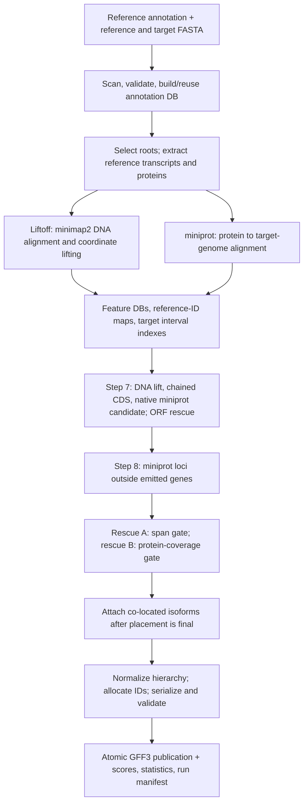

# LiftOn next-release audit and implementation record

Updated 2026-09-14 after **v1.0.12 was released**. Current release and primary
comparison: `6c86d1bf8dc0d53744a4410dcb2d6d2deb17f5e3`. Next correctness
candidate: **v1.0.13**, branch `next-v1.0.13`, worktree
`/tmp/lifton-v1.0.13-build`. The [current execution plan](lifton_v1_0_13_plan.md)
supersedes the earlier v1.0.12 build plan. Historical evidence below remains
labelled by the source that produced it.

## Current status

- v1.0.12 release tag, PyPI artifacts and Linux Python 3.10–3.12 CI success were
  verified on 2026-09-14. Wheel SHA-256:
  `9c30f744181e28052b52ad775a00b4fb5797affe4e871e46089336126835068f`;
  sdist: `b1069d124b3188260ee15a0ee6c14d212f2b0aa584792490a97b47c232ed808b`.
- Released copy-hierarchy correction `6c86d1b` is included in the new baseline;
  it must not be reimplemented. Released focused copy/native/evidence/shell
  checks: **67 passed in 315.58 seconds**, including the native 24-way matrix.
- The unfinished evidence patch was preserved and imported into the isolated
  branch for completion and review. Its previous focused result was 60 passed;
  this is not final qualification of the v1.0.13 branch.
- Actual Ensembl GTF remains broken on v1.0.12: a retained chromosome-22 panel
  produces exit zero with `partial_success`, 17 processing errors and no CDS.
  Conversion preserving genes yields the independently counted 8 genes,
  26 transcripts (17 coding), 116 exons and 69 CDS without processing errors.
- Native sparse-CDS and gene-to-CDS probes fail while the equivalent ordinary
  hierarchy succeeds. These input paths are pending production correction.
- Fresh `-copies` placements have known run-to-run variability; controlled
  shared native alignments isolate the released copy fix from that variation.
- The legacy re-audit finished with failures/unresolved provenance; those reports
  are historical diagnostics, not passing release evidence. Earlier unlimited
  nonerror records made some reports over a gigabyte, motivating bounded reports.
- Dependency versions were audited without upgrades; see
  [dependency audit](lifton_v1_0_13_dependencies.md).

## Objective and constraints

Prepare v1.0.13 with correct inputs, coding semantics and reproducible evidence,
then continue measured rescue efficiency and optional copy experiments.
Correctness precedes performance. Ordinary supported inputs retain all 24 native
byte-identity configurations. Qualify Linux Python 3.10–3.12. New feature behavior
requires focused regression and independent truth, not reference identity alone.

Long runs use tmux and frozen source: 8 threads per cell, at most two whole
genomes, 32 aggregate scheduling threads including aligners, 256 GiB host reserve.
Timed runs are exclusive with three alternating paired replicates. Historical
results are preserved. Publication, tagging, pushes and reporter messages are
outside this implementation task. An incomplete gate remains incomplete.

## How the current algorithm works

The reference database defaults to gffutils/SQLite. Optional streaming and
in-memory paths use vendored gffbase/DuckDB. Sequence access uses pyfaidx.
Parasail performs alignment; Python code performs chaining, model assembly,
variant classification, and ORF rescue. Protein identity against the reference
is an optimization objective, not an independent biological truth label.

Step 7 threads coordinate copy allocation and cross-locus interval reads through
`Step7StateCoordinator`. Detached feature materialization prevents workers from
using another thread's SQLite connection. Results are committed in submission
order. Step 8 similarly evaluates candidates and rechecks acceptance serially.
Rescue placement updates the suppression tree and emitted-reference-gene set;
these decisions must remain ordered even when scoring is parallel. Isoform
scoring already uses forked workers; attachment and publication remain serial.

The output transaction stages and validates the GFF3 before replacing the final
path. Worker processes must not execute the parent's signal handler. FASTA file
offsets must not be shared across forked workers: workers reopen the files.
Input and annotation caches have separate provenance and locking requirements.

## Claude history: sources and evidence boundary

The available local LiftOn history includes sessions beginning 2026-07-02,
2026-08-16, and 2026-09-11, ending as recently as 2026-09-14. The two latest
substantial sessions are `e1194ba0-8508-473d-8be2-194ad4f7741b` and
`25545d1d-1c84-417b-b380-c5b5473fd1db`. Local project memories summarize earlier
iterations. Raw conversations are private working records and are not copied
into the repository. Git history and reproducible artifacts take precedence
over an assistant's claims. Missing/truncated history is not reconstructed as
fact.

| Work | Current evidence and interpretation |
|---|---|
| v1.0.10 alignment, hierarchy, IDs, and installation fixes | Historical audit in `lifton_correctness_audit.md`; `cigar` clean-install failure establishes why empty-cache packaging tests matter. |
| v1.0.11 duplicate-ID collision repair | Exact tag `c623f0b`; keep this release's sealed scientific evaluation unchanged. |
| Large-target native scheduling and diagnostics | `307abc6`; public 22-Gb indexing surrogate establishes large independent peaks, not the cause of the private issue #71 failure. |
| Coverage and isoform rescue | `79a212a`; 13-cell feature A/B reports support additions without losses under their measured protocol. |
| Default locus pipeline and parallel Liftoff | `d4c1f02`, `8816ef3`, `804f01e`; measured byte-equivalent paths. Timings must retain cache/thread/protocol context. |
| Terminal-stop completion | `d3fa4da`, `cff6ec0`, `8b91f3a`; 13-cell A/B restricts changes to three-base terminal extensions; reference stop convention and post-ORF timing are essential. |
| Feature clone and streaming validator | Already implemented before this audit. Older notes calling them unfinished are superseded by current code and tests. |
| Cross-locus replacement | Still opt-in: revised experiment loses 161 transcripts net. No default promotion. |
| Flat annotation fallback | Root selection accepts CDS, but extraction only visits children. The full input-to-output path remains unresolved at this baseline. |
| `--stream`/`--inmemory-liftoff` at scale | Historical under-recovery/hangs are recorded. Current synthetic parity does not settle whole-genome behavior. |
| Latest 17-cell release campaign | Outputs and rescored records exist locally; harness is initially untracked and Markdown summary stale. Requires provenance and stronger gates. |

The latest campaign uses `-t 16 -copies`, fresh native alignment, and reusable
reference DBs. It is not a no-option default or fully cold-cache campaign.
Direct set comparison of the 17 transcript tables found zero lost recovered
coding IDs and no duplicate reference rows. Zero identity regressions applies
only to the numerically scored common set. For chicken, 1,258 recovered models
in each arm have no protein identity and status `map_failed`; their recovery
cannot be described as independently confirmed accuracy.

Follow-up inspection resolved the chicken class: all 1,258 rows have
`n_cds_lifted=0` and `lifted_prot_len=0`; an inspected emitted model has exons
but no CDS and is explicitly tagged `mutation=no_protein`. These are mapped
reference IDs without recovered coding sequence, not unexplained failed
alignments. The revised comparison records this class separately and gates on
loss of previously scored coding models. A blank score without corresponding
CDS/sequence evidence remains unresolved.

The evaluator uses LiftOn's extraction/alignment code. It provides a consistent
yardstick across tools but can share bugs with the implementation. Independent
sequence extraction, target-coordinate concordance, and constructed truth must
supplement it. An annotation's own invalidity is context, never blanket
permission to introduce new output defects.

## Historical initial milestone assessment (superseded by the current plan)

| Milestone | Required result | Status |
|---|---|---|
| 1. History and architecture | Reconciled evidence ledger and current data/state flow | In progress: this report |
| 2. Release evidence | Fail-closed gates, explicit lost/unscored models, pinned snapshots and resumable provenance | In progress |
| 3. Inputs | Flat CDS and actual GTF work end to end; preserve source semantics | Pending |
| 4. Parity and reliability | Real fast-path equivalence, reduced regressions, injected-failure coverage | Pending |
| 5. Rescue efficiency | Bounded isoform work, bulk reads, ordered parallel placement scoring | Pending |
| 6. Independent verification | Sequence, coordinate and known-truth evidence with explicit exclusions | Pending |
| 7. Additional copies | Optional experiment retained only if independent gates pass | Pending |
| 8. Qualification | Full suite, Linux CI matrix, whole genomes, wheel/sdist execution, documentation | Pending |

Performance targets are 20% lower rescue wall time and 25% lower rescue working
memory on affected workloads. These are experimental targets, not promised
results. Report parent/process-tree RSS and PSS separately: summed RSS counts
fork-shared pages more than once. Overlapping manifest phases must not be summed
as end-to-end wall time. Small improvements must exceed paired-run variability.

No broad vendored refactors, process-based Step 7, concurrent gffutils builds,
or speculative rescue-threshold sweeps are planned. Prior negative experiments
stay rejected unless new evidence changes their premises. Final-model start/stop
quality will be measured independently of historical rescue-trigger labels.

## Validation log

- Planning baseline: 74 tests passed in 246.99 seconds: native matrix,
  integration pipeline, sequence extraction, streaming validator. This was a
  focused check, not a new full-suite qualification.
- Current-head GitHub tests were successful at planning time (run
  `34767497257`). New implementation commits require their own qualification.
- Release-shell fault tests: **8 failed / 1 passed before the repair; 9 passed
  after**. Injected failures cover lifting, validation, build, installation,
  wheel execution, serial/thread parity, wheel parity, and preservation of
  previous evidence. The script now fails on the first error, compares actual
  bytes, and runs the wheel outside the source tree without PYTHONPATH leakage.
- `make test` now includes the three previously ignored property-test modules.
- Release-comparison regressions: **14 failed / 2 passed before the repair**;
  the expanded comparison/provenance suite now has **26 passing tests**.
  Coverage includes ID loss despite net gain, nonfinite/missing identity,
  missing CDS versus scoring failure, per-model validity regressions, changed
  binaries/source/commands, altered outputs, and incomplete receipts. Legacy
  rescoring is written to a new campaign and cannot manufacture provenance.

## Release state

Not release-qualified. Milestones above must be resolved with evidence before
building the final release packet. No new tag, package publication, website
deployment, or reporter message is part of this implementation checkpoint.
