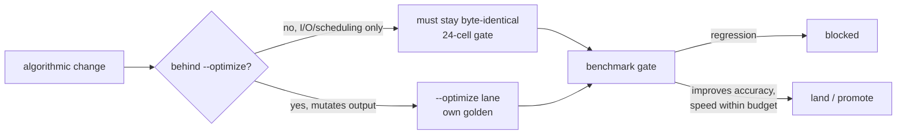
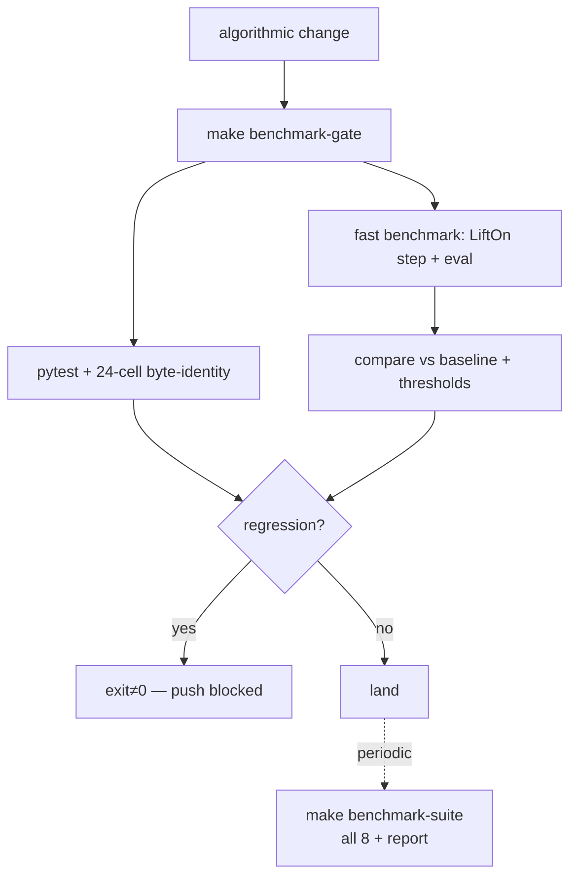

# LiftOn — Automated Optimization & Benchmarking Loop

**Goal.** Drive LiftOn toward *higher accuracy* (it must beat both Liftoff and miniprot),
*higher speed*, and *greater robustness*, while guaranteeing **full-feature lift-over** with
**completeness tracking**, and replicating **every published CCB experiment**
(<https://ccb.jhu.edu/lifton/>). Every algorithmic change is validated automatically by a
regression + benchmark loop before it can land.

This document is the architecture and implementation strategy. Live numbers are in the
auto-generated [`benchmark_comparison_report.html`](benchmark_comparison_report.html); the
end-to-end harness design is in [`benchmark_pipeline.md`](benchmark_pipeline.md).

---

## 1. The core constraint shapes everything: the byte-identity contract

LiftOn's load-bearing test is the **24-cell byte-identity matrix**
(`tests/test_native_matrix.py::TestFullNativeMatrix`): every combination of the four fast-path
flags (`--stream × --inmemory-liftoff × --threads∈{1,2,4} × --native`) must produce **byte-identical**
output. That gate is what makes the I/O / scheduling fast-paths safe, and the manuscript depends on
the exact default output.

But **accuracy cannot improve without changing output bytes.** The biggest speed levers (banded /
mappy-seeded alignment, per-chromosome sharded dispatch) and the biggest accuracy lever (a smarter
Liftoff↔miniprot DAG-fusion merge) all *mutate* the output — which by definition breaks
byte-identity with today's output.

**Decision — flag-gate (phased program).** The default path stays **byte-frozen and
manuscript-reproducible**. Every output-mutating accuracy/speed improvement lands behind an opt-in
flag (**`--optimize`**, reserved now) with its **own evolving golden**. The 24-cell gate keeps the
default frozen; a separate test lane (`TestOptimizeFlagScaffold`) tracks the `--optimize` lane. A
change is promoted to default **only after the benchmark loop proves it beats the default** on
accuracy without unacceptable speed cost.



This is the foundation iteration: it builds the *measurement and gating machinery* every future
algorithmic change is judged by, and reserves the `--optimize` seam — **no algorithmic change to
output this iteration.**

---

## 2. Full-feature lift-over & completeness tracking

**Lift-over is already complete.** LiftOn lifts *every* feature type — genes, mRNAs, ncRNAs, tRNAs,
rRNAs, lncRNAs, pseudogenes, miRNAs, snoRNAs, etc. Protein-coding transcripts get the full
triple-refinement (Liftoff + miniprot + protein-maximization + ORF rescue); non-coding features
inherit Liftoff's lift. The gap was never *lifting* all features — it was *tracking and evaluating*
them. The reference partition + feature-type/biotype are read in
`lifton_utils.get_ref_liffover_features`.

Two additions close that gap (both **GFF-byte-neutral** — side files only, the 24-cell gate stays
green):

- **Tool-side tracking** (`lifton/stats.py` → `lifton_output/stats/completeness_by_feature_type.txt`).
  `print_report` now tallies, per raw GFF feature type, `n_reference / n_lifted / n_missed /
  n_extra_copies / n_target / pct_recovered`, and prints a per-type completeness block to stderr.
  The feature type is captured on `Lifton_feature` (`feature_type`, `biotype`) — pure metadata.
- **Evaluator-side measurement** (`benchmarks/compare/evaluator.py`). A `completeness_by_type` pass
  records, per feature type, reference vs recovered (id-match, copy-suffix-aware via
  `id_mapping.strip_copy_suffix`) plus the tool's own per-type census, and an `_overall_` aggregate
  over all gene/transcript/ncRNA/pseudogene types (exon/CDS/UTR sub-parts excluded, since LiftOn
  re-ids those during ORF rescue and id-match would understate them). The reporter renders an
  all-feature-completeness table + plot (§ "1b" of the comparison report).

---

## 3. The benchmark suite — every published CCB experiment

Eight chromosome-subset benchmarks (registry: `benchmarks/compare/benchmarks.json`). Each subsets
*both* genomes to one syntenic chromosome for speed (`AUTO_LARGEST_CODING` ref chrom by mRNA
density; `AUTO_SYNTENIC` target chrom via minimap2 `asm20`, falling back to `asm10` for distant
pairs). The two new entries this iteration — **arabidopsis** and **drosophila** — complete the
published set.

| Benchmark | Pair | Type |
|---|---|---|
| `human_mane` (MAIN) | GRCh38 → CHM13 (MANE) | same-species |
| `bee` | HAv3.1 → ASM1932182v1 | same-species |
| `mouse` | GRCm39 → NOD_SCID | same-species |
| `rice` | IRGSP → ASM3414082v1 | same-species |
| **`arabidopsis`** *(new)* | TAIR10 → ASM2311539v1 | same-species |
| `human_to_chimp` | GRCh38 → chimp | closely-related |
| `mouse_to_rat` | GRCm39 → rat | distantly-related |
| **`drosophila`** *(new)* | D. melanogaster → D. erecta | distantly-related |

**Metrics** (per tool, per benchmark):
1. **Annotation completeness** — coding (recovered/reference coding mRNA) *and* the new
   all-feature-type completeness.
2. **Protein-sequence identity** — CDS-translated, aligned with LiftOn's own parasail kernel
   (`align.py` + `get_id_fraction`); directly comparable across all three tools.
3. **Gene DNA-sequence identity** — full-transcript (exon-spliced) for Liftoff/LiftOn, CDS-spliced
   for miniprot (no UTR records).
Plus **runtime / peak RSS** (parsed from `/usr/bin/time`) and a secondary **LiftoffTools `variants`**
cross-check (Liftoff/LiftOn only).

The evaluator itself is **multi-threaded** (`-t/--threads`): the per-mRNA protein/DNA parasail
alignments — the eval's dominant cost — run on a `ThreadPoolExecutor` (parasail releases the GIL),
after a single-threaded "materialize" pass does the non-concurrent gffutils reads. Output is
deterministic — `-t 1` and `-t N` produce byte-identical `summaries.json` (assembly is in mRNA
submission order) — and ~2.4× faster on a 13K-mRNA benchmark.

Each benchmark is fully resumable (`work/<id>/.done/<stage>.done`): `subset → tools → eval →
liftofftools → report`. LiftOn reuses the standalone Liftoff + miniprot outputs via `-L`/`-M`, so
its protein-refinement contribution is isolated.

### Two feature-mode sets — `genes` vs `allfeat`

Each benchmark runs in two maintained modes (`run_compare --feature-modes {genes,allfeat}`,
default both):

- **`genes`** — Liftoff lifts only the gene hierarchy (the default). Non-gene top-level
  features (pseudogenes, mobile_genetic_elements, regulatory elements) are *not* lifted.
- **`allfeat`** — Liftoff is run with `-f` listing every top-level annotation type, and the same
  `-f` is passed to LiftOn (it filters by its own `-f`). Scope: all parentless types EXCEPT the
  chromosome `region` directive and alignment-evidence pseudo-features (`match`/`cDNA_match`/
  `match_part`); regulatory features ARE lifted.

This closes the full-feature-lift gap the all-feature completeness tracking surfaced — and proves
**LiftOn can lift every feature type** (it was a default-invocation gap, not a capability gap; both
changes are harness-only, so the 24-cell gate is untouched). Verified: arabidopsis allfeat lifts
904 pseudogenes (all-feature completeness 91.6 %→99.0 %), drosophila lifts mobile_genetic_elements,
and mouse lifts childless regulatory features at scale. The subset and miniprot are shared between
modes; `genes` lives in `work/<id>/{tools,eval}/`, `allfeat` in `work/<id>/{tools_allfeat,
eval_allfeat}/`. The report's **§1c (Feature-mode comparison)** shows how many more features the
all-feature lift recovers per benchmark.

---

## 4. The automated optimization–benchmark loop

After every algorithmic change, one command (`make benchmark-gate` →
`scripts/benchmark_gate.py`) runs two checks and **exits non-zero on any regression**:

1. **pytest + the 24-cell byte-identity gate** (`tests/test_native_matrix.py` +
   `tests/test_integration_pipeline.py`) — proves the default path stays byte-frozen and all
   fast-path configs stay mutually identical.
2. **A fast single-chromosome benchmark** — re-runs *only* the LiftOn step (cached Liftoff/miniprot
   reused via `-L`/`-M`) + the evaluator on the fastest dataset (`human_mane`), then compares
   LiftOn's metrics against a committed baseline (`benchmarks/compare/baseline/<id>.baseline.json`)
   with explicit thresholds:

   | metric | rule |
   |---|---|
   | protein-identity mean | absolute drop ≤ 0.005 |
   | completeness (coding) | absolute drop ≤ 0.01 |
   | completeness (all feature types) | absolute drop ≤ 0.01 |
   | wall-clock | relative regression ≤ 25 % |

`--update-baseline` reseeds the baseline after a *reviewed, intentional* improvement. A versioned
**`scripts/hooks/pre-push`** hook (chains the stock Git-LFS hook; `SKIP_BENCHMARK_GATE=1` bypass)
runs the gate before every push. The full 8-benchmark suite runs on demand / nightly
(`make benchmark-suite`).



---

## 5. Commands

```bash
PY=/home/kh.chao/miniconda3/envs/lifton_devel/bin/python   # or: make ... LIFTON_PY=<py>

make test               # full pytest suite
make test-fast          # 24-cell byte-identity gate + integration
make benchmark-gate     # pytest gate + fast benchmark vs baseline (the loop)
make benchmark-gate-update   # reseed the baseline after a reviewed change
make benchmark-suite    # full 8-benchmark comparison + report (on demand)

# enable the pre-push hook (one-time, optional):
git config core.hooksPath scripts/hooks
```

---

## 6. Optimization roadmap (iterations 2+, all flag-gated behind `--optimize`)

Each item below mutates output, so it lands behind `--optimize`, carries its own golden, and must
be proven better by the loop before promotion.

- **Speed.** At scale the external Liftoff + miniprot subprocesses (Step 4) are the wall-clock
  floor; the in-process per-locus merge (Step 7) is already threaded. Levers: per-chromosome
  sharded dispatch of the aligners, and banded / mappy-seeded parasail in the merge kernel
  (3–12× on the kernel). Both change alignment ties → output bytes.
- **Accuracy.** A smarter Liftoff↔miniprot merge (DAG-fusion over the chaining graph) and improved
  ORF-rescue / CDS-boundary patching — where LiftOn can make better per-locus decisions than either
  input alone. Expected to widen the cross-species gain (already largest on
  `human_to_chimp`/`mouse_to_rat`/`drosophila`).
- **Robustness.** Output-neutral hardening landed this iteration (input existence/0-byte guards,
  `asm20→asm10` synteny fallback, target-seqid checks, tool-output zero-size + stderr surfacing).
  Algorithmic edge-case hardening (degenerate ORFs, partial CDS, multi-copy ambiguity) follows
  behind `--optimize`.

---

## 7. File map (this iteration)

| Concern | Files |
|---|---|
| Published experiment set | `benchmarks/compare/benchmarks.json` (+ arabidopsis, drosophila) |
| All-feature completeness — eval | `benchmarks/compare/evaluator.py`, `reporter.py` |
| All-feature completeness — tool | `lifton/stats.py`, `lifton/lifton.py`, `lifton/lifton_class.py`, `lifton/lifton_utils.py` |
| Regression + benchmark loop | `scripts/benchmark_gate.py`, `Makefile`, `scripts/hooks/pre-push`, `benchmarks/compare/baseline/` |
| `--optimize` flag-gating scaffold | `lifton/lifton.py`, `lifton/locus_pipeline.py`, `tests/test_native_matrix.py` |
| Harness robustness | `benchmarks/compare/subset_builder.py`, `tool_runners.py` |
