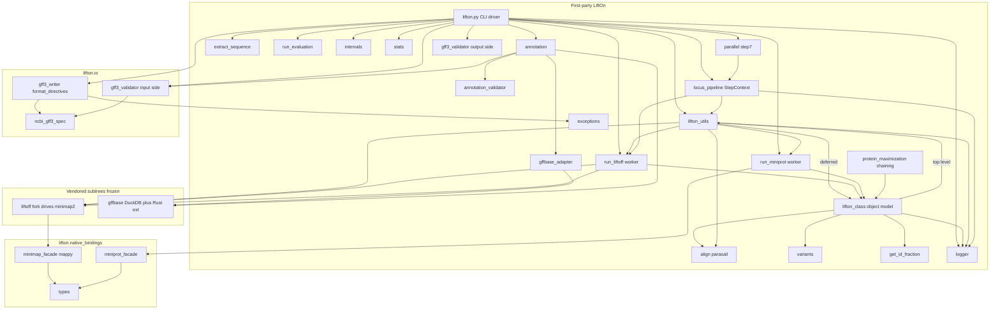

## 1. System Overview & Architecture

This section specifies *what* LiftOn is, *which* modules implement it, *how* those modules depend on each other, and *which* invariants any reimplementation must preserve. It is grounded in the real Python at `lifton/lifton.py`, `lifton/__init__.py`, `setup.py`, and the module survey of `lifton/`. Subsequent sections (§2 onward) specify each component algorithm in full; this section is the map.

### 1.1 Problem statement

LiftOn is a **homology-based genome-annotation lift-over CLI**. The lift-over problem it solves is:

| Symbol | Role | Concrete artifact |
|---|---|---|
| `R` | Reference genome (DNA) | FASTA, CLI positional `reference` (`lifton.py:212`) |
| `R_A` | Reference annotation | GFF3 or GTF, `-g/--reference-annotation` (required, `lifton.py:221`) |
| `T` | Target genome (DNA) | FASTA, CLI positional `target` (`lifton.py:211`) |
| `T_A` | **Output** annotation for `T` | GFF3, `-o/--output` (default `lifton.gff3`, `lifton.py:48`) |

Given `R`, `R_A`, and `T`, LiftOn produces `T_A`: a GFF3 annotation of the target genome whose feature coordinates, structure, and attributes are transferred from `R_A` and refined against the actual target sequence.

#### The central thesis: fuse DNA-level and protein-level alignment

LiftOn's distinguishing idea is that **neither DNA alignment nor protein alignment alone is sufficient** for accurate protein-coding lift-over, and that *fusing* the two yields a better annotation than either:

1. **DNA-level alignment** is produced by a **vendored fork of Liftoff** (`lifton/liftoff/`), which maps reference gene loci onto the target genome. Liftoff itself aligns sequence with **`minimap2`** — invoked either as an external subprocess (`lifton/liftoff/align_features.py`) or, under `--native`, driven in-process through the **`mappy`** PyO3 binding (`lifton/liftoff/native_align.py`). DNA alignment preserves exon/intron structure and gene boundaries but is blind to reading-frame correctness.
2. **Protein-level alignment** is produced by **`miniprot`** (`lifton/run_miniprot.py`), which aligns the reference *proteins* against the target genome (spliced protein-to-genome alignment). Protein alignment recovers the correct coding frame and start/stop placement but can miss or distort UTR/exon structure.
3. **Fusion** happens in the in-house **protein-maximization chaining algorithm** (`lifton/protein_maximization.py:176`, `chaining_algorithm`) plus an **ORF-rescue pass** (the `__find_orfs` / `__update_cds_boundary` machinery inside `lifton/lifton_class.py`). The chaining algorithm walks the Liftoff transcript and the miniprot transcript in parallel and selects, per CDS segment, the boundary that **maximises the protein** transferred while remaining consistent with the target sequence; the ORF-rescue pass repairs frame, start, and stop where alignment alone left a broken ORF.

The result is `T_A`: each protein-coding transcript carries the best of both signals, while non-coding features fall through the DNA-only Liftoff path.

#### Packaging surface

`setup.py` declares package **`lifton`, version `1.0.8`** (`setup.py:7-8`), author Kuan-Hao Chao. `lifton/__init__.py` separately pins `__version__ = 'v1.0.8'` (note the `v` prefix; this is the string shown by `-V/--version`, wired at `lifton.py:104`). Two **console scripts** are exposed (`setup.py:33-36`):

| Console script | Entry point | Purpose |
|---|---|---|
| `lifton` | `lifton.lifton:main` | The full lift-over pipeline (this whole spec). |
| `gff3-validate` | `lifton.gff3_validator:_main` | Standalone GFF3 validator for an already-written file. |

Runtime dependencies (`setup.py:13-22`): `numpy>=1.22.0`, `biopython>=1.76`, `cigar>=0.1.3`, `parasail>=1.2.4`, `intervaltree>=3.1.0`, `interlap>=0.2.6`, `networkx>=3.3`, `pyfaidx>=0.5.8`, `pysam>=0.19.1`, `gffutils>=0.10.1`, `ujson>=3.2.0`, `pytest>=7.0.0`, plus `duckdb>=1.0` and `pyarrow>=14` (gffbase backend) and `mappy` (unlocks the `--native` in-process minimap2 path; absence degrades `--native` to the subprocess path with a stderr warning, never an error). `python_requires='>=3.6'` (`setup.py:31`) — note this is *looser* than the conda env (Python 3.11, `lifton.yml`) and CI (Python 3.12); this skew is a known cleanup item.

`package_data` (`setup.py:24-30`) ships the vendored gffbase Rust extension (`_native*.so` / `_native*.pyd`), gffbase test fixtures (`data/*.gff3`, `data/*.gtf`), the gffbase `LICENSE`, the pure-Python fallback package (`_pyfallback/*.py`), and the Rust source (`_rust/**`). A missing `_native*.so` causes gffbase to fall back to its pure-Python parser at `lifton/gffbase/_pyfallback/`.

### 1.2 Module map + dependency graph

The codebase is three populations of code:

- **First-party LiftOn** — ~8.6 KLOC across `lifton/*.py` + `lifton/io/*.py` + `lifton/native_bindings/*.py` (measured: 8594 LOC).
- **Vendored Liftoff fork** — ~2.9 KLOC, `lifton/liftoff/` (17 `.py` files, 2824 LOC). Treat as a frozen dependency invoked *as a library*.
- **Vendored gffbase** — ~4.1 KLOC, `lifton/gffbase/` (incl. subdirs `_pyfallback/`, `_rust/`; 4151 LOC) plus a pre-built Rust extension `_native*.so`. First-party DuckDB-backed successor to gffutils; same author; treat as a frozen drop-in dependency.

#### First-party module roles (one line each)

| Module | LOC | Role |
|---|---|---|
| `lifton/lifton.py` | 667 | CLI: arg parsing (`parse_args`), the 11-step pipeline driver `run_all_lifton_steps`, and `main` (entry point). |
| `lifton/lifton_class.py` | 896 | Object model god-module: `Lifton_GENE → Lifton_TRANS → Lifton_EXON → Lifton_CDS`, `Lifton_ORF`, `Lifton_Status`; coordinate reconciliation, alignment dispatch, ORF rescue, GFF serialisation. |
| `lifton/lifton_utils.py` | 601 | Shared helpers: feature selection (`get_parent_features_to_lift`, `get_ref_liffover_features`), Liftoff/miniprot invocation wrappers (`exec_liftoff`, `exec_miniprot`), ID mapping (`miniprot_id_mapping`), geometry helpers (`segments_overlap_length`, `custom_bisect_insert`, `get_ID_base`). |
| `lifton/annotation.py` | 827 | `Annotation` class: builds/opens the reference, Liftoff, and miniprot feature DBs (gffutils SQLite by default, gffbase-DuckDB under `LIFTON_USE_GFFBASE=1`); GTF→GFF3 auto-convert; exposes `.db_connection` and `.directives`. |
| `lifton/annotation_validator.py` | 366 | `validate_annotation_file` + report printers used during DB build to diagnose malformed input. |
| `lifton/extract_sequence.py` | 235 | Reference transcript/protein FASTA extraction: streaming `extract_features_to_fasta` (default path) and legacy in-memory `extract_features`. |
| `lifton/align.py` | 248 | Parasail wrappers: `protein_align`, DNA alignment, CDS-protein boundary mapping; DNA sanitiser for parasail. |
| `lifton/protein_maximization.py` | 280 | The chaining algorithm (`chaining_algorithm`) and entry-construction helpers that fuse Liftoff + miniprot CDS segments. |
| `lifton/run_liftoff.py` | 266 | `run_liftoff` (drives the vendored Liftoff library) + `process_liftoff` / `process_liftoff_with_protein` (per-locus Step 7 worker logic) + `initialize_lifton_gene`. |
| `lifton/run_miniprot.py` | 318 | `run_miniprot` (subprocess/facade driver, bounded stdout drain `_drain_stream_chunks`), `check_miniprot_installed`, `process_miniprot` (Step 8 per-mRNA worker). |
| `lifton/run_evaluation.py` | 115 | `-E/--evaluation` mode: scores an existing target annotation against the reference (separate, non-lift-over code path). |
| `lifton/intervals.py` | 23 | `initialize_interval_tree`: per-seqid `IntervalTree`s seeded from the Liftoff DB to detect locus overlaps. |
| `lifton/variants.py` | 121 | Variant/ORF status detection: `has_stop_codon`, `is_frameshift`, `find_variants`. |
| `lifton/get_id_fraction.py` | 69 | Identity-fraction helpers: `get_partial_id_fraction`, `get_AA_id_fraction`, `get_DNA_id_fraction`. |
| `lifton/stats.py` | 94 | `print_report`: writes mapped/unmapped/extra-copy stats files at end of run. |
| `lifton/logger.py` | 99 | Logging facade (`log`, `log_info`, `log_warning`, `log_error`, `log_success`, `log_section`). |
| `lifton/gffbase_adapter.py` | 122 | Shim translating between LiftOn's `Annotation` shape and gffbase's API (`build_database`, `build_database_from_string`, `open_existing_db`, `looks_like_gff3_blob`). |
| `lifton/parallel.py` | 447 | `parallel_step7`: serial or `ThreadPoolExecutor` dispatch of Step 7 with a deterministic ordered writer. |
| `lifton/locus_pipeline.py` | 824 | `StepContext` (immutable per-run bundle), `LocusResult` (submission-indexed worker output), `process_locus`, `consume` — the parent/worker split that makes parallel output deterministic. |
| `lifton/gff3_validator.py` | 1034 | Output-side GFF3 validator (`validate_gff3_file`, `print_validation_report`) + the `gff3-validate` console entry `_main`. |
| `lifton/exceptions.py` | 26 | Exception hierarchy: `LiftOnError`, `LiftOnInputError`, `LiftOnAlignmentError`. |
| `lifton/io/gff3_writer.py` | — | `format_directives` (single source of truth for the `##` directive prologue) + GFF3 line formatting; depends only on `exceptions` + `io/ncbi_gff3_spec`. |
| `lifton/io/gff3_validator.py` | — | Input-side NCBI GFF3 validator: `GFF3Validator(target_seqids, strict).validate(path)`; used by the `--strict-gff` gate. |
| `lifton/io/ncbi_gff3_spec.py` | — | NCBI GFF3 spec constants (`RESERVED_CHARS`, etc.). |
| `lifton/native_bindings/minimap_facade.py` | — | `MinimapAligner`, `is_mappy_available` — `mappy` PyO3 wrapper for `--native`. |
| `lifton/native_bindings/miniprot_facade.py` | — | `MiniprotIndex`, `is_pyminiprot_native_available` — pyminiprot-shaped facade (subprocess today, swappable later). |
| `lifton/native_bindings/types.py` | — | `GFF3Bundle`, `GFF3Hit`, `MinimapHit` value types shared by the facades. |

#### Vendored subtree entry points

- **`lifton/liftoff/`** — invoked *as a library*, not as a subprocess. `run_liftoff.run_liftoff` (`lifton/run_liftoff.py:25` region) calls `liftoff_main.run_all_liftoff_steps(args, ref_db)` (`lifton/liftoff/liftoff_main.py:10`); the `--inmemory-liftoff` path calls `run_all_liftoff_steps_inmemory` (`liftoff_main.py:26`), which routes through `lifton/liftoff/inmemory_emitter.py` instead of writing `liftoff.gff3`. Liftoff shells out to `minimap2` in `lifton/liftoff/align_features.py`, or routes through `mappy` via `lifton/liftoff/native_align.py` when `args.native` is set (a `_PysamShim` adapts mappy hits to the pysam-shaped consumer).
- **`lifton/gffbase/`** — drop-in gffutils successor. Public surface from `lifton/gffbase/__init__.py`: `FeatureDB` (`interface.py`), `Feature`/`ParsedFeature` (`feature.py`), `create_db` (`create_db.py`), `DataIterator` (`iterators.py`), `GFFWriter` (`gffwriter.py`), `export_sqlite` (`sqlite_export.py`), parser entry points (`parse_gff`, `parse_bytes`, `native_available`). Reached from first-party code only through `lifton/annotation.py` and `lifton/gffbase_adapter.py`.

#### Diagram D1 — module dependency map



### 1.3 The `lifton_utils` ↔ `lifton_class` import cycle

There is a **package-level import cycle** at the heart of the first-party code, and it is load-bearing — a reimplementation must reproduce the *resolution discipline*, not just the topology.

**The cycle.** `lifton/lifton_class.py:1` does an *eager top-level* import:

```python
from lifton import align, lifton_utils, lifton_class, get_id_fraction, variants, logger
```

and `lifton/lifton_utils.py:3` does the mirror eager top-level import:

```python
from lifton import align, lifton_class, run_liftoff, run_miniprot, logger
```

So `lifton_class → lifton_utils → lifton_class`. (Note `lifton_class` even imports *itself* by name on line 1 — harmless, since by the time the line executes the module object already exists in `sys.modules`.)

**Why it does not deadlock.** The cycle works only because neither module *uses* the other's symbols at import time — all cross-module references are **deferred to call time** (function/method bodies), never executed during module initialisation. Concretely:

- `lifton_class` calls `lifton_utils.get_ID_base(...)` (`lifton_class.py:241`), `lifton_utils.custom_bisect_insert(...)` (`lifton_class.py:297`), `lifton_utils.segments_overlap_length(...)` (`lifton_class.py:301, 340`) — all inside methods.
- `lifton_utils` calls `lifton_class.Lifton_TRANS(...)` (`lifton_utils.py:318`), `lifton_class.Lifton_feature(...)` (`lifton_utils.py:353, 358`) — all inside functions.

Whichever module Python imports first completes its top-level `from lifton import ...` against a *partially-initialised* sibling module object; because no top-level code dereferences the missing attributes, both modules finish initialising, and by first *call* both are fully populated. This is described in `CLAUDE.md` as "benign-but-fragile, kept working only by deferred attribute access."

**Gotcha (do not break this):** Any change that promotes a deferred cross-module reference to **module-import time** (e.g. a module-level constant computed from a sibling's symbol, a default argument value, a class-body call) will turn the benign cycle into an `ImportError`/`AttributeError` at import depending on load order. In particular, *do not* add an **eager top-level import from `lifton_class` into a module that `lifton_class` does not already import**, and do not add eager top-level imports of `lifton_class`/`lifton_utils` into the newer cycle-free modules listed below.

**Modules that sit cleanly outside the cycle.** The post-Phase-9 modules deliberately avoid the cycle and **lazy-import** their dependencies inside function bodies:

| Module | How it stays cycle-free | Evidence |
|---|---|---|
| `lifton/parallel.py` | Imports only from `locus_pipeline` (`LocusResult`, `StepContext`, `consume`, `process_locus`) at top level (`parallel.py:35`); no import of `lifton_class`/`lifton_utils`. | `parallel.py:35` |
| `lifton/locus_pipeline.py` | Lazy-imports everything inside functions: `from lifton import run_liftoff` (`locus_pipeline.py:81, 771`), `from lifton import logger` (`:339, 483, 528, 815`), `from lifton import lifton_utils as _lu` (`:442`). No top-level `lifton.*` imports. | `locus_pipeline.py:81,339,442,483,528,771,815` |
| `lifton/io/gff3_writer.py` | Imports only `from lifton.exceptions import LiftOnInputError` (`:26`) and `from lifton.io.ncbi_gff3_spec import RESERVED_CHARS` (`:27`); both are leaf modules. | `gff3_writer.py:26-27` |

The pipeline driver itself reinforces this discipline with **lazy imports inside the step body** so the heavy parallel/writer machinery is not pulled in at `lifton.py` import time:

- `from lifton.io.gff3_validator import GFF3Validator` inside the strict-GFF gate (`lifton.py:327`).
- `from lifton.io import gff3_writer as _gff3_writer` inside Step 5 (`lifton.py:487`).
- `from lifton import parallel as _parallel` and `from lifton.locus_pipeline import StepContext as _StepContext` inside Step 7 (`lifton.py:523-524`).

### 1.4 The byte-identity contract and the fast-path flags

The single most important invariant in the codebase: **six orthogonal fast-path flags change I/O, scheduling, or alignment *mechanism* but never the bytes of `T_A`.** All produce output byte-identical to the default path.

#### The 24-cell matrix

The defining gate is `tests/test_native_matrix.py::TestFullNativeMatrix::test_all_24_combinations_byte_identical`. It runs **every combination** of four toggles and asserts the output GFF3 is identical (the reference fixture is a 391-byte GFF3):

```
--stream ∈ {off, on}            (2)
--inmemory-liftoff ∈ {off, on}  (2)
--threads ∈ {1, 2, 4}           (3)   (with --locus-pipeline)
--native ∈ {off, on}            (2)
-------------------------------------------
2 × 2 × 3 × 2 = 24 cells, all byte-identical
```

Smaller subset gates exist: `tests/test_pipeline_streaming.py` (`--stream`), `tests/test_liftoff_inmemory.py` (4-cell `--inmemory-liftoff`), `tests/test_parallelism_matrix.py` (`--threads`), and the full 24-cell in `tests/test_native_matrix.py`.

**Gotcha:** any change touching the **alignment kernel, the writer, the directive carrier, the ID-formation logic, or the per-locus `LocusResult` shape** must keep this gate green. Output-mutating optimisations (banded alignment, mappy-seeded extension — ~0.1% output drift) were *explicitly deferred* in Phase 14 precisely because they would break this contract; landing them requires a deliberate test edit and a manuscript erratum.

#### The six fast-path flags

| Flag | Default | Branch point | What it changes (mechanism only) |
|---|---|---|---|
| `--stream` | off (`lifton.py:171`) | Step 4/5, inside `exec_miniprot` / `Annotation` build (`lifton.py:446, 466`); `_describe_annotation_source` renders the in-memory bytes blob (`lifton.py:22-24`) | Pipes `miniprot` stdout directly into an in-memory gffbase `FeatureDB` instead of writing `miniprot.gff3` to disk; eliminates the SQLite re-ingest of miniprot output. |
| `--inmemory-liftoff` | off (`lifton.py:179`) | Step 4, inside `exec_liftoff` (`lifton.py:444`), routing to `liftoff_main.run_all_liftoff_steps_inmemory` + `inmemory_emitter.py`; Step 5 builds the Liftoff DB from the bytes blob (`lifton.py:453`) | Serialises Liftoff's `lifted_feature_list` to bytes in-process and feeds gffbase directly; skips the `liftoff.gff3` disk write and SQLite re-ingest. |
| `--threads N` + `--locus-pipeline` | `threads=1` (`lifton.py:107`), `locus_pipeline=off` (`lifton.py:188`) | Step 7: `_use_pool = bool(args.locus_pipeline) and _threads > 1` (`lifton.py:540`); `parallel.parallel_step7(..., threads=_threads if _use_pool else 1)` (`lifton.py:541-544`) | Dispatches Step 7 per-locus work through a `ThreadPoolExecutor` sized by `--threads`; output emitted in **submission order** via a heap-backed ordered writer, so `--threads N` is byte-identical to `--threads 1`. **Both flags required** — `--threads N` alone (without `--locus-pipeline`) stays serial. |
| `--native` | off (`lifton.py:197`) | Step 4: routed through `run_liftoff`→`liftoff/native_align.py` (`mappy`) and `run_miniprot`→`miniprot_facade` when `args.native` is set | Drives `minimap2` via the `mappy` PyO3 binding in-process and routes miniprot through the pyminiprot-shaped facade; eliminates per-query subprocess fork+exec. Falls back gracefully (subprocess + stderr warning) when `mappy` is absent. |
| `--strict-gff` | off (`lifton.py:164`, dest `strict_gff`) | Strict-GFF gate before Step 1 (`lifton.py:325-366`): runs `GFF3Validator` and, on any `severity == "error"`, `sys.exit(2)` (`lifton.py:365-366`) | Runs the NCBI GFF3 input-side validator on the reference annotation and exits non-zero on any spec violation. (In strict mode every finding is dumped to stderr; in default mode findings go to a side-car `stats/gff3_input_validation.txt` with one summary line — `lifton.py:340-364`.) |
| `--validate-output` (+ `--validate-verbose`) | both off (`lifton.py:155, 160`) | Step 10 after writing (`lifton.py:585-603`): `gff3_validator.validate_gff3_file(...)` then `print_validation_report(...)` | After writing `T_A`, re-validates it with the in-tree output validator (hierarchy / CDS phase / containment / LiftOn-attr checks) and prints a structured report; `--validate-verbose` additionally prints warnings. |

**Gotcha (flag interaction with the contract):** `--strict-gff` and `--validate-output` are *gates/diagnostics* — they can abort the run or print reports but, on a valid input, do not alter `T_A`'s bytes; the other four are *mechanism swaps* that the 24-cell matrix pins as byte-equivalent. The directive prologue is written **once on the parent thread, before any worker exists** (`lifton.py:487-490`, via `gff3_writer.format_directives`), so threading introduces no interleaving of the `##` header rows — a precondition for `--threads` byte-identity.
