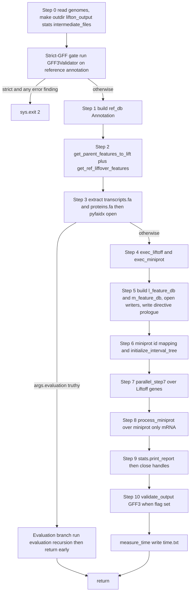
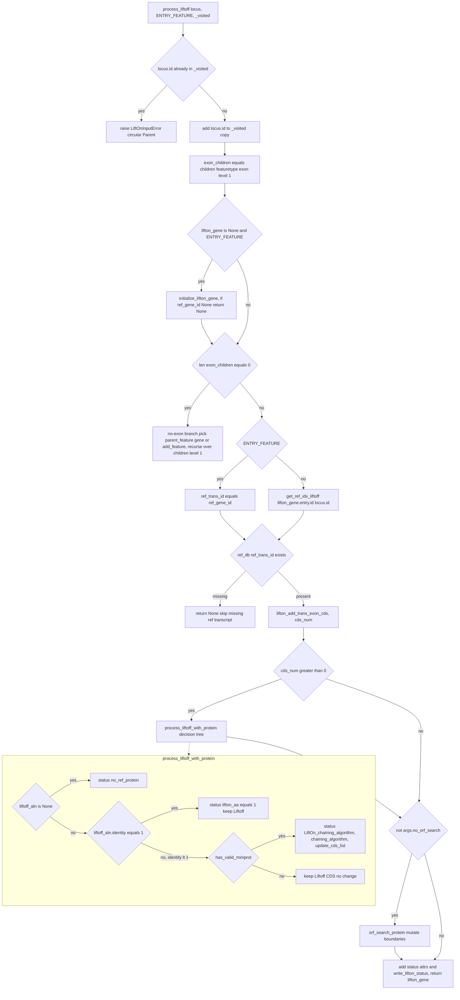
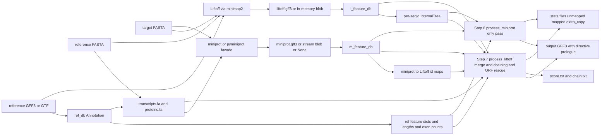

## 2. Execution Lifecycle & Control Flow

This section specifies the complete top-to-bottom control flow of a LiftOn run: how the CLI is parsed and normalised, how the eleven-step `run_all_lifton_steps` pipeline threads state forward, how each Liftoff gene locus is recursively processed into a `Lifton_GENE`, how miniprot-only genes are appended in a second pass, and how evaluation mode (`-E` / `-EL`) diverges. Every constant, threshold, branch condition, and state hand-off below is grounded in `lifton/lifton.py`, `lifton/run_liftoff.py`, `lifton/run_miniprot.py`, `lifton/run_evaluation.py`, `lifton/parallel.py`, and `lifton/locus_pipeline.py`.

The two console entry points are `lifton = lifton.lifton:main` and `gff3-validate = lifton.gff3_validator:_main` (declared in `setup.py`). Only `main` is covered here.

### 2.1 `main()` and `parse_args()`

#### 2.1.1 `main(arglist=None)` — `lifton/lifton.py:649`

`main` is the process entry point. Steps:

1. **Print the ASCII banner** to `sys.stderr` (`lifton.py:650-663`). The banner is the multi-line string below, printed verbatim with a leading newline:

```
====================================================================
An accurate homology lift-over tool between assemblies
====================================================================


    ██╗     ██╗███████╗████████╗ ██████╗ ███╗   ██╗
    ██║     ██║██╔════╝╚══██╔══╝██╔═══██╗████╗  ██║
    ██║     ██║█████╗     ██║   ██║   ██║██╔██╗ ██║
    ██║     ██║██╔══╝     ██║   ██║   ██║██║╚██╗██║
    ███████╗██║██║        ██║   ╚██████╔╝██║ ╚████║
    ╚══════╝╚═╝╚═╝        ╚═╝    ╚═════╝ ╚═╝  ╚═══╝
```

   Banner goes to **stderr** (not stdout), so stdout can be used for `-o stdout` output.
2. **Parse args:** `args = parse_args(arglist)` (`lifton.py:664`). When `arglist` is `None`, argparse reads `sys.argv[1:]`.
3. **miniprot-presence check** (`lifton.py:665-666`): call `run_miniprot.check_miniprot_installed()`. If it returns `False`, terminate via `sys.exit("miniprot is not installed. Please install miniprot before running LiftOn.")` — a string argument to `sys.exit` prints to stderr and exits with status 1. **Gotcha:** This check runs *before* any other work, even before reading genomes, and even in evaluation mode. `check_miniprot_installed` (`run_miniprot.py:54-77`) runs `subprocess.run(["miniprot", "--version"])` and returns `True` if the call did not raise `FileNotFoundError`, `PermissionError`, `NotADirectoryError`, or `subprocess.SubprocessError`. A non-zero exit code from miniprot still counts as "installed" — only an unrunnable binary returns `False`.
4. **Run the pipeline:** `run_all_lifton_steps(args)` (`lifton.py:667`).

#### 2.1.2 `parse_args(arglist)` — `lifton/lifton.py:209`

Builds an `argparse.ArgumentParser` (description `"Lift features from one genome assembly to another"`), populates it through helper functions, parses, then applies post-parse normalisation. Argument groups are assembled by `args_outgrp`, `args_aligngrp`, `args_optional`, `args_gffutils` plus inline groups, and the display order is overridden at `lifton.py:262-264` by reassigning `parser._action_groups`.

##### Post-parse normalisation (`lifton.py:266-279`)

After `parser.parse_args(arglist)`:

1. **`mm2_options` default enforcement** (`lifton.py:266-275`): five string-membership tests inject minimap2 defaults into `args.mm2_options` *if the flag substring is absent*. Each appends to the existing string:

   | Test (substring absent in `args.mm2_options`) | Appended literal |
   |---|---|
   | `'-a'` not present | `' -a'` |
   | `'--eqx'` not present | `' --eqx'` |
   | `'-N'` not present | `' -N 50'` |
   | `'-p'` not present | `' -p 0.5'` |
   | `'--end-bonus'` not present | `' --end-bonus 5'` |

   **Gotcha (substring matching):** The checks are naive substring tests, not token tests. The default value of `-mm2_options` is already `'-a --end-bonus 5 --eqx -N 50 -p 0.5'`, so on the default path **none** of these branches fire (each substring is already present). If a user passes `-mm2_options "-x map-ont"`, the test `'-a' not in args.mm2_options` is `False` because `-a` appears inside `map-ont`'s neighbours? No — `'-a'` is the 2-char string `"-a"`; `"map-ont"` does not contain `"-a"`, so `' -a'` would be appended. By contrast `'-N'` would match the `N` in any token containing the literal `-N`. The matching is purely lexical on the full options string.
2. **`-s` vs `-sc` consistency** (`lifton.py:276-277`): if `float(args.s) > float(args.sc)`, call `parser.error("-sc must be greater than or equal to -s")` (prints usage + message to stderr, exits 2). Defaults `s=0.5`, `sc=1.0` satisfy `0.5 <= 1.0`.
3. **`-unplaced` requires `-chroms`** (`lifton.py:278-279`): if `args.chroms is None and args.unplaced is not None`, call `parser.error("-unplaced must be used with -chroms")`.

Returns the normalised `args` namespace.

##### Complete CLI flag table

Positional arguments (group title overridden to `* Required input (sequences)`):

| Dest | Flag(s) | Type | Default | Meaning |
|---|---|---|---|---|
| `target` | (positional 1) | str | — | Target FASTA genome to lift genes **to** |
| `reference` | (positional 2) | str | — | Reference FASTA genome to lift genes **from** |

Top-level optionals declared directly in `parse_args` (`lifton.py:213-216`):

| Dest | Flag(s) | Action / type | Default | Meaning |
|---|---|---|---|---|
| `evaluation` | `-E`, `--evaluation` | store_true | `False` | Run in evaluation mode (§2.5) |
| `evaluation_liftoff_chm13` | `-EL`, `--evaluation-liftoff-chm13` | store_true | `False` | Evaluation mode with CHM13 Liftoff id-prefix handling (§2.5) |
| `write_chains` | `-c`, `--write_chains` | store_true | `True` | Write chaining files (**default already True**; flag cannot turn it off) |
| `no_orf_search` | `--no-orf-search` | store_true | `False` | Skip ORF search in Step 7 |

Required reference annotation group (`* Required input (Reference annotation)`, `lifton.py:220-226`):

| Dest | Flag(s) | Default | Meaning |
|---|---|---|---|
| `reference_annotation` | `-g`, `--reference-annotation` | **required** | Reference GFF3/GTF (or feature-DB name); GTF auto-detected/converted |

Optional reference-sequence group (`lifton.py:230-238`):

| Dest | Flag(s) | Default | Meaning |
|---|---|---|---|
| `proteins` | `-P`, `--proteins` | `None` | Reference protein FASTA; IDs must match transcript IDs |
| `transcripts` | `-T`, `--transcripts` | `None` | Reference transcript FASTA |

Optional pre-built annotation groups (`lifton.py:239-252`):

| Dest | Flag(s) | Default | Meaning |
|---|---|---|---|
| `liftoff` | `-L`, `--liftoff` | `None` | Pre-built Liftoff GFF3/DB; if set, skips running Liftoff |
| `miniprot` | `-M`, `--miniprot` | `None` | Pre-built miniprot GFF3/DB; if set, skips running miniprot |

Output group (`args_outgrp`, `lifton.py:45-61`):

| Dest | Flag(s) | metavar | Default | Meaning |
|---|---|---|---|---|
| `output` | `-o`, `--output` | FILE | `'lifton.gff3'` | Output GFF3 path; special value `"stdout"` |
| `u` | `-u` | FILE | `'unmapped_features.txt'` | Unmapped-features path |
| `exclude_partial` | `-exclude_partial` | — (store_true) | `False` | Move sub-threshold partial mappings to the unmapped file instead of annotating them in the GFF |

Alignment group (`args_aligngrp`, `lifton.py:64-100`):

| Dest | Flag(s) | metavar | Type | Default | Meaning |
|---|---|---|---|---|---|
| `mm2_options` | `-mm2_options` | =STR | str | `'-a --end-bonus 5 --eqx -N 50 -p 0.5'` | minimap2 params (post-normalised, §2.1.2) |
| `mp_options` | `-mp_options` | =STR | str | `''` | miniprot params |
| `a` | `-a` | A | float | `0.5` | Coverage threshold to call a feature mapped |
| `s` | `-s` | S | float | `0.5` | Sequence-identity threshold for child features |
| `min_miniprot` | `-min_miniprot` | MIN_MINIPROT | float | `0.9` | Min length ratio for miniprot-only transcripts (§2.4) |
| `max_miniprot` | `-max_miniprot` | MAX_MINIPROT | float | `1.5` | Max length ratio for miniprot-only transcripts (§2.4) |
| `d` | `-d` | D | float | `2.0` | Distance scaling factor for chaining graph edges |
| `flank` | `-flank` | F | float | `0` | Flanking-sequence fraction `[0.0-1.0]` |

Miscellaneous / Liftoff-passthrough optionals (`args_optional`, `lifton.py:103-206`):

| Dest | Flag(s) | metavar | Type/action | Default | Meaning |
|---|---|---|---|---|---|
| (version) | `-V`, `--version` | — | `action='version'` | — | Print `__version__`, exit |
| `debug` | `-D`, `--debug` | — | store_true | `False` | Debug mode (verbose logging) |
| `threads` | `-t`, `--threads` | THREADS | int | `1` | Worker count for parallel alignment / Step 7 |
| `m` | `-m` | PATH | str | `None` | minimap2 path |
| `features` | `-f`, `--features` | TYPES | str | `None` | Feature types to lift over |
| `infer_genes` | `-infer-genes` | — | store_true | `False` | Infer genes (auto for GTF) |
| `infer_transcripts` | `-infer_transcripts` | — | store_true | `False` | Infer transcripts (auto for GTF) |
| `chroms` | `-chroms` | TXT | str | `None` | Reference,target chromosome map |
| `unplaced` | `-unplaced` | TXT | str | `None` | Unplaced-sequence names (requires `-chroms`) |
| `copies` | `-copies` | — | store_true | `False` | Search for extra gene copies |
| `sc` | `-sc` | SC | float | `1.0` | Copy identity threshold; must be `>= -s` |
| `overlap` | `-overlap` | O | float | `0.1` | Max overlap fraction between two features |
| `mismatch` | `-mismatch` | M | int | `2` | Mismatch penalty in exons |
| `gap_open` | `-gap_open` | GO | int | `2` | Gap-open penalty |
| `gap_extend` | `-gap_extend` | GE | int | `1` | Gap-extend penalty |
| `subcommand` | `-subcommand` | — | str | `None` | Suppressed (internal) |
| `polish` | `-polish` | — | store_true | `False` | Liftoff polish mode |
| `cds` | `-cds` | — | store_true | **`True`** | Annotate per-CDS status (default already True) |
| `measure_time` | `-time`, `--measure_time` | — | store_true | `False` | Per-step timing → `time.txt` |
| `validate_output` | `--validate-output` | — | store_true | `False` | Re-validate output GFF3 (Step 10) |
| `validate_verbose` | `--validate-verbose` | — | store_true | `False` | Print warnings in the validation report |
| `strict_gff` | `--strict-gff` | — | store_true | `False` | NCBI GFF3 input-side validation gate |
| `stream` | `--stream` | — | store_true | `False` | Phase 7 miniprot streaming fast path |
| `inmemory_liftoff` | `--inmemory-liftoff` | — | store_true | `False` | Phase 8 in-memory Liftoff fast path |
| `locus_pipeline` | `--locus-pipeline` | — | store_true | `False` | Phase 9 ThreadPool fan-out for Step 7 |
| `native` | `--native` | — | store_true | `False` | Phase 10/11 native `mappy` + miniprot facade |

gffutils group (`args_gffutils`, `lifton.py:26-42`):

| Dest | Flag | Choices / type | Default | Meaning |
|---|---|---|---|---|
| `merge_strategy` | `--merge-strategy` | `create_unique`/`merge`/`error`/`warning`/`replace` | `'create_unique'` | DB merge strategy |
| `id_spec` | `--id-spec` | str | `None` | Attribute used as feature ID |
| `force` | `--force` | store_true | `False` | Overwrite existing DB |
| `verbose` | `--verbose` | store_true | `False` | gffutils verbose output |

Trailing optionals (`lifton.py:254-256`):

| Dest | Flag(s) | metavar | Default | Meaning |
|---|---|---|---|---|
| `annotation_database` | `-ad`, `--annotation-database` | SOURCE | `"RefSeq"` | Reference annotation source (RefSeq/GENCODE/other) |
| `no_auto_convert_gtf` | `--no-auto-convert-gtf` | — | `False` | Disable automatic GTF→GFF3 conversion |

**Gotcha (`writer_max_pending`):** The parallel ordered-writer reads `getattr(ctx.args, "writer_max_pending", 0)` (`parallel.py:380`) but **no CLI flag declares it**; it defaults to `0` (unbounded heap path). The bounded spill-to-disk writer is therefore only reachable if `args.writer_max_pending` is set programmatically.

### 2.2 `run_all_lifton_steps(args)` — `lifton/lifton.py:283`

A strictly sequential function. `time.process_time()` is sampled into `t1`…`t13` at step boundaries (`lifton.py:284`, `323`, `374`, …, `605`) and dumped if `args.measure_time` (`lifton.py:607-646`). Step numbering follows the in-source comments. Each step below lists its line range, inputs, calls, the state it threads forward, and files written.

#### Step 0 — Read genomes & set up directories (`lifton.py:285-321`)

- **Inputs:** `args.target`, `args.reference`, `args.output`.
- **Output directory layout** (`lifton.py:290-302`):
  - If `args.output == "stdout"` → `outdir = "."`; else `outdir = os.path.dirname(args.output)` (or `"."` if empty), and `os.makedirs(outdir, exist_ok=True)`.
  - `lifton_outdir = f"{outdir}/lifton_output/"`.
  - `args.directory` is set to `"intermediate_files/"` then **immediately overwritten** to the absolute `intermediate_dir = f"{outdir}/lifton_output/intermediate_files/"` (`lifton.py:297-302`); `os.makedirs(intermediate_dir, exist_ok=True)`.
  - `stats_dir = f"{outdir}/lifton_output/stats/"`; `os.makedirs(stats_dir, exist_ok=True)`.
- **Read FASTAs:** existence is checked (`os.path.exists`); a missing file calls `logger.log_error(...)` + `sys.exit(1)`. Then `tgt_fai = Fasta(tgt_genome)` and `ref_fai = Fasta(ref_genome)`; any `Fasta()` exception is logged and triggers `sys.exit(1)`.
- **State forward:** `tgt_fai`, `ref_fai`, `lifton_outdir`, `intermediate_dir`, `stats_dir`, `outdir`. **Files written:** FASTA `.fai` indices (side effect of `pyfaidx.Fasta`).

#### Strict-GFF gate (`lifton.py:324-366`)

- **Always runs** (regardless of `--strict-gff`). Builds `target_seqids = set(tgt_fai.keys()) | set(ref_fai.keys())` (`lifton.py:328`) — the union of target and reference seqids.
- `findings = GFF3Validator(target_seqids=target_seqids, strict=args.strict_gff).validate(args.reference_annotation)` (`lifton.py:329-332`).
- **Output of findings depends on mode** (`lifton.py:340-364`):
  - `--strict-gff` set → every finding logged to stderr via `logger.log(str(f), debug=True)`.
  - else if `findings` non-empty → written to side-car `stats_dir/gff3_input_validation.txt`; a single summary line counts errors vs warnings. If the side-car cannot be written (`OSError`), falls back to per-finding stderr dump.
- **Exit gate** (`lifton.py:365-366`): if `--strict-gff` **and** any finding has `severity == "error"` → `sys.exit(2)`. **Gotcha:** Without `--strict-gff`, findings never abort the run; even error-severity findings are merely recorded.
- **Files written:** `stats_dir/gff3_input_validation.txt` (non-strict, when findings exist).

#### Step 1 — Build reference annotation DB (`lifton.py:367-372`)

- `auto_convert_gtf = not args.no_auto_convert_gtf`.
- `ref_db = annotation.Annotation(args.reference_annotation, args.infer_genes, args.infer_transcripts, args.merge_strategy, args.id_spec, args.force, args.verbose, auto_convert_gtf)`.
- **State forward:** `ref_db` (the LiftOn `Annotation` wrapper; `ref_db.db_connection` is the underlying gffutils/gffbase `FeatureDB`; `ref_db.directives` carries the GFF3 `##` prologue).

#### Step 2 — Select reference features to lift (`lifton.py:375-379`)

- `features = lifton_utils.get_parent_features_to_lift(args.features)` — the feature-type list (typically `["gene"]`).
- `ref_features_dict, ref_features_len_dict, ref_features_reverse_dict, ref_trans_exon_num_dict = lifton_utils.get_ref_liffover_features(features, ref_db, intermediate_dir, args)`.
- **State forward:** the four dicts. `ref_features_dict` maps gene→transcript structure; `ref_features_len_dict` maps gene→length; `ref_features_reverse_dict` is the reverse lookup; `ref_trans_exon_num_dict` maps transcript→exon count (used by the Step 8 pseudogene filter).

#### Step 3 — Extract transcript/protein sequences (`lifton.py:382-408`)

- **Branch** (`lifton.py:387`): if **any** of `ref_proteins_file`/`ref_trans_file` is `None` or does not exist on disk:
  - Streaming extractor (Phase 15b): `ref_trans_file, ref_proteins_file = extract_sequence.extract_features_to_fasta(ref_db, features, ref_fai, intermediate_dir)` writes `transcripts.fa` + `proteins.fa` into `intermediate_dir`, then `ref_trans = Fasta(ref_trans_file)`, `ref_proteins = Fasta(ref_proteins_file)`.
  - else (user supplied both `-T` and `-P` and both exist): `ref_trans = Fasta(ref_trans_file)`, `ref_proteins = Fasta(ref_proteins_file)`.
- `trunc_ref_proteins = lifton_utils.get_truncated_protein(ref_proteins)` (`lifton.py:407`) — proteins whose translation hits an internal stop.
- **State forward:** `ref_trans`, `ref_proteins` (lazy `pyfaidx.Fasta`), `ref_trans_file`, `ref_proteins_file`, `trunc_ref_proteins`. **Files written:** `intermediate_dir/transcripts.fa`, `intermediate_dir/proteins.fa` (+ `.fai`) on the extractor branch.

#### Optional Evaluation branch (`lifton.py:410-438`)

If `args.evaluation` is truthy, the function diverges into evaluation mode (§2.5) and **returns early** — Steps 4-10 never run. Note `-EL` alone does *not* take this branch (the `if` tests only `args.evaluation`); `-EL` affects id-prefix handling *inside* the evaluation recursion, so to use CHM13 mode the user passes `-E -EL` together (or `-EL` plus separately setting evaluation; see §2.5 gotcha).

#### Step 4 — Run Liftoff & miniprot (`lifton.py:440-446`)

- `liftoff_annotation = lifton_utils.exec_liftoff(lifton_outdir, ref_db, args)` (`lifton.py:444`). `exec_liftoff` short-circuits on `os.path.exists` if `-L` was supplied; otherwise it calls `run_liftoff.run_liftoff`. The return is either a **path** to `liftoff.gff3` or an **in-memory bytes blob** when `--inmemory-liftoff` (`run_liftoff.py:34-92`).
- `miniprot_annotation = lifton_utils.exec_miniprot(lifton_outdir, args, tgt_genome, ref_proteins_file)` (`lifton.py:446`). Returns a **path**, a **bytes blob** (when `--stream`), or `None` on miniprot failure.
- **State forward:** `liftoff_annotation`, `miniprot_annotation`. **Files written:** `lifton_outdir/liftoff/liftoff.gff3` + `unmapped_features.txt`; `lifton_outdir/miniprot/miniprot.gff3` (disk paths, unless the in-memory/stream fast paths are active).
- **Gotcha (recursion limit):** Inside `run_liftoff.run_liftoff`, the recursion limit is raised to `max(orig, 10000)` for the duration of Liftoff's recursive traversal and restored in `finally` (`run_liftoff.py:56-83`). A Liftoff exception logs the full traceback and `sys.exit(1)`.

#### Step 5 — Build Liftoff/miniprot DBs & open writers (`lifton.py:449-496`)

- `l_feature_db = annotation.Annotation(liftoff_annotation, infer_genes=False, infer_transcripts=False, merge_strategy=args.merge_strategy, id_spec=None, force=args.force, verbose=args.verbose, auto_convert_gtf=False).db_connection` (`lifton.py:453-462`).
- If `miniprot_annotation is not None`: build `m_feature_db` the same way (`lifton.py:465-475`). Else print `"[LiftOn] Skipping miniprot annotation database: miniprot produced no output."` to stderr and set `m_feature_db = None` (`lifton.py:476-481`).
- **Open output writers** (`lifton.py:482-496`):
  - `fw = open(args.output, "w")`, then **immediately** write the directive prologue: `fw.write(_gff3_writer.format_directives(getattr(ref_db, "directives", []) or []))` (`lifton.py:487-490`). **Gotcha (byte-identity):** the prologue is emitted *before any feature row*, on the parent thread, so worker threads never interleave with it.
  - `fw_score = open(f"{lifton_outdir}/score.txt", "w")`.
  - `fw_unmapped = open(f"{stats_dir}/unmapped_features.txt", "w")`.
  - `fw_extra_copy = open(f"{stats_dir}/extra_copy_features.txt", "w")`.
  - `fw_mapped_feature = open(f"{stats_dir}/mapped_feature.txt", "w")`.
  - `fw_mapped_trans = open(f"{stats_dir}/mapped_transcript.txt", "w")`.
  - `fw_chain = open(f"{lifton_outdir}/chain.txt", "w") if args.write_chains else None` (`args.write_chains` defaults True → chain file is open by default).
- **State forward:** `l_feature_db`, `m_feature_db`, all open file handles.

#### Step 6 — miniprot↔Liftoff ID map & interval trees (`lifton.py:499-510`)

- If `m_feature_db is not None`: `ref_id_2_m_id_trans_dict, m_id_2_ref_id_trans_dict = lifton_utils.miniprot_id_mapping(m_feature_db)` (`lifton.py:502-503`). Else both dicts are `{}` (`lifton.py:504-505`).
- `tree_dict = intervals.initialize_interval_tree(l_feature_db, features)` — per-seqid `IntervalTree`s seeded from Liftoff gene loci.
- `transcripts_stats_dict = {'coding': {}, 'non-coding': {}, 'other': {}}` initialised; `processed_features = 0`.
- **State forward:** `ref_id_2_m_id_trans_dict`, `m_id_2_ref_id_trans_dict`, `tree_dict`, `transcripts_stats_dict`.

#### Step 7 — Process Liftoff genes (`lifton.py:511-544`)

- Build the immutable `_StepContext` bundle (`lifton.py:525-538`) carrying `ref_db.db_connection`, `l_feature_db`, `m_feature_db`, `ref_id_2_m_id_trans_dict`, `tree_dict`, `tgt_fai`, `ref_proteins`, `ref_trans`, `ref_features_dict`, `fw_score`, `fw_chain`, `args`.
- `_threads = int(getattr(args, "threads", 1) or 1)`; `_use_pool = bool(args.locus_pipeline) and _threads > 1` (`lifton.py:539-540`). **Both flags required** to use the pool.
- `processed_features = _parallel.parallel_step7(features, l_feature_db, _ctx, fw, transcripts_stats_dict, threads=_threads if _use_pool else 1)` (`lifton.py:541-544`). Per-locus engine detailed in §2.3; dispatcher in §2.6.
- **State forward:** `processed_features`; the output file accumulates all Liftoff-derived gene entries (in submission order).

#### Step 8 — Process miniprot-only transcripts (`lifton.py:547-562`)

Only runs if `m_feature_db is not None`. For each `mtrans in m_feature_db.features_of_type('mRNA')`:

1. `lifton_gene = run_miniprot.process_miniprot(mtrans, ref_db, m_feature_db, tree_dict, tgt_fai, ref_proteins, ref_trans, ref_features_dict, fw_score, m_id_2_ref_id_trans_dict, ref_features_len_dict, ref_trans_exon_num_dict, ref_features_reverse_dict, args)` wrapped in `try/except`; an exception logs `logger.log_error(...)` and continues.
2. `if lifton_gene is None or lifton_gene.ref_gene_id is None: continue` — skip non-emittable genes.
3. `lifton_gene.write_entry(fw, transcripts_stats_dict)` appends the miniprot-only gene.
4. Progress: every 20 processed features print `\r>> LiftOn processed: %i features.`; `processed_features += 1`.

Filters detailed in §2.4. **Gotcha:** Step 8 runs **serially** on the parent thread regardless of `--threads`; only Step 7 is parallelised.

#### Step 9 — Print report & close handles (`lifton.py:565-580`)

- `stats.print_report(ref_features_dict, transcripts_stats_dict, fw_unmapped, fw_extra_copy, fw_mapped_feature, fw_mapped_trans, debug=args.debug)` wrapped in `try/except` (logs on failure).
- `finally:` close `fw`, `fw_score`, `fw_unmapped`, `fw_extra_copy`, `fw_mapped_feature`, `fw_mapped_trans`, and `fw_chain` (only if `args.write_chains`). Closure is guaranteed even if `print_report` raises. **Files written:** `unmapped_features.txt`, `extra_copy_features.txt`, `mapped_feature.txt`, `mapped_transcript.txt` (all under `stats_dir`).

#### Step 10 — Validate output GFF3 (`lifton.py:582-603`)

Only runs if `getattr(args, 'validate_output', False)`:

1. Print a banner to stderr.
2. `val_result = gff3_validator.validate_gff3_file(gff3_path=args.output, check_hierarchy=True, check_cds_phase=True, check_containment=True, check_lifton_attrs=True)`.
3. `gff3_validator.print_validation_report(val_result, verbose=args.validate_verbose)`.
4. If `not val_result.is_valid`, print an error-count summary to stderr. **Gotcha:** Validation failure does **not** change the process exit code; the run still ends normally.

#### Timing dump (`lifton.py:605-646`)

If `args.measure_time`: compute eleven per-step deltas plus `overall_time = t13 - t1`, print them, and write `f"{outdir}/time.txt"` (tab-separated `delta\tlabel` lines). **File written:** `time.txt`.

#### Diagram D2 — `run_all_lifton_steps` control flow



### 2.3 The per-locus engine: `process_liftoff` recursive descent

Step 7 dispatches each Liftoff gene locus into `run_liftoff.process_liftoff(...)` (via `locus_pipeline.process_locus`, §2.6), called once per gene with `ENTRY_FEATURE=True` and `lifton_gene=None`. The function recurses through the feature hierarchy until it reaches features that have direct exon children (transcripts).

#### 2.3.1 `process_liftoff(...)` — `run_liftoff.py:186`

Signature: `process_liftoff(lifton_gene, locus, ref_db, l_feature_db, ref_id_2_m_id_trans_dict, m_feature_db, tree_dict, tgt_fai, ref_proteins, ref_trans, ref_features_dict, fw_score, fw_chain, args, ENTRY_FEATURE=False, _visited=None)`. Returns the `Lifton_GENE` (or `None`).

Numbered algorithm:

1. **Cycle guard** (`run_liftoff.py:214-224`): if `_visited is None`, set `_visited = set()`. `locus_id_for_cycle = getattr(locus, "id", None)`. If `locus_id_for_cycle is not None`:
   - if `locus_id_for_cycle in _visited` → raise `LiftOnInputError("Circular Parent reference detected at feature {id!r}: …")`.
   - else `_visited = _visited | {locus_id_for_cycle}` (a **new** set per recursion frame — copy-on-extend, so siblings don't pollute each other's visited set).
2. **Fetch direct exon children** (`run_liftoff.py:226`): `exon_children = list(l_feature_db.children(locus, featuretype='exon', level=1, order_by='start'))`. The `level=1` + `order_by='start'` ordering is load-bearing for byte-identity.
3. **Gene-entry initialization** (`run_liftoff.py:227-230`): if `lifton_gene is None and ENTRY_FEATURE`:
   - `lifton_gene, ref_gene_id, ref_trans_id = initialize_lifton_gene(locus, ref_db, tree_dict, ref_features_dict, args, with_exons=len(exon_children) > 0)`.
   - if `lifton_gene.ref_gene_id is None: return None`. (`initialize_lifton_gene`, `run_liftoff.py:95-113`, looks up `ref_gene_id, ref_trans_id = lifton_utils.get_ref_ids_liftoff(ref_features_dict, locus.id, None)` and constructs `Lifton_GENE(ref_gene_id, deepcopy(locus), deepcopy(ref_db[ref_gene_id].attributes), tree_dict, ref_features_dict, args, tmp=with_exons)`.)
4. **Branch on exon children** (`run_liftoff.py:231`):
   - **No-exon branch** (`len(exon_children) == 0`, `run_liftoff.py:231-239`): this is a gene/middle level with no direct exons. Determine the parent:
     - if `ENTRY_FEATURE` → `parent_feature = lifton_gene` (gene without direct exons).
     - else → `parent_feature = lifton_gene.add_feature(deepcopy(locus))` (a middle feature, e.g. a non-coding intermediate).
     - Then recurse over `features = l_feature_db.children(locus, level=1)`: for each `feature`, call `process_liftoff(parent_feature, feature, …, _visited=_visited)` (note `ENTRY_FEATURE` defaults `False` in the recursion, and `_visited` propagates).
   - **Has-exon branch** (`len(exon_children) > 0`, `run_liftoff.py:240-266`): `locus` is a transcript. Continue at step 5.
5. **Determine ref transcript id** (`run_liftoff.py:241-244`):
   - if `ENTRY_FEATURE` → `ref_trans_id = ref_gene_id` (a single-level gene that *is* its own transcript — the gene has direct exons).
   - else → `ref_gene_id, ref_trans_id = lifton_utils.get_ref_ids_liftoff(ref_features_dict, lifton_gene.entry.id, locus.id)`.
6. **Seed status** (`run_liftoff.py:245-246`): `lifton_status = lifton_class.Lifton_Status()`; `lifton_status.annotation = "Liftoff"`.
7. **Ref-transcript existence check** (`run_liftoff.py:251-254`): `try: ref_db[ref_trans_id]`; `except (KeyError, gffutils.exceptions.FeatureNotFoundError): return None`. **Gotcha:** This narrow except (not bare `except:`) lets `KeyboardInterrupt`/`SystemExit` propagate. A transcript missing from the reference DB is *silently skipped* (returns `None` → the gene is dropped for that locus).
8. **Build transcript/exons/CDSs** (`run_liftoff.py:255`): `lifton_trans, cds_num = lifton_add_trans_exon_cds(lifton_gene, locus, ref_db, l_feature_db, ref_trans_id)` (§2.3.2).
9. **Protein processing** (`run_liftoff.py:256-260`): if `cds_num > 0`, call `process_liftoff_with_protein(...)` (§2.3.3) — coding transcripts only.
10. **ORF search gating** (`run_liftoff.py:261-262`): if `not args.no_orf_search`, call `lifton_trans_aln, lifton_aa_aln = lifton_gene.orf_search_protein(lifton_trans.entry.id, ref_trans_id, tgt_fai, ref_proteins, ref_trans, lifton_status)`. **Gotcha:** ORF search runs for *every* has-exon transcript when `--no-orf-search` is not set, including non-coding ones with `cds_num == 0` (in which case Step 9's `process_liftoff_with_protein` was skipped but ORF search still runs).
11. **Status attributes** (`run_liftoff.py:264-266`): `lifton_gene.add_lifton_gene_status_attrs("Liftoff")`; `lifton_gene.add_lifton_trans_status_attrs(lifton_trans.entry.id, lifton_status)`; `lifton_utils.write_lifton_status(fw_score, lifton_trans.entry.id, locus, lifton_status)`.
12. **Return** `lifton_gene` (`run_liftoff.py:267`).

#### 2.3.2 `lifton_add_trans_exon_cds(...)` — `run_liftoff.py:116`

1. `lifton_trans = lifton_gene.add_transcript(ref_trans_id, deepcopy(locus), deepcopy(ref_db[ref_trans_id].attributes))` (`run_liftoff.py:131`).
2. Add exons: `exons = l_feature_db.children(locus, featuretype='exon', order_by='start')`; for each `exon`: `lifton_gene.add_exon(lifton_trans.entry.id, exon)` (`run_liftoff.py:132-134`). **Note:** here `children` is called **without** `level=1` (full descent), unlike step 2 of §2.3.1.
3. Add CDSs: `cdss = l_feature_db.children(locus, featuretype=('CDS', 'stop_codon'), order_by='start')`; `cdss_list = list(cdss)`; for each `cds`: `lifton_gene.add_cds(lifton_trans.entry.id, cds)` (`run_liftoff.py:135-138`). **Gotcha:** `stop_codon` features are folded into the CDS list, so the returned `cds_num = len(cdss_list)` counts both.
4. Return `(lifton_trans, len(cdss_list))`.

#### 2.3.3 `process_liftoff_with_protein(...)` decision tree — `run_liftoff.py:142`

This runs only when `cds_num > 0`. Steps:

1. **Liftoff alignment** (`run_liftoff.py:168`): `liftoff_aln = lifton_utils.LiftOn_liftoff_alignment(lifton_trans, locus, tgt_fai, ref_proteins, ref_trans_id, lifton_status)`. Internally calls `align.lifton_parasail_align(...)`; if non-`None`, sets `lifton_status.liftoff = liftoff_aln.identity` (`lifton_utils.py:256-260`).
2. **miniprot alignment** (`run_liftoff.py:170`): `miniprot_aln, has_valid_miniprot = lifton_utils.LiftOn_miniprot_alignment(locus.seqid, locus, ref_id_2_m_id_trans_dict, m_feature_db, tree_dict, tgt_fai, ref_proteins, ref_trans_id, lifton_status)`. `has_valid_miniprot` is `True` only when a miniprot transcript for `ref_trans_id` exists, is on the same seqid, and overlaps the locus (`lifton_utils.py:284-294` and below).
3. **Three-way decision** (`run_liftoff.py:171-183`):
   - **(a) `liftoff_aln is None`** → `lifton_status.annotation = "no_ref_protein"`. No CDS replacement. (Occurs when the reference protein is absent / unalignable.)
   - **(b) `liftoff_aln.identity == 1`** → `lifton_status.lifton_aa = 1`. The Liftoff protein is perfect; keep Liftoff CDSs unchanged. **Gotcha:** `annotation` stays `"Liftoff"` (set in §2.3.1 step 6); this branch does *not* relabel it.
   - **(c) `liftoff_aln.identity < 1`** → imperfect Liftoff protein:
     - if `has_valid_miniprot`:
       - `lifton_status.annotation = "LiftOn_chaining_algorithm"`.
       - `cds_list, chains = protein_maximization.chaining_algorithm(liftoff_aln, miniprot_aln, tgt_fai, DEBUG)`.
       - if `write_chains`: `lifton_utils.write_lifton_chains(fw_chain, lifton_trans.entry.id, chains)`.
       - `lifton_gene.update_cds_list(lifton_trans.entry.id, cds_list)` — replace the transcript's CDS list with the chained result.
     - else (`not has_valid_miniprot`): no action — Liftoff CDSs retained, `annotation` stays `"Liftoff"`. **Gotcha:** an imperfect Liftoff protein with no valid miniprot partner is kept as-is, not flagged as a special status here (the subsequent ORF search at §2.3.1 step 10 may still mutate boundaries).

#### Diagram D3 — `process_liftoff` recursive descent



### 2.4 Step 8: miniprot-only pass — `process_miniprot(...)` — `run_miniprot.py:286`

Called once per `mRNA` feature in `m_feature_db`. Returns a `Lifton_GENE` (or `None`). Numbered filter chain:

1. **Null DB guard** (`run_miniprot.py:287-288`): if `m_feature_db is None: return None`.
2. **Overlap filter** (`run_miniprot.py:289-294`):
   - `mtrans_id = mtrans.attributes["ID"][0]`.
   - `mtrans_interval = Interval(mtrans.start, mtrans.end, mtrans_id)`.
   - `is_overlapped = lifton_utils.check_ovps_ratio(mtrans, mtrans_interval, args.overlap, tree_dict)`.
   - **`if not is_overlapped:`** — the rest of the body only runs when the miniprot transcript does **not** overlap an already-placed Liftoff gene. If it overlaps, the function returns `None` (the gene is already covered by a Liftoff annotation). `check_ovps_ratio` (`lifton_utils.py:570-602`) returns `True` (overlapped) if any interval in `tree_dict[seqid]` overlaps such that `ovp_len / min(ref_len, target_len) > args.overlap` (default `0.1`). If `mtrans.seqid not in tree_dict`, returns `False` (treated as non-overlapping → candidate kept).
3. **Resolve reference ids** (`run_miniprot.py:295-298`):
   - `ref_trans_id = m_id_2_ref_id_trans_dict[mtrans_id]` (initial lookup).
   - `ref_gene_id, ref_trans_id = lifton_utils.get_ref_ids_miniprot(ref_features_reverse_dict, mtrans_id, m_id_2_ref_id_trans_dict)`.
   - if `ref_gene_id is None: return None`.
4. **Require ref sequences** (`run_miniprot.py:299-300`): proceed only if `ref_trans_id in ref_proteins.keys() and ref_trans_id in ref_trans.keys()` and `ref_trans_id != None`.
5. **Processed-pseudogene skip** (`run_miniprot.py:304-305`): if `len(list(m_feature_db.children(mtrans, featuretype='CDS'))) == 1 and ref_trans_exon_num_dict[ref_trans_id] > 1` → `return None`. (Single-CDS miniprot model where the reference transcript is multi-exon = likely processed pseudogene.)
6. **Protein-ratio bounds** (`run_miniprot.py:306-311`):
   - `miniprot_trans_ratio = (mtrans.end - mtrans.start + 1) / ref_features_len_dict[ref_gene_id]`.
   - if `miniprot_trans_ratio > args.min_miniprot and miniprot_trans_ratio < args.max_miniprot` (defaults `0.9 < ratio < 1.5`, **strict** on both ends):
     - build the gene: `lifton_gene, lifton_trans, transcript_id, lifton_status = lifton_miniprot_with_ref_protein(mtrans, m_feature_db, ref_db.db_connection, ref_gene_id, ref_trans_id, tgt_fai, ref_proteins, ref_trans, tree_dict, ref_features_dict, args)`.
     - record `lifton_gene.transcripts[transcript_id].entry.attributes["miniprot_annotation_ratio"] = [f"{miniprot_trans_ratio:.3f}"]`.
   - else: `return None` (ratio outside `[min_miniprot, max_miniprot]`).
7. **ORF search + status** (`run_miniprot.py:314-318`): `lifton_gene.orf_search_protein(...)`; `print_lifton_status(...)`; `lifton_gene.add_lifton_gene_status_attrs("miniprot")`; `add_lifton_trans_status_attrs(transcript_id, lifton_status)`; `write_lifton_status(fw_score, transcript_id, mtrans, lifton_status)`.
8. **Return** `lifton_gene` (`run_miniprot.py:319`). **Gotcha:** when the candidate *is* overlapped (`is_overlapped` True), `lifton_gene` stays the initial `None` and is returned; the Step 8 caller then `continue`s.

`lifton_miniprot_with_ref_protein` (`run_miniprot.py:~250-283`) constructs the gene: deep-copies `m_feature` as a `gene` featuretype, builds `Lifton_GENE`, adds a miniprot transcript and its CDS/exon children, aligns via `align.lifton_parasail_align`, sets `lifton_status.annotation = "miniprot"` and `lifton_status.lifton_aa = m_lifton_aln.identity`.

### 2.5 Evaluation mode `-E` / `-EL`

When `args.evaluation` is truthy (`lifton.py:413`), `run_all_lifton_steps` diverges after Step 3 and **never runs Liftoff/miniprot**. Steps:

1. **Print run metadata** to stdout (`lifton.py:416-423`): `lifton_outdir`, reference/target genome, reference/target annotation, `ref_trans_file`, `ref_proteins_file`.
2. **Build the target DB** (`lifton.py:424-427`): `tgt_annotation = args.output` (the annotation under evaluation is treated as the *target*). `tgt_feature_db = annotation.Annotation(tgt_annotation, infer_genes, infer_transcripts, merge_strategy, id_spec, force, verbose, auto_convert_gtf).db_connection`.
3. **Open `fw_score = open(lifton_outdir + "/eval.txt", "w")`**; `tree_dict = {}`; `processed_features = 0` (`lifton.py:428-430`).
4. **Iterate** (`lifton.py:431-436`): for each `feature` type in `features`, for each `locus in tgt_feature_db.features_of_type(feature)`: call `run_evaluation.evaluation(None, locus, ref_db.db_connection, tgt_feature_db, tree_dict, tgt_fai, ref_proteins, ref_trans, ref_features_dict, fw_score, args, ENTRY_FEATURE=True)`. Progress printed every 20 features.
5. Close `fw_score` and **`return`** (`lifton.py:437-438`).

**Gotcha (`-EL` activation):** `args.evaluation_liftoff_chm13` (`-EL`) does **not** by itself enter the evaluation branch — the gate at `lifton.py:413` tests only `args.evaluation`. `-EL` selects the CHM13 id-prefix variant *inside* the recursion. To run CHM13 evaluation you must set `args.evaluation` truthy as well (e.g. pass `-E -EL`).

#### 2.5.1 `evaluation(...)` recursion — `run_evaluation.py:66`

Mirrors `process_liftoff`'s descent but emits evaluation scores instead of building output GFF entries:

1. `exon_children = list(tgt_db.children(locus, featuretype='exon', level=1, order_by='start'))` (`run_evaluation.py:91`).
2. **Gene-entry init** (`run_evaluation.py:92-95`): if `lifton_gene is None and ENTRY_FEATURE`, call `initialize_lifton_gene_eval(...)`. If it returns `None` or `ref_gene_id is None`, `return None`.
3. **No-exon branch** (`run_evaluation.py:96-104`): same parent-selection logic as `process_liftoff` (gene vs `add_feature`), then recurse over `tgt_db.children(locus, level=1)`. **Gotcha:** unlike `process_liftoff`, the evaluation recursion has **no `_visited` cycle guard** — a circular Parent in the *target* annotation can recurse unboundedly (mitigated only by the global recursion-limit bump in `run_liftoff`, which is not active here).
4. **Has-exon branch** (`run_evaluation.py:105-115`): determine `ref_trans_id` (= `ref_gene_id` if `ENTRY_FEATURE`, else via `get_ref_ids_liftoff`), create `Lifton_Status`, call `lifton_add_trans_exon_cds_eval(...)`. If `lifton_trans is None: return lifton_gene`. Then `lifton_trans_aln, lifton_aa_aln = lifton_gene.orf_search_protein(lifton_trans.entry.id, ref_trans_id, tgt_fai, ref_proteins, ref_trans, lifton_status, eval_only=True, eval_liftoff_chm13=args.evaluation_liftoff_chm13)`. Finally `print_lifton_status(...)` and `write_lifton_eval_status(fw_score, ...)`.

#### 2.5.2 CHM13 `rna-` / `gene-` id-prefix handling

The id-prefix divergence appears in three places, all keyed on `args.evaluation_liftoff_chm13`:

| Location | Non-CHM13 path | CHM13 (`-EL`) path |
|---|---|---|
| `initialize_lifton_gene_eval` (`run_evaluation.py:22-25`) | `ref_db[ref_gene_id].attributes` | `ref_db["gene-"+ref_gene_id].attributes` |
| `lifton_add_trans_exon_cds_eval` existence check (`run_evaluation.py:44-55`) | `ref_db["rna-"+ref_trans_id]` existence; then `ref_db[ref_trans_id].attributes` | `ref_db["rna-"+ref_trans_id]` existence (twice); then `ref_db["rna-"+ref_trans_id].attributes` |
| `orf_search_protein` call (`run_evaluation.py:113`) | `eval_liftoff_chm13=False` | `eval_liftoff_chm13=True` |

**Gotcha (`rna-` existence probe):** Even on the **non-CHM13** path, `lifton_add_trans_exon_cds_eval` first probes `ref_db["rna-"+ref_trans_id]` (`run_evaluation.py:45`) and returns `(None, 0)` if that probe raises — i.e. the CHM13-style `rna-`-prefixed id must exist in the reference DB for the transcript to be evaluated. Only the *attribute fetch* differs between modes (un-prefixed vs `rna-`-prefixed). The CHM13 mode additionally re-probes `rna-`+id a second time at `run_evaluation.py:51-53`.

`evaluation` returns `lifton_gene` (or `None`). Scores are accumulated in `eval.txt`.

### 2.6 End-to-end data-flow narrative

A LiftOn invocation transforms `{target FASTA, reference FASTA, reference GFF3/GTF}` into a single output GFF3 plus a tree of intermediate and stats artefacts. The data path:

1. **Inputs ingested (Steps 0-1):** target & reference FASTAs become `pyfaidx.Fasta` handles (`tgt_fai`, `ref_fai`) with on-disk `.fai` indices; the reference annotation becomes the `Annotation` wrapper `ref_db` (SQLite gffutils by default, DuckDB gffbase when `LIFTON_USE_GFFBASE=1`), carrying `directives` for the output prologue.
2. **Reference feature model (Step 2):** `get_ref_liffover_features` distils `ref_db` into four lookup dicts (`ref_features_dict`, `ref_features_len_dict`, `ref_features_reverse_dict`, `ref_trans_exon_num_dict`) that drive id resolution and the Step 8 filters.
3. **Reference sequences (Step 3):** transcript and protein sequences are streamed to `intermediate_files/transcripts.fa` and `proteins.fa`, then re-opened lazily via `pyfaidx`. These are the alignment query/subject sets.
4. **Two independent alignments (Step 4):** Liftoff (DNA-level, in-process; shells to or drives `minimap2`) produces `liftoff.gff3` (or an in-memory blob under `--inmemory-liftoff`); miniprot (protein-level subprocess, or `pyminiprot` facade under `--native`) produces `miniprot.gff3` (or a streamed blob under `--stream`, or `None` on failure).
5. **DB re-ingest + writers (Step 5):** both annotations are re-loaded as `FeatureDB`s (`l_feature_db`, `m_feature_db`); the output file handle `fw` is opened and the `##gff-version 3` + carried directives are written first.
6. **Cross-references (Step 6):** miniprot↔Liftoff transcript-id maps and per-seqid `IntervalTree`s (seeded from Liftoff loci) are built — the trees later let Step 8 detect miniprot/Liftoff overlap.
7. **Per-locus merge (Step 7):** every Liftoff gene is recursively assembled into a `Lifton_GENE`, its coding transcripts aligned (parasail), optionally chained with miniprot via `chaining_algorithm`, and ORF-rescued, then serialised to `fw` in deterministic submission order (`parallel_step7` + `consume`).
8. **miniprot-only append (Step 8):** miniprot mRNAs that do *not* overlap a placed Liftoff gene and pass the pseudogene/ratio filters are appended as additional `Lifton_GENE` entries.
9. **Reporting & validation (Steps 9-10):** `stats.print_report` emits the stats text files; optional `--validate-output` re-parses the GFF3.

#### Diagram D9 — end-to-end data flow



#### 2.6.1 Step 7 dispatch internals (`parallel.py`)

`parallel_step7(features, l_feature_db, ctx, fw, transcripts_stats_dict, *, threads=1, progress_every=20)` (`parallel.py:232`) decides serial vs parallel:

1. **Submission order** (`parallel.py:271`): `submission = enumerate(_iter_loci(features, l_feature_db))`. `_iter_loci` yields `(feature_type, locus)` for each `locus in l_feature_db.features_of_type(feature)` — the canonical visiting order that becomes the deterministic emit order.
2. **Thread-safety guard** (`parallel.py:280-300`): `native_active = bool(args.native)`. `backend_safe = _backend_supports_threads(l_feature_db, ctx.ref_db, ctx.m_feature_db, native=native_active)`. The guard (`parallel.py:184-229`) returns `True` if `LIFTON_PARALLEL_FORCE` is set, else `True` when `native` (workers use materialised proxies, never touch the live DB), else `False`. If `not backend_safe and threads > 1`, print a fallback warning and set `threads = 1`.
3. **Serial path** (`parallel.py:302-315`): for each `(idx, (_feature, locus))`, `result = process_locus(idx, locus, ctx=ctx)`; `consume(result, fw, transcripts_stats_dict)`; progress every 20. Returns `processed = idx + 1`. **This path is byte-identical to the pre-Phase-9 inline loop.**
4. **Parallel path** (`parallel.py:317-447`): materialise the locus list in the parent thread first; under `--native`, pre-materialise per-locus payloads (with a 2-4 thread prefetcher pool, `parallel.py:340-374`). Submit `process_locus`/`process_locus_native` to a `ThreadPoolExecutor(max_workers=threads)`; collect results via `as_completed`, push into a min-heap keyed by submission index, and drain contiguous prefixes in order (`parallel.py:427-445`). Returns `processed = len(materialised)`.

`process_locus` (`locus_pipeline.py:68`) calls `run_liftoff.process_liftoff(None, locus, …, ENTRY_FEATURE=True)`, catches `Exception` (not `BaseException` — `KeyboardInterrupt`/`SystemExit` propagate), and packages a `LocusResult(index, locus_id, lifton_gene|None, error|None)`.

`consume` (`locus_pipeline.py:798`): if `result.error is not None` → log to stderr, return `False`; elif `not result.emittable` (no gene, or `gene.ref_gene_id is None`) → `False`; else `result.lifton_gene.write_entry(fw, transcripts_stats_dict)` and return `True`.

`StepContext` and `LocusResult` field tables:

| `StepContext` field | Type | Meaning |
|---|---|---|
| `ref_db` | `FeatureDB` | Reference DB connection (gffutils/gffbase) |
| `l_feature_db` | `FeatureDB` | Liftoff DB |
| `m_feature_db` | `FeatureDB` or `None` | miniprot DB |
| `ref_id_2_m_id_trans_dict` | dict | ref transcript id → list of miniprot ids |
| `tree_dict` | dict | seqid → `IntervalTree` of placed loci |
| `tgt_fai` | `pyfaidx.Fasta` | Target genome index |
| `ref_proteins` / `ref_trans` | `pyfaidx.Fasta` | Reference protein / transcript sequences |
| `ref_features_dict` | dict | Reference feature hierarchy lookup |
| `fw_score` / `fw_chain` | file handle / `None` | Score / chain writers |
| `args` | `Namespace` | Parsed CLI args |

| `LocusResult` field | Type | Meaning |
|---|---|---|
| `index` | int | 0-based submission index (drives emit order) |
| `locus_id` | str | Liftoff feature id (for logging) |
| `lifton_gene` | `Lifton_GENE` or `None` | Assembled gene or `None` |
| `error` | `BaseException` or `None` | Captured exception, if any |
| `emittable` (property) | bool | `lifton_gene is not None and lifton_gene.ref_gene_id is not None and error is None` |
