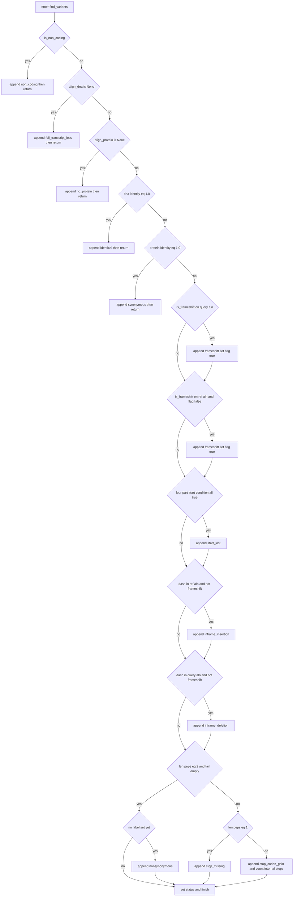
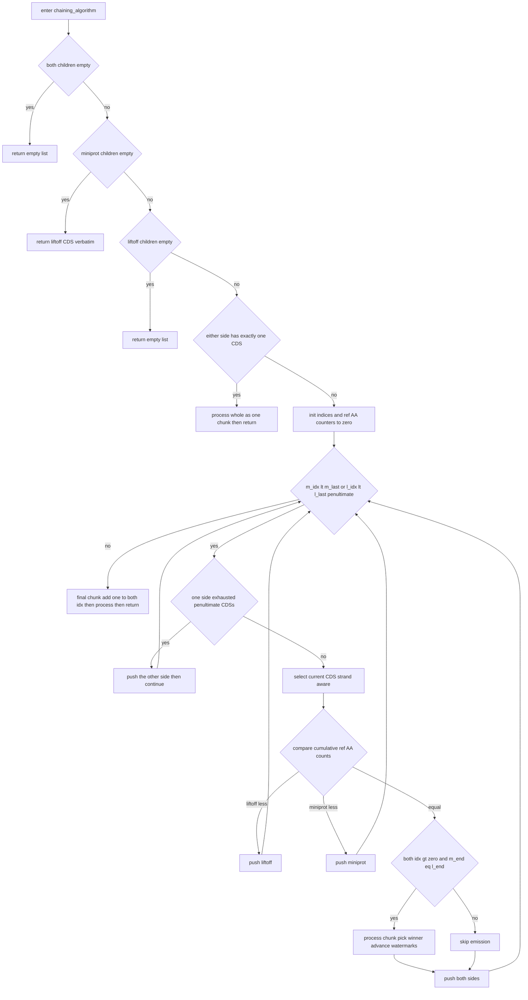
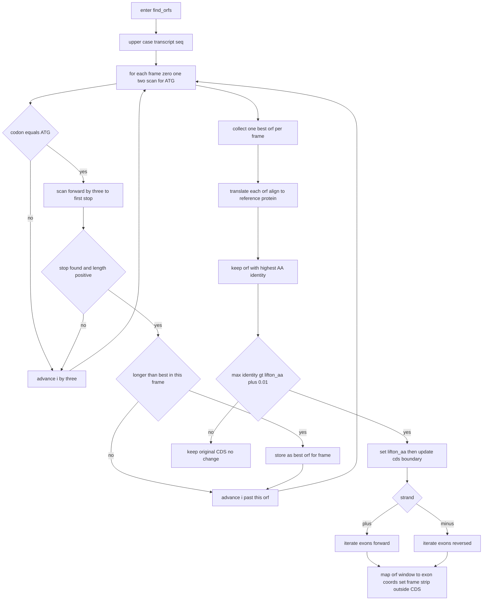

### 3.4 Variant classification (mutation decision tree)

This subsection specifies `lifton/variants.py` in full. The module classifies a lifted transcript into one or more of **nine mutation types** by comparing its DNA-level and protein-level pairwise alignments against the reference, and writes the resulting list into `lifton_status.status`. The classification is consumed downstream both to populate the GFF3 `mutation` attribute and to decide whether ORF rescue runs (§3.6).

#### 3.4.1 Inputs and the nine mutation types

`find_variants(align_dna, align_protein, lifton_status, peps, is_non_coding)` (`variants.py:45`).

| Parameter | Type | Meaning |
|---|---|---|
| `align_dna` | `Lifton_Alignment` or `None` | DNA (transcript-level) pairwise alignment object. Fields used: `.identity` (float in `[0,1]`), `.query_aln` (str, target gapped sequence), `.ref_aln` (str, reference gapped sequence). `None` ⟺ no DNA alignment could be produced. |
| `align_protein` | `Lifton_Alignment` or `None` | Protein pairwise alignment. Fields used: `.identity` (float), `.query_aln`/`.ref_aln` (str, gapped AA), `.query_seq` (str, ungapped target AA). `None` ⟺ no protein alignment. |
| `lifton_status` | `Lifton_Status` | Mutable result holder; `find_variants` sets `lifton_status.status` (a `list[str]`). |
| `peps` | `list[str]` or `None` | The target protein string split on `"*"` (stop codon). Produced by `align_coding_seq` as `protein_seq.split("*")` (`lifton_class.py:602`). |
| `is_non_coding` | `bool` | True if the source gene was classified non-coding. |

The nine types (documented at `variants.py:58-67`), in the order they may be emitted:

| # | Type | Trigger (summary) |
|---|---|---|
| 1 | `identical` | DNA identity exactly 1.0. |
| 2 | `synonymous` | Protein identity exactly 1.0 (but DNA not 1.0). |
| 3 | `frameshift` | A run of `-` not divisible by 3 in the DNA query or ref alignment. |
| 4 | `start_lost` | First-codon/first-AA conditions all fail (4-part boolean). |
| 5 | `inframe_insertion` | `-` present in `align_dna.ref_aln` and not frameshift. |
| 6 | `inframe_deletion` | `-` present in `align_dna.query_aln` and not frameshift. |
| 7 | `nonsynonymous` | Valid protein ending in stop, imperfect, no other label set. |
| 8 | `stop_missing` | Target protein has no terminal stop (`len(peps)==1`). |
| 9 | `stop_codon_gain` | Premature internal stop (`len(peps)>2`, or `==2` with non-empty tail). |

Note: `non_coding`, `full_transcript_loss`, and `no_protein` are additional early-return labels written into the status list, but are not counted among the nine "mutation" types (they are loss/skip sentinels, not coding mutations).

#### 3.4.2 Helper: `has_stop_codon(ref_align, target_align)` (`variants.py:1`)

Returns True iff some aligned column `i` has `target_align[i] == '*'` while `ref_align[i] != '*'` (a stop in the target that is not matched by a stop in the reference). Iterates all columns; returns False if none found. **This helper is defined but not called inside `find_variants`** — it is exported for callers elsewhere; document it as a public predicate.

#### 3.4.3 Helper: `is_frameshift(s)` (`variants.py:18`)

Detects whether string `s` contains a maximal run of `'-'` whose length is **not** divisible by 3. Algorithm:

1. `consecutive_count = 0`.
2. For each `char` in `s`:
   a. If `char == '-'`: `consecutive_count += 1`.
   b. Else (non-gap): if `consecutive_count % 3 != 0` return **True**; then reset `consecutive_count = 0`.
3. After the loop (handles a trailing gap run): if `consecutive_count % 3 != 0` return **True**.
4. Otherwise return **False**.

Gotcha: only the run *immediately before each non-gap character* (and the final trailing run) is tested. A gap run divisible by 3 is treated as inframe; a remainder of 1 or 2 trips the frameshift flag.

#### 3.4.4 `find_variants` ordered decision procedure

`mutation_type = []` is built up; `lifton_status.status` is assigned at one of several return points. Steps in exact source order:

1. **Non-coding short-circuit** (`variants.py:69-72`): `if is_non_coding:` → append `'non_coding'`, set status, **return**.
2. **DNA-alignment-missing** (`73-76`): `if align_dna == None:` → append `'full_transcript_loss'`, set status, **return**.
3. **Protein-alignment-missing** (`77-80`): `if align_protein == None:` → append `'no_protein'`, set status, **return**.
4. **Identical** (`82-85`): `if align_dna.identity == 1.0:` → append `'identical'`, set status, **return**.
5. **Initialise** `frameshift = False` (`87`).
6. **Synonymous** (`88-91`): `if align_protein.identity == 1.0:` → append `'synonymous'`, set status, **return**. (Reached only when DNA identity ≠ 1.0 but protein identity = 1.0, i.e. silent nucleotide changes.)
7. **Frameshift on query** (`93-95`): `if is_frameshift(align_dna.query_aln):` → append `'frameshift'`, set `frameshift = True`.
8. **Frameshift on ref** (`96-98`): `if is_frameshift(align_dna.ref_aln) and frameshift == False:` → append `'frameshift'`, set `frameshift = True`. Gotcha: the `frameshift == False` guard prevents appending `'frameshift'` twice when both query and ref carry indel runs.
9. **Start lost** (`99-103`): append `'start_lost'` iff the **4-part conjunction** is all-true:
   ```python
   align_dna.query_aln[0:3] != align_dna.ref_aln[0:3] and
   align_dna.query_aln[0:3] != 'ATG' and
   align_protein.query_aln[0] != align_protein.ref_aln[0] and
   align_protein.query_aln[0] != "M"
   ```
   Meaning: the target's first DNA codon differs from the reference's first codon AND is not literally `ATG`, AND the target's first aligned AA differs from the reference's first aligned AA AND is not `M`. All four must hold.
10. **Inframe insertion** (`104-105`): `if "-" in align_dna.ref_aln and not frameshift:` → append `'inframe_insertion'`. (Gap in the *reference* alignment ⇒ extra bases inserted in the target; only counts as inframe when no frameshift was flagged.)
11. **Inframe deletion** (`106-107`): `if "-" in align_dna.query_aln and not frameshift:` → append `'inframe_deletion'`. (Gap in the *target* alignment ⇒ deletion.)
12. **Stop-codon trichotomy** (`108-121`) on `peps`:
    - **Case A — valid protein with terminal stop** (`108-112`): `if len(peps) == 2 and str(peps[1]) == "":` (split produced exactly `[body, ""]`, i.e. the protein ends in exactly one `*` and has nothing after it). Then **only if** `len(mutation_type) == 0` (no other label was already appended in steps 7-11), append `'nonsynonymous'`. Gotcha: `nonsynonymous` is suppressed if any frameshift/inframe/start_lost label was already set — those take precedence and `nonsynonymous` is the residual catch-all for "imperfect but otherwise unremarkable".
    - **Case B — no stop at all** (`113-115`): `elif len(peps) == 1:` → append `'stop_missing'` (the translation never hit a `*`).
    - **Case C — premature/extra stop** (`116-121`): `else:` (i.e. `len(peps) >= 2` but not the clean `["body",""]` shape — a premature internal stop, possibly with residual AAs after it) → append `'stop_codon_gain'`, then count internal stops: iterate `align_protein.query_seq`, incrementing `stop_codon_count` for each `'*'` not at the final index. (The count is computed but not stored on `lifton_status`; it is local and discarded — document as dead-but-present.)
13. **Assign** `lifton_status.status = mutation_type` (`122`).

Gotcha (byte-identity / order): steps 7-12 are *not* mutually exclusive; a single transcript can be labelled e.g. `['frameshift','start_lost','stop_codon_gain']`. The list order is fixed by the source ordering above and feeds the GFF3 `mutation` attribute and ORF-search gating verbatim.

#### Diagram D5 — `find_variants` ordered decision tree



---

### 3.5 Protein-maximization chaining (`chaining_algorithm`)

This subsection specifies `lifton/protein_maximization.py` in full. Given two competing CDS-block decompositions of one transcript — one from **Liftoff** (DNA-driven, splice-aware) and one from **miniprot** (protein-driven) — the chaining algorithm walks both block lists in lock-step by *cumulative reference amino-acid count*, finds genomic sync points where the two decompositions agree on a target end coordinate, and for each chunk between sync points keeps whichever aligner has higher partial protein identity. The result is a merged `list[Lifton_CDS]`.

It is invoked at `run_liftoff.py:180` only when Liftoff's protein identity is `< 1` and a valid miniprot alignment exists (`run_liftoff.py:176-180`); the returned `cds_list` is fed to `Lifton_GENE.update_cds_list` (§3.7).

#### 3.5.1 Key data on the alignment objects

Both `l_lifton_aln` and `m_lifton_aln` are `Lifton_Alignment` instances (`lifton_class.py:24`). Fields read by chaining:

| Field | Type | Meaning |
|---|---|---|
| `.cds_children` | `list` of gffutils-shaped CDS entries | The aligner's CDS blocks, in coordinate order (small→large genomic coordinate). |
| `.cdss_protein_aln_boundaries` | `list[(float, float)]` | Per-CDS `(aa_start, aa_end)` positions in the **protein alignment** coordinate space; index `c` corresponds to `cds_children[c]`. |
| `.ref_seq` | str | The gapped/ungapped reference protein used to count ref AAs. |
| `.ref_aln`, `.query_aln` | str | Gapped reference/target protein alignment strings (equal length). |
| `.db_entry.strand` | `'+'` or `'-'` | Transcript strand. |

#### 3.5.2 Helpers

- `get_protein_boundary(cdss_aln_boundary, c_idx_last, c_idx, DEBUG)` (`protein_maximization.py:25`): returns `(aa_start, aa_end)` for the half-open chunk of CDS indices `[c_idx_last, c_idx)` as `aa_start = cdss_aln_boundary[c_idx_last][0]`, `aa_end = cdss_aln_boundary[c_idx - 1][1]`.
- `get_protein_reference_length_single(lifton_aln, c_idx, DEBUG)` (`protein_maximization.py:32`): counts non-gap reference AAs from alignment position 0 up to `math.ceil(cdss_protein_aln_boundaries[c_idx][1])`. Returns `0` when `c_idx >= len(boundaries)` (out-of-range guard). Steps: `aa_end = ceil(boundaries[c_idx][1])`; `ref_count = sum(1 for letter in ref_seq[0:aa_end] if letter != '-')`.
- `push_cds_idx(c_idx, lifton_aln, ref_aa_count, DEBUG)` (`protein_maximization.py:51`): the cumulative-count advance. Sets `ref_aa_count = get_protein_reference_length_single(lifton_aln, c_idx, DEBUG)` **for the current `c_idx`**, then increments `c_idx += 1`, and returns `(c_idx, ref_aa_count)`. Gotcha: the ref-AA count is computed for the index *before* the increment, so `ref_aa_count` always reflects "AAs consumed through the CDS we just stepped off of".

#### 3.5.3 Per-chunk winner selection: `process_m_l_children(...)` (`protein_maximization.py:62`)

For the chunk spanning miniprot indices `[m_c_idx_last, m_c_idx)` and Liftoff indices `[l_c_idx_last, l_c_idx)`:

1. **Empty-chunk guard** (`79-80`): `if m_c_idx_last >= m_c_idx or l_c_idx_last >= l_c_idx: return []`.
2. Compute miniprot AA window `(m_aa_start, m_aa_end)` and Liftoff window `(l_aa_start, l_aa_end)` via `get_protein_boundary`.
3. Compute partial identities (`87-92`) with `get_id_fraction.get_partial_id_fraction(ref_aln, query_aln, floor(aa_start), ceil(aa_end))` for each side. This yields `(matches, length)` pairs.
4. `m_identity = m_matches / m_length if m_length > 0 else 0.0`; same for Liftoff (`95-96`).
5. **Both-zero rule** (`104-108`): `if m_identity == 0.0 and l_identity == 0.0:` append the chain log string `f"empty[{l_aa_start:.2f}-{l_aa_end:.2f}]"` and **return `[]`**. Rationale (V2.5 fix): neither tool contributed reliable CDS bytes; labelling it `liftoff[...]` would falsely attribute provenance.
6. **Winner** (`110-122`):
   - If `m_identity > l_identity`: emit miniprot CDS via `create_lifton_entries(..., miniprot_is_better=True)`; append `f"miniprot[{m_aa_start:.2f}-{m_aa_end:.2f}]"`.
   - **Else (including tie)**: emit Liftoff via `create_lifton_entries(..., False)`; append `f"liftoff[{l_aa_start:.2f}-{l_aa_end:.2f}]"`. Gotcha: ties go to **Liftoff** ("`>=`" semantics) because Liftoff preserves the splicing structure; this is byte-affecting and must not be inverted.
7. Return the emitted CDS list.

`get_partial_id_fraction(reference, target, start, end)` (`get_id_fraction.py:1`): upper-cases both; iterates `reference[start:end]` with index `i`, counting `gaps_in_ref` for `'-'` and `matches` when `letter == target[i+start]`; **breaks early** when `target[i+start] == '*'` (stop). `total_length = (end-start) - gaps_in_ref`; returns `(matches, 1)` if `total_length == 0`, else `(matches, total_length)`. Gotcha: identity uses a *gap-compressed reference* denominator (gaps in the reference are excluded), and the stop-codon `break` means columns after the first target stop do not contribute.

#### 3.5.4 CDS emission: `create_lifton_entries(...)` (`protein_maximization.py:127`)

1. Choose `source_aln` and `idx_range`: if `miniprot_is_better` use `m_lifton_aln` and `range(m_c_idx_last, m_c_idx)`; else `l_lifton_aln` and `range(l_c_idx_last, l_c_idx)`.
2. If `idx_range` is empty → `return []` (`150-151`).
3. `n = len(source_aln.cds_children)`. `parent_attrs = l_lifton_aln.cds_children[0].attributes if l_lifton_aln.cds_children else {}`. Gotcha: **Parent attributes are always inherited from Liftoff's first CDS** (`cds_children[0]`), regardless of which aligner won the chunk — this keeps the GFF3 `Parent=` linkage stable.
4. For each `c_idx` in `idx_range`:
   - **Strand index fix** (`157-160`): `c_idx_fix = c_idx` on `'+'`; on `'-'`, `c_idx_fix = n - c_idx - 1` (reverse, since miniprot/Liftoff index in 5'→3' order while `cds_children` is in coordinate order).
   - Bounds-check `if c_idx_fix < 0 or c_idx_fix >= n: continue` (`162-163`).
   - `lifton_cds = source_aln.cds_children[c_idx_fix]`; set `lifton_cds.attributes = parent_attrs`; append `lifton_class.Lifton_CDS(lifton_cds)`.
5. Return `cds_list`.

#### 3.5.5 Main loop: `chaining_algorithm(l_lifton_aln, m_lifton_aln, fai, DEBUG)` (`protein_maximization.py:176`)

`l_children = l_lifton_aln.cds_children`; `m_children = m_lifton_aln.cds_children`; `chains = []`.

**Guards** (`200-217`):
1. `if not l_children and not m_children:` → `return [], chains`.
2. `if not m_children:` → `return [Lifton_CDS(c) for c in l_children], chains` (miniprot empty ⇒ use Liftoff verbatim).
3. `if not l_children:` → `return [], chains`.
4. **Single-CDS** (`211-217`): `if len(l_children) == 1 or len(m_children) == 1:` treat the whole alignment as one chunk: `cds_list = process_m_l_children(len(m_children), 0, m_lifton_aln, len(l_children), 0, l_lifton_aln, fai, chains, DEBUG)`; `return cds_list, chains`.

**General case** (`219-281`): initialise `m_c_idx = l_c_idx = m_c_idx_last = l_c_idx_last = 0`, `cds_list = []`, `ref_aa_liftoff_count = ref_aa_miniprot_count = 0`.

Walk while `m_c_idx < len(m_children) - 1 OR l_c_idx < len(l_children) - 1` (`229`). Each iteration:

1. **One side exhausted** (`231-238`):
   - If miniprot at/past its penultimate and Liftoff not: `push_cds_idx` Liftoff; `continue`.
   - If Liftoff at/past its penultimate and miniprot not: `push_cds_idx` miniprot; `continue`.
2. **Strand-aware current CDS selection** (`241-246`): on `'+'`, `m_c = m_children[m_c_idx]`, `l_c = l_children[l_c_idx]`. On `'-'`, walk from the 3'-most CDS: `m_c = m_children[len(m_children) - m_c_idx - 1]`, `l_c = l_children[len(l_children) - l_c_idx - 1]`.
3. **Synchronise by cumulative ref-AA count** (`248-268`):
   - If `ref_aa_liftoff_count < ref_aa_miniprot_count`: `push_cds_idx` Liftoff (advance the side that has consumed fewer ref AAs).
   - Elif `ref_aa_liftoff_count > ref_aa_miniprot_count`: `push_cds_idx` miniprot.
   - Else (**equal cumulative ref AAs**):
     - **Sync-point test** (`257`): `if m_c_idx > 0 and l_c_idx > 0 and m_c.end == l_c.end:` — both indices past the first block AND the two current CDSs share the same target end coordinate. If true: `cdss = process_m_l_children(m_c_idx, m_c_idx_last, m_lifton_aln, l_c_idx, l_c_idx_last, l_lifton_aln, fai, chains, DEBUG)`; `cds_list += cdss`; advance both watermarks `m_c_idx_last = m_c_idx`, `l_c_idx_last = l_c_idx`.
     - Then **always** `push_cds_idx` Liftoff and `push_cds_idx` miniprot (advance both).

After the loop, **final-chunk handling** (`270-279`): `l_c_idx += 1`; `m_c_idx += 1` (to include the last CDS of each side in the final chunk); then `cdss = process_m_l_children(m_c_idx, m_c_idx_last, ..., l_c_idx, l_c_idx_last, ...)`; `cds_list += cdss`. Return `(cds_list, chains)`.

Gotchas:
- The `+1` after the loop is the deliberate fix for an off-by-one that previously double-processed the last CDS pair (`protein_maximization.py:10-11`). Do not remove it.
- `push_cds_idx` recomputes the cumulative count *before* incrementing, so monotone progress of the two counters drives the synchronisation; equal counts plus equal `.end` is the only place a chunk is emitted mid-walk.
- Sync points require `m_c_idx > 0 and l_c_idx > 0`: the very first block boundary is never a sync point (it would emit a zero-length chunk).

#### Diagram D4 — `chaining_algorithm` control flow



---

### 3.6 ORF rescue

ORF rescue attempts to recover a coding frame when the chained/lifted CDS produced a damaged protein. It lives entirely in `Lifton_TRANS`: `orf_search_protein` (gate), `__find_orfs` (search), `__update_cds_boundary` / `__iterate_exons_update_cds` (apply), `__get_cds_frame` (frame).

#### 3.6.1 Gate: `orf_search_protein(self, fai, ref_protein_seq, ref_trans_seq, lifton_status, is_non_coding, eval_only=False)` (`lifton_class.py:618`)

1. `coding_seq, trans_seq = self.get_coding_trans_seq(fai)` — re-chains exon/CDS sequences (during which CDS frames are recomputed; §3.8) and returns the spliced coding sequence and full spliced transcript sequence.
2. `protein_seq = self.translate_coding_seq(coding_seq)` — Biopython `Seq(...).translate()`; `None`/`""` when coding empty.
3. `lifton_aa_aln, peps = self.align_coding_seq(protein_seq, ref_protein_seq, lifton_status)` — parasail protein alignment; updates `lifton_status.lifton_aa = max(lifton_status.lifton_aa, lifton_aa_aln.identity)` (`lifton_class.py:605`); `peps = protein_seq.split("*")`.
4. `lifton_tran_aln = self.align_trans_seq(trans_seq, ref_trans_seq, lifton_status)` — DNA alignment; sets `lifton_status.lifton_dna`.
5. `variants.find_variants(lifton_tran_aln, lifton_aa_aln, lifton_status, peps, is_non_coding)` (§3.4).
6. **Build mutation attributes & gate** (`625-640`): `ORF_search = False`; for each `mutation` in `lifton_status.status`:
   - If `mutation != "identical"`: append it into `self.entry.attributes["mutation"]` (creating the list on first occurrence).
   - If `mutation in {"stop_missing", "stop_codon_gain", "frameshift", "start_lost"}`: set `ORF_search = True`.
7. **Run search** (`641-642`): `if ORF_search and eval_only == False: self.__find_orfs(trans_seq, ref_protein_seq, lifton_aa_aln, lifton_status)`.
8. Return `(lifton_tran_aln, lifton_aa_aln)`.

Gotcha: ORF rescue fires **only** for the four mutation types `stop_missing`, `stop_codon_gain`, `frameshift`, `start_lost`. `inframe_insertion`, `inframe_deletion`, `nonsynonymous`, `synonymous`, `identical` never trigger a search. `eval_only=True` (evaluation runs) suppresses the boundary edit but still classifies.

#### 3.6.2 Search: `__find_orfs(self, trans_seq, ref_protein_seq, lifton_aln, lifton_status)` (`lifton_class.py:645`)

Constants: `start_codon = "ATG"`; `stop_codons = {"TAA","TAG","TGA"}`; `threshold_orf = 0.01`.

1. `trans_seq = trans_seq.upper()`. Initialise `best_orf_per_frame = [None, None, None]` and `max_orf_len = [0, 0, 0]` (index = frame ∈ {0,1,2}).
2. **Three-frame scan** (`667-693`): for `frame in range(3)`, set `i = frame`; while `i < len(trans_seq)`:
   a. `codon = trans_seq[i:i+3]`.
   b. If `codon == "ATG"`: scan forward in steps of 3 from `j = i` to the first stop codon: accumulate `orf_seq`; when `cod in stop_codons`, set `orf_idx_e = j + 3`, `found_stop = True`, break.
   c. If `found_stop and orf_idx_s < orf_idx_e`: `curr_orf_len = orf_idx_e - orf_idx_s`; if `curr_orf_len > max_orf_len[frame]`, record this ORF as `best_orf_per_frame[frame] = Lifton_ORF(orf_idx_s, orf_idx_e)` and update `max_orf_len[frame]`. Then **advance** `i = orf_idx_e` and `continue` (skip past the found ORF, avoiding nested duplicates).
   d. Otherwise `i += 3`.
3. `orf_list = [orf for orf in best_orf_per_frame if orf is not None]` — at most **one ORF per frame** (the longest).
4. **Pick best by protein identity vs reference** (`697-710`): `max_identity = 0.0`, `final_orf = None`. For each `orf`:
   - `orf_DNA_seq = trans_seq[orf.start:orf.end]`; `orf_protein_seq = str(Seq(orf_DNA_seq).translate())`.
   - `orf_parasail_res = align.parasail_align_protein_base(orf_protein_seq, ref_protein_seq)`.
   - `orf_matches, orf_length = get_id_fraction.get_AA_id_fraction(orf_parasail_res.traceback.ref, orf_parasail_res.traceback.query)`.
   - `orf_identity = orf_matches / orf_length if orf_length > 0 else 0.0`.
   - If `orf_identity > max_identity`: update `max_identity` and `final_orf`.
5. **Apply iff improvement exceeds threshold** (`712-716`): `if final_orf is not None and max_identity > (lifton_status.lifton_aa + threshold_orf):` set `lifton_status.lifton_aa = max_identity` and call `self.__update_cds_boundary(final_orf)`. Gotcha: the new ORF must beat the existing protein identity by **strictly more than 0.01** (1 %); otherwise the original CDS is kept and no boundary edit happens. `get_AA_id_fraction` (`get_id_fraction.py:23`) uses a gap-compressed-reference denominator `max(len(ref),len(query)) - gaps_in_ref`, clamped to `(matches,1)` when ≤ 0, and breaks at the first target `'*'`.

`Lifton_ORF` (`lifton_class.py:6`) holds `start` and `end` as **0-based offsets into the spliced transcript string** (`trans_seq`), half-open (`end` is the index past the last stop nucleotide). These are *not* genomic coordinates.

#### 3.6.3 Apply: `__update_cds_boundary(self, final_orf)` (`lifton_class.py:718`)

Dispatches by strand:
- `'+'`: `self.__iterate_exons_update_cds(final_orf, self.exons, "+")`.
- `'-'`: `self.__iterate_exons_update_cds(final_orf, self.exons[::-1], "-")` — exons reversed so iteration is 5'→3'.

#### 3.6.4 `__iterate_exons_update_cds(self, final_orf, exons, strand)` (`lifton_class.py:724`)

Maps the transcript-space ORF window `[final_orf.start, final_orf.end)` back onto exon genomic coordinates, exon by exon, recomputing CDS frames. Maintains `accum_exon_length` (transcript offset at the start of the current exon) and `accum_cds_length` (cumulative coding length so far). For each `exon` with `curr_exon_len = exon.entry.end - exon.entry.start + 1`:

**Branch A — ORF starts in or before this exon's span** (`729`): `if accum_exon_length <= final_orf.start:`
- **A1 — ORF starts inside this exon** (`730`): `if final_orf.start < accum_exon_length + curr_exon_len:`
  - `is_single_exon_orf = (final_orf.end <= accum_exon_length + curr_exon_len)` — true iff the ORF also ends within this exon.
  - Compute CDS genomic bounds (`735-756`):
    - **Existing CDS, `'+'`:** `cds.start = exon.start + (final_orf.start - accum_exon_length)`; `cds.end = (exon.start + (final_orf.end - accum_exon_length) - 1)` if single-exon else `exon.end`.
    - **Existing CDS, `'-'`:** `cds.end = exon.end - (final_orf.start - accum_exon_length)`; `cds.start = (exon.end - (final_orf.end - accum_exon_length) + 1)` if single-exon else `exon.start`.
    - **No existing CDS:** mirror arithmetic, then `exon.add_novel_lifton_cds(exon.entry, st, en)` (creates a new `Lifton_CDS` copy of the exon with `featuretype='CDS'`, inheriting only `Parent`; `lifton_class.py:844`).
  - Set frame `exon.cds.entry.frame = str(self.__get_cds_frame(accum_cds_length))`; advance `accum_cds_length += cds.end - cds.start + 1`.
- **A2 — ORF has not started yet** (`760-762`): `else:` set `exon.cds = None` (strip any CDS from this 5' UTR exon).

**Branch B — ORF spans across into this exon** (`763`): `elif final_orf.start < accum_exon_length and accum_exon_length < final_orf.end:`
- **B1 — ORF ends in this exon** (`764`): `if final_orf.end <= accum_exon_length + curr_exon_len:`
  - `'+'`: `cds.start = exon.start`; `cds.end = exon.start + (final_orf.end - accum_exon_length) - 1`.
  - `'-'`: `cds.end = exon.end`; `cds.start = exon.end - (final_orf.end - accum_exon_length) + 1`.
  - (no existing CDS ⇒ `add_novel_lifton_cds` with the same bounds.)
- **B2 — ORF continues past this exon** (`778-783`): `else:` keep/extend a full-exon CDS: if `exon.cds is None`, `add_novel_lifton_cds(exon.entry, exon.start, exon.end)`; else `exon.cds.update_CDS_info(exon.start, exon.end)`.
- Set frame and advance `accum_cds_length` (`784-785`) exactly as in A1.

**Branch C — ORF already ended** (`786-788`): `elif final_orf.end <= accum_exon_length:` set `exon.cds = None` (strip CDS from 3' UTR exons).

After every branch: `accum_exon_length += curr_exon_len` (`789`).

Gotchas:
- All coordinate arithmetic is **1-based inclusive** on the genomic side (hence the `-1`/`+1` corrections converting the 0-based half-open transcript ORF offsets). For `'+'`, distances grow from `exon.start`; for `'-'`, distances grow downward from `exon.end`.
- Exons outside the ORF have `exon.cds` explicitly set to `None`; the writer then emits no CDS line for them (`lifton_class.py:812-814`).
- Frame is recomputed per emitted CDS from `accum_cds_length` *before* it is advanced.

#### Diagram D6 — ORF rescue (`__find_orfs` then `__update_cds_boundary`)



---

### 3.7 The 5-case `update_cds_list` CDS↔exon reconciliation

`Lifton_TRANS.update_cds_list(self, cds_list)` (`lifton_class.py:315`) rebuilds `self.exons` so that each exon carries the correct (possibly new) CDS block from the chained `cds_list`, synthesising exon boundaries where the merged CDS extends beyond existing exons. It is reached via `Lifton_GENE.update_cds_list(trans_id, cds_list)` (`lifton_class.py:175`), which then calls `update_boundaries()`.

**Entry**: `idx_exon_itr = 0`; `new_exons = []`. **Strand reverse** (`318-320`): `if self.entry.strand == "-": cds_list.reverse()` — so CDSs are processed in small→large genomic order, matching `self.exons`. Gotcha: this mutates the caller's `cds_list` in place.

**Mechanics used throughout**: `copy.deepcopy(exon)` clones an exon before mutation; `update_exon_info(start, end)` (`lifton_class.py:834`) sets `cds = None`, source `"LiftOn"`, and new coordinates; `add_lifton_cds(Lifton_cds)` (`lifton_class.py:855`) attaches a CDS and overwrites its attributes to `{'Parent': exon.attributes['Parent']}`; `segments_overlap_length((s1,e1),(s2,e2))` (`lifton_utils.py:539`) returns `(ovp_len, ovp)` where `ovp_len = max(0, min(e1,e2)-max(s1,s2)+1)` and `ovp = ovp_len > 0`.

**Empty-CDS guard** (`322-328`): `if not cds_list:` set every `exon.cds = None` (keep exon structure, drop coding) and return.

#### Case 1 — single CDS (`332-382`): `if len(cds_list) == 1:`

`only_cds = cds_list[0]`; `processed_ovp_exons = False`; `ovp_exons = []`; `last_exon = None`. Iterate exons (`while idx_exon_itr < len(self.exons)`):
1. Track `last_exon = exon`; compute overlap of `(exon.start, exon.end)` vs `(only_cds.start, only_cds.end)`.
2. **Exon entirely left of CDS** (`345-346`): `if exon.entry.end < only_cds.entry.start:` append `exon` unchanged (a 5' UTR exon).
3. **Overlap** (`347-349`): `elif ovp:` deep-copy the exon into `ovp_exons` (accumulate the run of CDS-overlapping exons).
4. **Exon entirely right of CDS** (`351-364`): `elif exon.entry.start > only_cds.entry.end:` set `processed_ovp_exons = True`; build a `merged_exon` (deep copy of this exon) whose span is: if `ovp_exons` empty, the CDS span itself (`only_cds.start..only_cds.end`); else the union `ovp_exons[0].start .. ovp_exons[-1].end`. Attach `only_cds` via `add_lifton_cds`; append `merged_exon` then the current `exon`. Gotcha: only the **first** trailing exon triggers the merge (subsequent ones do nothing because `processed_ovp_exons` is set but the loop keeps going and trailing exons fall through with no matching branch — they are silently dropped unless caught here).
5. `idx_exon_itr += 1`.

**Tail handling** (`366-382`): `if not processed_ovp_exons:` (CDS extends to/past the last exon): if `last_exon is None` (no exons) do nothing; else build `merged_exon` from `last_exon` with span = CDS span (when no overlaps) or `ovp_exons[0].start .. ovp_exons[-1].end`, attach `only_cds`, append.

#### Case 2 — single exon, many CDS (`386-403`): `elif len(self.exons) == 1:`

`first_exon = self.exons[0]`. For each `cds_idx`, deep-copy `first_exon` into a new `exon` and set its span around `cds = cds_list[cds_idx]`:
- `cds_idx == 0` (first): `if exon.start >= cds.start: exon.start = cds.start`; `exon.end = cds.end`.
- `cds_idx == len-1` (last): `if exon.end <= cds.end: exon.end = cds.end`; `exon.start = cds.start`.
- middle: `exon.start = cds.start`; `exon.end = cds.end`.
Then `exon.add_lifton_cds(cds)`; append. (Splits the single exon into one exon per CDS, widening the outer exons to retain UTR overhang on the first/last.)

#### Case 3 — many CDS, many exons (`407-540`): `elif len(cds_list) > 1 and len(self.exons) > 1:`

Init `cds_idx = 0`, `exon_idx = 0`, `cds = cds_list[0]`, `exon = self.exons[0]`.

**Step 1 — head-order detection + emit leading features** (`412-482`): `init_head_order = (exon.entry.start < cds.entry.start)` (`420-421`): True ⇒ "exons lead" (5' UTR exons precede the first CDS); False ⇒ "CDSs lead/start together".
- **Exons lead** (`424-456`): walk while both indices in range: if `exon_end < cds_start`, emit the exon as a UTR exon (`update_exon_info(exon_start, exon_end)`) and `exon_idx += 1`; **elif overlap**, emit a combined exon spanning `min(exon_start, cds_start)..cds_end` with `cds_list[0]` attached, advance both indices, **break**; **elif `exon_start > cds_end`**, emit `cds_list[0]` as a synthetic exon spanning the CDS, `cds_idx += 1`, **break**.
- **CDSs lead** (`457-482`): walk while `cds_idx < len(cds_list)-1`: if overlap with `exon`, emit synthetic exon over the CDS, `cds_idx += 1`, **break**; elif `cds_end < exon_start`, emit synthetic exon over the CDS and `cds_idx += 1` (continue); else **break**.

**Step 2 — inner CDS blocks** (`486-492`): while `cds_idx < len(cds_list) - 1`: emit one synthetic exon per CDS (`update_exon_info(cds.start, cds.end)` + `add_lifton_cds(cds)`), `cds_idx += 1`. (Each interior CDS becomes its own exon with span = CDS span.)

**Step 3 — last CDS, merged with overlapping exon** (`496-523`): `last_cds_processed = False`; `cds = cds_list[cds_idx]`. Walk `exon_idx` forward: skip exons with `exon_end < cds_start` (`exon_idx += 1; continue`); **on overlap**, set `last_cds_processed = True`, emit exon spanning `cds_start .. max(cds_end, exon_end)` with the CDS attached, `exon_idx += 1`, break; **elif `exon_start > cds_end`**, set processed, emit synthetic exon over the CDS, break.

**Step 4 — trailing 3' UTR exons** (`527-532`): while `exon_idx < len(self.exons)`: emit each remaining exon as-is (`update_exon_info` to its own bounds, no CDS), `exon_idx += 1`.

**Step 5 — synthetic-exon fallback** (`536-540`): `if not last_cds_processed:` the last CDS overlapped nothing — emit a synthetic exon (deep copy of `self.exons[-1]`) spanning the CDS with the CDS attached.

**Finalise** (`541-543`): `self.exons = new_exons`; `if self.exons: self.update_boundaries()` (resets transcript `start`/`end` to first/last exon bounds, `lifton_class.py:816`).

Gotchas: `update_exon_info` always nulls the CDS first, so a CDS must be re-attached via `add_lifton_cds`/`add_novel_lifton_cds` afterward. The `min`/`max` span widening at overlaps (Step 1 overlap, Step 3 overlap) is what produces correct UTR overhang and is byte-affecting. Cases 1/2/3 are mutually exclusive by the `len()` guards; an empty `cds_list` is caught earlier.

---

### 3.8 CDS frame computation

`Lifton_TRANS.__get_cds_frame(self, accum_cds_length)` (`lifton_class.py:791`):

```python
return (3 - accum_cds_length % 3) % 3
```

This is the GFF3 `phase` (number of bases to skip into the CDS to reach the first complete codon), computed from `accum_cds_length` = the total coding length of all CDS blocks emitted *before* the current one (5'→3'). The mapping: `accum_cds_length % 3 == 0 → 0`, `== 1 → 2`, `== 2 → 1`.

`accum_cds_length` is advanced in exactly two places, both immediately *after* the frame is assigned to the current CDS:
1. `get_coding_trans_seq` (`lifton_class.py:577-578`): on the normal sequence-assembly path, for each exon with a CDS, set `exon.cds.entry.frame = str(self.__get_cds_frame(accum_cds_length))` then `accum_cds_length += (cds.end - cds.start + 1)`. Note this path iterates exons **5'→3'** — for `'-'` strand it walks `self.exons[::-1]` (`lifton_class.py:568-569`).
2. `__iterate_exons_update_cds` (`lifton_class.py:758-759, 784-785`): during ORF-rescue CDS rewriting, same pattern per emitted CDS.

Gotcha: because the frame depends on accumulated coding length, it is order-dependent; the 5'→3' iteration order (reversed exon list on `'-'`) is load-bearing. Lengths use **1-based inclusive** arithmetic `end - start + 1`.

---

### 3.9 Coordinate-lifting mechanics & edge cases

#### 3.9.1 Coordinate conventions

All genomic coordinates in LiftOn are **1-based, fully closed (inclusive)** intervals, matching GFF3. Feature length is uniformly `end - start + 1` (e.g. `lifton_class.py:556, 559, 578, 728`). Conversions to the 0-based half-open spliced-transcript space happen only inside ORF rescue: `Lifton_ORF.start`/`.end` are 0-based offsets into `trans_seq`, with `.end` one-past-the-last-stop-nucleotide; the `±1` corrections in `__iterate_exons_update_cds` (§3.6.4) translate between the two systems.

#### 3.9.2 Interval-tree construction edge case — `intervals._make_interval`

`_make_interval(start, end, locus_id)` (`intervals.py:4`): builds an `Interval(start, end, locus_id)` for the `intervaltree` library. Because that library forbids zero-length intervals but NCBI GFF3 permits single-base features (`start == end`), the function widens the half-open end:

```python
if end <= start:
    end = start + 1
return Interval(start, end, locus_id)
```

`initialize_interval_tree` (`intervals.py:14`) groups intervals by `seqid` into one `IntervalTree` per chromosome, keyed in `tree_dict`. Gotcha: the widening is only in the tree's half-open space and does not alter the feature's stored 1-based-inclusive coordinates; it exists purely so the tree builds without crashing on `start == end`.

#### 3.9.3 Overlap / off-by-one boundary merges

`segments_overlap_length` (`lifton_utils.py:539`) computes `ovp_len = min(e1,e2) - max(s1,s2) + 1` (the `+1` makes it inclusive), clamps negatives to 0, and returns `(ovp_len, ovp_len > 0)`. Two features that merely abut (e.g. exon ends at 200, CDS starts at 201) have `ovp_len = 200 - 201 + 1 = 0` ⇒ **no overlap**; one whose ends touch (both 200) has `ovp_len = 1` ⇒ overlap. This exact boundary semantics governs every branch in `update_cds_list` Case 1 and Case 3 and the `exon_end < cds_start` / `exon_start > cds_end` disjoint tests. Gotcha: the function is symmetric by construction (computed from sorted endpoints), a deliberate Phase-5 fix so input order cannot leak into the result.

#### 3.9.4 Partial / missing-feature handling

| Situation | Handling |
|---|---|
| miniprot produced no usable CDS (`m_children` empty) | `chaining_algorithm` returns Liftoff's CDS verbatim (`protein_maximization.py:202-204`). |
| Liftoff produced no CDS | returns `[]` (`205`). |
| Either side has exactly one CDS | single-chunk comparison, no sync loop (`211-217`). |
| A chunk where both aligners score 0 identity | labelled `empty[...]`, contributes no CDS (`104-108`). |
| Zero-length protein window (`length == 0`) | identity forced to `0.0`; Liftoff wins by tie rule (`95-96`, `116-122`). |
| Reference transcript absent from `ref_db` | `process_liftoff` returns `None` for that locus (`run_liftoff.py:251-254`). |
| Reference protein/trans absent from dicts | `align_coding_seq`/`align_trans_seq` set the alignment to `None` ⇒ `find_variants` emits `full_transcript_loss` / `no_protein` (`lifton_class.py:594-616`, `variants.py:73-80`). |
| Empty exon list after `update_cds_list` | `update_boundaries()` skipped via `if self.exons:` guard (`lifton_class.py:542`). |

#### 3.9.5 Frameshift vs translocation / inframe distinction

A **frameshift** is a length-changing indel whose run length is not a multiple of 3 (`is_frameshift`, §3.4.3); it suppresses the `inframe_insertion`/`inframe_deletion` labels (their `not frameshift` guards). An **inframe** indel is a multiple-of-3 gap run. There is no explicit "translocation" mutation label; gross relocations surface either as `full_transcript_loss` (no DNA alignment at all) or as a Liftoff-side mapping that simply produces a different `Annotation` provenance. The mutation vocabulary is strictly the nine types of §3.4 plus the three loss/skip sentinels.

#### 3.9.6 Successful-vs-failed lift decision table

`lifton_status.annotation` (set in `run_liftoff.py` / `run_miniprot.py`) records *which engine* produced the final annotation; `lifton_status.status` (the mutation list) records *how damaged* it is. The two together define lift outcome:

| Condition (in `process_liftoff_with_protein`, `run_liftoff.py:171-183`) | `annotation` value | Outcome |
|---|---|---|
| `liftoff_aln is None` (no reference protein available) | `"no_ref_protein"` | Lift falls back to Liftoff DNA-only mapping; no protein maximization. |
| `liftoff_aln.identity == 1` | `"Liftoff"` (default set at `run_liftoff.py:246`) | Perfect protein lift; `lifton_aa = 1`; chaining skipped. |
| `liftoff_aln.identity < 1` and `has_valid_miniprot` | `"LiftOn_chaining_algorithm"` | Run `chaining_algorithm` (§3.5), write chains, rebuild CDS via `update_cds_list`. |
| `liftoff_aln.identity < 1` and **not** `has_valid_miniprot` | stays `"Liftoff"` | Keep Liftoff CDS as-is; ORF rescue (§3.6) may still patch boundaries. |
| miniprot-only transcript (Step 8 of pipeline) | `"miniprot"` (`run_miniprot.py:281`) | Annotation sourced solely from miniprot. |

Cross-referenced with the mutation vocabulary: a lift is considered **successful** when `status` ⊆ `{identical, synonymous}` (no coding damage); **rescuable** when `status` contains `stop_missing`/`stop_codon_gain`/`frameshift`/`start_lost` (ORF search fires and may restore identity above `lifton_aa + 0.01`); and **degraded but emitted** for `inframe_insertion`/`inframe_deletion`/`nonsynonymous`. `full_transcript_loss`/`no_protein`/`non_coding` are the **failed/skip** sentinels. Every emitted transcript still writes a GFF3 record; "failure" here means the coding annotation is flagged via the `mutation` attribute rather than the row being dropped.
