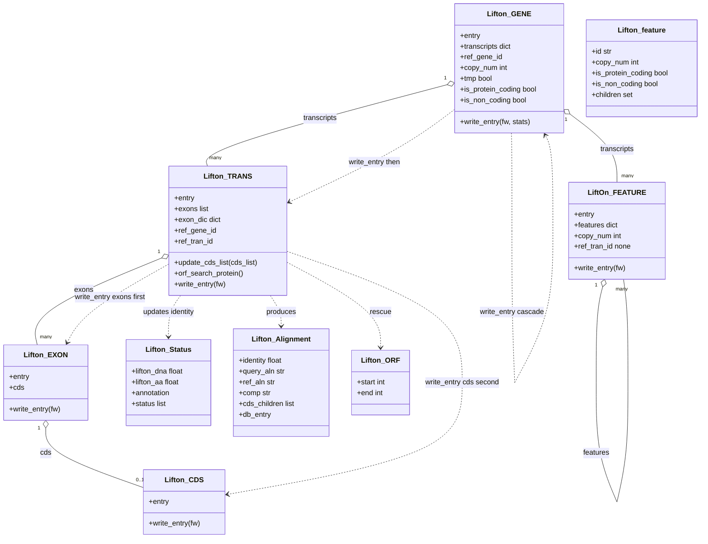

## 4. Data Structures & State Management

This section is the reimplementation-grade reference for every in-memory object LiftOn constructs and mutates. It is split into four parts: §4.1 the **object model** (the `Lifton_*` / `LiftOn_FEATURE` class hierarchy that represents a single gene locus and serialises it to GFF3), §4.2 the **pipeline state objects** (the dataclasses that carry per-locus work between the parent thread and worker threads in Step 7), §4.3 the **reference dictionaries** (the shared, read-only lookup tables built once and consulted on the worker hot path), and §4.4 the **state lifecycle** across the eleven pipeline steps (which object is born in which step, and the exact point at which each becomes read-only for parallel workers).

Throughout, `entry` always denotes a `gffutils.Feature`-shaped object (or the `gffbase` equivalent). All such objects expose the mutable attributes `seqid`, `source`, `featuretype`, `start` (int, 1-based inclusive), `end` (int, 1-based inclusive), `score`, `strand` (`"+"`, `"-"`, or `"."`), `frame` (a.k.a. phase: `"0"`/`"1"`/`"2"`/`"."`), `id` (str), and `attributes` (a dict `str -> list[str]`). All coordinates are 1-based, fully closed intervals, matching GFF3 columns 4 and 5.

Source files for this section:
- `lifton/lifton_class.py` — the object model (lines 1-897).
- `lifton/locus_pipeline.py` — pipeline state objects (`StepContext`, `LocusResult`, `MaterialisedLocus`, `_FeaturePreFetch`, `_MiniprotPreFetch`).
- `lifton/parallel.py` — `_OrderedWriter` buffer state.
- `lifton/io/gff3_writer.py:131` `format_feature` — the serialiser every `write_entry` delegates to.
- `lifton/lifton_utils.py:334` `get_ref_liffover_features` and `:431` `miniprot_id_mapping` — the builders of the reference dictionaries.

---

### 4.1 Object model

The locus object model is a four-level containment tree rooted at `Lifton_GENE`, plus a parallel "feature" path (`LiftOn_FEATURE`) for non-`exon`/`CDS` children, plus several flat record classes (`Lifton_Status`, `Lifton_Alignment`, `Lifton_ORF`, `Lifton_feature`). The containment relationship is:

```
Lifton_GENE  (lifton_class.py:57)
  ├─ .transcripts : dict[str, Lifton_TRANS | LiftOn_FEATURE]
  │     Lifton_TRANS  (lifton_class.py:267)
  │        └─ .exons : list[Lifton_EXON]   (sorted by start)
  │              Lifton_EXON  (lifton_class.py:826)
  │                 └─ .cds : Lifton_CDS | None   (≤ 1 CDS per exon)
  │                       Lifton_CDS  (lifton_class.py:876)
  │     LiftOn_FEATURE  (lifton_class.py:220)   (non-coding / generic children)
  │        └─ .features : dict[str, LiftOn_FEATURE]   (recursive)
```

Containment is enforced structurally: a `Lifton_EXON` holds **at most one** `Lifton_CDS` (the `cds` field is either a single object or `None`; `add_cds`/`add_lifton_cds`/`add_novel_lifton_cds` overwrite it, they never append). A transcript's exons live in a sorted list (`exons`) plus a parallel dict (`exon_dic`, currently allocated but not populated on the default path).

#### 4.1.1 `Lifton_ORF` (lifton_class.py:6-9)

A two-field record describing a candidate open reading frame as **0-based offsets into the spliced transcript sequence** (not genomic coordinates). Produced by `Lifton_TRANS.__find_orfs` (lifton_class.py:688), consumed by `__update_cds_boundary` / `__iterate_exons_update_cds`.

| Field | Type | Meaning |
|---|---|---|
| `start` | int | 0-based index into the spliced `trans_seq` where the ORF's `ATG` begins. |
| `end` | int | 0-based index **one past** the last base of the stop codon (i.e. `orf_idx_e = j + 3`). The ORF spans `trans_seq[start:end]`; its length is `end - start`. |

#### 4.1.2 `Lifton_Status` (lifton_class.py:12-21)

A mutable accumulator threaded through alignment + variant detection for **one transcript**. Holds identity scores and the list of detected mutations. Constructed fresh per transcript (no constructor args).

| Field | Type | Initial | Meaning |
|---|---|---|---|
| `liftoff` | float | `0` | Liftoff (DNA-only) identity, if computed by the comparison path. |
| `miniprot` | float | `0` | miniprot (protein) identity, if computed. |
| `lifton_dna` | float | `0` | Final LiftOn DNA (transcript) identity. Set in `align_trans_seq` (line 615) to the parasail alignment identity. |
| `lifton_aa` | float | `0` | Final LiftOn protein (amino-acid) identity. Updated to `max(self.lifton_aa, aln.identity)` in `align_coding_seq` (line 605) and again raised by ORF rescue (line 715) if a better ORF is found. |
| `eval_dna` | float | `0` | DNA identity recorded in evaluation-only mode. |
| `eval_aa` | float | `0` | Protein identity recorded in evaluation-only mode. |
| `annotation` | str / None | `None` | The chosen status label written to the output GFF3 `status` attribute (e.g. `"identical"`, `"inframe_insertion"`, …). Set by the variant/annotation logic, not by this class. |
| `status` | list[str] | `[]` | Every detected mutation type for this transcript (appended by `variants.find_variants`). Membership drives ORF rescue: rescue is triggered if any element is `"stop_missing"`, `"stop_codon_gain"`, `"frameshift"`, or `"start_lost"` (line 639). Non-`"identical"` elements are also copied into the transcript's `mutation` attribute (lines 631-635). |

Gotcha: `lifton_dna` is **assigned** (`=`, line 615) not maxed, whereas `lifton_aa` is **maxed** (line 605) and may be overwritten by ORF rescue. The two follow different update disciplines.

#### 4.1.3 `Lifton_Alignment` (lifton_class.py:24-45)

The full result of one protein/DNA alignment. The constructor takes **exactly 10 positional arguments** (line 25) and stores them under **renamed** attribute names — the constructor parameter name and the stored field name differ, which is a frequent source of confusion. The mapping (constructor arg → stored field):

| # | Constructor parameter | Stored field | Type | Meaning |
|---|---|---|---|---|
| 1 | `extracted_identity` | `identity` | float | Fraction of matched residues over alignment length (0.0–1.0). |
| 2 | `cds_children` | `cds_children` | list | The CDS `Feature` children that participated (deep-copied entries). |
| 3 | `alignment_query` | `query_aln` | str | Aligned target ("query") sequence string, with gap `-` characters. |
| 4 | `alignment_comp` | `comp` | str | The parasail comparison/midline string (match/mismatch markers). |
| 5 | `alignment_ref` | `ref_aln` | str | Aligned reference sequence string, with gaps. |
| 6 | `cdss_protein_boundary` | `cdss_protein_boundaries` | list/dict | Per-CDS boundaries in **protein** (residue) coordinates. |
| 7 | `cdss_protein_aln_boundary` | `cdss_protein_aln_boundaries` | list/dict | Per-CDS boundaries in **alignment** (gapped) coordinates. |
| 8 | `extracted_seq` | `query_seq` | str | Ungapped target sequence that was aligned. |
| 9 | `reference_seq` | `ref_seq` | str | Ungapped reference sequence that was aligned. |
| 10 | `db_entry` | `db_entry` | Feature | The originating DB feature (mRNA/transcript). |

Method `write_alignment(outdir, tool_name, mutation, trans_id)` (line 37) creates directory `outdir/tool_name/mutation/`, then writes a two-record FASTA `trans_id.fa` with `> Reference\n{ref_aln}\n> Target\n{query_aln}\n`. This is a debug/inspection artifact, off the byte-identity output path.

#### 4.1.4 `Lifton_feature` (lifton_class.py:48-54)

A lightweight **reference-side** record (note the lowercase `feature` — distinct from `LiftOn_FEATURE`). One per reference gene id, stored as the values of `ref_features_dict` (§4.3). It tracks per-gene copy-number state and biotype classification.

| Field | Type | Initial | Meaning |
|---|---|---|---|
| `id` | str | ctor arg | Reference gene id. |
| `copy_num` | int | `0` | Running count of how many target copies of this reference gene have been emitted so far. Incremented by `Lifton_GENE.__update_gene_copy` (line 130) each time a `Lifton_GENE` is built for this ref id. **This makes `ref_features_dict` mutable across Step 7** — see Gotcha in §4.3. |
| `is_protein_coding` | bool | `False` | True iff the reference gene's biotype key resolves to `protein_coding` **and** it has ≥1 CDS child (lifton_utils.py:385). |
| `is_non_coding` | bool | `False` | True iff biotype resolves to `lncRNA` or `ncRNA` (lifton_utils.py:388). |
| `children` | set | `set()` | Set of child (transcript) ids belonging to this reference gene. Populated during `get_ref_liffover_features`. |

#### 4.1.5 `Lifton_GENE` (lifton_class.py:57-217)

The root of one **target** gene locus. Constructor signature:

```python
def __init__(self, ref_gene_id, gffutil_entry_gene, ref_gene_attrs,
             tree_dict, ref_features_dict, args, tmp=False)
```

Construction algorithm (lines 62-117), in order:

1. `self.entry = gffutil_entry_gene`; force `self.entry.source = "LiftOn"` (line 63).
2. Initialise `self.is_protein_coding = False`, `self.is_non_coding = False`, `self.transcripts = {}`, `self.ref_gene_id = ref_gene_id`.
3. `self.copy_num = self.__get_gene_copy(ref_features_dict)` (line 68). `__get_gene_copy` (line 119): if the entry already carries `extra_copy_number`, return `int(attributes['extra_copy_number'][0])`; else if `ref_gene_id` is in `ref_features_dict`, return that record's current `copy_num`; else `0`.
4. `self.tmp = tmp`. Replace `self.entry.attributes` wholesale with `ref_gene_attrs` (line 70).
5. **ID formation** (lines 74-76): `gene_id = f"{ref_gene_id}_{copy_num}" if copy_num > 0 else ref_gene_id`. Assign `self.entry.attributes["ID"] = [gene_id]` — a **list of one string** (Phase-5 bug fix; previously a bare string, which `[0]` later truncated to one character).
6. If `copy_num > 0`, also set `attributes["extra_copy_number"] = [str(copy_num)]` (line 78).
7. `self.__update_gene_copy(ref_features_dict)` (line 79): if `ref_gene_id` is in `ref_features_dict`, increment that record's `copy_num += 1`. **This is the per-locus mutation of the shared reference dict.**
8. `self.entry.id = gene_id` (line 80).
9. Build a genomic interval via `lifton.intervals._make_interval(entry.start, entry.end, entry.id)` (line 83; routes single-base genes safely), create the seqid's `IntervalTree` in `tree_dict` if absent (lines 86-87), and add the interval (line 88). **This is the second per-locus mutation of shared state** (`tree_dict`).
10. **Biotype classification** (lines 91-117) — the `gene_type_key` precedence ladder, keyed on `args.annotation_database.upper()`:

| `annotation_database` (uppercased) | Key precedence (first present wins) |
|---|---|
| `REFSEQ` | `gene_biotype`, then `biotype` |
| `GENCODE` / `ENSEMBL` / `CHESS` | `gene_type`, then `biotype` |
| anything else (default) | `gene_biotype`, then `gene_type`, then `biotype` |

  After resolving `gene_type_key` (may stay `None` if no key present): if `attributes[gene_type_key][0] == "protein_coding"` → `is_protein_coding = True`; elif value is `"lncRNA"` or `"ncRNA"` → `is_non_coding = True` (lines 113-117). Gotcha: unlike the reference-side classifier in `get_ref_liffover_features` (lifton_utils.py:385), the **gene-side** `Lifton_GENE` classifier does **not** additionally require CDS children for `protein_coding`.

Field table:

| Field | Type | Meaning |
|---|---|---|
| `entry` | Feature | The gene's GFF3 row; `source` forced to `"LiftOn"`, `id`/`ID`/`extra_copy_number` rewritten as above. |
| `is_protein_coding` | bool | Biotype classification (above). |
| `is_non_coding` | bool | Biotype classification (above). |
| `transcripts` | dict[str, `Lifton_TRANS` \| `LiftOn_FEATURE`] | Children keyed by **target** transcript id (`entry.id` after copy-number suffixing). |
| `ref_gene_id` | str | Reference gene id this locus derives from. |
| `copy_num` | int | This locus's copy index (0 = first/only copy). |
| `tmp` | bool | If `True`, `write_entry` **skips** writing the gene's own row (but still writes children). Used for synthetic/placeholder genes. |

Key methods:
- `add_transcript(ref_trans_id, gffutil_entry_trans, ref_trans_attrs)` (line 147) and `add_miniprot_transcript(...)` (line 137): build a `Lifton_TRANS` passing `(ref_trans_id, self.ref_gene_id, self.entry.id, self.copy_num, entry, attrs)`, register it under the new transcript's `entry.id`, return it. The two methods are byte-identical in body.
- `add_feature(gffutil_entry_trans)` (line 152): build a `LiftOn_FEATURE(self.entry.id, entry, self.copy_num)` for a non-exon/CDS child; register under its id.
- `add_exon(trans_id, entry)` / `add_cds(trans_id, entry)` (lines 157-161): delegate to the named transcript's `add_exon`/`add_cds`.
- `update_cds_list(trans_id, cds_list)` (line 175): delegate to the transcript, **then** call `self.update_boundaries()`.
- `update_boundaries()` (line 209): shrink/grow `entry.start`/`entry.end` to the min start / max end across all transcripts.
- `orf_search_protein(...)` (line 163): resolve reference protein + transcript sequences (with the `eval_liftoff_chm13` `"rna-"`-prefix variant, lines 170-171) and delegate to the transcript's `orf_search_protein`.
- `add_lifton_gene_status_attrs(source)` (line 179): set `attributes["source"] = [source]`.
- `write_entry(fw, transcripts_stats_dict)` — see §4.1.10.

#### 4.1.6 `LiftOn_FEATURE` (lifton_class.py:220-264)

A **recursive generic** wrapper for any feature that is neither a transcript with exons nor an exon/CDS (e.g. nested non-coding sub-features). Constructor `__init__(parent_id, gffutil_entry_feature, copy_num)`:

| Field | Type | Meaning |
|---|---|---|
| `entry` | Feature | The feature row; `source = "LiftOn"`, `attributes["Parent"] = [parent_id]`. |
| `copy_num` | int | Copy index inherited from the parent. |
| `features` | dict[str, `LiftOn_FEATURE`] | Recursive children. |
| `ref_tran_id` | None | Always `None` here (line 227); used so the stats path skips it. |

Copy-number ID rewrite (lines 229-244): if `int(copy_num) > 0`, strip any prior `_<prev_copy>` suffix from `entry.id` — using the entry's existing `extra_copy_number` to know the suffix to strip (lines 233-238), or falling back to `lifton_utils.get_ID_base` (line 241) — then set `entry.id = f"{feature_id_base}_{copy_num}"` and `attributes["ID"] = [entry.id]`.

`write_entry(fw)` (line 251): write its own row via `gff3_writer.format_feature`, then recurse into each child's `write_entry`.

#### 4.1.7 `Lifton_TRANS` (lifton_class.py:267-823)

The central "god" object: one target transcript. Constructor `__init__(ref_trans_id, ref_gene_id, gene_id, copy_num, gffutil_entry_trans, ref_trans_attrs)` (line 268):

1. **ID formation** (lines 270-273): `trans_id = f"{ref_trans_id}_{copy_num}" if int(copy_num) > 0 else ref_trans_id`.
2. `self.entry = gffutil_entry_trans`; replace `entry.attributes = ref_trans_attrs` (line 275); set `entry.id = trans_id`, `attributes["ID"] = [trans_id]`, `entry.source = "LiftOn"`.
3. `self.exons = []`, `self.exon_dic = {}`.
4. `self.ref_gene_id = ref_gene_id`, `self.ref_tran_id = ref_trans_id` (the **un-suffixed** reference ids — used as stats keys and for reference-sequence lookups).
5. **Parent inheritance** (lines 284-287): if `attributes` contains `Parent`, overwrite it with `[gene_id]` (the corrected target gene id, including copy suffix — Phase-5 fix); if it contains `transcript_id`, set it to `[self.entry.id]` (the suffixed transcript id).

| Field | Type | Meaning |
|---|---|---|
| `entry` | Feature | Transcript row; `ID`/`Parent`/`transcript_id`/`source` rewritten as above. |
| `exons` | list[`Lifton_EXON`] | Exons in ascending genomic `start` order (maintained by `custom_bisect_insert`). |
| `exon_dic` | dict | Allocated but unused on the default path. |
| `ref_gene_id` | str | Reference gene id (un-suffixed). |
| `ref_tran_id` | str | Reference transcript id (un-suffixed); stats key. |

Key construction/mutation methods:
- `add_exon(entry)` (line 294): set `entry.attributes['Parent'] = [self.entry.id]`, wrap in `Lifton_EXON`, insert into `exons` via `lifton_utils.custom_bisect_insert` (sorted by start).
- `add_cds(entry)` (line 299): for each existing exon, if `segments_overlap_length((exon.start, exon.end), (cds.start, cds.end))` reports overlap, set the CDS's `Parent` to the transcript id and attach it to that exon via `exon.add_cds`. Gotcha: a CDS attaches to **every** overlapping exon it finds (no break), but each `add_cds` overwrites `exon.cds`, so the net effect is one CDS per exon.
- `update_cds_list(cds_list)` (line 315): the **5-case CDS↔exon reconciliation** — see §4.1.7.1.
- `update_gffutil_entry_trans(entry)` (line 306): merge another entry's attributes into `self.entry.attributes`.
- `update_boundaries()` (line 816): set `entry.start = exons[0].entry.start`, `entry.end = exons[-1].entry.end` (assumes `exons` non-empty and sorted).
- `add_lifton_trans_status_attrs(lifton_status)` (line 289): set `protein_identity = [f"{lifton_aa:.3f}"]`, `dna_identity = [f"{lifton_dna:.3f}"]`, `status = [annotation]`. Gotcha: the 3-decimal formatting is byte-identity-relevant — any change to the format spec changes output bytes.

Sequence/alignment methods (§7 covers semantics; summarised here for completeness):
- `get_coding_seq(fai)` (line 545): concatenate per-CDS sequence in transcription order (prepend on `-` strand, append on `+`), returning `(coding_seq, cds_children, cdss_lens)`.
- `get_coding_trans_seq(fai)` (line 562): walk exons in transcription order (reverse the list if strand `-`), build full spliced `trans_seq` and `coding_seq`, and **set each CDS's `frame`** via `__get_cds_frame(accum_cds_length)` along the way.
- `translate_coding_seq(coding_seq)` (line 588): BioPython `Seq.translate`.
- `align_coding_seq` / `align_trans_seq` (lines 594, 608): parasail protein/DNA alignment; update `lifton_status.lifton_aa` (max) / `lifton_status.lifton_dna` (assign).
- `orf_search_protein(...)` (line 618): orchestrates the above, calls `variants.find_variants`, appends non-`identical` mutations to the `mutation` attribute, and triggers `__find_orfs` when ORF-search mutations are present and `eval_only` is False.
- `__find_orfs` (line 645) / `__update_cds_boundary` (line 718) / `__iterate_exons_update_cds` (line 724) / `__get_cds_frame` (line 791): ORF rescue and CDS-boundary patching (§7).

##### 4.1.7.1 `update_cds_list` — the 5-case CDS↔exon reconciliation (lifton_class.py:315-543)

Given the transcript's existing `exons` and a `cds_list` (the chosen CDS set, in some order), rebuild `self.exons` so each output exon carries its overlapping CDS. Numbered algorithm:

1. `idx_exon_itr = 0`; `new_exons = []`.
2. If `entry.strand == "-"`, **reverse** `cds_list` so CDSs are in ascending genomic order (line 320). Gotcha: this mutates the caller's list in place.
3. **Guard (empty CDS list)** (line 324): if `cds_list` is empty, set `exon.cds = None` for every existing exon (keep exon structure) and return.
4. **Case 1 — exactly one CDS** (`len(cds_list) == 1`, line 332): walk exons; (a) exon entirely left of CDS (`exon.end < cds.start`) → append unchanged; (b) overlapping → deep-copy into `ovp_exons` buffer; (c) exon entirely right of CDS (`exon.start > cds.end`) → emit a merged exon spanning the accumulated overlap (or the CDS span if no overlaps), attach the CDS, then append the current exon. If no right-exon was ever hit (`processed_ovp_exons` stays False), emit the trailing merged exon from `last_exon` (lines 366-382). The `last_exon is None` sub-branch (no exons at all) is a no-op `pass` (lines 368-372).
5. **Case 2 — one exon, multiple CDSs** (`len(self.exons) == 1`, line 386): for each CDS, deep-copy the single exon; first CDS sets the exon's start to the CDS start only if the exon currently starts at/after it, and sets end to the CDS end; last CDS does the symmetric thing on the end; interior CDSs set both bounds to the CDS bounds. Attach CDS, append (lines 388-403).
6. **Case 3 — multiple CDSs and multiple exons** (`len(cds_list) > 1 and len(self.exons) > 1`, line 407): five sub-steps:
   - **Step 1 (head alignment, lines 412-482):** set `init_head_order = True` iff the first exon starts strictly before the first CDS (line 420). If exons lead, scan emitting pure-UTR exons until the first overlap, emit the first combined exon, advance both indices, `break`. If CDSs lead (or tie), emit synthetic exons for CDSs preceding the first exon until the first overlap, advance, `break`.
   - **Step 2 (inner CDSs, lines 486-492):** for every CDS except the last, emit a synthetic exon exactly spanning the CDS with the CDS attached.
   - **Step 3 (last CDS, lines 496-523):** advance exons skipping those entirely left of the last CDS; on overlap emit `update_exon_info(cds_start, max(cds_end, exon_end))` with the CDS attached and `break`; on an exon entirely right of the CDS emit `update_exon_info(cds_start, cds_end)` and `break`. Sets `last_cds_processed`.
   - **Step 4 (trailing UTR exons, lines 527-532):** deep-copy + append any remaining exons.
   - **Step 5 (orphan last CDS, lines 536-540):** if `last_cds_processed` is still False, emit a synthetic exon from the last exon spanning the last CDS.
7. `self.exons = new_exons` (line 541); if non-empty, call `update_boundaries()` (line 543).

Gotcha: Case selection is on `(len(cds_list), len(self.exons))`; the four explicit branches do **not** cover `len(cds_list) > 1 and len(self.exons) == 1` redundantly — that's Case 2's `elif len(self.exons) == 1`, which fires before Case 3's `elif`. Branch order is load-bearing.

##### 4.1.7.2 `__get_cds_frame` (lifton_class.py:791-792)

Frame (GFF3 phase) from the running CDS length already consumed: `return (3 - accum_cds_length % 3) % 3`. So the first CDS (accum 0) gets frame `0`; a CDS preceded by 1 coding base gets `2`; by 2 bases gets `1`. This is the standard GFF3 phase convention and is byte-identity-relevant.

#### 4.1.8 `Lifton_EXON` (lifton_class.py:826-873)

Thin wrapper over one exon row, holding at most one CDS.

| Field | Type | Meaning |
|---|---|---|
| `entry` | Feature | Exon row; constructor forces `source="LiftOn"`, `featuretype="exon"`, and **pops** any `extra_copy_number` attribute (line 831). |
| `cds` | `Lifton_CDS` \| None | The single CDS contained in this exon, or `None`. |

Methods:
- `update_exon_info(start, end)` (line 834): **resets `cds = None`**, sets `source="LiftOn"`, `start`, `end`. Gotcha: this drops any previously-attached CDS — callers that want to keep a CDS must call `add_lifton_cds` **after** `update_exon_info`.
- `add_cds(entry)` (line 840): wrap in `Lifton_CDS`, assign to `self.cds`.
- `add_novel_lifton_cds(template_exon_entry, start, end)` (line 844): deep-copy the exon entry, set `featuretype="CDS"` and the new bounds, wrap in `Lifton_CDS`, and **reset its attributes to just `{'Parent': exon's Parent}`**. Used by ORF rescue to synthesise a CDS where none existed.
- `add_lifton_cds(Lifton_cds)` (line 855): attach an existing `Lifton_CDS`; if non-`None`, reset its attributes to `{'Parent': exon's Parent}`.

#### 4.1.9 `Lifton_CDS` (lifton_class.py:876-895)

Thinnest wrapper: one CDS row.

| Field | Type | Meaning |
|---|---|---|
| `entry` | Feature | CDS row; constructor forces `source="LiftOn"`, `featuretype="CDS"`, and pops any `extra_copy_number` (line 881). |

`update_CDS_info(start, end)` (line 883) sets `source`, `start`, `end`. The CDS's `frame` is set externally by the transcript (`__get_cds_frame`).

#### 4.1.10 The four-level `write_entry` chain

GFF3 serialisation is a depth-first walk that mirrors the containment tree. **The parent thread is the only caller** of `write_entry` on the hot path (workers return `LocusResult`s; the dispatcher's `consume` calls `write_entry`). Each level writes its own row, then its children, all delegating the actual line formatting to `lifton.io.gff3_writer.format_feature` (gff3_writer.py:131).

| Level | Method (`file:line`) | Order of emission |
|---|---|---|
| Gene | `Lifton_GENE.write_entry(fw, transcripts_stats_dict)` (line 185) | (1) if not `tmp`, write the gene row; (2) for each transcript in `self.transcripts`, call `trans.write_entry(fw)`, then bump the stats dict bucket. |
| Transcript | `Lifton_TRANS.write_entry(fw)` (line 794) | (1) write the transcript row; if it raises, **return early** (no orphan children); (2) write **all exons** first; (3) write **all CDSs** second (iterating exons again, emitting `exon.cds` where non-`None`). |
| Exon | `Lifton_EXON.write_entry(fw)` (line 862) | write the exon row. |
| CDS | `Lifton_CDS.write_entry(fw)` (line 888) | write the CDS row. |
| Generic | `LiftOn_FEATURE.write_entry(fw)` (line 251) | write own row, then recurse into `self.features`. |

Gotcha (ordering): `Lifton_TRANS.write_entry` emits **all exon rows, then all CDS rows** — exons and CDSs are *not* interleaved. This grouped ordering is part of the byte-identity contract. Gotcha (error containment): only the **transcript** level returns early on a write failure (lines 802-806); the gene/exon/CDS levels log and continue. This is deliberate: a failed transcript row would otherwise leave its exon/CDS children with a dangling `Parent`.

Each level wraps the write in `try/except`; on failure it calls `logger.log_error(...)` with the feature id and the exception. `Lifton_TRANS.write_entry` narrows its except to `(OSError, ValueError, TypeError, AttributeError)`; the others catch bare `Exception`.

**`format_feature(feature)` (gff3_writer.py:131-179)** produces one tab-joined GFF3 line (no trailing newline; the callers append `"\n"`). Algorithm:
1. Read `seqid`, `source`, `featuretype`, `score`, `strand`, `frame` via `getattr` with default `"."` and an `or "."` fallback (so falsy values become `"."`).
2. Read `start`, `end`; raise `LiftOnInputError` if either is `None` (line 146).
3. Coerce `start`/`end` to int; raise on non-integer (line 154).
4. Raise if `start < 1` (line 159) or `start > end` (line 165) — the NCBI column-4/5 invariant.
5. Format the attributes column via `format_attributes` → canonical order **ID first, Parent second, then alphabetical** (`_canonical_attr_order`, gff3_writer.py:70), each value percent-encoded for reserved chars (`_encode_reserved`, line 33; literal `%`→`%25`, then any reserved char → `%XX`), multi-values joined by `,`.
6. Return `"\t".join([seqid, source, featuretype, start, end, score, strand, frame, attrs])`.

Gotcha: attribute ordering (ID, Parent, alphabetical) and percent-encoding are entirely owned by `format_feature` — the object model does **not** order attributes itself, so two builds with attributes inserted in different dict orders still serialise byte-identically. This is what lets the `--stream`/`--native`/`--threads` paths stay byte-equal.

#### Diagram D7 — object model & write chain



---

### 4.2 Pipeline state objects

These dataclasses (all in `lifton/locus_pipeline.py`, except `_OrderedWriter` in `lifton/parallel.py`) carry per-locus Step 7 work between the parent thread and worker threads and guarantee deterministic, byte-identical output regardless of thread count.

#### 4.2.1 `StepContext` (locus_pipeline.py:24-43)

The immutable-by-convention bundle of every input `run_liftoff.process_liftoff` needs. Built **once** in the parent thread, shared **by reference** to all workers (only private alignment helpers mutate the objects they receive). All 12 fields:

| Field | Type | Meaning |
|---|---|---|
| `ref_db` | `gffutils.FeatureDB` \| `gffbase.FeatureDB` | Reference annotation DB; read for `[id].attributes`. |
| `l_feature_db` | FeatureDB | Liftoff output DB; iterated for genes, queried for children. |
| `m_feature_db` | FeatureDB \| None | miniprot output DB, or `None` when miniprot was skipped. |
| `ref_id_2_m_id_trans_dict` | dict | Reference-trans-id → list of miniprot mRNA ids (§4.3). |
| `tree_dict` | dict | seqid → `IntervalTree` of placed gene intervals (§4.3). |
| `tgt_fai` | `pyfaidx.Fasta` | Target genome, mmap-backed; thread-safe reads. |
| `ref_proteins` | dict / `pyfaidx.Fasta` | Reference protein sequences by transcript id. |
| `ref_trans` | dict / `pyfaidx.Fasta` | Reference transcript (DNA) sequences by id. |
| `ref_features_dict` | dict[str, `Lifton_feature`] | Reference gene records (§4.3); **mutated** per-locus (copy_num). |
| `fw_score` | file handle | Text handle for per-transcript score lines (short, GIL-protected writes). |
| `fw_chain` | file handle \| None | Text handle for chaining diagnostics, or `None`. |
| `args` | `argparse.Namespace` | Parsed CLI args; read-only. |

#### 4.2.2 `LocusResult` (locus_pipeline.py:46-65)

The submission-indexed return of one per-locus task. Carries either a built `Lifton_GENE` or the exception that aborted it.

| Field | Type | Default | Meaning |
|---|---|---|---|
| `index` | int | — | 0-based **submission index**; the ordered writer emits in this order (deterministic across thread counts). |
| `locus_id` | str | — | The Liftoff feature id, for logging. |
| `lifton_gene` | `Lifton_GENE` \| None | `None` | The assembled gene, or `None` on error / skip. |
| `error` | `BaseException` \| None | `None` | The exception (narrowed to `Exception`) if `process_liftoff` raised; else `None`. |

Predicate `emittable` (property, line 57): returns `True` **iff** all three hold:
1. `self.lifton_gene is not None`, **and**
2. `getattr(self.lifton_gene, "ref_gene_id", None) is not None`, **and**
3. `self.error is None`.

`consume(result, fw, stats)` (locus_pipeline.py:798) writes the result: if `error` is set, log and return `False`; elif not `emittable`, return `False`; else call `result.lifton_gene.write_entry(fw, stats)` and return `True`.

#### 4.2.3 `_FeaturePreFetch` (locus_pipeline.py:121-140)

Pre-fetched `l_feature_db` children for one feature, populated on the parent thread by `_walk_and_cache_features` (line 320) and read on workers by `_LFeatureDbProxy`. It captures **exactly the four `children(...)` call signatures** the per-locus body issues:

| Field | Type | Source query |
|---|---|---|
| `feature` | Feature | The feature itself (returned by the proxy's `[id]` lookup). |
| `children_l1` | list | `children(feature, level=1)` (any type). |
| `exon_children_l1` | list | `children(feature, featuretype='exon', level=1, order_by='start')`. |
| `exon_children_full` | list | `children(feature, featuretype='exon', order_by='start')` (no level). Deduped to equal `exon_children_l1` when the latter is non-empty (Phase 17c Win 1, lines 384-396). |
| `cds_stop_children` | list | `children(feature, featuretype=('CDS','stop_codon'), order_by='start')`. |

Gotcha: `_LFeatureDbProxy.children` (line 209) dispatches strictly on `(featuretype, level)` and **raises `NotImplementedError`** for any signature not in this set (line 231) — a deliberate trip-wire so a future per-locus query of a new shape fails loudly rather than silently returning stale data.

#### 4.2.4 `_MiniprotPreFetch` (locus_pipeline.py:143-154)

Pre-fetched `m_feature_db` data for one miniprot mRNA id.

| Field | Type | Source query |
|---|---|---|
| `feature` | Feature | The mRNA Feature (`m_feature_db[m_id]`). |
| `cds_stop_children` | list | `children(m_entry, featuretype=('CDS','stop_codon'), order_by='start')`. |

`_MFeatureDbProxy.children` (line 255) serves only the `('CDS','stop_codon')` signature and raises `NotImplementedError` otherwise (line 263).

#### 4.2.5 `MaterialisedLocus` (locus_pipeline.py:270-317)

The frozen-by-convention snapshot of **everything** `process_liftoff` reads for one Liftoff gene, populated entirely on the parent (or thread-local prefetcher) **before** any worker starts. Workers consume it read-only through the proxy DBs in `process_locus_native`. Fields fall into three groups: identity, **legacy flat fields**, and **proxy-backed caches** (Phase 17b).

| Field | Type | Default | Group | Meaning |
|---|---|---|---|---|
| `submission_index` | int | — | identity | Deterministic emit index. |
| `locus` | Feature | — | identity | The Liftoff gene feature snapshot. |
| `locus_id` | str | — | identity | `locus.id`. |
| `children_l1` | list | `[]` | legacy flat | Mirror of the locus's `_FeaturePreFetch.children_l1`. |
| `exon_children` | list | `[]` | legacy flat | Mirror of the locus's `exon_children_l1`. |
| `cds_children` | list | `[]` | legacy flat | `children(locus, featuretype='CDS', order_by='start')` (CDS-only, no stop_codon) — a separate legacy query the test suite asserts on (lines 553-564). |
| `cds_stop_children` | list | `[]` | legacy flat | Mirror of the locus's `cds_stop_children`. |
| `ref_gene_id` | str \| None | `None` | ref snapshot | Looked up via `get_ref_ids_liftoff(ref_features_dict, locus_id, None)`. |
| `ref_trans_id` | str \| None | `None` | ref snapshot | Companion ref transcript id from the same lookup. |
| `ref_gene_attrs` | dict | `{}` | ref snapshot | Mirror of `ref_attrs_cache[ref_gene_id]`. |
| `ref_trans_attrs` | dict | `{}` | ref snapshot | Mirror of `ref_attrs_cache[ref_trans_id]`. |
| `feature_cache` | dict[str, `_FeaturePreFetch`] | `{}` | proxy cache | The **entire transitive descent** of `locus` through `l_feature_db` (so `process_liftoff`'s recursion is satisfied locally). Backs `_LFeatureDbProxy`. |
| `ref_attrs_cache` | dict[str, dict] | `{}` | proxy cache | Deep-copied `ref_db[id].attributes` for every ref id the descent touches. Backs `_RefDbProxy`. |
| `miniprot_cache` | dict[str, `_MiniprotPreFetch`] | `{}` | proxy cache | Every `m_feature_db[m_id]` (+ its CDS/stop children) the chaining algorithm might consult. Backs `_MFeatureDbProxy`. |

Population order in `materialise_locus` (line 514): (1) `_walk_and_cache_features(locus, …)` fills `feature_cache` (depth-first, `max_depth=8` cycle guard, lines 320-414); (2) mirror the locus entry into the legacy flat fields and run the extra `cds_children` query; (3) `_populate_ref_attrs_for_descent` fills `ref_attrs_cache` + `ref_gene_id`/`ref_trans_id`; (4) mirror ref attrs into flat fields; (5) `_populate_miniprot_cache` fills `miniprot_cache`. Gotcha: the proxy caches are the **canonical** worker access path; the flat fields are a thin back-compat surface for the test suite. Both are built with `order_by='start'`, which is what makes the proxy path byte-equal to a real DB query.

#### 4.2.6 `_OrderedWriter` (parallel.py:42-167)

The heap-backed deterministic emitter with bounded RAM and optional on-disk spill (Phase 15d). It guarantees `offer(...)` calls in any order, followed by `drain()`, reproduce **submission order**. Constructor `__init__(*, spill_dir, max_pending, consume_fn, fw, stats, progress_every=0)`. State fields:

| Field | Type | Initial | Meaning |
|---|---|---|---|
| `spill_dir` | str | ctor | Directory for spilled pickle side-cars. |
| `max_pending` | int | `max(1, int(max_pending))` | Cap on in-RAM heap size; excess spills to disk. |
| `consume_fn` | callable | ctor | The emit function (`consume`); called per result in order. |
| `fw` | file handle | ctor | Output GFF3 handle. |
| `stats` | dict | ctor | Stats dict passed to `consume_fn`. |
| `progress_every` | int | ctor | Progress-line cadence (0 = silent). |
| `pending` | list (min-heap) | `[]` | Min-heap of `(idx, LocusResult)` tuples, ordered by `idx`. |
| `spilled` | dict[int, str] | `{}` | `idx → pickle file path` for results evicted from RAM. |
| `next_to_emit` | int | `0` | The next submission index expected by the output stream. |
| `spill_count` | int | `0` | Running count of spills (diagnostic). |
| `_spill_dir_made` | bool | `False` | Whether `spill_dir` has been `os.makedirs`'d yet (lazy). |

Operational invariants:
- `offer(result)` (line 120): `heapq.heappush(pending, (result.index, result))`; then `_drain_ready()`; then while `len(pending) > max_pending`, `_spill_one()`.
- `_drain_ready()` (line 128): repeatedly emit while either `pending[0][0] == next_to_emit` (pop the heap) **or** `next_to_emit in spilled` (restore from disk); each emit calls `_emit_one`, which calls `consume_fn` and increments `next_to_emit`.
- `_spill_one()` (line 73): evicts the **highest-index** pending entry (least likely needed soon) — found by an O(n) scan since the heap min only guarantees the smallest at `[0]` — pickles it to `spill_dir/locus_<idx>.pkl`, records the path in `spilled`, and removes it from the heap via swap-with-last + `heapify`.
- `_restore(idx)` (line 97): pop the path from `spilled`, unpickle, and `os.unlink` the side-car.
- `drain()` (line 143): emit everything left, pulling the lowest index from either the heap or the spill set (whichever is smaller) and advancing `next_to_emit` to it, re-checking for newly contiguous work after each.

Gotcha: when `writer_max_pending` is unset/zero (the default), the dispatcher uses the **legacy unbounded heap path** (parallel.py:411-447) instead of `_OrderedWriter`; both produce byte-identical output. `_OrderedWriter` is opt-in and exists purely to bound memory on very large genomes; its emission sequence is provably equal to the unbounded heap's.

---

### 4.3 Reference dictionaries

These are the shared lookup tables built once (Steps 1, 3, 5, 6) and consulted on the Step 7 worker hot path. They are read-only on the hot path **except** `ref_features_dict` (copy-number mutation) and `tree_dict` (interval insertion), both of which are mutated by `Lifton_GENE.__init__` and are therefore *not* safe to share across true worker threads unless workers go through the materialised-payload proxy path.

| Dictionary | Shape | Built by (step) | Read by |
|---|---|---|---|
| `ref_features_dict` | `str (ref gene id) → Lifton_feature` | `lifton_utils.get_ref_liffover_features` (Step 2/3, lifton_utils.py:334-423) | `Lifton_GENE.__init__` (copy_num read + **write**), `get_ref_ids_liftoff`, materialise. |
| `ref_proteins` | `str (ref trans id) → seq` via `pyfaidx.Fasta` (or dict) | `extract_features_to_fasta` → `pyfaidx.Fasta(proteins.fa)` (Step 3) | `Lifton_GENE.orf_search_protein` (reference protein lookup). |
| `ref_trans` | `str (ref trans id) → seq` via `pyfaidx.Fasta` (or dict) | `extract_features_to_fasta` → `pyfaidx.Fasta(transcripts.fa)` (Step 3) | `Lifton_GENE.orf_search_protein` (reference transcript lookup). |
| `ref_id_2_m_id_trans_dict` | `str (ref trans id) → list[str] (miniprot mRNA ids)` | `lifton_utils.miniprot_id_mapping` (Step 6, lifton_utils.py:431-455) | chaining algorithm / `LiftOn_miniprot_alignment` (which miniprot mRNAs to chain). |
| `tree_dict` | `str (seqid) → IntervalTree` of `Interval(start, end, locus_id)` | seeded empty in Step 6; **populated incrementally** by `Lifton_GENE.__init__` during Step 7 | overlap queries for placed genes; `Lifton_GENE.__init__` (insert). |

Details:

- **`ref_features_dict`** values are `Lifton_feature` (§4.1.4). `get_ref_liffover_features` (lifton_utils.py:349) seeds it with a synthetic `"LiftOn-gene"` entry (line 354), then for each reference gene `locus`: counts `CDS` children, classifies biotype via the same precedence ladder as `Lifton_GENE` (lifton_utils.py:363-394) but additionally requires `len(CDS_children) > 0` for `protein_coding` (line 385), records `children`, and keys the entry by `locus.id` (or `locus.id[5:]` under `evaluation_liftoff_chm13`, line 415). Gotcha: each value's `copy_num` is **incremented in place** every time a target `Lifton_GENE` for that ref id is constructed (lifton_class.py:130). This makes `ref_features_dict` a *mutable shared resource during Step 7* — the reason the legacy parallel guard rejects threading unless `--native` routes workers through `MaterialisedLocus` proxies (whose `ref_attrs_cache` is a per-locus deep copy, decoupling the mutation).

- **`ref_id_2_m_id_trans_dict`** is built by `miniprot_id_mapping` (lifton_utils.py:431): for each miniprot mRNA, append its id to the list under its reference-transcript key (`ref_id_2_m_id_trans_dict[aa_trans_id].append(miniprot_id)`, lines 450-453); a companion `m_id_2_ref_id_trans_dict` is the reverse map. Empty (both maps empty) when `m_feature_db` is `None`.

- **`tree_dict`** holds, per seqid, an `intervaltree.IntervalTree` whose intervals are `(start, end, locus_id)`. It is created/seeded in Step 6 and grown lazily: `Lifton_GENE.__init__` (lifton_class.py:86-88) creates the seqid's tree on first use and inserts the gene's interval via `_make_interval`. Gotcha: because insertion happens **inside** the per-locus constructor, `tree_dict` is *not* immutable during Step 7 — only after Step 7 completes is it stable.

#### 4.3.1 Reference-id resolution helpers

`get_ref_ids_liftoff(ref_features_dict, liftoff_gene_id, liftoff_trans_id)` (lifton_utils.py:458) maps a Liftoff-assigned gene/transcript id back to its reference id by either a direct hit in `ref_features_dict` or by stripping a copy-number suffix via `get_ID_base` and re-checking membership (`__extract_ref_ids`, lines 493-499). This is how `materialise_locus` discovers `ref_gene_id`/`ref_trans_id` for the proxy caches.

---

### 4.4 State lifecycle across the 11 steps

This subsection maps each major object to the pipeline step that **creates** it and the point at which it becomes **read-only on the worker hot path**. Step numbers follow `run_all_lifton_steps` (`lifton/lifton.py:283-599`). "Read-only point" = the moment after which a true worker thread may safely read the object without synchronisation.

| Object | Created (step) | Mutated during | Read-only for workers after |
|---|---|---|---|
| Target/reference `pyfaidx.Fasta` (`tgt_fai`, `ref_proteins`, `ref_trans`) | Step 0 / Step 3 | never (mmap reads) | immediately (always thread-safe) |
| `ref_features_dict` (`Lifton_feature` values) | Step 2/3 | Step 7 (`copy_num++` per locus) | only via per-locus `ref_attrs_cache` deep copies; the live dict is *never* read-only during Step 7 |
| `ref_db` / `l_feature_db` / `m_feature_db` FeatureDBs | Steps 1, 5 | never (read-only queries) | safe for reads, but SQLite hard-binds the connection to its creating thread → workers use proxies, not the live DB |
| `ref_id_2_m_id_trans_dict` | Step 6 | never | end of Step 6 |
| `tree_dict` | seeded Step 6, populated Step 7 | Step 7 (interval insert per locus) | end of Step 7 (mutated inside `Lifton_GENE.__init__`) |
| `StepContext` | Step 7 (just before dispatch) | never (immutable bundle) | at construction |
| `MaterialisedLocus` payloads | Step 7, parent/prefetcher threads, **before** any worker starts | never after `materialise_locus` returns | when `materialise_locus`/`materialise_locus_with_factory` returns |
| `Lifton_GENE` (+ `Lifton_TRANS`/`EXON`/`CDS`) | Step 7, **inside the worker** (via `process_liftoff`) | only by the owning worker during assembly | once returned in a `LocusResult` (single-owner; never shared) |
| `LocusResult` | Step 7, returned by worker | never | at return |
| `_OrderedWriter` / unbounded heap | Step 7, parent thread | parent-thread only (`offer`/`drain`) | N/A (parent-owned; workers never touch it) |
| Output file handle `fw`, `transcripts_stats_dict` | Step 5 | parent-thread only (via `consume`) | N/A (only the parent writes; emission is serialised through the ordered writer) |

Lifecycle narrative for the Step 7 hot path:

1. **Before dispatch (parent thread):** `StepContext` is assembled from the already-built reference dicts, FeatureDBs, and FASTAs. When `--native` is active, the parent (or a 2–4-thread prefetcher pool, `_ThreadLocalCtxFactory`) calls `materialise_locus` for **every** locus, fully snapshotting each into a `MaterialisedLocus`. After this point, no worker reads the live FeatureDBs or the live `ref_features_dict`.
2. **Worker (assembly):** each worker calls `process_locus` (live ctx, serial/forced path) or `process_locus_native` (proxy ctx, `--native` path), which runs `run_liftoff.process_liftoff` to build a `Lifton_GENE` tree. The worker mutates **only** the objects it itself created plus, on the live path, the shared `ref_features_dict`/`tree_dict` (which is why the live path is serial unless forced). It returns a `LocusResult` tagged with the submission index.
3. **Parent (emission):** `as_completed` feeds each `LocusResult` to the ordered writer (`_OrderedWriter.offer` or the inline heap). The writer pops in contiguous submission-index order and calls `consume`, which invokes `Lifton_GENE.write_entry` → the four-level write chain → `format_feature`. Because emission order is the submission order (independent of completion order) and `format_feature` canonicalises attributes, the output GFF3 is byte-identical across `--threads ∈ {1, 2, 4}`.

The single load-bearing invariant: **`Lifton_GENE` objects are single-owner** — built by exactly one worker, never shared, written by exactly the parent thread — and **the submission index fully determines emit order**. Together with the deep-copied `ref_attrs_cache` (decoupling the only shared mutable state), this is what makes the parallel and serial paths byte-equal.
