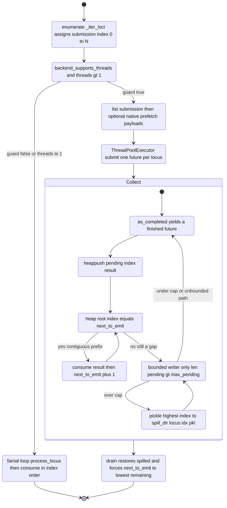

## 9. Parallelization & Performance

This section specifies how LiftOn parallelizes **Step 7** (the per-Liftoff-gene processing loop, the wall-clock hot-spot) while preserving **byte-for-byte identical output** across worker counts, and the supporting utilities (interval tree, statistics report, logging, exception hierarchy). All file/line citations are real and point at the source as read.

The defining contract: `parallel_step7(..., threads=N)` produces the same output bytes as `parallel_step7(..., threads=1)`. The only externally observable change under parallelism is wall-clock time (`lifton/parallel.py:6-12`).

### 9.1 Threading model

LiftOn uses `concurrent.futures.ThreadPoolExecutor` for worker dispatch, **never** `ProcessPoolExecutor`. The choice is forced by two facts, both documented at `lifton/parallel.py:14-22`:

| Fact | Consequence |
|---|---|
| Both FeatureDB backends — `gffutils.FeatureDB` over SQLite, and `lifton.gffbase.FeatureDB` over DuckDB — hold open database **connection objects** that are **not picklable** across process boundaries. | A `ProcessPoolExecutor` would require either re-opening DBs in each child (expensive, fragile) or serializing connection state (impossible). Threads share the parent's connections by reference at zero IPC cost. |
| `parasail` (the alignment hot loop, `nw_trace_scan_sat`) **explicitly releases the GIL** while computing the Needleman-Wunsch trace. | Threads achieve **real parallel speedup** on the CPU-bound alignment work despite Python's GIL, because the GIL is not held during the dominant compute. |

**Why processes were rejected** (explicit in source comment, `lifton/parallel.py:14-22`): the IPC + DB-reopen complexity of processes is unjustified when parasail already gives GIL-free parallelism through threads. The only cost threads cannot avoid is shared-connection thread-safety, which Step 7 historically dodged by running serially when the backend could not serve concurrent worker reads (§9.4), and which Phase 17 eliminated entirely under `--native` via materialised payloads + read-only proxy DBs (§9.3).

**The mutation discipline that makes threads safe:**

- `StepContext` (`lifton/locus_pipeline.py:24-43`) is an *immutable-ish* bundle built once in the parent and shared by reference to every worker. The only mutations are inside alignment helpers, on private members already covered by the test suite (`lifton/locus_pipeline.py:28-30`).
- Workers **never** call `write_entry`. They return a `LocusResult`; the **parent thread is the sole caller** of `consume(...)` → `write_entry(...)`. This single-writer discipline is what makes output deterministic (`lifton/locus_pipeline.py:11-14`, `lifton/parallel.py:253-256`).
- The output GFF3 file handle `fw` and the stats dict `transcripts_stats_dict` are owned by the parent and mutated **only** from the parent thread (`lifton/parallel.py:253-256`).

### 9.2 Deterministic ordering

#### 9.2.1 The submission index

The deterministic emit order is established by `_iter_loci` (`lifton/parallel.py:170-181`):

```python
def _iter_loci(features, l_feature_db):
    for feature in features:
        for locus in l_feature_db.features_of_type(feature):
            yield feature, locus
```

`parallel_step7` wraps this in `enumerate(...)` (`lifton/parallel.py:271`): `submission = enumerate(_iter_loci(features, l_feature_db))`. The integer index assigned by `enumerate` is the **submission index**. It defines the canonical visit order — the same order the legacy serial loop walked — and becomes the emission key in the parallel path. The serial baseline is byte-equal to the parallel path *by construction* because both use this same index sequence (`lifton/parallel.py:172-178`).

**Gotcha:** Iteration order of `features_of_type` must be stable for a given DB. The submission index is meaningless if `features_of_type` returns rows in nondeterministic order; LiftOn relies on the backend returning a deterministic order for identical inputs. Any change to `_iter_loci` ordering silently breaks the byte-identity gate.

#### 9.2.2 `parallel_step7` dispatch — signature and control flow

```python
def parallel_step7(features, l_feature_db, ctx, fw, transcripts_stats_dict,
                   *, threads=1, progress_every=20) -> int      # parallel.py:232-241
```

| Parameter | Type | Meaning |
|---|---|---|
| `features` | `Iterable[str]` | Feature types to iterate (typically `["gene"]`). |
| `l_feature_db` | FeatureDB | Liftoff DB exposing `features_of_type(...)`. |
| `ctx` | `StepContext` | Immutable context bundle for `process_locus`. |
| `fw` | file handle | Output GFF3 writer; parent-owned. |
| `transcripts_stats_dict` | `dict` | Running gene→counter stats; parent-owned. |
| `threads` | `int` (default `1`) | Worker count. `<= 1` ⇒ serial for-loop. |
| `progress_every` | `int` (default `20`) | Frequency of the `>> LiftOn processed: N features.` progress line. |

Returns: `int` — the number of features processed (emittable or not), mirroring the legacy `processed_features` counter (`lifton/parallel.py:264-269`).

**Control flow** (`lifton/parallel.py:271-447`):

1. Build `submission = enumerate(_iter_loci(features, l_feature_db))` (`:271`).
2. Compute `native_active = bool(getattr(ctx.args, "native", False))` (`:280`).
3. Compute `backend_safe = _backend_supports_threads(l_feature_db, ctx.ref_db, ctx.m_feature_db, native=native_active)` (`:281-284`). See §9.4.
4. **Serial-fallback guard** (`:285-300`): if `not backend_safe and threads is not None and threads > 1`, write the warning to stderr and **force `threads = 1`**.
5. **Serial path** (`:302-315`): if `threads is None or threads <= 1`, loop over `submission`; for each `(idx, (_feature, locus))` call `process_locus(idx, locus, ctx=ctx)` then `consume(result, fw, transcripts_stats_dict)`; set `processed = idx + 1`; emit the progress line when `processed % progress_every == 0`. Return `processed`.
6. **Parallel path** (`:317-447`): materialise the locus list first, then dispatch through a `ThreadPoolExecutor` with one of two ordered-writer implementations (§9.2.3 / §9.2.4).

**Gotcha — `materialised = list(submission)` at `:322`:** the parallel path *fully exhausts* the `enumerate` iterator into a list **before any worker starts**. This is mandatory: gffutils SQLite cursors and gffbase DuckDB result sets are not safe to keep open while worker threads issue concurrent reads on the same connection (`lifton/parallel.py:317-321`). `processed = len(materialised)` (`:323`).

#### 9.2.3 The legacy unbounded-heap ordered writer (default path)

When `ctx.args.writer_max_pending` is unset/zero (the default), the parallel path uses an inline unbounded min-heap (`lifton/parallel.py:411-447`). This is byte-identical to Phase 9 behaviour.

State:
- `next_to_emit = 0` — the submission index expected next.
- `pending = []` — a min-heap of `(submission_index, result)` tuples, keyed by index (`heapq` orders by the first tuple element).

Algorithm:
1. Open a `ThreadPoolExecutor(max_workers=int(threads))` (`:415`).
2. Submit one future per locus. Under `--native` (`payloads is not None`): `ex.submit(process_locus_native, p, ctx)` keyed by `p.submission_index` (`:416-420`). Otherwise: `ex.submit(process_locus, idx, locus, ctx=ctx)` keyed by `idx` (`:421-425`).
3. For each completed future in `as_completed(futures)` (`:427`):
   a. `result = fut.result()` (`:428`).
   b. `heapq.heappush(pending, (result.index, result))` (`:429`).
   c. **Contiguity emission rule** (`:431-438`): `while pending and pending[0][0] == next_to_emit:` pop the heap root, `consume(drained, fw, transcripts_stats_dict)`, increment `next_to_emit`, emit progress line when `next_to_emit % progress_every == 0`.
4. **Defensive final drain** (`:442-446`): after the executor block, `while pending:` pop and consume each remaining entry, incrementing `next_to_emit`. The comment notes this should be empty because `as_completed` enumerates every future (`:440-441`).
5. Return `processed` (`:447`).

**The contiguity rule is the heart of determinism:** a completed result is only emitted when its index *equals* `next_to_emit`. Out-of-order completions wait in the heap; whenever the gap fills (`pending[0][0] == next_to_emit`), a contiguous prefix is flushed in index order. No matter the completion order, emission order is always `0, 1, 2, …` — identical to serial.

#### 9.2.4 `_OrderedWriter` — bounded heap with spill-to-disk (Phase 15d)

When `ctx.args.writer_max_pending > 0` (`lifton/parallel.py:380-381`), the parallel path constructs a temp spill directory via `tempfile.mkdtemp(prefix="lifton_writer_spill_")` (`:382`) and an `_OrderedWriter` (`:383-390`). After the executor block (`:391-403`) it calls `writer.drain()` (`:404`) then attempts `os.rmdir(spill_dir)` (swallowing `OSError`, `:405-408`) and returns `processed` (`:409`).

`_OrderedWriter.__init__` (`lifton/parallel.py:53-66`):

| Field | Type | Meaning |
|---|---|---|
| `spill_dir` | `str` | Directory for spill pickle side-cars. |
| `max_pending` | `int` | In-RAM cap; `max(1, int(max_pending))` so it is always ≥ 1. |
| `consume_fn` | callable | The `consume` function (parent-side emitter). |
| `fw` | file handle | Output writer. |
| `stats` | `dict` | Stats dict. |
| `progress_every` | `int` (default `0`) | Progress-line cadence; `0` disables. |
| `pending` | `list` | Min-heap of `(idx, LocusResult)`. |
| `spilled` | `dict[int, str]` | `idx → pickle path` for entries on disk. |
| `next_to_emit` | `int` | Expected next index. |
| `spill_count` | `int` | Count of spill operations performed. |
| `_spill_dir_made` | `bool` | Lazy directory-creation latch. |

**`offer(result)`** (`:120-126`):
1. `heapq.heappush(self.pending, (result.index, result))`.
2. `self._drain_ready()` — flush any newly-contiguous prefix.
3. `while len(self.pending) > self.max_pending: self._spill_one()` — bound heap depth.

**`_drain_ready()`** (`:128-141`) — loop forever:
1. If `self.pending and self.pending[0][0] == self.next_to_emit`: pop heap root, `self._emit_one(result)`, continue.
2. Else if `self.next_to_emit in self.spilled`: `restored = self._restore(self.next_to_emit)`; if not None, `self._emit_one(restored)`, continue.
3. Else `return`.

**`_emit_one(result)`** (`:111-118`): `self.consume_fn(result, self.fw, self.stats)`; `self.next_to_emit += 1`; if `progress_every` and `next_to_emit % progress_every == 0`, write the progress line.

**`_spill_one()`** (`:73-95`) — spill the **highest-index** pending entry (least likely to be needed soon):
1. If `pending` empty, return.
2. `max_pos = max(range(len(self.pending)), key=lambda i: self.pending[i][0])` — linear scan for max index; O(n) but n ≤ `max_pending` so cheap (`:78-83`).
3. Remove via swap-with-last + heapify: `last = self.pending.pop()`; if `max_pos < len(self.pending)`, `self.pending[max_pos] = last; heapq.heapify(self.pending)` (`:85-89`).
4. `self._ensure_spill_dir()` (lazy `os.makedirs(spill_dir, exist_ok=True)`, `:68-71`).
5. `path = os.path.join(self.spill_dir, f"locus_{idx}.pkl")` (`:91`).
6. `pickle.dump(result, fh, protocol=pickle.HIGHEST_PROTOCOL)` (`:92-93`).
7. `self.spilled[idx] = path; self.spill_count += 1` (`:94-95`).

**`_restore(idx)`** (`:97-109`): `path = self.spilled.pop(idx, None)`; if None return None; load the pickle, then in a `finally` `os.unlink(path)` (swallowing `OSError`). The side-car is deleted on restore.

**`drain()`** (`:143-167`) — emit all remaining buffered/spilled results in submission order:
1. `self._drain_ready()`.
2. `while self.pending or self.spilled:` — handle entries that haven't reached `next_to_emit` because future indices were spilled:
   a. `heap_min = self.pending[0][0] if self.pending else None`.
   b. `spill_min = min(self.spilled) if self.spilled else None`.
   c. `candidates = [c for c in (heap_min, spill_min) if c is not None]`; if empty, return.
   d. `target = min(candidates)`.
   e. If `target == heap_min`, pop heap root; else `result = self._restore(target)` (if None, return).
   f. `self.next_to_emit = target` (forcibly advance), `self._emit_one(result)`.
   g. `self._drain_ready()` to unlock any newly-contiguous work.

**Gotcha — output is identical to the unbounded path** (`lifton/parallel.py:42-51`, `376-379`): `offer(...)` per-result plus a final `drain()` reproduces submission order regardless of how many entries spilled. The spill cap changes *memory*, never *output bytes*. The default (`writer_max_pending == 0`) routes to the inline unbounded heap, which is the byte-identity reference.

**Gotcha — spill side-cars require `LocusResult` to be picklable.** Each spilled result is `pickle.dump`-ed; a `LocusResult` carrying an unpicklable `lifton_gene` would break the bounded path. The default path never pickles, so this only bites when `writer_max_pending > 0` is explicitly requested.

#### 9.2.5 `LocusResult` and `consume`

`LocusResult` (`lifton/locus_pipeline.py:46-65`):

| Field | Type | Default | Meaning |
|---|---|---|---|
| `index` | `int` | — | Submission index (0-based); the ordering key. |
| `locus_id` | `str` | — | gffutils feature id, for logging. |
| `lifton_gene` | `Optional[Any]` | `None` | The assembled `Lifton_GENE`, or None on skip/error. |
| `error` | `Optional[BaseException]` | `None` | Populated when `process_liftoff` raised. |

`LocusResult.emittable` (property, `:57-65`): True iff `lifton_gene is not None` **and** `getattr(lifton_gene, "ref_gene_id", None) is not None` **and** `error is None`.

`consume(result, fw, transcripts_stats_dict) -> bool` (`lifton/locus_pipeline.py:798-824`) — the **single shared emit implementation** for both serial and parallel paths (removes drift):
1. If `result.error is not None`: `logger.log_error("Error during Liftoff gene processing (...): ...")` and `return False`. (Mirrors the inline try/except in `lifton.py` Step 7; log to stderr, swallow, keep going.)
2. If `not result.emittable`: `return False` (absent/invalid genes silently skipped — Phase 5 contract).
3. `result.lifton_gene.write_entry(fw, transcripts_stats_dict); return True`.

`process_locus(submission_index, locus, *, ctx)` (`lifton/locus_pipeline.py:68-114`): thin wrapper that lazily imports `run_liftoff` and calls `run_liftoff.process_liftoff(None, locus, ctx.ref_db, ctx.l_feature_db, ctx.ref_id_2_m_id_trans_dict, ctx.m_feature_db, ctx.tree_dict, ctx.tgt_fai, ctx.ref_proteins, ctx.ref_trans, ctx.ref_features_dict, ctx.fw_score, ctx.fw_chain, ctx.args, ENTRY_FEATURE=True)` inside `try/except Exception`. **Gotcha — `except Exception`, not `except BaseException`** (`:100-103`): `KeyboardInterrupt`, `SystemExit`, `GeneratorExit` are `BaseException` but not `Exception`, so they **propagate** and let Ctrl-C kill the whole pool instead of being silently packaged into a `LocusResult`. On a caught `Exception` it returns `LocusResult(index, locus_id=getattr(locus,"id","<unknown>"), lifton_gene=None, error=exc)`; on success `LocusResult(index, locus_id, lifton_gene=gene)`.

#### 9.2.6 Diagram D8 — dispatch + ordered-writer state machine



### 9.3 Phase-17 materialisation (the `--native` parallel path)

Under `--native`, workers are **fully decoupled** from the shared FeatureDB connections. The parent thread pre-fetches everything `run_liftoff.process_liftoff` will read into a `MaterialisedLocus` payload, and workers consume it through read-only proxy DBs. This is what allows the thread-safety guard (§9.4) to return True for **any** backend under `--native`.

#### 9.3.1 Parallel-path branch (`parallel_step7`, `:325-374`)

After `materialised = list(submission)`, if `native_active`:
1. Lazily import `materialise_locus, process_locus_native, _ThreadLocalCtxFactory, materialise_locus_with_factory` (`:341-344`).
2. `factory = _ThreadLocalCtxFactory(ctx)` (`:345`).
3. If `factory.viable and len(materialised) > 0` (`:346`) — **parallel prefetcher pool**:
   - `prefetch_workers = min(4, int(threads), max(1, len(materialised)))` (`:351-352`). Capped at 4 because marginal gain plateaus (~50-60% reduction at N=4); a larger pool increases SQLite contention without commensurate speedup (`:347-350`).
   - `payloads = [None] * len(materialised)` (`:353`).
   - In a `ThreadPoolExecutor(max_workers=prefetch_workers, thread_name_prefix="lifton-prefetch")` (`:354-356`), submit `materialise_locus_with_factory(idx, locus, factory)` per locus (`:357-363`); for each `as_completed` future, store the result at `payloads[_p.submission_index] = _p` (`:364-366`).
4. Else (in-memory backends or non-extractable `dbfn`) — **serial parent-thread fallback** (`:367-374`): `payloads = [materialise_locus(idx, locus, ctx) for idx, (_feature, locus) in materialised]`.

When `payloads is not None`, the executor submits `process_locus_native(p, ctx)` keyed by `p.submission_index`; otherwise it submits `process_locus(idx, locus, ctx=ctx)` (both ordered-writer paths, `:391-425`).

#### 9.3.2 `MaterialisedLocus` (`lifton/locus_pipeline.py:270-317`)

A frozen-by-convention snapshot of every input `process_liftoff` needs for one Liftoff gene. All fields are populated in the parent thread by `materialise_locus` **before any worker starts**.

| Field | Type | Meaning |
|---|---|---|
| `submission_index` | `int` | Ordering key. |
| `locus` | `Any` | The gffutils.Feature snapshot for the gene. |
| `locus_id` | `str` | The locus id. |
| `children_l1` | `list` | Legacy flat field: `children(level=1)` of the locus. |
| `exon_children` | `list` | Legacy flat field: level-1 exon children of the locus. |
| `cds_children` | `list` | Legacy flat field: `children(featuretype="CDS", order_by="start")`. |
| `cds_stop_children` | `list` | Legacy flat field: `children(featuretype=("CDS","stop_codon"))`. |
| `ref_gene_id` | `Optional[str]` | Reference gene id for the locus. |
| `ref_trans_id` | `Optional[str]` | Reference transcript id for the locus. |
| `ref_gene_attrs` | `dict` | Legacy flat copy of ref gene attributes. |
| `ref_trans_attrs` | `dict` | Legacy flat copy of ref transcript attributes. |
| `feature_cache` | `Dict[str, _FeaturePreFetch]` | Canonical worker l_feature_db cache; covers the entire transitive descent. |
| `ref_attrs_cache` | `Dict[str, dict]` | Canonical worker ref_db cache: `id → attributes`. |
| `miniprot_cache` | `Dict[str, _MiniprotPreFetch]` | Canonical worker m_feature_db cache: `m_id → prefetch`. |

The legacy flat fields are a thin back-compat surface kept so existing tests keep passing; the three caches are the canonical worker access path (`:285-289`).

`_FeaturePreFetch` (`:121-141`) — pre-fetched `l_feature_db` data for one feature:

| Field | Type | Captures the call signature |
|---|---|---|
| `feature` | `Any` | The Feature object itself. |
| `children_l1` | `list` | `children(level=1)` (any type). |
| `exon_children_l1` | `list` | `children(featuretype='exon', level=1, order_by='start')`. |
| `exon_children_full` | `list` | `children(featuretype='exon', order_by='start')` (no level). |
| `cds_stop_children` | `list` | `children(featuretype=('CDS','stop_codon'), order_by='start')`. |

`_MiniprotPreFetch` (`:143-154`):

| Field | Type | Meaning |
|---|---|---|
| `feature` | `Any` | The mRNA Feature (`m_feature_db[m_id]`). |
| `cds_stop_children` | `list` | `children(m_entry, featuretype=('CDS','stop_codon'), order_by='start')`. |

#### 9.3.3 The proxy DBs

Three read-only proxies replace the real DBs in the worker's `StepContext`. They satisfy the **exact** access patterns `run_liftoff.process_liftoff` uses and raise on any uncached signature (fail-loud, so a future refactor that adds a new query is caught immediately).

**`_RefDbProxy`** (`:157-177`, `__slots__ = ("_attrs_cache",)`): backed by `{id → attributes}`.
- `__getitem__(feature_id)`: if `feature_id not in self._attrs_cache`, raise `KeyError(feature_id)`; else return `_RefFeatureStub(feature_id, attrs)`. (Mirrors the only ref_db reads in run_liftoff: `ref_db[id].attributes` and the `ref_db[ref_trans_id]` existence check at `run_liftoff.py:252`, caught with `(KeyError, FeatureNotFoundError)`.)

**`_RefFeatureStub`** (`:179-187`, `__slots__ = ("id", "attributes")`): a minimal Feature-shaped object exposing only `.id` and `.attributes`.

**`_LFeatureDbProxy`** (`:190-235`, `__slots__ = ("_cache",)`): backed by `{feature_id → _FeaturePreFetch}`.
- `__getitem__(feature_id)`: KeyError on miss, else `self._cache[feature_id].feature`.
- `children(feature, featuretype=None, level=None, order_by=None)` — **exact dispatch table** (`:209-235`):
  1. `feature_id = getattr(feature, "id", feature)` (accepts a Feature or a raw id).
  2. `entry = self._cache.get(feature_id)`; if None, return `iter([])`.
  3. If `featuretype == "exon" and level == 1`: return `iter(entry.exon_children_l1)`.
  4. If `featuretype == "exon" and level is None`: return `iter(entry.exon_children_full)`.
  5. If `featuretype == ("CDS", "stop_codon")`: return `iter(entry.cds_stop_children)`.
  6. If `featuretype is None and level == 1`: return `iter(entry.children_l1)`.
  7. Else: raise `NotImplementedError("_LFeatureDbProxy.children: un-cached signature ...")`.

**`_MFeatureDbProxy`** (`:238-267`, `__slots__ = ("_cache",)`): backed by `{m_id → _MiniprotPreFetch}`.
- `__getitem__(m_id)`: KeyError on miss, else `self._cache[m_id].feature`.
- `children(feature, featuretype=None, level=None, order_by=None)` (`:255-267`): `m_id = getattr(feature, "id", feature)`; `entry = self._cache.get(m_id)`; if None return `iter([])`; if `featuretype == ("CDS", "stop_codon")` return `iter(entry.cds_stop_children)`; else raise `NotImplementedError` (the only signature the per-locus body uses is `('CDS','stop_codon')`).

**Gotcha — byte-identity rests on `order_by='start'` consistency.** The proxies return the same Feature objects in the same order the real DBs would, **because the cache was built with the same `order_by='start'`** (`:196-198`, `765-769`). If `_walk_and_cache_features` ever cached with a different ordering than `run_liftoff` queries, the native path would diverge from serial.

#### 9.3.4 `_walk_and_cache_features` — the four children() variants + Variant-3 dedup

`_walk_and_cache_features(feature, ctx, payload, *, depth=0, max_depth=8)` (`lifton/locus_pipeline.py:320-414`) recursively pre-fetches every `l_feature_db` access `process_liftoff` will issue under `feature` (the legacy code at `run_liftoff.py:226-260`).

1. `feature_id = getattr(feature, "id", None)`; if `feature_id is None` or already in `payload.feature_cache`, return (`:340-342`).
2. If `depth > max_depth` (default 8), `logger.log_warning(...)` and return. The `max_depth=8` guard mirrors the V5.2 cycle-detection guard at `run_liftoff.py:212-224`; deeper nesting is pathological (`:343-349`).
3. `entry = _FeaturePreFetch(feature=feature)`.
4. **Variant 1** (`:352-362`): `entry.exon_children_l1 = list(children(feature, featuretype="exon", level=1, order_by="start"))`, wrapped in try/except that logs a warning on failure.
5. **Variant 2** (`:363-371`): `entry.children_l1 = list(children(feature, level=1))`, same warning-on-failure.
6. **Variant 3 with dedup** (`:372-396`): if `entry.exon_children_l1` is non-empty, set `entry.exon_children_full = list(entry.exon_children_l1)` (skip the real query); else run `entry.exon_children_full = list(children(feature, featuretype="exon", order_by="start"))`. **Phase 17c Win 1 rationale** (`:372-383`): in standard GFF3 (gene → mRNA → exon, exons as leaves), Variant 3 is only invoked on transcript-shaped features (those reached via the `len(exon_children) > 0` branch at `run_liftoff.py:240`), and on those *all* exons are level-1 by the leaf-exon convention, so `Variant 3 ⊇ Variant 1` holds *with equality* and the second query is redundant. The fallback (real query when no level-1 exons) is kept for gene-level features that might be asked for Variant 3 defensively.
7. **Variant 4** (`:397-407`): `entry.cds_stop_children = list(children(feature, featuretype=("CDS", "stop_codon"), order_by="start"))`, warning-on-failure.
8. `payload.feature_cache[feature_id] = entry` (`:408`).
9. **Recurse** into every level-1 child so the proxy can satisfy the `process_liftoff` recursion at `run_liftoff.py:239`: `for child in entry.children_l1: _walk_and_cache_features(child, ctx, payload, depth=depth+1, max_depth=max_depth)` (`:410-414`).

**Gotcha — uncached descent surfaces as KeyError on the proxy.** If the hierarchy exceeds `max_depth`, deeper features are not pre-fetched and the proxy will raise `KeyError`/return `iter([])` (`:346-348`). This is intentional: pathological depth is treated as input error, not silently completed.

#### 9.3.5 Ref-attr and miniprot cache population

`_maybe_cache_ref_attrs(payload, ref_db, ref_id)` (`:417-431`): no-op if `ref_id is None` or already cached; else `attrs = copy.deepcopy(ref_db[ref_id].attributes); payload.ref_attrs_cache[ref_id] = attrs`, swallowing any exception (a miss leaves the entry absent → proxy raises KeyError, which `run_liftoff.py:253` catches).

`_populate_ref_attrs_for_descent(payload, ctx)` (`:434-472`):
1. Compute the locus-level `(ref_gene_id, ref_trans_id_for_gene)` via `lifton_utils.get_ref_ids_liftoff(ctx.ref_features_dict, locus_id, None)` (swallow → `(None, None)`), set `payload.ref_gene_id/ref_trans_id`, cache both via `_maybe_cache_ref_attrs` (`:445-454`).
2. For each cached transcript-shaped feature (`entry.exon_children_l1` non-empty) other than the locus itself, compute `(r_gene_id, r_trans_id) = get_ref_ids_liftoff(ctx.ref_features_dict, locus_id, fid)` (skip on exception) and cache both attrs (`:459-472`). This mirrors what the recursive call site at `run_liftoff.py:244` computes.

`_populate_miniprot_cache(payload, ctx)` (`:475-511`): no-op if `ctx.m_feature_db is None`. Otherwise, for every `r_trans_id` in `payload.ref_attrs_cache.keys()` (the only ones the legacy code looks up via `ref_id_2_m_id_trans_dict`), get `m_ids = ctx.ref_id_2_m_id_trans_dict.get(r_trans_id) or []`; for each not-already-cached `m_id`, fetch `m_entry = ctx.m_feature_db[m_id]` (warn+skip on failure) and `cds_stop = list(children(m_entry, featuretype=("CDS","stop_codon"), order_by="start"))` (warn+`[]` on failure); store `payload.miniprot_cache[m_id] = _MiniprotPreFetch(feature=m_entry, cds_stop_children=cds_stop)`.

#### 9.3.6 `materialise_locus` — orchestrator (`:514-582`)

Parent-thread-only. Steps:
1. Build `payload = MaterialisedLocus(submission_index, locus, locus_id)`.
2. `_walk_and_cache_features(locus, ctx, payload)` inside try/except (warn on failure).
3. Populate legacy flat fields from the locus cache entry: `children_l1`, `exon_children` (= `exon_children_l1`), `cds_stop_children`; plus `cds_children = list(children(locus, featuretype="CDS", order_by="start"))` (a separate historical query asserted on by the test suite, fetched explicitly) (`:545-564`).
4. `_populate_ref_attrs_for_descent(payload, ctx)` (`:567`).
5. Mirror ref attrs into flat fields: `ref_gene_attrs`/`ref_trans_attrs` from the cache (`:569-577`).
6. `_populate_miniprot_cache(payload, ctx)` (`:580`).
7. Return `payload`.

#### 9.3.7 `_build_proxied_ctx` and `process_locus_native`

`_build_proxied_ctx(payload, ctx)` (`:718-747`): constructs a worker-local `StepContext` with `ref_db=_RefDbProxy(payload.ref_attrs_cache)`, `l_feature_db=_LFeatureDbProxy(payload.feature_cache)`, `m_feature_db=_MFeatureDbProxy(payload.miniprot_cache) if ctx.m_feature_db is not None else None`. Every other field passes through unchanged — `tree_dict` is a read-only IntervalTree (immutable after Step 6), `ref_proteins`/`ref_trans` are `pyfaidx.Fasta` mmaps (thread-safe), `ref_features_dict`/`ref_id_2_m_id_trans_dict` are read-only dicts, `fw_score`/`fw_chain` are short-write handles (GIL-protected buffered I/O), `args` is immutable.

`process_locus_native(payload, ctx) -> LocusResult` (`:750-795`): the worker-thread-safe entry point. Builds `proxy_ctx = _build_proxied_ctx(payload, ctx)`, then calls `run_liftoff.process_liftoff(None, payload.locus, proxy_ctx.ref_db, proxy_ctx.l_feature_db, ..., ENTRY_FEATURE=True)` inside `try/except Exception` (same Exception-not-BaseException discipline as `process_locus`). Returns a `LocusResult` carrying `payload.submission_index`/`payload.locus_id`. Byte-identity is preserved by construction: the proxies return the same Feature objects (or attribute stubs for ref_db), in the same order, as the real DBs; the legacy algorithmic path is unchanged (`:764-769`).

#### 9.3.8 `_ThreadLocalCtxFactory` (Phase 17c prefetcher backing)

`_ThreadLocalCtxFactory` (`:589-698`, `__slots__ = ("_parent_ctx","_ref_dbfn","_l_dbfn","_m_dbfn","_local")`) builds per-thread `StepContext` instances whose FeatureDB fields point to **fresh** connections opened on the calling thread. The materialise-side bottleneck (Phase 17b: ~33 s bee / ~84 s rice / ~5 min human at 110K transcripts) is SQLite query latency on a single shared connection; per-thread DBs parallelise it.

- `__init__(parent_ctx)`: extracts `_ref_dbfn`, `_l_dbfn`, `_m_dbfn` via `_extract_dbfn`, and creates `self._local = threading.local()` (`:617-623`).
- `_extract_dbfn(db)` (static, `:625-639`): returns `db.dbfn` if it is a non-empty `str`, not `":memory:"`, and `os.path.exists(dbfn)`; else None (in-memory/blob/non-FeatureDB inputs).
- `viable` (property, `:641-647`): `self._l_dbfn is not None` — only the **Liftoff** DB needs a reopen-able path; ref/miniprot may be None/in-memory and the dominant cost (l_feature_db queries) still parallelises.
- `_open_thread_db(parent_db, dbfn)` (static, `:649-671`): if `parent_db is None` return None; if `dbfn is None` return `parent_db` unchanged (in-memory backends — their cross-thread reads are safe, only on-disk SQLite hard-binds connections); else `cls = type(parent_db); return cls(dbfn)` (matches gffutils vs gffbase), falling back to `parent_db` on any exception.
- `get()` (`:673-698`): returns the thread's cached `self._local.ctx` if present; otherwise constructs a `StepContext` with `_open_thread_db`-opened `ref_db`/`l_feature_db`/`m_feature_db` and **by-reference** copies of all non-DB fields, caches it on `self._local.ctx`, and returns it.

`materialise_locus_with_factory(submission_index, locus, factory)` (`:701-711`): worker-side materialise — `ctx = factory.get()` then `return materialise_locus(submission_index, locus, ctx)`. Output is byte-equivalent to the parent-thread variant: the same `locus` queried against the same on-disk SQLite gives the same children + ref attributes.

**Fallback chain** (`parallel.py:346, 367-374`): if `not factory.viable` (no reopen-able Liftoff `dbfn`, e.g. in-memory blob backends) or `len(materialised) == 0`, the prefetcher pool is skipped and materialisation runs in the legacy parent-thread serial loop — correct, just without prefetch speedup.

### 9.4 Thread-safety guard `_backend_supports_threads`

`_backend_supports_threads(*dbs, native=False) -> bool` (`lifton/parallel.py:184-229`) decides whether per-locus tasks can run on worker threads given the supplied FeatureDB inputs.

**Exact decision tree:**
1. `import os as _os`.
2. If `_os.environ.get("LIFTON_PARALLEL_FORCE")` is truthy → **return True** (escape hatch overriding everything; for advanced users/CI who have verified thread-safety on their stack) (`:215-216`).
3. If `not native` → **return False** (Phase 9 legacy path: workers would issue cold `db.children(...)` reads against the shared connection, unsafe on SQLite and not great on DuckDB; dispatcher falls back to serial) (`:217-218`).
4. If `_os.environ.get("LIFTON_PARALLEL_BLOCK_GFFUTILS")` is truthy → for each non-None `db` in `dbs`, compute `module = type(db).__module__ or ""`; if `module.startswith("gffutils")` → **return False** (a rarely-needed opt-out restoring the pre-Phase-17 strict rejection for gffutils; useful only if a future regression re-introduces a worker-side DB read) (`:222-228`).
5. Else → **return True** (under `--native`, workers go through the `MaterialisedLocus` payload + proxy DBs and never touch the real FeatureDB, so any backend is safe) (`:229`).

| Condition | Result |
|---|---|
| `LIFTON_PARALLEL_FORCE` set (any truthy value) | True (unconditional) |
| `native == False` (no `--native`) | False (serial fallback) |
| `native == True`, `LIFTON_PARALLEL_BLOCK_GFFUTILS` set, any `db` is a gffutils type | False |
| `native == True`, no block env, or no gffutils db | True |

**Serial-fallback warning** (`parallel.py:285-300`): when `not backend_safe and threads is not None and threads > 1`, LiftOn writes a multi-line message to **stderr** beginning `[LiftOn] --locus-pipeline requested with threads={} but the active FeatureDB backend cannot serve concurrent worker reads (no --native, no LIFTON_PARALLEL_FORCE). Falling back to serial execution. Use --native to unlock parallelism via the materialised-payload + proxy-DB path (Phase 17b).` and sets `threads = 1`. Post-Phase-17 this warning fires only when (a) `--native` is OFF, or (b) `LIFTON_PARALLEL_BLOCK_GFFUTILS` is set with a gffutils backend.

### 9.5 Memory & compute bottlenecks

| Bottleneck | Location | Scaling / behaviour | Mitigation |
|---|---|---|---|
| Step 7 parasail alignment | per-locus, inside `process_liftoff` (dispatched by `process_locus`) | Needleman-Wunsch is **O(P·R)** in protein length P × reference length R per transcript; this is the wall-clock hot-spot. parasail releases the GIL during `nw_trace_scan_sat` (`parallel.py:18-21`), so CPU cost parallelises across threads. | `--threads N` + `--locus-pipeline` (+ `--native` to unlock the materialised-payload thread-safe path). |
| Parent-thread serial materialise | `materialise_locus` loop | ~33 s bee / ~84 s rice / ~5 min human at 110K transcripts under `--native` if done serially (`locus_pipeline.py:593-599`). | Phase 17c parallel prefetcher pool (`_ThreadLocalCtxFactory`, §9.3.8), capped at `min(4, threads, len)` prefetchers; ~50-60% reduction at N=4. |
| Reference sequence extraction (peak RSS) | streaming RefSeqProvider extractor (Step 3, default path, Phase 15b) | The historical dominant memory hot-spot — a full in-memory dict of every transcript/protein sequence — is replaced by streaming `transcripts.fa`/`proteins.fa` to disk and re-opening via lazy `pyfaidx.Fasta` mmap. Per the project notes, the "dominant memory hot-spot" caveat no longer applies on the default path. | Default path is already streaming; `ref_proteins`/`ref_trans` in `StepContext` are mmap-backed and thread-safe (`locus_pipeline.py:726-727`). |
| miniprot output drain (peak RSS) | bounded miniprot drain (Step 5, Phase 15c) | Bounded so miniprot stdout/round-trip does not accumulate unboundedly in RAM. | Bounded drain on the streaming path. |
| Ordered-writer pending heap (peak RSS) | `parallel.py` parallel path | The default unbounded heap can hold up to N pending `LocusResult`s if completions are heavily out of order. | Setting the `writer_max_pending` args attribute `> 0` (programmatic only — **no CLI flag currently exposes it**; defaults to `0` = unbounded) ⇒ `_OrderedWriter` caps in-RAM pending at that value and spills the rest to `locus_{idx}.pkl` side-cars (§9.2.4); output bytes unchanged. |

**Gotcha — peak-RSS vs the byte-identity contract:** none of the memory mitigations (streaming extractor, bounded miniprot drain, writer spill) change output bytes. The 24-cell matrix pins this. Memory flags are for fitting larger genomes in RAM, never for changing results.

### 9.6 Support utilities

#### 9.6.1 Interval tree (`lifton/intervals.py`)

`_make_interval(start, end, locus_id)` (`:4-11`): returns `Interval(start, end, locus_id)`. **V2.8 fix** — `intervaltree` disallows zero-length intervals (`start == end`), but NCBI GFF3 permits single-base features; so **if `end <= start`, set `end = start + 1`** (widen the half-open end by 1) so the tree builds without crashing.

`initialize_interval_tree(l_feature_db, features)` (`:14-24`):
1. `tree_dict = {}`.
2. For each `feature` type in `features`, for each `locus` in `l_feature_db.features_of_type(feature)`:
   a. `gene_interval = _make_interval(locus.start, locus.end, locus.id)`.
   b. `chromosome = locus.seqid`.
   c. If `chromosome not in tree_dict.keys()`: `tree_dict[chromosome] = IntervalTree()`.
   d. `tree_dict[chromosome].add(gene_interval)`.
3. Return `tree_dict` — a `{seqid → IntervalTree}` mapping over gene intervals, consumed read-only in Step 7 (becomes `StepContext.tree_dict`).

**Gotcha — single-base widening alters interval semantics by 1 bp.** A feature with `start == end == 100` is stored as `[100, 101)`. Containment/overlap queries against it therefore include position 100 only (half-open). This is deliberate and required for the tree to build at all.

#### 9.6.2 Statistics report (`lifton/stats.py`)

`print_report(ref_features_dict, transcripts_stats_dict, fw_unmapped, fw_extra_copy, fw_mapped_feature, fw_mapped_trans, debug=False)` (`:4`).

**Counters initialised to 0** (`:16-26`): `LIFTED_FEATURES`, `MISSED_FEATURES`, `LIFTED_SINGLE_CODING_FEATURES`, `LIFTED_SINGLE_NONCODING_FEATURES`, `LIFTED_SINGLE_OTHER_FEATURES`, `LIFTED_EXTRA_CODING_FEATURES`, `LIFTED_EXTRA_NONCODING_FEATURES`, `LIFTED_EXTRA_OTHER_FEATURES`, `LIFTED_EXTRA_CODING_SUM_FEATURES`, `LIFTED_EXTRA_NONCODING_SUM_FEATURES`, `LIFTED_EXTRA_OTHER_SUM_FEATURES`.

**Gene/feature aggregation loop** (`:29-69`): for each `feature` in `ref_features_dict.keys()`:
1. **Skip** the sentinel `"LiftOn-gene"` key (`:30-31`).
2. `copy_num = ref_features_dict[feature].copy_num`.
3. If `copy_num >= 1` (mapped) (`:34-60`):
   - `LIFTED_FEATURES += 1`.
   - Classify by `is_protein_coding` → `"coding"`, elif `is_non_coding` → `"non-coding"`, else `"other"`.
   - For the matching class: if `copy_num == 1` increment the `SINGLE_*` counter; else increment the `EXTRA_*` counter **and** add `copy_num` to the `EXTRA_*_SUM` counter.
   - Write `f"{feature}\t{copy_num}\t{TYPE}\n"` to `fw_mapped_feature`; if `copy_num > 1` also write the same line to `fw_extra_copy`.
4. Elif `copy_num == 0` (missed) (`:61-69`): `MISSED_FEATURES += 1`; classify TYPE the same way; write `f"{feature}\t{TYPE}\n"` to `fw_unmapped`.

**Gotcha — `copy_num` is never negative in practice but only `>= 1` and `== 0` are handled.** A hypothetical negative copy_num falls through both branches silently.

**Transcript stats loop** (`:72-74`): for each `(TYPE, transs)` in `transcripts_stats_dict.items()`, for each `(trans, trans_copy_num)` in `transs.items()`, write `f"{trans}\t{trans_copy_num}\t{TYPE}\n"` to `fw_mapped_trans`.

**Side-car writers** (parameters): `fw_unmapped` (missed features), `fw_extra_copy` (features with copy_num > 1), `fw_mapped_feature` (all mapped features), `fw_mapped_trans` (all mapped transcripts). Each is a plain text file handle written tab-separated.

**Summary block to stderr** (`:76-94`): prints a banner and the aggregate lines. Total reference features is `len(ref_features_dict.keys()) - 1` (the `-1` excludes the `"LiftOn-gene"` sentinel, `:77`). "Lifted feature" shows the total plus a coding/non-coding/other breakdown. "Total features in target" sums `SINGLE_* + EXTRA_*_SUM` across the three classes (counting every copy of multi-copy features), with per-class single-copy and >1-copy sub-totals. The final `*****` line (`:94`) prints to **stdout** (no `file=sys.stderr`), unlike all the others.

#### 9.6.3 Logger (`lifton/logger.py`)

ANSI colour is enabled only when `sys.stderr.isatty()` (`_USE_COLOUR`, `:4`); on a non-TTY all colour constants are empty strings so log files stay clean. Codes: `_RESET`, `_YELLOW` (33), `_RED` (31), `_GREEN` (32), `_BOLD` (1) (`:5-9`).

| Function | Line | Behaviour |
|---|---|---|
| `log(*argv, debug=False)` | `12-24` | Prints to stderr **only when `debug=True`** (the gated debug logger). |
| `log_info(*argv)` | `27-29` | Always prints to stderr (no debug gate). |
| `log_warning(*argv)` | `32-34` | Prints `[WARNING]` (yellow+bold) prefix + args to stderr. |
| `log_error(*argv)` | `37-39` | Prints `[ERROR]` (red+bold) prefix + args to stderr. |
| `log_success(*argv)` | `42-44` | Prints `✓` (green) prefix + args to stderr. |
| `log_section(title, body_lines, kind="info")` | `47-86` | Prints a boxed header to stderr (width 70). |

`log_section` (`:47-86`): `colour_map = {"info": "", "warning": _YELLOW, "error": _RED, "success": _GREEN}`; unknown `kind` → no colour. Draws box-drawing borders `╔═╗`/`╠═╣`/`╚═╝` of width 70; `_row(text)` pads `║  {text}{pad}  ║` where `pad = max(0, width - 4 - len(text))`. Prints `top`, the title row, then (if `body_lines`) the separator and each body line wrapped to `width - 6` (= 64) chars via `_wrap_line`, then `bottom`. `_wrap_line(text, max_width)` (`:89-99`): returns `[text]` if it fits, else greedily slices `max_width`-char chunks.

#### 9.6.4 Exception hierarchy (`lifton/exceptions.py`)

Phase 13.5B replaced bare `except:`/broad `except Exception:` swallows with a named hierarchy so callers can catch *LiftOn* failures without swallowing `KeyboardInterrupt`, `SystemExit`, or unrelated programming errors (`:1-8`).

```
LiftOnError(Exception)              # :13-14  root of the hierarchy
├── LiftOnInputError(LiftOnError)   # :17-20  invalid/unprocessable user input (annotation, FASTA, aux file); always user-fixable, never an internal logic bug
└── LiftOnAlignmentError(LiftOnError) # :23-25  alignment cannot proceed (parasail kernel failure, BioPython translation aborted, CIGAR parse failure)
```

`LiftOnInputError` is the type raised on circular `Parent=` cycles in `run_liftoff.process_liftoff` (`run_liftoff.py:219-223`), and is one of the exceptions the materialise/proxy paths catch (the ref-existence check at `run_liftoff.py:252-253` catches `(KeyError, FeatureNotFoundError)`, the dict/gffbase-miss and gffutils-miss respectively).

**Gotcha — `process_locus`/`process_locus_native` catch `Exception`, not `LiftOnError`.** A `LiftOnInputError` raised inside a worker is caught (it is an `Exception` subclass) and packaged into `LocusResult.error`, then logged by `consume` and skipped — one bad locus cannot kill sibling workers (`locus_pipeline.py:100-109`, `784-790`).
